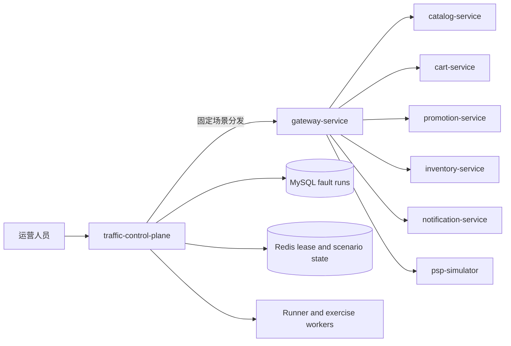

# Castrel 故障演练控制面技术设计

## 文档信息

| 项目 | 内容 |
| --- | --- |
| 状态 | 方案基线 |
| 版本 | 1.0 |
| 更新时间 | 2026-09-02 CST |
| 配套文档 | [product.md](product.md) |

> 商品详情 Redis 回源与 Hash 大值的跨域增量设计见 [商品详情缓存专题技术设计](../scenarios/catalog-product-detail-cache/tech.md)；它不兼容替换本文原有的 Cart/Sam Redis 大值实现。

## 1. 架构与约束

本设计以不兼容替换方式废弃现有通用混沌协议。控制流保持：



- `traffic-control-plane` 是故障运行的持久化协调者，持有唯一的运行状态、到期调度、审计与恢复结果；全环境同一时刻只允许一条创建中、活动或恢复中的运行。
- `gateway-service` 只接受固定场景和固定目标的内部转发，不再执行任意服务列表的并行 fan-out。
- 场景所属服务只接受本场景的窄内部操作；Gateway 与目标之间传播运行 ID、到期时间、fencing token、幂等键和内部服务认证。
- 服务侧日志、注释、类/方法/Endpoint 名称使用中性业务或运维词汇；运行归因仅放在受保护控制面数据和审计中。
- 所有服务、worker、MySQL 会话与日切逻辑统一使用东八区 `+08:00`；不得依赖容器、JVM 或数据库默认时区。
- 删除旧的 `ChaosService`、`ChaosController`、`ChaosDispatchController`、`ChaosDispatchService`、旧 DTO、旧 `/internal/chaos/**`、旧 `/internal/gateway/chaos/**`、旧控制面路由/UI、网络延迟/重置面板及其配置/脚本/仪表盘引用。

## 2. Fault Run 持久化与协调

### 2.1 数据模型

控制面新增 `fault_runs`：

| 列 | 说明 |
| --- | --- |
| `id` | UUID 主键。 |
| `scenario` | 枚举场景代码。 |
| `target_service` / `target_operation` | 固定目标快照。 |
| `state` | `CREATING`、`ACTIVE`、`RECOVERING`、`RECOVERED`、`STOPPED`、`FAILED`、`SERVICE_UNAVAILABLE`。 |
| `parameters_json` | 通过场景 catalog 校验后的参数。 |
| `fencing_token` | 创建时递增的运行令牌，防止旧控制面实例或过期请求重新启用资源。 |
| `started_at` / `expires_at` / `stopped_at` | 生命周期时间。 |
| `stop_reason` | 到期、人工停止、调度异常、服务不可用。 |
| `recovery_result` / `recovery_error` | 恢复结果。 |
| `operator_audit_id` / `trace_id` | 审计和观测关联。 |

索引至少覆盖 `(state, expires_at)`、`(scenario, started_at)` 与 `target_service`。使用数据库事务与只允许一行的活动运行约束，保证最多一条 `CREATING`、`ACTIVE` 或 `RECOVERING` 运行；已有活动运行时返回冲突与其运行 ID。运行创建先持久化为 `CREATING`，成功收到目标确认后转为 `ACTIVE`；分发失败必须执行已启动目标的补偿并记录失败。

新增 `fault_run_events`，以 `fault_run_id` 保存运行创建、目标确认、Runner 调用汇总、停止、恢复和错误事件。运行详情只从 `fault_runs`、`fault_run_events` 和运行专属审计明细读取证据，不新增 Prometheus 指标或业务服务日志。每日清理 `stopped_at` 或 `created_at` 超过 7 天且不属于未终止运行的 `fault_runs`、`fault_run_events` 和运行专属审计明细。

### 2.2 协调器

`FaultRunCoordinator` 负责：

1. 从唯一的 TypeScript 场景 catalog 校验参数、持续时间和固定目标；
2. 创建运行记录并经 Gateway 分发；
3. 以 `expiresAt` 调度停止操作；
4. 将 `faultRunId`、`expiresAt`、fencing token 和幂等键传给目标操作；
5. 启动时扫描 `ACTIVE`/`RECOVERING` 运行，继续停止/恢复；
6. 提供创建、查询、列表、停止、存储清理与通知服务重启的受保护 Route Handler；
7. 为每次状态变更写运营审计。

目标服务保存最近接受的 fencing token，并拒绝较旧或已到期的启动/续期请求；每个可恢复资源都有本地到期任务，在控制面不可用时自行停止或释放。内存耗尽运行不执行释放型恢复。到期只关闭新的保留动作；通知服务健康失败后转为 `SERVICE_UNAVAILABLE`，等待人工重启。

## 3. 场景注册表和分发

场景 catalog 同时为 UI、Route、Coordinator、Gateway 映射和参数校验提供唯一事实来源。每个条目包含：场景代码、固定目标、参数 schema、最大持续时间、恢复策略、运行记录字段、是否允许人工清理。

| 场景 | Gateway 固定目标 | 目标内部职责 |
| --- | --- | --- |
| `BROWSE_REPORT_SQL` | catalog-service | 启停商品报表持续调用的目标侧状态/状态查询。 |
| `ORDER_REPORT_SQL` | order-service | 启停订单报表持续调用的目标侧状态/状态查询。 |
| `BROWSE_SURGE` | catalog-service | traffic-control-plane worker 经 Gateway 调用公开商品 API。 |
| `ORDER_QUERY_SURGE` | order-service | traffic-control-plane worker 经 Gateway 调用公开订单 API。 |
| `CATALOG_REDIS_LARGE_VALUE` | catalog-service | 建立、读取、清理运行级商品详情 Hash；由控制面持续调用公开商品详情 API。 |
| `CART_CATALOG_DEPENDENCY` | catalog-service | 控制 Cart 商品校验依赖的暂态响应。 |
| `NOTIFICATION_HEAP_PRESSURE` | notification-service | 通知保留路径的运行状态。 |
| `NOTIFICATION_STORAGE_APPEND` | notification-service | 通知存储追加与运行专属清理。 |
| `PROMOTION_LOCK_CONTENTION` | promotion-service | 提供优惠券预留一致性核对接口，触发准备记录上的事务竞争。 |
| `INVENTORY_TABLE_EXCLUSIVE` | inventory-service | 管理 `inventories` 表的专用锁连接，并提供库存可用性报表接口。 |
| `INVENTORY_ROW_LOCK` | inventory-service | 管理固定库存记录的专用事务连接，并提供库存预留摘要接口。 |
| `PSP_PROVIDER_OUTCOME` | psp-simulator | 控制 PSP 拒付/超时行为。 |

Gateway 使用硬编码/配置化的场景到单目标映射，拒绝未知场景、错误目标、任意 URL 与批量 targets。旧 whitelist/fan-out 不保留。

## 4. 真实场景实现

### 4.1 可优化的慢 SQL

慢 SQL 不依赖 `SLEEP()`、`CONCAT` 破坏索引、`JOIN ... ON TRUE`、人工大 OFFSET 或伪造计时。

#### 商品浏览当日报表

新增 `GET /api/reports/product-browse`，以正常网关公开路径进入 Catalog。初始 SQL 使用 `user_behavior_log` 与 `products` 的等值关联，统计 `PAGE_VIEW`、`PRODUCT` 记录，但遗漏“今天”时间条件，因此语义为今日、实际聚合 180 天历史。

初版 Schema 不包含：

```sql
CREATE INDEX idx_behavior_action_target_created
  ON user_behavior_log (action_type, target_type, created_at, target_id);
```

优化版本作为单独的应用发布加 migration：

```sql
WHERE ubl.action_type = 'PAGE_VIEW'
  AND ubl.target_type = 'PRODUCT'
  AND ubl.created_at >= CURRENT_DATE
  AND ubl.created_at < CURRENT_DATE + INTERVAL 1 DAY
```

索引使行为表由历史全表扫描转为当天范围访问；`products.sku` 使用已有唯一键。`EXPLAIN`/`EXPLAIN ANALYZE`、结果时间边界和扫描行数共同作为修复证据。

#### 客户今日订单报表

新增 `GET /api/reports/order-query`，从 Gateway 可信身份读取客户 ID。初版读取该客户全部历史订单，按创建时间排序后逐订单查询明细。

优化版本：

```sql
CREATE INDEX idx_orders_user_created_id
  ON orders (user_id, created_at, id);
```

并加入：

```sql
WHERE o.user_id = :customerId
  AND o.created_at >= CURRENT_DATE
  AND o.created_at < CURRENT_DATE + INTERVAL 1 DAY
```

使用一个投影/分组查询输出订单和 `order_items` 汇总，消除应用级 N+1。`order_items(order_id)` 已有索引可用于关联。

#### 持续调用

控制面 `ReportExerciseWorker` 在 `expiresAt` 前通过 `GatewayClient` 周期调用选中的报表。它维护请求总数、成功/失败数、延迟、在途数和终止原因；到期/停止时取消请求 worker，不修改 SQL 或自动执行优化。

### 4.2 流量突增

`TrafficSurgeExecutor` 独立于现有 `RunnerEngine`：

- 浏览 worker 通过 Gateway 调用商品列表；
- 订单 worker 只使用 Runner 已持久化的演示客户/订单，调用客户订单 API；
- 参数为受限并发数、持续时间和请求间隔；
- 每个 worker 可被 `AbortController` 取消；
- 终止时等待在途请求排空或到达超时；
- 不改写 Runner 的配置版本、生命周期间隔或串行执行模型。

### 4.3 商品详情 Redis 大 key 与加购依赖失败

#### 商品详情 Redis 大 key

`CATALOG_REDIS_LARGE_VALUE` 在 `catalog-service` 创建一个运行级 Hash，例如 `catalog:product-detail:exercise:{faultRunId}`，以 SKU 作为 field。`memberCount=N` 表示 field 数，`memberSizeBytes=S` 表示每个合法商品详情 envelope 的逻辑 UTF-8 字节数；`concurrency` 只控制持续读取请求数。目标服务从可售 SKU 中预留一个 probe SKU 不写入大值，写入完成并校验后才发布 active marker。

正常的 `GET /api/products/{sku}` 由 Catalog resolver 根据服务端 marker 选择默认 Hash 或运行 Hash。注入 field 命中大 envelope；probe field 首次 HGET miss 后查询商品数据库并回填同一运行 Hash，后续读取转为 hit。控制面 `ScenarioExerciseWorkers` 通过 Gateway 持续访问公开商品详情 API，不登录 Sam、不写入购物车，也不直连 Redis 或 MySQL。

启动、停止和清理使用固定 Catalog target、`ScenarioRunContext`、fencing 和运行 TTL。停止顺序为：停止新的详情读取、排空或取消在途请求、compare-and-delete active marker、删除本运行 Hash，并将 field 数、逻辑/观测字节、读取统计和清理结果写入 `fault_run_events`。完整的缓存 envelope、marker、原子发布、错误降级和验证规则见 [商品详情缓存专题技术设计](../scenarios/catalog-product-detail-cache/tech.md)。

控制面页面从场景 catalog 渲染 N/S、读取并发、间隔和 TTL，创建前要求确认；Fault Run 详情按白名单展示 target summary、`CACHE_*` 结果、延迟分位数、drain 和 per-run cleanup 状态，不展示完整 Hash value、token 或任意连接信息。

#### 加购依赖失败

加购前新增 Cart 到 Catalog 的认证 HTTP 商品校验客户端。只有 SKU 存在且上架时才执行 Cart/CartItem 持久化；Catalog 依赖行为被控制时，返回真实下游 HTTP 失败，Cart 不写入任何变更。结算仍保留既有的服务端目录重校验。

### 4.4 通知内存与存储

通知内存路径只在 `NotificationService.send()` 的真实通知对象处理路径中保留高基数数据。演练期间复用既有 Runner 的真实业务请求触发通知，不新增专属通知 worker；参数包括受限分配节奏和持续时间；不调用 `System.gc()`、不清空运行数据、不主动退出进程。JVM OOM/容器退出由运行时健康检查发现。

通知存储路径在正常通知持久化事务中追加受限数据。参数限制总字节、每次追加量、速率和最小空闲空间；到期停止额外写入，运行 ID 对应数据保留，人工清理按运行 ID 删除。

### 4.5 死锁与表锁

Promotion 新增受认证的内部“优惠券预留一致性核对”接口。该接口只作用于运行创建的、可识别的过期预留记录，并启动两条真实事务：优惠券预留路径按 `coupon -> coupon_reservation` 获取锁，过期核对路径按 `coupon_reservation -> coupon` 获取锁。MySQL 死锁产生的原始 `SQLException` 直接从接口抛出，由全局异常处理器记录完整堆栈并返回失败响应；事务由连接关闭回滚，停止或到期时再删除准备记录，不能污染客户真实优惠券。

控制面的死锁 worker 在运行有效期内经 Gateway 持续调用固定的预留一致性能力入口，按受限并发和速率创建竞争。它记录请求成功/失败、在途数和延迟；到期或人工停止时先禁止新调用，再等待或取消在途调用。持续观测请求不使用通用故障探针路由，请求体只携带运行上下文；服务侧接口、方法、日志与注释使用中性的预留一致性/过期核对词汇。

Inventory 使用专用 JDBC 连接执行：

```sql
LOCK TABLES inventories WRITE
```

Inventory 新增受认证的内部“库存可用性报表”接口，从 `inventories` 查询受限 SKU 集合并返回小型当前库存摘要。控制面的 `InventoryLockExerciseWorker` 在表锁持有期间经 Gateway 持续调用固定的库存可用性能力入口，因而通过真实库存读取路径观测请求阻塞、超时和锁等待，而不是仅在后台持锁。

锁管理器只允许一个活动运行；停止、到期、异常和启动恢复路径均在 `finally` 中 `UNLOCK TABLES` 并关闭连接。停止顺序为：停止新库存报表调用、释放表锁、等待或取消在途调用并确认请求恢复。废弃旧的 Redis poller 及其竞争计时逻辑。

Inventory 的行级读取使用独立的专用 JDBC 连接执行 `SELECT ... FOR UPDATE`，固定作用于一个库存 SKU；库存预留摘要接口在另一条事务连接上执行同一条锁定读取，因此可以观察真实行等待。它不调用表锁的 availability 接口，也不复用表锁连接。三种锁能力的业务路径见 [场景与业务接口映射](../scenarios.md)。

### 4.6 PSP 模拟服务

新增 `psp-simulator` Maven 模块、Docker Compose 服务、Kubernetes Deployment/Service、健康端点及受认证内部运行控制端点。`payment-service` 的 `PspClient` 在确认支付时以 HTTP 调用 PSP：

- 正常授权：支付继续；
- Provider 明确拒付：映射为 `FAILED`；
- PSP 在收到 `TIMEOUT` 请求后延迟 60 秒再返回；payment-service 的 PSP HTTP 客户端默认 30 秒读超时，`PspTimeoutException` 技术异常直接上抛，不保存为 `UNKNOWN` 业务结果；
- 场景可配置 `effectPercentage`（0-100），按授权次数累计配额生效，例如 40 表示每 10 次支付中 4 次执行所选 PSP 结果。

从支付服务中移除与此冲突的随机进程内结果策略。支付演练期间复用既有 Runner 的真实支付请求，不新增专属支付 worker。PSP 是外部依赖，`payment-service` 不是泛化故障目标。

## 5. 固定容量数据预热

### 5.1 数据窗口

每个预热表是固定 180 天滑动窗口：

$$180 \times 500{,}000 = 90{,}000{,}000$$

| 表 | 分区时间列 | 初始数据 | 日切动作 |
| --- | --- | --- | --- |
| `product_price_history` | `effective_at` | 今天至前 179 天，每天 500,000 行 | 新增当天分区并写入 500,000 行，`DROP PARTITION` 删除第 180 天前的整日分区。 |
| `user_behavior_log` | `created_at` | 今天至前 179 天，每天 500,000 行 | 新增当天分区并写入 500,000 行，`DROP PARTITION` 删除第 180 天前的整日分区。 |

两个表都使用按东八区自然日边界的 MySQL `RANGE COLUMNS` 日分区；分区命名采用 `pYYYYMMDD`，上界为下一日 `00:00:00 +08:00`。迁移必须在转换前调整主键和全部唯一键，使每个唯一键包含分区时间列，满足 MySQL 分区约束；不能依赖对 90M 行表执行无界 `DELETE`。

初始化必须按日期分区生成，不能通过均匀随机 180 天时间再假定每日恰好 50 万。行为数据每个分区包含足量 `PAGE_VIEW`、`PRODUCT` 及真实 SKU 目标。

### 5.2 Worker 算法

`DataWarmupService` 改为常驻服务：

1. 获取 Redis 租约；未获取时仅上报非拥有状态并重试。
2. 检查每张表的日期分区/配额；若缺少窗口内分区，进入 `BACKFILLING`，逐日补到每分区 500,000。
3. 当前日期未达 500,000 时进入 `APPENDING`，按批大小、间隔和速率限制补足。
4. 日期切换后先创建当天分区并完成当天配额，再进入 `ROLLOVER_CLEANUP`，使用 `DROP PARTITION` 删除窗口外最早整日分区。
5. 完成后保持租约并定期检查当天配额；当天已完成时等待下一日期或租约/配置变化。
6. 发生 MySQL 错误按有上限的退避重试；worker 持续补数直到达到固定窗口目标。

配额状态必须持久化或可从表和分区元数据可靠重建，键至少包含表名和日期。重启时不得重复完整日期分区，也不得跳过缺失日期分区。

### 5.3 配置、保护和状态

环境变量由 `traffic-control-plane/src/lib/env.ts` 解析，只注入专用 worker：

```text
DATA_WARMUP_ENABLED=true
DATA_WARMUP_WINDOW_DAYS=180
DATA_WARMUP_ROWS_PER_DAY=500000
DATA_WARMUP_TARGET_ROWS=54000000
DATA_WARMUP_BATCH_SIZE=500
DATA_WARMUP_BATCH_INTERVAL_MS=1000
APP_TIME_ZONE=Asia/Shanghai
```

前三个窗口数值相互验证，必须满足：

$$\text{TARGET_ROWS} = \text{WINDOW_DAYS} \times \text{ROWS_PER_DAY}$$

生产实现可将 180、300000 和 54000000 设为固定值或配置默认值加硬上限，不能让运营 UI 任意调整。保护触发时不写入、不删除超出正常窗口外的额外数据，并暴露原因。

Compose 和 Kubernetes 中所有 Java 服务设置 `TZ=Asia/Shanghai` 与 `-Duser.timezone=Asia/Shanghai`，Next.js/worker 设置 `TZ=Asia/Shanghai`，MySQL 设置 `default-time-zone = '+08:00'`。JDBC URL 强制服务端连接时区为 `+08:00`。启动健康检查验证应用时区、`@@global.time_zone`、`@@session.time_zone` 和日期边界均为东八区；所有 `CURRENT_DATE`、预热日切和报表“今日”语义以该会话时区执行。

`/internal/traffic/runner/data-warmup/progress` 返回：状态、每表目标/实际行数、当前日期配额/完成量、rows/sec、当前日期行数、最早/最新时间、表字节、最近成功时间、过期分区删除数、Redis 租约拥有者、错误/保护原因。

## 6. 通知服务重启

控制面不直接挂载 Docker Socket 或执行 `kubectl`。

- Compose：控制面调用内部宿主机 restart broker；broker 只实现 `notification-service` 固定 restart 操作，并独占 Docker 控制权。
- Kubernetes：控制面以专用 ServiceAccount 对固定 namespace 的 `notification-service` Deployment 执行 pod-template restart annotation patch；RBAC 仅允许该 Deployment 的 `get`/`patch`。
- Route 拒绝用户传入服务名、命令、namespace、镜像或 patch body；要求运营确认、幂等键、CSRF 防护和完整审计。
- 重启后轮询 Gateway/服务健康端点到有界截止时间，记录 accepted、started、healthy、timeout 或 failure。

## 7. 控制面 API 和 UI

控制面 Route Handler 替换为运行资源模型：

| 方法 | 路径 | 说明 |
| --- | --- | --- |
| `POST` | `/internal/traffic/fault-runs` | 创建经 catalog 校验的运行。 |
| `GET` | `/internal/traffic/fault-runs` | 查询活动与近期运行。 |
| `GET` | `/internal/traffic/fault-runs/{id}` | 获取详情、数据库事件和恢复状态。 |
| `POST` | `/internal/traffic/fault-runs/{id}/stop` | 停止可恢复运行。 |
| `POST` | `/internal/traffic/fault-runs/{id}/storage-cleanup` | 按运行 ID 清理存储追加数据。 |
| `POST` | `/internal/traffic/services/notification/restart` | 仅通知服务，确认式重启。 |

控制台以场景卡片渲染 catalog：固定目标、持续时间、受限参数、实时倒计时、数据库事件和停止结果。慢 SQL 卡片展示初版缺陷、数据窗口、基线/修复执行计划和修复验证状态；内存卡片仅在健康失败后允许重启。

## 8. 运行记录与留存

控制面审计记录可使用场景/运行术语；业务服务日志和注释不使用故障注入措辞。此阶段不新增 Prometheus 指标、Grafana 面板、告警规则或业务服务日志。

每个场景将以下最小证据写入 `fault_run_events` 的结构化 payload：

- 场景启动、目标确认、Runner 请求汇总、停止与恢复结果；
- 商品详情运行 Hash 的 field 数、逻辑/观测字节和清理结果；
- 通知服务健康状态和存储清理结果；
- 死锁受害事务、表锁释放、PSP 返回结果；
- 预热日期分区、每日配额和过期分区删除结果。

每日留存任务只删除已终止且超过 7 天的运行记录及关联事件；清理必须按批次和外键顺序执行，并记录清理批次结果。运行中、恢复中、服务不可用或清理未完成的记录永不因时间阈值删除。

## 9. 实施顺序

1. 建立 `fault_runs`、场景 catalog、Coordinator、运行 Route、审计和启动恢复。
2. 替换 Gateway 分发为单目标场景映射，删除旧协议。
3. 改造固定 180 天/90M 日分区预热 worker、Redis 租约、状态 API、东八区配置与分区迁移。
4. 实现两条报表及其独立优化迁移/修复版本，再实现持续报表 worker。
5. 实现流量突增、Cart 依赖、通知内存/存储、Promotion 死锁和 Inventory 表锁。
6. 新增 PSP 服务与 Payment PSP Client。
7. 实现安全的通知服务重启 adapter、Compose broker、Kubernetes RBAC。
8. 替换控制台、数据库运行记录留存任务、脚本和运行手册，最后删除旧代码与引用。

## 10. 验证

1. 运行创建、到期停止、人工停止、控制面重启恢复和 Gateway 目标拒绝均有自动化测试。
2. 预热初始化后每表存在 180 个东八区日期分区、每分区 50 万，合计约 90M；日切新增分区并删除最早分区；worker 重启可续跑，双 worker 只有一个租约拥有者。
3. 报表初版返回历史数据并显示差执行计划；部署修复与索引后只返回当天数据，验证范围索引访问和无 N+1。
4. Redis 大值运行只使用 Catalog 商品详情 API，验证一个 Hash 的 N 个 SKU fields、每个 value 的逻辑大小、probe miss 回源与清理隔离。Promotion 死锁运行持续调用优惠券预留一致性核对接口，验证真实 MySQL 死锁与停止后在途事务收敛；Inventory 表锁运行持续调用库存可用性报表接口，验证真实读取阻塞、释放后请求恢复。通知与 PSP 场景复用既有 Runner 的真实请求；其余流量突增和 Cart 依赖也均通过真实依赖路径验证。
5. 内存场景只验证服务不可用和受限重启后的健康恢复，不验证自动释放或自动恢复。
6. 验证创建并发请求至多产生一条活动运行、控制面断连后目标侧按 `expiresAt` 自行恢复、旧 fencing token 被拒绝、所有服务及 MySQL 会话均为 `+08:00`；验证已终止运行与关联事件在第 7 天后被清理。
7. Maven touched-module tests、`pnpm lint`、控制面目标测试与 Compose 场景 smoke tests 通过；最后执行旧端点、旧 DTO、旧 UI、旧网络控制和旧文案全仓搜索，确保无遗留引用。
