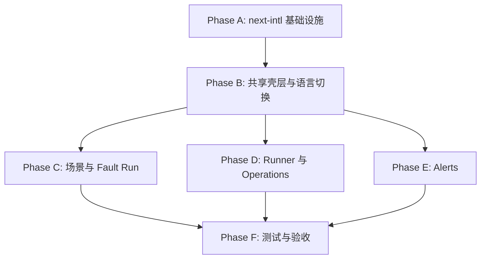

# 控制台国际化实施任务清单

## 文档信息

| 项目 | 内容 |
| --- | --- |
| 状态 | 待实施 |
| 版本 | 1.0 |
| 更新时间 | 2026-09-03 CST |
| 产品规格 | [product.md](product.md) |
| 技术设计 | [technical-design.md](technical-design.md) |

## 任务规则

1. 开始任务时将 `- [ ]` 改为 `- [-]`；通过该任务的验证后改为 `- [x]`。
2. 每完成一个任务，立即更新对应阶段进度、总体进度和本文件的更新时间。
3. 发现问题时，在“问题跟踪”中新增记录，填写影响、状态和可能的解决方案；问题解决后保留记录并更新状态，不删除历史。
4. 如果解决方案改变产品范围、语言策略、路由策略或数据边界，先同步更新 [product.md](product.md) 和 [technical-design.md](technical-design.md)，再继续实现。
5. 任务未完成或验证未通过时不得标记为 `[x]`；阻塞任务使用 `[!]` 并在问题跟踪中关联问题 ID。
6. 不修改与本功能无关的业务接口、鉴权契约、数据库结构、Gateway 路由或监控配置。
7. 本清单中的 `A1`、`B1` 等为任务组，阶段进度和总体进度按任务组统计；组内复选框为子任务，子任务完成后也要同步更新复选框数量。

## 总体进度

- **总体状态：** 待实施
- **总体进度：** 0 / 44 个任务组（0 / 117 个子任务）
- **当前阶段：** 尚未开始
- **当前问题：** 暂无
- **可能的解决方案：** 不适用

| 阶段 | 目标 | 状态 | 进度 | 前置依赖 |
| --- | --- | --- | --- | --- |
| A | next-intl 基础设施与根布局 | 待开始 | 0 / 7 | 无 |
| B | 语言切换与共享壳层 | 待开始 | 0 / 7 | A |
| C | 场景与 Fault Run 展示 | 待开始 | 0 / 8 | B |
| D | Runner 与 Operations | 待开始 | 0 / 8 | B |
| E | Alerts 管理界面 | 待开始 | 0 / 5 | B |
| F | 测试、构建与验收 | 待开始 | 0 / 9 | A 至 E |

## 执行依赖

---

## Phase A：next-intl 基础设施与根布局

**阶段目标：** 安装并锁定兼容的 `next-intl`，建立请求级 locale/message 解析，并让 Server Layout 与 Client Provider 使用同一份语言上下文。

**阶段状态：** 待开始
**阶段进度：** 0 / 7 个任务组
**问题：** 暂无
**可能的解决方案：** 不适用

### A1. 依赖版本与锁文件

- [ ] 在 `traffic-control-plane/package.json` 添加与当前 Next.js 15、React 19 兼容的 `next-intl`。
- [ ] 更新 `traffic-control-plane/pnpm-lock.yaml`，确认只引入预期依赖变化并记录实际锁定版本。
- [ ] 检查 peer dependency，避免无验证地使用与当前 Next.js 不兼容的版本。

### A2. 请求级 locale 解析

- [ ] 新增 `traffic-control-plane/src/i18n/request.ts`，使用 `getRequestConfig` 和 `next/headers` 的 `cookies()`。
- [ ] 仅接受 `en`、`zh-CN`；缺失、大小写变体、非法或恶意 Cookie 值统一回退 `en`。
- [ ] 从 `control_plane_locale` 读取展示偏好，不读取或修改 `operator_session`、`operator_csrf`。
- [ ] 加载对应 JSON 消息目录，并配置 `Asia/Shanghai` 等全局展示格式。

### A3. English canonical 消息目录

- [ ] 新增 `traffic-control-plane/src/i18n/messages/en.json`。
- [ ] 按 `Common`、`Navigation`、`Login`、`Scenarios`、`FaultRuns`、`Runner`、`Operations`、`Alerts`、`Accessibility` 等命名空间整理前端自有文案。
- [ ] 为所有计划覆盖的标题、按钮、状态显示、弹窗、日期选择器、Toast、Tooltip、ARIA 和前端 fallback 建立翻译键。
- [ ] 不将后端错误、秘密、ID、服务名、PromQL、YAML 或运营人员编辑的监控内容放入目录。

### A4. Simplified Chinese 消息目录

- [ ] 新增 `traffic-control-plane/src/i18n/messages/zh-CN.json`，覆盖 English 目录全部键。
- [ ] 保持两份目录的 ICU 占位符逐字一致，例如 `{count}`、`{duration}`、`{name}`。
- [ ] 复核中文长文本在按钮、卡片、弹窗、头部和日期选择器中的可读性。

### A5. next-intl 类型声明

- [ ] 新增 `traffic-control-plane/src/i18n/global.d.ts`，扩展 `next-intl` 的 `AppConfig`。
- [ ] 将 canonical English 消息结构作为 `Messages` 类型，并将 locale 限定为 `en | zh-CN`。
- [ ] 确认 `useTranslations`、`useLocale`、`useFormatter` 的类型能够被当前 TypeScript 配置解析。

### A6. Next.js 插件

- [ ] 修改 `traffic-control-plane/next.config.mjs`，用 `createNextIntlPlugin('./src/i18n/request.ts')` 包装现有 standalone 配置。
- [ ] 不增加旧版 Next.js `i18n` 配置，不配置 `localePrefix`，不迁移 `[locale]` 路由。

### A7. Root Layout 与 Provider

- [ ] 修改 `traffic-control-plane/src/app/layout.tsx` 为异步 Server Component。
- [ ] 使用 `getLocale()` 和 `getMessages()` 设置 `<html lang={locale}>`，保持 `suppressHydrationWarning` 的现有用途。
- [ ] 用 `NextIntlClientProvider` 包裹现有 `ThemeProvider`、`ConsoleChrome` 和 `Toaster`。
- [ ] 确认服务端初始 locale 与客户端 Provider locale/messages 一致，不依赖 `localStorage` 或 `navigator.language`。

---

## Phase B：语言切换与共享壳层

**阶段目标：** 在登录前和登录后提供一致的语言切换入口，完成公共页面、导航、主题、确认框和无障碍文本国际化。

**阶段状态：** 待开始
**阶段进度：** 0 / 7 个任务组
**问题：** 暂无
**可能的解决方案：** 不适用

### B1. LocaleSwitcher 组件

- [ ] 新增 `traffic-control-plane/src/components/LocaleSwitcher.tsx`。
- [ ] 使用现有原生 `select` 的样式和可访问性模式，固定提供 `English` 与 `简体中文`。
- [ ] 对 DOM 传入值再次执行 locale 白名单校验。

### B2. Cookie 持久化与刷新

- [ ] 切换时写入 `control_plane_locale`，设置 `Path=/`、`Max-Age=31536000`、`SameSite=Lax`，生产环境按站点策略追加 `Secure`。
- [ ] 立即更新 `document.documentElement.lang`，并调用 `router.refresh()` 重新读取请求级消息目录。
- [ ] 不调用 `router.push()`，不修改 pathname、query 或 `returnTo`。
- [ ] 确认语言 Cookie 不触碰认证 Cookie、业务请求 headers、表单 payload 或 API 鉴权。

### B3. 登录页

- [ ] 修改 `traffic-control-plane/src/app/login/page.tsx`，接入登录页语言选择器。
- [ ] 翻译标题、说明、用户名、密码、提交中、提交按钮、前端 fallback 和 `aria-label`。
- [ ] 保留登录 API、认证错误原文、`safeReturnTo` 和现有跳转逻辑。

### B4. ConsoleChrome

- [ ] 修改 `traffic-control-plane/src/components/ConsoleChrome.tsx`，在认证头部放置语言选择器。
- [ ] 翻译页脚和共享壳层自有文案，确保登录页仍不显示认证后的导航。
- [ ] 在窄屏下保持品牌、导航、语言选择、主题和登出入口可操作且不重叠。

### B5. NavBar

- [ ] 修改 `traffic-control-plane/src/components/NavBar.tsx`，翻译 Scenarios、Runner、Operations、Alerts 和登出文案。
- [ ] 使用 `useFormatter` 或 next-intl formatter 替换固定 `sv-SE` 时间格式，同时保持现有时区语义。
- [ ] 保留所有无语言前缀链接和当前路由激活判断。

### B6. ThemeToggle 与 ConfirmDialog

- [ ] 修改 `traffic-control-plane/src/components/ThemeToggle.tsx`，翻译主题切换 `title` 和无障碍名称。
- [ ] 修改 `traffic-control-plane/src/components/ConfirmDialog.tsx`，翻译默认取消、确认和等待按钮文案。
- [ ] 确认调用方传入的业务确认说明可以使用当前 locale，但动态后端消息仍原样展示。

### B7. 共享 UI 验收

- [ ] 复核所有公共按钮、图标按钮、Tooltip、隐藏文本、`aria-label` 和 `title` 无硬编码 English 遗漏。
- [ ] 在登录页和认证后页面分别验证切换、刷新、回退和无效 Cookie 行为。
- [ ] 记录头部、登录卡片和确认弹窗在桌面/窄屏下发现的问题及解决方案。

---

## Phase C：场景与 Fault Run 展示

**阶段目标：** 将场景目录和 Fault Run 的人类可读展示接入消息目录，同时保持运行数据、协议值和安全解析逻辑不变。

**阶段状态：** 待开始
**阶段进度：** 0 / 8 个任务组
**问题：** 暂无
**可能的解决方案：** 不适用

### C1. 场景元数据翻译键

- [ ] 修改 `traffic-control-plane/src/components/scenarios/meta.ts`，为场景、分组和 PSP outcome 保存稳定 translation key。
- [ ] 保留场景 ID、provider outcome value、图标、tone 和场景顺序不变。

### C2. 场景标签解析

- [ ] 更新 `getScenarioLabel` 及其调用方，使用当前 locale 解析已知场景标签。
- [ ] 为分组、provider outcome、目标服务/操作和已知状态提供安全显示映射。
- [ ] 未知场景或状态回退原始稳定标识，不抛出渲染异常。

### C3. Fault Run 纯展示边界

- [ ] 修改 `traffic-control-plane/src/components/scenarios/fault-run-view.ts`，保持 `buildFaultRunView` 为 locale-independent 的数据规范化和安全校验函数。
- [ ] 将事件摘要、worker/cleanup 摘要、字节和成员列表展示拆为调用方传入 formatter 或 UI 层 formatter。
- [ ] 不在纯工具模块中引入 React hook，不把整个后端 payload 交给翻译函数。

### C4. 场景首页

- [ ] 修改 `traffic-control-plane/src/app/page.tsx`，翻译页面标题、加载/空状态、确认文案、前端 fallback 和 Toast。
- [ ] 保留 Fault Run 创建、停止、清理请求的字段、路径、幂等和 CSRF 行为。

### C5. ScenarioControlSections

- [ ] 修改 `traffic-control-plane/src/components/ScenarioControlSections.tsx`，翻译分组、历史、活动运行、详情、恢复、清理、指标和辅助说明。
- [ ] 使用 locale-aware 日期、数字和容量展示，继续保持 `Asia/Shanghai`。
- [ ] 保留运行 ID、trace ID、服务名、目标操作和 API 返回值原样。

### C6. ScenarioCardWithActions

- [ ] 修改 `traffic-control-plane/src/components/ScenarioCardWithActions.tsx`，翻译卡片描述、参数 label/description、操作状态、provider outcome 和控件 ARIA 文案。
- [ ] 保留提交给 API 的原始参数名、参数值、场景码和 outcome value。

### C7. 状态、Toast 与错误边界

- [ ] 为已知 Fault Run 状态和安全 frontend result 建立显示翻译，不改变原始状态值。
- [ ] 将前端自有 loading/empty/confirmation/fallback 文案接入消息目录。
- [ ] 保持 `result.message`、`Error.message` 和服务端错误 payload 原样展示。

### C8. Fault Run 安全回归

- [ ] 确认 `SCENARIO_REQUEST_FAILED` 等摘要仍只输出固定安全文案，不泄露 password、token 或原始 error payload。
- [ ] 确认 `formatHashNamespace`、member SKU、faultRunId 和 cache/worker 标识仍按原值或安全格式展示。
- [ ] 对场景页的桌面/窄屏长文本、详情弹窗和事件列表进行人工复核，记录问题及解决方案。

---

## Phase D：Runner 与 Operations

**阶段目标：** 覆盖生命周期 Runner、数据预热/补齐控制和日期选择器，统一展示格式，同时保护配置和机器值。

**阶段状态：** 待开始
**阶段进度：** 0 / 8 个任务组
**问题：** 暂无
**可能的解决方案：** 不适用

### D1. Runner 页面

- [ ] 修改 `traffic-control-plane/src/app/runner/page.tsx`，翻译标题、配置反馈、成功/失败的前端 Toast、加载状态和无障碍文本。
- [ ] 保留配置更新请求、乐观锁 `version`、比例值和后端返回错误原文。

### D2. RunnerPanels

- [ ] 修改 `traffic-control-plane/src/components/runner/RunnerPanels.tsx`，翻译 lifecycle header、tab、指标、账号摘要、活动、队列、补券和库存补齐说明。
- [ ] 已知 runner/action/status code 使用显示映射，底层 code、客户 ID、活动 ID 和服务端值保持不变。

### D3. RunnerDataControl

- [ ] 修改 `traffic-control-plane/src/components/runner/RunnerDataControl.tsx`，翻译预热、补齐、任务状态、按钮、确认框、空/加载状态和 ARIA 文案。
- [ ] 保留表名、任务 ID、窗口 ID、cron、数量和后端结果原值。

### D4. RunnerControls

- [ ] 修改 `traffic-control-plane/src/components/runner/RunnerControls.tsx`，翻译字段 label、目标表说明、listbox label、选项描述和控件辅助文本。
- [ ] 保留 `TABLE_OPTIONS` 的机器值和提交值，只对显示 label/description 做翻译。

### D5. DatePicker

- [ ] 修改 `traffic-control-plane/src/components/runner/DatePicker.tsx`，使用当前 locale 展示月份、星期、日期和范围消息。
- [ ] 翻译上一月/下一月、选择日期、弹出层和网格的 ARIA label。
- [ ] 保持日期计算、ISO 输入值和 `todayInShanghaiClient()` 的 `YYYY-MM-DD` 输出不变。

### D6. Runner utils

- [ ] 修改 `traffic-control-plane/src/components/runner/utils.ts`，将 `en-US`、默认 locale 等用户可见 formatter 迁移到 next-intl 或显式 locale formatter。
- [ ] 保留上海业务时区、原始数值、配置值和请求值；只改变展示字符串。

### D7. Operations 页面

- [ ] 修改 `traffic-control-plane/src/app/operations/page.tsx`，翻译数据操作页标题、tab、队列、状态、确认、加载/空状态和前端 fallback。
- [ ] 保留操作 API 路径、参数、任务 ID、表名、服务端消息和鉴权行为。

### D8. Runner/Operations 集成复核

- [ ] 检查所有 Runner/Operations 用户可见文本、`title`、`aria-label` 和 tooltip 无硬编码 English 遗漏。
- [ ] 验证格式化不会把本地化字符串写回表单、配置对象、API payload 或数据库字段。
- [ ] 记录长中文字段、数字单位、日期弹层和指标卡布局问题及可能的解决方案。

---

## Phase E：Alerts 管理界面

**阶段目标：** 翻译告警管理的 UI 自有文案，同时不修改保存到 Prometheus/Alertmanager 的配置内容。

**阶段状态：** 待开始
**阶段进度：** 0 / 5 个任务组
**问题：** 暂无
**可能的解决方案：** 不适用

### E1. Alerts 页面

- [ ] 修改 `traffic-control-plane/src/app/alerts/page.tsx`，翻译页面标题、tab、加载/空状态、刷新、保存和前端 fallback。
- [ ] 保留告警 API 路径、响应数据和服务端/parser 错误原文。

### E2. AlertControls

- [ ] 修改 `traffic-control-plane/src/components/alerts/AlertControls.tsx`，翻译配置来源、帮助说明、按钮、状态和控件 ARIA 文案。
- [ ] 对 source kind、severity 等固定配置值提供显示 label，但提交 value 不变。

### E3. AlertEditors

- [ ] 修改 `traffic-control-plane/src/components/alerts/AlertEditors.tsx`，翻译规则、接收器和路由编辑器的字段 label、placeholder 辅助说明、按钮和 validation UI。
- [ ] 不翻译或重写 rule summary、rule description、PromQL、YAML、receiver 名称和路由值。

### E4. AlertModals 与 AlertRoutingSection

- [ ] 修改 `traffic-control-plane/src/components/alerts/AlertModals.tsx` 和 `AlertRoutingSection.tsx`，翻译模态框标题、确认/取消、删除/保存、空状态和 ARIA 文案。
- [ ] 保留编辑器中的原始配置字段、值、格式和错误详情。

### E5. Alerts 边界与布局复核

- [ ] 检查 Alerts 全部用户可见 UI 文案均通过 next-intl，且运营编辑的监控内容不被当作翻译键。
- [ ] 在 English/简体中文和桌面/窄屏下复核表单、编辑器、模态框、长 YAML/PromQL 内容不发生遮挡或截断。
- [ ] 记录 parser/server error、长字段或编辑器布局问题及可能的解决方案。

---

## Phase F：测试、构建与验收

**阶段目标：** 用自动化测试验证语言目录、回退、安全边界和纯展示函数，并完成开发服务器双语走查。

**阶段状态：** 待开始
**阶段进度：** 0 / 9 个任务组
**问题：** 暂无
**可能的解决方案：** 不适用

### F1. locale 解析测试

- [ ] 新增 `traffic-control-plane/src/i18n/*.test.ts`，覆盖缺失 Cookie、`en`、`zh-CN`、非法值、大小写变体和恶意值回退。
- [ ] 验证解析逻辑不读取或改变认证 Cookie。

### F2. 消息目录 parity 测试

- [ ] 递归比较 `en.json` 与 `zh-CN.json` 的键集合。
- [ ] 比较 ICU 占位符集合，发现缺失或多余占位符时测试失败。
- [ ] 验证主要命名空间和 frontend fallback 消息键均存在。

### F3. 场景与 Fault Run 测试

- [ ] 新增/扩展场景 metadata 测试，验证所有场景、分组和 provider outcome 均有双语显示文案。
- [ ] 扩展 `src/components/scenarios/fault-run-view.test.ts`，验证双语摘要、未知 ID 回退、marker/cleanup 解析和错误 payload 脱敏。

### F4. Runner formatter 测试

- [ ] 在 `src/components/runner/utils.test.ts` 或同目录测试中验证 English/简体中文日期、数字、容量展示。
- [ ] 验证 `Asia/Shanghai` 语义、`todayInShanghaiClient()` ISO 输出和原始请求值不变。

### F5. 定向测试脚本

- [ ] 在 `traffic-control-plane/package.json` 增加 `test:i18n`，覆盖新增的 locale、catalog、scenario 和 formatter 纯测试。
- [ ] 执行 `pnpm test:i18n` 和既有 `pnpm test:runner`，修复本次改造引入的失败。

### F6. TypeScript 与 lint

- [ ] 执行 `cd traffic-control-plane && pnpm typecheck`。
- [ ] 执行 `pnpm lint`，区分既有 warning 与本次新增问题，并记录无法消除的既有问题。

### F7. 生产构建

- [ ] 执行 `pnpm build`，确认 next-intl 插件、动态 request config、JSON 消息目录和 standalone 输出正常。
- [ ] 检查构建输出没有把密码、token 或不应进入客户端的服务端配置打包到消息目录。

### F8. 语言切换与持久化手工验收

- [ ] 启动 `pnpm dev`，清除 `control_plane_locale` 后访问 `/login`，确认 English 和 `<html lang="en">`。
- [ ] 未登录时切换简体中文，确认当前路径不变；刷新后确认页面文案、消息目录和 `<html lang="zh-CN">` 同步。
- [ ] 登录后切换两种语言，确认认证状态、`returnTo`、业务请求和当前页面不变。

### F9. 全页面、响应式与鉴权回归

- [ ] 在 `/`、`/runner`、`/operations`、`/alerts` 两种语言下走查导航、场景卡片/详情、Runner 日历、数据操作、Alerts 编辑器、Toast 和确认框。
- [ ] 在桌面和窄屏检查头部、语言选择器、品牌、主题、登出、按钮、卡片和模态框无重叠/裁切。
- [ ] 确认 `/internal/**`、受保护页面、API 401、Operator 会话和 CSRF 行为与改造前一致。
- [ ] 确认语言切换不改变 path、query、API payload、stable code、YAML/PromQL、服务名、表名或后端原始错误。

---

## 问题跟踪

问题发现后按以下字段追加记录；状态建议使用 `待处理`、`处理中`、`已解决` 或 `已阻塞`。

| ID | 发现阶段/任务 | 问题 | 影响 | 可能的解决方案/下一步 | 状态 |
| --- | --- | --- | --- | --- | --- |
| - | - | 暂无问题 | - | - | - |

## 阶段更新记录

每完成一个任务或发现/解决一个问题后追加一行，保留历史进度。

| 日期 | 阶段/任务 | 总体进度 | 阶段进度 | 问题 | 可能的解决方案/下一步 |
| --- | --- | --- | --- | --- | --- |
| 2026-09-03 | 建立任务清单 | 0 / 44 | A-F 均为 0 | 暂无 | 按 Phase A 开始实施 |

## 完成标准

- [ ] Phase A-F 所有任务组完成，任务组进度达到 `44 / 44`，子任务进度达到 `117 / 117`。
- [ ] `pnpm test:i18n`、`pnpm test:runner`、`pnpm typecheck`、`pnpm lint` 和 `pnpm build` 通过。
- [ ] English 与简体中文在登录、场景、Runner、Operations、Alerts 和共享壳层的主要流程均完成手工验收。
- [ ] 所有未解决问题都有明确状态和后续方案；没有已知的阻塞问题被隐藏在任务复选项之外。
