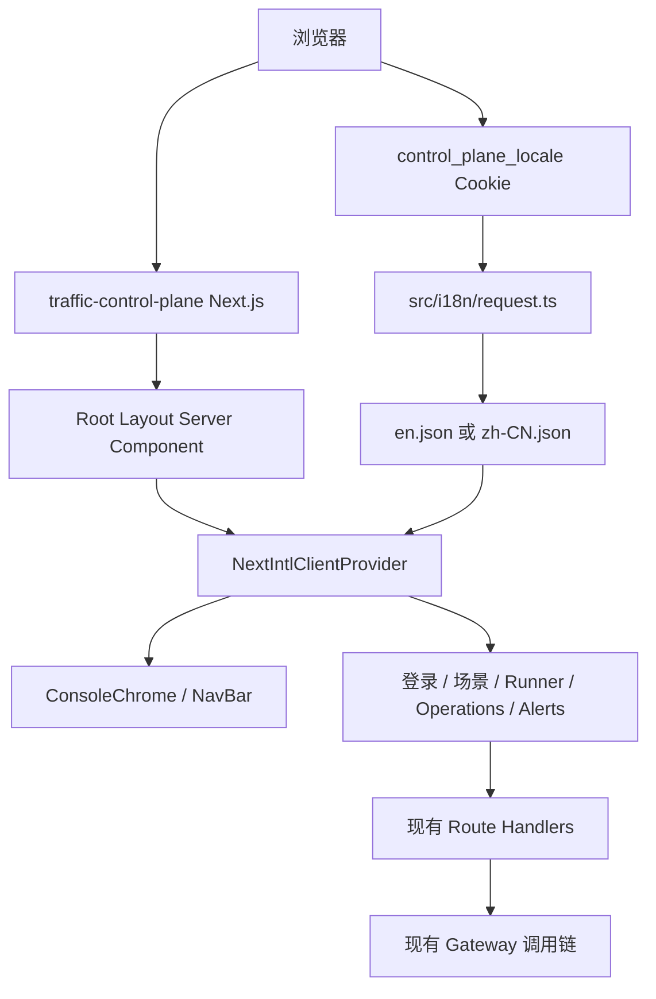
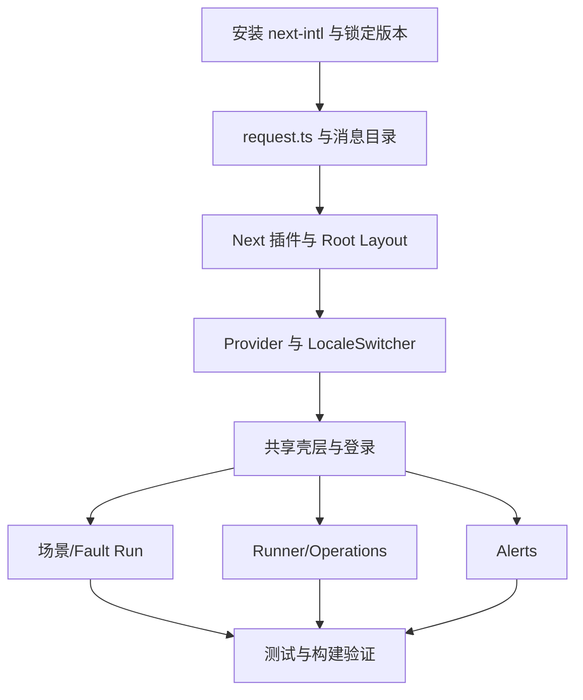

# 控制台国际化技术设计

## 文档信息

| 项目 | 内容 |
| --- | --- |
| 状态 | 规划中 |
| 版本 | 1.0 |
| 更新时间 | 2026-09-03 CST |
| 范围 | `traffic-control-plane` Next.js App Router |
| 产品规格 | [product.md](product.md) |
| 实施任务 | [task-list.md](task-list.md) |

## 1. 设计目标与约束

本设计使用现成的 `next-intl` 为控制台增加请求级消息目录和客户端翻译能力，支持 `en` 与 `zh-CN`，并保留当前无语言前缀的页面结构。

关键约束：

- 当前应用使用 Next.js App Router，根布局是 Server Component，主要页面和共享 UI 是 Client Component。
- 当前路由为 `/`、`/login`、`/runner`、`/operations` 和 `/alerts`，不能为本需求迁移到 `[locale]` 目录。
- `src/middleware.ts` 目前负责 Operator 鉴权、登录例外、内部 API 保护和 `x-operator-id` 注入；不引入 next-intl routing middleware，避免改变鉴权路径和 `returnTo` 行为。
- 首次没有有效偏好时固定使用 English，不依赖浏览器语言协商。
- 后端消息、稳定协议值、用户编辑的监控配置和业务数据不进入翻译流程。
- 所有业务请求仍按现有约定经 Gateway；国际化不能增加新的业务服务访问路径。

## 2. 现状与控制点

| 控制点 | 当前实现 | 国际化改造 |
| --- | --- | --- |
| 根布局 | `src/app/layout.tsx`，固定 `<html lang="en">` | 使用 next-intl 请求配置得到 locale/messages，并动态设置 `lang` |
| 页面 | `src/app/{page,login,runner,operations,alerts}/page.tsx` | 在客户端组件中使用 `useTranslations`、`useLocale` 和 `useFormatter` |
| 共享壳层 | `ConsoleChrome`、`NavBar`、`ThemeToggle`、`Toaster` | 接入共享命名空间和语言选择器 |
| 鉴权中间件 | `src/middleware.ts` | 保持不变，不添加 locale 路由重写 |
| 场景元数据 | `components/scenarios/meta.ts` 中保存 English 文案 | 保存稳定 translation key，由渲染层解析显示文案 |
| Runner 格式化 | `en-US`、`sv-SE` 和默认 locale 混用 | 使用 next-intl formatter，保留上海时区和机器值语义 |
| 测试 | `tsx --test` 的 Node 测试 | 增加目录、解析、格式化和纯展示函数测试 |

## 3. 总体架构



请求级 locale 由 `request.ts` 统一解析。根布局通过 `getLocale()` 和 `getMessages()` 将同一份 locale 与消息传给 `NextIntlClientProvider`。客户端语言选择器只负责写入展示偏好 Cookie、更新当前文档语言并触发 `router.refresh()`，不修改 URL 或业务请求。

## 4. 依赖与 Next.js 配置

### 4.1 依赖版本

在 `traffic-control-plane/package.json` 增加 `next-intl`，使用与仓库实际 Next.js 和 React 版本兼容的版本并更新 `pnpm-lock.yaml`。安装时必须验证：

1. `next-intl` 的 peer dependency 与当前 Next.js 15 / React 19 满足要求。
2. 现有 `next-themes`、Sonner、Tailwind 和 standalone 输出没有构建回归。
3. `pnpm typecheck` 和 `pnpm build` 能解析 request config 和 JSON 消息目录。
4. 依赖版本被锁定，不能无验证地跟随最新版本。

### 4.2 next.config.mjs

保留当前 standalone 配置，并使用 next-intl 插件指向显式 request config：

```js
import createNextIntlPlugin from 'next-intl/plugin';

/** @type {import('next').NextConfig} */
const nextConfig = {
  output: 'standalone',
};

const withNextIntl = createNextIntlPlugin('./src/i18n/request.ts');

export default withNextIntl(nextConfig);
```

不要添加旧版 Next.js 的 `i18n` 配置，也不要使用 `localePrefix: 'never'`。后者仍会要求以 `[locale]` 目录表达内部路由结构，与当前精确路径鉴权不匹配。

## 5. Locale 解析与请求配置

### 5.1 配置文件

新增以下文件：

```text
traffic-control-plane/src/i18n/
  global.d.ts
  request.ts
  messages/
    en.json
    zh-CN.json
```

`request.ts` 的职责：

- 使用 `next/headers` 的 `cookies()` 读取 `control_plane_locale`。
- 只接受 `en` 和 `zh-CN`。
- Cookie 缺失或非法时返回 `en`。
- 动态加载对应 JSON 消息目录。
- 提供 `Asia/Shanghai` 等全局格式化默认值。
- 不读取认证 Cookie，不解析 Operator 身份，不改变 API 请求。

实现形态如下，具体参数以安装的 next-intl 版本类型为准：

```ts
import { cookies } from 'next/headers';
import { getRequestConfig } from 'next-intl/server';

const LOCALES = ['en', 'zh-CN'] as const;
type Locale = (typeof LOCALES)[number];

function isLocale(value: string | undefined): value is Locale {
  return value === 'en' || value === 'zh-CN';
}

export default getRequestConfig(async () => {
  const value = (await cookies()).get('control_plane_locale')?.value;
  const locale = isLocale(value) ? value : 'en';
  const messages = (await import(`./messages/${locale}.json`)).default;

  return {
    locale,
    messages,
    timeZone: 'Asia/Shanghai',
  };
});
```

因为本应用不使用 next-intl 的 routing middleware，request config 不依赖 `requestLocale`。locale 的唯一来源是允许值校验后的 Cookie，缺失时固定回退 English。

### 5.2 根布局接入

修改 `src/app/layout.tsx`：

1. 将 `RootLayout` 改为 async Server Component。
2. 从 `next-intl/server` 获取 `getLocale()` 和 `getMessages()`。
3. 将 `<html lang="en">` 改为 `<html lang={locale}>`。
4. 在现有主题和控制台壳层外层加入 `NextIntlClientProvider`。
5. 继续保留 `suppressHydrationWarning`，但不能依赖它掩盖 locale 不一致。

结构应保持如下关系：

```tsx
<NextIntlClientProvider locale={locale} messages={messages}>
  <ThemeProvider>
    <ConsoleChrome>{children}</ConsoleChrome>
    <Toaster />
  </ThemeProvider>
</NextIntlClientProvider>
```

服务端读取 Cookie 会使页面变为请求相关渲染。控制台本身已有 Operator 会话和请求级数据，这种动态渲染是可接受的；必须确认 standalone 生产构建仍然正常。

## 6. 消息目录与类型

### 6.1 命名空间

使用 JSON 目录，按功能分组，建议至少包含：

```text
Common
Navigation
Login
Scenarios
FaultRuns
Runner
Operations
Alerts
Accessibility
```

示例结构：

```json
{
  "Navigation": {
    "scenarios": "Scenarios",
    "runner": "Runner",
    "operations": "Operations",
    "alerts": "Alerts",
    "signOut": "Sign out"
  },
  "Login": {
    "description": "Sign in to access the control plane.",
    "username": "Username",
    "password": "Password",
    "submit": "Sign in",
    "submitting": "Signing in..."
  }
}
```

`zh-CN.json` 必须提供完全相同的键结构。ICU 占位符必须逐字保留，例如 `{count}`、`{duration}`、`{name}`。翻译目录只放前端拥有的文案和安全的已知显示模板。

### 6.2 类型声明

新增 `src/i18n/global.d.ts`，以 English JSON 作为 canonical message 类型，并声明支持的 locale：

```ts
import messages from './messages/en.json';

declare module 'next-intl' {
  interface AppConfig {
    Messages: typeof messages;
    Locale: 'en' | 'zh-CN';
  }
}
```

如当前 next-intl 版本对 `AppConfig` 字段或 JSON 类型推断有差异，以该版本的官方类型要求调整，但必须保留：

- locale 只能是 `en | zh-CN`。
- `useTranslations` 的 key 来自 canonical 消息目录。
- 两份目录的键和占位符由测试进行运行时 parity 校验。

## 7. 客户端 Provider 与语言选择器

### 7.1 客户端使用约定

Client Component 使用 next-intl hook：

```tsx
import { useFormatter, useLocale, useTranslations } from 'next-intl';

const t = useTranslations('Runner');
const locale = useLocale();
const format = useFormatter();
```

不要在 Server Component 中直接使用客户端 hook。未来新增 Server Component 时使用 `getTranslations`、`getLocale` 和 `getFormatter`。

### 7.2 LocaleSwitcher

新增 `src/components/LocaleSwitcher.tsx`，沿用当前控制台原生 `select` 的样式和可访问性模式：

1. 从 `en`、`zh-CN` 固定选项中渲染当前值。
2. 选择前验证目标 locale，不信任任意 DOM 值。
3. 写入 `control_plane_locale`，属性至少包括 `Path=/`、`Max-Age=31536000`、`SameSite=Lax`；生产环境按站点 Cookie 策略追加 `Secure`。
4. 立即更新 `document.documentElement.lang`，避免等待刷新期间语言属性错误。
5. 调用 `router.refresh()`，让服务器重新读取 Cookie 并向 Provider 提供目标消息目录。
6. 不调用 `router.push()`，不修改 pathname、query 或 `returnTo`。
7. 不接触 `operator_session`、`operator_csrf`、业务请求 headers 或表单数据。

语言 Cookie 非敏感且只含白名单 locale，因此不需要 `HttpOnly`；它不能被用于鉴权或业务决策。

### 7.3 放置位置

- `src/app/login/page.tsx`：放在登录卡片内或页面级工具区域，使未登录用户可以切换。
- `src/components/ConsoleChrome.tsx`：放在认证头部，和 `ThemeToggle`、登出控件保持清晰的间距。
- `src/components/NavBar.tsx`：只负责导航和导航相关文本，不重复实现 Cookie 写入逻辑。

小屏幕上选择器应使用稳定宽度和短显示标签，不能挤压品牌、导航、主题或登出按钮。

## 8. 页面改造顺序与文件边界

### 8.1 第一阶段：共享壳层

修改：

- `src/app/layout.tsx`
- `src/components/ConsoleChrome.tsx`
- `src/components/NavBar.tsx`
- `src/components/ThemeToggle.tsx`
- `src/components/ConfirmDialog.tsx`
- `src/app/login/page.tsx`

内容：

- Provider 与 `<html lang>` 接入。
- 导航、页脚、主题、登出、登录和确认按钮文案。
- `title`、`aria-label`、等待状态和前端登录失败 fallback。
- 语言选择器在登录页和认证头部可用。

### 8.2 第二阶段：场景与 Fault Run

修改：

- `src/components/scenarios/meta.ts`
- `src/components/scenarios/fault-run-view.ts`
- `src/components/scenarios/fault-run-view.test.ts`
- `src/app/page.tsx`
- `src/components/ScenarioControlSections.tsx`
- `src/components/ScenarioCardWithActions.tsx`

实现规则：

- `SCENARIO_META`、`SCENARIO_GROUPS` 和 `PROVIDER_OUTCOMES` 保留稳定 ID、value、图标和 tone，只保存 translation key 或稳定的显示 key。
- `getScenarioLabel` 对已知 ID 使用当前翻译，对未知 ID 回退原始字符串。
- `buildFaultRunView` 继续只负责数据规范化、安全校验和脱敏，不引入 React hook 或 locale 状态。
- `summarizeFaultRunEvent`、worker/cleanup 摘要、字节和成员数量展示通过调用方传入的翻译/格式化函数，或拆分为纯数据函数加 UI 层 formatter。
- `SCENARIO_REQUEST_FAILED` 等事件只显示固定安全文案，不渲染原始错误 payload。
- 状态显示可以翻译，但发送给 API 或保存到数据库的原始状态不变。

### 8.3 第三阶段：Runner 与 Operations

修改：

- `src/app/runner/page.tsx`
- `src/app/operations/page.tsx`
- `src/components/runner/RunnerPanels.tsx`
- `src/components/runner/RunnerDataControl.tsx`
- `src/components/runner/RunnerControls.tsx`
- `src/components/runner/DatePicker.tsx`
- `src/components/runner/utils.ts`

内容：

- 配置字段、tab、指标、活动、队列、预热、补齐、加载和错误 fallback。
- 日期选择器的月份、星期、上一月/下一月、选择日期和范围提示。
- 将硬编码的 `en-US`、`sv-SE` 和默认 `Intl` 调用迁移到 `useFormatter` 或显式传入 locale 的纯 formatter。
- 保留 `Asia/Shanghai` 时区、`todayInShanghaiClient()` 的 ISO 输出、cron、表名、稳定 action/status code 和服务端错误原文。

### 8.4 第四阶段：Alerts

修改：

- `src/app/alerts/page.tsx`
- `src/components/alerts/AlertControls.tsx`
- `src/components/alerts/AlertEditors.tsx`
- `src/components/alerts/AlertModals.tsx`
- `src/components/alerts/AlertRoutingSection.tsx`

内容：

- UI 标题、字段 label、帮助文字、按钮、确认框、加载/空状态和 ARIA 文案。
- `source kind`、`severity` 等配置 value 可以提供单独的显示 label，但提交的 value 不变。
- 规则 summary/description、PromQL、YAML、receiver 名称、路由内容和 parser/server error 不进入翻译目录，也不随语言改变。

## 9. 格式化规则

### 9.1 日期与时间

- 所有用户可见的日期、时间和相对时间使用 next-intl formatter 或接受 locale 的共享函数。
- 业务时间仍固定为 `Asia/Shanghai`，不能因浏览器时区变化。
- 机器输入和协议值保持 ISO、`YYYY-MM-DD` 或 cron 原格式。
- `DatePicker` 的星期和月份名称来自当前 locale，日期计算仍使用现有逻辑。
- NavBar 的实时钟和 Fault Run/Runner 时间展示不应继续各自硬编码 `en-US`、`sv-SE`。

### 9.2 数字与容量

- 计数、比例、延迟、金额和容量的展示使用 `useFormatter` 或显式 locale formatter。
- 不能把格式化后的字符串写回 API payload、配置状态或数据库字段。
- `n/a` 等前端 fallback 使用消息键；服务端返回的动态文本保持原值。
- 字节单位可以按 locale 展示，但二进制换算规则和原始字节值不变。

### 9.3 场景摘要

场景摘要中的动态数值必须使用 ICU 插值或 formatter，例如：

```text
Reader drained with {count} requests in flight
```

翻译函数负责固定语句和占位符，调用方负责传入已校验的安全数值。不能把整个后端 payload 交给翻译函数，也不能把密码、token 或原始错误拼进摘要。

## 10. 稳定边界与不变更项

以下文件和行为原则上不修改：

- `src/middleware.ts` 的 matcher、登录例外、API 401、内部路径拒绝和 Operator header 注入。
- `src/app/internal/**` Route Handler 的路径、请求体、响应体和鉴权契约。
- `src/lib/operator-auth.ts` 的认证 Cookie、CSRF Cookie 和会话逻辑。
- Gateway、业务服务、worker、数据库 migration、PromQL 和 Alertmanager 配置。
- 页面导航中的 `/`、`/login`、`/runner`、`/operations`、`/alerts` 路径。

后端 `result.message`、`error.message`、任务 `errorMessage` 和 YAML/parser 错误不做通用翻译。若未来要翻译动态错误，应另行建立稳定错误码到 UI 消息键的契约，不能在本需求中通过字符串匹配解决。

## 11. 实施依赖与阶段计划



1. **基础设施**：添加依赖、锁文件、插件、request config、两份消息目录和 `global.d.ts`。
2. **根布局**：接入 `NextIntlClientProvider`，输出服务端 locale 和 messages。
3. **共享 UI**：实现语言选择器，翻译登录、导航、主题、确认弹窗、页脚和公共可访问性文本。
4. **场景 UI**：先完成元数据和 Fault Run 纯展示函数，再接入场景主页。
5. **Runner/Operations 与 Alerts**：共享基础完成后可并行改造，分别保持数据和监控配置边界。
6. **验证**：运行纯测试、完整 TypeScript 检查、lint、生产构建和双语手工走查。

## 12. 测试设计

### 12.1 纯函数与消息目录测试

新增 `src/i18n/*.test.ts`，覆盖：

- 缺少 Cookie 时 locale 为 `en`。
- `zh-CN` Cookie 能加载中文目录。
- 未知 locale、大小写变体和恶意 Cookie 值回退 `en`。
- `en.json` 与 `zh-CN.json` 的递归键集合一致。
- 两份目录中 ICU 占位符集合一致。
- 翻译函数对合法键、插值和 fallback 的行为稳定。

### 12.2 场景和 Fault Run 测试

扩展 `src/components/scenarios/fault-run-view.test.ts`，并新增场景元数据测试：

- 所有当前 catalog 场景、分组和 provider outcome 都有两种语言显示文案。
- 未知场景 ID 回退原始值。
- Fault Run 事件摘要可在两种语言下生成。
- 错误 payload 中的密码、token 或其他原始敏感文本不会进入摘要。
- `buildFaultRunView` 的现有安全解析和 marker/cleanup 逻辑不受 locale 影响。

### 12.3 Runner 格式化测试

在 `src/components/runner/utils.test.ts` 或同目录测试中覆盖：

- English 和简体中文的日期、数字、容量显示。
- 上海时区输出与浏览器本地时区无关。
- `todayInShanghaiClient()` 继续返回机器可用的 ISO 日期。
- 格式化只影响展示，不改变配置和请求值。

### 12.4 组件与手工验证

当前控制面没有已配置的 DOM 组件测试框架，因此不为本次需求单独引入完整组件测试栈。Provider、Cookie 和 `router.refresh()` 行为通过开发服务器手工验证：

1. 清理 `control_plane_locale`，访问 `/login`，确认 English 和 `<html lang="en">`。
2. 登录前切换中文并刷新，确认页面消息与 `<html lang="zh-CN">` 同步。
3. 登录后在四个运营页面切换，确认当前路径、query、认证状态和业务请求不变。
4. 打开确认弹窗、Toast、日期选择器、Fault Run 详情、Runner 活动和 Alerts 编辑器，检查长文本和无障碍名称。
5. 在桌面和窄屏宽度重复头部、弹窗和表单检查。

## 13. 验证命令

```bash
cd traffic-control-plane
pnpm test:i18n
pnpm test:runner
pnpm typecheck
pnpm lint
pnpm build
```

实现阶段还应检查：

- `pnpm-lock.yaml` 只包含预期的 next-intl 依赖变化。
- `src/middleware.ts` 和 `src/lib/operator-auth.ts` 没有被语言切换逻辑耦合。
- 生产 standalone 输出可以启动并通过 `/login` 与受保护页面检查。
- 未认证访问 `/internal/**` 仍返回既有 401 行为，受保护页面仍按既有逻辑重定向登录。

## 14. 风险与处理

| 风险 | 处理 |
| --- | --- |
| Cookie 在服务端和客户端读取时机不同导致语言闪烁 | 根布局在服务端读取 Cookie，并把同一 locale/messages 传给 Provider；切换后刷新 RSC 树 |
| next-intl routing 模式改变路由和鉴权 | 只使用 request config + Client Provider，不启用 routing middleware 或 `[locale]` 路由 |
| 中文文本造成头部和弹窗溢出 | 语言选择器使用稳定尺寸；对头部、按钮、卡片、弹窗和日期选择器做窄屏检查 |
| 翻译目录键缺失 | English 作为 canonical 类型，中文目录递归 parity 测试，typecheck 作为构建门槛 |
| 动态后端错误被误翻译或泄露 | 明确 `result.message`/`error.message` 原样展示；只翻译前端自有模板和安全状态 label |
| 格式化误改业务日期或请求值 | 展示 formatter 与数据转换分离，保留 `Asia/Shanghai`、ISO、cron 和原始数值 |
| 依赖版本与当前 Next.js 不兼容 | 安装时检查 peer dependency，锁定版本并执行 typecheck、lint、build |
| 语言偏好影响认证或内部 API | 使用独立非敏感 Cookie，不在 middleware 中进行 locale 重写，不触碰认证 Cookie |

## 15. 最终交付清单

- `package.json` 和 `pnpm-lock.yaml` 已添加并锁定兼容的 `next-intl`。
- `next.config.mjs` 已包装 next-intl 插件。
- `src/i18n/request.ts`、`global.d.ts`、`messages/en.json`、`messages/zh-CN.json` 已新增。
- Root Layout、共享壳层、登录、场景、Runner、Operations、Alerts 已按产品规格接入翻译。
- `control_plane_locale` 只接受白名单 locale，刷新后持久化，且不参与鉴权。
- 翻译目录不包含后端错误、秘密、监控配置或机器协议值。
- 定向测试、Runner 测试、typecheck、lint、build 和双语手工验证均完成。
