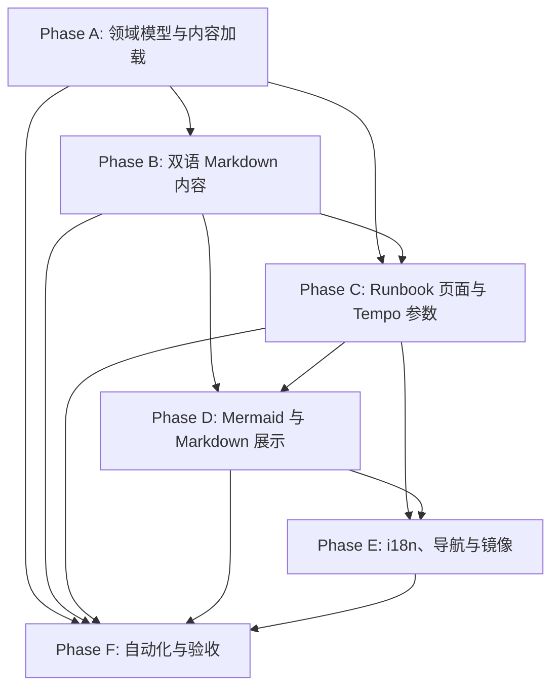

# 场景操作手册实施任务清单

## 文档信息

| 项目 | 内容 |
| --- | --- |
| 状态 | 待实施 |
| 版本 | 1.0 |
| 更新时间 | 2026-09-03 CST |
| 产品规格 | [product.md](product.md) |
| 技术设计 | [tech.md](tech.md) |

## 任务规则

1. 开始任务时将 `- [ ]` 改为 `- [-]`；完成实现和该任务定义的验证后改为 `- [x]`。
2. 每完成、阻塞或重新开始一项任务，立即更新本文件的文档信息、总体进度、所在阶段进度和“阶段更新记录”。
3. 发现问题时，在“问题跟踪”新增唯一 `RB-xxx` 记录，填写影响、状态、可能解决方案和关联任务；问题解决后保留历史并更新状态，不删除记录。
4. 遇到影响路由、认证、语言策略、内容安全、Tempo 证据边界、Mermaid 安全配置或部署范围的变更，先同步更新 [product.md](product.md) 和 [tech.md](tech.md)，再继续相关任务。
5. 任务未完成、测试未通过或浏览器验证未完成时不得标记为 `[x]`；被阻塞的任务使用 `[!]` 并关联问题 ID。
6. 不修改 `gateway-service`、业务服务、OTel agent、Grafana/Tempo、告警、Kubernetes 或 `docker-compose.yml`。手册只在 `traffic-control-plane` 内实现。
7. 手册不生成 Grafana Explore 链接、Tempo trace 深链、外部重定向，也不把 `X-Trace-Id` 或 `fault_runs.trace_id` 当作 OTel trace ID。
8. 长篇文章只来自控制台源码目录的受控 Markdown；不得放在 `public/`，不得读取仓库根目录 `_docs` 作为 production runtime 内容。
9. 本清单按任务组统计总体进度。子任务全部完成且任务组验证通过，才算一个完成任务组。

## 总体进度

- **总体状态：** 待实施
- **总体进度：** 0 / 29 个任务组（0 / 103 个子任务）
- **当前阶段：** Phase A：内容与领域模型
- **当前问题：** 暂无
- **可能的解决方案：** 从 RB-A1 开始，先建立 catalog 对齐的 metadata 和内容加载边界，再编写成对文章

| 阶段 | 目标 | 状态 | 进度 | 前置依赖 |
| --- | --- | --- | --- | --- |
| A | Runbook 领域模型与受控内容加载 | 待开始 | 0 / 5 | 无 |
| B | 双语 Markdown 内容与证据准确性 | 待开始 | 0 / 6 | A |
| C | `/runbook` 页面、目录与 Tempo 参数面板 | 待开始 | 0 / 5 | A、B |
| D | Mermaid 与 Markdown 展示体验 | 待开始 | 0 / 4 | B、C |
| E | 国际化、导航与 production 镜像打包 | 待开始 | 0 / 4 | C、D |
| F | 自动化、构建与浏览器验收 | 待开始 | 0 / 5 | A 至 E |

## 执行依赖

---

## Phase A：Runbook 领域模型与受控内容加载

**阶段目标：** 以 `fault-run-catalog.ts` 为稳定事实来源，建立受限场景解析、Tempo 查询配方和 production-safe Markdown loader。

**阶段状态：** 待开始  
**阶段进度：** 0 / 5 个任务组（0 / 19 个子任务）  
**问题：** 暂无  
**可能的解决方案：** 先实现纯 TypeScript 模型并写单测，内容文件和 UI 后续依赖该模型

### RB-A1. Runbook metadata 类型与目录对齐

- [ ] 新增 `traffic-control-plane/src/lib/runbook.ts`，定义 `ScenarioRunbookMetadata`、`TempoQueryRecipe` 和合并后的页面 entry 类型。
- [ ] 使用 `FaultRunScenario` 作为 metadata 主键，涵盖当前 catalog 的全部 12 个场景。
- [ ] metadata 仅保存文章文件名、业务链路、影响范围、明确排除项、Tempo 服务/route/时延阈值和 waterfall 检查点。
- [ ] 不在 metadata 中复制 `targetService`、`targetOperation`、参数、时长、恢复策略和人工清理权限等 catalog 已拥有的可变事实。

**完成判据：** metadata 类型能表达产品规格中的全部手册专属资料，且不引入任意 URL、运行 ID 或用户输入字段。

### RB-A2. Catalog 合并与场景解析

- [ ] 实现 `listRunbookEntries()`，遍历 `listScenarioDefinitions()` 生成稳定顺序的完整目录。
- [ ] 实现 `getRunbookEntry()`，从 `getScenarioDefinition()` 合并固定目标、参数、时长和恢复策略。
- [ ] 实现 `resolveRunbookScenario(input)`，仅接受已知 scenario；空值、未知值和数组值安全回退到确定默认场景。
- [ ] 确保 scenario query 原文不进入文件路径、TraceQL、HTML、React key 或错误模板。

**完成判据：** 纯函数可由 Node 测试覆盖已知场景和非法输入，目录与 catalog 一对一对应。

### RB-A3. 静态 Tempo 查询配方

- [ ] 为每个场景定义 allowlisted OTel service name、可选 route/业务路径、默认 `now-1h to now` 时间范围和慢请求阈值。
- [ ] 为每个目标服务派生服务范围、`status = error` 和 duration TraceQL 文本；多服务场景分别提供每个服务的查询，不依赖未验证的跨服务语法。
- [ ] 定义各场景 waterfall 检查点，只允许 `HTTP`、`JDBC`、`REDIS`、`EXCEPTION`、`HEALTH` 等固定值。
- [ ] 明确 route 条件是需在实际 Tempo 属性中确认的可选收窄条件，基础查询以 `resource.service.name` 为起点。

**完成判据：** 所有 12 个场景都有完整、静态、无外部 URL 的 Tempo recipe。

### RB-A4. 受控 Markdown loader

- [ ] 新增 `traffic-control-plane/src/lib/runbook-content.ts`，只接受 `en` / `zh-CN` 和经 `resolveRunbookScenario()` 验证的 scenario。
- [ ] 只以 metadata allowlist `articleFile` 形成路径，使用 `node:fs/promises` 读取 UTF-8 内容。
- [ ] 对缺失、空白或不可读内容提供明确的受控错误结果，页面可显示本地化不可用状态。
- [ ] 不从 `public/`、仓库根目录 `_docs`、请求参数或外部地址读取文章。

**完成判据：** loader 的路径不会被 query 注入，且失败模式可被测试精确验证。

### RB-A5. Node runtime 和任务测试骨架

- [ ] 在 `src/app/runbook/page.tsx` 预声明 `export const runtime = 'nodejs'`，保证后续文件系统读取不落到 Edge runtime。
- [ ] 新增 `traffic-control-plane/src/lib/runbook.test.ts` 和 `package.json` 的 `test:runbook` 脚本骨架。
- [ ] 覆盖 catalog/metadata 一对一、解析安全回退、固定 Tempo 配方字段和禁止 URL/trace ID 输入的纯函数测试。

**完成判据：** `pnpm test:runbook` 可执行并覆盖 Phase A 的纯函数契约。

---

## Phase B：双语 Markdown 内容与证据准确性

**阶段目标：** 为 12 个场景编写成对、可审计的 English / 简体中文文章，确保描述以当前代码为准并清楚界定运行证据。

**阶段状态：** 待开始  
**阶段进度：** 0 / 6 个任务组（0 / 23 个子任务）  
**问题：** 暂无  
**可能的解决方案：** 先建立统一文章模板，再按场景类别批量编写并逐项以 catalog/服务代码核实

### RB-B1. 内容目录与统一文章模板

- [ ] 创建 `src/content/runbook/en/` 和 `src/content/runbook/zh-CN/`。
- [ ] 建立与 metadata 完全一致的文件名 allowlist；两种语言保持相同文件名集合。
- [ ] 在每篇文章使用统一顺序：目的与固定目标、实现逻辑、参数与生命周期、影响范围、证据、Tempo 排障、恢复验证、已知限制。
- [ ] 仅翻译解释性文字；场景码、服务、操作、接口、参数、表名、错误码、事件名、SQL 和 TraceQL 保持原值。

**完成判据：** 内容目录结构可由 loader 读取，文章模板覆盖产品规格第 6 节的全部信息。

### RB-B2. 慢 SQL 与流量场景文章

- [ ] 编写 `BROWSE_REPORT_SQL` 英文/中文文章，说明历史行为扫描、商品浏览报表、JDBC 观察和优化/验证边界。
- [ ] 编写 `ORDER_REPORT_SQL` 英文/中文文章，说明客户历史订单范围、N+1 明细读取和执行计划证据。
- [ ] 编写 `BROWSE_SURGE` 英文/中文文章，说明控制面 worker 经 Gateway 的商品浏览请求、下游影响和 Tempo 起点。
- [ ] 编写 `ORDER_QUERY_SURGE` 英文/中文文章，说明受控客户订单查询、并发/间隔参数和影响范围。

**完成判据：** 四个场景均写明真实调用链、影响范围、恢复边界和匹配其 metadata 的 Tempo 参数。

### RB-B3. 缓存与依赖场景文章

- [ ] 编写 `CATALOG_REDIS_LARGE_VALUE` 英文/中文文章，说明运行级 Hash、marker、商品详情回源、停止顺序和默认缓存隔离。
- [ ] 编写 `CART_CATALOG_DEPENDENCY` 英文/中文文章，说明 Cart 到 Catalog 的校验调用、写入前失败和 `CATALOG_UNAVAILABLE` 证据边界。
- [ ] 在两篇文章中清楚区分 HTTP、Redis span、应用 envelope 和控制面运行事件。

**完成判据：** 缓存/依赖影响不会被描述为任意 Redis key 控制或全量 Catalog 服务故障。

### RB-B4. Notification 与 PSP 场景文章

- [ ] 编写 `NOTIFICATION_HEAP_PRESSURE` 英文/中文文章，说明高基数对象保留、非释放型恢复、健康失败和可能缺失的末尾 trace。
- [ ] 编写 `NOTIFICATION_STORAGE_APPEND` 英文/中文文章，说明普通通知记录、逻辑字节预留、运行级清理和不承诺物理磁盘写满的边界。
- [ ] 编写 `PSP_PROVIDER_OUTCOME` 英文/中文文章，说明授权、拒付、60 秒 PSP 返回与 Payment 30 秒客户端超时的实际链路。
- [ ] 明确 PSP 的 `effectPercentage` 影响活动期间授权，而不是所有支付请求必然失败。

**完成判据：** 三个场景分别说明服务不可用、人工清理和 PSP 超时的不同恢复语义。

### RB-B5. 锁竞争场景文章

- [ ] 编写 `PROMOTION_LOCK_CONTENTION` 英文/中文文章，说明反向锁顺序、准备预留、MySQL deadlock 和 JDBC exception 证据。
- [ ] 编写 `INVENTORY_TABLE_EXCLUSIVE` 英文/中文文章，说明专用连接 `LOCK TABLES inventories WRITE`、全表影响和释放后恢复验证。
- [ ] 编写 `INVENTORY_ROW_LOCK` 英文/中文文章，说明固定 `SKU-001` 的 `SELECT ... FOR UPDATE`、行级影响和锁等待。
- [ ] 不承诺固定锁等待、超时或 deadlock 重现时间；这些依赖数据库/驱动与运行时条件。

**完成判据：** 三种锁的锁粒度、观察接口、影响范围和恢复顺序清晰且互不混淆。

### RB-B6. 双语内容与证据边界复核

- [ ] 验证 12 个 English/中文 article 均非空、成对存在且使用 allowlist 文件名。
- [ ] 验证每篇文章明确区分 `fault_run_events`、业务日志、指标、数据库现象与 Tempo trace。
- [ ] 验证文章不承诺用 `fault_runs.trace_id` / `X-Trace-Id` 查询 OTel trace；需要精确关联时仅说明 Loki 业务日志关联和时间窗口结合。
- [ ] 逐篇对照当前 catalog 与实现，移除任何过期的 Cart 大 key、随机支付结果、任意服务 fan-out 或旧 Chaos 协议描述。

**完成判据：** 内容测试通过，且人工审阅确认没有将设计意图或不确定运行时现象写成代码已保证的事实。

---

## Phase C：`/runbook` 页面、目录与 Tempo 参数面板

**阶段目标：** 在既有认证和控制台壳层中提供只读手册工作区、场景目录、文章和可复制的静态 Tempo 参数。

**阶段状态：** 待开始  
**阶段进度：** 0 / 5 个任务组（0 / 16 个子任务）  
**问题：** 暂无  
**可能的解决方案：** 页面保持 server-first，只有剪贴板和 Mermaid 组件需要客户端边界

### RB-C1. Server page 与数据装配

- [ ] 新增 `traffic-control-plane/src/app/runbook/page.tsx`，读取 `getLocale()` 与 `searchParams.scenario`。
- [ ] 使用 Phase A 的 parser、entry 和 loader 装配页面数据；不读取运行记录、Grafana URL 或外部服务配置。
- [ ] 对受控内容读取失败显示可本地化的页面错误状态，不暴露内部文件路径或原始错误细节。

**完成判据：** `/runbook` 可作为 Server Component 渲染默认场景和已知 query 场景。

### RB-C2. 场景目录与选择行为

- [ ] 新增 `components/runbook/RunbookWorkspace.tsx`，复用 `SCENARIO_GROUPS` 和场景 translation key 组织目录。
- [ ] 目录项使用 `/runbook?scenario=<SCENARIO_ID>` 内部链接，当前项具有 `aria-current="page"`。
- [ ] 目录和文章标题显示稳定场景码，并从 catalog 显示固定服务和操作；未知 query 安全回退。

**完成判据：** 12 个场景可导航，语言切换后 query 仍被保留，且 NavBar `/runbook` 状态无需改造动态路由判断。

### RB-C3. Article renderer 与普通代码块

- [ ] 新增 `RunbookArticle.tsx`，使用 `react-markdown` 与 `remark-gfm` 渲染受控 Markdown。
- [ ] 支持标题、列表、表格、引用、inline code 和 fenced code block；不安装或启用 `rehype-raw`。
- [ ] 为非 Mermaid 的 SQL、TraceQL、JSON、shell 等代码块保留标准文本渲染、可选择性和横向滚动。

**完成判据：** 受控文章不执行原始 HTML，普通代码不会被 Mermaid renderer 误处理。

### RB-C4. Tempo 参数面板

- [ ] 显示 allowlisted OTel 服务、route/业务路径、建议时间范围、服务/错误/慢请求查询和 waterfall 检查点。
- [ ] 多服务场景按服务分别列出查询，避免不明确的合并语法。
- [ ] 明示服务查询是起点，route 属性需按实际 trace 确认；业务 envelope error、慢请求和进程退出需结合其他证据判断。
- [ ] 不添加 Grafana/Tempo 链接、URL 输入、重定向、trace ID 输入或运行 ID 查询功能。

**完成判据：** 面板内容完全来自 typed metadata，无用户可编辑/可注入的查询字段。

### RB-C5. 剪贴板交互与错误回退

- [ ] 新增 `CopyTextButton.tsx`，优先使用 `navigator.clipboard.writeText` 复制 metadata 派生的文本。
- [ ] 使用受限浏览器回退处理 clipboard API 不可用的情况，不复制 HTML 或任意用户输入。
- [ ] 使用 lucide `Copy` / `Check` 图标、本地化 `aria-label`、`title` 和短暂成功/失败反馈。

**完成判据：** 每个 Tempo 参数可复制，权限拒绝或旧浏览器不导致页面崩溃。

---

## Phase D：Mermaid 与 Markdown 展示体验

**阶段目标：** 安全地渲染受控文章中的 Mermaid 图表，并确保普通 Markdown、代码、图表和长中文内容在不同视口/主题下可用。

**阶段状态：** 待开始  
**阶段进度：** 0 / 4 个任务组（0 / 12 个子任务）  
**问题：** 暂无  
**可能的解决方案：** 以 isolated client renderer 处理 Mermaid，任何失败局部回退为源码

### RB-D1. Mermaid client renderer

- [ ] 新增 `'use client'` 的 `MermaidDiagram.tsx`，不在模块顶层导入 Mermaid。
- [ ] 在 effect 中 dynamic import `mermaid`，只接收受控 Markdown loader 提供的源码与本地化 label。
- [ ] 在 source 或 resolved theme 变化时生成稳定唯一 diagram ID、取消过期异步结果并重新绘制。

**完成判据：** Server render 不触碰 Mermaid DOM API，切换文章或主题时旧渲染不会覆盖新图。

### RB-D2. Mermaid 安全与失败回退

- [ ] 用 `startOnLoad: false`、`securityLevel: 'strict'`、`htmlLabels: false` 初始化 Mermaid。
- [ ] 不支持 click/callback、HTML label 或以 Mermaid 承载操作、导航和脚本执行。
- [ ] 加载中显示本地化状态和源码；dynamic import 或语法错误时显示本地化错误及源码，且只影响当前图。

**完成判据：** 图表失败不会中断文章、目录、Tempo 面板或复制功能。

### RB-D3. Markdown code renderer 集成

- [ ] 在 `RunbookArticle` 中仅识别 fenced block 的 `language-mermaid` class 并传给 `MermaidDiagram`。
- [ ] 保证未标语言、`sql`、`traceql`、`json`、`bash` 等 fenced block 继续作为普通代码块。
- [ ] 为每种语言文章至少加入一个流程图或时序图，表达调用链、资源竞争或恢复顺序，并用相邻正文表达等价操作信息。

**完成判据：** Mermaid fenced block 分类有测试，图表不是唯一的操作信息来源。

### RB-D4. Scoped styles 与响应式走查

- [ ] 在 `src/app/globals.css` 增加限定于 runbook 的标题、表格、代码、诊断面板和 Mermaid 样式，沿用现有 token。
- [ ] 表格、长 TraceQL、SQL 和 SVG 图表支持安全横向滚动，图表 wrapper 有稳定最小高度和最大宽度。
- [ ] 为 `<figure>`、`figcaption`、图表本地化 label 和 focus-visible 状态补齐语义与可访问性。

**完成判据：** 桌面和窄屏下英文/中文、浅色/深色主题均无不可用的重叠、截断或布局跳动。

---

## Phase E：国际化、导航与 production 镜像打包

**阶段目标：** 使新页面融入既有控制台语言和导航体系，并确保 standalone production image 包含受保护内容文件。

**阶段状态：** 待开始  
**阶段进度：** 0 / 4 个任务组（0 / 12 个子任务）  
**问题：** 暂无  
**可能的解决方案：** 仅新增轻量 UI message namespace，长篇文章继续从 server loader 提供

### RB-E1. Runbook UI messages

- [ ] 在 `src/i18n/messages/en/Runbook.json` 与 `zh-CN/Runbook.json` 添加相同 key 集合。
- [ ] 覆盖页面标题、目录、固定目标、Tempo 字段、复制状态、内容不可用、Mermaid 加载/失败和图表无障碍标签。
- [ ] 将两个 JSON 文件加入各自 messages `index.ts`；不将 24 篇 Markdown 长文加入 `NextIntlClientProvider` payload。

**完成判据：** 两种语言的短 UI 文案完整，message key 和 ICU placeholder 可由现有 parity 测试验证。

### RB-E2. 导航和共享壳层集成

- [ ] 在 `Navigation.json` 的 English/中文目录增加 `runbook` 翻译。
- [ ] 修改 `src/components/NavBar.tsx` 增加 `/runbook` 项，维持现有无语言前缀链接、登出和 strict pathname active 行为。
- [ ] 验证现有 `LocaleSwitcher` 切换后保留 `/runbook?scenario=...`，不修改认证/CSRF Cookie 或业务请求。

**完成判据：** 登录后可从主导航到达手册，切换语言不丢失当前文章。

### RB-E3. 依赖与锁文件

- [ ] 在 `traffic-control-plane/package.json` 添加经过当前 Next.js/React 版本验证的 `react-markdown`、`remark-gfm` 和 `mermaid`。
- [ ] 使用项目规定 pnpm 更新 `pnpm-lock.yaml`，检查 peer dependency 和 lockfile 变化只包含预期依赖树。
- [ ] 不引入 MDX loader、Docusaurus、Contentlayer、`rehype-raw` 或通用 HTML 注入插件。

**完成判据：** TypeScript、lint 和 production build 能解析三项依赖，无意外 peer warning 或运行时缺包。

### RB-E4. Standalone Docker 内容打包

- [ ] 修改 `traffic-control-plane/Dockerfile`，从 builder 显式复制 `/app/src/content/runbook` 到 runner 的同一路径。
- [ ] 保持文章不进入 `public/`，以避免受 middleware 保护的内容被静态绕过。
- [ ] 执行 `docker compose build traffic-control-plane`，在 image 中确认 `/app/src/content/runbook` 和英文/中文文章存在。

**完成判据：** standalone runtime 可从容器内读取文章，不依赖宿主仓库 `_docs`。

---

## Phase F：自动化、构建与浏览器验收

**阶段目标：** 验证场景覆盖、内容边界、语言契约、Mermaid 回退、生产构建与受保护页面行为。

**阶段状态：** 待开始  
**阶段进度：** 0 / 5 个任务组（0 / 21 个子任务）  
**问题：** 暂无  
**可能的解决方案：** 先运行纯测试定位 metadata/content 问题，再运行 build 和浏览器走查定位 bundling/DOM 问题

### RB-F1. Runbook 纯函数与内容完整性测试

- [ ] 运行并完善 `pnpm test:runbook`，验证 metadata/catalog 一对一完整覆盖、固定目标来自 catalog、article file 唯一安全。
- [ ] 验证 12 个场景的 English/中文文章均存在、非空、成对，并具有统一必要章节。
- [ ] 验证空/未知/数组 scenario 回退，且模型/API 不接收 trace ID、Grafana URL、外部 URL 或任意 TraceQL 输入。

**完成判据：** 新测试稳定通过，并能在删除文章、遗漏场景或放宽输入时失败。

### RB-F2. Tempo 与 Mermaid 契约测试

- [ ] 验证每个 Tempo recipe 的服务、业务路径、时间范围、错误筛选和慢请求筛选均来自 metadata allowlist。
- [ ] 验证 `language-mermaid` 被识别为图表候选，其他代码语言不会进入 Mermaid 组件。
- [ ] 验证中英文文章至少各有一个闭合的 Mermaid fenced block，普通 SQL/TraceQL 围栏未被误分类。

**完成判据：** Node 测试覆盖静态查询和 Markdown 分类边界；不在无 DOM 的 Node 测试中伪造 Mermaid SVG 行为。

### RB-F3. i18n、类型与 lint 回归

- [ ] 扩展 `messages.test.ts` required keys，覆盖 `Navigation.runbook` 与 `Runbook` 的关键 UI/无障碍文案。
- [ ] 执行 `pnpm test:i18n`、`pnpm typecheck` 和 `pnpm lint`，修复本功能引入的问题。
- [ ] 区分已有 warning 与本功能新增 warning，在问题跟踪中记录不可在本范围内解决的项。

**完成判据：** 所有本功能引入的语言、类型、lint 问题均关闭或有明确非阻塞问题记录。

### RB-F4. Production build 与容器验证

- [ ] 执行 `pnpm build`，确认 Server Component、Node runtime loader、dynamic Mermaid chunk 和 standalone output 正常。
- [ ] 执行 `docker compose build traffic-control-plane`，确认 image 打包 Markdown 并可启动。
- [ ] 检查 build 输出和客户端 bundle，不包含文章中的秘密、运行时环境变量或不受控文件系统路径。

**完成判据：** 控制台 production build 和 Docker build 均通过，运行时内容边界没有回归。

### RB-F5. 浏览器、响应式与鉴权验收

- [ ] 登录后访问 `/runbook` 和全部 12 个 query 场景，验证目录、固定目标、文章、Tempo 参数和复制按钮。
- [ ] 在 EN/中文、浅色/深色主题间切换，确认 query、`<html lang>`、UI 文案、文章及 Mermaid SVG 同步更新。
- [ ] 在桌面和窄屏验证目录、长中文文本、表格、代码、Mermaid 图、键盘焦点和复制反馈。
- [ ] 使用无效 Mermaid 样例确认局部源码回退；使用未登录会话确认 `/runbook` 仍遵循既有 `returnTo` 登录跳转。

**完成判据：** 产品规格第 9 节全部验收项通过，发现的问题已在问题跟踪和阶段更新记录中反映。

---

## 问题跟踪

问题发现后按以下字段追加记录；状态使用 `待处理`、`处理中`、`已解决` 或 `已阻塞`。不可删除已解决记录，以保留决策和验证历史。

| ID | 发现阶段/任务 | 问题 | 影响 | 可能的解决方案/下一步 | 状态 |
| --- | --- | --- | --- | --- | --- |
| 暂无 | - | - | - | - | - |

## 阶段更新记录

每完成一个任务、发现/解决一个问题或调整范围后追加一行。进度使用“完成任务组 / 全部任务组（完成子任务 / 全部子任务）”格式；问题没有时填“无”。

| 日期 | 阶段/任务 | 总体进度 | 阶段进度 | 问题 | 可能的解决方案/下一步 |
| --- | --- | --- | --- | --- | --- |
| 2026-09-03 | 建立任务清单 | 0 / 29（0 / 103 子任务） | A-F：0 | 无 | 从 RB-A1 开始，先建立 catalog 对齐的 metadata 和受控内容 loader |

## 完成标准

- [ ] Phase A-F 全部任务组完成，任务组进度达到 `29 / 29`，子任务进度达到 `103 / 103`。
- [ ] 12 个场景的 English / 简体中文文章、catalog metadata、Tempo 参数和 Mermaid 样例均完整并通过对应测试。
- [ ] `pnpm test:runbook`、`pnpm test:i18n`、`pnpm typecheck`、`pnpm lint`、`pnpm build` 和 `docker compose build traffic-control-plane` 通过。
- [ ] `/runbook` 的登录保护、语言切换、主题切换、响应式、Markdown、Mermaid 和复制操作完成浏览器验收。
- [ ] 每项已知问题都有状态、影响、可能解决方案和阶段更新记录；没有被隐藏的阻塞任务。