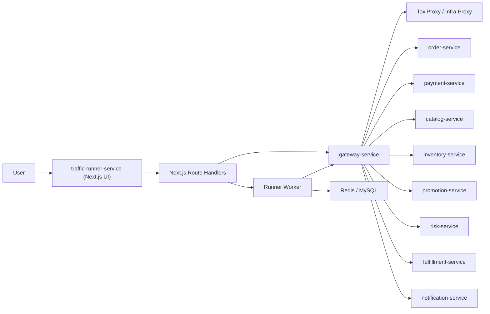

# Traffic Runner Next.js + pnpm 重构设计

**状态**：Draft / 待审批  
**目标**：将 `traffic-runner-service` 从 Java Spring Boot 控制服务，重构为 `Next.js + pnpm` 项目，并吸收现有 `chaos-console` 的前端与控制能力；同时重新定义 Chaos 触发 API 与适配规则，消除现有“gateway 静态页 + 多服务直连 chaos endpoint + runner 局部控制 API”并存的问题，并确保 traffic 控制面只能通过 gateway 访问后端能力。

---

## 1. 背景与问题

当前仓库里存在两套相互交叠、但未完全收敛的控制面设计：

### 1.1 现状

1. `gateway-service` 内置 `chaos-console.html` 静态页面。
2. 该页面直接调用各微服务旧式 chaos 端点，例如：
   - `/internal/chaos/slow-sql/enable`
   - `/internal/chaos/memory-leak/start`
   - `/internal/chaos/deadlock/enable`
   - `/internal/toxiproxy/...`
3. `traffic-runner-service` 又已经开始承载新的控制面后端，例如：
   - `/internal/runner/status`
   - `/internal/runner/config`
   - `/internal/runner/scenario/table-lock/*`
   - `/internal/runner/scenario/slow-query/*`
   - `/internal/runner/scenario/memory-pressure/*`
4. 文档层面已经出现“console 后端在 runner”与“console 页面在 gateway”的双重设计。

### 1.2 主要问题

1. 控制面入口分裂。
   - 页面挂在 `gateway-service`
   - 运行控制在 `traffic-runner-service`
   - 网络故障代理在 `gateway-service`
   - 各类 chaos 触发又分散在业务服务自身

2. 触发规则不统一。
   - 老接口以“直接触发某服务某种 chaos”为中心。
   - 新接口以“场景控制”或“规则写入 Redis / 调目标服务”为中心。
   - 字段命名、启停语义、状态查询语义并不一致。

3. 网络边界不清晰。
   - 当前设计默认 traffic 可能直连业务服务。
   - 但目标约束应为：traffic 只能访问 gateway，由 gateway 统一分发到业务服务或基础设施。

4. 规则模型与项目约束未完全对齐。
   - 项目关键约束要求 chaos bean 统一支持 `enable + durationSec` 自动关闭。
   - 现有 memory leak 仍是 `start/stop/clear` 三段式模型。
   - 现有 console 直接依赖服务级旧 API，导致前端逻辑高度耦合实现细节。

5. 技术栈不符合新目标。
   - 新目标是将 `traffic-runner-service` 改造成 `Next.js + pnpm` 项目。
   - 因此需要重新界定它是“Next.js 控制台 + BFF + 独立 worker”的新形态，而不是 Spring Boot 微服务。

---

## 2. 本次重构目标

### 2.1 目标

1. `traffic-runner-service` 重构为一个独立的 `Next.js + pnpm` 应用。
2. 将 `chaos-console` 的 UI 与操作能力整体迁移到新的 traffic 应用。
3. 将“流量控制、场景控制、故障注入、状态聚合、预设场景触发”统一收口到 traffic 应用。
4. 对外重新定义统一触发 API，作为唯一有效的开发协议。
5. 明确旧 chaos endpoint 与旧控制台直接下线，不做兼容保留。

### 2.2 非目标

1. 本文档不直接落地具体代码实现。
2. 本文档不展开具体代码实现细节，但会明确新的统一 chaos 协议。
3. 本文档不改变 Task 09 中关于流量配置版本控制、库存重置乐观锁等关键不变量。
4. 本文档不移除 `gateway-service` 的网关职责；相反会增强它的控制分发职责，但移除它承载控制台页面的职责。

---

## 3. 重构后的目标架构

## 3.1 新的角色定义

重构后的 `traffic-runner-service` 变成一个新的控制平面应用，包含三部分：

1. `Next.js UI`
   - 替代旧 `chaos-console.html`
   - 提供流量控制、故障控制、拓扑状态、预设场景入口

2. `Next.js Route Handlers / BFF`
   - 提供 Runner 控制 API
   - 统一封装 Traffic Control API
   - 只通过 `gateway-service` 访问业务服务与基础设施能力
   - 聚合状态，向前端输出统一视图模型

3. `Runner Worker`
   - 承载持续流量调度
   - 承载库存重置调度
   - 承载 `durationSec` 到期自动关闭等后台任务

### 3.2 架构原则

1. 前端只调用 traffic 应用自己的 BFF/API，不再直连各个微服务 chaos 端点。
2. Next.js Route Handlers 是唯一 HTTP 控制入口，负责：
   - 参数校验
   - 规则统一与参数校验
   - 调用 gateway 控制分发 API
   - 状态聚合
3. `Runner Worker` 负责持续调度、定时器、恢复任务等后台职责。
4. `traffic-runner-service` 不允许直连任何业务服务。
5. 业务服务继续负责“真正执行 chaos”，但只能通过 gateway 暴露受控入口。
6. gateway 负责统一分发 traffic 控制请求到业务服务、toxiproxy、以及必要的基础设施代理。
7. gateway 不再承载控制台前端。

### 3.3 逻辑拓扑



---

## 4. 迁移范围

### 4.1 从旧 `chaos-console` 迁移到 traffic 的能力

以下能力全部迁移到新的 traffic 应用：

1. 服务拓扑展示
2. Slow SQL 开关与状态展示
3. Memory Leak 开关与状态展示
4. Deadlock 开关与状态展示
5. ToxiProxy 网络故障注入
6. Grafana / Tempo 深链
7. Task 19 预设场景按钮
8. 一键恢复
9. 操作日志面板

### 4.2 保留在 traffic 中的原有能力

以下 Runner 能力继续存在，由 Next.js Route Handlers 对外提供，由 worker 或服务端模块执行：

1. `status`
2. `pause / resume`
3. `rate`
4. `config` 热更新
5. `inventory-reset` 调度与触发
6. `data-warmup/progress`

### 4.3 从 gateway 下线的能力

以下内容应视为废弃对象：

1. `gateway-service/src/main/resources/static/chaos-console.html`
2. 旧 console JS/CSS 静态资源
3. gateway 作为控制台宿主的职责

保留但重新定位：

1. `gateway-service` 的 ToxiProxy 代理 API 可以继续存在。
2. 它与后续新增的 chaos 分发 API 一起，统一作为被 traffic control plane 调用的底层能力。
3. gateway 不再直接暴露控制台前端，但会成为唯一的控制分发入口。

---

## 5. 新的 API 设计原则

## 5.1 分层原则

新 API 分为两层：

1. `Runner Control API`
   - 面向流量生成与运行配置
   - 对应原 Task 09 能力

2. `Chaos Control API`
   - 面向故障注入、状态查询、场景执行、一键恢复
   - 吸收旧 console 的全部控制能力

### 5.2 统一原则

所有 Chaos 控制 API 统一遵循以下规则：

1. `enable / disable / status` 为标准动作。
2. 若某故障存在“清理资源”动作，则额外提供 `cleanup`，不能再让前端感知 `stop/clear` 差异。
3. 所有启用类接口均接受统一控制字段：
   - `enabled` 不作为请求字段；动作用 URL 表达
   - `durationSec` 必填或提供默认值
   - 需要概率控制时使用 `injectRate`
   - 需要范围控制时使用 `scope`
4. 所有状态类接口统一返回：
   - `active`
   - `startedAt`
   - `autoDisableAt`
   - `targets`
   - `details`
5. 所有 API 返回格式继续复用 `ApiResponse<T>` 风格，避免全仓库出现第二种响应壳。

### 5.3 编排原则

traffic control plane 对下游分三种调用模式：

1. `gateway-dispatch`
   - Next.js Route Handlers 或 worker 只调用 gateway 的统一控制分发端点
   - gateway 再将请求转发到目标微服务的新 chaos endpoint
   - 适用于 slow sql / deadlock / memory leak / table-lock 等服务内故障

2. `redis-driven`
   - worker 或服务端模块直接写 Redis，或经 gateway 代理写 Redis
   - 适用于 v2 方案里基于 Redis 的场景传播

3. `proxy-driven`
   - 通过 gateway 的基础设施代理 API 注入网络故障

是否采用哪一种模式，不暴露给前端，由 traffic control plane 内部决定。

补充约束：

1. 不保留旧 chaos endpoint。
2. 不做兼容转发或别名桥接。
3. traffic control plane 与各业务服务统一切换到最新协议。
4. traffic control plane 到业务侧的所有 HTTP 调用必须先经过 gateway。

---

## 6. 统一触发模型

## 6.1 统一资源命名

推荐将 Chaos 资源统一建模为：

1. `slow-sql`
2. `memory-leak`
3. `deadlock`
4. `network-delay`
5. `network-reset`
6. `table-lock`
7. `scenario`

### 6.2 统一 API 路径

推荐采用以下风格：

```text
/internal/traffic/runner/*
/internal/traffic/chaos/*
/internal/traffic/scenarios/*
```

原因：

1. `runner` 与 `chaos` 是不同控制域。
2. 后续 `traffic-runner-service` 已不再只是“runner”，而是整个 traffic control plane。
3. 可以避免继续扩散 `/internal/runner/scenario/...` 这种层级混杂的路径。

### 6.3 Gateway 分发职责

为满足“traffic 只能访问 gateway”的约束，gateway 需要新增一层控制分发 API。

推荐由 gateway 暴露：

```text
POST   /internal/gateway/chaos/slow-sql/enable
POST   /internal/gateway/chaos/slow-sql/disable
GET    /internal/gateway/chaos/slow-sql/status

POST   /internal/gateway/chaos/memory-leak/enable
POST   /internal/gateway/chaos/memory-leak/disable
POST   /internal/gateway/chaos/memory-leak/cleanup
GET    /internal/gateway/chaos/memory-leak/status

POST   /internal/gateway/chaos/deadlock/enable
POST   /internal/gateway/chaos/deadlock/disable
POST   /internal/gateway/chaos/deadlock/cleanup
GET    /internal/gateway/chaos/deadlock/status

POST   /internal/gateway/chaos/table-lock/enable
POST   /internal/gateway/chaos/table-lock/disable
GET    /internal/gateway/chaos/table-lock/status

POST   /internal/gateway/network-delay/enable
POST   /internal/gateway/network-delay/disable
GET    /internal/gateway/network-delay/status

POST   /internal/gateway/network-reset/enable
POST   /internal/gateway/network-reset/disable
GET    /internal/gateway/network-reset/status
```

规则：

1. traffic control plane 只调用 gateway 的这些入口。
2. gateway 负责校验目标服务是否允许被控制。
3. gateway 负责将请求分发到对应业务服务或 toxiproxy 代理。
4. gateway 负责统一注入 traceId、审计日志与错误格式。

### 6.4 Runner API

```text
GET    /internal/traffic/runner/status
POST   /internal/traffic/runner/pause
POST   /internal/traffic/runner/resume
POST   /internal/traffic/runner/rate

GET    /internal/traffic/runner/config
PUT    /internal/traffic/runner/config

GET    /internal/traffic/runner/inventory-reset/schedule
PUT    /internal/traffic/runner/inventory-reset/schedule
POST   /internal/traffic/runner/inventory-reset/trigger

GET    /internal/traffic/runner/data-warmup/progress
```

### 6.5 Chaos API

```text
GET    /internal/traffic/chaos/overview

POST   /internal/traffic/chaos/slow-sql/enable
POST   /internal/traffic/chaos/slow-sql/disable
GET    /internal/traffic/chaos/slow-sql/status

POST   /internal/traffic/chaos/memory-leak/enable
POST   /internal/traffic/chaos/memory-leak/disable
POST   /internal/traffic/chaos/memory-leak/cleanup
GET    /internal/traffic/chaos/memory-leak/status

POST   /internal/traffic/chaos/deadlock/enable
POST   /internal/traffic/chaos/deadlock/disable
POST   /internal/traffic/chaos/deadlock/cleanup
GET    /internal/traffic/chaos/deadlock/status

POST   /internal/traffic/chaos/network-delay/enable
POST   /internal/traffic/chaos/network-delay/disable
GET    /internal/traffic/chaos/network-delay/status

POST   /internal/traffic/chaos/network-reset/enable
POST   /internal/traffic/chaos/network-reset/disable
GET    /internal/traffic/chaos/network-reset/status

POST   /internal/traffic/chaos/table-lock/enable
POST   /internal/traffic/chaos/table-lock/disable
GET    /internal/traffic/chaos/table-lock/status
```

### 6.6 Scenario API

```text
GET    /internal/traffic/scenarios
POST   /internal/traffic/scenarios/{scenarioId}/run
POST   /internal/traffic/scenarios/recover-all
GET    /internal/traffic/scenarios/history
```

---

## 7. 各类故障的适配规则

这是本次设计最关键的部分：新 traffic API 不能只是换路径，必须统一规则，并要求下游服务同步按最新协议改造。

## 7.1 Slow SQL

### 规则

1. 保留现有项目约束：
   - 支持 `injectRate`
   - 支持 `durationSec`
   - 到期自动关闭
   - `real` 模式必须使用 `SELECT SLEEP(N)` 在事务内触发
2. 前端不再直接面向单服务操作，而是支持多目标服务批量启停。
3. Route Handlers 负责将一个批量请求拆分为多个 gateway 分发调用。

### 推荐请求模型

```json
{
  "targets": ["catalog-service", "order-service"],
  "mode": "real",
  "delayMs": 2000,
  "injectRate": 0.5,
  "scope": "ALL",
  "durationSec": 180
}
```

### 适配规则

1. Next.js 服务端逐个调用 gateway 分发端点，由 gateway 转发到目标服务。
2. 所有支持 slow sql 的服务必须同时实现 `/enable`、`/disable`、`/status`，但这些能力只经由 gateway 暴露给 traffic。
3. 批量操作结果必须返回成功与失败明细，不能只返回整体 200。

## 7.2 Memory Leak

### 规则

memory leak 不再沿用旧的 `start / stop / clear` 协议，统一切换为标准化外部语义：

1. `enable`
2. `disable`
3. `cleanup`
4. `status`

### 最新协议要求

1. `enable`
   - 业务服务开始执行内存泄漏注入
   - 必须支持 `durationSec` 自动停止注入
2. `disable`
   - 业务服务停止继续分配，但不主动释放已持有内存
3. `cleanup`
   - 业务服务释放已持有内存

### 推荐请求模型

```json
{
  "targets": ["order-service", "payment-service"],
  "chunkSizeKb": 1024,
  "intervalMs": 300,
  "maxMb": 350,
  "durationSec": 180
}
```

### 强制规则

1. 新 UI 绝不直接暴露 `start/stop/clear` 文案。
2. 文档、前端、Node.js、业务服务统一使用 `enable/disable/cleanup`。
3. `enable` 必须支持 `durationSec` 自动停止注入。

## 7.3 Deadlock

### 规则

1. 保留项目约束：
   - 死锁注入本质为“两事务 swapped row lock order”
   - 支持 `injectRate`
   - 支持 `durationSec`
2. traffic API 支持多目标服务批量控制，但当前仅 `order-service` 与 `payment-service` 可用。

### 推荐请求模型

```json
{
  "targets": ["order-service", "payment-service"],
  "injectRate": 0.3,
  "scope": "ALL",
  "durationSec": 180
}
```

### 适配规则

1. `enable` -> 调 gateway 分发端点，再由 gateway 调各服务 `/internal/chaos/deadlock/enable`
2. `disable` -> 调 gateway 分发端点，再由 gateway 调各服务 `/internal/chaos/deadlock/disable`
3. `cleanup` -> 调 gateway 分发端点，再由 gateway 调各服务 `/internal/chaos/deadlock/cleanup`

## 7.4 Network Fault

### 规则

网络故障不再让前端直接拼 ToxiProxy 请求，而由 traffic API 抽象为两类：

1. `network-delay`
2. `network-reset`

### 推荐请求模型

```json
{
  "proxyName": "order-to-payment",
  "latencyMs": 3000,
  "jitterMs": 1000,
  "durationSec": 180
}
```

或：

```json
{
  "proxyName": "order-to-payment",
  "durationSec": 60
}
```

### 适配规则

1. `network-delay/enable` -> 调 gateway 的基础设施代理 API 创建 toxic
2. `network-delay/disable` -> 删除对应 toxic
3. `network-reset/enable` -> 创建 reset_peer toxic
4. `durationSec` 到期由 worker 自动清理 toxic

## 7.5 Table Lock

### 规则

表锁场景继续由 traffic API 统一控制，但需要对齐现有项目约束：

1. `durationSec` 最大 600 秒
2. 必须返回当前目标表、目标服务、到期时间
3. enable 失败时不能只写一半状态

### 推荐请求模型

```json
{
  "targetService": "order-service",
  "targetTable": "orders",
  "durationSec": 120
}
```

### 适配规则

1. 先调用 gateway 分发端点，再由 gateway 调目标服务表锁接口尝试真正建锁。
2. 目标服务调用成功后，再写入 traffic 侧状态存储。
3. 若调用失败，不落激活状态，避免出现“前端显示已开启，实际没锁住”的假阳性。

这里与当前 `ScenarioController` 的实现顺序相反，属于必须修正的设计点。

---

## 8. 状态聚合规则

## 8.1 单资源状态格式

统一返回模型建议为：

```json
{
  "resource": "slow-sql",
  "active": true,
  "targets": [
    {
      "service": "order-service",
      "active": true,
      "supported": true,
      "lastError": null
    }
  ],
  "startedAt": "2026-04-21T12:00:00Z",
  "autoDisableAt": "2026-04-21T12:03:00Z",
  "details": {
    "mode": "real",
    "delayMs": 2000,
    "injectRate": 0.5
  }
}
```

### 8.2 Overview 聚合接口

`GET /internal/traffic/chaos/overview` 返回：

1. runner 当前运行状态
2. 各 chaos 资源当前 active 状态
3. 每个资源的目标服务摘要
4. 最后一次操作记录
5. 可选的 Grafana / Tempo 深链模板参数

作用：

1. React 首页初始加载只打一到两个接口
2. 不再让前端以高频轮询多个服务端点拼页面

---

## 9. 预设场景规则

旧 console 的预设场景逻辑直接写在前端 JS 里，这种做法不再保留。

## 9.1 新规则

1. 所有预设场景定义迁移到 Next.js 服务端 / worker。
2. 前端只展示场景元数据与“执行”按钮。
3. 场景编排步骤由后端统一维护，避免前端代码里散落具体注入细节。

### 9.2 场景定义格式

可采用配置文件或代码常量，例如：

```json
{
  "id": "s5",
  "name": "双服务死锁",
  "description": "同时对 order 与 payment 注入死锁",
  "steps": [
    {
      "type": "deadlock.enable",
      "payload": {
        "targets": ["order-service"],
        "injectRate": 0.4,
        "durationSec": 180
      }
    },
    {
      "type": "deadlock.enable",
      "payload": {
        "targets": ["payment-service"],
        "injectRate": 0.3,
        "durationSec": 180
      }
    }
  ]
}
```

### 9.3 Recover All 规则

`recover-all` 必须是后端编排动作，不允许继续由前端 best-effort 调多个接口。

原因：

1. 前端不可控，容易因部分请求失败导致恢复不完整。
2. 后端可以记录失败项、重试、输出审计日志。

---

## 10. 下线与切换策略

## 10.1 对前端入口的处理

1. 新入口改为 traffic 应用地址，例如：
   - `http://localhost:18086/`
2. README 中原 `http://localhost:18080/chaos-console.html` 直接移除。

### 10.2 对旧 gateway console 的处理

直接切换，不保留双入口：

1. 删除旧页面文件与相关静态资源。
2. gateway 中移除控制台页面引用与说明。
3. README、演示脚本、验证文档全部切换到新入口。

### 10.3 对旧微服务 chaos endpoint 的处理

不保留旧接口：

1. 业务服务直接改造成新的统一协议。
2. 旧接口不做别名、不做桥接、不做兼容转发。
3. 开发、测试、文档、前端全部以最新协议为唯一标准。

### 10.4 对现有 `/internal/runner/scenario/*` 的处理

直接废弃：

1. 新实现全部改为 `/internal/traffic/chaos/*`
2. `/internal/runner/scenario/*` 不再保留
3. 新增能力只允许进入新路径

---

## 11. 技术设计建议

## 11.1 Node.js 技术边界

Next.js + worker 建议承担以下职责：

1. Next.js UI 与静态资源托管
2. Route Handlers / BFF
3. Runner Worker 调度
4. Chaos 自动关闭计时器
5. 状态缓存与聚合

不建议承担：

1. 将所有业务逻辑重写为 Node 微服务
2. 替代各业务服务内部的 chaos 执行逻辑

### 11.2 技术选型约束

1. 前端与服务端统一采用 `Next.js`
2. Node 包管理统一采用 `pnpm`
3. 默认使用 TypeScript
4. 持续调度器与后台任务由独立 worker 进程承担，不直接绑定在页面请求生命周期

### 11.3 Runner 调度迁移原则

由于原 `traffic-runner-service` 是 Java 实现，迁移到 Node 后需保证以下不变量不变：

1. 配置热更新仍要求 `version` 乐观锁。
2. DB 更新成功后再原子替换内存规则。
3. 库存重置仍需 `expectedVersion + distributed lock`。
4. 调速仍支持不停机即时生效。

### 11.4 状态存储建议

状态来源分层：

1. Runner 配置状态：MySQL
2. 触发中的 Chaos 运行态：Node.js 内存 + Redis
3. 通过 gateway 聚合或转发获取的下游实时状态：按需轮询 / 拉取

建议：

1. `durationSec` 自动关闭不要只依赖前端定时器。
2. 由 worker 统一托管控制面级自动关闭任务。
3. 各业务服务自身的 chaos 实现也必须支持 `durationSec` 自动关闭。
4. 对必须跨重启持久的场景，写 Redis 或 MySQL 保存最小状态。

---

## 12. 必须遵守的规则清单

以下是审批时建议重点确认的硬规则。

### 12.1 控制入口规则

1. 新前端只能调用 Next.js 自身的服务端 API。
2. React 不可直接调用业务服务 chaos endpoint。
3. React 不可直接调用 gateway toxiproxy endpoint。
4. traffic control plane 不可直接调用业务服务 HTTP 接口，只能调用 gateway。

### 12.2 API 规则

1. 所有新能力只能增加在 `/internal/traffic/*` 下。
2. 禁止继续扩展 `/internal/runner/scenario/*`。
3. 所有 enable 接口必须支持 `durationSec`。
4. 需要概率控制的场景必须支持 `injectRate`。
5. gateway 必须提供与 traffic 控制面配套的统一分发 API。

### 12.3 切换规则

1. 旧服务 chaos endpoint 直接下线，不保留兼容。
2. 旧 gateway console 直接移除，不保留迁移提示页。
3. 所有新文档、README、演示流程都应切换到新的 traffic 入口。
4. traffic 到业务的访问路径统一切换为 `traffic -> gateway -> services`。

### 12.4 一致性规则

1. memory leak 的协议统一为 `enable/disable/cleanup`。
2. deadlock 的清理动作统一为 `cleanup`。
3. table lock 的状态写入必须在真实加锁成功后进行。
4. recover-all 必须后端执行，不能继续放在前端脚本里。

---

## 13. 推荐实施顺序

为了降低风险，建议按以下顺序实施：

1. 先完成设计文档审批。
2. 搭建新的 `traffic-runner-service` Next.js + pnpm 项目骨架。
3. 先迁移“旧 console 前端 UI + 新 BFF 壳层”。
4. 再把旧 console 的操作调用改成 traffic API。
5. 再迁移 Runner 控制能力。
6. 再补 `overview`、`scenarios`、`recover-all` 等聚合能力。
7. 最后同步删除旧 chaos endpoint、旧 console 静态资源与 README 旧文案。

---

## 14. 待你审批的关键决策

请重点确认以下设计决策是否符合你的预期：

1. `traffic-runner-service` 是否接受被定义为“Next.js UI + Route Handlers + 独立 worker”的一体化控制平面应用。
2. 新 API 前缀是否接受统一收口到 `/internal/traffic/*`，而不是继续沿用 `/internal/runner/scenario/*`。
3. `traffic -> gateway -> services` 是否作为唯一允许的网络访问路径。
4. `chaos-console` 是否按“gateway 直接下线、traffic 完整接管”处理。
5. gateway 是否接受新增统一的 chaos / network 分发 API。
6. 所有 chaos endpoint 是否接受不做兼容、直接按最新协议重写。
7. memory leak 与 deadlock 的清理动作是否统一为 `cleanup`。
8. 预设场景与 recover-all 是否接受从前端脚本迁到 Next.js 服务端 / worker 编排。
9. 表锁场景是否接受“先真实加锁成功，再写激活状态”的一致性修正。

---

## 15. 审批通过后的文档落地项

审批通过后，下一步我会继续补齐并更新以下文档：

1. `task-09-traffic-runner-service.md`
2. `task-16-v2-service-integration.md`
3. `README.md`
4. 如有必要，新增专门的 `task-xx-traffic-console-react-node.md`
