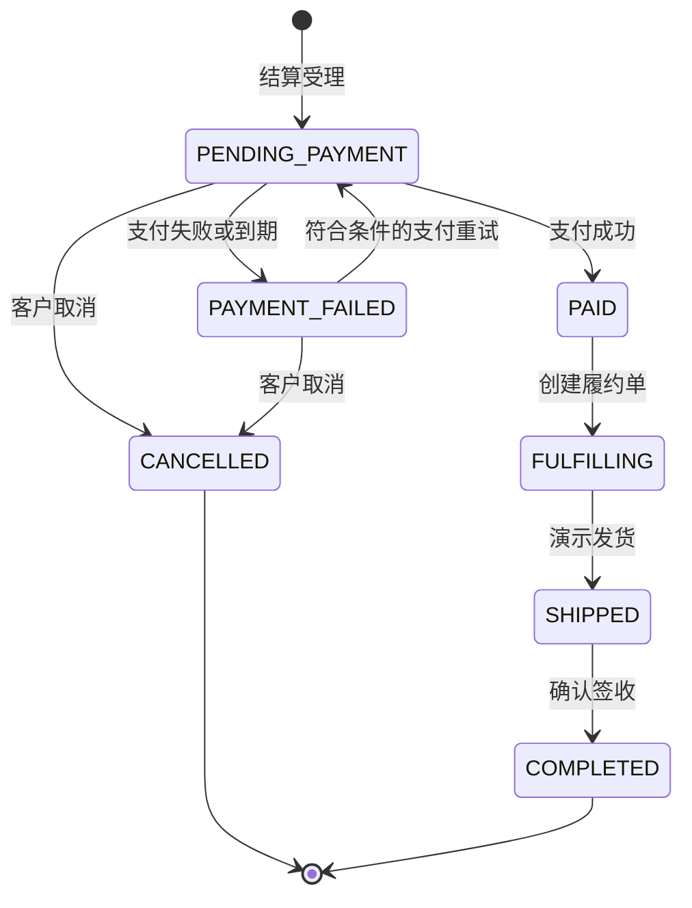

# Castrel Shopfront 产品规格

## 文档信息

| 项目 | 内容 |
| --- | --- |
| 状态 | 已批准基线 |
| 版本 | 1.0 |
| 更新日期 | 2026-08-20 |
| 面向对象 | 产品、研发、测试、培训运营人员 |

## 1. 产品定义

Castrel Shopfront 是基于 Castrel Chaos 服务构建的培训与演示电商前台。客户完成真实感的购物流程；独立部署的运营控制台负责产生流量、注入受控故障及观测系统行为。

本产品不是生产级商城。它使用种子数据和模拟支付，但订单、库存、定价、履约、通知、访问控制和故障恢复必须贴近真实业务，以支撑功能演示和混沌工程训练。

## 2. 目标与非目标

**目标**

1. 提供账号、商品目录、购物车、结算、模拟支付、订单历史和物流追踪的完整消费者闭环。
2. 让合成流量覆盖与消费者一致的完整购物流程，并保持混沌验证可用。
3. 在库存不足、支付失败、超时和指定故障注入时提供可理解、可恢复且前后一致的客户结果。
4. 通过部署、路由和授权边界隔离消费者体验与运营控制能力。
5. 通过指标、日志与链路追踪观测业务结果。

**Version 1 非目标**：真实支付及资金、发票/税费/PCI 合规、多商家市场、退换货、评价/推荐/收藏、完整商业后台、多币种国际物流和生产级身份提供商集成。

## 3. 角色与权限

| 角色 | 核心诉求 | 访问范围 |
| --- | --- | --- |
| 客户 | 浏览、购买、支付、追踪个人订单 | 仅 `shopfront`；已认证个人数据 |
| 培训运营人员 | 控制流量、故障、数据重置并观察恢复 | 仅 `traffic-control-plane`；需要运营权限 |
| 服务 | 执行内部编排和事件投递 | 仅私有服务间 API |

客户不得访问运营控制能力。不能仅通过隐藏导航实现隔离，必须由授权校验和入口边界强制执行。

## 4. 消费者体验

### 4.1 账号和地址

- 访客可使用邮箱、密码和昵称注册；客户可登录、登出、刷新会话、查看资料。
- 客户可新增、编辑、删除地址及设置默认地址。
- 平台提供两个预置演示账号，供培训走查使用。
- 客户仅能访问自己的资料、地址、购物车、订单、支付、物流和通知。

### 4.2 商品目录

- 支持按分类分页浏览、关键字搜索，并按相关度、价格或最新可售商品排序。
- 商品详情展示名称、SKU、价格、分类、可售状态和商品媒体。
- 下架或不可售商品必须明确可辨，不能加入购物车或结算。

### 4.3 购物车和结算

- 每个已认证客户拥有一个持久化活动购物车，可添加商品、修改数量、删除或清空。
- 结算前展示商品小计，并提示价格变动、下架或库存不足。
- 单笔订单支持多个 SKU；客户选择已保存地址和一张符合条件的优惠券。
- 服务端重新计算商品价格、优惠、库存可用性和应付金额；客户端金额只用于展示。
- 订单保存不可变的商品、数量、单价、优惠、地址和金额快照。
- 客户结算必须携带幂等键；重复提交返回同一订单，不能重复预占库存。

### 4.4 模拟支付、订单和物流

- 结算后展示已创建支付意图的支付页，客户确认模拟支付并得到成功、失败或超时结果。
- 在订单仍可支付时允许重试；支付终态失败必须释放库存预占。
- 客户可查看分页订单历史和订单详情，详情包含明细、冻结金额、支付状态、地址快照和履约状态。
- 仅未支付、未发货订单可取消；取消释放库存。
- 已支付订单异步创建演示发货单和物流时间线；客户收到站内消息或模拟邮件通知。
- Version 1 的模拟退款仅用于运营/测试，不支持客户自助退款。

### 4.5 合成流量

- 流量 runner 使用预置演示客户和服务凭据，经网关触发完整业务流程：商品浏览/搜索、购物车变更、多商品结算、支付意图创建、模拟支付确认、支付后履约与通知。
- runner 的流量规则可配置各动作比例、商品数量、支付成功/失败/超时比例和取消比例，以形成可解释的业务流量。
- 取消流量必须从 `PENDING_PAYMENT` 订单中选择，不能尝试取消已支付订单。
- runner 不模拟浏览器会话，不使用客户 Cookie，也不将任意 `userId` 作为公开 API 参数；它使用专用内部身份调用网关受控的流量入口。

## 5. 业务规则

| 规则 | 要求 |
| --- | --- |
| 金额 | 所有持久化和计算金额使用十进制运算，禁止浮点数。 |
| 价格 | 结算创建价格快照；后续调价不得改变完成订单金额。 |
| 库存 | 有效结算的每个明细均预占；支付终态失败、取消或到期时释放全部预占。 |
| 归属 | 已认证主体决定客户资源；绝不信任浏览器提交的 `userId`。 |
| 幂等 | 结算和支付确认幂等；不得重复生成订单、扣款、库存预占、履约或通知。 |
| 优惠券 | 在结算时重新校验资格；成功预留/确认后只能消费一次。 |
| 履约 | 仅已支付且支付后风控通过的订单可创建发货记录。 |
| 副作用 | 履约与通知可安全重试；临时下游失败不得使已确认支付失效。 |

## 6. 订单生命周期

`PAYMENT_FAILED` 对本次支付尝试是终态，但订单未必终结；未取消且未超过库存预占有效期时可支付重试。

## 7. 故障体验

| 场景 | 客户可见行为 | 平台要求 |
| --- | --- | --- |
| 商品下架 | 不允许加购或结算 | 不产生库存预占 |
| 库存不足 | 结算页明确提示 | 不产生部分完成订单；已预占明细须补偿 |
| 价格或优惠券变化 | 确认前展示更新后金额和说明 | 服务端重新计算权威金额 |
| 支付失败 | 保留订单，在符合条件时提供重试/取消 | 库存遵循待支付预占策略 |
| 支付超时 | 保持待确认，直至对账或到期 | 幂等确认和状态查询避免重复扣款 |
| 故障注入引发异常 | 展示稍后重试和关联标识 | 链路、日志、指标记录失败；不得泄漏其他客户数据 |

## 8. 发布验收标准

1. 新用户可注册、登录、管理地址并登出。
2. 用户可浏览/搜索商品，向购物车加入至少两个商品，并在刷新会话后保留购物车。
3. 用户可对多件商品结算、使用符合条件的优惠券，并看到服务端计算的总额。
4. 模拟支付成功后生成归属正确的已支付订单、物流时间线和通知记录。
5. 支付失败和取消均恰好释放一次预占库存，并保留明确订单状态。
6. 用户不能访问其他用户的购物车、地址、订单、支付、履约或通知数据。
7. 流量 runner 经网关执行商品浏览、购物车、多商品结算、支付确认、履约与通知的完整链路，并可观测各步骤结果。
8. 消费者入口拒绝内部/运营路径，未认证运营操作被拒绝。
9. 至少一种指定故障注入产生可恢复的客户错误，同时保留交易日志、指标和链路上下文。

## 9. 产品指标与交付顺序

| 指标 | 用途 |
| --- | --- |
| 商品浏览、搜索量、加购率 | 商品发现和购买意图 |
| 购物车到结算转化率 | 结算流程阻力 |
| 结算成功/失败率、支付重试率 | 交易与模拟支付质量 |
| 库存补偿次数 | 预占正确性 |
| 履约创建延迟、Outbox 投递延迟/失败次数 | 支付后处理和异步可靠性 |
| 按故障模式划分的客户可见错误率 | 混沌演练结果 |

交付顺序：身份/授权、全新数据库 Schema 和测试基础；商品读模型和持久化购物车；多商品结算、支付和订单 API；Outbox 履约和通知；独立消费者前台、部署边界和端到端验证。

技术实现细节与接口约束见 [technical-design.md](technical-design.md)。