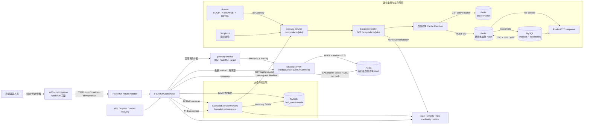

# 商品详情 Redis 回源与 Hash 大值场景技术设计

## 文档信息

| 项目 | 内容 |
| --- | --- |
| 状态 | Phase F 页面与文档已完成，Phase G 待验收 |
| 版本 | 1.0 |
| 更新时间 | 2026-09-02 CST（Phase F 完成） |
| 范围 | `catalog-service` 商品详情、`traffic-control-plane` 生命周期与 Fault Run、`gateway-service` 固定分发 |
| 配套规格 | [product.md](product.md) |

## 1. 设计结论

本方案将商品详情变成由 Catalog 所有的 Redis Hash cache-aside，并把现有 Cart Redis 大值场景不兼容替换为 `CATALOG_REDIS_LARGE_VALUE`。

关键结论：

- 登录仍然由 user-service 查询数据库并签发客户会话，不缓存凭据。
- 正常商品详情入口仍为 `GET /api/products/{sku}`，不新增旁路业务 API。
- 默认缓存和 Fault Run 缓存都使用 Hash；一个运行只创建一个运行级 Hash。
- Hash field name 使用 SKU；`memberCount=N` 是 field 数，不是顶层 key 数，也不是读取并发。
- Fault Run 只生成 N 个 field，预留一个 probe SKU 不生成；正常生命周期请求 probe field，第一次自然触发 Redis miss、数据库查询、回填。
- Traffic/Fault Run 控制面只编排和观测，不直接写 Redis；Catalog 是商品详情缓存和 Redis 数据结构的唯一所有者。
- 正常请求不携带或依赖客户端提供的 Fault Run header。Catalog 通过服务端 active marker 选择当前运行 Hash。
- 大值 value 必须是合法的商品详情缓存 envelope。指定大小指序列化 value 的逻辑 UTF-8 字节，不包括 Redis 内部开销。
- “变慢或超时”是资源压力下的可观测结果，不是每组参数都必须满足的固定断言；若要记录 timeout，必须有明确的请求 deadline。

## 2. 总体流程图

下面的流程同时描述运营人员创建运行、Catalog 发布 Hash、正常生命周期回源、大值读取 worker 和停止清理五条关联路径。



## 3. 组件职责与边界

| 组件 | 职责 | 不负责的事情 |
| --- | --- | --- |
| `traffic-control-plane` Fault Run Route | 校验运营输入、CSRF、确认、幂等、审计 | 不写 Redis，不选择任意服务或 URL |
| `FaultRunCoordinator` | 创建运行、固定 target 分发、状态迁移、到期恢复、summary 持久化 | 不生成商品缓存 value |
| `gateway-service` | 将场景映射到唯一 Catalog target；转发公开商品详情请求 | 不判断 Redis 类型，不执行业务回源 |
| `CatalogService` | 商品详情 cache resolver，命中、miss、回源、回填、错误降级 | 不接受客户端 Fault Run header 作为信任依据 |
| `CatalogProductDetailFaultRunController` | 校验运行上下文，生成 Hash fields，发布 marker，stop/cleanup | 不改变商品、库存、购物车或订单数据 |
| `ScenarioExerciseWorkers` | 对 ACTIVE 运行持续读取生成的 SKU fields，记录请求统计 | 不登录 Sam，不直连 Redis/MySQL |
| `RunnerEngine` / `TrafficActionOrchestrator` | 登录、浏览并执行必经 `PRODUCT_DETAIL_READ` | 不知道或操作 Redis key 内容 |
| Redis | 保存默认 Hash、运行 Hash、active marker 和运行 fencing 状态 | 不作为控制面审计数据库 |
| MySQL | 保存商品数据、库存数据和 Fault Run 证据 | 不保存完整大 value 或客户 token |

## 4. 名称、路由与固定目标

### 4.1 场景 catalog

将现有 `CART_REDIS_LARGE_VALUE` 替换为：

| 字段 | 值 |
| --- | --- |
| scenario | `CATALOG_REDIS_LARGE_VALUE` |
| targetService | `catalog-service` |
| targetOperation | `catalog-product-detail-large-value` |
| target start | `/internal/catalog/fault-runs/start` |
| target stop | `/internal/catalog/fault-runs/stop` |
| target cleanup | `/internal/catalog/fault-runs/cleanup` |
| recoveryStrategy | `TARGET` |
| allowManualCleanup | `true` |

Gateway 的 `FaultRunDispatchController` 只保留上述固定映射。请求 body 必须包含现有 Fault Run 上下文字段；Gateway 拒绝未知 scenario、错误 operation、错误 target service、任意 URL 和批量 targets。

### 4.2 公开商品详情入口

```http
GET /api/products/{sku}
X-Trace-Id: <trace-id>
Authorization: Bearer <access-token>  # 生命周期/Shopfront 请求按现有客户认证规则携带
```

Catalog 内部 provisioning 不复用公开请求的认证头，也不要求正常生命周期传递 `X-Fault-Run-*`。公开 API 的响应仍为既有 `ApiResponse<ProductDTO>`，缓存实现细节不泄露给客户。

## 5. Redis 数据模型

### 5.1 Key 命名空间

| Key | 类型 | 用途 | TTL/清理 |
| --- | --- | --- | --- |
| `catalog:product-detail:cache` | Hash | 无 Fault Run 时的默认商品详情缓存 | 通过 envelope 的逻辑过期控制；不能用 key TTL 删除全部商品 field |
| `catalog:product-detail:active` | String/JSON | 当前 ACTIVE 商品详情运行的可信 marker | marker TTL 覆盖运行期；停止时 compare-and-delete |
| `catalog:product-detail:active:owner` | String | active marker 的 run owner | 与 marker 同步设置/删除；用于防止旧 run 清理新 run |
| `catalog:product-detail:active:fence` | String/数值 | active marker 的 fencing token | 与 owner 同步设置/删除；用于 CAS 发布/清理 |
| `catalog:product-detail:exercise:{faultRunId}` | Hash | 单个 Fault Run 的 N 个大 field 和后续 probe 回填 | 运行级 TTL；按 run 删除 |
| `castrel:scenario:fence:catalog-service` | String/数值 | 目标侧 fencing 保护 | 沿用 `ScenarioRunGuard` 规则 |

`faultRunId` 只能来自已经通过 Gateway 和 `ScenarioRunContext` 校验的运行上下文。Redis key 不接受控制台传入的任意前缀或完整名称。

### 5.2 Active marker

Catalog target 在运行 Hash 完整写入并校验后，最后发布 marker。marker 示例：

```json
{
  "schemaVersion": 1,
  "faultRunId": "8b0c6e0a-0000-4000-8000-000000000001",
  "fencingToken": 17,
  "hashKey": "catalog:product-detail:exercise:8b0c6e0a-0000-4000-8000-000000000001",
  "probeSku": "SKU-050",
  "expiresAt": "2026-09-02T12:30:00Z"
}
```

marker 是 Catalog 自己写入的服务端状态，不接受请求头中的等价字段。resolver 必须校验 schema、`expiresAt`、hash key 的运行命名空间和 fencing 关系；缺失或过期 marker 时使用默认缓存。marker 读取失败时不能猜测当前运行，直接进入数据库 fallback，并记录 `CACHE_BACKEND_ERROR`。

### 5.3 商品详情缓存 envelope

缓存 value 使用 JSON envelope，外层结构稳定，商品详情仍保留现有 DTO：

```json
{
  "schemaVersion": 1,
  "sku": "SKU-001",
  "cachedAt": "2026-09-02T12:00:00Z",
  "expiresAt": "2026-09-02T12:05:00Z",
  "product": {
    "id": 1,
    "sku": "SKU-001",
    "name": "...",
    "price": 299.00,
    "status": 1,
    "category": "Electronics",
    "mediaUrl": null,
    "availableQty": 1000000
  },
  "padding": "..."
}
```

要求：

- resolver 只接受正确 schema、SKU 与 field 一致、商品字段类型正确且未逻辑过期的 value。
- `padding` 只用于 Fault Run 的大值 payload，不能改变 `product` 的业务语义。
- `memberSizeBytes` 统计整个 JSON value 的 UTF-8 字节数，不统计 Hash key、field name、Redis object overhead 或网络协议开销。
- target 用 UTF-8 序列化后计算长度，逐步调整 padding 直到达到精确 S；S 小于无 padding envelope 的最小长度时拒绝请求。
- `availableQty` 是动态库存快照，使用短逻辑 TTL；缓存详情不替代库存服务的实时校验。
- 运行 Hash 因 Redis 淘汰或重启后由 probe 回源重新创建时，resolver 会在回填后恢复有限的 `run-fallback-ttl`；默认值为 `PT31M`，覆盖最大运行时长和清理宽限期。
- 运行 Hash 被淘汰或重启后由 probe 回源重新创建时，resolver 会使用 `run-fallback-ttl` 恢复有限 key TTL；默认配置为 `PT31M`，覆盖最大运行时长和清理宽限期。

## 6. 商品详情 Cache Resolver

### 6.1 读取算法

```text
getProduct(sku):
  validate sku
  targetHash = defaultHash

  marker = Redis GET active marker
  if marker is valid and not expired:
    targetHash = marker.hashKey
  if marker read fails:
    record CACHE_BACKEND_ERROR
    return databaseFallback(sku, doNotWriteCache=true)

  cached = Redis HGET targetHash sku
  if cached is valid and not logically expired:
    record CACHE_HIT
    return cached.product
  if cached exists but is invalid:
    HDEL targetHash sku when safe
    record CACHE_INVALID_FALLBACK

  product = ProductRepository.findBySku(sku)
  if product is absent:
    throw PRODUCT_NOT_FOUND
  dto = toDTO(product)
  HSET targetHash sku serialize(dto)
  record CACHE_MISS_DB_FALLBACK
  return dto
```

Redis read、反序列化和数据库 fallback 必须有明确的 request deadline。HGET 失败时不应把异常 value 写回缓存；Redis 连接异常时可以直接查询数据库，但不能无限重试 Redis。数据库查询失败或超过 deadline 时返回稳定的服务错误，并保留 trace 关联。

### 6.2 默认缓存与运行缓存

- 无 active marker：resolver 使用 `catalog:product-detail:cache`。
- active marker 有效：resolver 使用 marker 指向的运行 Hash；命中注入 field 时返回大 envelope 中的同一 `ProductDTO`。
- probe field 未预生成：resolver 在运行 Hash 中 miss，回源数据库并 HSET 到运行 Hash。
- 运行停止：marker 先失效，之后的请求切回默认 Hash；运行 Hash 清理不会删除默认 Hash 的同名 SKU field。
- 商品详情缓存命中不改变 `validateListedProduct`、checkout、库存预占或支付的权威查询路径。

### 6.3 结果与指标

使用低基数结果标签，不将 SKU、run ID、完整 key 或 value 作为 Prometheus label：

| 结果 | 含义 |
| --- | --- |
| `CACHE_HIT` | 合法且未过期的 Redis value 命中 |
| `CACHE_MISS_DB_FALLBACK` | field 不存在，数据库查询成功并回填 |
| `CACHE_INVALID_FALLBACK` | value 存在但 schema/TTL 不合法，已回源 |
| `CACHE_BACKEND_ERROR` | marker 或 HGET/HSET 发生 Redis 错误 |
| `PRODUCT_NOT_FOUND` | 数据库没有对应 SKU |
| `PRODUCT_DETAIL_TIMEOUT` | 详情读取超过调用方明确 deadline |
| `PRODUCT_DETAIL_DB_ERROR` | 商品数据库查询失败 |

Catalog 日志只记录 trace、结果类型、耗时、是否运行缓存和非敏感摘要；不记录 authorization、密码、token 或完整 payload。Fault Run 事件记录 field count、逻辑字节、观测字节、请求统计和清理状态，不记录 value 内容。

## 7. Fault Run provisioning

### 7.1 参数与校验

控制面 catalog 和 Catalog target 做双重校验。推荐约束如下，部署配置可以收紧，但不能放宽服务端硬上限：

| 参数 | 推荐范围/规则 |
| --- | --- |
| `durationSec` | `1..1800`；运行到期时间由控制面计算 |
| `memberCount` | 正整数；不超过可售 SKU 数减一；至少保留一个 probe SKU |
| `memberSizeBytes` | 正整数；不小于合法 envelope 的最小 UTF-8 大小 |
| `aggregateLogicalBytes` | `memberCount * memberSizeBytes` 不超过部署侧总预算，例如默认 64 MiB |
| `concurrency` | `1..32`；仅影响持续读取 worker |
| `requestIntervalMs` | `0..60000` |
| `keyTtlSec` | 必须覆盖 `durationSec` 加清理余量，且不超过场景上限 |

服务端还必须拒绝非有限数、浮点 integer、负数、未知参数、不可售 SKU 覆盖、无法保留 probe 的 N、超过 Redis headroom 的总预算和 TTL 不足的请求。逻辑总字节和 Redis `MEMORY USAGE` 是两个不同口径：前者用于输入预算，后者用于运行后观测。

### 7.2 SKU 选择与 probe

Catalog target 读取当前可售且库存为正的 SKU，按稳定排序选择 field 集合。规则必须在生命周期和 target 之间可复现：

1. 将可售 SKU 按确定性顺序排序。
2. 预留排序结果中的最后一个 SKU 作为 `probeSku`。
3. 从剩余 SKU 中选择前 `memberCount` 个作为注入 fields。
4. 将实际选择的 SKU 摘要和 probe SKU 放入 target summary；worker 使用 summary 中的 fields，不依赖运行时猜测。

如果可售 SKU 发生变化导致无法保留 probe，start 失败且不发布 marker。生命周期从实际浏览结果中使用相同的稳定 probe 规则；如果该 SKU 不在本次有界浏览结果中，则记录 `PRODUCT_DETAIL_READ` 的明确无候选结果，而不是随机请求固定下架 SKU。

### 7.3 原子建立与发布

start 操作的顺序：

1. 解析并校验 `ScenarioRunContext`，验证 scenario、operation、expiresAt、fencing token 和内部服务认证。
2. 调用 `ScenarioRunGuard.acceptStart(context)`，拒绝旧 token 和过期运行。
3. 查询可售 SKU、保留 probe，计算 N、S 和总预算。
4. 在临时运行 key 中批量写入 N 个 field；每个 value 使用合法 envelope 并精确达到 S 字节。
5. 校验 `HLEN`、field 数、逻辑字节和必要时的 Redis `MEMORY USAGE`；设置运行 Hash TTL。
6. 用原子 rename/transaction 或等价方式将临时 key 变为正式运行 key。
7. 最后以 compare-and-set 语义发布 active marker，并设置 marker TTL。
8. 返回 target summary；任何失败都不发布 marker，并删除本次临时或正式 key。

目标 start 返回的非敏感 summary 至少包含：

```json
{
  "accepted": true,
  "faultRunId": "...",
  "layout": "HASH",
  "hashKey": "catalog:product-detail:exercise:<faultRunId>",
  "memberCount": 8,
  "memberSizeBytes": 65536,
  "logicalBytes": 524288,
  "observedBytes": 540000,
  "probeSku": "SKU-050",
  "expiresAt": "...",
  "keyTtlSec": 900,
  "memberSkus": ["SKU-001", "SKU-002"]
}
```

`memberSkus` 是有界的公开 SKU 标识列表，不包含 value；控制台可以只展示数量和摘要。Coordinator 必须将 target summary 保存到 `TARGET_CONFIRMED` 事件或等价的运行详情字段，否则重启后的 worker 无法可靠知道实际 field 集合。

## 8. 大值读取 Worker

`ScenarioExerciseWorkers` 扫描 ACTIVE Fault Run 时，对 `CATALOG_REDIS_LARGE_VALUE` 启动无客户会话的 Catalog reader：

1. 从持久化 target summary 取得 `memberSkus`；如果 summary 缺失，不猜测 field，记录 setup failure。
2. 按受限 `concurrency` 和 `requestIntervalMs` 选择已生成 SKU。
3. 使用 `GatewayClient.get('/api/products/{sku}')` 调用公开商品详情 API；worker 不直连 Catalog、Redis 或 MySQL。
4. 每个请求创建独立 trace，并使用统一 per-request deadline；将成功、HTTP 错误、timeout、latency 和 in-flight 数放入运行事件汇总。
5. 运行进入 `RECOVERING`、停止或到期后不再发起新请求，等待或取消 in-flight 请求后写 `SCENARIO_WORKER_DRAINED`。

Coordinator 提供 `registerRunDrain(faultRunId, drain)` 注册接口。已注册的 worker 在 target stop 前被调用并等待完成，drain 结果与恢复结果一起写入 `RECOVERY_COMPLETED`/`RECOVERY_FAILED` 事件；worker finally 中注销注册，避免已结束的 worker 被重复调用。

worker 的请求并发不改变 Hash 的 field 数，也不在请求中携带 `X-Fault-Run-*` 头。大值影响来自真实商品详情响应经过 Catalog、Gateway 和网络返回，而不是 worker 自己读取并丢弃 Redis value。

Catalog 商品详情响应通过 `X-Castrel-Cache-Result` 返回低基数结果，允许 reader 统计 `CACHE_HIT`、`CACHE_MISS_DB_FALLBACK`、`CACHE_INVALID_FALLBACK` 和 `CACHE_BACKEND_ERROR`；该 header 不包含 SKU、run ID 或缓存 value。`ControlledExerciseWorker` 汇总 requests、successes、failures、timeouts、inFlight、average latency、p50/p95/p99 latency 和各 cache result 计数，并在 `EXERCISE_WORKER_STOPPED`/`SCENARIO_WORKER_DRAINED` 事件中保存非敏感摘要。

控制面页面从场景 catalog 渲染 `durationSec`、`memberCount`、`memberSizeBytes`、`concurrency`、`requestIntervalMs` 和 `keyTtlSec`。Catalog Hash 卡片明确显示“1 个 Hash + N 个 SKU field”和 `N × S` logical budget；页面不允许编辑 Hash key、field 集合或 value。详情页只从白名单事件字段渲染 target summary、worker telemetry、drain、marker/TTL、recovery/cleanup 和 audit 结果，per-run cleanup 使用固定 `faultRunId` contract。

## 9. 生命周期新增详情步骤

`TrafficActionOrchestrator.executeLifecycle()` 在 `BROWSE_CATALOG` 成功后执行：

```text
products = findSellableProducts()
probeSku = chooseStableProbeSku(products)
runStep(PRODUCT_DETAIL_READ, GET /api/products/{probeSku})
validate response.data.sku == probeSku
continue existing CART -> CHECKOUT -> ORDER -> PAYMENT/CANCEL flow
```

实现要求：

- 详情请求必须经 `GatewayClient.customerGet`，使用当前 lifecycle bearer session、trace 和 caller signal。
- 详情读取失败时记录 `PRODUCT_DETAIL_READ` 子步骤和稳定错误码；不应悄悄跳过该步骤后声称生命周期完整成功。
- `PRODUCT_DETAIL_READ` 不改变后续选品集合，购物车仍使用原有可售商品列表和购物车排除逻辑。
- 为详情请求增加明确 deadline，并区分 `LIFECYCLE_INTERRUPTED` 与 `PRODUCT_DETAIL_TIMEOUT`。
- 更新现有 lifecycle test mock，至少断言请求顺序为 `BROWSE_CATALOG -> /api/products/{sku} -> CART_READ_INITIAL`。
- 正常生命周期不依赖 marker 内容；它只调用公开商品详情 API，因此 Shopfront 与 Runner 都走同一 resolver。

调用方商品详情 deadline 由 `PRODUCT_DETAIL_REQUEST_TIMEOUT_MS` 配置，默认 `5000ms`，服务端将有效值限制在 `100ms..30000ms`。orchestrator 为每次详情读取创建独立 `AbortController`：父生命周期 signal 触发时返回 `LIFECYCLE_INTERRUPTED`，内部 deadline 触发时返回 `PRODUCT_DETAIL_TIMEOUT`；两者都不会继续读取购物车或重复提交后续业务操作。

## 10. Stop、fencing 与清理

### 10.1 停止顺序

协调器与 worker 需要协作完成以下顺序：

```text
RECOVERING
  -> stop accepting new exercise requests
  -> drain/cancel in-flight reader requests
  -> target stop: compare-and-delete active marker
  -> target cleanup: delete only this run hash
  -> write recovery summary
  -> STOPPED or RECOVERED
```

如果目标 stop 被重复调用，已删除资源视为成功；如果 marker 当前指向不同 run 或更高 fencing token，旧运行只能删除自己的 Hash，不能删除当前 marker。

### 10.2 目标侧保护

- `ScenarioRunContext` 必须先校验时间、UUID、operation 和 fencing token。
- `ScenarioRunGuard` 保存 Catalog 服务最近接受的 token；较旧 token 的 start、stop、cleanup 都拒绝。
- marker 删除使用 run ID 与 fencing token 的 compare-and-delete，而不是无条件 `DEL catalog:product-detail:active`。
- 运行 Hash key 必须由服务端根据 run ID 派生；cleanup 不接受任意 key。
- 运行 Hash 和 marker 都有 TTL；控制面崩溃时目标资源不应永久存留或继续影响正常详情读取。
- 控制面 coordinator 的 target summary、恢复结果和清理错误进入 `fault_run_events`，不写入商品表或购物车表。

### 10.3 重启恢复

控制面启动时：

1. 扫描 `CREATING`、`ACTIVE` 和 `RECOVERING` 运行。
2. `CREATING` 运行执行补偿并删除未发布的临时 key。
3. `RECOVERING` 运行继续 stop/cleanup。
4. 已过期的 `ACTIVE` 运行进入统一 recovery。
5. 目标服务重启后只根据仍有效的 marker、TTL 和 fencing 状态决定是否继续服务运行 Hash；过期 marker 不得重新激活。

## 11. Fault Run 数据与观测

### 11.1 运行详情

`fault_runs` 保留场景、固定目标、参数快照、状态、时间、fencing、audit、trace 和 recovery 结果。增加或等价补充 target summary，至少能表达：

- `layout=HASH`、Hash 顶层 key 数为 1。
- `memberCount`、`memberSizeBytes`、`logicalBytes`、`observedBytes`。
- probe SKU、member SKU 数量/摘要、Hash namespace。
- marker 发布结果、TTL、target start/stop/cleanup 结果。
- 读取 worker 的请求数、成功/失败/timeout、延迟摘要和 drain 结果。

不保存完整 payload、客户密码、access token、session token、refresh token 或 authorization header。

### 11.2 关联关系

- 正常生命周期：`trafficRunId -> lifecycleId -> PRODUCT_DETAIL_READ -> traceId`。
- Fault Run target：`faultRunId -> target summary -> SCENARIO_WORKER_* events -> traceId`。
- 两类请求可以共享业务服务和公开 API，但不能共享客户 token、worker session 或伪造 Fault header。
- 若需要在统一活动页区分两类请求，使用受保护的场景/运行摘要字段，不把 Fault Run 信息写进客户请求的可控身份字段。

## 12. 测试策略

### 12.1 TypeScript

- catalog 识别 `CATALOG_REDIS_LARGE_VALUE`，拒绝旧 Cart 场景输入、未知参数和错误 target。
- 验证 `memberCount`、`memberSizeBytes`、总 logical budget、TTL、并发和间隔的边界。
- Coordinator 保存 target start summary，并在 stop、补偿、到期和重启恢复时保留状态。
- 生命周期测试验证 `LOGIN -> BROWSE_CATALOG -> PRODUCT_DETAIL_READ -> CART` 顺序、响应 SKU 校验、错误码和 timeout。
- worker 测试验证使用 summary 中的 memberSkus、bounded concurrency、deadline、停止 drain 和不创建客户 session。
- 页面测试验证“1 个 Hash + N 个 field”、预算提示、运行详情和不展示 value/secret。

### 12.2 Java

- CatalogService Redis hit 不查询 product repository。
- field miss 查询 product repository、生成 DTO 并 HSET；第二次读取命中。
- invalid envelope、逻辑过期、Redis read/write error、商品不存在和数据库异常有稳定结果。
- active marker 缺失、过期、错误 schema、旧 fencing 和不同 run marker 均按预期处理。
- provisioning 验证 Hash field 数、精确 logical bytes、合法 envelope、probe 排除、aggregate budget、TTL 和 target summary。
- stop/cleanup 验证 compare-and-delete、按 run 删除、重复调用幂等、错误 token 不得删除新 run。
- Controller 验证固定 scenario/operation、内部认证、时间和 fencing 上下文。

### 12.3 API/Compose smoke

可复现的商品详情 Hash 验收入口为 `RUN_CATALOG_PRODUCT_DETAIL_SMOKE=true ./scripts/integration-test.sh`；该开关只在已有 Gateway、Catalog 和控制面可用时追加业务 smoke，默认 integration test 仍只检查 MySQL/Redis 基线。

1. 用运营 session 和 CSRF 创建短时 `CATALOG_REDIS_LARGE_VALUE`。
2. 验证 Gateway 只转发到 Catalog 固定 target，Fault Run 进入 `ACTIVE`，target summary 可查询。
3. 使用 Redis 只读命令确认运行 key 类型为 Hash、field 数为 N、value 逻辑字节为 S、marker 指向当前 run、TTL 覆盖运行期；另记录 `MEMORY USAGE`。
4. 调用一个注入 SKU 的商品详情接口确认命中；调用 probe SKU 第一次确认 DB fallback 和 HSET，第二次确认 hit。
5. 运行正常 Runner，确认 `PRODUCT_DETAIL_READ` 记录在登录和浏览之后；同时观察详情 latency、Catalog DB query、Redis memory 和 Gateway 错误。
6. 停止或等待到期，确认 worker drain、marker 先失效、运行 Hash 清理，默认缓存和业务数据保持。
7. 重启控制面或 Catalog，确认旧 fencing/run 不能删除新资源，过期 marker 不会重新激活。

## 13. 实施顺序

1. 先实现商品详情 cache envelope、Hash resolver、逻辑 TTL、hit/miss/backend-error 结果和 Java 测试。
2. 再在 lifecycle orchestrator 增加 `PRODUCT_DETAIL_READ`、probe 选择、deadline 和 TypeScript 测试。
3. 将场景 catalog、Gateway fixed mapping 和 Catalog target 改为 `CATALOG_REDIS_LARGE_VALUE`，实现 N/S/预算/TTL 双重校验。
4. 扩展 Fault Run target summary 持久化，接入 Catalog Hash provisioning、active marker、fencing、stop/cleanup 和 worker drain。
5. 更新 Traffic/Fault Run 页面与详情事件，移除 Cart/Sam 大值文案和 scenario-wide cleanup。
6. 完成 API/Compose smoke、停止/到期/重启恢复验证，并确认旧 Cart Redis exercise 代码和文档引用已删除或明确标注为迁移历史。

## 14. 兼容性与迁移

这是针对 Redis 大值场景的不兼容替换：

- 新代码不应同时维护 Cart 大值和 Catalog 大值两个可创建场景，否则 UI、active marker 和单运行语义会产生歧义。
- 发布前停止并清理旧的 `CART_REDIS_LARGE_VALUE` ACTIVE/RECOVERING 运行；本次盘点确认没有遗留运行或 key，因此旧 Cart controller、worker、ownership 和 cleanup 代码已删除，不保留旧运行兼容入口。
- 删除或停用 Cart 的 `CartFaultRunController`、Sam exercise worker、运行购物车写入和 scenario-wide Cart cleanup 后，普通 Cart 业务路径保持不变。
- 更新 `fault-run-catalog.ts`、Gateway 固定映射、场景页面、Fault Run 详情、任务清单和 `_docs/chaos-inject-plane/` 中的旧描述，使 Catalog 专题成为唯一有效的大值设计。
