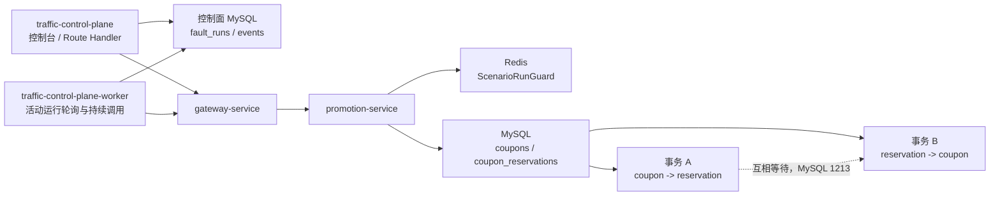

# Promotion 死锁场景验收与排查记录

本文用于在启用 `PROMOTION_LOCK_CONTENTION` 后，核对实际调用链、MySQL 死锁证据和 Tempo trace 是否符合预期。每次演练完成后，填写文末的“实际结果”列，并给出 `MATCH`、`PARTIAL` 或 `MISMATCH` 判定。

## 1. 场景边界

本场景的固定目标如下：

| 项目 | 预期值 |
| --- | --- |
| Scenario | `PROMOTION_LOCK_CONTENTION` |
| Target service | `promotion-service` |
| Target operation | `coupon-reservation-consistency` |
| 业务表 | `coupons`、`coupon_reservations` |
| 竞争方式 | 两条真实 JDBC 事务以相反顺序获取行锁 |
| 演练数据 | 本次运行创建的、属于 Sam（`user_id = 19`）的过期 reservation |
| 释放方式 | 停止或到期后删除本次运行创建的 reservation，并释放 Redis fencing token |

这里的死锁不是库存表锁。`INVENTORY_TABLE_EXCLUSIVE` 才会经过 `inventory-service` 并持有 `LOCK TABLES inventories WRITE`；死锁场景不应经过 `order-service`、`payment-service`、`inventory-service`、`catalog-service` 或 `cart-service`。

实现参照：[CouponReservationConsistencyService.java](../../promotion-service/src/main/java/com/castrel/chaos/promotion/service/CouponReservationConsistencyService.java)、[CouponReservationConsistencyController.java](../../promotion-service/src/main/java/com/castrel/chaos/promotion/controller/CouponReservationConsistencyController.java) 和 [FaultRunDispatchController.java](../../gateway-service/src/main/java/com/castrel/chaos/gateway/controller/FaultRunDispatchController.java)。

## 2. 实际调用链



### 2.1 启动阶段

```text
traffic-control-plane
  -> gateway-service: POST /internal/gateway/fault-runs/start
  -> promotion-service: POST /internal/promotion/fault-runs/start
  -> Redis: ScenarioRunGuard.acceptStart()
  -> MySQL: 选择 Sam 的 coupon，插入本次运行的过期 coupon_reservations
```

控制面同时在自己的 MySQL 中创建 `fault_runs` 和 `fault_run_events` 记录。这个控制面数据库访问是编排旁路，不是死锁事务的一部分。

### 2.2 持续竞争阶段

`traffic-control-plane-worker` 轮询控制面 MySQL 中的活动运行，然后反复调用：

```text
traffic-control-plane-worker
  -> gateway-service: POST /internal/gateway/promotion/consistency
  -> promotion-service: POST /internal/promotion/consistency
  -> Redis: 校验运行是否仍被接受
  -> MySQL: 在 Promotion 内启动两条反向加锁的 JDBC 事务
```

每次 Promotion 核对请求都会创建两条事务：

```sql
-- 事务 A
SELECT id FROM coupons
 WHERE id = ? FOR UPDATE;
SELECT id FROM coupon_reservations
 WHERE id = ? FOR UPDATE;

-- 事务 B
SELECT id FROM coupon_reservations
 WHERE id = ? FOR UPDATE;
SELECT id FROM coupons
 WHERE id = ? FOR UPDATE;
```

两条事务在第一条 `FOR UPDATE` 后同步，再获取对方已经持有的行锁。InnoDB 检测到环路后，会选择一个事务作为受害者并返回原始 `SQLException`，错误码为 `1213`。该异常不再被业务代码包装为 `BizException`，而是从 consistency 接口直接抛出；Promotion 的全局异常处理器记录完整堆栈并返回 HTTP 500。通过 Gateway 观察入口时，Gateway 会将下游失败映射为 HTTP 502。

### 2.3 停止或到期阶段

```text
traffic-control-plane
  -> gateway-service: POST /internal/gateway/fault-runs/stop
  -> promotion-service: POST /internal/promotion/fault-runs/stop
  -> Redis: 释放 fencing token
  -> MySQL: 删除本次运行创建的 coupon_reservations
  -> traffic-control-plane: 将运行置为 STOPPED（人工停止）或 RECOVERED（到期）
```

停止后应确认没有新的竞争请求，已准备的 reservation 已删除，原始 coupon 和其他客户数据未被修改。

## 3. 验证步骤

### 3.1 启动前检查

确认以下组件正常运行：

```bash
docker compose ps traffic-control-plane traffic-control-plane-worker \
  gateway-service promotion-service mysql redis
curl http://localhost:18080/actuator/health
```

Compose 默认给 Java 服务附加 OpenTelemetry agent，并将 trace 发往 Tempo。若要验证 Promotion 的 agent 配置：

```bash
docker compose exec promotion-service printenv OTEL_SERVICE_NAME ENABLE_OTEL_AGENT OTEL_EXPORTER_OTLP_ENDPOINT
```

### 3.2 启用并记录运行信息

在控制台选择“Promotion deadlock”，记录：

- `faultRunId`
- `expiresAt`
- `fencingToken`
- 控制面保存的业务关联 `traceId`
- `concurrency` 和 `requestIntervalMs`

建议首次验证使用 `concurrency = 2` 或 `4`，并将 `requestIntervalMs` 设为 `0` 到 `1000` 之间，以便在短时间内产生多个核对请求。并发参数限制仍以场景 catalog 和服务端校验为准。

### 3.3 观察接口结果

控制面 worker 会自动调用观察接口。若需要手工复核，可使用运行记录中的四个字段调用 Gateway；不要直接调用 Promotion：

```bash
curl -X POST http://localhost:18080/internal/gateway/promotion/consistency \
  -H "Content-Type: application/json" \
  -H "X-Internal-Service-Key: $CASTREL_INTERNAL_SERVICE_KEY" \
  -d '{
    "faultRunId": "<faultRunId>",
    "expiresAt": "<expiresAt>",
    "fencingToken": <fencingToken>,
    "idempotencyKey": "<idempotencyKey>"
  }'
```

由于死锁异常会直接抛出，预期不再是成功响应。直接访问 Promotion 的 consistency 接口时，预期结果为 HTTP 500，响应中的 message 为 MySQL 异常信息；通过 Gateway 观察入口时，预期结果为 HTTP 502。控制面 worker 应记录一次 `EXERCISE_REQUEST_FAILED`，Promotion 日志和 JDBC span 中保留原始 SQL 异常。

不要用 worker 的 HTTP 成功数作为死锁判定；一次 MySQL 死锁应表现为 Promotion 的原始 `SQLException` 和 Gateway 的下游失败。

### 3.4 保存数据库证据

先从控制面数据库读取运行记录和事件：

```sql
SELECT fault_run_id, scenario, target_service, target_operation,
       state, trace_id, expires_at, stopped_at, recovery_result, recovery_error
FROM fault_runs
WHERE scenario = 'PROMOTION_LOCK_CONTENTION'
ORDER BY created_at DESC
LIMIT 1;

SELECT event_type, payload, created_at
FROM fault_run_events
WHERE fault_run_id = '<faultRunId>'
ORDER BY created_at, id;
```

MySQL 的死锁证据优先使用 InnoDB 状态和错误日志：

```bash
docker exec -it castrel-mysql mysql -ucastrel -p castrel \
  -e 'SHOW ENGINE INNODB STATUS\G'
docker logs --since=10m castrel-mysql 2>&1 \
  | rg -i 'deadlock|1213|LATEST DETECTED DEADLOCK'
```

`infra/mysql/my.cnf` 已开启 `innodb_deadlock_detect = ON` 和 `innodb_print_all_deadlocks = ON`。错误日志中应能看到涉及 `coupons` 和 `coupon_reservations` 的两个事务以及其中一个事务被回滚。

## 4. Tempo 与日志中的预期

### 4.1 Tempo trace 结构

在一次持续核对请求对应的 Tempo trace 中，预期看到类似结构：

```text
gateway-service: HTTP server
  └─ HTTP client -> promotion-service
       └─ promotion-service: HTTP server /internal/promotion/consistency
            ├─ Redis GET 或脚本调用：校验 ScenarioRunGuard
            ├─ JDBC: SELECT ... FROM coupons ... FOR UPDATE
            ├─ JDBC: SELECT ... FROM coupon_reservations ... FOR UPDATE
            ├─ JDBC: SELECT ... FROM coupon_reservations ... FOR UPDATE
            └─ JDBC: SELECT ... FROM coupons ... FOR UPDATE
                 └─ 某一个等待锁的 span 出现 MySQL 1213 异常
```

由于两条事务在 Promotion 的线程池中并行运行，两个 `FOR UPDATE` 序列应有重叠的时间区间。span 的具体名称可能因 OpenTelemetry agent 版本和语义约定不同而显示为 SQL、JDBC URL 或数据库操作名称；不要只按固定 span 名称判定，应检查以下内容：

- service name 为 `gateway-service` 和 `promotion-service`；
- HTTP 路径分别对应 Gateway 观察入口和 Promotion consistency 入口；
- 数据库 span 的目标为 MySQL，操作涉及 `coupons`、`coupon_reservations` 和 `FOR UPDATE`；
- 至少一个 JDBC span 记录错误码 `1213`、死锁异常或等价的 SQLException 信息；
- Promotion HTTP server span 应体现下游处理失败，直接访问 Promotion 时为 HTTP 500；通过 Gateway 观察时外层请求为 HTTP 502；
- MySQL 不会作为一个独立 HTTP 服务节点出现在 trace 中，数据库证据通常表现为 Promotion 进程下的 JDBC 子 span。

### 4.2 Trace ID 的两个概念

本项目同时使用两种关联 ID：

| ID | 来源 | 用途 | 能否直接作为 Tempo Trace ID |
| --- | --- | --- | --- |
| `X-Trace-Id` | 控制面生成并保存到 `fault_runs.trace_id` | 业务运行、请求头和审计关联 | 不能保证 |
| OTel Trace ID | Java agent 根据 W3C `traceparent` 生成 | Tempo 中的 trace 主键 | 可以 |

当前 worker 只显式发送 `X-Trace-Id`。Java agent 会在 Gateway 入站时创建或接收 OTel trace，并将 W3C 上下文从 Gateway 的 WebClient 传给 Promotion。因此，同一个运行期间的多次核对通常会形成多条独立的 Tempo trace，而不是一条覆盖整个运行生命周期的 trace。

这意味着：

- 控制面页面或 `fault_runs.trace_id` 中的值不能直接拿去 Tempo 按 Trace ID 查询；
- 应在运行时间窗口内按 `gateway-service`、`promotion-service` 和请求路径查找单次 trace；
- 控制面 worker 本身默认不是 Java agent 服务，Tempo 中不一定出现 `traffic-control-plane-worker` 节点；
- 如果 Loki 展示了 `X-Trace-Id`，可用它做业务关联，但以当前部署的日志 encoder 和 agent 配置实际输出为准。

### 4.3 HTTP 成功不等于没有死锁

`CouponReservationConsistencyService` 不捕获或包装死锁事务的 `SQLException`。Future 中的原始异常会被解包后直接抛出，由 Promotion 的全局异常处理器记录堆栈并返回 500；经 Gateway 时再被映射为 502。因此，下列组合是正常的：

```text
JDBC span: ERROR / SQLException 1213
Promotion HTTP span: 500
Gateway observation span: 502
worker event: EXERCISE_REQUEST_FAILED
```

不要仅依据以下现象判定死锁未发生：

- Gateway 没有直接返回 MySQL 错误文本；Gateway 只返回固定的下游不可用错误；
- 控制面页面没有展示 MySQL 1213；原始异常应在 Promotion 日志和 JDBC span 中查找；
- 某一个 JDBC span 很快结束；死锁受害事务可能在 InnoDB 检测后立即失败。

如果请求本身超时、目标服务不可用或运行上下文失效，也会出现 worker 请求失败或 Gateway 502；必须进一步用 Promotion 的原始 `SQLException`、JDBC span 或 MySQL 日志区分具体原因。

## 5. 实际结果对照表

| 检查项 | 实际结果 | 预期结果 | 判定 |
| --- | --- | --- | --- |
| 场景和固定目标 |  | `PROMOTION_LOCK_CONTENTION -> promotion-service -> coupon-reservation-consistency` |  |
| 启动响应 |  | `accepted = true`，运行进入 `ACTIVE` |  |
| 经过的 HTTP 服务 |  | `traffic-control-plane -> gateway-service -> promotion-service` |  |
| 死锁数据库 |  | 仅涉及本次演练的 `coupons` / `coupon_reservations` 记录 |  |
| 竞争事务 |  | 一条 `coupon -> reservation`，一条 `reservation -> coupon` |  |
| 接口响应 |  | Promotion 直接请求为 HTTP 500；Gateway 观察请求为 HTTP 502 |  |
| 原始异常 |  | Promotion 堆栈和 JDBC span 中出现 MySQL `SQLException` / `1213` |  |
| worker 事件 |  | 通过 Gateway 的请求产生 `EXERCISE_REQUEST_FAILED` |  |
| MySQL 证据 |  | InnoDB 状态或错误日志出现真实 1213 死锁 |  |
| Tempo 服务节点 |  | `gateway-service` 和 `promotion-service`；不要求出现控制面 worker |  |
| Tempo 数据库 span |  | 两组重叠的 `FOR UPDATE` JDBC 操作，其中一个带死锁异常 |  |
| 无关服务 |  | 不应出现 `order-service`、`payment-service`、`inventory-service` 等业务调用 |  |
| 停止结果 |  | 人工停止为 `STOPPED`，到期为 `RECOVERED`，恢复结果成功 |  |
| 数据清理 |  | 本次 reservation 删除，原始 coupon 和其他客户数据保留 |  |
| 在途请求 |  | worker 最终停止，`inFlight = 0`，无持续新增竞争 |  |

## 6. 偏差判定

| 实际现象 | 判断和下一步 |
| --- | --- |
| Promotion 返回 500，Gateway 返回 502 | 符合当前实现；继续用 JDBC span 和 MySQL 日志确认真实 1213。 |
| 有两个 JDBC 序列，但没有 1213 | 尚未证明发生死锁；检查运行是否持续、两个事务是否重叠，以及 MySQL 错误日志。 |
| 只有 Gateway trace，没有 Promotion trace | 检查 Promotion 健康状态、OTel agent 是否启用、Tempo 时间范围和服务名。 |
| 有 Promotion HTTP span，没有 JDBC span | 检查 JDBC instrumentation 是否被禁用；MySQL 日志仍是独立的权威证据。 |
| 同一运行出现多条 Tempo trace | 符合当前传播方式；用时间窗口和 `faultRunId`/`X-Trace-Id` 做业务关联。 |
| Tempo 出现 order/payment/inventory 等节点 | 不符合死锁场景固定目标；检查是否同时运行了常规 Runner 或选择了 Inventory 表锁场景。 |
| 停止边界出现一次请求失败 | 先检查是否发生在 target stop 与 worker scanner 收敛之间；不要直接当作 MySQL 死锁失败。 |
| 停止后 reservation 仍存在 | 不符合预期；检查 Promotion stop 是否到达、运行 ID/fencing token 是否匹配，以及 cleanup 是否执行。 |
| MySQL 出现其他客户或非演练 reservation | 不符合数据隔离要求，应停止演练并检查准备数据及清理逻辑。 |

## 7. 本次演练记录

```text
验证日期：
环境/版本：
faultRunId：
X-Trace-Id（fault_runs.trace_id）：
expiresAt：
fencingToken：
concurrency：
requestIntervalMs：

Promotion consistency HTTP 状态：
Gateway observation HTTP 状态：
worker 是否产生 EXERCISE_REQUEST_FAILED：
观察到的 MySQL 异常/错误码：
运行终态：
Tempo trace ID（任选一条）：
MySQL 1213 证据位置：
实际经过的服务：
实际偏差：

最终判定：MATCH / PARTIAL / MISMATCH
判定说明：
```
