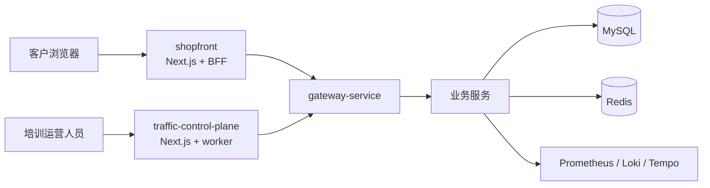
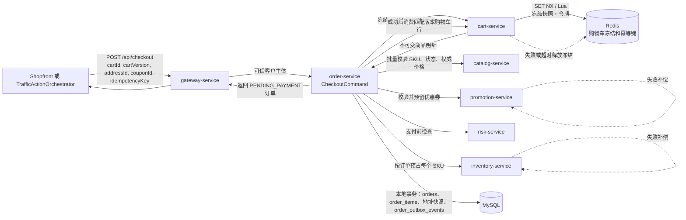
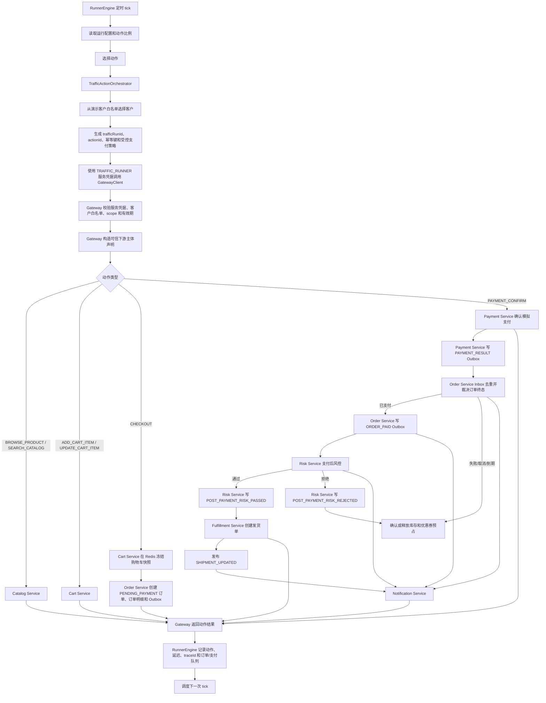
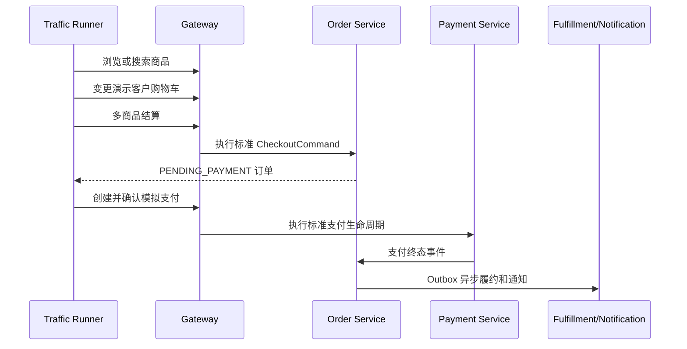
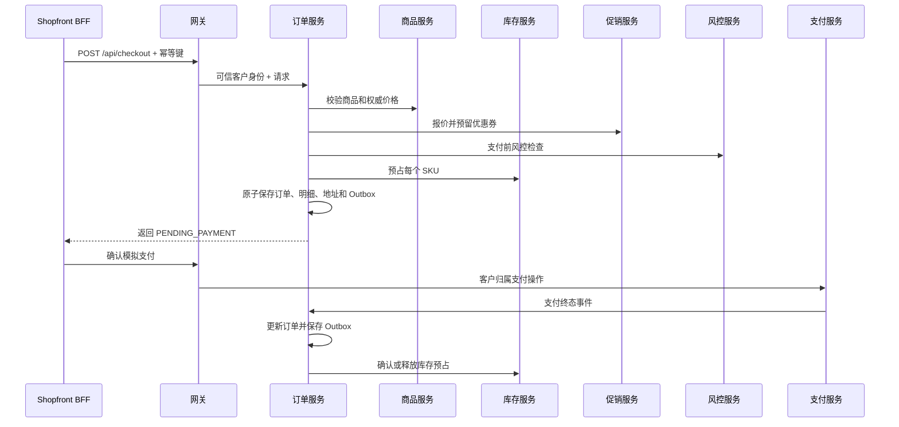

# Castrel Shopfront 技术设计

## 文档信息

| 项目 | 内容 |
| --- | --- |
| 状态 | 已批准基线 |
| 版本 | 1.0 |
| 更新时间 | 2026-08-20 09:44 CST |
| 范围 | 演示电商平台实现 |
| 配套文档 | [product.md](product.md) |

## 1. 架构目标与边界

本设计将 Castrel Chaos 演进为面向客户的演示商城，不削弱原有混沌工程训练能力。系统保留 runner 行为，所有浏览器面向服务的访问均经过网关，并隔离消费者商城与流量/混沌运营控制台。

设计优先保证资源归属、幂等、补偿和可观测恢复能力，而非生产级市场平台的完整性。



### 1.1 消费者和运营边界

- `shopfront` 是新建、独立部署的 Next.js/pnpm 应用。浏览器请求在此终止；其 BFF Route Handler 以仅服务端可见的配置调用 `gateway-service`。
- `gateway-service` 是业务 API 的唯一公开入口。生产式 Ingress 不暴露业务服务端口。
- 消费者应用不得暴露、代理、链接或加载 `/internal/**`。
- `traffic-control-plane` 独立部署，继续承载 runner、混沌、告警和总览；运营入口与消费者入口独立，要求 `OPERATOR` 权限。
- runner 不调用业务服务地址；它在 `traffic-control-plane` 内由 `TrafficActionOrchestrator` 编排，并经 `gateway-service` 触发与消费者一致的完整交易链路。
- 运营身份、会话策略、审计日志、Gateway 安全过滤器和 Ingress 网络限制是第一阶段前置条件，不是后续加固项；任何消费者或运营 API 上线前必须完成。

## 2. 服务职责

| 组件 | 职责 |
| --- | --- |
| `shopfront` | 客户 UI、服务端会话处理、消费者 BFF、客户安全的错误状态 |
| `gateway-service` | API 路由、令牌/服务凭据校验、角色控制、可信身份传递、请求头清洗 |
| `user-service` | 注册/登录/刷新/登出、客户资料、地址归属和 CRUD |
| `catalog-service` | 商品搜索/详情，以及内部批量校验/价格查询 |
| `cart-service` | 客户持久化购物车、商品变更和重校验 |
| `inventory-service` | 原子 SKU 预占/释放和可售库存投影 |
| `order-service` | 结算命令、订单/明细快照、状态机、取消和 Outbox 发布 |
| `promotion-service` | 优惠券资格、报价、预留、确认/释放 |
| `risk-service` | 结算前检查和订单事件驱动的支付后检查 |
| `payment-service` | 模拟支付意图、确认、状态、重试和退款生命周期 |
| `fulfillment-service` | 演示发货单创建和客户归属物流时间线 |
| `notification-service` | 幂等订单事件通知与客户通知已读状态 |
| `traffic-control-plane` | `RunnerEngine`、`TrafficActionOrchestrator`、合成流量、混沌分发和运营监控 |

新增 `cart-service` Maven/Spring Boot 模块，使购物车持久化和客户变更独立于前台，避免只有 UI 本地状态的购物车。

## 3. 身份认证和授权

- `user-service` 使用 BCrypt 哈希保存凭据，API 不得返回明文密码或密码哈希。
- 登录产生短期签名访问令牌及刷新/会话令牌；后者由 `shopfront` 保存为 `HttpOnly`、`Secure`、`SameSite=Lax` Cookie。
- 令牌声明包含不可变主体 ID、角色、令牌 ID、签发时间和过期时间。Version 1 角色为 `CUSTOMER` 和 `OPERATOR`。
- 网关校验令牌，移除传入的 `X-User-Id`、`X-User-Role` 及等价身份头，再向下游写入可信身份头。
- 客户公开 DTO 不得接受 `userId`；服务从可信网关上下文获取身份。
- 网关到业务服务使用受认证的内部通道；下游只接受该通道传递的短期、网关签名主体声明，并拒绝直连调用或伪造身份头。Compose 开发环境可用共享服务密钥实现，Kubernetes 生产演练使用工作负载身份或 mTLS。
- `traffic-control-plane` 的全部变更型 `/internal/**` Route Handler 必须校验 `OPERATOR` 会话；每次操作写入审计记录：操作者、目标、参数摘要、结果、关联 ID 与时间。

| 路由组 | 所需角色 | 说明 |
| --- | --- | --- |
| `/api/auth/**`、`/api/products/**` | 公开 | 身份和商品读取 |
| `/api/cart/**`、`/api/checkout` | `CUSTOMER` | 购物车和多商品结算 |
| `/api/orders/**`、`/api/payments/**` | `CUSTOMER` | 归属订单和支付 |
| `/api/fulfillments/**`、`/api/notifications/**` | `CUSTOMER` | 归属物流和通知 |
| `/internal/**` | `OPERATOR` 且私有入口 | `shopfront` 永不可达 |

身份签发链唯一且不可互换：`user-service` 签发 `CUSTOMER` / `OPERATOR` 用户访问令牌；`traffic-control-plane` 仅持有注册的 `TRAFFIC_RUNNER` 服务凭据，不能签发或伪造客户主体令牌。控制面从演示客户白名单选择客户 ID 后，以服务凭据和受控客户 ID 调用网关；网关校验服务凭据、客户白名单版本、`aud=gateway-service`、动作 scope 和短期有效期，再由网关签发仅下游可验的主体声明 `{actor=RUNNER, customerId, trafficRunId, allowedActions, exp}`。该声明不授予 `/internal/**` 或运营权限。

### 3.1 runner 内部编排

`RunnerEngine` 与 `TrafficActionOrchestrator` 同属 `traffic-control-plane` 进程，二者直接进行内部方法调用，不通过 HTTP 调用 `/internal/traffic/**` action 地址。`TrafficActionOrchestrator` 负责从服务端演示客户白名单选择客户、生成 `trafficRunId`、动作 ID、结算幂等键和支付结果策略，并使用 `TRAFFIC_RUNNER` 服务凭据及受控客户 ID 调用 `GatewayClient`；短期下游主体声明仅由网关生成。

编排器的动作输入仅包含 `action`、商品数量、支付结果策略等受控参数，禁止包含 `userId`、客户令牌、订单状态或权威金额。它调用消费者同一套购物车、`CheckoutCommand`、支付确认和查询 API；每次动作记录 `trafficRunId`、`actionId`、演示客户 ID、购物车版本、订单 ID、支付 ID、状态、错误码、耗时和 `traceId`。

受限 runner 主体不能读取或操作白名单外客户资源，也不能访问混沌/运营端点。`RunnerEngine` 以网关响应维护待支付订单、已支付订单和物流查询队列，不能依据本地猜测状态执行取消。

## 4. 订单模型与完整流量链路

现有订单 API 接受单个 `sku` 和 `qty`。数据库将清空并重建，新 Schema 直接采用多商品订单模型；runner 不依赖旧接口，而是覆盖与消费者相同的多商品结算和支付流程。

### 4.1 新结算契约

```json
{
  "idempotencyKey": "checkout-uuid",
  "cartId": "cart-001",
  "cartVersion": 7,
  "addressId": 101,
  "couponId": 42
}
```

服务端从认证主体推导 `userId`，并按 `cartId + cartVersion` 读取购物车。客户端总额、商品明细、商品名称、价格、优惠金额及支付金额均不是权威输入。购物车写操作使用版本号或 ETag；若后续提供“立即购买”，必须是独立命令，且不作为 runner 主链路。

`cart-service` 在 Redis 使用 `cart:checkout-freeze:{checkoutId}` 保存冻结快照、`cartId`、`customerId`、`cartVersion` 和有效期，并以 `SET NX`/Lua 脚本原子校验客户归属与版本、取得冻结令牌。`checkoutId` 与结算幂等键唯一绑定。`order-service` 仅使用返回的冻结明细，在本地事务中持久化 `order_items` 和地址快照；Redis 快照只用于结算期间的并发控制和失败补偿，过期或淘汰不能影响已经提交的订单事实。订单成功后 `cart-service` 以冻结令牌条件消费匹配版本的购物车行；失败、取消或超时则幂等释放该 Redis 冻结键。

### 4.1.1 Checkout 同步服务拓扑

`CHECKOUT` 只创建 `PENDING_PAYMENT` 订单，不执行支付确认、支付后风控、履约或通知。后续阶段见“事务性 Outbox”。



同步顺序与失败规则：

1. 网关认证客户或受限 runner 主体，并将可信客户上下文传给 `order-service`。
2. `cart-service` 使用 Redis 原子冻结指定版本的购物车；版本或归属不匹配时直接拒绝结算。
3. `order-service` 基于冻结明细调用 `catalog-service`、`promotion-service`、`risk-service` 和 `inventory-service`；客户端不提供权威价格或商品明细。
4. 商品校验、优惠券预留、风控或库存预占任一步失败，按已获取资源的逆序执行幂等补偿，并释放 Redis 冻结。
5. 所有同步校验和预占成功后，`order-service` 在本地 MySQL 事务中创建 `PENDING_PAYMENT` 订单、`order_items`、地址快照和 `order_outbox_events`。
6. 订单提交成功后才消费冻结版本对应的购物车行；无法消费时记录可重试任务，不回滚已成功创建的订单。

### 4.2 runner 完整交易流程

runner 在 `traffic-control-plane` 内通过 `TrafficActionOrchestrator` 编排动作；每一步经网关复用消费者同一领域服务、同一结算命令、同一支付状态机和同一 Outbox 消费者。编排器只负责选择预置演示客户、生成幂等键和安排动作，不能实现第二套下单逻辑。

#### 完整流量生成流程



图中的同步箭头代表 runner 当前动作的网关调用；Outbox、Inbox、风控、履约与通知为异步可靠投递链路。`CANCEL_PENDING_ORDER`、`QUERY_ORDER` 和 `QUERY_SHIPMENT` 同样经 GatewayClient 调用对应客户 API：取消只从 runner 已记录且仍为 `PENDING_PAYMENT` 的订单队列取值，物流查询只从已支付订单队列取值。



流量规则至少支持以下动作：`BROWSE_PRODUCT`、`SEARCH_CATALOG`、`ADD_CART_ITEM`、`UPDATE_CART_ITEM`、`CHECKOUT`、`PAYMENT_CONFIRM`、`CANCEL_PENDING_ORDER`、`QUERY_ORDER` 和 `QUERY_SHIPMENT`。每个动作记录独立结果和延迟；支付确认可按配置产生成功、失败或超时。

`POST /api/orders` 可作为旧调用方的 API 兼容接口，并转换为只有一条明细的统一结算命令，但不再是 runner 的主流量入口。由于数据库会清空重建，不提供历史订单数据回填或旧 Schema 升级支持；仅在明确回归测试中验证接口行为。

| 聚合 | 状态 |
| --- | --- |
| 订单 | `PENDING_PAYMENT`、`PAID`、`PAYMENT_FAILED`、`CANCELLED`、`FULFILLING`、`SHIPPED`、`COMPLETED` |
| 支付尝试 | `CREATED`、`PROCESSING`、`SUCCESS`、`FAILED`、`UNKNOWN`、`REFUNDED` |
| 库存预占 | `RESERVED`、`RELEASED`、`CONFIRMED`、`EXPIRED` |
| 优惠券使用 | `AVAILABLE`、`RESERVED`、`USED`、`RELEASED` |
| Outbox 事件 | `PENDING`、`PROCESSING`、`PUBLISHED`、`FAILED`、`DEAD_LETTER` |

状态转换在服务代码中校验且必须幂等。新代码不得复用 `PENDING` 表达多种业务语义。`FAILED` 为明确不可重试的失败并释放预占；`UNKNOWN` 表示超时/未知结果，必须先对账，不立即释放。可重试支付只能复用仍有效的预占；预占到期后必须在支付前重新原子预占全部 SKU 和优惠券。

订单包含 `version`。支付成功、客户取消和预占到期使用条件更新作为唯一终态闸门，例如 `WHERE status = 'PENDING_PAYMENT' AND version = ?`，三者只允许一个成功。输家读取最终状态并按规则停止或补偿。库存与优惠券以稳定的 `reservationId`、`operationId` 及唯一约束实现 `reserve`、`confirm`、`release` 的幂等和互斥，禁止按 `SKU + quantity` 盲目释放。

## 5. 持久化与全新数据库初始化

数据库按全新环境初始化：清空数据卷后，由 `infra/mysql/init/00-schema.sql` 创建全部 Version 1 表、索引、约束、种子商品和演示客户。Version 1 不提供对历史数据库的版本化升级、数据回填或迁移 runner；后续需要保留真实业务数据时，再单独设计迁移策略。

| 表 | 所有者 | 用途 |
| --- | --- | --- |
| `carts`、`cart_items` | cart-service | 每客户一个活动购物车及 SKU/数量明细 |
| `order_items`、`order_address_snapshots` | order-service | 不可变商品金额明细与收货地址快照 |
| `inventory_reservations` | inventory-service | 按订单、SKU 的预占生命周期和到期时间 |
| `payment_attempts` | payment-service | 每订单多次幂等模拟支付尝试 |
| `coupon_reservations` | promotion-service | 优惠券预留、确认、释放记录 |
| `order_outbox_events`、`order_inbox_events` | order-service | 订单发布与消费去重 |
| `payment_outbox_events`、`payment_inbox_events` | payment-service | 支付发布与消费去重 |
| `risk_outbox_events`、`risk_inbox_events` | risk-service | 风控发布与消费去重 |
| `fulfillment_outbox_events`、`fulfillment_inbox_events` | fulfillment-service | 履约发布与消费去重 |
| `notification_outbox_events`、`notification_inbox_events` | notification-service | 通知发布与消费去重 |
| `traffic_runs`、`traffic_actions` | traffic-control-plane | 流量运行、动作、演示客户、订单/支付关联及结果 |
| `operator_audit_logs` | traffic-control-plane | 运营变更审计 |
| `shipments`、`shipment_timeline_events` | fulfillment-service | 演示发货状态和物流追踪 |
| `users`、`user_addresses`、`user_credentials`、`user_roles`、会话令牌表 | user-service | 客户资料、地址、凭据、角色与令牌撤销元数据 |
| `notification_preferences`、`customer_notifications` | notification-service | 客户通知偏好和已读状态 |

初始化 Schema 必须是确定性的，并完整创建演示所需的表、索引、约束与种子数据。`orders` 以多商品模型为准，`order_items` 为订单明细的唯一事实来源；若保留 `orders.sku`、`orders.qty`、`orders.amount` 仅用于短期 API 兼容，必须由单商品适配器写入，不能作为新结算流程的数据依赖。所有客户数据表需要归属索引、时间戳和幂等唯一约束；金额使用 `DECIMAL`，禁止 `FLOAT`、`DOUBLE`。服务启动时校验预期 schema version，不匹配即拒绝处理流量。

### 5.1 运维环境重置

环境重置不是业务服务能力，也不由 `traffic-control-plane` 创建 reset job。运维人员手工执行：先停止全部业务服务、Gateway、`traffic-control-plane` worker 和外部业务流量；确认没有服务进程仍连接 MySQL/Redis 后，清除 MySQL 与 Redis 数据目录；再启动基础设施和全部服务，由初始化 SQL 创建 Schema 与种子数据，完成健康检查后最后恢复 runner。

环境重置与 `inventory reset` 是不同操作：前者删除整个演示环境数据，后者只恢复业务库存基线。运维重置与结算、库存重置、Outbox 投递和混沌场景互斥；禁止任何业务服务 HTTP API 删除数据卷。

## 6. 结算和支付处理



事务规则：先声明结算幂等权；冻结指定版本购物车；按 SKU 获取权威商品数据；用服务端数据计算金额；按订单关联标识预留优惠券与库存；在单个本地事务中保存订单、快照和 Outbox；持久化前失败时补偿已获得预留；支付成功时经订单条件更新恰好一次确认预占；明确不可重试失败、取消或到期时经同一条件更新恰好一次释放预占；未知支付结果先对账。

初版可在结算阶段使用同步服务调用，但支付成功事务不得依赖履约或通知完成。

## 7. 事务性 Outbox

支付、订单和所有产生跨服务副作用的服务均在本地状态变更事务中保存自身 Outbox 事件。每个服务只读写自己的 `*_outbox_events` 和 `*_inbox_events`；定时发布器认领本服务待处理事件、调用下游并记录尝试/结果，支持至少一次投递。消费者在本地事务中先写入自身 Inbox 的 `eventId` 唯一记录，再执行业务状态更新与后续 Outbox 写入。

| 事件 | 消费端动作 |
| --- | --- |
| `PAYMENT_RESULT` | payment-service 发布；order-service 裁决订单终态、库存和优惠券 |
| `ORDER_PAID` | order-service 发布；risk-service 执行支付后风控，notification-service 发送支付通知 |
| `ORDER_PAYMENT_FAILED` | order-service 发布；notification-service 发送失败通知与补偿审计 |
| `POST_PAYMENT_RISK_PASSED` | risk-service 发布；fulfillment-service 创建履约单 |
| `POST_PAYMENT_RISK_REJECTED` | risk-service 发布；order-service 执行规定补偿，notification-service 发送结果通知 |
| `ORDER_CANCELLED` | order-service 发布；notification-service 发送通知；必要时 fulfillment-service 取消履约 |
| `SHIPMENT_UPDATED` | fulfillment-service 发布；notification-service 发送客户通知 |

支付服务提交支付终态时写入 `PAYMENT_RESULT` Outbox；订单服务通过 Inbox 去重后裁决订单、库存和优惠券，并发布 `ORDER_PAID` 或 `ORDER_PAYMENT_FAILED`。风险服务只消费 `ORDER_PAID`，并发布 `POST_PAYMENT_RISK_PASSED` 或 `POST_PAYMENT_RISK_REJECTED`；履约服务只消费 `POST_PAYMENT_RISK_PASSED`，不得直接消费支付成功事件。事件统一包含 `eventId`、`eventType`、`aggregateId`、`aggregateVersion`、`occurredAt`、schema version、`traceparent` / `traceId` 和 `trafficRunId`。发布器恢复原始链路上下文并向消费者传播。失败事件以有界指数退避重试，最终进入 `DEAD_LETTER`；人工重放复用原 `eventId`，不能生成新事件。

## 8. 客户 API

所有服务响应沿用共享 `ApiResponse<T>` 信封。公开 API 使用校验 DTO 并返回稳定资源 DTO，不能直接返回持久化实体。

| 方法 | 路径 | 说明 |
| --- | --- | --- |
| `POST` | `/api/auth/register`、`/api/auth/login`、`/api/auth/refresh`、`/api/auth/logout` | 注册、建立/刷新/撤销会话 |
| `GET/PATCH` | `/api/me` | 查询/更新个人资料 |
| `GET/POST` | `/api/me/addresses` | 查询/新增个人地址 |
| `PATCH/DELETE` | `/api/me/addresses/{id}` | 更新/删除个人地址 |
| `GET` | `/api/products`、`/api/products/{sku}` | 商品列表搜索及详情 |
| `GET` | `/api/cart` | 查询购物车 |
| `POST` | `/api/cart/items` | 添加商品 |
| `PATCH/DELETE` | `/api/cart/items/{sku}` | 修改/删除商品 |
| `POST` | `/api/checkout` | 创建多商品待支付订单 |
| `GET` | `/api/orders`、`/api/orders/{id}` | 查询个人订单 |
| `POST` | `/api/orders/{id}/cancel` | 取消符合条件订单 |
| `POST` | `/api/orders/{id}/payment-intents` | 创建/获取支付意图 |
| `POST` | `/api/payments/{id}/confirm` | 确认模拟支付 |
| `GET` | `/api/payments/{id}`、`/api/orders/{id}/shipment` | 查询支付与物流 |
| `GET/PATCH` | `/api/notifications` | 查询/已读个人通知 |

具体 REST 路径可微调，但用户身份、资源归属、幂等和只经网关访问不可变。不提供私有 runner action HTTP API；runner 仅在 `traffic-control-plane` 进程内编排，并以受限服务凭据调用下列公开客户路由。其订单、支付和事件必须通过 `trafficRunId` 与普通客户交易区分。

### 8.1 网关公开路由矩阵

| 网关路径 | 目标服务 | 访问主体 |
| --- | --- | --- |
| `/api/auth/**`、`/api/me/**` | user-service | 公开或 `CUSTOMER`，按具体操作校验 |
| `/api/products/**` | catalog-service | 公开 |
| `/api/cart/**` | cart-service | `CUSTOMER` 或受限 `TRAFFIC_RUNNER` 主体 |
| `/api/checkout`、`/api/orders/**` | order-service | `CUSTOMER` 或受限 `TRAFFIC_RUNNER` 主体 |
| `/api/payments/**` | payment-service | `CUSTOMER` 或受限 `TRAFFIC_RUNNER` 主体 |
| `/api/fulfillments/**` | fulfillment-service | `CUSTOMER` 或受限 `TRAFFIC_RUNNER` 主体 |
| `/api/notifications/**` | notification-service | `CUSTOMER` 或受限 `TRAFFIC_RUNNER` 主体 |

网关是这些公开路径的唯一入口。业务服务之间只能通过受认证的 `/internal/**` 调用；`TRAFFIC_RUNNER` 仅能使用矩阵中列出的客户路径和动作 scope，不能访问任意内部或运营路径。

## 9. 可观测性、前端与验证

复用 `TraceContext` 和现有网关/客户端链路传递。`shopfront` 创建或转发关联 ID；该 ID 出现在结构化日志和可安全给客户的错误响应中。禁止在指标、链路和日志中记录原始邮箱、电话、完整地址、访问/刷新令牌、密码或支付模拟密钥。

必需指标包括：`checkout_total{outcome}` 与结算耗时、`cart_item_mutation_total{action,outcome}`、`inventory_reservation_total{outcome}`、`payment_attempt_total{outcome}`、`order_outbox_pending`、`fulfillment_transition_total{status}`、`customer_api_error_total{route,error_code}`。

使用稳定错误码：`UNAUTHENTICATED`、`FORBIDDEN`、`CART_ITEM_UNAVAILABLE`、`INSUFFICIENT_STOCK`、`PRICE_CHANGED`、`COUPON_INELIGIBLE`、`CHECKOUT_PROCESSING`、`PAYMENT_FAILED`、`ORDER_NOT_CANCELLABLE`。非预期下游错误仅返回可重试通用提示和关联 ID，详细原因保留在日志/链路中。

`shopfront` 路由为 `/`、`/products`、`/products/[sku]`、`/cart`、`/checkout`、`/payment/[id]`、`/account/addresses`、`/orders`、`/orders/[id]`、`/orders/[id]/shipment`。BFF 使用强类型网关客户端并规范化商品分页响应；电商组件层独立于运营控制台，包含商品网格、筛选、数量控件、购物车汇总、地址选择、结算金额、支付状态、订单状态和物流时间线。

runner 的 `RunnerEngine` 相应改造为状态化流程编排器：维护演示客户的活动购物车、待支付订单和已支付订单队列；只有待支付订单进入取消队列，只有已支付订单进入物流查询队列。Runner 状态和活动流需记录 `trafficRunId`、客户、订单、支付、动作、结果和耗时，避免使用旧逻辑中“同步下单后立刻取消已支付订单”的无效流量。

| 领域 | 验证内容 |
| --- | --- |
| 数据库初始化 | 停流并清除 MySQL/Redis 后，初始化 SQL 可创建完整 Schema、索引、演示客户和商品种子数据；服务校验 schema version 后恢复 runner |
| 安全 | 清除伪造身份头；拒绝直连业务服务；客户不能跨用户读取资源；消费者入口阻止 `/internal/**`；未认证运营/runner 服务调用被拒绝并记录审计 |
| 购物车/结算 | 持久化、版本并发更新、非法 SKU/库存、多商品金额、价格冻结、优惠券、幂等、补偿；结算只消费冻结快照行 |
| 支付/异步 | 成功、明确失败、未知结果对账、重试、重复确认；支付成功/取消/到期竞争裁决；跨服务 Outbox/Inbox 重试、重复投递、死信和链路恢复 |
| 前端/流量/回归 | Playwright 注册至物流流程；runner 覆盖完整交易链路并验证各动作；`scripts/chaos/chaos-verify.sh` 可用；旧单 SKU 接口仅做 API 行为回归验证 |
| 可观测性 | 可查询结算、支付、Outbox、发货链路、指标和结构化日志 |

主要实现锚点：`order-service` 的 `OrderService.java`、`DownstreamClients.java`；`gateway-service/src/main/resources/application.yml`；各业务服务源码；`common`；`infra/mysql/init/00-schema.sql`；`docker-compose.yml`；`k8s/` 和 `scripts/build-all.sh`。