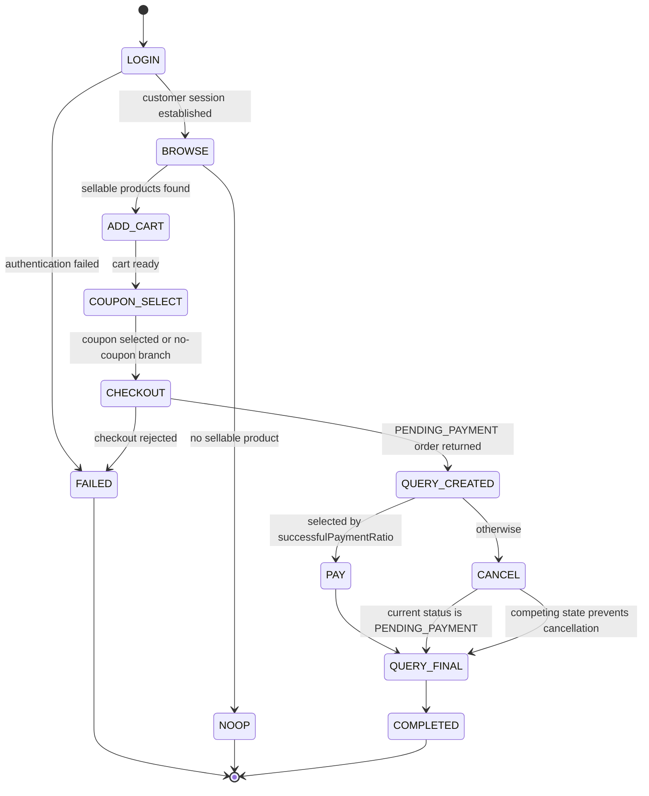

# 流量生命周期优化技术设计

## 文档信息

| 项目 | 内容 |
| --- | --- |
| 状态 | 实现完成，待统一验证 |
| 版本 | 1.0 |
| 更新时间 | 2026-08-25 CST |
| 范围 | `traffic-control-plane` 生命周期流量 runner |
| 配套规格 | [product.md](product.md) |

## 1. 设计目标与约束

本设计将现有按权重执行单一 `RunnerAction` 的 runner 调整为“完整客户生命周期”优先。生命周期使用真实客户 token 访问与 Shopfront 相同的 Gateway 客户 API，覆盖登录、浏览、加购、checkout、订单查询及支付成功或取消。

设计约束：

- 所有外部业务请求经 `GATEWAY_BASE_URL`，不得直连业务服务。
- 客户身份来自 `/api/auth/login` 的响应，而不是本地指定 `userId` 或 `X-Traffic-Runner-*` 请求头。
- 密码与 token 仅存在于 worker 进程内存中；不得写入 Redis、MySQL、活动 API、审计参数、Pino 日志或异常文本。
- 所有订单操作基于刚刚从服务端读取的订单状态和所属客户会话。
- 保留现有 `trafficRunId`、`actionId`、`traceId` 关联；新增 `lifecycleId` 关联同一次生命周期的父子步骤。

## 2. 组件变更

| 模块 | 职责变化 |
| --- | --- |
| `src/lib/env.ts` | 解析并校验登录流量模式、服务端演示账号与 Secret 来源。 |
| `src/lib/gateway-client.ts` | 提供登录、刷新、登出与 bearer-authenticated 请求；请求头按认证模式互斥。 |
| `src/worker/customer-session-manager.ts` | 选择账号、维护生命周期内客户会话、刷新 token 和失效处理。 |
| `src/worker/traffic-action-orchestrator.ts` | 执行完整生命周期及子步骤，不再为每个子动作随机选择客户。 |
| `src/worker/runner-engine.ts` | 以生命周期作为主调度单位，按固定串行间隔调度并记录父子步骤。 |
| `src/worker/coupon-replenishment.ts` | 启动时及每 6 小时触发一次演示券池补齐，复用 Redis 锁和 GatewayClient 调用模式。 |
| `src/worker/inventory-replenishment.ts` | 启动时及每 6 小时触发一次库存基线补齐，取代 runner 对库存 reset 的依赖。 |
| `src/lib/runtime-state.ts` | 仅保存不含秘密、按客户归属的订单引用及活动数据。 |
| `src/lib/runner-config.ts` | 校验生命周期模式、成功支付比例、优惠券使用比例和可选背景动作配置。 |
| `src/lib/runner-persistence.ts` | 持久化 `lifecycleId` 与步骤记录。 |
| `src/app/runner/page.tsx` | 展示生命周期配置、账号健康和父子步骤活动。 |
| `promotion-service` | 提供客户归属可用券查询、原子预留和幂等的演示券池补齐命令；worker 不直接生成优惠券。 |
| `inventory-service` | 提供幂等库存基线补齐命令；worker 不直接写库存，也不调用 reset。 |

## 3. 配置与安全边界

### 3.1 环境变量

建议新增以下仅服务端环境变量：

```dotenv
# JSON supplied by deployment Secret, never returned from an API.
# Example development shape only:
# [{"label":"alice","email":"alice@example.com","password":"password","expectedCustomerId":1},
#  {"label":"bob","email":"bob@example.com","password":"password","expectedCustomerId":2}]
TRAFFIC_LIFECYCLE_ACCOUNTS=[]
```

实现要求：

1. 账号数组至少包含一个合法账号；账号为空或无效时 worker fail-closed。
2. `label`、`email` 唯一；`expectedCustomerId` 存在时必须与登录响应 `userId` 相同。
3. `.env.example` 仅说明 JSON 形状或占位符；真实部署通过 Compose/Kubernetes Secret 注入。
4. 账号是否参与流量由控制台写入 `runner_customer_whitelist`，不由环境变量控制。
5. `TRAFFIC_RUNNER_CREDENTIAL` 不用于登录生命周期请求。若保留旧 runner 模式，必须通过显式 mode 区分，禁止在同一请求中混合 bearer token 和 runner credential。
6. 控制台和内部 API 只能暴露账号 `label`、启用状态、数量、最近登录结果、token 到期时间摘要；禁止返回 email、密码、任何 token。

### 3.2 持久化配置

在现有 `runner_profile` 中新增或等价表达：

| 字段 | 类型 | 规则 |
| --- | --- | --- |
| `traffic_mode` | enum | `CUSTOMER_LIFECYCLE` 为默认主模式；旧独立动作仅显式选择。 |
| `lifecycle_interval_sec` | enum | 仅允许 `60`、`30`、`20`、`10`；一次生命周期结束后等待此间隔再开始下一次。 |
| `successful_payment_ratio` | decimal | $0 \le r \le 1$。 |
| `coupon_usage_ratio` | decimal | $0 \le r \le 1$；其余生命周期明确不传 `couponId`。 |
| `background_actions_enabled` | boolean | 默认 `false`。 |

取消比例不单独持久化，计算为 $1-r$。配置更新继续要求 `version`，服务端校验所有边界，不能依赖前端归一化。

演示券池基线为 `promotion-service` 的服务端配置，而非 runner 可编辑参数。配置至少包含演示客户集合、可补充的 promotion 类型、每客户每类型的 `targetAvailableCount`、`replenishBelowCount` 和券有效期。补券任务只能作用于显式演示客户，默认不影响普通客户；客户集合必须覆盖所有已启用 lifecycle account 的 `expectedCustomerId`，目标容量必须覆盖一次六小时窗口内的预期用券量。

补券和库存补齐调度均属于 `traffic-control-plane` worker，固定 cron 为 `0 0 */6 * * *`（UTC 的 00:00、06:00、12:00、18:00）。worker 启动后在启用生命周期流量前分别执行一次补齐协调，避免首次运行等待最多 6 小时。周期不开放给控制台编辑，避免运行期间改变基线补齐节奏。

如 `traffic_actions` 无法表达父子关联，新增 nullable `lifecycle_id CHAR(36)`、索引 `(traffic_run_id, lifecycle_id, created_at)`；不持久化 token 或密码。父记录使用 `action_type=CUSTOMER_LIFECYCLE`，子步骤保留稳定动作类型。

## 4. 认证与请求客户端

### 4.1 类型

```ts
interface LifecycleAccount {
  label: string;
  email: string;
  password: string;
  expectedCustomerId?: number;
  enabled: boolean;
}

interface CustomerSession {
  accountLabel: string;
  customerId: number;
  accessToken: string;
  sessionToken: string;
  expiresAt: Date;
}

interface CustomerRequestContext {
  trafficRunId: string;
  lifecycleId: string;
  traceId: string;
  session: CustomerSession;
}
```

`CustomerSession` 仅在内存中存活至生命周期结束。日志、活动 DTO 与持久化 DTO 必须使用脱敏后的 `accountLabel` 和 `customerId`，不得直接序列化该结构。

### 4.2 GatewayClient 扩展

新增明确的客户方法：

```text
POST /api/auth/login       body: { email, password }
POST /api/auth/refresh     header: X-Session-Token
POST /api/auth/logout      header: X-Session-Token
```

客户业务请求附加：

```http
Authorization: Bearer <accessToken>
X-Trace-Id: <traceId>
```

登录、刷新、登出和业务请求均保留 trace。登录模式下不得附加：

```http
X-Traffic-Runner-Credential
X-Traffic-Runner-Customer-Id
X-Traffic-Run-Id
X-Traffic-Runner-Action
X-Traffic-Runner-Payment-Strategy
```

当 access token 距离 `expiresAt` 小于预留窗口，或客户业务请求首次得到 `401` 时，会话管理器执行一次 refresh 后重试原请求。刷新失败则结束本次生命周期；不得无限重试。结束后可 best-effort logout，并立即从内存清除 token。

## 5. 生命周期编排

### 5.1 状态与步骤



每个步骤返回 `SUCCESS`、`FAILED` 或 `NOOP`，并作为独立动作记录。父生命周期成功的最低条件是：登录、至少一次浏览、至少一次加购、checkout、创建后查询及最终查询均成功；支付或取消分支按服务端最终状态判定。

### 5.2 算法

```text
executeLifecycle(runId, config):
  lifecycleId = uuid()
  traceId = uuid without hyphens
  account = randomly choose enabled account
  session = login(account)
  ensure login response userId matches expectedCustomerId

  candidates = browse/search paginated catalog with bounded retries
  eligible = candidates where status is sellable and availableQty > 0
  if eligible is empty: record NOOP and finish

  existingCart = GET /api/cart
  eligible = eligible excluding existingCart item SKUs
  selected = sampleWithoutReplacement(eligible, random integer [1, min(maxItems, eligible.length)])
  for product in selected:
    add cart item(product.sku, random integer [1, maxItemQuantity])

  cart = GET /api/cart
  address = GET /api/me/addresses and choose default then first
  if address is missing:
    address = POST /api/me/addresses(deterministic demo address, isDefault=true)
  useCoupon = random() < couponUsageRatio
  coupons = GET /api/me/coupons when useCoupon
  coupon = chooseEligibleCoupon(coupons, cart)
  if useCoupon and coupon is unavailable:
    record NOOP/COUPON_UNAVAILABLE and continue without coupon
  order = POST /api/checkout(cart.id, cart.version, address.id, coupon?.id, unique idempotencyKey)
  require order.status == PENDING_PAYMENT

  GET /api/orders/{order.id}
  if random() < successfulPaymentRatio:
    intent = POST /api/orders/{order.id}/payment-intents(unique idempotencyKey)
    require POST /api/payments/{intent.id}/confirm {} returns SUCCESS
  else:
    current = GET /api/orders/{order.id}
    if current.status == PENDING_PAYMENT:
      POST /api/orders/{order.id}/cancel {}
    else:
      record NOOP with observed current status

  GET /api/orders/{order.id}
  logout and clear session
```

目录响应必须是商品候选的唯一来源。不得继续依赖固定 `SKU-001..SKU-050`，因为它会选中下架商品，且类别集合可能与实际种子数据不一致。常规生命周期假设基线库存充足；目录中的零库存、下架、价格变化、支付失败/未知与下游异常只由明确的故障注入场景验证。目录读取应在有界次数内组合分类、关键字、页码和商品详情；无候选商品属于 `NOOP`，不是重试风暴。

购物车为演示账号的持久化状态：runner 不清空既有明细，而是排除既有 SKU 后继续随机加购。若已有明细已达到 `maxItems` 或无新增 SKU 候选，runner 仍可使用当前购物车 checkout，并记录 `CART_REUSED`。地址缺失时，仅为当前登录客户经 Gateway `POST /api/me/addresses` 创建固定格式的演示地址；已有地址不修改、不删除、不覆盖默认标记。

常规支付成功由训练环境的普通 CUSTOMER 支付固定成功契约保证。真实支付失败、未知、库存不足、优惠券争用、商品下架及下游超时必须由故障注入场景明确开启、标记 `faultScenarioId` 并单独统计；常规生命周期不将它们作为随机结局。故障注入导致的已创建订单可停留在 `PENDING_PAYMENT`，依赖既有订单预占到期、库存/优惠券释放和补偿流程，runner 不强制取消或重试。

### 5.3 优惠券查询、选择与补充

新增经 Gateway 路由的客户 API：

```http
GET /api/me/coupons?status=AVAILABLE
Authorization: Bearer <accessToken>
```

Gateway 必须新增精确的 `/api/me/coupons/** -> promotion-service` 路由，并按普通 CUSTOMER 客户 API 处理：验证 bearer token、清洗伪造身份头、生成可信下游主体声明。`promotion-service` 必须仅从该可信主体取得客户 ID，返回该客户当前 `AVAILABLE`、未过期且关联促销仍启用的券。返回 DTO 至少包含 `id`、promotion 类型、名称、门槛、折扣/减免、过期时间；不得接受请求传入的 `userId`。列表只用于候选选择，不能替代 checkout 的最终资格校验。跨客户读取、无 token 访问和直接访问 promotion-service 均必须拒绝。

runner 在“使用券”分支中，从候选列表选择一张与当前购物车金额匹配的券；在“无券”分支中明确省略 `couponId`。`couponId == null` 的促销计算语义必须改为“不选择、不预留、不消耗任何券”，禁止现有的自动选择首张可用券行为。

checkout 对非空 `couponId` 必须在同一事务中验证：券归属当前客户、券尚未过期、关联促销有效、最低金额满足且券仍为 `AVAILABLE`。预留使用条件更新或悲观锁确保从 `AVAILABLE` 到 `RESERVED` 的状态转换恰好一次；抢占失败统一返回 `COUPON_INELIGIBLE` 或稳定的 `COUPON_ALREADY_RESERVED`。支付成功确认预留为 `USED`；checkout 失败、取消、风控拒绝或订单到期将同一预留改为 `RELEASED` 并把券恢复为 `AVAILABLE`。

为防止成功支付持续消耗种子券，worker 增加 `CouponReplenishmentScheduler`，复用现有 `InventoryResetScheduler` 的 cron、Redis 分布式锁和 GatewayClient 模式。它通过 Gateway 调用促销服务受内部服务认证保护的无参数补齐命令，例如：

```http
POST /internal/gateway/promotions/demo-coupons/replenish
X-Internal-Service-Key: <control-plane service credential>
```

Gateway 将调用分发到 `promotion-service`；worker 不读取或写入 `coupons`、`coupon_reservations` 表，也不传入客户 ID、promotion ID、数量或券内容。促销服务的 `DemoCouponPoolService` 是唯一能够决定和写入补券数据的组件。

Gateway 必须将 `/internal/gateway/promotions/demo-coupons/replenish` 路由为仅限 traffic-control-plane 服务主体的内部调度命令：拒绝 CUSTOMER bearer token、浏览器来源和任意请求参数，验证内部服务认证后才分发至 promotion-service 的内部端点。该端点不得被 Shopfront 或公开 Ingress 暴露。

每次触发按以下规则执行：

1. worker 启动后立即尝试一次，并在每个 UTC 六小时窗口执行一次；使用短期执行锁和独立的成功完成标记，而不是仅用窗口 `SET NX` 锁。
2. 计算每个 `(customerId, promotionId)` 的未过期 `AVAILABLE` 数量。
3. 数量低于 `replenishBelowCount` 时，补充到 `targetAvailableCount`，并设置有限 `expireAt`。
4. 促销服务以数据库唯一键或受控的发行批次/幂等键保证重复 Gateway 调用不会超额补券；Redis 锁仅减少重复调度，不作为最终一致性保证。
5. Gateway 或促销服务调用失败时，worker 在当前窗口内以有限退避重试；只有成功才写窗口完成标记。worker 与促销服务分别记录补券数、跳过数、失败数、重试次数和关联 ID；仅记录 customer ID、promotion ID 和数量，不记录登录秘密或 token。

该任务不回收 `RESERVED` 券。过期预留的释放仍必须由订单过期流程和促销服务的受控清理任务处理；券查询和 checkout 均须拒绝 `expireAt <= now()` 的券。

### 5.4 库存补齐

新增 worker 的 `InventoryReplenishmentScheduler`，使用与优惠券相同的启动协调、UTC 六小时周期、短期执行锁、成功完成标记和窗口内有限退避。它仅通过 Gateway 调用受内部服务认证保护的无参数库存补齐命令，例如：

```http
POST /internal/gateway/inventory/demo-stock/replenish
X-Internal-Service-Key: <control-plane service credential>
```

Gateway 将请求分发至 `inventory-service`；worker 不读取或写入库存表，不传 SKU、数量或目标版本，也不得调用任何 `/reset` 路径。`DemoInventoryBaselineService` 只针对显式配置的演示 SKU，计算可售库存与 `targetAvailableQty` 的差额并用条件更新补齐，绝不覆盖未过期预占或已确认库存扣减。服务端以补齐窗口/批次幂等键确保超时重送、多实例和重试不会重复加库存。补齐结果记录 SKU 数、补充数量、跳过数量、失败数、重试次数和关联 ID。

`/internal/gateway/inventory/demo-stock/replenish` 采用与补券命令相同的 Gateway 内部服务认证与入口隔离规则；不提供公开、客户或 Shopfront 可调用的补货/reset API。

### 5.5 串行调度

`RunnerEngine` 主模式中每次只执行一条生命周期。生命周期完成后，按 `lifecycle_interval_sec` 等待 `60`、`30`、`20` 或 `10` 秒，再启动下一条；不再计算或展示 QPS、峰值倍率、周期和抖动。状态 API 返回当前选择间隔、上次开始/结束时间、累计完成/中断数和实际平均间隔。若单次执行时长超过选择间隔，下一次在完成后立即按最小安全延迟启动，不允许重叠执行。

生命周期必须在 runner 停止前完成或以受控方式标记为中断；子步骤持久化不能以 fire-and-forget 形式在 run 已标记完成后丢失。

## 6. 订单引用与运行态

生命周期不使用跨生命周期 pending、paid 或 recent order 队列。订单引用只保留在当前生命周期的父子活动和服务端订单状态中：

```ts
interface LifecycleOrderRef {
  lifecycleId: string;
  customerId: number;
  orderId: string;
  orderNo: string;
  lastObservedStatus: string;
  paymentId?: string;
}
```

所有订单查询、支付和取消都使用创建订单的同一客户会话。中断时允许订单保持 `PENDING_PAYMENT`，交由既有订单到期、库存释放、优惠券释放和补偿路径处理。

runner 不依赖库存 reset；库存保持由六小时补齐任务维护。环境全量重置属于独立运维操作，不属于本流量方案的场景或触发器。

## 7. API、控制台与审计

现有 runner 配置 Route Handler 扩展为：

- `GET /internal/traffic/runner/config`：返回无秘密的串行执行间隔、支付/取消/用券比例和账号统计。
- `PUT /internal/traffic/runner/config`：要求 `version`，仅接受四种执行间隔并校验比例和边界；写入 operator audit。
- `GET /internal/traffic/runner/status`：返回执行间隔、运行 ID、当前生命周期、累计完成/中断数、上次完成时间和账号结果汇总，不返回 token。
- `GET /internal/traffic/runner/activity`：返回父/子关联、客户 ID、账号标签、订单/支付关联和稳定错误码。

Runner 页面应：

1. 移除 QPS、峰值倍率、周期和抖动控件，改为 `60s`、`30s`、`20s`、`10s` 串行执行间隔单选。
2. 将“支付成功/失败/未知”编辑控件改为“成功支付/取消待支付订单”，并增加“使用优惠券/无券”比例。
3. 显示生命周期模式、账号数、最近会话健康摘要与活动层级。
4. 对父生命周期展开子步骤，便于从登录定位到最终订单状态、地址创建、购物车复用和待支付保留原因。
5. 展示下一次固定补券/库存补齐时间、上次结果、补充数与当前窗口重试状态；不提供周期修改或任意补齐参数输入。
6. 不渲染账号邮箱、密码、token 或原始 authorization 请求头。

## 8. 测试与验证

### 8.1 单元与契约测试

新增或扩展 TypeScript 测试覆盖：

- 登录、refresh、logout 请求路径、body、trace header 与 bearer header。
- 登录模式不得发送 runner credential 或任何 `X-Traffic-Runner-*` header。
- token 临期 refresh、401 单次 refresh/retry、失败后终止和 token 脱敏。
- 随机账号选择、`expectedCustomerId` 不匹配拒绝。
- 使用同一会话执行加购、checkout、查单、支付/取消；禁止跨客户订单操作。
- 仅从目录响应中选择可售且可用库存为正的 SKU。
- 无重复 SKU，种类与数量均在边界内。
- 已有购物车明细在生命周期间保留；本次仅新增不同 SKU，购物车已满时正确记录复用分支。
- 无地址时仅为当前客户创建默认演示地址；已有客户地址不会被改写。
- `GET /api/me/coupons` 只返回当前客户可用、未过期且促销有效的券；请求不得携带或信任 `userId`。
- Gateway 将 `/api/me/coupons` 只路由给 promotion-service 的 CUSTOMER API；跨客户、无 token、伪造身份头和 promotion-service 直连均被拒绝。
- 补券和库存补齐命令仅接受 traffic-control-plane 的内部服务认证；CUSTOMER token、浏览器调用、Shopfront 和公开入口均被拒绝。
- 无券 checkout 不创建优惠券预留或改变券状态；有券 checkout 仅选择当前客户 API 返回的券。
- 并发 checkout 对同一券至多产生一个 `RESERVED` 预留；支付确认变为 `USED`，取消、失败和到期恰好一次释放为 `AVAILABLE`。
- 演示券池补充在低水位后恢复目标数量，多次运行和多实例并发不会超额生成。
- worker 启动补券/库存补齐和每 6 小时的 UTC 周期均通过 Gateway；失败会在窗口内重试，成功标记仅在完成后写入，重复执行仍保持幂等。
- 常规支付总是成功；支付失败、未知、库存耗尽、下架、价格变化和下游异常仅在关联 `faultScenarioId` 的故障注入测试中出现并单独统计。
- 中断后允许订单保持 `PENDING_PAYMENT`，并验证既有订单过期、库存/优惠券释放与补偿机制，而非 runner reset。
- 串行调度只接受四种间隔；慢生命周期不重叠，状态记录实际开始/结束和平均执行间隔。
- checkout 幂等键唯一，创建后与收尾后各查询一次订单。
- 成功支付分支不发送 runner 支付策略头。
- 取消分支在每次取消前重新读取状态，非 `PENDING_PAYMENT` 时返回 `NOOP`。
- `lifecycleId` 父子记录、配置乐观锁和比例校验。

### 8.2 执行命令

```bash
cd traffic-control-plane
pnpm test:runner
pnpm typecheck
pnpm lint
pnpm build
```

### 8.3 集成验证

在包含 MySQL、Redis、Gateway 与全部业务服务的干净 Compose 环境执行：

1. 使用 Secret 设置 `CASTREL_JWT_SECRET`、内部服务认证密钥以及生命周期账号配置。
2. 验证 Gateway 健康后，分别选择 `60s`、`30s`、`20s`、`10s` 执行间隔，确认生命周期严格串行且记录实际间隔。
3. 启动 worker 后验证其先执行一次补券和库存补齐；随后以可控时钟或测试 cron 验证六小时窗口内失败重试、一次成功完成标记及幂等 Gateway 分发。
4. 分别确认 `alice`、`bob` 的有券成功支付、无券成功支付、有券取消、已有购物车续加购和无地址自动创建分支。
5. 在受控 worker 中断后确认订单可保留 `PENDING_PAYMENT`，并由既有订单到期/补偿链路释放预占，不触发库存 reset。
6. 查询订单、支付、库存预占、优惠券预留、券池/库存补齐记录以及 `traffic_runs`、`traffic_actions`，确认状态和关联一致。
7. 检查 Redis 活动、MySQL 记录和控制台 API 响应不包含密码或 token。
8. 验证缺失、过期和错配 bearer token 被 Gateway 拒绝，且无法访问其他客户订单。

## 9. 迁移与兼容性

当前基线规定 runner 使用 `TRAFFIC_RUNNER` 服务凭据。本设计引入真实登录模式，实施时必须同步更新根目录产品与技术设计中该约束，明确两种模式的启用条件和请求头互斥规则。

建议先以 feature flag 部署：默认关闭登录生命周期模式，完成验证后将 `CUSTOMER_LIFECYCLE` 设为训练环境默认模式。旧独立动作仅在需要背景噪声时显式启用；支付失败、未知支付和物流查询不属于本次主生命周期范围。
