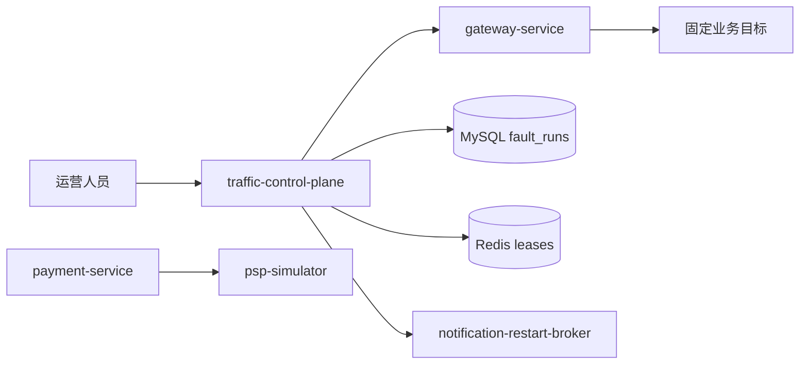

# Castrel Chaos 架构

## 运行边界

`traffic-control-plane` 是运营入口、Fault Run 协调器和受控 worker。它只能经 Gateway 调用业务 API 或固定内部路径；不能直连业务服务、业务表、Redis 场景 key 或 PSP。消费者只经过 `shopfront -> gateway-service`，无法访问 `/internal/**` 运营入口。

## Fault Run

场景 catalog 是控制台、Route Handler、协调器和 Gateway 映射的唯一事实来源。每次运行保存固定场景、目标服务、操作、参数快照、`faultRunId`、`expiresAt`、`fencingToken`、状态、停止原因、恢复结果和 trace 关联。

数据库唯一约束保证全环境同时最多一条 `CREATING`、`ACTIVE` 或 `RECOVERING` 运行。典型生命周期是 `CREATING -> ACTIVE -> RECOVERING -> RECOVERED`，人工停止进入 `STOPPED`，目标异常进入 `FAILED`。通知内存压力到期只停止后续保留；健康失败后进入 `SERVICE_UNAVAILABLE`，等待固定重启操作。

## 场景目标

| 场景组 | 固定目标 | 证据 |
|---|---|---|
| 慢报表 | catalog-service / order-service | 当日语义、180 天分区窗口、baseline/修复执行计划 |
| 流量突增 | Gateway 公开商品或订单路径 | worker 请求汇总、延迟、停止原因 |
| 购物车 | cart-service，Sam 19 独立购物车 | Redis key 大小、加购结果、运行项清理 |
| 目录依赖 | cart-service -> catalog-service | 依赖失败时无 Cart 写入 |
| 通知压力 | notification-service | 保留/存储事件、健康状态、重启结果 |
| 锁竞争 | promotion-service / inventory-service | 竞争事务、死锁受害、锁释放与请求恢复 |
| PSP 结果 | payment-service -> psp-simulator | 授权、明确拒付、超时/不可达映射 |

## 数据与时间

`product_price_history(effective_at)` 和 `user_behavior_log(created_at)` 使用东八区 `RANGE COLUMNS` 日分区，保持今天及前 179 天、每天 500,000 行的固定窗口。standalone worker 通过 Redis lease 逐表逐日补齐，容量保护触发时暂停。Java、Node.js、MySQL 会话和日切统一使用 `Asia/Shanghai` / `+08:00`。

## 重启边界

Compose 的 `notification-restart-broker` 是唯一挂载 Docker Socket 的容器，只接受固定 `notification-service` restart。控制面只调用 broker，不携带服务名、命令、镜像或 patch body。Kubernetes broker 使用专用 ServiceAccount，Role 仅允许在 `castrel` 命名空间对名为 `notification-service` 的 Deployment 执行 `get` 和 `patch`。两种模式都在 120 秒截止时间内轮询固定健康端点并返回结果。

## 留存与审计

Fault Run、事件和运行专属审计按外键顺序保留 7 天。活动、恢复中、服务不可用或清理未完成的记录不会被留存任务删除。存储追加只允许已终止运行按 `faultRunId` 清理，所有创建、停止、清理和重启操作都要求运营会话、CSRF、确认、幂等键和审计。
