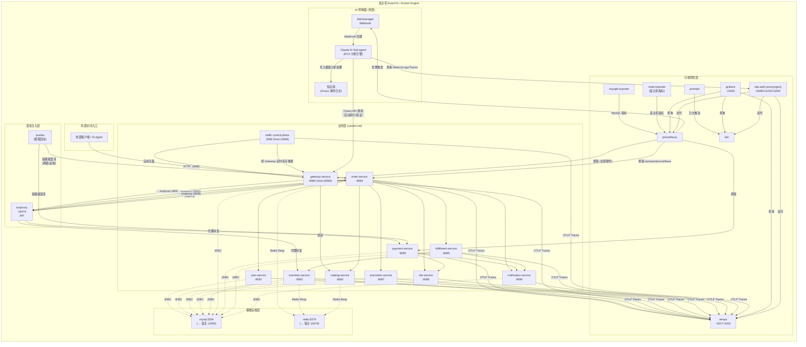

# Castrel-Chaos 系统架构文档

> 版本：v1.0 | 更新日期：2026-04-21 | 环境：Docker Compose / EulerOS Linux

---

## 目录

1. [系统概述](#1-系统概述)
2. [部署拓扑](#2-部署拓扑)
3. [组件职责](#3-组件职责)
4. [系统组件交互图](#4-系统组件交互图)
5. [Docker 容器通信机制](#5-docker-容器通信机制)
6. [数据持久化方案](#6-数据持久化方案)
7. [故障处理链路](#7-故障处理链路)
8. [数据流转](#8-数据流转)
9. [可观测性架构](#9-可观测性架构)
10. [AI 诊断模块与控制面交互](#10-ai-诊断模块与控制面交互)
11. [关键设计决策](#11-关键设计决策)

---

## 1. 系统概述

Castrel-Chaos 是一个面向 SRE 培训的**混沌工程演练平台**，采用电商微服务作为目标系统，集成了以下双核能力：

- **故障注入引擎**：通过 ToxiProxy（网络层）、JVM 内置 Chaos 接口（应用层）、Pumba（容器层）三层注入机制，模拟慢 SQL、内存泄漏、数据库死锁、网络延迟/丢包等真实故障场景。
- **智能诊断模块**：以 Claude AI Sub-agent 作为智能排查引擎，在 Prometheus 告警触发后自动执行根因分析（RCA），并将结果写入知识库，形成闭环的故障处治经验积累。

**技术基线**

| 维度 | 技术选型 |
|---|---|
| 运行时环境 | EulerOS / Linux，Docker Compose |
| 业务框架 | Java 21 + Spring Boot 3.5.x |
| 构建工具 | Maven 多模块（12 个模块） |
| 数据存储 | MySQL 8.0（主存储）、Redis 7.2（分布式锁/缓存） |
| 可观测性 | Prometheus + Grafana + Loki + Tempo + Promtail |
| 链路追踪 | OpenTelemetry Java Agent（自动注入） |
| 故障注入 | ToxiProxy + Pumba（Compose）/ Chaos Mesh（K8s） |
| OTel 协议 | OTLP HTTP/protobuf → Tempo |

---

## 2. 部署拓扑

所有服务运行在同一个 Docker bridge 网络 `castrel-net` 上，按职责分为四个层次：

```
┌──────────────────────────────────────────────────────────────────────┐
│                       宿主机 (EulerOS / Linux)                        │
│                                                                      │
│  ┌───────────────────────────────────────────────────────────────┐   │
│  │               Docker Bridge Network: castrel-net              │   │
│  │                                                               │   │
│  │  ┌─────────────────────────────────────────────────────────┐  │   │
│  │  │  [入口层]                                                │  │   │
│  │  │  gateway-service :8080 ← 对外暴露 :18080                │  │   │
│  │  └──────────────────────────┬──────────────────────────────┘  │   │
│  │                             │ HTTP (内部服务名寻址)             │   │
│  │  ┌──────────────────────────▼──────────────────────────────┐  │   │
│  │  │  [业务层] 业务微服务使用容器端口 :8081 ~ :8091          │  │   │
│  │  │  user  catalog  inventory  order  payment               │  │   │
│  │  │  promotion  risk  fulfillment  notification             │  │   │
│  │  │  traffic-control-plane                                  │  │   │
│  │  └─────────────┬────────────────────┬────────────────────┐ │  │   │
│  │                │ JDBC/TCP           │ Redis Resp         │ │  │   │
│  │  ┌─────────────▼──────┐  ┌──────────▼──────┐            │ │  │   │
│  │  │  [基础设施层]       │  │                 │            │ │  │   │
│  │  │  mysql :3306        │  │  redis :6379    │            │ │  │   │
│  │  │  (→ 宿主 :13306)   │  │  (→ 宿主 :16379)│            │ │  │   │
│  │  └────────────────────┘  └─────────────────┘            │ │  │   │
│  │                                                          │ │  │   │
│  │  ┌───────────────────────────────────────────────────────▼─┘  │   │
│  │  │  [网络混沌层]   toxiproxy :8474/:18083/:18084/:18085       │   │
│  │  │  [容器混沌层]   pumba (按需 --profile chaos-pumba 启动)    │   │
│  │  └──────────────────────────────────────────────────────────┘  │   │
│  │                                                               │   │
│  │  ┌───────────────────────────────────────────────────────────┐  │   │
│  │  │  [可观测性层]                                              │  │   │
│  │  │  prometheus (内部)  loki (内部)  tempo :4317/:4318        │  │   │
│  │  │  obs-auth-proxy (nginx) → 对外 :19090/:13100/:13200       │  │   │
│  │  │  grafana → 对外 :13000                                   │  │   │
│  │  │  promtail  node-exporter :9100  mysqld-exporter :9104     │  │   │
│  │  └──────────────────────────────────────────────────────────┘  │   │
│  └───────────────────────────────────────────────────────────────┘   │
└──────────────────────────────────────────────────────────────────────┘
```

**对外端口映射汇总**

| 宿主端口 | 容器内端口 | 服务 | 用途 |
|---|---|---|---|
| 18080 | 8080 | gateway-service | 业务请求入口 |
| — | 8081–8091 | 各业务微服务 | 仅容器网络，通过 gateway-service 访问 |
| 13086 | 3086 | traffic-control-plane | 运营控制台与 Runner |
| 13090 | 3090 | shopfront | 消费者 UI 与 BFF |
| 13306 | 3306 | mysql | 数据库调试 |
| 16379 | 6379 | redis | Redis 调试 |
| 13000 | 3000 | grafana | 可观测仪表盘 |
| 19090 | 19090 | obs-auth-proxy | Prometheus（Basic Auth） |
| 13100 | 13100 | obs-auth-proxy | Loki（Basic Auth） |
| 13200 | 13200 | obs-auth-proxy | Tempo（Basic Auth） |
| 14317/14318 | 4317/4318 | tempo | OTLP 采集（无鉴权） |
| 18474 | 8474 | toxiproxy | ToxiProxy 管理 API |
| 19100 | 9100 | node-exporter | 宿主机指标 |
| 19104 | 9104 | mysqld-exporter | MySQL 指标 |

---

## 3. 组件职责

### 3.1 业务微服务层

| 容器名 | 监听端口 | 核心职责 | Chaos 能力 |
|---|---|---|---|
| `castrel-gateway` | 8080 | 统一入口、路由、traceId 注入、Toxiproxy 路由切换 | — |
| `castrel-user` | 8081 | 用户资料与收货地址查询 | — |
| `castrel-catalog` | 8082 | 商品 SKU 与价格查询 | 慢 SQL |
| `castrel-inventory` | 8083 | 库存预占/释放/重置 | 慢 SQL |
| `castrel-order` | 8084 | 订单编排状态机、幂等控制 | 慢 SQL、内存泄漏、死锁 |
| `castrel-payment` | 8085 | 支付扣款模拟 | 慢 SQL、内存泄漏、死锁 |
| `castrel-control-plane` | 3086 | 流量编排、Chaos 控制和动态 QPS 调速 | — |
| `castrel-promotion` | 8087 | 优惠券与促销规则计算 | 慢 SQL |
| `castrel-risk` | 8088 | 前置风控与支付后复核 | 慢 SQL |
| `castrel-fulfillment` | 8089 | 履约单创建与物流跟踪 | 慢 SQL |
| `castrel-notification` | 8090 | 订单/支付/发货通知分发 | — |

### 3.2 基础设施层

| 容器名 | 职责 |
|---|---|
| `castrel-mysql` | 主数据存储，承载 11 个业务数据库 schema |
| `castrel-redis` | 分布式锁（库存预占互斥）、热点数据缓存 |

### 3.3 混沌故障层

| 容器名 | 职责 |
|---|---|
| `castrel-toxiproxy` | 在 order→inventory、gateway→order、order→payment 三条链路上注入网络延迟/丢包/断流 |
| `castrel-pumba` | 按需启动（profile: chaos-pumba），对容器执行延迟、杀进程等 OS 级混沌 |

### 3.4 可观测性层

| 容器名 | 职责 |
|---|---|
| `castrel-prometheus` | 指标采集与存储（15s 间隔，保留 7 天） |
| `castrel-loki` | 日志聚合，从 Promtail 接收结构化 Docker 日志 |
| `castrel-tempo` | 分布式 Trace 存储，接收 OTLP 上报 |
| `castrel-grafana` | 统一可视化，预置服务总览与 Chaos 事件 Dashboard |
| `castrel-promtail` | 采集 Docker 容器日志并推送至 Loki |
| `castrel-obs-auth-proxy` | Nginx Basic Auth 代理，保护 Prometheus/Loki/Tempo 的外部查询端口 |
| `castrel-node-exporter` | 宿主机系统指标（CPU/内存/磁盘/网络）采集 |
| `castrel-mysqld-exporter` | MySQL 实例细粒度指标采集（InnoDB、慢查询、连接数等） |

---

## 4. 系统组件交互图



---

## 5. Docker 容器通信机制

### 5.1 网络模型

所有容器均连接至单一 bridge 网络 `castrel-net`（`driver: bridge`）。每个容器在网络内以**容器名**作为 DNS 主机名相互寻址，无需硬编码 IP。

```
castrel-gateway  →  http://order-service:8084     # 容器名 DNS 解析
castrel-order    →  jdbc:mysql://mysql:3306/castrel
castrel-order    →  http://toxiproxy:18083         # 经混沌代理
```

### 5.2 ToxiProxy 网络代理机制

ToxiProxy 是网络故障注入的核心中间层，其代理拓扑如下：

```
order-service → toxiproxy:18083 → inventory-service:8083  (order-to-inventory)
gateway-service → toxiproxy:18084 → order-service:8084    (gateway-to-order)
order-service → toxiproxy:18085 → payment-service:8085    (order-to-payment)
```

通过 ToxiProxy HTTP API（`:18474`）可动态为上述代理注入 `latency`、`bandwidth`、`slow_close`、`timeout`、`reset_peer` 等 Toxic，实现精确的网络故障模拟，且**无需重启任何服务**。

原始直连地址（绕过代理）同时保留，供故障恢复验证使用：
```
CHAOS_ORDER_URL:       http://order-service:8084   # gateway 内部直连地址
ORDER_SERVICE_URL:     http://toxiproxy:18084       # 经混沌代理的生产路由
```

### 5.3 服务依赖与启动顺序

```
mysql (healthcheck) ──┐
                      ├──► 所有业务微服务
redis (healthcheck) ──┘

toxiproxy ──────────► gateway-service

prometheus ─┐
loki ───────┤
tempo ──────┤──► obs-auth-proxy ──► grafana
loki ───────┘──► promtail
```

MySQL 和 Redis 均配置了 `healthcheck`，业务服务通过 `condition: service_healthy` 等待中间件就绪后才启动，避免启动时连接失败。

---

## 6. 数据持久化方案

### 6.1 Volume 挂载总览

| 挂载路径（宿主机） | 容器内路径 | 服务 | 说明 |
|---|---|---|---|
| `./data/mysql` | `/var/lib/mysql` | mysql | MySQL 数据文件，持久化业务数据 |
| `./data/redis` | `/data` | redis | Redis RDB/AOF 持久化文件 |
| `./data/prometheus` | `/prometheus` | prometheus | 指标 TSDB（保留 7 天） |
| `./data/loki` | `/loki` | loki | 日志块文件与索引 |
| `./data/tempo` | `/tmp/tempo` | tempo | Trace 数据文件 |
| `./data/grafana` | `/var/lib/grafana` | grafana | 仪表盘状态、用户数据 |
| `/var/lib/docker/containers` | 同路径（只读） | promtail | Docker container 日志源 |
| `/proc`, `/sys`, `/` | 对应宿主路径（只读） | node-exporter | 宿主机内核信息 |
| `/var/run/docker.sock` | 同路径 | promtail/pumba | Docker 管理接口 |

### 6.2 配置文件挂载（只读）

所有服务的配置均以只读只挂载方式注入，确保容器内无法修改：

```
./infra/prometheus/prometheus.yml  →  /etc/prometheus/prometheus.yml   :ro
./infra/loki/loki-config.yml       →  /etc/loki/local-config.yaml      :ro
./infra/tempo/tempo-config.yml     →  /etc/tempo/config.yml            :ro
./infra/grafana/provisioning       →  /etc/grafana/provisioning        :ro
./infra/nginx/nginx.conf           →  /etc/nginx/nginx.conf            :ro
./infra/toxiproxy/toxiproxy.json   →  /config/toxiproxy.json           :ro
./infra/mysql/my.cnf               →  /etc/mysql/conf.d/castrel.cnf    :ro
./infra/mysql/init                 →  /docker-entrypoint-initdb.d      :ro
```

### 6.3 日志采集链路

Promtail 通过挂载 `/var/run/docker.sock` 和 `/var/lib/docker/containers` 发现并采集所有 Docker 容器的 stdout/stderr 日志，推送至 Loki。Grafana 中配置了以 `traceId` 为关联键的 derived field，实现日志与 Trace 的跳转联动。

### 6.4 关键数据库表设计

```
chaos_policy         — Chaos 注入策略（service, scenario, scope, inject_rate, duration_sec, auto_disable_at）
chaos_event_log      — Chaos 事件记录（service, scenario, trace_id, started_at, ended_at, result, error）
runner_profile       — 生命周期流量配置（traffic_mode, lifecycle_interval_sec, successful_payment_ratio, version）
inventory_baseline   — 库存基线快照（sku, baseline_qty, baseline_version）
```

---

## 7. 故障处理链路

### 7.1 故障注入链路总览

```
┌────────────────────────────────────────────────────────────────────────┐
│                         故障注入控制面                                  │
│                                                                        │
│  ① 网络故障    POST /api  → ToxiProxy API(:18474)                      │
│               添加 Toxic → [latency|bandwidth|reset_peer]              │
│               影响链路  ← gateway→order / order→inventory / order→payment│
│                                                                        │
│  ② 慢 SQL     POST /internal/chaos/slow-sql/enable                    │
│               → 注入服务内部（catalog/inventory/order/payment/...）     │
│               → SlowSqlChaosService 拦截 JDBC 调用插入 sleep/real        │
│                                                                        │
│  ③ 内存泄漏   POST /internal/chaos/memory-leak/start                  │
│               → order-service / payment-service                       │
│               → MemoryLeakChaosService 持续持有对象引用                │
│               → JVM 堆增长 → GC Overhead Alert → 延迟上升              │
│                                                                        │
│  ④ 数据库死锁  POST /internal/chaos/deadlock/enable                   │
│               → order/payment 并发互锁事务（scope/injectRate/durationSec）│
│               → MySQL 自动检测死锁 → 应用重试补偿                     │
│                                                                        │
│  ⑤ 容器级混沌  docker compose --profile chaos-pumba up -d pumba       │
│               → pumba 对目标容器注入 tc netem 或 SIGKILL               │
└────────────────────────────────────────────────────────────────────────┘
```

### 7.2 完整下单链路（含故障点标注）

```
traffic-runner
     │
     ▼
gateway-service
     │
     ▼ 经 toxiproxy:18084 ──── [故障点①: 网络延迟/丢包]
order-service
     ├──► user-service         (用户校验)
     ├──► catalog-service      (商品校验) ─── [故障点②: 慢SQL]
     ├──► promotion-service    (优惠计算) ─── [故障点②: 慢SQL]
     ├──► risk-service         (前置风控) ─── [故障点②: 慢SQL] ─► 拒绝则关单
     ├──► inventory-service    (库存预占) ─── [故障点②: 慢SQL]
     │     经 toxiproxy:18083  ─────────── [故障点①: 网络故障]
     ├──► payment-service      (扣款)     ─── [故障点②/③/④]
     │     经 toxiproxy:18085  ─────────── [故障点①: 网络故障]
     │     ├── 失败 → inventory-service/release (库存回滚)
     │     └── 成功 → risk-service/post-pay-check
     ├──► fulfillment-service  (创建履约) ─── [故障点②: 慢SQL]
     │     └── 失败 → 人工处理告警
     └──► notification-service (发送通知)

order-service 自身 ─── [故障点③: JVM内存泄漏]
                   ─── [故障点④: 死锁注入]
```

### 7.3 自动恢复机制

| 故障类型 | 恢复机制 | 验证指标 |
|---|---|---|
| 网络延迟 | ToxiProxy 移除 Toxic / 超时重试 | P99 延迟恢复至基线 |
| 慢 SQL | 调用 `/disable` 接口 | MySQL 慢查询计数归零 |
| 内存泄漏 | 调用 `/clear` 释放引用，触发 GC | JVM heap_used 下降至正常 |
| 死锁 | 调用 `/clear` 回滚阻塞事务 + 应用指数退避重试 | deadlock error 率归零 |
| 库存耗尽 | traffic-runner 定时调用 `inventory/reset` | 可下单 SKU 恢复基线库存 |

---

## 8. 数据流转

### 8.1 业务数据流

```
外部请求
  │
  ▼
gateway-service
  │ 路由规则匹配（含 ToxiProxy 代理切换）
  ▼
order-service（编排中心）
  │ ① 读取用户信息          →  user-service  →  MySQL
  │ ② 查询商品/价格          →  catalog-service  →  MySQL + Redis(缓存)
  │ ③ 计算优惠               →  promotion-service  →  MySQL
  │ ④ 前置风控               →  risk-service  →  MySQL
  │ ⑤ 预占库存               →  inventory-service  →  MySQL + Redis(分布式锁)
  │ ⑥ 扣款                   →  payment-service  →  MySQL
  │ ⑦ 支付后风控             →  risk-service
  │ ⑧ 创建履约单             →  fulfillment-service  →  MySQL
  └─ ⑨ 发送通知              →  notification-service  →  MySQL
```

### 8.2 可观测性数据流

```
业务服务 (OTel Java Agent 自动注入)
  │
  ├──► OTLP HTTP → tempo:4318  →  Trace 存储
  │
  └──► /actuator/prometheus ←── prometheus 抓取(15s)  →  TSDB 存储

Docker 容器 stdout/stderr
  │
  └──► promtail (挂载 /var/lib/docker/containers) → loki → 日志块存储

node-exporter (挂载 /proc /sys) → prometheus ←── 宿主机指标
mysqld-exporter → prometheus ←── MySQL 实例指标

prometheus → Alertmanager → Webhook
grafana ──► prometheus (PromQL)
       ──► loki       (LogQL)
       ──► tempo      (TraceQL)
外部 AI Agent ──► obs-auth-proxy (Basic Auth) ──► prometheus/loki/tempo
```

### 8.3 Chaos 事件数据流

```
Chaos 注入操作（手动 API / AI Agent 自动）
  │
  ├──► chaos_policy 表（注入策略持久化）
  │
  ├──► 应用内 ChaosService（内存状态）
  │       │
  │       └──► chaos_event_log 表（事件记录 + traceId 关联）
  │
  └──► Prometheus 指标（error_rate / latency / jvm_heap）
          │
          └──► Alertmanager 触发告警
                  │
                  └──► AI Sub-agent RCA 分析  →  知识库
```

---

## 9. 可观测性架构

### 9.1 三支柱全覆盖

```
Metrics（指标）
  采集：prometheus 每 15s 拉取全部 11 个服务 /actuator/prometheus + mysqld + node-exporter
  存储：prometheus TSDB，保留 7 天
  告警：Alertmanager（可配置阈值规则）

Logs（日志）
  采集：promtail 监听 Docker sock，自动发现容器日志流
  格式：结构化 JSON（Spring Boot + OTel 自动注入 traceId/spanId）
  存储：loki，支持 LogQL 按 label 过滤

Traces（链路追踪）
  采集：OTel Java Agent 自动注入（无需修改业务代码），OTLP HTTP/protobuf
  存储：tempo，支持 TraceQL 和 service-map 可视化
  关联：grafana 中 traceId 作为 Loki derived field，实现 Log ↔ Trace 双向跳转
```

### 9.2 关键 SLI 指标

```promql
# 服务可用性（5xx 错误率）
sum(rate(http_server_requests_seconds_count{status=~"5.."}[5m]))
/ sum(rate(http_server_requests_seconds_count[5m]))

# P99 延迟
histogram_quantile(0.99,
  sum by(le, service) (rate(http_server_requests_seconds_bucket[5m]))
)

# JVM 堆使用率（内存泄漏监控）
jvm_memory_used_bytes{area="heap"} / jvm_memory_max_bytes{area="heap"}

# MySQL 慢查询增速
rate(mysql_global_status_slow_queries[5m])

# 死锁事件增速
rate(mysql_global_status_innodb_row_lock_waits[5m])
```

### 9.3 认证代理设计

Prometheus、Loki、Tempo 的查询端口不直接对外暴露，全部经过 `obs-auth-proxy`（nginx）进行 Basic Auth 认证，防止未授权访问。OTLP 采集端口（:14317/:14318）无需认证，仅供服务内部上报使用。

---

## 10. AI 诊断模块与控制面交互

### 10.1 整体架构

Castrel-Chaos 的 AI 诊断能力通过外挂 **Claude AI Sub-agent** 实现，与系统控制面的交互分为两个层面：

```
┌─────────────────────────────────────────────────────────────────────┐
│                      AI 诊断控制面                                   │
│                                                                     │
│  ┌───────────────────┐    触发     ┌──────────────────────────────┐ │
│  │  Alertmanager     │──Webhook──►│  Claude AI Sub-agent         │ │
│  │  （告警规则引擎）  │            │  （RCA 分析引擎）             │ │
│  └───────────────────┘            └──────────┬───────────────────┘ │
│          ▲                                   │                     │
│          │ 指标告警                           │ 多工具并发查询       │
│  ┌───────┴───────────────────────────────────▼───────────────────┐ │
│  │  obs-auth-proxy (nginx, Basic Auth)                           │ │
│  │  ├── :19090 → prometheus  (PromQL 指标查询)                    │ │
│  │  ├── :13100 → loki        (LogQL 日志查询)                     │ │
│  │  └── :13200 → tempo       (TraceQL 链路查询)                   │ │
│  └───────────────────────────────────┬───────────────────────────┘ │
│                                      │ 根因分析结果                 │
│                            ┌─────────▼───────────┐                │
│                            │  知识库              │                │
│                            │  chaos_event_log    │                │
│                            │  RCA 报告存储        │                │
│                            └─────────────────────┘                │
└─────────────────────────────────────────────────────────────────────┘
```

### 10.2 自动 RCA 工作流

当 Prometheus 触发告警后，AI Sub-agent 按以下步骤执行根因分析：

```
Step 1: 接收告警上下文
  ← Alertmanager Webhook: {alertname, service, severity, startsAt, labels}

Step 2: 并发采集诊断信号
  ├── PromQL: 查询告警服务的 error_rate / latency / jvm / MySQL 指标（±15min 时间窗）
  ├── LogQL:  查询 service=<告警服务> 的 ERROR/WARN 日志，提取 exception stacktrace
  └── TraceQL: 查询告警时间段内的异常 Trace（duration > P99 或含 error span）

Step 3: 关联分析
  ├── 匹配 chaos_event_log 中是否存在时间重叠的注入记录
  ├── 判断故障是"注入型"（已知场景）还是"自发型"（未知问题）
  └── 分析 Trace 调用链，定位根因服务与根因接口

Step 4: 生成 RCA 报告
  └── 写入 chaos_event_log（trace_id, root_cause, evidence, recommendation）

Step 5: 可选操作（自动执行模式）
  ├── 调用 Chaos disable 接口停止注入
  └── 调用 traffic-runner/pause 降低流量压力
```

### 10.3 AI Agent 接口清单

AI Sub-agent 通过以下接口与系统控制面交互：

| 接口 | 用途 | 认证方式 |
|---|---|---|
| `GET http://obs-auth-proxy:19090/api/v1/query_range` | Prometheus 时序查询 | Basic Auth |
| `POST http://obs-auth-proxy:13100/loki/api/v1/query_range` | Loki 日志查询 | Basic Auth |
| `GET http://obs-auth-proxy:13200/api/traces/{traceId}` | Tempo Trace 查询 | Basic Auth |
| `POST http://gateway-service:8080/internal/chaos/*/disable` | 停止 Chaos 注入 | 内部鉴权 |
| `POST http://traffic-control-plane:3086/internal/traffic/runner/pause` | 暂停流量生成器 | 运营鉴权 |
| `GET http://gateway-service:8080/internal/chaos/*/status` | 查询当前注入状态 | 内部鉴权 |

### 10.4 知识库结构

```sql
-- chaos_event_log（Chaos 事件与 RCA 记录）
CREATE TABLE chaos_event_log (
    id          BIGINT AUTO_INCREMENT PRIMARY KEY,
    service     VARCHAR(64),        -- 受影响服务
    scenario    VARCHAR(64),        -- 故障场景类型
    trace_id    VARCHAR(64),        -- 关联 OTel Trace ID
    started_at  DATETIME,
    ended_at    DATETIME,
    result      VARCHAR(16),        -- SUCCESS / FAILED / PARTIAL
    error       TEXT,               -- 原始错误信息
    root_cause  TEXT,               -- AI 分析的根因描述
    evidence    JSON,               -- 支撑证据（指标截图URL、关键日志片段）
    recommendation TEXT,            -- 修复建议
    created_at  DATETIME DEFAULT CURRENT_TIMESTAMP
);
```

---

## 11. 关键设计决策

### 11.1 ToxiProxy 代理而非直连

关键链路（order→inventory、order→payment）通过 ToxiProxy 代理，而非直连。这允许在**不重启任何服务的前提下**动态注入或移除网络故障，是网络层混沌实验的核心机制。同时保留了直连地址（`CHAOS_*_URL`），供实验对照组使用。

### 11.2 Chaos 接口仅在 chaos profile 激活

所有 `/internal/chaos/*` 接口通过 `@ConditionalOnProperty` 或 `@Profile("chaos")` 控制，仅在 `SPRING_PROFILES_ACTIVE=docker,chaos` 时暴露，确保正常部署环境下无注入能力泄露风险。

### 11.3 乐观锁保障配置一致性

Runner 配置更新和库存重置均使用版本号（`version` / `expectedVersion`）实现乐观锁，防止并发写冲突导致配置回绕。结合分布式锁（Redis）确保库存重置与高并发下单不产生竞争条件。

### 11.4 obs-auth-proxy 隔离可观测性访问

Prometheus、Loki、Tempo 的查询端口全部收归 nginx 统一代理，通过 Basic Auth 保护，避免在演练环境中可观测性数据被未授权访问或利用查询接口发起 DoS。

### 11.5 OTel 无侵入式注入

所有业务服务通过 `JAVA_TOOL_OPTIONS=-javaagent:/app/otelAgent.jar` 自动注入 OTel Java Agent，业务代码零修改即可获得完整的 Trace / Span 数据，确保混沌演练中的链路追踪不受注入干扰。
