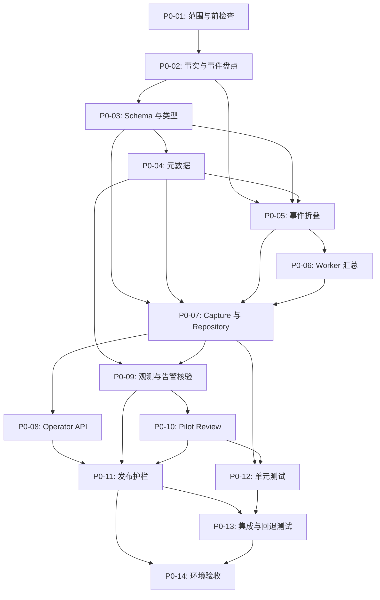

# 批次 0：运行基线与发布护栏实施任务清单

## 文档信息

| 项目 | 内容 |
| --- | --- |
| 状态 | 任务清单已建立；实施尚未开始 |
| 版本 | 1.0 |
| 更新时间 | 2026-09-16 CST |
| 路线阶段 | [阶段 0：基线和发布护栏](../../roadmap/phases/phase-0-baseline.md) |
| 产品规格 | [product.md](./product.md) |
| 技术设计 | [tech.md](./tech.md) |
| 场景事实来源 | `traffic-control-plane/src/lib/fault-run-catalog.ts` |

## 任务规则

1. 开始任务时将 `- [ ]` 改为 `- [-]`；完成本任务定义的验证并记录执行情况后，才改为 `- [x]`。被阻塞的任务使用 `- [!]`，并关联“问题跟踪”中的 ID。
2. 每完成、阻塞、恢复或取消一个子任务，立即同步更新：对应复选框、任务组状态和进度、总体进度、更新时间，以及“执行更新记录”中的一行事实记录。
3. 每发现或解决一个问题，立即在“问题跟踪”中保留问题、影响、方案和状态。问题解决后不得删除历史；方案影响产品范围、数据边界、权限、状态语义或发布方式时，先更新 [product.md](./product.md) 和 [tech.md](./tech.md)。
4. 场景、目标 operation、参数、时长和 `recoveryStrategy` 只从 Catalog 读取。本清单不复制场景定义，也不以固定数量作为覆盖完成依据；运行覆盖以采集时的 `catalogRevision` 和 Catalog 派生矩阵为准。
5. 缺失事实必须记录为 `NULL`、`UNKNOWN`、`INCOMPLETE` 或明确 limitation，禁止以 `0`、空数组或成功状态补齐。旁路采集不得改变 Fault Run、Worker、Gateway 或目标服务的业务效果。
6. 所有写入接口沿用 Operator session、CSRF、审计和现有错误 envelope；观测核验只保存摘要、查询引用和判断结果，不保存原始指标、日志、Trace、告警 envelope、凭据或可执行命令。
7. 默认保持 `BASELINE_CAPTURE_ENABLED=false`。未完成迁移、自动化验证和可回退验证前，不得在共享环境启用采集路径。
8. 任务组进度按组内子任务统计；总体进度同时展示任务组数和子任务数。文档建立、状态更新和问题登记不计入实施任务组。

## 总体进度

- **总体状态：** Phase 0 任务已拆分；尚无实施任务开始。
- **总体进度：** 0 / 14 个任务组（0 / 73 个子任务）。
- **当前任务：** P0-01：范围锁定与执行前检查（未开始）。
- **当前问题：** P0-ISSUE-001 至 P0-ISSUE-004 均待核验。
- **下一步：** 执行 P0-01，建立本次基线的 Catalog 派生覆盖矩阵和环境前置事实。

| 任务组 | 目标 | 状态 | 进度 | 前置依赖 |
| --- | --- | --- | --- | --- |
| P0-01 | 范围锁定与执行前检查 | 未开始 | 0 / 4 | 无 |
| P0-02 | 事实来源、事件和失败分类盘点 | 未开始 | 0 / 4 | P0-01 |
| P0-03 | 持久化 schema、迁移与受控类型 | 未开始 | 0 / 5 | P0-02 |
| P0-04 | Catalog、发布、部署和预热元数据 | 未开始 | 0 / 5 | P0-03 |
| P0-05 | 事件折叠、时间线和完整性判断 | 未开始 | 0 / 6 | P0-02、P0-03、P0-04 |
| P0-06 | Worker 结束汇总事件补齐 | 未开始 | 0 / 4 | P0-02、P0-05 |
| P0-07 | Baseline capture 服务与幂等 repository | 未开始 | 0 / 5 | P0-03 至 P0-06 |
| P0-08 | Operator API、鉴权、CSRF 与审计 | 未开始 | 0 / 5 | P0-07 |
| P0-09 | 只读观测、retention 与告警接入核验 | 未开始 | 0 / 5 | P0-04、P0-07 |
| P0-10 | 阶段 5 pilot review | 未开始 | 0 / 5 | P0-09 |
| P0-11 | 配置、资源预算、运行手册与回退护栏 | 未开始 | 0 / 6 | P0-03、P0-04、P0-08 至 P0-10 |
| P0-12 | 单元测试与 fixture 覆盖 | 未开始 | 0 / 6 | P0-03 至 P0-10 |
| P0-13 | 集成、安全边界与回退测试 | 未开始 | 0 / 6 | P0-08 至 P0-12 |
| P0-14 | 真实环境基线、验收与阶段退出 | 未开始 | 0 / 7 | P0-11 至 P0-13 |

## 执行依赖

---

## P0-01：范围锁定与执行前检查

**目标：** 在不改动运行时行为的前提下，锁定批次边界、可用环境和本次采集所依据的事实。

**状态：** 未开始；**进度：** 0 / 4；**关联问题：** P0-ISSUE-003、P0-ISSUE-004

- [ ] 复核路线阶段、产品规格、技术设计和共用运行规则，确认本批次只增加旁路采集、只读查询和发布护栏，不新增目标服务行为、自动恢复或 Agent 写权限。
- [ ] 从 `listScenarioDefinitions()` 生成本次覆盖矩阵，并记录生成时间、`catalogRevision`、目标 operation、`recoveryStrategy` 和待核验 dispatch；矩阵只作为带 revision 的执行证据，不成为第二份 Catalog。
- [ ] 确认 disposable Compose 运行和 Kubernetes 配置核验的责任环境、访问边界、观测入口与停止窗口；缺少前置条件时登记问题，不以本地假设替代。
- [ ] 在任何代码改动前记录控制面、Gateway、MySQL、Redis 和观测组件的健康检查结果，以及当前 active Fault Run、预热状态和已有残留资源摘要。

## P0-02：事实来源、事件和失败分类盘点

**目标：** 将已有运行事实映射为可复查的 baseline 输入，并明确缺失信息的处理方式。

**状态：** 未开始；**进度：** 0 / 4；**关联问题：** P0-ISSUE-001

- [ ] 盘点 `fault_runs`、`fault_run_events`、`operator_audit_logs`、预热进度和现有 Worker 汇总事件的字段、保留期、关联键和可信边界。
- [ ] 为 Catalog 派生覆盖矩阵逐项核验 Catalog target map、Worker/Runner dispatch、实际受控请求和终态汇总事件，特别记录缺少 dispatch 或汇总事实的条目。
- [ ] 定义并评审五类稳定失败分类：目标效果、控制面、Worker、恢复和清理；区分控制动作、效果观察、业务恢复和资源清理四种事实，禁止退化为笼统的 `FAILED`。
- [ ] 形成低基数事件命名、必填字段、payload 限长和脱敏约定，列出可复用事件、待补齐汇总事件及无法可靠采集的字段。

## P0-03：持久化 schema、迁移与受控类型

**目标：** 以 expand-only 迁移保存长期可查的 baseline 和 pilot review 摘要，同时保持现有 Fault Run schema 不变。

**状态：** 未开始；**进度：** 0 / 5；**关联问题：** 暂无

- [ ] 定义 `scenario_baselines` 和 `baseline_pilot_reviews` 的显式 TypeScript schema、受控 JSON 字段、枚举和值域；拒绝 secret、原始响应、超长 payload 和可执行内容。
- [ ] 新增 `traffic-control-plane/src/lib/migrations/002-fault-run-baseline.sql`，仅创建新表、索引和约束，不修改既有 `fault_runs` 或 `fault_run_events` 状态约束。
- [ ] 新增 `infra/mysql/init/06-fault-run-baseline.sql`，与应用迁移在表结构、索引、约束和 schema revision 上一致，支持 fresh install。
- [ ] 新增幂等应用 schema 初始化逻辑，验证已有 MySQL volume 无需重置且初始化失败不会影响既有 Fault Run 路径。
- [ ] 确认 baseline 不对来源 Fault Run 使用级联删除；保留基线摘要与低频 pilot review，不把它们当作观测现场数据或现有 retention 的替代品。

## P0-04：Catalog、发布、部署和预热元数据

**目标：** 以确定性、可核验的元数据标识每份 baseline 的输入版本和部署事实。

**状态：** 未开始；**进度：** 0 / 5；**关联问题：** P0-ISSUE-004

- [ ] 实现从 `listScenarioDefinitions()` 派生的 canonical Catalog 序列化和 SHA-256 `catalogRevision`；验证排序与参数排列变化不影响 revision，Catalog 事实变化必然改变 revision。
- [ ] 增加并校验 `CASTREL_RELEASE_REVISION`，由部署注入 immutable 发布标识；未提供或不合法时记录 `UNKNOWN` 和 limitation，不能从 `NODE_ENV` 推测版本。
- [ ] 增加并校验 `CASTREL_DEPLOYMENT_MODE`，只接受 `local`、`compose`、`kubernetes` 和 `unknown`，禁止依据 hostname、端口或容器特征猜测。
- [ ] 将 `BASELINE_SCHEMA_REVISION` 作为单一常量同步用于应用 schema、两份 SQL 和 baseline 记录。
- [ ] 从 Worker 可确认的预热进度和环境事实读取 `dataWarmupEnabled`、配置与进度摘要；Web 无法确认时记录 `UNKNOWN`，不得复制可能过期的 Worker 配置。

## P0-05：事件折叠、时间线和完整性判断

**目标：** 从终态 Fault Run 与受控汇总事件生成确定性事实，清晰表达未知、限制和失败。

**状态：** 未开始；**进度：** 0 / 6；**关联问题：** P0-ISSUE-001

- [ ] 实现按 `created_at, id` 的稳定事件折叠器，保留事件来源和缺失字段，不依赖隐式到达顺序或百分比反推请求数。
- [ ] 按 [tech.md 第 7.2 节](./tech.md#72-事实折叠)的来源策略处理报告 Worker、受控场景 Worker 和正常 lifecycle 汇总；仅在可信事件存在时写入请求、成功、失败、超时和延迟。
- [ ] 按既定优先级生成 prepare、active、stop、recovery、cleanup 和 health check 时间线；`activeAt` 只能来源于状态转换的确认事实，不能用首次业务请求替代。
- [ ] 按 Catalog `recoveryStrategy` 判断 `TARGET`、`WORKER`、`MANUAL_CLEANUP` 与 `NON_RELEASING` 的 release、cleanup 和残留边界，不得把手工清理或非释放效果标为自动成功。
- [ ] 校验请求计数的一致性；存在矛盾时保留可信原始值，记录 `COUNTER_INCONSISTENT`，并输出 `COMPLETE_WITH_LIMITATIONS` 或 `INCOMPLETE`。
- [ ] 落实 `RUN_NOT_TERMINAL`、`SOURCE_RUN_NOT_FOUND`、`DISPATCH_UNVERIFIED`、`MISSING_RUNTIME_EVENT`、`OBSERVATION_UNAVAILABLE` 和 `CATALOG_REVISION_FAILED` 的稳定错误、状态和审计语义。

## P0-06：Worker 结束汇总事件补齐

**目标：** 仅为可可靠采集的终态事实补充低基数汇总事件，不引入每请求写库或改变业务路径。

**状态：** 未开始；**进度：** 0 / 4；**关联问题：** P0-ISSUE-001

- [ ] 核验报告 Worker、受控场景 Worker 和 Runner lifecycle 在停止、到期、失败及重启边界均能产生可用终态汇总。
- [ ] 仅在缺失处补齐 `REPORT_WORKER_STOPPED`、`SCENARIO_WORKER_STOPPED` 或既定 lifecycle 汇总的结束事实；不增加每个请求的数据库事件。
- [ ] 确认新增或调整的事件只包含低基数计数、稳定错误代码、状态和 drain 摘要，并实施长度限制与敏感字段排除。
- [ ] 对没有可确认 dispatch 或可信汇总的条目生成 `DISPATCH_UNVERIFIED`/`INCOMPLETE`，阻止其被标记为 complete 或被选择为 pilot。

## P0-07：Baseline capture 服务与幂等 repository

**目标：** 将终态运行事实安全、幂等地保存为可长期复查的摘要。

**状态：** 未开始；**进度：** 0 / 5；**关联问题：** 暂无

- [ ] 实现 baseline repository，以 `source_fault_run_id` 为唯一来源键；重复 capture 返回既有记录，不重复写入摘要、审计或事件。
- [ ] 实现 capture service，加载 Fault Run、Catalog、事件和 Operator audit，并仅允许设计规定的终态运行生成最终 baseline。
- [ ] 在 capture 过程中组合 lifecycle、outcome、request summary、资源预算、观测摘要、告警摘要、limitations、残留资源和回退步骤；缺失事实使用显式未知或限制。
- [ ] 写入 `BASELINE_CAPTURE_REQUESTED`、`BASELINE_RUNTIME_SUMMARY_RECORDED`、`BASELINE_OBSERVATION_CHECK_RECORDED`、完成/不完整/失败事件，并保证 payload 受控且脱敏。
- [ ] 验证 Fault Run 进入现有清理周期后，baseline 仍可独立读取；capture 失败或 schema 初始化失败时，现有 Fault Run 生命周期继续运行。

## P0-08：Operator API、鉴权、CSRF 与审计

**目标：** 暴露仅供 Operator 使用的 baseline 和 pilot review 接口，不让控制面语义进入消费者路径。

**状态：** 未开始；**进度：** 0 / 5；**关联问题：** 暂无

- [ ] 实现单次运行 baseline 的创建和查询接口，保持终态校验、幂等语义、稳定错误 code 和现有错误 envelope。
- [ ] 实现按场景、capture status 和 revision 查询 baseline 摘要的只读接口，避免返回原始事件、敏感字段或观测现场内容。
- [ ] 实现 pilot review 查询及写入接口；写操作要求 Operator session 与 CSRF，读取接口不出现在 Shopfront/Gateway 消费者路径。
- [ ] 为所有成功和失败写操作写入 `operator_audit_logs` 并保存 audit 引用；重复 baseline 请求不得产生重复 audit。
- [ ] 在 `BASELINE_CAPTURE_ENABLED=false` 时关闭新增 API/采集入口，同时确认现有 Fault Run API、Worker 和业务流量不受影响。

## P0-09：只读观测、retention 与告警接入核验

**目标：** 以实际环境读取和查询确认观测、告警与接收链路的可用边界，而不保存现场数据。

**状态：** 未开始；**进度：** 0 / 5；**关联问题：** P0-ISSUE-002、P0-ISSUE-003

- [ ] 从实际加载的 Compose/Kubernetes、Prometheus 和 Alertmanager 配置读取规则、receiver、`send_resolved` 与声明 retention，记录来源和配置 revision。
- [ ] 对 Prometheus、Loki 和 Tempo 执行有总超时的只读健康与时间窗口查询，保存 `declared`、`observed`、`checkedAt`、状态、查询引用和 limitation，不保存查询结果。
- [ ] 使用既有内网或 Nginx Basic Auth 边界完成核验，确保凭据仅在部署访问路径中使用，绝不写入环境记录、日志或 baseline JSON。
- [ ] 核验 Alertmanager webhook route、认证、控制面接收端点、`send_resolved` 和 external receiver 是否真实存在；配置中的 URL 不能作为接收能力已实现的证据。
- [ ] 对不可用、超时、权限不足或 retention 不足显式输出 `UNKNOWN`、`UNAVAILABLE` 或 limitation，并阻止未完成关键核验的候选进入 `SELECTED`。

## P0-10：阶段 5 pilot review

**目标：** 以真实告警、清晰证据窗口和只读 remediation 边界，选择至多一个可进入阶段 5 的候选。

**状态：** 未开始；**进度：** 0 / 5；**关联问题：** P0-ISSUE-001、P0-ISSUE-002、P0-ISSUE-003

- [ ] 实现 `CANDIDATE`、`SELECTED`、`REJECTED` 的受控 review 模型与 `(scenario, catalogRevision)` 幂等约束；Catalog revision 变化时返回 `PILOT_REVIEW_CONFLICT` 并要求重审。
- [ ] 逐项记录 Catalog 派生覆盖矩阵中每个条目的告警规则、实际 firing 核验、目标服务/operation 映射、查询窗口、retention、共享资源风险和排除理由。
- [ ] 仅在真实告警可稳定触发、关键证据可在 retention 内复查且实际 remediation 可描述和验证时，将一个条目标记为 `SELECTED`。
- [ ] 对未选条目记录明确拒绝或限制原因；若没有合格条目，保留零个 `SELECTED`，登记阻塞问题，不以推荐名称或已创建 Fault Run 代替告警事实。
- [ ] 限制 `remediation_boundary` 为实际业务或基础设施修复、验证与数据处理边界；禁止记录 Fault Run stop、release、cleanup，禁止任何 Agent 调用或写权限。

## P0-11：配置、资源预算、运行手册与回退护栏

**目标：** 让旁路采集具备默认关闭、可灰度、可观察和可安全回退的发布条件。

**状态：** 未开始；**进度：** 0 / 6；**关联问题：** P0-ISSUE-003、P0-ISSUE-004

- [ ] 在环境校验和部署值中接入 `BASELINE_CAPTURE_ENABLED`、`CASTREL_RELEASE_REVISION`、`CASTREL_DEPLOYMENT_MODE`、观测核验超时与窗口配置，保持默认关闭且不新增凭据。
- [ ] 为开发、full 演练和专用 pilot 环境编制资源预算，分别记录声明预算、实际观察摘要、容量限制、危险场景隔离条件和停止标准，不把预算写成资源耗尽承诺。
- [ ] 编制场景运行前后 smoke 检查、baseline 生成步骤、时间线阅读、失败分类、残留资源检查和手工清理指引。
- [ ] 编制发布检查清单与回退手册，覆盖开关关闭、Web/Worker 镜像回退、active Fault Run 处理、schema 初始化失败和已写 baseline 保留规则。
- [ ] 固化关键事件和低基数指标命名约定，明确禁止记录 Cookie、Authorization、密码、token、原始 SQL/shell、告警 envelope 与完整观测载荷。
- [ ] 记录 rollout 路径：代码部署但关闭、测试环境旁路启用、单环境核验和关闭回退；任何阶段均不改变目标服务或消费者契约。

## P0-12：单元测试与 fixture 覆盖

**目标：** 用可重复的纯测试验证 revision、折叠、状态语义、脱敏和幂等，不依赖现场观测数据。

**状态：** 未开始；**进度：** 0 / 6；**关联问题：** 暂无

- [ ] 覆盖 Catalog canonicalization：顺序或参数排列变化保持 revision，场景事实变化更新 revision，且测试不维护第二份 Catalog 定义。
- [ ] 以 Catalog 派生矩阵为基准覆盖每类事件来源的折叠、时间线和请求计数；缺失字段必须保留未知或 limitation。
- [ ] 覆盖 `TARGET`、`WORKER`、`MANUAL_CLEANUP`、`NON_RELEASING` 的恢复/清理完整性判断，以及终态和非终态运行分支。
- [ ] 覆盖计数矛盾、缺失事件、未核验 dispatch、观测不可用、Catalog revision 失败和稳定错误 code，确认不会生成伪造成功。
- [ ] 覆盖 baseline/pilot JSON schema 的敏感字段、原始响应、可执行内容和超长 payload 拒绝路径。
- [ ] 覆盖 source run 幂等、pilot revision 冲突、摘要 retention 独立性和 Worker 汇总事件的低基数约束。

## P0-13：集成、安全边界与回退测试

**目标：** 验证迁移、Operator 边界、配置开关和回退不会破坏既有运行。

**状态：** 未开始；**进度：** 0 / 6；**关联问题：** P0-ISSUE-002

- [ ] 在 fresh MySQL 和保留既有 Fault Run 的 MySQL volume 上验证迁移与幂等初始化，确认无重置、无破坏性 schema 变更。
- [ ] 验证 baseline API 的 Operator session、CSRF、审计、错误 envelope、终态限制、幂等和安全输出；未经认证或消费者路径不能访问。
- [ ] 验证 `BASELINE_CAPTURE_ENABLED=false` 时新增入口不可用，但现有 Fault Run API、Worker、Gateway 路由和业务接口保持原行为。
- [ ] 验证 Alertmanager 配置缺少真实控制面接收实现时只生成 limitation，绝不误报告警已接收或 Agent 前置条件已满足。
- [ ] 验证观测核验的超时、网络失败、认证失败与过期窗口都可见、可审计且不写入原始现场或凭据。
- [ ] 执行与变更范围匹配的 TypeScript、lint、迁移、控制面测试、部署配置和运行时术语检查；将命令、版本和结果写入执行记录。

## P0-14：真实环境基线、验收与阶段退出

**目标：** 在受控环境中完成真实运行基线、告警前置核验和可回退验收，决定是否进入批次 1。

**状态：** 未开始；**进度：** 0 / 7；**关联问题：** P0-ISSUE-001 至 P0-ISSUE-004

- [ ] 在 disposable Compose 环境以合适时长运行 Catalog 派生覆盖矩阵中的每个条目；每次运行先做 smoke、执行 Fault Run、生成 baseline，再核对事件、汇总、audit、恢复和残留资源。
- [ ] 对每个 baseline 核对 `catalogRevision`、发布/部署/预热元数据、关键时间窗口、失败分类、回退步骤和 limitations；不完整记录不得被当作完整基线。
- [ ] 在 Kubernetes 配置和可用专用环境中核验观测/告警实际配置、retention 与查询可用性，记录与 Compose 的差异和环境限制。
- [ ] 完成 pilot review：选择一个满足全部前置事实的条目，或明确记录没有合格候选及其阻塞方案；不以全部条目均支持作为退出条件。
- [ ] 检查所有 baseline、事件、审计和文档不含 secret、原始观测现场、可执行命令或面向消费者暴露的控制面术语。
- [ ] 关闭 baseline 开关并执行回退 smoke，确认停止旁路采集不停止 Worker、不改变 Fault Run 状态、不删除业务数据，已写 baseline 仍可读取。
- [ ] 汇总完成证据、未解决问题、灰度范围和回退结果；仅在退出标准满足时将 Phase 0 标为完成并更新下一批次入口状态。

---

## 问题跟踪

问题状态使用 `待核验`、`待处理`、`处理中`、`已解决` 或 `已阻塞`。发现新问题时分配下一个 `P0-ISSUE-xxx`，并在任务和执行更新记录中交叉引用。

| ID | 发现阶段/任务 | 问题 | 影响 | 可能的解决方案/下一步 | 状态 |
| --- | --- | --- | --- | --- | --- |
| P0-ISSUE-001 | 设计基线 / P0-02、P0-05、P0-06 | Catalog 中当前的 `CART_CATALOG_DEPENDENCY` 条目需要核验实际 Worker/Runner dispatch 和终态汇总事件；不能因 Catalog 定义存在而视为可运行。 | 未核验时该条目只能生成 `DISPATCH_UNVERIFIED`/`INCOMPLETE`，且不得被选择为 pilot。 | 先追踪 Catalog target map、dispatch、受控请求和生命周期汇总；若缺失，保留不完整基线并在后续获批范围中修复实际执行路径，Phase 0 不伪造计数或改变目标效果。 | 待核验 |
| P0-ISSUE-002 | 设计基线 / P0-09、P0-13 | Alertmanager 配置中的控制面 webhook URL 不等于接收端点、认证和 `send_resolved` 已真实可用。 | 告警 receipt 无法作为 pilot 前置事实；阶段 5 的告警接收链路可能被阻塞。 | 通过代码和集成核验 route、内部网络、认证、receiver 与 `send_resolved`；Phase 0 只记录 limitation，实际接收能力留给批次 5.0 实现。 | 待核验 |
| P0-ISSUE-003 | 设计基线 / P0-01、P0-09、P0-14 | Prometheus、Loki、Tempo 的 retention 和查询可用性可能与部署声明不一致。 | 关键证据窗口不明确时不得选择 pilot，baseline 只能带 limitation。 | 分别读取实际加载配置并执行受控只读窗口查询；将无法验证的结果记为 `UNKNOWN`/`UNAVAILABLE`，不把预期值当成事实。 | 待核验 |
| P0-ISSUE-004 | 设计基线 / P0-01、P0-04、P0-11 | 当前 Web/Worker 没有统一的 immutable release revision 与显式 deployment mode 采集事实。 | baseline 可能无法完整关联发布版本或部署模式，但不得阻断既有 Fault Run。 | 由构建/部署注入并校验 `CASTREL_RELEASE_REVISION` 和 `CASTREL_DEPLOYMENT_MODE`；缺失时记录 `UNKNOWN` 和 limitation，禁止运行时猜测。 | 待处理 |

## 执行更新记录

每个任务状态变化后追加一行，保留历史，不覆盖此前事实。验证证据写命令、环境、输出摘要、Run/Event/Audit 引用或文档链接；不得写入 credential、token、原始观测载荷或敏感业务数据。

| 日期 | 阶段/任务 | 总体进度 | 任务组进度 | 执行情况与证据 | 问题/方案 | 下一步 |
| --- | --- | --- | --- | --- | --- | --- |
| 2026-09-16 | P0-PLAN：建立任务清单 | 0 / 14（0 / 73 子任务） | 全部未开始 | 已基于阶段 0、批次 0 产品规格和技术设计建立实施顺序、依赖、验收与更新规则。 | 预置 P0-ISSUE-001 至 P0-ISSUE-004，均需以代码或实际环境核验。 | 开始 P0-01，生成带 `catalogRevision` 的覆盖矩阵并确认环境前置。 |

## Phase 0 退出标准

阶段退出时必须同时满足以下事实：

- Catalog 派生覆盖矩阵中的每个条目都有可复查 baseline，或有明确的 `INCOMPLETE`/limitation、残留资源和回退方案；没有未解释的伪造成功。
- 五类失败分类、关键时间线、恢复策略边界、Operator audit 和低基数事件均可追溯。
- baseline schema 在 fresh install 与已有数据卷上可用，默认关闭和回退不影响既有 Fault Run 或业务路径。
- 观测 retention、查询可用性、Alertmanager 接收边界和 `send_resolved` 都以实际核验结果记录；未实现能力明确标为 limitation。
- 至多一个 pilot 被选中，且其真实告警、证据窗口、只读观测入口和实际 remediation 边界都已核验；无合格候选时有明确阻塞记录和方案。
- 完成 Compose 实际运行与 Kubernetes 配置/环境核验，保留执行证据、问题状态、发布检查与回退结果。
