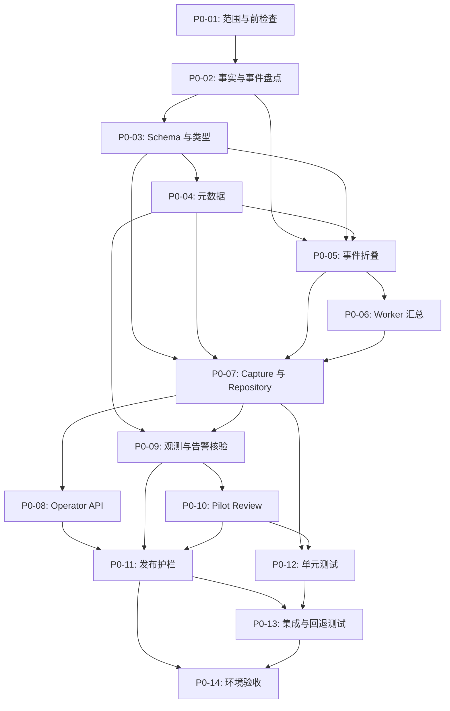

# 批次 0：运行基线与发布护栏实施任务清单

## 文档信息

| 项目 | 内容 |
| --- | --- |
| 状态 | P0-10 已完成（保留运行证据、观测未知、dispatch limitation 和零个 selected）；P0-01 至 P0-10 已完成 |
| 版本 | 1.1 |
| 更新时间 | 2026-09-16（P0-10 完成） |
| 路线阶段 | [阶段 0：基线和发布护栏](../../roadmap/phases/phase-0-baseline.md) |
| 产品规格 | [product.md](./product.md) |
| 技术设计 | [tech.md](./tech.md) |
| 场景事实来源 | `traffic-control-plane/src/lib/fault-run-catalog.ts` |

## 任务规则

1. 开始任务时将 `- [ ]` 改为 `- [-]`；完成本任务定义的验证并记录执行情况后，才改为 `- [x]`。被阻塞的任务使用 `- [!]`，并关联“问题跟踪”中的 ID。
2. 每完成、阻塞、恢复或取消一个子任务，立即同步更新：对应复选框、任务组状态和进度、总体进度、更新时间，以及“执行更新记录”中的一行事实记录。
3. 每发现或解决一个问题，立即在“问题跟踪”中保留问题、影响、方案和状态。问题解决后不得删除历史；方案影响产品范围、数据边界、权限、状态语义或发布方式时，先更新 [product.md](./product.md) 和 [tech.md](./tech.md)。
4. 场景、目标 operation、参数、时长和 `recoveryStrategy` 只从 Catalog 读取。本清单不复制场景定义，也不以固定数量作为覆盖完成依据；运行覆盖以采集时的 `catalogRevision` 和 Catalog 派生矩阵为准。
5. 缺失事实必须记录为 `NULL`、`UNKNOWN`、`INCOMPLETE` 或明确 limitation，禁止以 `0`、空数组或成功状态补齐。旁路采集不得改变 Fault Run、Worker、Gateway 或目标服务的业务效果。
6. 所有写入接口沿用 Operator session、CSRF、审计和现有错误 envelope；观测核验只保存摘要、查询引用和判断结果，不保存原始指标、日志、Trace、告警 envelope、凭据或可执行命令。
7. 默认保持 `BASELINE_CAPTURE_ENABLED=false`。未完成迁移、自动化验证和可回退验证前，不得在共享环境启用采集路径。
8. 任务组进度按组内子任务统计；总体进度同时展示任务组数和子任务数。文档建立、状态更新和问题登记不计入实施任务组。

## 总体进度

- **总体状态：** Phase 0 执行中；P0-01 至 P0-10 已完成，保留环境、运行证据、观测 limitation、清理核验、dispatch limitation、告警 receipt 缺失和历史预热 limitation。
- **总体进度：** 10 / 14 个任务组（49 / 74 个子任务）。
- **当前任务：** P0-11：配置、资源预算、运行手册与回退护栏（未开始）。
- **当前问题：** P0-ISSUE-001 处理中；P0-ISSUE-002 已阻塞（控制面 webhook route 和机器认证缺失）；P0-ISSUE-003 处理中（Compose 已核验，Kubernetes Loki/运行时仍有 limitation）；P0-ISSUE-009、P0-ISSUE-010、P0-ISSUE-011 待核验；P0-ISSUE-004 处理中（capture 已接入但发布 revision 仍可能为 UNKNOWN）；P0-ISSUE-005 本次执行已解决；P0-ISSUE-006 待处理；P0-ISSUE-007、P0-ISSUE-008 处理中；P0-ISSUE-012、P0-ISSUE-013、P0-ISSUE-014、P0-ISSUE-015 已解决（运行时证据仍待后续环境核验）。
- **下一步：** 进入 P0-11；保持零个 `SELECTED`，真实场景运行仍需遵守 `CART_CATALOG_DEPENDENCY` 未核验、告警 receipt 缺失、retention limitation、历史预热进度 stale 和本地资源 limitation。

| 任务组 | 目标 | 状态 | 进度 | 前置依赖 |
| --- | --- | --- | --- | --- |
| P0-01 | 范围锁定与执行前检查 | 已完成（有 limitation） | 4 / 4 | 无 |
| P0-02 | 事实来源、事件和失败分类盘点 | 已完成（有 limitation） | 4 / 4 | P0-01 |
| P0-03 | 持久化 schema、迁移与受控类型 | 已完成 | 5 / 5 | P0-02 |
| P0-04 | Catalog、发布、部署和预热元数据 | 已完成（有 limitation） | 6 / 6 | P0-03 |
| P0-05 | 事件折叠、时间线和完整性判断 | 已完成（有 limitation） | 6 / 6 | P0-02、P0-03、P0-04 |
| P0-06 | Worker 结束汇总事件补齐 | 已完成（有 limitation） | 4 / 4 | P0-02、P0-05 |
| P0-07 | Baseline capture 服务与幂等 repository | 已完成（有 limitation） | 5 / 5 | P0-03 至 P0-06 |
| P0-08 | Operator API、鉴权、CSRF 与审计 | 已完成（有 limitation） | 5 / 5 | P0-07 |
| P0-09 | 只读观测、retention 与告警接入核验 | 已完成（有 limitation） | 5 / 5 | P0-04、P0-07 |
| P0-10 | 阶段 5 pilot review | 已完成（无合格候选） | 5 / 5 | P0-09 |
| P0-11 | 配置、资源预算、运行手册与回退护栏 | 未开始 | 0 / 6 | P0-03、P0-04、P0-08 至 P0-10 |
| P0-12 | 单元测试与 fixture 覆盖 | 未开始 | 0 / 6 | P0-03 至 P0-10 |
| P0-13 | 集成、安全边界与回退测试 | 未开始 | 0 / 6 | P0-08 至 P0-12 |
| P0-14 | 真实环境基线、验收与阶段退出 | 未开始 | 0 / 7 | P0-11 至 P0-13 |

## 执行依赖

---

## P0-01：范围锁定与执行前检查

**目标：** 在不改动运行时行为的前提下，锁定批次边界、可用环境和本次采集所依据的事实。

**状态：** 已完成（有 limitation）；**进度：** 4 / 4；**关联问题：** P0-ISSUE-001、P0-ISSUE-003、P0-ISSUE-004、P0-ISSUE-006、P0-ISSUE-007

- [x] 复核路线阶段、产品规格、技术设计和共用运行规则，确认本批次只增加旁路采集、只读查询和发布护栏，不新增目标服务行为、自动恢复或 Agent 写权限。
- [x] 从 `listScenarioDefinitions()` 生成本次覆盖矩阵，并记录生成时间、`catalogRevision`、目标 operation、`recoveryStrategy` 和待核验 dispatch；矩阵只作为带 revision 的执行证据，不成为第二份 Catalog。
- [x] 确认 disposable Compose 运行和 Kubernetes 配置核验的责任环境、访问边界、观测入口与停止窗口；本次执行由用户明确授权当前工作区作为 disposable Compose 环境，核验结束后停止容器但保留数据卷；Kubernetes 仍仅完成 manifest/context 核验，未部署 `castrel` namespace。初始阻塞及解除记录见 P0-ISSUE-005。
- [x] 在任何代码改动前记录控制面、Gateway、MySQL、Redis 和观测组件的健康检查结果，以及当前 active Fault Run、预热状态和已有残留资源摘要；不可用和未知事实按 limitation 记录，不视为健康或清理完成。

### P0-01 环境与状态快照

初始检查时间：`2026-09-16 14:50:39 CST`（`2026-09-16T06:50:39Z`）；完整栈稳定复核：`2026-09-16 15:29 CST`。以下是当前工作区的观察结果，不代表 Kubernetes 专用环境已就绪。

| 范围 | 声明入口与访问边界 | 本次观察 | 停止/限制 |
| --- | --- | --- | --- |
| Compose | `docker compose`；控制面、Gateway、Shopfront 和观测入口使用 README 中声明的宿主机端口；MySQL/Redis 端口也对宿主机发布 | `docker compose config --quiet` 通过；用户确认启动边界后，完整栈已运行；控制面/Gateway/Shopfront、业务服务健康检查和带认证的 Prometheus/Alertmanager/Loki/Tempo 入口最终可达。预热显式关闭。Order 默认 JVM 首次启动 OOM，使用本次核验专用的 512MB `JAVA_TOOL_OPTIONS` 临时容器后健康 | 核验结束只停止/移除容器并保留数据卷；本地 ARM64 通过 linux/amd64 模拟，资源预算不代表专用环境性能基线；不执行场景 Fault Run |
| Kubernetes | Kustomize 默认 namespace 为 `castrel`；业务与观测服务为集群内 Service，控制面按 README 通过 `kubectl port-forward` 访问 | `kubectl kustomize k8s` 通过；当前 context 可执行目标 namespace 的只读权限检查，但 `kubectl get namespace castrel` 返回 `NotFound`，namespace 下没有可核验对象 | 未执行部署或 teardown；`scripts/k8s-teardown.sh` 会移除整套资源，`--delete-pvc` 还会删除 MySQL 数据，未经批准不得执行 |
| 责任与窗口 | 本次执行边界由用户确认：当前工作区作为 disposable Compose，结束后停止容器并保留数据卷；Kubernetes 仍为配置核验环境 | 本次 Compose 授权和停止边界已确认；专用共享环境 owner、Kubernetes namespace 和长期窗口仍为 `UNKNOWN` | P0-ISSUE-005 在本次执行范围解除；不能把本地 Compose 资源预算外推到共享环境 |

### P0-01-4 运行状态摘要

- **健康检查：** MySQL、Redis、全部带 healthcheck 的业务服务、Gateway、Shopfront 和控制面最终为 `healthy`；控制面根路由跟随重定向返回 `200`，Gateway actuator 返回 `200`，带配置认证的 Prometheus、Alertmanager、Loki 和 Tempo 入口最终返回 `200`。Worker 无 healthcheck，但容器为 `running`；本次仅确认进程存活，不能把它当作业务循环完成。
- **Fault Run：** `fault_runs` 当前仅观察到 `FAILED=16`、`RECOVERED=1`、`STOPPED=7`；查询非终态集合无结果，因此当前没有可确认的 active/non-terminal Fault Run。该结论只覆盖当前 MySQL 数据，不替代完整控制面 API 核验。
- **预热：** `DATA_WARMUP_ENABLED=false`，因此本次 Worker 没有取得预热写入租约；`data_warmup_progress` 仍有 `user_behavior_log` 和 `product_price_history` 两行，均为 `BACKFILLING`，`target_rows=90000000`、`actual_rows=0`、`current_date_value=2026-08-27`、`day_completed_rows=0`、`lease_owner=NULL`、`last_success_at=NULL`；没有 manual job，manual exclusion 数为 `0`。这与当前支持的 180 天 × 300000 行/天约束和当前检查日期不一致，不能判定为就绪，详见 P0-ISSUE-006。
- **残留资源：** 本地目录观察到 `data/mysql=154M`、`data/loki=124K`；`data/redis`、`data/prometheus`、`data/notification-service`、`data/catalog-service`、`data/promotion-service`、`data/inventory-service` 为 `0B`，控制面/Worker/Tempo/Alertmanager 目录不存在。Redis 中按 `traffic-control-plane:*`、`fault-run:*`、`fault:*` 和 `*warmup*` 扫描未发现 key 名称；应用目标资源因目标服务未运行而为 `UNKNOWN`，不能据此宣称已清理。

## P0-02：事实来源、事件和失败分类盘点

**目标：** 将已有运行事实映射为可复查的 baseline 输入，并明确缺失信息的处理方式。

**状态：** 已完成（有 limitation）；**进度：** 4 / 4；**关联问题：** P0-ISSUE-001、P0-ISSUE-006、P0-ISSUE-007、P0-ISSUE-008、P0-ISSUE-009、P0-ISSUE-010、P0-ISSUE-011

- [x] 盘点 `fault_runs`、`fault_run_events`、`operator_audit_logs`、预热进度和现有 Worker 汇总事件的字段、保留期、关联键和可信边界；实际 schema、代码 retention 和当前数据窗口已记录如下。
- [x] 为 Catalog 派生覆盖矩阵逐项核验 Catalog target map、Worker/Runner dispatch、实际受控请求和终态汇总事件，特别记录缺少 dispatch 或汇总事实的条目；当前 MySQL 证据与静态路径差异已记录如下。
- [x] 定义并评审五类稳定失败分类：目标效果、控制面、Worker、恢复和清理；区分控制动作、效果观察、业务恢复和资源清理四种事实，禁止退化为笼统的 `FAILED`；规则如下。
- [x] 形成低基数事件命名、必填字段、payload 限长和脱敏约定，列出可复用事件、待补齐汇总事件及无法可靠采集的字段；约定如下。

### P0-02-1 事实来源盘点

| 事实来源 | 关键字段与关联键 | 保留/生命周期 | 可信边界 |
| --- | --- | --- | --- |
| `fault_runs` | `fault_run_id` 主键；`scenario`、`target_service`、`target_operation`、`state`、`parameters_json`、`fencing_token`、`started_at`、`expires_at`、`stopped_at`、`stop_reason`、`recovery_result`、`recovery_error`、`operator_audit_id`、`trace_id`、`created_at`、`updated_at` | Worker 每 24 小时尝试一次 retention；仅删除 `stopped_at`、`recovery_result` 非空且状态为 `RECOVERED/STOPPED/FAILED`、停止时间超过 7 天的记录，每次最多 100 条 | 状态/时间/恢复结果是控制面事实；参数和错误来自控制面输入或目标返回，不能单独证明目标效果或业务恢复 |
| `fault_run_events` | `id` 主键；`fault_run_id` 关联来源 run；`event_type`、可空 JSON `payload`、`created_at`；查询按 `(fault_run_id, created_at, id)` | 与 eligible Fault Run 一起被显式删除；DDL 对 `fault_runs` 是 `ON DELETE CASCADE`，但 retention 代码仍显式删除事件 | 事件是控制面/Worker 写入的运行证据；事件类型为字符串、payload 无统一 schema/长度约束，不能把任意事件当作可信汇总 |
| `operator_audit_logs` | `id` 主键；`operator_id`、`action`、`target`、`parameter_hash`、`result`、`correlation_id`、`created_at`；Fault Run 通过可空 `operator_audit_id` 左连接 | Fault Run retention 仅按已关联的 audit id 删除；未关联的审计没有在当前 retention 函数中被清理 | 记录 Operator 控制动作和参数哈希，不是目标效果或观测证据；DDL 未声明到 Fault Run 的外键，关联完整性依赖应用写入 |
| `data_warmup_progress` | `table_name` 主键；status、目标/实际行数、当前日期、每日进度、速率、时间范围、表大小、过期分区数、`lease_owner`、`guard_reason`、`last_success_at`、`updated_at` | Worker 负责创建/更新，分区窗口由 init SQL 和 Worker rollover 维护；无 Fault Run retention | 是 Worker 预热进度快照；`DATA_WARMUP_ENABLED=false` 时本次不刷新；历史行可能过期或与当前配置不一致，必须标记 `STALE/UNKNOWN` |
| `data_warmup_manual_jobs` / exclusions | job `id` 主键；operation/table/dates/rows/status/progress/error/heartbeat/claim owner；exclusion 以 `(table_name, date_value)` 复合主键 | Worker 通过 lease、heartbeat 和 120 秒 stale 判断接管；manual exclusion 没有自动 retention | 是受控预热人工作业事实；不应读取为 Fault Run 结果，也不能用手工 SQL 改写租约或进度 |
| Worker 汇总事件 | 报表：`REPORT_WORKER_STARTED`、`REPORT_REQUEST`、`REPORT_REQUEST_FAILED`、`REPORT_WORKER_STOPPED`；受控 Worker：`SCENARIO_WORKER_STARTED`、`SCENARIO_WORKER_TARGET`、`SCENARIO_REQUEST_FAILED`、`SCENARIO_WORKER_STOPPED`、`SCENARIO_WORKER_DRAINED`；Runner：`RUNNER_LIFECYCLE_SUMMARY` | 事件跟随 Fault Run 保存/删除；Report 当前按请求追加累计 `REPORT_REQUEST`，失败另追加失败事件；受控 Worker 仅失败逐事件、结束写 snapshot | 只有结束汇总或明确累计事件可提供请求统计；缺失 dispatch、缺失终态汇总、事件写入失败或 worker 未运行时必须保留 `NULL`/`INCOMPLETE` |

当前 MySQL 只读快照（检查时间：`2026-09-16 15:29 CST`）：`fault_runs=24`、`fault_run_events=105`、`operator_audit_logs=39`；三者可见数据窗口均为 `2026-08-27` 至 `2026-09-03`。事件最大 payload 长度按类型观察为 `25`～`593` 字符，但这是当前数据结果，不是 schema 上限。事件表没有 payload 长度约束，且现有 Report/Scenario Worker 存在按请求或按失败写事件的路径，已登记 P0-ISSUE-008。

### P0-02-2 Catalog dispatch 与运行证据核验

| Catalog 条目 | 静态 dispatch / target map | 当前 MySQL 可复查运行证据 | 结论 |
| --- | --- | --- | --- |
| `BROWSE_REPORT_SQL` | `ReportScenarioWorker` 存在；Gateway target map 有对应 operation | 12 条历史记录均为 `FAILED`，仅有 create/compensation 事件，无 `REPORT_WORKER_*` | 无法证明受控请求已执行，`INCOMPLETE` |
| `ORDER_REPORT_SQL` | `ReportScenarioWorker` 存在；Gateway target map 有对应 operation | 没有当前库记录 | 运行证据 `UNKNOWN`，`INCOMPLETE` |
| `BROWSE_SURGE` | `TrafficSurgeExecutor` + `ControlledScenarioWorker`；不走 Gateway prepare/release | 没有当前库记录 | 运行证据 `UNKNOWN`，`INCOMPLETE` |
| `ORDER_QUERY_SURGE` | `TrafficSurgeExecutor` + `ControlledScenarioWorker`；不走 Gateway prepare/release | 没有当前库记录 | 运行证据 `UNKNOWN`，`INCOMPLETE` |
| `CART_CATALOG_DEPENDENCY` | Gateway target map 和目标 endpoint 存在；未找到控制面 Worker/Runner dispatch | 没有当前库记录 | `DISPATCH_UNVERIFIED`，受 P0-ISSUE-001 约束 |
| `CATALOG_REDIS_LARGE_VALUE` | `ScenarioWorkers` + `ControlledScenarioWorker`；Gateway target map 有对应 operation | 8 条 `TARGET_CONFIRMED` 后进入 `RECOVERED/STOPPED`，但仅见旧 `EXERCISE_WORKER_*`，没有当前 `SCENARIO_WORKER_*` 终态汇总 | 旧证据不能代表当前 Worker 合同，`INCOMPLETE` |
| `NOTIFICATION_HEAP_PRESSURE` | `RunnerEngine` + `TrafficActionOrchestrator`；Gateway target map 有对应 operation | 没有当前库记录 | 运行证据 `UNKNOWN`，`INCOMPLETE` |
| `NOTIFICATION_STORAGE_APPEND` | `RunnerEngine` + `TrafficActionOrchestrator`；Gateway target map 有对应 operation | 2 条历史记录均为 `FAILED`，无 `RUNNER_LIFECYCLE_SUMMARY` | 无法证明 append 请求或终态摘要，`INCOMPLETE` |
| `PROMOTION_LOCK_CONTENTION` | `ScenarioWorkers` + `ControlledScenarioWorker`；Gateway observation path 存在 | 没有当前库记录 | 运行证据 `UNKNOWN`，`INCOMPLETE` |
| `INVENTORY_TABLE_EXCLUSIVE` | `ScenarioWorkers` + `ControlledScenarioWorker`；Gateway observation path 存在 | 没有当前库记录 | 运行证据 `UNKNOWN`，`INCOMPLETE` |
| `INVENTORY_ROW_LOCK` | `ScenarioWorkers` + `ControlledScenarioWorker`；Gateway observation path 存在 | 没有当前库记录 | 运行证据 `UNKNOWN`，`INCOMPLETE` |
| `PSP_PROVIDER_OUTCOME` | `RunnerEngine` + `TrafficActionOrchestrator`；Gateway target map 有对应 operation | 1 条历史记录为 `FAILED`，无 `RUNNER_LIFECYCLE_SUMMARY` | 无法证明 PSP 请求或终态摘要，`INCOMPLETE` |

核验方法：静态路径来自 Catalog、`OperationDispatchController.TARGETS`、`FaultRunCoordinator`、三个 Worker 和 Runner；运行证据来自当前 MySQL 按 `scenario/state/event_type` 的只读聚合，不执行新的 Catalog Fault Run。当前事件集合没有 `REPORT_WORKER_STOPPED`、`SCENARIO_WORKER_STOPPED`、`SCENARIO_WORKER_DRAINED` 或 `RUNNER_LIFECYCLE_SUMMARY`；`EXERCISE_WORKER_STARTED/STOPPED` 被视为历史不兼容事件。静态“已核验”不升级为运行时 complete，11 个有代码路径的条目仍需在 P0-14 受控环境运行后才能形成真实请求和终态汇总证据。

### P0-02-3 五类失败分类与事实边界

分类在 baseline 折叠层派生，不修改既有 Fault Run 状态、事件名或目标服务契约。一个运行可以同时有多个 `failureClass`；每个分类必须保留来源事件、时间和稳定 `failureCode`，不能把所有事实压缩为 `FAILED`。

| `failureClass` | 定义 | 可信来源 | 不得据此推断 |
| --- | --- | --- | --- |
| `TARGET_EFFECT_FAILURE` | 目标 operation 被拒绝、目标返回明确失败，或目标效果在有明确观测契约时未达成 | 目标 prepare/release/cleanup 返回的受控结果；结构化 Worker/Runner 业务结果；明确的 target observation | `TARGET_CONFIRMED` 只说明控制动作被接受；HTTP 502、Worker 异常或缺少事件不能单独证明目标效果失败 |
| `CONTROL_PLANE_FAILURE` | 控制面请求校验、幂等、数据库 schema/读回、状态转换、fencing 或调度自身失败 | Operator audit、`CREATED`/`CREATE_FAILED`、状态转换结果、持久化异常和稳定 API error code | 目标业务失败、目标健康异常或目标效果未观察到 |
| `WORKER_FAILURE` | Worker 未启动、setup 失败、请求执行器失败、汇总事件写入失败或 drain 未完成，导致受控请求事实不完整 | `*_WORKER_STARTED`、`*_WORKER_STOPPED`、`*_WORKER_SETUP_FAILED`、`SCENARIO_REQUEST_FAILED`、`SCENARIO_WORKER_DRAINED` snapshot 及 worker 生命周期 | 单个业务请求失败一定是 Worker 故障；只有有结构化目标响应时才可另记目标效果失败 |
| `RECOVERY_FAILURE` | 到期/停止后的 release、worker drain、补偿或服务恢复未完成/明确失败 | `RECOVERY_STARTED`、`RECOVERY_COMPLETED`、`RECOVERY_FAILED`、`CREATE_RECOVERY_FAILED`、`COMPENSATION_*`、`SERVICE_UNAVAILABLE`/`SERVICE_RECOVERED` | `RECOVERY_COMPLETED` 只证明控制动作完成；`SERVICE_UNAVAILABLE` 本身是健康/效果事实，不能自动等同于恢复动作失败 |
| `CLEANUP_FAILURE` | Catalog 要求的手工或资源清理未执行、明确失败或结果无法验证 | `MANUAL_CLEANUP_COMPLETED`、`MANUAL_CLEANUP_FAILED`、目标 cleanup 返回值和资源核验 | release 成功或手工 endpoint 返回成功不自动证明所有 run-scoped 资源已删除；`NON_RELEASING` 不应被标为清理失败 |

稳定 `failureCode` 首批约定为 `TARGET_EFFECT_REJECTED`、`TARGET_EFFECT_UNOBSERVED`、`CONTROL_PLANE_VALIDATION_FAILED`、`CONTROL_PLANE_STORAGE_FAILED`、`WORKER_SETUP_FAILED`、`WORKER_REQUEST_FAILED`、`WORKER_SUMMARY_MISSING`、`WORKER_DRAIN_INCOMPLETE`、`RECOVERY_RELEASE_FAILED`、`RECOVERY_COMPENSATION_FAILED`、`BUSINESS_RECOVERY_UNCONFIRMED`、`CLEANUP_REQUIRED`、`CLEANUP_FAILED` 和 `CLEANUP_UNVERIFIED`。原始异常只作为受控、脱敏后的诊断字段；不得把异常文本当作稳定 code。

四种事实分别填充，不互相替代：

| 事实 | 允许的来源 | 缺失时 |
| --- | --- | --- |
| `controlAction` | Operator audit、Fault Run 状态转换和 coordinator 事件 | `UNKNOWN`，不能用目标请求成功代替 |
| `effectObserved` | target summary、结构化 Worker/Runner 结果或明确观测查询 | `UNKNOWN`，不能用 `TARGET_CONFIRMED`/HTTP 成功代替 |
| `businessRecovered` | `SERVICE_RECOVERED` 或独立、受控的业务健康恢复证据 | `UNKNOWN`；没有恢复事件不写 `true` |
| `resourceCleanup` | Catalog recovery strategy、release/cleanup 事件和 run-scoped 资源核验 | `NOT_REQUIRED`、`MANUAL_REQUIRED`、`COMPLETED`、`FAILED` 或 `UNKNOWN`；不能将清理请求 accepted 直接当作物理删除完成 |

完整性规则：非终态统一为 `RUN_NOT_TERMINAL`；没有 dispatch 为 `DISPATCH_UNVERIFIED`；缺少必需 Worker/Runner 汇总为 `MISSING_RUNTIME_EVENT` 并保持 `INCOMPLETE`；计数不一致为 `COUNTER_INCONSISTENT`，保留可信原值而不修正。`SERVICE_UNAVAILABLE` 只设置健康/业务恢复未知边界，只有明确恢复动作失败才增加 `RECOVERY_FAILURE`。

### P0-02-4 低基数事件与 payload 约定

**命名与通用字段：**

- 新增或补齐的事件使用固定大写 snake case 白名单，`event_type` 不得拼接 run ID、SKU、URL、错误文本或时间；数据库列的 64 字符上限是硬上限。
- 新汇总事件 payload 必须带 `schemaVersion=1`、固定 `source`（`coordinator`、`report-worker`、`scenario-worker`、`runner`、`cleanup` 之一）、固定 `phase`（`control`、`effect`、`worker`、`recovery`、`cleanup` 之一）和固定 `status`（`STARTED`、`COMPLETED`、`FAILED`、`DRAINED`、`UNKNOWN` 之一）。`faultRunId`、创建时间和事件自增 id 以事件行字段为准，不在 payload 重复保存。
- Worker/Runner 汇总保留非负计数、超时计数、延迟摘要、稳定 `stopReason`/`failureCode` 和受控 drain 信息；`REPORT_WORKER_STOPPED` 至少需要 requests/successes/failures/averageLatencyMs/reason，`SCENARIO_WORKER_STOPPED` 需要完整 `ScenarioWorkerStats`，`SCENARIO_WORKER_DRAINED` 需要最终 snapshot，`RUNNER_LIFECYCLE_SUMMARY` 需要 status/success/latency/errorCode。
- `TARGET_CONFIRMED` 只允许 bounded target summary；recovery 事件只记录动作状态和 worker drain；cleanup 事件只记录 scope、稳定结果 code 和核验状态，不内嵌目标原始响应。

**体积、值域和脱敏：**

- 新/补齐事件的 UTF-8 JSON serialized payload 最大 8 KiB；字符串默认最大 256 字符，稳定 code 最大 64 字符，opaque id/trace 最大 128 字符；数组最大 64 项；计数和延迟必须为有限非负安全整数。超过上限必须拒绝写入并记录稳定 `EVENT_PAYLOAD_INVALID`，不能静默截断事实。
- payload 禁止 Authorization、Cookie、密码、token、secret、service key、session credential、完整请求/响应 headers、原始 SQL、shell/命令、堆栈、告警 envelope 和完整日志。错误只写白名单 `failureCode`；如确有必要保留诊断 message，先脱敏且不超过 256 字符。
- 现有历史事件不因本约定重写；折叠器发现旧 payload 超限、字段不合规或无法识别时，保留来源并写 limitation/`UNKNOWN`，不能把样本长度当作 schema 安全上限。

**可复用、禁止新增和待补齐：**

| 类型 | 事件 | 约束 |
| --- | --- | --- |
| 可复用低基数 | `CREATED`、`TARGET_CONFIRMED`、`RECOVERY_STARTED`、`RECOVERY_COMPLETED`、`RECOVERY_FAILED`、`CREATE_RECOVERY_FAILED`、`COMPENSATION_*`、`REPORT_WORKER_STARTED/STOPPED`、`SCENARIO_WORKER_STARTED/STOPPED/DRAINED`、`RUNNER_LIFECYCLE_SUMMARY`、`MANUAL_CLEANUP_COMPLETED/FAILED` | 固定类型和 bounded payload；按来源折叠，不按事件名猜测效果或业务恢复 |
| 仅折叠历史，不再新增逐请求写库 | `REPORT_REQUEST`、`REPORT_REQUEST_FAILED`、`SCENARIO_REQUEST_FAILED` | 这些事件当前可能每请求/每失败产生；新代码只写终态累计摘要，历史缺失时保持 `UNKNOWN`/`INCOMPLETE` |
| 待补齐或必须运行核验 | surge 的 `SCENARIO_WORKER_DRAINED`、setup 中断时的终态边界、各 Worker/Runner 在 stop/expiry/restart 的最终摘要、`CART_CATALOG_DEPENDENCY` 的 dispatch/summary | P0-06 评审并补齐可可靠的低基数事实；没有可靠来源时不得新增 no-op 事件 |

**无法可靠采集的字段：** 不能从 Prometheus 百分比推导请求总数/成功数，不能从 `TARGET_CONFIRMED` 推导目标效果，不能从 release 成功推导业务恢复，不能从 cleanup endpoint accepted 推导物理资源删除，不能从历史 `EXERCISE_WORKER_*` 改名推导当前 Worker drain；Runner 没有可靠总请求数时 `requests` 保持 `null`，预热历史进度与当前合同不一致时保持 `STALE/UNKNOWN`。

## P0-03：持久化 schema、迁移与受控类型

**目标：** 以 expand-only 迁移保存长期可查的 baseline 和 pilot review 摘要，同时保持现有 Fault Run schema 不变。

**状态：** 已完成；**进度：** 5 / 5；**关联问题：** P0-ISSUE-008、P0-ISSUE-010、P0-ISSUE-011

- [x] 定义 `scenario_baselines` 和 `baseline_pilot_reviews` 的显式 TypeScript schema、受控 JSON 字段、枚举和值域；拒绝 secret、原始响应、超长 payload 和可执行内容。类型和值域已集中在 `traffic-control-plane/src/lib/baseline-schema.ts`；写入侧的深度校验和拒绝测试留在 P0-07/P0-12。
- [x] 新增 `traffic-control-plane/src/lib/migrations/002-fault-run-baseline.sql`，仅创建新表、索引和约束，不修改既有 `fault_runs` 或 `fault_run_events` 状态约束；DDL 不建立来源外键，避免 Fault Run retention 级联删除 baseline。
- [x] 新增 `infra/mysql/init/06-fault-run-baseline.sql`，与应用迁移在表结构、索引、约束和 schema revision 上一致，支持 fresh install；已通过两文件字节级比较。
- [x] 新增幂等应用 schema 初始化逻辑，验证已有 MySQL volume 无需重置且初始化失败不会影响既有 Fault Run 路径；`ensureBaselineSchema()` 独立于 `ensureFaultRunSchema()`，现有 Fault Run repository 不依赖新表初始化。
- [x] 确认 baseline 不对来源 Fault Run 使用级联删除；保留基线摘要与低频 pilot review，不把它们当作观测现场数据或现有 retention 的替代品；实际 `information_schema.referential_constraints` 查询无新表外键。

## P0-04：Catalog、发布、部署和预热元数据

**目标：** 以确定性、可核验的元数据标识每份 baseline 的输入版本和部署事实。

**状态：** 已完成（有 limitation）；**进度：** 6 / 6；**关联问题：** P0-ISSUE-004、P0-ISSUE-006、P0-ISSUE-012

- [x] 实现从 `listScenarioDefinitions()` 派生的 canonical Catalog 序列化和 SHA-256 `catalogRevision`；排序、参数和 options 重排测试通过，Catalog 事实变化会改变 revision；当前矩阵已更新为 `000ccc36e4a77ef27d22636bdbc4643ff79ddb0c205b21830967bc40b7abd7dc`。
- [x] 增加并校验 `CASTREL_RELEASE_REVISION`，由 Compose/Kubernetes 配置提供注入入口；缺失或不合法时记录 `UNKNOWN` 和 limitation，不能从 `NODE_ENV` 推测版本。
- [x] 增加并校验 `CASTREL_DEPLOYMENT_MODE`，只接受 `local`、`compose`、`kubernetes` 和 `unknown`；Web/Worker 均读取显式配置，不依据 hostname、端口或容器特征猜测。
- [x] 将 `BASELINE_SCHEMA_REVISION=baseline.v1` 作为单一应用常量，并在应用 migration、fresh-install SQL 和 baseline metadata 中保持一致；两份 baseline DDL 已通过 `cmp`。
- [x] 新增 `loadBaselineWarmupMetadata()`，从数据库配置和 Worker progress 读取 `dataWarmupEnabled`、完整配置和受控进度摘要；查询不可用时返回显式 limitation，不复制 Web/Worker 环境配置。P0-07 仍需将该 metadata 接入最终 capture service。
- [x] 将 Data Warmup 配置迁移为数据库唯一运行时来源：首次启动严格校验环境默认值且只在配置行缺失时初始化；新增版本/CAS、CSRF、审计、影响确认的 Operator API/页面编辑；Worker 启动服务后按租约和批次动态读取启停、窗口、目标、批量和并发配置。

验证证据：`pnpm exec tsx --test src/lib/fault-run-catalog-revision.test.ts src/lib/baseline-metadata.test.ts src/lib/data-warmup-config.test.ts`、`pnpm typecheck`、`pnpm lint`、`pnpm test:i18n`、`pnpm test:runner` 均通过；`docker compose config --quiet`、`kubectl kustomize k8s` 和两份 Data Warmup DDL/两份 baseline DDL 的一致性检查通过。未启动 Worker 预热写入，历史 progress stale 问题仍由 P0-ISSUE-006 跟踪。

## P0-05：事件折叠、时间线和完整性判断

**目标：** 从终态 Fault Run 与受控汇总事件生成确定性事实，清晰表达未知、限制和失败。

**状态：** 已完成（有 limitation）；**进度：** 6 / 6；**关联问题：** P0-ISSUE-001、P0-ISSUE-009、P0-ISSUE-010、P0-ISSUE-011

- [x] 实现按 `created_at, id` 的稳定事件折叠器，保留事件来源和缺失字段，不依赖隐式到达顺序或百分比反推请求数。
- [x] 按 [tech.md 第 7.2 节](./tech.md#72-事实折叠)的来源策略处理报告 Worker、受控场景 Worker 和正常 lifecycle 汇总；仅在可信事件存在时写入请求、成功、失败、超时和延迟。
- [x] 按既定优先级生成 prepare、active、stop、recovery、cleanup 和 health check 时间线；`activeAt` 只能来源于状态转换的确认事实，不能用首次业务请求替代。
- [x] 按 Catalog `recoveryStrategy` 判断 `TARGET`、`WORKER`、`MANUAL_CLEANUP` 与 `NON_RELEASING` 的 release、cleanup 和残留边界，不得把手工清理或非释放效果标为自动成功。
- [x] 校验请求计数的一致性；存在矛盾时保留可信原始值，记录 `COUNTER_INCONSISTENT`，并输出 `COMPLETE_WITH_LIMITATIONS` 或 `INCOMPLETE`。
- [x] 落实 `RUN_NOT_TERMINAL`、`SOURCE_RUN_NOT_FOUND`、`DISPATCH_UNVERIFIED`、`MISSING_RUNTIME_EVENT`、`OBSERVATION_UNAVAILABLE` 和 `CATALOG_REVISION_FAILED` 的稳定错误、状态和审计语义；实际 Operator audit 写入留给 P0-07/P0-08，折叠层保留来源与 limitation。

实现证据：新增 `baseline-event-folding.ts`、`baseline-capture-errors.ts` 及 6 个 fixture 测试。折叠器按 `created_at,id` 排序，分别处理 Report/Scenario/Runner 来源，输出生命周期、四类 outcome、失败分类/code、可信请求摘要、事件来源和 limitation；`TARGET_CONFIRMED` 不被当作 effect，`RECOVERY_COMPLETED` 不被当作业务恢复或物理清理完成，`CART_CATALOG_DEPENDENCY` 无运行 dispatch 时输出 `DISPATCH_UNVERIFIED`/`INCOMPLETE`。Stable capture error 含 HTTP status 映射，非终态统一 `RUN_NOT_TERMINAL`。

## P0-06：Worker 结束汇总事件补齐

**目标：** 仅为可可靠采集的终态事实补充低基数汇总事件，不引入每请求写库或改变业务路径。

**状态：** 已完成（有 limitation）；**进度：** 4 / 4；**关联问题：** P0-ISSUE-001、P0-ISSUE-009、P0-ISSUE-011

- [x] 核验报告 Worker、受控场景 Worker 和 Runner lifecycle 在停止、到期、失败及重启边界均能产生可用终态汇总。
- [x] 仅在缺失处补齐 `REPORT_WORKER_STOPPED`、`SCENARIO_WORKER_STOPPED` 或既定 lifecycle 汇总的结束事实；不增加每个请求的数据库事件。
- [x] 确认新增或调整的事件只包含低基数计数、稳定错误代码、状态和 drain 摘要，并实施长度限制与敏感字段排除。
- [x] 对没有可确认 dispatch 或可信汇总的条目生成 `DISPATCH_UNVERIFIED`/`INCOMPLETE`，阻止其被标记为 complete 或被选择为 pilot。

实现证据：新增 `fault-run-event-contract.ts` 与 3 个契约 fixture；报告 Worker 将 started 写入纳入 try/finally，保证 setup/stop 边界尝试 `REPORT_WORKER_STOPPED`；受控 Worker 在 start event 失败、到期和 stop 仍尝试终态 STOPPED，Scenario Workers 和 Traffic Surge 均写入规范化 `SCENARIO_WORKER_DRAINED`；Runner lifecycle summary 去除 traffic/lifecycle ID，仅保留结果状态、成功标记、延迟和受控 failure code。统一 payload 包含 `schemaVersion/source/phase/status`，只复制白名单计数/延迟/cache/drain 字段，8 KiB 上限由规范化函数保证。现有每请求事件未新增，CART 无 dispatch 仍由 P0-05 输出 `DISPATCH_UNVERIFIED`。

## P0-07：Baseline capture 服务与幂等 repository

**目标：** 将终态运行事实安全、幂等地保存为可长期复查的摘要。

**状态：** 已完成（有 limitation）；**进度：** 5 / 5；**关联问题：** P0-ISSUE-001、P0-ISSUE-004、P0-ISSUE-006、P0-ISSUE-009、P0-ISSUE-010

- [x] 实现 baseline repository，以 `source_fault_run_id` 为唯一来源键；重复 capture 返回既有记录，不重复写入摘要、审计或事件。
- [x] 实现 capture service，加载 Fault Run、Catalog、事件和 Operator audit，并仅允许设计规定的终态运行生成最终 baseline。
- [x] 在 capture 过程中组合 lifecycle、outcome、request summary、资源预算、观测摘要、告警摘要、limitations、残留资源和回退步骤；缺失事实使用显式未知或限制。
- [x] 写入 `BASELINE_CAPTURE_REQUESTED`、`BASELINE_RUNTIME_SUMMARY_RECORDED`、`BASELINE_OBSERVATION_CHECK_RECORDED`、完成/不完整/失败事件，并保证 payload 受控且脱敏。
- [x] 验证 Fault Run 进入现有清理周期后，baseline 仍可独立读取；capture 失败或 schema 初始化失败时，现有 Fault Run 生命周期继续运行。

实现证据：新增 `baseline-repository.ts` 和 `baseline-capture.ts`；repository 以 `source_fault_run_id` 唯一键查询/保存，并在 duplicate insert 时返回已有记录；capture service 读取终态 Fault Run、事件、audit、Catalog revision、release/deployment metadata 和数据库 warmup metadata，使用 P0-05 折叠结果构造 limitation-aware baseline。新增 capture lifecycle 事件，统一使用受控、脱敏、8 KiB payload；默认 `BASELINE_CAPTURE_ENABLED=false`，重复 capture 先返回已有摘要，不重复写入事件。`baseline-capture.test.ts`、`fault-run-event-contract.test.ts`、typecheck、lint、`git diff --check` 和应用/init DDL 一致性核验通过。为既有数据卷增加幂等 `ALTER TABLE ... MODIFY data_warmup_enabled TINYINT NULL`，避免 warmup metadata 不可用时被错误写为 `false`。

限制：baseline capture 仍未接入 Operator API；观测和 Alertmanager 摘要当前明确为 `UNKNOWN`/limitation，真实运行终态事件、CART dispatch 和历史 warmup stale progress 尚未现场核验；未启动新的 Fault Run 或 warmup 写入。

## P0-08：Operator API、鉴权、CSRF 与审计

**目标：** 暴露仅供 Operator 使用的 baseline 和 pilot review 接口，不让控制面语义进入消费者路径。

**状态：** 已完成（有 limitation）；**进度：** 5 / 5；**关联问题：** P0-ISSUE-001、P0-ISSUE-002、P0-ISSUE-003、P0-ISSUE-004、P0-ISSUE-009、P0-ISSUE-010、P0-ISSUE-013、P0-ISSUE-014

- [x] 实现单次运行 baseline 的创建和查询接口，保持终态校验、幂等语义、稳定错误 code 和现有错误 envelope。
- [x] 实现按场景、capture status 和 revision 查询 baseline 摘要的只读接口，避免返回原始事件、敏感字段或观测现场内容。
- [x] 实现 pilot review 查询及写入接口；写操作要求 Operator session 与 CSRF，读取接口不出现在 Shopfront/Gateway 消费者路径。
- [x] 为所有成功和失败写操作写入 `operator_audit_logs` 并保存 audit 引用；重复 baseline 请求不得产生重复 audit。
- [x] 在 `BASELINE_CAPTURE_ENABLED=false` 时关闭新增 API/采集入口，同时确认现有 Fault Run API、Worker 和业务流量不受影响。

实现证据：新增 `/internal/fault-runs/{faultRunId}/baseline`、`/internal/baselines`、`/internal/baselines/pilot` 和 `/internal/baselines/pilot/{scenario}` Operator 路由；复用 middleware Operator session、CSRF、`jsonOk/jsonError` 和 `recordOperatorAudit()`。repository 增加 baseline 查询、audit 引用回写、pilot review 查询/upsert；baseline capture 使用来源级 MySQL advisory lock，Operator 路由在锁内先建立 FAILURE audit reservation，再将 audit id 传入 capture，成功后更新 SUCCESS；并发重复请求只返回已有记录，不重复事件或审计。Catalog revision 不一致返回 `PILOT_REVIEW_CONFLICT`，`SELECTED` 使用全局 selection lock 且仅在完整 baseline、观测 retention、三类观测、业务恢复/清理和告警规则均有可用事实时允许。新增 `baseline-pilot.test.ts`，覆盖输入边界、revision conflict、命令/敏感内容、Catalog 原型属性和未知观测阻断；build、typecheck、lint、capture/pilot fixture 均通过。

限制：Operator API 尚未在 live disposable 栈上调用；默认 `BASELINE_CAPTURE_ENABLED=false`，因此本次未生成真实 baseline 或 pilot review，实际 session/CSRF/audit/advisory lock 落库仍需 P0-13/P0-14 核验。audit reservation 在 baseline/pilot 写入前先以 FAILURE 创建，成功后更新为 SUCCESS，进程中断时保守保留 FAILURE。

## P0-09：只读观测、retention 与告警接入核验

**目标：** 以实际环境读取和查询确认观测、告警与接收链路的可用边界，而不保存现场数据。

**状态：** 已完成（有 limitation）；**进度：** 5 / 5；**关联问题：** P0-ISSUE-002、P0-ISSUE-003、P0-ISSUE-015

- [x] 从实际加载的 Compose/Kubernetes、Prometheus 和 Alertmanager 配置读取规则、receiver、`send_resolved` 与声明 retention，记录来源和配置 revision。
- [x] 对 Prometheus、Loki 和 Tempo 执行有总超时的只读健康与时间窗口查询，保存 `declared`、`observed`、`checkedAt`、状态、查询引用和 limitation，不保存查询结果。
- [x] 使用既有内网或 Nginx Basic Auth 边界完成核验，确保凭据仅在部署访问路径中使用，绝不写入环境记录、日志或 baseline JSON。
- [x] 核验 Alertmanager webhook route、认证、控制面接收端点、`send_resolved` 和 external receiver 是否真实存在；配置中的 URL 不能作为接收能力已实现的证据。
- [x] 对不可用、超时、权限不足或 retention 不足显式输出 `UNKNOWN`、`UNAVAILABLE` 或 limitation，并阻止未完成关键核验的候选进入 `SELECTED`。

证据：[`observability-verification.md`](./observability-verification.md)。Compose 观测组件只读核验最终为 Prometheus/Loki/Tempo/Alertmanager readiness HTTP 200，Prometheus/Loki 查询 API 成功，Tempo search 返回有效 JSON；Alertmanager active config 有 3 个 receiver 且均 `send_resolved=true`。控制面 webhook route 不存在、receiver 无机器认证，Kubernetes runtime 未核验，Tempo effective config 暴露两个 retention 语义，均保留 limitation，P0-10 不得选择 pilot。

## P0-10：阶段 5 pilot review

**目标：** 以真实告警、清晰证据窗口和只读 remediation 边界，选择至多一个可进入阶段 5 的候选。

**状态：** 已完成（无合格候选）；**进度：** 5 / 5；**关联问题：** P0-ISSUE-001、P0-ISSUE-002、P0-ISSUE-003、P0-ISSUE-007、P0-ISSUE-009、P0-ISSUE-011

- [x] 复核 `CANDIDATE`、`SELECTED`、`REJECTED` 的受控 review 模型与 `(scenario, catalogRevision)` 幂等约束；`baseline-pilot.ts` 已实现 Catalog revision conflict、全局 selection lock 和 eligibility gate，schema 以唯一键保证同 revision 幂等。
- [x] 逐项记录 Catalog 派生覆盖矩阵中每个条目的告警规则、实际 firing 核验、目标服务/operation 映射、查询窗口、retention、共享资源风险和排除理由；详见 [`pilot-review-matrix.md`](./pilot-review-matrix.md)。
- [x] 按真实证据门槛评估 `SELECTED`；由于没有真实 Fault Run baseline、告警 receipt、场景 firing、完整 retention 语义和 Kubernetes runtime 证据，没有条目满足选择条件，未创建或选择 pilot。
- [x] 对 12 个条目记录当前窗口的不具备选择资格、具体 limitation 和问题关联；MySQL 只读核验显示 `scenario_baselines=0`、`baseline_pilot_reviews=0`，没有用推荐名称或已创建 Fault Run 代替告警事实。
- [x] 将每个条目的 `remediation` 限制在正常业务/基础设施修复、验证和数据处理边界；矩阵没有授予 Agent 写权限，也没有把控制面生命周期动作写入 remediation。

证据与限制：`pilot-review-matrix.md` 固定当前 Catalog revision 和 12 条 runbook alert mapping；P0-09 的 Compose retention/查询和 Alertmanager active config 只作为配置/入口证据，不能升级为场景 firing 或 receipt。`BASELINE_CAPTURE_ENABLED=false`，未调用 Operator 写接口、未执行 Fault Run、baseline capture、Data Warmup 写入或场景 remediation。Alertmanager route/机器认证缺失继续阻塞 P0-ISSUE-002；Kubernetes retention/runtime 和实际场景终态仍待后续 P0-13/P0-14。

## P0-11：配置、资源预算、运行手册与回退护栏

**目标：** 让旁路采集具备默认关闭、可灰度、可观察和可安全回退的发布条件。

**状态：** 未开始；**进度：** 0 / 6；**关联问题：** P0-ISSUE-003、P0-ISSUE-004

- [ ] 在环境校验和部署值中接入 `BASELINE_CAPTURE_ENABLED`、`CASTREL_RELEASE_REVISION`、`CASTREL_DEPLOYMENT_MODE`、观测核验超时与窗口配置，保持默认关闭且不新增凭据。
- [ ] 为开发、full 演练和专用 pilot 环境编制资源预算，分别记录声明预算、实际观察摘要、容量限制、危险场景隔离条件和停止标准，不把预算写成资源耗尽承诺。
- [ ] 编制场景运行前后 smoke 检查、baseline 生成步骤、时间线阅读、失败分类、残留资源检查和手工清理指引。
- [ ] 编制发布检查清单与回退手册，覆盖开关关闭、Web/Worker 镜像回退、active Fault Run 处理、schema 初始化失败和已写 baseline 保留规则。
- [ ] 固化关键事件和低基数指标命名约定，明确禁止记录 Cookie、Authorization、密码、token、原始 SQL/shell、告警 envelope 与完整观测载荷。
- [ ] 记录 rollout 路径：代码部署但关闭、测试环境旁路启用、单环境核验和关闭回退；任何阶段均不改变目标服务或消费者契约。

## P0-12：单元测试与 fixture 覆盖

**目标：** 用可重复的纯测试验证 revision、折叠、状态语义、脱敏和幂等，不依赖现场观测数据。

**状态：** 未开始；**进度：** 0 / 6；**关联问题：** 暂无

- [ ] 覆盖 Catalog canonicalization：顺序或参数排列变化保持 revision，场景事实变化更新 revision，且测试不维护第二份 Catalog 定义。
- [ ] 以 Catalog 派生矩阵为基准覆盖每类事件来源的折叠、时间线和请求计数；缺失字段必须保留未知或 limitation。
- [ ] 覆盖 `TARGET`、`WORKER`、`MANUAL_CLEANUP`、`NON_RELEASING` 的恢复/清理完整性判断，以及终态和非终态运行分支。
- [ ] 覆盖计数矛盾、缺失事件、未核验 dispatch、观测不可用、Catalog revision 失败和稳定错误 code，确认不会生成伪造成功。
- [ ] 覆盖 baseline/pilot JSON schema 的敏感字段、原始响应、可执行内容和超长 payload 拒绝路径。
- [ ] 覆盖 source run 幂等、pilot revision 冲突、摘要 retention 独立性和 Worker 汇总事件的低基数约束。

## P0-13：集成、安全边界与回退测试

**目标：** 验证迁移、Operator 边界、配置开关和回退不会破坏既有运行。

**状态：** 未开始；**进度：** 0 / 6；**关联问题：** P0-ISSUE-002

- [ ] 在 fresh MySQL 和保留既有 Fault Run 的 MySQL volume 上验证迁移与幂等初始化，确认无重置、无破坏性 schema 变更。
- [ ] 验证 baseline API 的 Operator session、CSRF、审计、错误 envelope、终态限制、幂等和安全输出；未经认证或消费者路径不能访问。
- [ ] 验证 `BASELINE_CAPTURE_ENABLED=false` 时新增入口不可用，但现有 Fault Run API、Worker、Gateway 路由和业务接口保持原行为。
- [ ] 验证 Alertmanager 配置缺少真实控制面接收实现时只生成 limitation，绝不误报告警已接收或 Agent 前置条件已满足。
- [ ] 验证观测核验的超时、网络失败、认证失败与过期窗口都可见、可审计且不写入原始现场或凭据。
- [ ] 执行与变更范围匹配的 TypeScript、lint、迁移、控制面测试、部署配置和运行时术语检查；将命令、版本和结果写入执行记录。

## P0-14：真实环境基线、验收与阶段退出

**目标：** 在受控环境中完成真实运行基线、告警前置核验和可回退验收，决定是否进入批次 1。

**状态：** 未开始；**进度：** 0 / 7；**关联问题：** P0-ISSUE-001 至 P0-ISSUE-006

- [ ] 在 disposable Compose 环境以合适时长运行 Catalog 派生覆盖矩阵中的每个条目；每次运行先做 smoke、执行 Fault Run、生成 baseline，再核对事件、汇总、audit、恢复和残留资源。
- [ ] 对每个 baseline 核对 `catalogRevision`、发布/部署/预热元数据、关键时间窗口、失败分类、回退步骤和 limitations；不完整记录不得被当作完整基线。
- [ ] 在 Kubernetes 配置和可用专用环境中核验观测/告警实际配置、retention 与查询可用性，记录与 Compose 的差异和环境限制。
- [ ] 完成 pilot review：选择一个满足全部前置事实的条目，或明确记录没有合格候选及其阻塞方案；不以全部条目均支持作为退出条件。
- [ ] 检查所有 baseline、事件、审计和文档不含 secret、原始观测现场、可执行命令或面向消费者暴露的控制面术语。
- [ ] 关闭 baseline 开关并执行回退 smoke，确认停止旁路采集不停止 Worker、不改变 Fault Run 状态、不删除业务数据，已写 baseline 仍可读取。
- [ ] 汇总完成证据、未解决问题、灰度范围和回退结果；仅在退出标准满足时将 Phase 0 标为完成并更新下一批次入口状态。

---

## 问题跟踪

问题状态使用 `待核验`、`待处理`、`处理中`、`已解决` 或 `已阻塞`。发现新问题时分配下一个 `P0-ISSUE-xxx`，并在任务和执行更新记录中交叉引用。

| ID | 发现阶段/任务 | 问题 | 影响 | 可能的解决方案/下一步 | 状态 |
| --- | --- | --- | --- | --- | --- |
| P0-ISSUE-001 | 设计基线 / P0-01、P0-02、P0-05、P0-06 | 静态代码核验确认 Catalog 中的 `CART_CATALOG_DEPENDENCY` 有 Gateway target map 和目标服务 endpoint，但当前 `traffic-control-plane/src/worker` 没有真实受控流量 dispatch 或场景专属终态汇总事件。 | 该条目只能生成 `DISPATCH_UNVERIFIED`/`INCOMPLETE`，不得伪造请求统计或被选择为 pilot；12/12 完整运行基线暂时受影响。 | 保留不完整基线和明确 limitation；在后续获批范围中补齐真实消费者流量 owner/生命周期事件，或通过正式产品与 Catalog 变更移出可运行范围。Phase 0 不用 no-op/dummy driver 掩盖缺口。 | 处理中 |
| P0-ISSUE-002 | 设计基线 / P0-09、P0-13 | Alertmanager 配置中的控制面 webhook URL 不等于接收端点、认证和 `send_resolved` 已真实可用。 | 当前配置虽然有效且三个 receiver 都有 `send_resolved=true`，但告警 receipt 无法作为 pilot 前置事实；阶段 5 的告警接收链路被阻塞。 | P0-09 已通过 active config、`amtool check-config`、Alertmanager API 和控制面 route 静态核验确认：当前 checkout 没有 webhook route，receiver 没有独立机器认证。阶段 5 需实现精确 route、机器认证、投递/重复/ resolved 集成测试后再解除阻塞。 | 已阻塞 |
| P0-ISSUE-003 | 设计基线 / P0-01、P0-09、P0-14 | Prometheus、Loki、Tempo 的 retention 和查询可用性可能与部署声明不一致。 | Compose 当前可在短窗口查询，但 Tempo effective config 的 retention 语义未拆解；Kubernetes runtime 未核验且 Loki 没有挂载 retention ConfigMap，关键证据窗口不明确时不得选择 pilot。 | P0-09 已记录 Compose declared/observed、查询状态和 revision；后续明确 Tempo 两个 retention 字段的适用范围，并为 Kubernetes Loki 提供实际挂载配置或明确部署默认值，再执行专用环境核验。 | 处理中 |
| P0-ISSUE-004 | 设计基线 / P0-01、P0-04、P0-07、P0-11 | 当前 Web/Worker 没有统一的 immutable release revision 与显式 deployment mode 采集事实。 | baseline 可能无法完整关联发布版本或部署模式，但不得阻断既有 Fault Run。 | 已新增规范化校验和 `getBaselineMetadata()`；P0-07 已将其接入 capture，并在 Compose/Kubernetes 提供显式注入入口；缺失 release 仍诚实记录 `UNKNOWN`，后续发布流程仍需提供 immutable digest。 | 处理中 |
| P0-ISSUE-005 | P0-01-3 | 初始检查时当前工作区没有完整 disposable Compose 栈；当前 Kubernetes context 中不存在 `castrel` namespace；也没有登记本次运行的环境 owner、观测访问责任人和批准的停止窗口。 | 初始状态无法安全执行完整 Catalog 运行、目标效果/恢复/告警核验或回退；本地 MySQL/Redis 不能替代完整环境。 | 用户已确认本次执行可使用当前工作区作为 disposable Compose，停止窗口为本次核验结束，边界为停止/移除容器但保留数据卷；完整栈已启动并完成核心健康核验。Kubernetes 仍只作为配置核验，后续共享环境仍需单独 owner 和窗口。 | 已解决（本次执行范围） |
| P0-ISSUE-006 | P0-01-4、P0-04、P0-14 | 当前 MySQL 的两条预热进度均停留在历史 `BACKFILLING`：`target_rows=90000000`、`actual_rows=0`、`current_date_value=2026-08-27`、无 lease owner 和成功时间，且目标与当前支持的 180 天 × 300000 行/天约束不一致。 | 不能证明预热配置、进度、租约或历史数据处于可用状态；不得将过期进度写入 baseline，也不得手工改表伪造完成。 | 在获批 disposable 环境启动当前 Worker，由兼容性检查、租约、heartbeat、rollover 和 stale-job recovery 逻辑处理；核验支持元组后重新记录进度。处理前 baseline 的 `dataWarmup` 标记为 `UNKNOWN`/`STALE`。 | 待处理 |
| P0-ISSUE-007 | P0-01-3、P0-01-4 | 在 Apple Silicon 本地以 Compose 默认 Order JVM 上限启动时，`order-service` 因资源不足以退出码 `137`/OOM，导致第一次完整栈启动不完整。 | 本地环境不能用默认资源预算证明 Order 场景的性能或稳定性；若不处理，Gateway 依赖链虽可启动但 Order 业务路径不完整。 | 本次仅为健康核验使用临时 512MB JVM 上限重启 Order，未修改运行时代码和数据卷；真实 Catalog 基线需在有明确资源预算的专用环境执行，不能把该临时配置当作性能基线。 | 处理中 |
| P0-ISSUE-008 | P0-02-1、P0-02-4、P0-06、P0-07 | `fault_run_events.payload` 为可空 JSON 且无数据库长度/受控 schema；Report Worker 当前按请求写 `REPORT_REQUEST`，失败再写 `REPORT_REQUEST_FAILED`，受控 Worker 也按失败写事件，错误消息没有统一截断/脱敏边界。 | 事件可能形成高写入量，长期摘要难以保证低基数；未知错误内容可能进入 JSON，baseline 不能直接信任任意 payload，也不能把当前 payload 长度样本当作安全上限。 | P0-06 已为终态汇总建立白名单、`schemaVersion/source/phase/status`、8 KiB payload 规范化和敏感字段排除；既有高频事件不重写，P0-12 继续覆盖旧 payload 边界并在后续决定是否下线高频事件。 | 处理中 |
| P0-ISSUE-009 | P0-02-2、P0-05、P0-06、P0-10、P0-14 | 11 个条目虽有静态 Worker/Runner dispatch，但当前 MySQL 没有对应的当前终态汇总；历史 `EXERCISE_WORKER_*` 与当前 `SCENARIO_WORKER_*` 合同不一致，多个条目只有 create failure 或完全没有运行记录。 | 不能证明真实受控请求、目标效果、请求计数、成功/失败、延迟或终态 drain；任何静态“已核验”条目都不能直接生成完整 baseline 或被选择为 pilot。 | 保持 `UNKNOWN`/`INCOMPLETE`，不回填 0 或成功；在获批 disposable/专用环境按当前 Catalog revision 逐条运行并核对 Worker/Runner 终态事件。P0-06 只补齐缺失的低基数终态摘要，不用旧事件改名掩盖运行事实。 | 待核验 |
| P0-ISSUE-010 | P0-02-3、P0-05、P0-07、P0-12 | 当前 Fault Run state 只有通用 `FAILED`，现有事件也没有统一的五类失败分类和稳定 failure code；直接按 state 或异常文本分类会混淆目标效果、控制动作、Worker、恢复和清理。 | baseline 无法可靠解释“失败发生在哪里”及四种事实边界，可能把目标未观察、控制面失败或资源清理失败误报为同一结果。 | P0-05 已在纯折叠层派生五类 `failureClass`/首批稳定 `failureCode`，保留事件来源和 limitation；P0-06 补齐终态摘要，P0-07/12 接入 capture 并用更多 fixture 验证优先级，不修改既有 Fault Run state。 | 处理中 |
| P0-ISSUE-011 | P0-02-4、P0-06、P0-12 | `TrafficSurgeExecutor` 直接使用 `ControlledScenarioWorker`，原先只产生 `SCENARIO_WORKER_STARTED`、请求失败和 `SCENARIO_WORKER_STOPPED`，没有 `SCENARIO_WORKER_DRAINED`；Catalog 矩阵不能把 stopped 统计当 drain/资源释放证据。 | surge 运行结束前无法证明 worker drain snapshot 已写入；baseline 不能把 stopped 统计误当 drain/资源释放证据。 | P0-06 已为 surge 注册 Coordinator drain，并在 promise finally 写入规范化 `SCENARIO_WORKER_DRAINED`；仍需 P0-12 fixture 和 P0-14 disposable run 验证事件实际落库。 | 处理中 |
| P0-ISSUE-012 | 用户决策 / P0-04 | Data Warmup 配置原先只来自 Worker 环境变量，Web/API 可能展示与 Worker 不一致的默认值，且无法通过页面启停或调整参数。 | 配置事实不可审计，页面修改无法跨独立进程生效；baseline 不能可靠关联采集时的实际预热配置。 | 已新增 `data_warmup_config` 单行表；首次启动严格校验且仅在无行时使用环境默认值，之后数据库为唯一来源；Operator 更新使用版本 CAS、CSRF、二次确认和审计，Worker 每批次重读配置；Web/Worker 的 bootstrap 环境已统一。 | 已解决（运行时配置范围） |
| P0-ISSUE-013 | P0-08 review | baseline API 原先在 baseline 持久化后才创建 capture audit，且并发请求可重复写 capture lifecycle events；audit 写入失败后已有 baseline 也无法可靠补关联。 | 违反重复 capture 不重复审计/事件的幂等要求，且摘要可能缺少本次 Operator capture 引用。 | P0-08 已在来源级 advisory lock 内建立 audit reservation，再传入 capture；capture event 和 baseline 均使用该 audit id，成功后更新 audit 为 SUCCESS；已有记录在锁内直接返回。仍需 P0-13/P0-14 运行时落库核验。 | 已解决（代码，运行待核验） |
| P0-ISSUE-014 | P0-08 review | pilot review 原先未限制全局多个 `SELECTED`、未覆盖 recovery/cleanup 未知边界，且 free text 可能包含命令或敏感内容。 | 可能把不安全或不可复查的条目标记为 pilot，或同时存在多个 active selected。 | P0-08 已增加全局 selection advisory lock、Catalog revision conflict、业务恢复/清理和观测/告警 eligibility gate；review text 使用长度、primitive、命令/SQL/凭据过滤，Catalog scenario 使用 own-property 校验。实际 review 写入仍待专用环境核验。 | 已解决（代码，运行待核验） |
| P0-ISSUE-015 | P0-09 | 维护文档曾把观测 Basic Auth 写成固定开发密码，但当前 `infra/nginx/.htpasswd` 使用了不同的本地开发凭据；首次探针因此返回 401。 | Operator 可能使用错误凭据，把认证失败误判为观测服务不可用；凭据来源不一致也可能导致不安全复制。 | 已将 `CLAUDE.md` 改为只引用 `infra/nginx/.htpasswd` 作为开发 Compose 的凭据来源，不在台账和证据文件写入密码；后续部署文档继续避免复制具体凭据。 | 已解决（文档来源） |

## 执行更新记录

每个任务状态变化后追加一行，保留历史，不覆盖此前事实。验证证据写命令、环境、输出摘要、Run/Event/Audit 引用或文档链接；不得写入 credential、token、原始观测载荷或敏感业务数据。

| 日期 | 阶段/任务 | 总体进度 | 任务组进度 | 执行情况与证据 | 问题/方案 | 下一步 |
| --- | --- | --- | --- | --- | --- | --- |
| 2026-09-16 | P0-PLAN：建立任务清单 | 0 / 14（0 / 73 子任务） | 全部未开始 | 已基于阶段 0、批次 0 产品规格和技术设计建立实施顺序、依赖、验收与更新规则。 | 预置 P0-ISSUE-001 至 P0-ISSUE-004，均需以代码或实际环境核验。 | 开始 P0-01，生成带 `catalogRevision` 的覆盖矩阵并确认环境前置。 |
| 2026-09-16 | P0-01-1：范围锁定与执行前检查 | 0 / 14（1 / 73 子任务） | P0-01：1 / 4 | 已复核阶段 0、批次 0 产品规格、技术设计和共用运行规则；确认本批次只做旁路采集、只读核验、增量 schema 和发布护栏，不改变 Fault Run 效果、业务接口、自动恢复或 Agent 写权限。 | 无新增问题；P0-ISSUE-001 至 P0-ISSUE-004 按原状态保留，待后续代码/环境核验。 | 生成 Catalog 派生覆盖矩阵，并核验每个条目的 dispatch 与终态汇总来源。 |
| 2026-09-16 | P0-01-2：Catalog 覆盖矩阵 | 0 / 14（2 / 73 子任务） | P0-01：2 / 4 | 使用 `listScenarioDefinitions()` 生成 12 条目矩阵；稳定 canonical JSON 的 SHA-256 为 `daec0e1acd902e39c2a6a716e014113199f295f45799ed3fe6df66e0dcdab453`。矩阵记录 target service/operation、时长、recovery strategy、cleanup capability、dispatch owner 和终态事件来源，详见 `catalog-coverage-matrix.md`。 | 静态核验确认 `CART_CATALOG_DEPENDENCY` 缺少控制面 Worker/Runner dispatch，P0-ISSUE-001 更新为处理中；其余 11 条目只代表代码路径存在，仍需环境运行确认。 | 核验 Compose/Kubernetes 责任环境、观测入口、认证边界和停止窗口。 |
| 2026-09-16 14:50 | P0-01-3：环境责任与停止边界 | 0 / 14（2 / 73 子任务） | P0-01：2 / 4（1 个阻塞） | `docker compose config --quiet` 和 `kubectl kustomize k8s` 均通过；Compose 仅有健康的 MySQL/Redis，控制面、Gateway、Shopfront 和观测入口不可达；Kubernetes `castrel` namespace 不存在。依据 README、Compose 和 K8s manifest 记录了访问边界及安全停止方式，但没有发现本次 disposable 环境 owner、观测访问责任人或批准停止窗口。 | 新增 P0-ISSUE-005 并标记已阻塞；在责任环境和窗口明确前不启动完整栈或执行 teardown。 | 等待明确责任环境、访问路径和停止窗口；其余可独立完成的基线记录继续保留。 |
| 2026-09-16 14:50 | P0-01-4：健康、运行与残留快照 | 0 / 14（3 / 73 子任务） | P0-01：3 / 4（1 个阻塞） | 只读记录：MySQL/Redis 为 `healthy`；控制面、Gateway、Shopfront、Prometheus、Alertmanager、Loki、Tempo 探针为 `UNAVAILABLE`；Fault Run 只有 `FAILED=16`、`RECOVERED=1`、`STOPPED=7`，无非终态记录；预热两表为历史 `BACKFILLING` 且实际行数为 `0`，无 lease owner/成功时间；记录本地目录大小和 Redis key 名称扫描，未把未知目标资源标为已清理。 | 新增 P0-ISSUE-006，指出预热进度过期且与当前支持元组不一致；P0-ISSUE-003 仍待实际观测核验。 | 先解决 P0-ISSUE-005；获批环境可用后再执行真实 smoke、Worker/预热和观测核验。 |
| 2026-09-16 15:29 | P0-01-3：解除环境阻塞 | 1 / 14（4 / 73 子任务） | P0-01：4 / 4 | 用户确认当前工作区作为 disposable Compose，允许启动完整栈并在本次核验结束后停止/移除容器、保留数据卷。补齐缺失观测镜像后，完整栈启动成功；Kubernetes 仍完成 kustomize 和 namespace 配置核验但未部署。 | P0-ISSUE-005 更新为“已解决（本次执行范围）”；共享 Kubernetes 环境 owner 和长期窗口仍不由本次本地授权覆盖。 | 完成健康稳定性复核后，进入 P0-02。 |
| 2026-09-16 15:29 | P0-01-4：完整栈健康复核 | 1 / 14（4 / 73 子任务） | P0-01：4 / 4 | 经过依赖等待：控制面、Gateway、Shopfront、业务 healthcheck 最终可用；带认证的 Prometheus、Alertmanager、Loki、Tempo readiness 最终返回 `200`；Worker 进程为 `running`；Order 默认 JVM 曾 OOM，临时 512MB JVM 容器恢复为 `healthy`。`DATA_WARMUP_ENABLED=false`，未修改历史预热进度。 | P0-ISSUE-007 更新为处理中；P0-ISSUE-006 仍待在专用窗口按当前预热合同核验；观测 retention、查询内容和告警接收仍留给 P0-09。 | 开始 P0-02，盘点字段、事件来源、保留期和失败分类。 |
| 2026-09-16 15:29 | P0-02：事实来源、事件和失败分类盘点启动 | 1 / 14（4 / 73 子任务） | P0-02：0 / 4 | P0-01 退出条件已满足；P0-02 开始，先以代码迁移、实际 MySQL schema、Catalog 派生矩阵和 Worker 事件定义为事实来源，不改变运行时路径。 | 保留 P0-ISSUE-001、P0-ISSUE-006、P0-ISSUE-007 的 limitation；尚未对字段和保留期完成盘点。 | 盘点 Fault Run/审计/预热表结构、事件来源、关联键和可信边界。 |
| 2026-09-16 15:29 | P0-02-1：事实来源、事件和失败分类盘点 | 1 / 14（5 / 73 子任务） | P0-02：1 / 4 | 依据 `001-fault-runs.sql`、`04-fault-run-schema.sql`、`fault-run-schema.ts`、`fault-run-repository.ts`、`operator-audit.ts`、`worker/index.ts`、`data-warmup.ts` 和当前 MySQL 只读统计，记录字段、关联键、retention、可信边界及事件来源。当前数据：24 runs、105 events、39 audits；事件/审计窗口为 2026-08-27～2026-09-03。 | 发现 `fault_run_events` payload 无 schema/长度约束且存在按请求/失败写事件，新增 P0-ISSUE-008；不把当前 payload 长度样本视为安全上限。 | 逐项核验 Catalog dispatch、实际受控请求和终态汇总，特别处理 `CART_CATALOG_DEPENDENCY`。 |
| 2026-09-16 15:29 | P0-02-2：Catalog dispatch 与运行证据核验 | 1 / 14（6 / 73 子任务） | P0-02：2 / 4 | 对 12 个 Catalog 条目逐项比对 `OperationDispatchController.TARGETS`、surge/Scenario/Report Worker、Runner dispatch 和当前 MySQL 事件聚合。Gateway target map 覆盖 10 个非 surge operation；surge 有专用 Worker；`CART_CATALOG_DEPENDENCY` 无控制面 dispatch。当前库没有任何当前命名的终态汇总事件，唯一 `EXERCISE_WORKER_*` 为旧事件名；11 个静态路径条目均保留运行时 `UNKNOWN/INCOMPLETE`。 | 新增 P0-ISSUE-009，记录静态路径不等于真实受控请求和终态证据；P0-ISSUE-001 继续处理中。未执行新的 Catalog Fault Run。 | 定义五类失败分类，区分控制动作、效果观察、业务恢复和资源清理。 |
| 2026-09-16 15:29 | P0-02-3：五类失败分类与事实边界 | 1 / 14（7 / 73 子任务） | P0-02：3 / 4 | 依据 `tech.md` 第 7、8、9 节、`fault-run-coordinator.ts`、`fault-run-repository.ts`、Operator stop/cleanup routes 和现有 Worker 事件，定义 `TARGET_EFFECT_FAILURE`、`CONTROL_PLANE_FAILURE`、`WORKER_FAILURE`、`RECOVERY_FAILURE`、`CLEANUP_FAILURE`，并分别约束 `controlAction`、`effectObserved`、`businessRecovered`、`resourceCleanup`。 | 新增 P0-ISSUE-010：当前 state/event 没有统一分类；解决方案是在 baseline 折叠层派生稳定 code，保留未知，不修改现有 Fault Run state。 | 定义低基数事件白名单、必填字段、payload 限长、脱敏和不可可靠采集字段。 |
| 2026-09-16 15:29 | P0-02-4：低基数事件与 payload 约定 | 2 / 14（8 / 73 子任务） | P0-02：4 / 4 | 将新/补齐事件限定为固定白名单和 `schemaVersion=1`，定义 source/phase/status 必填字段、8 KiB UTF-8 JSON 上限、字符串/数组/计数值域、敏感字段禁止项和超限错误；区分可复用终态摘要、历史高频事件与待补齐 surge drain/运行时摘要。 | P0-ISSUE-008 保留：既有事件不重写，baseline 对旧 payload 做限制判断；P0-ISSUE-011 记录 surge drain 缺失；P0-ISSUE-009/001 继续阻塞真实运行证据。 | 停止本次 disposable Compose 容器并保留数据卷；开始 P0-03 expand-only schema、迁移和受控类型设计。 |
| 2026-09-16 15:29 | P0-01 环境收尾：停止 disposable Compose | 2 / 14（8 / 73 子任务） | P0-01：4 / 4；P0-02：4 / 4 | 按用户确认的停止边界执行 `docker compose down --remove-orphans`；`docker compose ps -a` 无残留容器，网络已移除；未使用 `--volumes`，`data/mysql` 约 155M、`data/redis` 目录仍保留。未执行 Catalog Fault Run、预热写入或数据清理。 | P0-ISSUE-005 保持“已解决（本次执行范围）”；P0-ISSUE-006/007/009/011 等 limitation 不因停止动作改变。 | 开始 P0-03：核对技术设计、现有 migration runner 和 fresh/既有 volume 的 expand-only 约束。 |
| 2026-09-16 15:29 | P0-03-1：baseline/pilot TypeScript schema | 2 / 14（9 / 73 子任务） | P0-03：1 / 5 | 新增 `traffic-control-plane/src/lib/baseline-schema.ts`，集中定义 `BASELINE_SCHEMA_REVISION`、capture/review/deployment/observation/failure 枚举、lifecycle/outcome/request/observation/alert/residual/rollback 等受控结构；未建立到 Fault Run 的级联引用。 | 运行时深度校验、secret/原始响应/超长 payload 拒绝由后续 repository/service 和测试实现；保留 P0-ISSUE-008、P0-ISSUE-010、P0-ISSUE-011。 | 新增 `002-fault-run-baseline.sql` 与 `infra/mysql/init/06-fault-run-baseline.sql`，保持两份 DDL 一致且 expand-only。 |
| 2026-09-16 15:29 | P0-03-2：应用 baseline migration | 2 / 14（10 / 73 子任务） | P0-03：2 / 5 | 新增 `traffic-control-plane/src/lib/migrations/002-fault-run-baseline.sql`，仅创建 `scenario_baselines`、`baseline_pilot_reviews`、索引、enum CHECK 和 data warmup/deployment 值域约束；未修改既有 Fault Run 表。 | 保留 P0-ISSUE-008/010/011；应用初始化入口尚未接入。 | 添加 fresh-install init SQL，并做两份 DDL 一致性核验。 |
| 2026-09-16 15:29 | P0-03-3：fresh-install baseline init SQL | 2 / 14（11 / 73 子任务） | P0-03：3 / 5 | 新增 `infra/mysql/init/06-fault-run-baseline.sql`；与应用 migration 文件通过 `cmp` 字节级一致；两张表均无 Fault Run/audit 外键，来源运行 retention 后 baseline/pilot review 不被级联删除。 | 未启动 MySQL 做实际 DDL 执行；该验证留在 P0-03-4 的既有 volume/fresh install 检查。 | 实现独立幂等应用 schema 初始化，确保新表失败不阻断既有 Fault Run。 |
| 2026-09-16 15:29 | P0-03-4：幂等应用 schema 初始化 | 3 / 14（12 / 73 子任务） | P0-03：4 / 5 | `ensureBaselineSchema()` 在保留的 `castrel` MySQL volume 中连续调用两次成功；应用初始化仅串行执行新表 DDL，失败重置自身 promise 并向调用方抛错；`ensureFaultRunSchema()` 和既有 repository 未引入 baseline 初始化依赖。现有 `fault_runs` 仍为 24 条。 | 未通过故障注入模拟数据库不可用；以独立 promise/static import 边界证明新初始化失败不会阻断既有 Fault Run，专门失败注入留给 P0-12/P0-13。 | 核验来源 Fault Run retention 与 baseline/pilot review 的级联独立性。 |
| 2026-09-16 15:29 | P0-03-5：baseline retention 独立性 | 3 / 14（13 / 73 子任务） | P0-03：5 / 5 | 既有库执行 `information_schema.referential_constraints` 只读查询，新表无任何 foreign key；`scenario_baselines` 与 `baseline_pilot_reviews` 已存在且为空，未对历史 Fault Run 做删除或重置。DDL 与技术设计均不声明来源级联。 | baseline 不复用 Fault Run 7 天 retention；后续若新增摘要 retention 必须单独设计。 | 停止 schema 验证 MySQL 容器并保留 `data/mysql`，开始 P0-04 元数据实现。 |
| 2026-09-16 17:04 | P0-04-1：Data Warmup 配置边界确认 | 3 / 14（13 / 74 子任务） | P0-04：0 / 6（1 个进行中） | 用户确认数据库作为 Data Warmup 运行时唯一来源；首次启动只用严格校验后的环境默认值初始化，后续环境变量不覆盖数据库。用户确认所有 `DATA_WARMUP_*` 均可编辑，但强制 `windowDays × rowsPerDay = targetRows`；窗口/目标变更需二次确认、审计并由 Worker 按租约逐步执行。 | 新增 P0-ISSUE-012；产品与技术设计已同步更新。P0-04-1 进入实现，P0-04-6 待实现。 | 完成 Catalog revision，再实现 release/deployment metadata 和数据库驱动预热配置。 |
| 2026-09-16 17:26 | P0-04-1：Catalog revision 实现与矩阵同步 | 4 / 14（14 / 74 子任务） | P0-04：1 / 6 | 新增 canonical Catalog 序列化、稳定对象/参数/options 排序和 SHA-256 revision；`fault-run-catalog-revision.test.ts` 通过，当前 revision 为 `000ccc36e4a77ef27d22636bdbc4643ff79ddb0c205b21830967bc40b7abd7dc`，已同步 `catalog-coverage-matrix.md`。 | 原矩阵 revision 因排序算法更新而变化，已记录新值；静态 dispatch 仍不等于运行证据，P0-ISSUE-001/009 不变。 | 完成 release/deployment/schema/warmup metadata 接入并验证。 |
| 2026-09-16 17:26 | P0-04-2/3：release revision 与 deployment mode | 4 / 14（16 / 74 子任务） | P0-04：3 / 6 | 新增 `CASTREL_RELEASE_REVISION`/`CASTREL_DEPLOYMENT_MODE` 的规范化校验、UNKNOWN limitation 和 `getBaselineMetadata()`；Compose Web/Worker 提供注入入口，Kubernetes ConfigMap 明确 `kubernetes` 模式，未依据运行时特征猜测。`baseline-metadata.test.ts`、typecheck、lint 通过。 | P0-ISSUE-004 从待处理转为处理中：最终 baseline capture service 接入需等 P0-07，缺失 release 仍诚实记录 UNKNOWN。 | 验证 `BASELINE_SCHEMA_REVISION` 与两份 DDL，并实现 warmup metadata 读取。 |
| 2026-09-16 17:26 | P0-04-4/5：schema revision 与 warmup metadata | 4 / 14（18 / 74 子任务） | P0-04：5 / 6 | `BASELINE_SCHEMA_REVISION=baseline.v1` 已在 TypeScript、应用 migration、fresh-install SQL 和 metadata 类型中统一；应用/fresh baseline DDL `cmp` 一致。新增 `loadBaselineWarmupMetadata()`，读取数据库配置和 Worker progress 并在不可用时返回明确 limitation。 | 历史 warmup progress 仍 stale，未执行写入或手工修复，保留 P0-ISSUE-006；capture service 的最终写入接入留给 P0-07。 | 完成数据库驱动配置、Operator API/UI、Worker 动态读取和部署配置验证。 |
| 2026-09-16 17:26 | P0-04-6：数据库驱动 Data Warmup 配置闭环 | 4 / 14（19 / 74 子任务） | P0-04：6 / 6 | 新增 `data_warmup_config` migration/init SQL；配置只在行缺失时从严格环境默认初始化，后续 DB 唯一来源。新增 GET/PUT config API（version/CAS、CSRF、影响确认、审计）、progress 返回 DB config、Operations 编辑表单/启停/中英文提示；Worker 启动 service 后按 lease 和 batch 动态读取并安全停止。`pnpm test:i18n`、`pnpm test:runner`、配置/metadata 单测、typecheck、lint、Compose/Kustomize 校验均通过；未启动预热写入。 | P0-ISSUE-012 已解决（运行时配置范围）；P0-ISSUE-006 仍待获批 disposable 窗口用新配置处理历史 stale progress。 | 进入 P0-05 事件折叠；P0-07 将 metadata 接入 baseline capture。 |
| 2026-09-16 17:45 | P0-05-1/2：稳定事件折叠和来源策略 | 5 / 14（21 / 74 子任务） | P0-05：2 / 6 | 新增 `baseline-event-folding.ts`，按 `created_at,id` 稳定排序并保留已消费事件来源；报告 Worker 读取最后 `REPORT_REQUEST` 并由 `REPORT_WORKER_STOPPED` 补充结束摘要，Scenario Worker 优先读取 `SCENARIO_WORKER_STOPPED`、仅在必要时回退 `DRAINED`，Runner 统计 lifecycle 成功/失败和 latency 但不伪造请求数。 | 当前数据库没有这些当前命名的终态汇总，真实条目仍 `MISSING_RUNTIME_EVENT`/`INCOMPLETE`；P0-ISSUE-009/011 保留。 | 生成生命周期和 recovery/cleanup 边界，并补齐 fixture。 |
| 2026-09-16 17:45 | P0-05-3/4：时间线与 recovery strategy 边界 | 5 / 14（23 / 74 子任务） | P0-05：4 / 6 | 输出 prepare/active/stop/recovered/cleanup 时间线；`activeAt` 只使用 `started_at` 或 `TARGET_CONFIRMED`，不以首次业务请求替代。`MANUAL_CLEANUP` 输出 `MANUAL_REQUIRED`，`NON_RELEASING` 输出 `NOT_REQUIRED` 与残留边界，普通 release 未有物理资源核验时输出 `UNKNOWN/CLEANUP_UNVERIFIED`，不把 `RECOVERY_COMPLETED` 当成业务恢复。 | 观测健康时间点和实际资源核验仍由 P0-09/P0-07 负责；P0-ISSUE-006/009 保留。 | 校验计数一致性、五类失败派生和稳定 capture 错误。 |
| 2026-09-16 17:45 | P0-05-5/6：计数完整性和稳定错误语义 | 5 / 14（25 / 74 子任务） | P0-05：6 / 6 | 对 requests/successes/failures/timeouts/inFlight 做一致性校验，矛盾时保留原始可信数值并输出 `COUNTER_INCONSISTENT`；新增五类 failure class、首批稳定 failure code、事件 source 和 limitation；新增 `baseline-capture-errors.ts`，统一 `SOURCE_RUN_NOT_FOUND=404`、`RUN_NOT_TERMINAL=409` 等稳定错误状态。6 个 fixture 覆盖完整 Worker、报告汇总缺失、计数矛盾、CART dispatch 未核验、NON_RELEASING 和 source run error。 | P0-ISSUE-010 从待核验更新为处理中：折叠层已实现，但真实终态事件、capture/audit 接入和更广泛分类 fixture 仍待 P0-06/P0-07/P0-12；Operator audit 写入不在纯函数层伪造。 | 进入 P0-06，核验 Worker 终态汇总事件及 surge drain 边界。 |
| 2026-09-16 17:55 | P0-06-1/2：终态汇总与 stop/failure 边界 | 6 / 14（27 / 74 子任务） | P0-06：2 / 4 | 调整 Report Worker 的 started/finally 结构，setup 失败、停止、到期都尝试 `REPORT_WORKER_STOPPED`；ControlledScenarioWorker 将 started event 纳入 try/finally，停止和 start 写失败仍尝试 STOPPED；Traffic Surge/Scenario Workers 保留 setup failure 并补齐 promise finally 的 drain snapshot。未增加每请求写库。 | 事件实际落库仍需 P0-14 disposable run 验证；数据库当前没有新的运行记录，不把代码路径当作 runtime evidence。 | 统一终态 payload 合同并测试敏感字段/长度边界。 |
| 2026-09-16 17:55 | P0-06-3：低基数终态事件合同 | 6 / 14（28 / 74 子任务） | P0-06：3 / 4 | 新增 `fault-run-event-contract.ts`，为 STOPPED/DRAINED/RUNNER summary/setup failure 生成固定 `schemaVersion=1`、`source`、`phase`、`status`，只保留白名单计数、延迟、cache/drain 摘要和稳定 failure code；丢弃 raw error、run/lifecycle ID 和未知字段，严格限制 8 KiB UTF-8 payload。 | 既有 `REPORT_REQUEST`/`SCENARIO_REQUEST_FAILED` 高频事件仍保留历史兼容，P0-ISSUE-008 继续处理中；新增 contract 的落库 failure logging 仍需后续完善。 | 确认 dispatch 缺失时 baseline 状态阻断。 |
| 2026-09-16 17:55 | P0-06-4：dispatch 与完整性阻断 | 6 / 14（29 / 74 子任务） | P0-06：4 / 4 | P0-05 折叠器对 `CART_CATALOG_DEPENDENCY` 无 Worker/Runner 汇总时输出 `DISPATCH_UNVERIFIED`/`INCOMPLETE`；缺少当前命名终态汇总统一输出 `MISSING_RUNTIME_EVENT`/`INCOMPLETE`，不会被标为 complete/pilot。`fault-run-event-contract.test.ts`、Worker/Scenario tests、typecheck、lint 均通过。 | P0-ISSUE-001/009 仍阻塞真实 runtime baseline；P0-ISSUE-011 代码已补 drain，需 P0-12/P0-14 实际验证。 | 进入 P0-07，接入 capture service、metadata、folded facts 和幂等 repository。 |
| 2026-09-16 18:07 | P0-07-1：幂等 baseline repository | 7 / 14（30 / 74 子任务） | P0-07：1 / 5 | 新增 `baseline-repository.ts` 和 `SqlBaselineRepository`；以 `source_fault_run_id` 唯一键读取/保存，duplicate insert 返回已有摘要，避免重复数据。baseline 表不引用 Fault Run/audit 外键，retention 独立。 | 已有 MySQL volume 可能保留旧的 `NOT NULL` warmup 列；新增 expand-only `ALTER TABLE ... MODIFY data_warmup_enabled TINYINT NULL`，并同步 application/init DDL。 | 验证 capture service 的终态、事件和 metadata 组合。 |
| 2026-09-16 18:07 | P0-07-2/3：capture service 与 limitation-aware baseline | 7 / 14（32 / 74 子任务） | P0-07：3 / 5 | 新增 `baseline-capture.ts`；读取终态 Fault Run、events、audit、Catalog revision、release/deployment 和数据库 warmup metadata，调用 `foldBaselineEvents()`，构建 lifecycle/outcome/request/resource/observation/alert/limitation/residual/rollback 摘要。非终态和未启用均返回稳定错误；缺失观测保持 `UNKNOWN`，不伪造 effect、请求或恢复结果。 | P0-ISSUE-004 由“等待 capture 接入”更新为“capture 已接入但发布 revision 可能 UNKNOWN”；P0-ISSUE-001/006/009/010 仍保留。 | 写入受控 capture lifecycle events，并补齐 feature flag 部署默认值。 |
| 2026-09-16 18:07 | P0-07-4：capture lifecycle 事件与默认关闭 | 7 / 14（33 / 74 子任务） | P0-07：4 / 5 | 写入 `BASELINE_CAPTURE_REQUESTED`、`BASELINE_RUNTIME_SUMMARY_RECORDED`、`BASELINE_OBSERVATION_CHECK_RECORDED` 和完成/不完整/失败事件；事件 contract 过滤 raw error、run/lifecycle ID、未知字段，限制 8 KiB UTF-8。Compose Web/Worker 与 Kubernetes ConfigMap 显式注入 `BASELINE_CAPTURE_ENABLED=false`。 | 真实事件落库仍需 P0-14 disposable run 验证；当前观测摘要仅为 limitation，未启动新的 Fault Run。 | 验证 service fixture、typecheck、lint、DDL parity 和 schema init 边界。 |
| 2026-09-16 18:07 | P0-07-5：capture 验证与独立生命周期边界 | 7 / 14（34 / 74 子任务） | P0-07：5 / 5 | `pnpm exec tsx --test src/lib/baseline-capture.test.ts src/lib/baseline-event-folding.test.ts src/lib/fault-run-event-contract.test.ts`：11 passing；`pnpm typecheck`、`pnpm lint --quiet`、`git diff --check` 通过；application migration 与 fresh-install baseline DDL `cmp` 一致。capture 只写 baseline/event，Fault Run 生命周期未被改变；schema 初始化 promise 独立失败并向调用方抛错。 | P0-ISSUE-002/003 观测与告警仍待核验；P0-ISSUE-011 仍待真实 drain 落库；未执行现场 capture。 | 进入 P0-08，实现 Operator-only baseline API、CSRF、审计和查询边界。 |
| 2026-09-16 18:07 | P0-08：Operator API、鉴权、CSRF 与审计启动 | 7 / 14（34 / 74 子任务） | P0-08：0 / 5 | 已将 P0-08 标记为进行中；实现前先复用现有 Operator session、CSRF、`jsonOk/jsonError`、audit 和 route 查询模式，不新增消费者路径或凭据。 | 需要确定 pilot review 的 revision conflict、写审计和 capture disabled 语义；保持默认关闭和现有 Fault Run 行为不变。 | 盘点现有 Operator route、审计 helper、baseline repository 和错误 envelope。 |
| 2026-09-16 18:32 | P0-08-1：单次 baseline 创建与查询 API | 8 / 14（35 / 74 子任务） | P0-08：1 / 5 | 新增 `/internal/fault-runs/{faultRunId}/baseline` GET/POST；POST 复用终态校验、幂等 capture 和稳定错误 code，GET 只返回已保存摘要；未改变 Fault Run、Worker、Gateway 或消费者路径。 | `BASELINE_CAPTURE_ENABLED=false` 时新增采集入口返回 `BASELINE_CAPTURE_DISABLED=404`；已存在 baseline 的 GET 仍可读。 | 增加按 scenario/status/revision 的 baseline 摘要查询。 |
| 2026-09-16 18:32 | P0-08-2：baseline 摘要查询边界 | 8 / 14（36 / 74 子任务） | P0-08：2 / 5 | 新增 `/internal/baselines`，支持 `scenario`、`captureStatus`、`catalogRevision`、`limit` 过滤；repository 使用参数化查询和 1–100 上限，只返回 baseline 受控 JSON，不返回 fault event、raw observation 或凭据。 | 数据库不可用返回 503，不将存储故障伪装为查询参数错误。 | 增加 pilot review 查询和 revision conflict 处理。 |
| 2026-09-16 18:32 | P0-08-3：pilot review 查询、写入和选择护栏 | 8 / 14（37 / 74 子任务） | P0-08：3 / 5 | 新增 `/internal/baselines/pilot` GET 和 `/internal/baselines/pilot/{scenario}` PUT；review 输入受限长、低基数字段和 primitive retention 摘要，Catalog revision 必须等于当前 revision；`SELECTED` 需要完整 baseline、retention、Prometheus/Loki/Tempo 和 alert rule 事实，未知/未核验时稳定拒绝。 | 当前 P0-07 baseline 的观测和告警均为 UNKNOWN/limitation，故本地不能选择 pilot；不以 review 写入代替真实观测事实。 | 补齐所有写操作 audit 引用和重复 capture 审计边界。 |
| 2026-09-16 18:32 | P0-08-4：Operator session、CSRF 和审计 | 8 / 14（38 / 74 子任务） | P0-08：4 / 5 | 所有写路由沿用 middleware Operator session 和 `isCsrfRequest()`；baseline 路由在来源级 advisory lock 内先写 `BASELINE_CAPTURE` FAILURE audit reservation，再将 audit id 传给 capture，成功后更新 SUCCESS；pilot review 使用全局 selection lock 和相同 reservation 语义。重复 baseline 已有记录直接返回，不再写审计、摘要或 capture events。 | 未启动栈验证 audit/lock 落库；P0-13/P0-14 负责 live CSRF/session/audit 证据。 | 验证默认关闭回退与全量构建。 |
| 2026-09-16 18:32 | P0-08-5：默认关闭、回退与实现验证 | 8 / 14（39 / 74 子任务） | P0-08：5 / 5 | `baseline-pilot.test.ts`、`baseline-capture.test.ts`、`fault-run-catalog.test.ts`、`fault-run-event-contract.test.ts` 共 15 passing；`pnpm test:runner` 72 passing；`pnpm typecheck`、`pnpm lint --quiet`、`pnpm build`、`git diff --check` 通过；Next build 明确生成 4 个 baseline/pilot internal routes，Compose/Kubernetes 默认关闭值已接入。 | 未在真实环境调用新增路由；运行时 audit、CSRF、DB schema、advisory lock 和真实 capture 仍待 P0-13/P0-14。 | 进入 P0-09，执行只读观测、retention 和告警接入核验。 |
| 2026-09-16 18:45 | P0-08 post-review hardening：并发、审计和输入安全修复 | 8 / 14（39 / 74 子任务） | P0-08：5 / 5 | 根据独立代码审查结果补齐来源级 baseline advisory lock、全局 pilot selection lock、capture/pilot audit reservation、malformed JSON 400、invalid run audit、Catalog own-property lookup、review 命令/SQL/secret/token/shell 过滤和 recovery/cleanup safety gate；修复后重新通过 baseline/pilot/catalog/event fixture（15 passing）、runner（72 passing）、typecheck、lint、build、Compose/Kustomize 和 diff check。 | 新增 P0-ISSUE-013、P0-ISSUE-014，均已解决代码缺陷但真实 audit/lock 落库仍待 P0-13/P0-14；没有启动 Fault Run 或 baseline capture。 | 进入 P0-09，只读核验观测、retention 和 Alertmanager 接收边界。 |
| 2026-09-16 18:58 | P0-09：只读观测、retention 与告警接入核验 | 9 / 14（44 / 74 子任务） | P0-09：5 / 5 | 详见 [`observability-verification.md`](./observability-verification.md)。只启动观测组件；通过 Nginx Basic Auth 以 10 秒超时执行 readiness、Prometheus/Loki/Tempo 时间窗口查询和 Alertmanager API/config 校验。Compose 最终 Prometheus/Loki/Tempo/Alertmanager readiness 为 HTTP 200；Prometheus/Loki 查询成功，Tempo search 返回有效 JSON；Prometheus observed `1w`、Loki limits observed `1w`、Tempo observed root `168h` 但另有 `336h` backend scheduler 字段；3 个 Alertmanager receiver 均 `send_resolved=true`。 | P0-ISSUE-002 更新为已阻塞：控制面 webhook route 不存在且 receiver 无机器认证；P0-ISSUE-003 更新为处理中：Kubernetes runtime 未核验、Kubernetes Loki 未挂载 retention 配置、Tempo retention 语义待拆解；新增并解决 P0-ISSUE-015（文档 Basic Auth 来源不一致）。未保存原始观测结果、凭据或告警 payload，未启动 Fault Run/warmup。 | 保持零个 `SELECTED`，进入 P0-10 逐项记录 Catalog 告警事实和排除理由。 |
| 2026-09-16 | P0-10-1：Pilot review 模型和 revision 幂等复核 | 9 / 14（45 / 74 子任务） | P0-10：1 / 5 | 复核 `baseline-schema.ts`、`baseline-repository.ts`、`baseline-pilot.ts` 和 pilot route：三态 decision、`(scenario,catalog_revision)` 唯一键、revision conflict、全局 selection advisory lock、审计 reservation 和 recovery/cleanup/observation eligibility gate 已存在；相关 fixture 通过。 | 没有新增问题；代码模型已完成，但实际 review 写入和并发落库仍留给 P0-13/P0-14。 | 固定当前 Catalog revision，逐项整理 runbook 告警映射和共享资源风险。 |
| 2026-09-16 | P0-10-2：12 场景告警与证据矩阵 | 9 / 14（46 / 74 子任务） | P0-10：2 / 5 | 新增 [`pilot-review-matrix.md`](./pilot-review-matrix.md)，以 Catalog revision `000ccc36e4a77ef27d22636bdbc4643ff79ddb0c205b21830967bc40b7abd7dc` 覆盖 12 个条目的 target service/operation、runbook 候选告警、actual firing、查询窗口、retention、共享资源风险和排除理由。 | 候选规则不等于 firing；没有执行新的 Fault Run，所有 actual firing/query window/receipt 保持 `UNKNOWN`/`UNVERIFIED`。P0-ISSUE-002、003、009、011 保持原状态。 | 逐项套用 `SELECTED` eligibility gate，不把组件 readiness 当场景 baseline。 |
| 2026-09-16 | P0-10-3：Pilot 选择门槛评估 | 9 / 14（47 / 74 子任务） | P0-10：3 / 5 | 以 P0-09 观测证据和矩阵逐项检查真实 baseline、Alertmanager receipt、Prometheus/Loki/Tempo 窗口、retention、业务恢复、资源边界和 remediation；当前没有条目满足 `SELECTED` 的全部条件。 | Alertmanager route/机器认证缺失；Compose Tempo retention 语义未拆解；Kubernetes runtime 未核验；场景 firing 和 baseline 均缺失。不得把“不满足条件”写成未触发。 | 保持零个 `SELECTED`，记录每个条目的明确限制和关联问题。 |
| 2026-09-16 | P0-10-4：零个 selected 与持久化状态核验 | 9 / 14（48 / 74 子任务） | P0-10：4 / 5 | 在 disposable MySQL 中执行只读聚合核验：`baseline_pilot_reviews` 无 decision 行，`scenario_baselines` 行数为 `0`；`BASELINE_CAPTURE_ENABLED=false`，未调用写路由。矩阵将 12 条记录为当前窗口“不具备选择资格（相当于本轮 REJECTED，未持久化）”。 | 没有新增独立问题；这不是永久拒绝，也不是证明告警未触发。继续跟踪 P0-ISSUE-001、002、003、009、011。 | 记录实际 remediation/data boundary，并完成 P0-10 关闭条件。 |
| 2026-09-16 | P0-10-5：Remediation boundary 与任务收尾 | 10 / 14（49 / 74 子任务） | P0-10：5 / 5 | `pilot-review-matrix.md` 为 12 个条目分别记录正常业务/基础设施修复、验证和数据处理边界；明确没有执行 remediation，不记录 Fault Run 生命周期动作、Agent 调用或写权限。P0-10 结论为零个 `SELECTED`、无新增 P0-ISSUE-016。 | P0-ISSUE-002 保持已阻塞，P0-ISSUE-003/009/011 待后续 runtime；没有伪造 baseline、请求、延迟、告警或恢复结果。 | 进入 P0-11：配置、资源预算、运行手册与回退护栏。 |

## Phase 0 退出标准

阶段退出时必须同时满足以下事实：

- Catalog 派生覆盖矩阵中的每个条目都有可复查 baseline，或有明确的 `INCOMPLETE`/limitation、残留资源和回退方案；没有未解释的伪造成功。
- 五类失败分类、关键时间线、恢复策略边界、Operator audit 和低基数事件均可追溯。
- baseline schema 在 fresh install 与已有数据卷上可用，默认关闭和回退不影响既有 Fault Run 或业务路径。
- 观测 retention、查询可用性、Alertmanager 接收边界和 `send_resolved` 都以实际核验结果记录；未实现能力明确标为 limitation。
- 至多一个 pilot 被选中，且其真实告警、证据窗口、只读观测入口和实际 remediation 边界都已核验；无合格候选时有明确阻塞记录和方案。
- 完成 Compose 实际运行与 Kubernetes 配置/环境核验，保留执行证据、问题状态、发布检查与回退结果。
