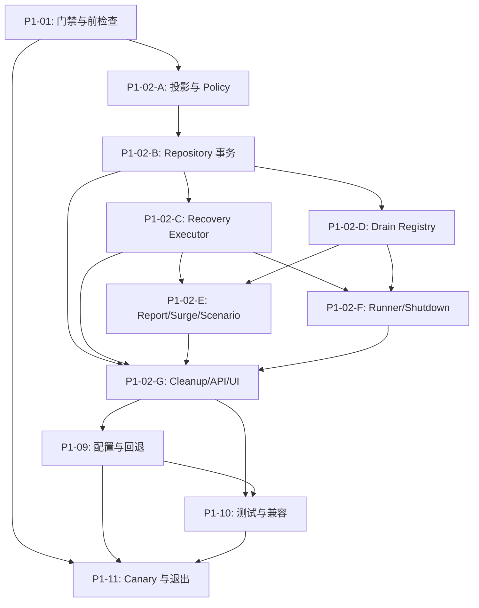

# 批次 1：Fault Run 安全停止实施任务清单

## 文档信息

| 项目 | 内容 |
| --- | --- |
| 状态 | 进行中；P1-01、P1-02-A 和 P1-02-B 已完成，下一项为 Worker-only recovery executor 子阶段；当前仅在 Docker Compose 单 Worker 范围实施和验证 |
| 版本 | 1.9 |
| 更新时间 | 2026-09-17 19:42 CST（P1-02-B 完成，P1-02-C 待启动） |
| 路线阶段 | [阶段 1：安全停止和失败传播](../../roadmap/phases/phase-1-safe-runtime.md) |
| 产品规格 | [product.md](./product.md) |
| 技术设计 | [tech.md](./tech.md) |
| 前置阶段记录 | [批次 0 任务清单](../batch-0-baseline/task-list.md) |
| 场景事实来源 | `traffic-control-plane/src/lib/fault-run-catalog.ts` |

## 任务规则

1. 开始任务时将 `- [ ]` 改为 `- [-]`；完成本任务定义的实现和验证并记录执行情况后，才改为 `- [x]`。被阻塞的任务使用 `- [!]`，并关联“问题跟踪”中的 ID。
2. 每完成、阻塞、恢复或取消一个子任务，立即同步更新对应复选框、任务组状态和进度、总体进度、更新时间，以及“执行更新记录”中的一行事实记录。不得只修改复选框而不记录证据、限制和下一步。
3. 每发现、解决或重新评估一个问题，立即在“问题跟踪”中保留问题、影响、方案和状态。问题解决后不得删除历史；方案影响产品范围、状态语义、权限、数据边界或发布方式时，先更新 [product.md](./product.md) 和 [tech.md](./tech.md)。
4. 场景、固定 target operation、参数、时长、`recoveryStrategy`、`recoveryPolicy` 和 cleanup capability 只从 Catalog 读取。本清单不复制可变场景映射，也不以固定场景数量作为完成依据。
5. 未注册 participant、未完成步骤、未知历史 JSON、超时、目标不可用和验证未配置必须保留明确状态、稳定错误码或 limitation；禁止用空对象、`drained: true`、`SUCCEEDED` 或通用 `FAILED` 补齐事实。
6. 所有控制面业务 HTTP 仍经 Gateway 的固定 internal operation。Web/API 只处理认证、CSRF、确认、幂等命令和审计；实际 drain、release、cleanup 边界和恢复由单独 Worker 执行。不得改变消费者协议或向消费者/目标服务泄露恢复上下文。
7. `FAULT_RUN_SAFE_RUNTIME_ENABLED` 默认保持 `false`。在 P1-11 的单 Worker canary、回退和阶段退出条件全部完成前，不得将新协议设为默认路径，也不得通过删库、重置 volume 或强制终态回退。
8. 当前批次只执行 Docker Compose 单 Worker 环境的实施和验证，不执行 Kubernetes 配置或运行时核验，也不将任何 Kubernetes 事实写为已验证。批次 0 的 Kubernetes runtime limitation 作为延期事实保留；真实 observation adapter 的缺口继续限制 verification 结论，必须显示为 `UNKNOWN`、`VERIFY_UNAVAILABLE` 或明确 limitation，而非阻断 Docker-only 实施。

## 总体进度

- **总体状态：** 进行中（Docker-only 范围）。P1-01 已完成：本地 Docker/Compose 静态检查有效，远端 Compose 配置有效，控制面健康、Worker 存活且带 healthcheck 的业务服务健康；远端部署提交 `a2df629` 是本地 `ecde4db` 的祖先。尚未读取远端 Run/数据库状态或发起任何状态变更，相关事实保持 `UNKNOWN`。P1-02 已获批为完整安全停止纵向切片，吸收原 P1-03 至 P1-08 的实现要求；P1-02-A/B 已完成 recovery contract、Catalog policy、runnable-only admission 查询和持久化命令事务。P1-09 至 P1-11 仍是独立的发布、验证和 Docker canary 门禁。不执行 Kubernetes 验证。
- **总体进度：** 1 / 11 个任务组（17 / 65 个子任务完成；P1-02-C 待启动）。
- **当前任务：** P1-02：完整安全停止纵向切片（P1-02-B 已完成；下一项 P1-02-C：Coordinator 拆分与 Worker recovery executor）。
- **当前问题：** P1-ISSUE-001、P1-ISSUE-005 至 P1-ISSUE-007 的范围/语义决策已记录；P1-ISSUE-002 至 P1-ISSUE-004 仍待核验或实现，均不得被视为安全停止已具备。
- **下一步：** 将同步 Coordinator recovery 收敛为持久化命令边界，并实现 Worker-only recovery executor；随后接入 drain registry、effect owner、API/UI、配置和测试子阶段；只运行静态、测试和只读 Docker 命令。

| 任务组 | 目标 | 状态 | 进度 | 前置依赖 |
| --- | --- | --- | --- | --- |
| P1-01 | 阶段门禁、范围与实施前检查 | 已完成（Docker 静态/只读基线） | 5 / 5 | Docker Compose 验证范围决策 |
| P1-02 | 完整安全停止纵向切片 | 进行中（P1-02-B 已完成；P1-02-C 待启动） | 12 / 42 | P1-01 |
| P1-03 | Repository 命令、查询与事务边界 | 已吸收为 P1-02-B | 追踪 P1-02-B（6 / 6） | P1-02-A |
| P1-04 | Coordinator 拆分与 Worker 恢复执行器 | 已吸收为 P1-02-C | 追踪 P1-02-C（0 / 5） | P1-02-B |
| P1-05 | Run-specific drain registry 与可取消 Gateway 调用 | 已吸收为 P1-02-D | 追踪 P1-02-D（0 / 6） | P1-02-B |
| P1-06 | Report、Surge 与专用 Scenario Worker 接入 | 已吸收为 P1-02-E | 追踪 P1-02-E（0 / 6） | P1-02-C、P1-02-D |
| P1-07 | Runner 受控分支、重启与进程关闭边界 | 已吸收为 P1-02-F | 追踪 P1-02-F（0 / 6） | P1-02-C、P1-02-D |
| P1-08 | Manual cleanup、non-releasing、Operator API/UI/i18n | 已吸收为 P1-02-G | 追踪 P1-02-G（0 / 7） | P1-02-B 至 P1-02-F |
| P1-09 | 配置、Docker Compose、可观测性与回退护栏 | 未开始 | 0 / 5 | P1-02 |
| P1-10 | 测试、兼容性与安全边界验证 | 未开始 | 0 / 6 | P1-02、P1-09 |
| P1-11 | Docker Compose 单 Worker canary、验收与阶段退出 | 未开始 | 0 / 7 | P1-01、P1-09、P1-10 |

## 执行依赖

---

## P1-01：阶段门禁、范围与实施前检查

**目标：** 在不启动安全停止新协议、不改变运行时行为的前提下，确认 Docker Compose 范围内的实施边界、责任环境和回退基线。

**状态：** 已完成（Docker 静态/只读基线）；**进度：** 5 / 5；**关联问题：** P1-ISSUE-001、P1-ISSUE-003、P1-ISSUE-005

- [x] 记录用户的范围决策：Phase 1 当前仅实施和验证 Docker Compose 单 Worker 环境；Kubernetes 相关核验延期，不作为进入或 Docker-only 验收门禁。关联 P1-ISSUE-001。
- [x] 确认 Docker Compose 单 Worker 环境的访问边界：本地 Docker 引擎为 `29.4.0`、`docker compose config --quiet` 通过、当前本地项目无容器；远端 Compose 配置也有效，控制面为 `healthy`、Worker 为 `running`、带 healthcheck 的业务服务为 `healthy`。远端部署提交 `a2df629` 是本地 `ecde4db` 的祖先；未读取 Run/数据库状态或发起状态变更，运行时事实仍为 `UNKNOWN`。关联 P1-ISSUE-005。
- [x] 复核产品规格、技术设计、路线阶段和仓库运行规则，锁定本批次只实现单 Run 停止、drain、恢复投影和失败传播，不引入多 Worker owner lease、自动接管或 Agent remediation；当前验证限定为 Docker Compose 单 Worker，运行时演练需另行授权。
- [x] 记录正常客户 lifecycle、数据预热、补给、retention 与目标服务消费者契约的隔离断言，并定义其在 P1-10 静态/测试验证和 P1-11 获批 Docker canary 中的可复查验证方式。
- [x] 记录新协议默认关闭、Web/Worker 版本和配置一致性、旧 `recovery_result` 兼容性及无破坏性回退的初始事实。关联 P1-ISSUE-003。

### P1-01 Docker 静态/只读基线

| 边界 | 当前事实 | Phase 1 验证方式 |
| --- | --- | --- |
| 顶层状态与历史数据 | `fault_runs` 已有七个顶层状态、`recovery_result JSON` 和 `active_run_guard`；当前 `recoveryResult` 在 TypeScript 中仍是 `unknown`。没有新 DDL 或历史 JSON 回填作为前置。 | P1-02/P1-03 的 parser、repository fixture，以及 P1-10 的 fresh/历史 MySQL 覆盖；不得从未知 JSON 推导成功。 |
| Web/API 与 Worker 边界 | stop route 直接调用 coordinator 的同步 `stop()`；coordinator 持有进程内 drain map、timer 和 recovery promise，尚无 Worker-only executor。 | P1-03/P1-04 的 route、repository 和 Worker 测试必须证明 Web 仅持久化命令并返回 `202`，不直接 release。 |
| 独立后台路径 | Worker 当前启动 Runner、数据预热、优惠券/库存补给、Report、Surge、Scenario 和 retention；进程级 shutdown 才会停止全部路径。 | P1-06/P1-07/P1-10 证明单 Run registry participant 不调用全局 `RunnerEngine.stop()`，不注册或停止预热、补给、retention 与正常 lifecycle；获批后由 P1-11 Docker canary 复核。 |
| 消费者与 Gateway 契约 | Report、Surge 和 Runner 经 Gateway 发出真实业务请求；现有 scanner 使用 active 查询，尚未具备 runnable-only admission。 | P1-05 至 P1-08 以 permit、`AbortSignal` 和 runnable 查询实现停止边界；P1-10 检查消费者和目标公开面无新增恢复字段。 |
| Docker Compose 发布基线 | Compose 定义独立 Web/Worker service，二者当前均声明 release revision `1.4.0` 和 deployment mode `compose`；`env.ts` 与 Compose 尚不存在 `FAULT_RUN_SAFE_RUNTIME_*` 配置或新的 shutdown grace 约束。本地 `HEAD` 为 `ecde4db1d93b`；远端部署 `a2df629` 是其祖先，配置有效、控制面健康、Worker 存活。 | P1-09 为 Web/Worker 同步接入严格 flag/timeout 配置和 Compose `stop_grace_period`；P1-10 只执行 Compose 配置检查。实现部署后重新核对版本配对；在任何状态性 canary 前记录 Run 快照和授权窗口。 |

## P1-02：完整安全停止纵向切片

**目标：** 在默认关闭的 Docker Compose 单 Worker 范围内交付从恢复合同、持久化命令、Worker 排空、异步 API 到脱敏 Operator UI 的完整安全停止路径，使未完成停止始终可解释而不伪造成终态成功。

**状态：** 进行中（P1-02-B 已完成；P1-02-C 待启动）；**进度：** 12 / 42；**关联问题：** P1-ISSUE-002、P1-ISSUE-003、P1-ISSUE-004、P1-ISSUE-006、P1-ISSUE-007。已确认：P1-02 前移完成 recovery projection、持久化、Worker 恢复执行、异步 stop API 和 Operator UI；safe-runtime 默认关闭且 Web/Worker 必须使用同一显式开关；HTTP `202` 只表示 command 已受理，Worker gate-closure 事件才是停止新受控工作的实际边界；没有真实 verification adapter 时必须记录 `VERIFY_UNAVAILABLE` 并保留 `RECOVERING`，不得以 release acknowledgement 写入 `STOPPED`/`RECOVERED`。

### P1-02-A：恢复投影、Catalog policy 与稳定错误模型

- [x] 在 `traffic-control-plane` 定义 `safe-runtime.v1` 恢复投影、stop reason、phase、outcome、步骤、残留和稳定错误码类型；禁止以任意 JSON 断言替代类型合同。
- [x] 实现严格 parser、serializer、字段 allowlist 和大小限制；未知版本、非法 phase、矛盾步骤、负数统计、超长错误码和原始 target 内容必须显式成为 `UNKNOWN` 或受控错误。
- [x] 使旧 `null` 或历史 `recovery_result` 保持可读并显示为未知/旧版，不回填、不静默纠正，也不据此推导已恢复。
- [x] 在 Catalog 同一场景定义内补充并校验 `recoveryPolicy`，由 resolver 读取 `recoveryStrategy`、policy、cleanup capability 和固定 operation；不得建立平行 `scenario -> recovery` 映射。
- [x] 明确并实现 `ACTIVE -> RECOVERING`、恢复 attempt、`STOPPED`/`RECOVERED`、`PARTIAL_RECOVERY` 与服务不可用的状态优先级，确保所有未完成步骤保留在 `RECOVERING`。
- [x] 为投影、policy resolver、状态转换和错误 sanitizer 编写 fixture，覆盖四种策略、report 必要 release、surge release 不适用、manual cleanup 禁止自动删除及 non-releasing 禁止 release。

### P1-02-B：Repository 命令、查询与事务边界（原 P1-03）

**目标：** 以短事务持久化停止命令和逐步恢复事实，使 Web/API 与 Worker 能通过数据库安全协作而不共享进程内状态。

**子阶段状态：** 已完成；**P1-02 进度贡献：** 6 / 6；**关联问题：** P1-ISSUE-003

- [x] 新增 `listRunnableFaultRuns()` 和 `loadRunnableFaultRun()`，严格只返回 `state = 'ACTIVE'`；保留现有 active 查询给兼容读模型和恢复管理，不再作为效果请求授权。
- [x] 实现 `requestFaultRunStop()`：在一个事务中锁定 Run、校验状态与 request key hash、写入 `RECOVERING`/初始投影和 `STOP_REQUESTED` 事件；不新增 DDL。
- [x] 实现同 key 重放、不同 key 的受控 retry、终态读取和 `CREATING` 取消标记，确保重复请求不重复写事件、不重复 release 且不会将取消后的创建推进到 `ACTIVE`。
- [x] 实现 `recordRecoveryStep()`，在独立短事务中校验投影转换、合并受限步骤摘要、写稳定 `recovery_error` 并追加对应时间线事件；外部 HTTP 不得持有 MySQL 行锁。
- [x] 实现 `completeRecovery()` 与 `completeManualCleanup()`，仅在 policy 必需步骤满足时写终态；超时、失败、人工 cleanup、残留和未配置验证必须保持可解释的 `RECOVERING`。
- [x] 使 stop/cleanup command audit 与 Run 状态和关联事件在同一事务中原子写入；详情查询按事件顺序批量装载 audits，同时保持现有单个 `audit` 字段兼容。

### P1-02-C：Coordinator 拆分与 Worker 恢复执行器（原 P1-04）

**目标：** 将长时间 drain、release 和恢复从 Web/API 请求进程移至唯一的 Worker 执行器，并使重启后的行为可恢复且不重复产生效果请求。

**子阶段状态：** 未开始；**P1-02 进度贡献：** 0 / 5；**关联问题：** P1-ISSUE-003、P1-ISSUE-004

- [ ] 将 coordinator 收敛为创建、创建期取消、停止命令持久化和 target adapter 边界；移除 Web/API 进程内 drain map、恢复 timer 和同步 release 行为。
- [ ] 新增 Worker-only `FaultRunRecoveryExecutor`，在单进程 `running` map 中串行化同一 Run，扫描持久 `RECOVERING` 请求和到期 `ACTIVE` Run；到期与手工停止复用同一执行路径。
- [ ] 按固定顺序实现加载/校验投影与 policy、关闭 gate、drain、release、manual cleanup 边界、真实可用验证和结果归并；每次外部调用前先持久化 `*_STARTED`。
- [ ] 为 target release 和固定 verification 计算剩余绝对 deadline、传递 `AbortSignal`、限制重试，并在事件和投影中只写 operation allowlist 与 sanitized 摘要。
- [ ] 实现创建期取消补偿、Worker 失败、进程重启和关键事件写入失败边界：只续做未完成恢复，不重新 prepare、发业务流量或无限重试；关键持久化失败时停止后续外部操作。

### P1-02-D：Run-specific drain registry 与可取消 Gateway 调用（原 P1-05）

**目标：** 让每个 Fault Run 在 Worker 内独立停止接收新工作、取消真实请求并以共享绝对 deadline 汇总 in-flight 结果。

**子阶段状态：** 未开始；**P1-02 进度贡献：** 0 / 6；**关联问题：** P1-ISSUE-004

- [ ] 新增 Worker 内 `FaultRunDrainRegistry`，支持单 Run 的 gate、多个 participant、permit、取消传播、in-flight 统计、snapshot 与 settled result；它不得被用作跨进程 owner lease 或 fencing。
- [ ] 实现 scanner 先获取 `ACTIVE` 快照再取得 permit 的 admission 顺序；gate 已关闭或 permit 被拒绝时，不得创建 customer session、排队业务请求或写 started 事件。
- [ ] 实现共享的 drain/recovery 绝对 deadline、多个 participant 汇总和 participant missing 的显式结果；未注册不得被表示为已排空。
- [ ] 在 deadline 到达时返回受控 `DRAIN_TIMEOUT` 摘要，保留未结束 permit/participant；其真实结束后只能追加 `DRAIN_LATE_COMPLETED`，不得改写此前 timeout 为成功。
- [ ] 为 `GatewayClient.login()`、`refresh()`、`logout()` 和 `CustomerSessionManager` 生命周期增加可选 `AbortSignal`，并将其传入实际 fetch、可取消等待和资源释放路径，不改变消费者 API。
- [ ] 覆盖 stop 与 scanner 竞态、多个 participant、cooperative/non-cooperative abort、permit `finally` 完成、迟到完成和敏感字段不进入 event/projection 的测试。

### P1-02-E：Report、Surge 与专用 Scenario Worker 接入（原 P1-06）

**目标：** 将所有产生受控效果的 Report、Traffic Surge 和 Scenario Worker 路径接入 runnable 查询、registry permit 与真实可观察 drain。

**子阶段状态：** 未开始；**P1-02 进度贡献：** 0 / 6；**关联问题：** P1-ISSUE-002

- [ ] 将 Report、Surge 与 Scenario Worker 的所有 effect scanner 切换为 runnable 查询，并在创建任何受控 work 前取得 registry permit。
- [ ] 为 `ReportScenarioWorker` 实现每 Run gate、abort controller、in-flight tracker 和可取消 interval；login、refresh、logout、Gateway 调用与等待均使用 Run signal。
- [ ] 规范 Report 停止汇总，记录 requests、successes、failures、timeouts、in-flight、stop reason 和低基数延迟摘要；不再以未注册或单次停止事件推断 drain 成功。
- [ ] 让 `TrafficSurgeExecutor` 在 permit 后启动现有 `ControlledScenarioWorker`，注册 registry participant，并在 deadline 内调用可取消 `worker.stop()`；不影响其他 surge 或正常流量。
- [ ] 将 `ScenarioWorkers` 既有 drain 接入统一 registry，保留真实 `AbortSignal`、deadline 与迟到完成事实；不得用 dummy participant 或伪造请求使未核验路径通过。
- [ ] 复核 `CART_CATALOG_DEPENDENCY` 在当前 Catalog revision 与当前事件合同下的真实 dispatch/drain 证据；证据不足时保留阻塞和补测方案，不得写为已安全排空。关联 P1-ISSUE-002。

### P1-02-F：Runner 受控分支、重启与进程关闭边界（原 P1-07）

**目标：** 只收敛绑定某个 Fault Run 的 Runner lifecycle，同时保持正常客户流量、数据预热、补给和其他独立后台任务持续运行。

**子阶段状态：** 未开始；**P1-02 进度贡献：** 0 / 6；**关联问题：** P1-ISSUE-003

- [ ] 让 `RunnerEngine` 仅在 `loadRunnableFaultRun()` 返回 `ACTIVE` Run 时绑定 fault context；`RECOVERING`、`CREATING` 或终态 Run 不得再次启动受控效果请求。
- [ ] 为 notification/PSP 的单次受控 lifecycle 注册 Run-specific participant，并将 Run signal 与现有 lifecycle signal 合并；不得调用全局 `RunnerEngine.stop()`。
- [ ] 确认被停止 Run 的 lifecycle 收敛后，后续正常 lifecycle tick 仍可独立运行，且数据预热、补给和 retention 不被注册为该 Run participant。
- [ ] 按启动顺序初始化 registry/executor，在启动 scanner 前关闭 `RECOVERING` gate、处理创建期取消和到期 Run；重启后只恢复停止路径，不重启业务流量。
- [ ] 实现 `SIGINT`/`SIGTERM` 一次性 shutdown latch：先停止 admission/scanner，再在独立 shutdown budget 内持久化 Run 事实、释放预热 lease，最后关闭 MySQL/Redis client。
- [ ] 无法完成关键恢复事实时以非零状态退出；验证同一 Run 不会并发恢复两次，且部署仍明确限制一个 Worker 副本。

### P1-02-G：Manual cleanup、non-releasing、Operator API/UI/i18n（原 P1-08）

**目标：** 让 Operator 能以安全、可审计、双语且不泄露内部细节的方式查看和完成停止后的必要人工步骤。

**子阶段状态：** 未开始；**P1-02 进度贡献：** 0 / 7；**关联问题：** P1-ISSUE-004

- [ ] 将既有 stop route 改为 Operator session、CSRF、UUID、confirmation 和 idempotency key 校验后的命令持久化入口；首次或可重试请求返回 `202`，终态读取返回 `200`，Web 不等待 Worker 或调用 target adapter。
- [ ] 确保 stop command 的成功审计仅表示命令已持久化；审计、投影和 `STOP_REQUESTED` 事件任一写入失败时整体回滚并返回稳定错误 envelope。
- [ ] 将 per-run manual cleanup 限制在 `MANUAL_CLEANUP_REQUIRED` phase，要求确认、CSRF、幂等和审计；仅在 cleanup 与必需 verification 成功后允许终态转换。
- [ ] 将 scenario-wide cleanup 限定到 Catalog 精确允许的 capability，避免把任意可 cleanup 场景错误分派到 storage operation；可选 per-run cleanup 不得阻塞不需要它的停止完成。
- [ ] 实现 non-releasing 与服务不可用的残留/责任记录，严格禁止 generic release；safe-runtime.v1 的未恢复服务保持 `RECOVERING`，不得提前解除 active-run guard。
- [ ] 扩展详情 API 和 `buildFaultRunView()`，保留原有字段并新增经 parser 校验的恢复子状态、deadline、drain、release、cleanup、verification、residual 与 next action；旧 JSON 或旧事件显示 `UNKNOWN`。
- [ ] 为 `en` 与 `zh-CN` 同步新增事件、phase、outcome、错误与 next-action 文案，并扩展 i18n parity 和 fault-run view 覆盖，禁止向 Operator/消费者输出 raw stack、session、token 或 target payload。

## P1-09：配置、Docker Compose、可观测性与回退护栏

**目标：** 让新停止协议可默认关闭、成对发布、单 Worker 灰度并可在保留恢复事实的情况下安全回退。

**状态：** 未开始；**进度：** 0 / 5；**关联问题：** P1-ISSUE-001、P1-ISSUE-003

- [ ] 在 `env.ts` 以严格解析和交叉校验接入 `FAULT_RUN_SAFE_RUNTIME_ENABLED`、stop scan、drain、recovery 和 shutdown timeout；非法值或 recovery 小于 drain、shutdown 小于 recovery 时启动失败。
- [ ] 同步 Docker Compose Web/Worker 配置和 README；保持默认关闭、Web/Worker 值一致、单 Worker 容器，并使 Compose `stop_grace_period` 大于 shutdown budget 和关闭缓冲。Kubernetes 同步与验证延期，不计入本批次完成依据。
- [ ] 为受保护日志和 Run 时间线接入低敏、低基数 phase/outcome/attempt/errorCode 摘要；不新增包含 Run ID、trace ID、路径或参数值的 public metric label。
- [ ] 编制并验证发布门禁：同版本 parser、无未完成 safe-runtime Run、Worker 可访问 MySQL/Gateway/账户/内部密钥，且手工 cleanup 与 non-releasing runbook 已按真实 target 边界评审。
- [ ] 编制无破坏性回退步骤：先停止新创建、处理或保留所有 `safe-runtime.v1` `RECOVERING` Run，再同步关闭 Web/Worker flag 和回退镜像；不得删除 `recovery_result`、事件、Fault Run 或 target 资源。

## P1-10：测试、兼容性与安全边界验证

**目标：** 通过现有测试、集成和静态验证证明新协议不会产生伪成功、破坏旧 Run 或扩大控制面/消费者边界。

**状态：** 未开始；**进度：** 0 / 6；**关联问题：** P1-ISSUE-002、P1-ISSUE-003、P1-ISSUE-004

- [ ] 完成恢复投影、parser、policy、状态转换、request idempotency、创建期取消和 repository 事务的单元/fixture 覆盖，包含历史 JSON、并发和步骤事件顺序。
- [ ] 完成 registry、permit admission、多个 participant、真实 abort、deadline timeout、迟到完成和 `ControlledScenarioWorker` 不无限等待的测试。
- [ ] 完成 stop/cleanup route 的 Operator session、CSRF、confirmation、audit、`202`/`200`/`409` 语义、错误 envelope 和 Web 不调用 release 的测试。
- [ ] 完成 Report、Surge、Scenario 与 Runner 四类路径的 runnable-only、drain、Worker failure、重启、到期、目标不可用和 normal lifecycle 隔离测试。
- [ ] 在 fresh MySQL 与保留历史 Fault Run 的既有 volume 上验证无 DDL 兼容、七天 retention 和未解决 `RECOVERING` Run 不被删除；检查消费者、Gateway 与目标服务公开面没有新增恢复字段。
- [ ] 将覆盖纳入现有 `pnpm test:runner`、`pnpm test:i18n`、`pnpm typecheck`、`pnpm lint`、`pnpm build`、`docker compose config --quiet`、`./scripts/check-runtime-terminology.sh` 和 `git diff --check`，并记录最窄且真实的结果。Kubernetes 相关命令和结论不在当前验证范围。

## P1-11：Docker Compose 单 Worker canary、验收与阶段退出

**目标：** 在获批的 Docker Compose 单 Worker 非生产环境完成真实停止边界演练、隔离核验、回退验证并给出 Docker-only 阶段结论。

**状态：** 未开始；**进度：** 0 / 7；**关联问题：** P1-ISSUE-001、P1-ISSUE-002、P1-ISSUE-003、P1-ISSUE-004

- [ ] 在执行前复核 P1-01 的 Docker Compose 门禁、单 Worker 部署、Web/Worker 同版本同配置、默认 flag 状态、当前 active/creating/recovering Run、环境 owner、停止窗口和无破坏性回退边界。
- [ ] 在 disposable 或专用环境对 Catalog 派生的 Report、Surge、Scenario 与 Runner 受控路径执行手工停止和到期停止，记录 `STOP_REQUESTED`、drain、release、verification、终态或 limitation 的受保护时间线证据。
- [ ] 分别演练 drain timeout、Gateway/target 不可用与 Worker failure，确认稳定错误码、未收敛统计、残留和下一步保留在 `RECOVERING`，不会被压缩为成功或通用 `FAILED`。
- [ ] 演练 Worker 重启与 `SIGTERM`，确认只续做未完成恢复、不重新产生业务效果、关键持久化失败非零退出，并在部署 grace period 内完成受控关闭。
- [ ] 演练 manual cleanup 和 non-releasing 边界，确认 destructive cleanup 仅在 Operator 确认后执行、non-releasing 不调用 release、服务不可用不提前解除 active-run guard。
- [ ] 核验停止单个 Run 不影响正常 customer lifecycle、数据预热、补给或 retention；检查消费者响应、Gateway 请求、目标服务日志、Operator UI 和 i18n 没有泄露内部恢复上下文、凭据或 raw stack。
- [ ] 完成 canary 回退：保留投影和事件、处理或保留未完成 Run、同步关闭 flag、验证旧兼容读取与独立业务流量；更新问题、执行记录和阶段退出决定，只有全部退出条件满足时才标记可进入批次 2。

## 问题跟踪

问题状态使用 `待核验`、`待处理`、`处理中`、`已解决` 或 `已阻塞`。发现新问题时分配下一个 `P1-ISSUE-xxx`，并在任务和执行更新记录中交叉引用。

| ID | 发现阶段/任务 | 问题 | 影响 | 可能的解决方案/下一步 | 状态 |
| --- | --- | --- | --- | --- | --- |
| P1-ISSUE-001 | P1-PLAN / P1-01 | 批次 0 的最终记录保留 Kubernetes runtime 与真实 Prometheus/Loki/Tempo observation adapter limitation；2026-09-17 用户明确 Phase 1 当前不做 Kubernetes 相关验证，只在 Docker Compose 环境实施和验证。 | Kubernetes runtime 不得被 Compose/静态证据替代或标记为已验证；真实 observation adapter 仍不能被当作 verification 成功。但两者不再阻断 Docker-only 安全停止实施和 canary。 | 将 Kubernetes runtime 验证延期，未来在独立获批 namespace、owner 和停止窗口内处理；Docker 范围内只记录真实 Docker 证据。对缺失 observation capability 使用 `UNKNOWN`、`VERIFY_UNAVAILABLE` 或明确 limitation。 | 已解决（Phase 1 范围决策；Kubernetes 验证延期） |
| P1-ISSUE-002 | P1-PLAN / P1-06 | `tech.md` 将 `CART_CATALOG_DEPENDENCY` 标为缺少真实 dispatch/drain 证据，而批次 0 最终记录包含一次 Compose 运行摘要；两份文档对当前 Catalog revision、事件合同和 drain 结论尚未形成同一可复查事实。 | 在结论统一前，不能将该路径记为已安全排空，也不能用 dummy participant、旧事件或历史 revision 替代当前运行证据。 | 对照当前 Catalog revision、Run ID、`fault_run_events` 和 Worker 汇总合同复核证据；若不满足当前合同，在获批环境执行受控运行并记录真实 drain。随后只更新事实不一致的设计/基线文档，保留历史。 | 待核验 |
| P1-ISSUE-003 | P1-PLAN / P1-01、P1-02、P1-09 | 新协议要求 Web 与 Worker 使用同一 parser 和一致 flag，且旧镜像不能在存在 `safe-runtime.v1` `RECOVERING` Run 时接管；当前尚无此发布配对的运行证据。 | 版本或配置错配可能使 Web 接受命令而 Worker 不处理，或由旧同步路径错误 release 尚未排空的 Run。 | 已确认默认安全语义：safe-runtime 默认关闭，必须由 Web/Worker 的同一显式开关共同启用；配置或版本不匹配时 Web 不得接受新 safe-runtime command。P1-02 实现运行时受控拒绝与 Compose 配置，P1-09/P1-11 核验单 Worker、镜像/revision 配对和无破坏性回退。 | 处理中（默认语义已确认，待实现与运行时配对验证） |
| P1-ISSUE-004 | P1-PLAN / P1-02、P1-04、P1-05、P1-08 | Phase 1 不新增伪造 health check，部分 target 的真实 verification 尚未配置；若将控制动作或 abort 请求误当成业务恢复，会违反终态语义。 | `STOPPED`/`RECOVERED` 可能被过早写入，Operator 无法区分验证不可用、release 失败、人工 cleanup 或残留。 | 已确认：无真实 verification adapter 时 policy 使用 `NOT_CONFIGURED`，executor 必须持久化 `VERIFY_UNAVAILABLE` 并保留 `RECOVERING`；不得将 Gateway release acknowledgement 升格为 `BEST_EFFORT` 或终态依据。具备真实固定验证能力后才可显式定义 `REQUIRED`/`BEST_EFFORT`，并以 fixture、Worker 测试和 canary 证明不产生伪成功。 | 处理中（语义已确认，待实现与验证） |
| P1-ISSUE-005 | P1-01-2 | 本地 Docker Compose 前置检查确认 Docker Server `29.4.0` 和有效配置但没有本地项目容器。用户随后提供远端 Docker Compose 环境访问与必要时的重启方式；远端配置有效，控制面健康、Worker 存活，部署提交为 `a2df629`。 | 未读取远端 Run/数据库状态，且尚未触发 Fault Run、Worker 重启或其它写操作；静态/容器状态不能替代运行时 stop/drain 事实。 | 可继续在本地实现并在远端重新部署后复核版本配对。任何状态性 Docker canary 前，先记录 active/creating/recovering Run 快照、数据卷边界和本次停止窗口；不使用重置、删卷或强制终态。 | 已解决（远端 Docker 环境与访问边界已确认；状态性 canary 待后续任务） |
| P1-ISSUE-006 | P1-02 完整纵向切片架构评审 | Web/API 与 standalone Worker 是独立进程；停止命令写入数据库后，Worker 才能在下一次扫描/恢复中关闭本地 Run admission gate。即使所有 effect owner 使用 runnable-only 查询，已读取 `ACTIVE` 的 Worker 仍可能在 Worker 观察命令前进入 setup。 | 若将 HTTP `202 Accepted` 错误宣称为“此刻起绝无新受控工作”，会形成无法由当前单 Worker、无跨进程 gate 架构证明的安全承诺。 | 已确认：`STOP_REQUESTED` 是持久命令接受时间；“禁止新 controlled work”的实际边界是 Worker 持久化 gate-closure 时间线事件。所有 owner 在每个 work permit 前检查 gate，UI 以 `202` 表示 pending 而非即时停止。 | 已解决（语义已确认，待实现与验证） |
| P1-ISSUE-007 | P1-02 完整纵向切片架构评审 | 旧 `cleanup-scenario` 路由允许多种场景却固定调用 `notification-storage` cleanup，且没有可安全关联的 per-Run durable command。 | 保持其可执行会违反 Catalog 单一事实来源、命令审计/idempotency 和 run-scoped cleanup 边界；将它关联到任意历史/活跃 Run 也不安全。 | 已确认：无 DDL 地将兼容路由改为稳定 `409 SCENARIO_CLEANUP_REQUIRES_RUN`，不执行 Gateway cleanup；Operator 只能使用经 Catalog policy、Run 状态和显式确认校验的 per-Run cleanup command。 | 已解决（路由策略已确认，待实现与验证） |

## 执行更新记录

每个任务状态变化后追加一行，保留历史，不覆盖此前事实。验证证据写环境、版本、输出摘要、Run/Event/Audit 引用或文档链接；不得写入 credential、token、原始观测载荷、原始 target response、敏感业务数据或可执行命令。

| 日期 | 阶段/任务 | 总体进度 | 任务组进度 | 执行情况与证据 | 问题/方案 | 下一步 |
| --- | --- | --- | --- | --- | --- | --- |
| 2026-09-17 16:41 CST | P1-PLAN：建立任务清单 | 0 / 11（0 / 65 子任务） | P1-01：0 / 5（1 个阻塞） | 已依据阶段 1 路线、批次 1 产品规格、技术设计和批次 0 任务台账建立任务组、依赖、验收、更新规则与初始问题登记；未修改运行时代码、配置或部署状态。 | 新增 P1-ISSUE-001：批次 0 的 Kubernetes runtime/真实 observation adapter 门禁未解除；同时登记证据一致性、发布配对和 verification 语义风险（P1-ISSUE-002 至 P1-ISSUE-004）。 | 先按 P1-ISSUE-001 补齐并记录阶段门禁；解除后开始 P1-01-1。 |
| 2026-09-17 17:05 CST | P1-01-1：Docker-only 范围决策 | 0 / 11（1 / 65 子任务） | P1-01：1 / 5（P1-01-2 进行中） | 用户明确当前不做 Kubernetes 相关验证，只在 Docker Compose 单 Worker 环境实施和验证。已同步批次 0/批次 1 当前状态、任务边界、测试命令和 canary 名称；未运行 Kubernetes 命令、部署、查询或 teardown。 | P1-ISSUE-001 更新为已解决的范围决策，Kubernetes runtime 验证延期；真实 observation adapter 继续作为 limitation，不能产生伪 verification 成功。 | 完成 P1-01-2 的无副作用 Docker Compose 前置检查；不启动或停止容器。 |
| 2026-09-17 17:05 CST | P1-01-2：Docker Compose 前置检查 | 0 / 11（1 / 65 子任务） | P1-01：1 / 5（1 个阻塞） | Docker Server 为 `29.4.0`，`docker compose config --quiet` 通过；`docker compose ps --all --format json` 未返回当前项目容器。未启动、停止、重建或进入容器，未运行 Kubernetes 命令。 | 新增 P1-ISSUE-005：当前没有运行中的 Compose 环境以及 owner/停止窗口授权，不能将静态配置检查升级为运行时验证。 | 等待确认当前工作区的 disposable Docker Compose 使用边界后恢复 P1-01-2。 |
| 2026-09-17 17:05 CST | P1-01-2：Docker 只读授权确认 | 0 / 11（2 / 65 子任务） | P1-01：2 / 5 | 用户明确只允许只读 Docker 检查，不授权启动、停止、重建或进入容器。前置检查以 Docker `29.4.0`、有效 Compose 配置和无当前项目容器结束；运行时 Run/revision/状态如实保留为 `UNKNOWN`。 | P1-ISSUE-005 更新为已解决的授权边界，运行时 canary 延期；该决定不改变 P1-ISSUE-001 至 P1-ISSUE-004 的事实状态。 | 开始 P1-01-3，复核产品、技术设计、路线与运行不变量；仅进行静态和只读检查。 |
| 2026-09-17 17:05 CST | P1-01-3：范围与不变量复核 | 0 / 11（3 / 65 子任务） | P1-01：3 / 5 | 已复核 Phase 1 路线、产品规格、技术设计和仓库运行规则。范围限定为单 Worker、单 Run 停止/排空/恢复投影；不实现 owner lease、多副本接管、自动 remediation 或消费者协议变更。 | Kubernetes 验证延期保持；未将真实 observation adapter 缺口或未授权 Docker runtime 误写为已具备能力。 | 记录独立后台路径和消费者契约的隔离断言。 |
| 2026-09-17 17:05 CST | P1-01-4：隔离断言与验证边界 | 0 / 11（4 / 65 子任务） | P1-01：4 / 5 | 根据 Worker、Runner、Report、Surge、stop route 和 schema 的当前实现，已在本清单记录独立后台路径、消费者/Gateway 契约和单 Run 停止的隔离断言，以及 P1-10/P1-11 的验证方法。 | 当前 scanner 仍会使用 active 查询、Worker shutdown 仍为全局路径，均作为后续实现缺口而不是既有保证。 | 记录 flag、版本、兼容性和无破坏性回退的初始事实。 |
| 2026-09-17 17:05 CST | P1-01-5：默认关闭与兼容性基线 | 1 / 11（5 / 65 子任务） | P1-01：5 / 5 | `env.ts` 和 Compose 尚未定义 safe-runtime flag/timeout；schema 已有 JSON 投影字段及兼容顶层状态；stop route 仍同步调用 coordinator；Compose Web/Worker 均为 `1.4.0`/`compose` 静态声明。当前源码 `HEAD=ecde4db1d93b`，运行时容器/Run/revision 均为 `UNKNOWN`。 | P1-ISSUE-003 保持待核验：须在 P1-09/P1-11 建立 Web/Worker 同版本同 flag 门禁和无破坏性回退。 | P1-01 完成，开始 P1-02 的恢复投影、Catalog policy 和稳定错误模型。 |
| 2026-09-17 17:35 CST | P1-02-1：恢复投影类型和受控错误模型启动 | 1 / 11（5 / 65 子任务） | P1-02：0 / 6（P1-02-1 进行中） | 已开始只读梳理当前 Fault Run 状态、`recovery_result` 使用点、Catalog 定义、Coordinator/Repository 事务和现有测试模式；同时按用户授权读取远端 Docker Compose 部署状态。尚未改动运行时代码或重启服务。 | P1-ISSUE-004 保持待处理：需让缺失 verification、超时和步骤失败成为受控事实，而非终态成功。 | 完成代码路径与测试模式梳理后，确定投影 parser、policy resolver 和错误 sanitizer 的最小实现边界。 |
| 2026-09-17 17:35 CST | P1-01-2 follow-up：远端 Docker 部署基线 | 1 / 11（5 / 65 子任务） | P1-01：5 / 5 | SSH 只读检查确认远端 Compose 配置有效；控制面为 `healthy`、控制面 Worker 为 `running`、带 healthcheck 的业务服务为 `healthy`。远端 `HEAD=a2df62984548`，是本地 `ecde4db1d93b` 的祖先；未重启、进入容器、读取凭据或修改远端状态。 | P1-ISSUE-005 更新为远端环境已确认。当前 active/creating/recovering Run 与数据库事实仍未读取，不以容器健康代替 stop/drain 证据。 | 在本地完成 P1-02 后重新部署并核对版本；状态性 canary 留待 P1-11 的显式执行窗口。 |
| 2026-09-17 17:35 CST | P1-02：verification 语义决策 | 1 / 11（5 / 65 子任务） | P1-02：0 / 6（P1-02-1 进行中） | 用户确认：当前没有真实独立 verification adapter 的场景，policy 必须使用 `NOT_CONFIGURED`；恢复记录 `VERIFY_UNAVAILABLE` 并保留 `RECOVERING`，不以 Gateway release acknowledgement、abort 或服务可达性推导 `STOPPED`/`RECOVERED`。 | P1-ISSUE-004 从待处理更新为处理中，方案已确定；该选择会约束 P1-02 policy、P1-04 executor 和 P1-08 Operator 展示。 | 分别评审 recovery model 与 Catalog policy 的最小实现架构，再提交实现边界确认。 |
| 2026-09-17 17:35 CST | P1-02-1：最小架构评审完成 | 1 / 11（5 / 65 子任务） | P1-02：0 / 6（P1-02-1 进行中） | 两个独立架构评审确认：新增 policy-neutral `fault-run-recovery.ts`（严格 `safe-runtime.v1` parser/serializer、8 KiB 上限、allowlist、稳定 sanitizer、保守优先级）和 Catalog-derived `fault-run-recovery-policy.ts`；全部 12 条 policy 内联入 Catalog，并纳入 revision/runbook parity。当前所有条目使用 `NOT_CONFIGURED`，但 policy 类型保留未来经真实 adapter 支撑的 `REQUIRED`/`BEST_EFFORT` 扩展空间。 | 不改变 P1-03/P1-04/P1-08 的 repository、coordinator、route、Worker 或 UI。自动停止与手工停止均允许缺少 request-key hash，防止过期停止形成无效 projection。 | 取得实现边界确认后，完成 P1-02 类型、Catalog、revision、runbook 与 fixture 测试。 |
| 2026-09-17 17:35 CST | P1-02：架构确认待调整 | 1 / 11（5 / 65 子任务） | P1-02：0 / 6（P1-02-1 进行中） | 用户未批准当前最小架构并要求先调整；未修改运行时代码、测试、配置或远端 Compose 状态。 | 已保留 `NOT_CONFIGURED -> VERIFY_UNAVAILABLE -> RECOVERING` 的既定安全语义；待确认调整的具体维度后重新提交边界。 | 收集所需架构调整，再修订方案并取得实施确认。 |
| 2026-09-17 17:35 CST | P1-02：纵向切片范围决策 | 1 / 11（5 / 65 子任务） | P1-02：0 / 6（架构重构中） | 用户确认将 repository 持久化、Worker 恢复执行、异步 stop API 和 Operator UI 前移到 P1-02，交付完整纵向切片；未修改代码、测试、配置或远端 Compose 状态。 | P1-03 至 P1-08 暂不标记完成或删除，待完整纵向切片方案明确后重新编排为已吸收工作或后续加固，避免重复实现和虚假进度。 | 对持久化/API、Worker/drain 和 UI/兼容性分别进行架构评审，提交修订后方案。 |
| 2026-09-17 17:35 CST | P1-02：完整纵向切片跨层架构评审 | 1 / 11（5 / 65 子任务） | P1-02：0 / 6（架构重构中） | 三条独立审查确认：Web 只以短事务持久化 command，单一 Compose Worker 独占 drain/release/verification；四类实际 owner 全部使用 Run gate/permit/absolute deadline；浏览器只消费 server-built、严格 parser 派生的脱敏 read model。现有直接 JSON 返回、raw error、同步 Web recovery、空 participant 成功和 runless cleanup 均不能保留在新路径。 | 新增 P1-ISSUE-006（停止线性化）和 P1-ISSUE-007（runless cleanup）；二者均需先确定产品/兼容性语义。`VERIFY_UNAVAILABLE -> RECOVERING` 已保持不变。 | 依次确认停止线性化点与旧 cleanup 路由策略，再提交修订的完整纵向切片实施方案。 |
| 2026-09-17 17:35 CST | P1-02：停止线性化语义决策 | 1 / 11（5 / 65 子任务） | P1-02：0 / 6（架构重构中） | 用户确认：HTTP `202` 仅代表持久 stop command 已受理；Worker 持久化 gate-closure 时间线事件才是禁止新受控工作的实际边界。 | P1-ISSUE-006 更新为已解决的语义决策；不新增跨进程 admission 协调，也不虚称 `202` 为即时停止。 | 确认 runless cleanup 路由策略后，提交修订后的完整纵向切片实施方案。 |
| 2026-09-17 17:35 CST | P1-02：runless cleanup 路由决策 | 1 / 11（5 / 65 子任务） | P1-02：0 / 6（架构重构中） | 用户确认：旧 `cleanup-scenario` 不再执行无 Run 绑定的 cleanup，统一返回 `409 SCENARIO_CLEANUP_REQUIRES_RUN`；不新增 durable-command DDL。 | P1-ISSUE-007 更新为已解决的路由策略；per-Run cleanup command 必须以短事务持久化后由 Worker 执行。 | 确认 safe-runtime 默认开关与发布边界后，提交完整纵向切片实施方案。 |
| 2026-09-17 17:35 CST | P1-02：safe-runtime 开关决策 | 1 / 11（5 / 65 子任务） | P1-02：0 / 6（完整纵向切片架构待确认） | 用户确认 safe-runtime 默认关闭；只有 Web 与 standalone Worker 使用同一显式开关时才启用。 | P1-ISSUE-003 更新为处理中：P1-02 需实现错配时的受控拒绝，P1-09/P1-11 仍需完成真实发布配对和回退证据。 | 提交包含 contract、持久化、Worker、API、UI、flag 和测试的修订架构，请求实施确认。 |
| 2026-09-17 17:35 CST | P1-02：完整纵向切片获批与任务重编排 | 1 / 11（5 / 65 子任务） | P1-02：0 / 42（P1-02-A 进行中） | 用户确认实施完整纵向切片。原 P1-03 至 P1-08 的 36 个实现子任务被重编排为 P1-02-B 至 P1-02-G，P1-02 合计 42 个子任务；P1-09 至 P1-11 继续作为独立发布、测试和 Docker canary 门禁。未修改运行时代码、配置或远端 Compose 状态。 | 已确定：默认关闭的配对 flag、Worker gate-closure 停止边界、`NOT_CONFIGURED -> VERIFY_UNAVAILABLE -> RECOVERING`、以及无 DDL 的 runless cleanup `409`。 | 完成 P1-02-A 恢复模型与 Catalog policy，再按重编排的纵向切片依赖推进。 |
| 2026-09-17 17:45 CST | P1-02-A：恢复投影与 Catalog policy 完成 | 1 / 11（11 / 65 子任务） | P1-02：6 / 42（P1-02-B-1 进行中） | 新增严格 `safe-runtime.v1` projection parser/serializer、稳定 error sanitizer、优先级与初始 projection 工厂；加入无 raw field 的 policy resolver。12 个 policy 原地写入 Catalog，revision canonicalizer 和 runbook 自动继承该事实；历史 JSON 仅返回 absent/legacy/unknown，不推导成功。完成 `pnpm test:runner`（87 passed）、`pnpm typecheck` 与改动文件定向 ESLint。 | P1-ISSUE-004 的 `NOT_CONFIGURED -> VERIFY_UNAVAILABLE -> RECOVERING` 合同已落地；缺少独立 verification adapter 的实际执行限制仍待 Worker/API/UI 子阶段接入。 | 实现 P1-02-B-1 runnable-only 查询，然后进入 stop/cleanup 短事务和 audit/event 原子性。 |
| 2026-09-17 19:42 CST | P1-02-B：Repository 命令、查询与事务边界完成 | 1 / 11（17 / 65 子任务） | P1-02：12 / 42（P1-02-C 待启动） | 新增严格 `ACTIVE` runnable 查询、hash-only idempotency、`requestFaultRunStop()`/per-Run manual cleanup command、逐步恢复与完成事务、safe-runtime event allowlist 和同连接 Operator audit 插入；未新增 DDL，也未改动远端 Docker Compose、数据库或 Fault Run 状态。新增 repository/event fixture，`pnpm test:runner` 为 103 passed，`pnpm typecheck` 与改动文件定向 ESLint 均通过。 | P1-ISSUE-003 的持久化协作前提已实现，但 Web/Worker flag 配对、Worker executor 和实际 Docker 验证仍未完成；P1-ISSUE-004 继续要求 executor 将所有当前 `NOT_CONFIGURED` policy 收敛为 `VERIFY_UNAVAILABLE + RECOVERING`。 | 启动 P1-02-C：将 Web 进程的同步 recovery 收敛为 durable command，并实现 Worker-only executor。 |

## Phase 1 退出标准

阶段退出时必须同时满足以下事实：

**当前验收边界：** 以下结论仅适用于 Docker Compose 单 Worker 环境，不构成 Kubernetes 配置、资源、retention、告警或运行时就绪声明。Kubernetes 验证在后续获批范围单独执行。

- 手工停止和到期停止均先原子持久化 `STOP_REQUESTED`，由单 Worker 执行真实 drain；Web/API 不直接 drain、release 或 cleanup。
- Report、Surge、Scenario 和 Runner 的受控分支只在 `ACTIVE` 执行，均具备 Run-specific gate、`AbortSignal`、in-flight 汇总和共享绝对 deadline。
- 未注册、超时、Worker 失败、target 不可用、release 失败、cleanup 失败和 verification 不可用均能以稳定事实区分；不存在“未注册但已排空”的成功形状。
- 每个 Catalog policy 都遵循其精确 release/cleanup/verification 规则：必要 release 不遗漏，non-releasing 不调用 generic release，destructive cleanup 不自动执行。
- 只有所有必需步骤和真实可用验证满足时才能写 `STOPPED`/`RECOVERED`；任何 timeout、人工 cleanup、残留、部分恢复或服务不可用都保持可解释的 `RECOVERING`。
- Worker 重启、优雅关闭和取消不重新激活 Run 或再次产生受控效果；单 Run 停止不影响正常客户 lifecycle、数据预热、补给或 retention。
- 获批 Docker Compose 单 Worker canary 已完成手工停止、到期、timeout、target 不可用、Worker 重启、`SIGTERM` 和人工 cleanup 演练，且消费者路径、日志、时间线和 UI 不泄露 raw stack、session、secret 或恢复上下文。
- P1-ISSUE-001 的 Kubernetes 验证延期已记录且不作为 Docker-only 退出门禁；P1-ISSUE-002 已形成与当前 Catalog revision/事件合同一致的结论。所有未解决问题均有明确 Docker limitation、残留、责任方和下一步后，才可给出进入批次 2 的 Docker-only 结论。
