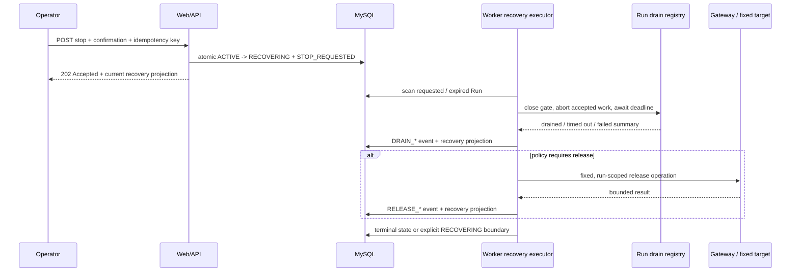
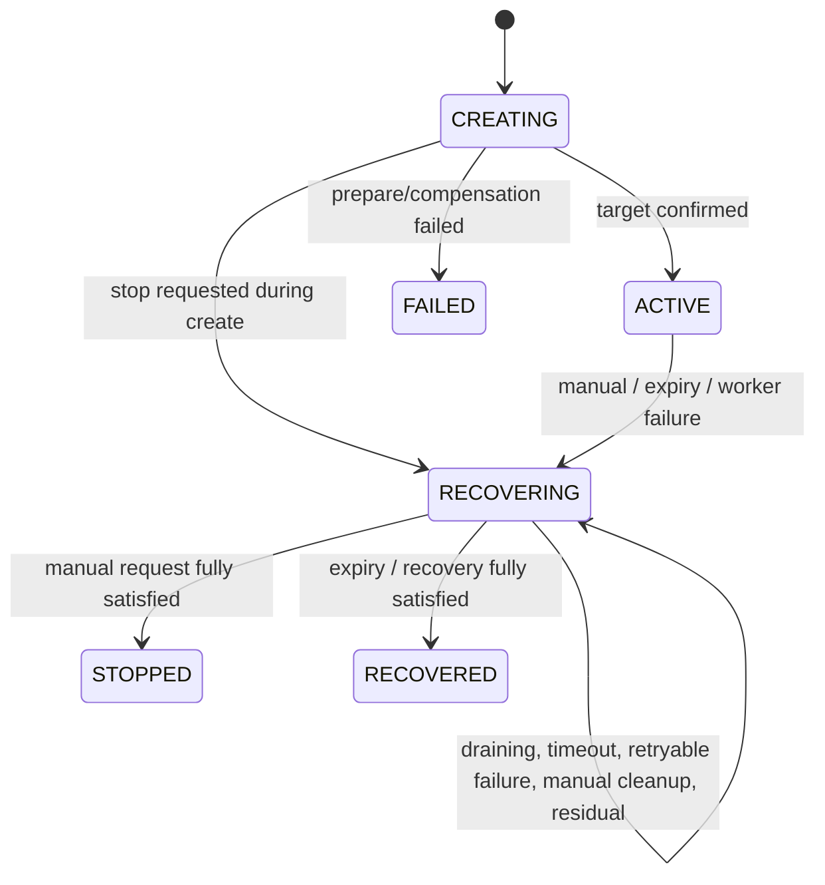

# 批次 1：Fault Run 安全停止技术设计

> 状态：技术设计 v1.11，P1-02-D 至 P1-02-G、严格 runtime parser、Docker Compose Web/Worker 静态配对、单 Worker/grace 门禁、无破坏性回退文档、已部署代码 `31bc400` 的 Docker Compose 单 Worker 只读发布门禁及 fresh/historical MySQL compatibility 验证已实施；P1-11-1 启用前复核已完成，主环境 `BROWSE_REPORT_SQL`、隔离 `BROWSE_SURGE` 手工停止、隔离 `CART_CATALOG_DEPENDENCY` dispatch/drain、到期停止、drain timeout、target unavailable、Worker failure、SIGTERM/restart、manual cleanup、non-releasing、正常后台/消费者隔离边界及 safe-runtime 回退保护已记录；历史 Operator 参数 read-model 修复已完成远端 list/detail 复验。旧路径接管未完成 `safe-runtime.v1` Run 的问题已通过 legacy recovery 保护性跳过修复，并在 Docker disposable canary 上复验；隔离 Worker 启动异常已分类为 MySQL TCP readiness race，本地 Compose 健康检查已修正但待远端部署复验；Runner 当前数据库配置为 disabled；Kubernetes 验证延期
> 配套产品规格：[product.md](./product.md)
> 对应路线阶段：[阶段 1：安全停止和失败传播](../../roadmap/phases/phase-1-safe-runtime.md)
> 前置条件：批次 0 已提供可复查的运行基线；本设计不将尚未核验的基线事实视为已完成能力
> 设计原则：Worker 执行长流程、单 Run 闭合、新旧状态兼容、真实请求取消、总时限、失败不伪装为恢复成功
> 当前验证范围（2026-09-20）：根据用户决策，本批次仅在 Docker Compose 单 Worker 环境实施和验证；不执行 Kubernetes 配置或运行时核验。文中保留的 Kubernetes 要求仅是后续部署约束，不能计作当前实施、canary 或退出证据。

## 1. 设计结论

批次 1 不在 Web/API 进程中继续执行 drain、release 或 cleanup。`POST /internal/fault-runs/{faultRunId}/stop` 只持久化一次停止请求并返回 `202 Accepted`；独立的 `traffic-control-plane` Worker 读取该请求，在同一 Worker 进程内关闭该 Run 的工作闸门、取消或等待 in-flight 请求，并按 Catalog 的 `recoveryStrategy` 执行后续步骤。

实现采用以下结论：

1. 保持 `FaultRunState` 的既有七个值不变。`STOP_REQUESTED`、`DRAINING`、`DRAIN_TIMEOUT`、`MANUAL_CLEANUP_REQUIRED` 等是 `recovery_result` 中的**恢复投影状态**和时间线事件，而不是新的顶层 `fault_runs.state`。这样可以保留现有 `active_run_guard`、历史 API 和状态筛选语义。
2. `RECOVERING` 是唯一的非终态停止边界。只要存在未完成的 drain、release、必要的人工 cleanup、验证或非释放残留，Run 就保持 `RECOVERING`；绝不能仅因停止请求已接受或 Gateway release 返回成功而转为 `RECOVERED`/`STOPPED`。
3. 所有实际停止动作都在 Worker 中执行。Web/API 仅做认证、CSRF、确认、幂等命令持久化和审计；它不依赖进程内 `Map` 来等待另一个 Worker 进程的请求。
4. 新增 Worker 内部的 `FaultRunDrainRegistry`。它在每个 Run 上同时提供“停止接收新工作”的闸门、参与者注册、`AbortSignal` 传播和以绝对 deadline 为界的 drain 汇总。没有注册 drain 不能被写成“已排空”。
5. `ReportScenarioWorker`、`TrafficSurgeExecutor`、`ScenarioWorkers` 和 `RunnerEngine` 的**受控 Run 分支**已接入该 registry。停止一个 Run 不调用 `RunnerEngine.stop()`，也不停止正常客户生命周期、数据预热、补给或 retention 任务。
6. 恢复计划只从 `fault-run-catalog.ts` 的 `recoveryStrategy`、新增的同定义 `recoveryPolicy`、`allowManualCleanup` 和固定 target operation 推导；不新增平行的 `scenario -> recovery` 映射。`WORKER` 描述工作生产者的停止边界，并不自动免除已 prepare target 的 release：两个 report 场景必须显式声明 release，两个 surge 场景则为 `NOT_APPLICABLE`。`NON_RELEASING` 禁止调用 target release，`MANUAL_CLEANUP` 将“停止 append”和“确认删除运行资源”拆为两个可见步骤。
7. 复用已有 `fault_runs.recovery_result` JSON、`recovery_error` 和 `fault_run_events`，本批次不增加 DDL。恢复投影使用版本化、受控的 JSON 结构；时间线保留逐步事实，JSON 只保存当前摘要，二者均不保存原始 Gateway response、请求体、session、token 或错误堆栈。
8. 批次 1 仍明确限制为单 Worker、副本数 `1`。内存中的 drain registry 不是 owner lease，也不是 fencing；多 Worker 竞争、持久 owner、heartbeat 和接管属于批次 2。



## 2. 范围、非目标与不变量

### 2.1 本批次范围

| 范围 | 本设计的处理方式 |
| --- | --- |
| 手工停止 | 已有 stop 路由原地改为持久化命令，恢复由 Worker 异步执行。 |
| 到期停止 | Worker 以数据库 `expires_at` 为事实来源，创建与手工停止等价的 `EXPIRED` 请求。 |
| Run-specific drain | 已在 Report、Surge、Scenario 与 Runner 四个受控执行路径中关闭新工作、传递 `AbortSignal`、跟踪 in-flight 并写入汇总。 |
| target release | 只对 `TARGET` 和 `MANUAL_CLEANUP` 策略执行已有 Gateway 固定 release operation。 |
| 人工 cleanup 边界 | 保留现有确认/CSRF 路由；对必须人工 cleanup 的 Run 显式停在 `RECOVERING`。 |
| 非释放场景 | 停止新的受控请求，记录残留和下一步，不伪造 target release。 |
| Worker 失败与重启 | 记录失败来源；重启后只恢复未完成的停止，不重新发起受控业务流量。 |
| Operator 可见性 | 复用 Run detail API、事件时间线和双语 UI，展示恢复阶段、deadline、统计、残留和下一步。 |

### 2.2 明确非目标

- 不改变消费者 API、Gateway 对消费者的路由、目标服务的业务协议或 `FaultRunContext` 字段。
- 不新增目标服务的场景语义、通用停止 endpoint、伪造 health check、固定延迟或假成功结果。
- 不承诺已发出的公开客户请求一定能被目标服务撤回；只保证 Worker 不再接受新工作、会传播取消信号，并如实记录未收敛请求。
- 不停止正常客户 Runner、数据预热、优惠券/库存补给、Fault Run retention 或其他独立后台任务。
- 不以 `OperationRunGuard`、目标侧 fencing token 或 Redis 锁代替 Worker owner lease。
- 不实现多副本、自动接管、跨进程 drain、Worker Pool、自动 remediation 或 Agent 能力。
- 不把 target release 成功、告警触发、服务进程可达或 Run 终态互相推导为“业务已经恢复”；阶段 4 才定义系统化证据查询。

### 2.3 必须持续成立的边界

1. 只有 `traffic-control-plane` 可以解释 Catalog、Fault Run、停止原因、恢复策略和恢复投影。
2. 所有 target prepare、release 和 cleanup 仍通过 Gateway 的固定 internal operation；没有控制面业务 HTTP 直连目标服务。
3. 报表和流量突增通过公开业务 API 的请求仍不附加新的内部控制 header。停止依赖 Worker 闸门、`AbortSignal` 和 in-flight drain，不依赖目标侧自动拒绝。
4. 任何未完成、未知或超时步骤必须以受控状态和稳定错误码表示；不得写入空对象、`drained: true` 或 `SUCCEEDED` 作为默认值。
5. 指标、日志和事件只记录低敏、低基数摘要。Run ID 仅可出现在控制面数据库、Operator API 和受保护日志中，不能成为 metric label 或传到消费者/目标服务。

## 3. 当前实现基线与需要修复的缺口

下表记录设计时已核对的代码事实。这些不是临时豁免；每个缺口都应有对应的实现和测试。

| 区域 | 当前事实 | Phase 1 处理 |
| --- | --- | --- |
| 顶层状态 | `FaultRunState` 只有 `CREATING`、`ACTIVE`、`RECOVERING`、`RECOVERED`、`STOPPED`、`FAILED`、`SERVICE_UNAVAILABLE`；`active_run_guard` 将前三者视为活跃。 | 不扩充顶层枚举；将细粒度停止状态放进版本化恢复投影，未完成时保留 `RECOVERING`。 |
| 停止入口 | safe-runtime path 的 stop route 通过 `requestFaultRunStop()` 写入短事务并返回 `202`；旧同步路径已移到仅在 flag 关闭时使用的 `legacy-fault-run-recovery.ts`。 | `FAULT_RUN_SAFE_RUNTIME_ENABLED=true` 时，Web 不等待 drain/release；Worker-only executor 消费持久命令。 |
| 进程边界 | `FaultRunCoordinator` 已不持有 timer、recovery promise 或 Worker drain map；兼容路径的进程内 map 隔离在 legacy service。 | registry 只在 Worker 使用；Web 只写数据库命令，Worker 读命令后调用 registry。 |
| drain registry | Worker 使用 `FaultRunDrainRegistry` 管理本进程单 Run gate、owner 对应 participant、permit、shared `AbortSignal`、聚合 metrics 和 timeout 后的 late completion。未注册预期 owner 仍返回 `DRAIN_PARTICIPANT_MISSING` 并保留 `RECOVERING`。 | 不把“未注册”表示为已排空或调用 target release；registry 不是跨进程 owner lease 或 fencing。 |
| 总时限 | safe executor 使用停止命令生成的绝对 drain/recovery deadline，并在 deadline 已过时不开始外部调用。 | 停止请求生成绝对 drain/recovery deadline；每次等待都受剩余时限约束。 |
| recovery strategy | 当前 `recover()` 无条件调用 `targetAdapter.stop()`。 | 使用集中且可测试的 Catalog policy resolver；`WORKER` 是否 release 由每个 Catalog 定义显式声明，`NON_RELEASING` 严格禁止 release。 |
| active 查询 | `listActiveFaultRuns()` 返回 `CREATING`、`ACTIVE`、`RECOVERING`，仅保留给兼容读模型和恢复管理。Report、Traffic Surge、Scenario 与 Runner scanner 改用 `listRunnableFaultRuns()` / `loadRunnableFaultRun()`，且额外拒绝已到期 Run。 | runnable 查询语义固定为 `state === 'ACTIVE'`；进程关闭只使用独立的 `listShutdownCandidateFaultRuns()` snapshot，绝不作为效果请求授权。 |
| 受控场景 Worker | `ScenarioWorkers` 以 runnable 查询加载 Run；safe-runtime 启用时在 session、started event 或请求之前注册 `SCENARIO` participant 并获得 permit。`ControlledScenarioWorker` 和 CART 的 Gateway customer-session dispatch 使用 Run signal；CART 已由隔离 Docker canary 确认 participant dispatch/drain/release 边界。 | 保留 registry deadline、未合作请求 timeout 与迟到完成事实；CART 的业务请求失败和未配置 verification 仍必须如实保留。 |
| Report Worker | 每 Run 使用 registry participant/permit、Run abort controller、in-flight tracker 和可取消 interval；login、request、logout 与 local cleanup 都传播 Run signal，停止汇总包含 `timeouts`、`inFlight` 和 stop reason。 | scanner shutdown race 必须在 admission 前拒绝，不以单次 stopped event 推断 drain 成功。 |
| Traffic Surge | 仅以 runnable 查询启动，safe-runtime 启用时注册 `SURGE` participant、获得 permit 后创建 `ControlledScenarioWorker` 并传入 Run signal。`stop()` 等待 worker request、final event、logout 和 permit completion 的完整 outer lifecycle。 | gate close 不影响其他 surge 或正常流量；deadline 未收敛时由 registry 保留 timeout/late-completion 事实。 |
| Runner Engine | 对 notification/PSP 受控分支使用 strict `loadRunnableFaultRun()`，额外拒绝已到期或非 Runner-owned Run；受控 lifecycle 注册 `RUNNER` participant、取得 permit 并传递 Run signal。gate close 只取消该 lifecycle，后续 tick 可运行无 context 的正常 lifecycle。 | 单个 Run 不调用全局 `engine.stop()`，也不注册或停止补给、预热和 retention。 |
| 重启与关闭处理 | `WorkerRuntime` 在 effect scanner 前启动 executor 的 initial recovery scan；executor 扫描持久 `RECOVERING` 与到期 `ACTIVE` Run，并以 `running` map 合并单进程同 Run 工作。关闭时 snapshot 已提交的 `CREATING` 与 `ACTIVE` Run，先写 `WORKER_SHUTDOWN` command 再扫描恢复。 | timer 仅作为 Worker 加速器；数据库状态为事实，Web 不再排期或恢复。snapshot 后才创建的 Run 不受本进程关闭 snapshot 约束，Phase 1 不以此提供跨进程 admission fence。 |
| 人工 cleanup | per-run cleanup 只允许 `RECOVERED`/`STOPPED`；scenario-wide 路由固定发送 `notification-storage`，不能作为所有允许 cleanup 场景的通用路由。 | `MANUAL_CLEANUP` 必须在显式 recovery phase 中才可执行；scenario-wide cleanup 限定 storage 场景，其他场景只走兼容的 per-run operation。 |

`CART_CATALOG_DEPENDENCY` 已由 P0-13 补齐 Scenario Worker 的受控执行 dispatch 和生命周期代码路径；隔离 Docker canary `9b18c2b7-42ae-4f11-bd86-e27692fe8d13` 已确认真实 participant 注册、停止、排空和必要 target release。该 Run 的 `16` 次业务请求全部失败，且 verification 未配置，因此最终仍为 `RECOVERING`；这只证明 dispatch/drain/release 边界，不是业务成功或 verification 成功。不得用 dummy participant、旧事件或 `TARGET_ONLY` 描述掩盖真实运行事实。

## 4. 总体架构与模块边界

### 4.1 责任划分

| 模块 | Phase 1 后的职责 | 明确不负责 |
| --- | --- | --- |
| `src/lib/fault-run-coordinator.ts` | 创建 Run、检测创建完成后的取消标记、将取消后的 target 交给 Worker 恢复并提供 target adapter。停止命令的短事务由 repository 提供。 | 不持有 Worker drain map、不定时恢复、不在 Web 请求中 release。 |
| `src/lib/fault-run-recovery.ts`（新增） | 恢复投影类型、严格 parser/serializer、步骤合同、稳定错误码和结果优先级。 | 不保存第二份场景映射、不发 HTTP。 |
| `src/lib/fault-run-recovery-policy.ts`（新增） | 从单个 Catalog definition 解析并校验 recovery policy。 | 不保存第二份场景映射、不发 HTTP。 |
| `src/lib/fault-run-repository.ts` | runnable/pending 查询、停止命令事务、恢复步骤事务、终态转换及现有事件读写。 | 不解释 Worker 内存状态，不执行业务请求。 |
| `src/worker/fault-run-drain-registry.ts`（新增） | 单进程 Run gate、参与者/permit、取消、deadline 汇总、迟到完成观察。 | 跨进程所有权、fencing、目标 release。 |
| `src/worker/fault-run-recovery-executor.ts`（新增） | Worker 启动恢复、到期扫描、执行恢复计划、串行化同一 Run 的恢复尝试。 | 业务创建、UI、正常客户 Runner 的全局关闭。 |
| `src/worker/worker-runtime.ts`（新增） | 编排启动顺序和一次性进程关闭：停止 effect admission、持久化 shutdown candidate command、收敛 recovery/独立任务、释放 warmup lease，最后关闭 MySQL/Redis。 | 跨进程 Web admission fence、多个 Worker 接管或将超时表示为成功。 |
| `report-scenario-worker.ts` | 对两个 report Run 使用 registry；真实 HTTP 接收取消信号并输出受控汇总。 | 目标 release、全局 Worker 生命周期决策。 |
| `traffic-surge-executor.ts` | 对两个 surge Run 使用 registry 和现有 `ControlledScenarioWorker`。 | 管理其他 Run、伪造 target lifecycle。 |
| `scenario-workers.ts` | 复用现有真实请求和 target summary，只通过 registry 执行/排空。 | 把未注册项当作已排空。 |
| `runner-engine.ts` | 只给 notification/PSP 的受控 lifecycle 分支接入 Run drain。 | 因单个 Fault Run 停掉正常 customer lifecycle engine。 |
| stop / cleanup route | 认证、CSRF、确认、请求格式、审计和受控命令调用。 | 等待 Worker、直接 release 或启动后台 Promise。 |
| `fault-run-view.ts`、types、i18n | 展示基础 Run 状态、恢复子状态、每一步结果和 Operator 下一步。 | 展示原始 target payload、异常 stack 或 internal credential。 |

### 4.2 依赖方向

```text
Catalog definition
      |
      v
FaultRunRecoveryPolicyResolver
      |
      +----------------------------+
      |                            |
      v                            v
FaultRunCoordinator           FaultRunRecoveryExecutor (Worker only)
      |                            |
      v                            +--> FaultRunDrainRegistry
fault-run-repository           |          |
      |                         |          +--> Report / Surge / Scenario / Runner controlled branch
      +--> fault_runs + events  |
                                 +--> GatewayFaultRunTargetAdapter
                                            |
                                            v
                                       Gateway fixed operation
```

`FaultRunRecoveryPolicyResolver` 只接收已加载的 `FaultRunScenarioDefinition`，不接收用户输入、运行时 UI metadata 或目标服务返回。Gateway 和业务服务不导入该 resolver，也不接收恢复阶段、deadline、drain 统计或 `recoveryResult`。

### 4.3 必要的共享查询

现有 `listActiveFaultRuns()` 继续仅供恢复、管理和兼容读模型使用；它不能再作为“允许发起效果”的授权判断。新增三个窄查询：

```ts
export function listRunnableFaultRuns(): Promise<FaultRunRecord[]>;
export function loadRunnableFaultRun(): Promise<FaultRunRecord | null>;
export function listShutdownCandidateFaultRuns(): Promise<FaultRunRecord[]>;
```

前两个查询严格使用 `WHERE state = 'ACTIVE'`。Report、Surge、Scenario 和 Runner 的所有 scanner 必须切换到此语义。执行器在获得 `ACTIVE` 快照后还必须向 registry 获取 permit；数据库读与本地 gate 两者都通过，才可以开始会产生真实业务/资源效果的工作。第三个查询严格返回 `CREATING` 与 `ACTIVE`，仅供 Worker shutdown 的一次性 snapshot 使用；它会将已提交、但 target prepare 尚未返回的 `CREATING` Run 转为 `RECOVERING`，防止 conditional create transition 在关闭中发布 `ACTIVE`。snapshot 后的新建 Run 是 Phase 1 local cutoff 外的有效新 Run，不代表存在跨 Web/Worker 的全局 admission fence。

## 5. 状态机、恢复投影与策略

### 5.1 顶层状态与展示子状态分离

顶层状态继续决定 active-run guard、列表筛选和既有客户端兼容性；恢复投影表达在 `RECOVERING` 内部发生的细节。

| 顶层 `state` | 恢复投影 | 含义 |
| --- | --- | --- |
| `CREATING` | 无，或 `STOP_REQUESTED` 创建期取消标记 | target prepare 尚未提交为 ACTIVE；任何 Worker 都不得执行效果请求。 |
| `ACTIVE` | `NONE` | 可被 runnable scanner 接受。 |
| `RECOVERING` | `STOP_REQUESTED`、`DRAINING`、`RELEASING`、`VERIFYING`、`MANUAL_CLEANUP_REQUIRED`、`CLEANING`、`NON_RELEASING_ACTIVE` 或 `PARTIAL_RECOVERY` | 新工作已被拒绝；Worker 只允许继续同一 Run 的恢复。 |
| `STOPPED` | `SUCCEEDED` | 手工停止所需的自动步骤和验证已完成。 |
| `RECOVERED` | `SUCCEEDED` | 到期或服务恢复后的所需步骤和验证已完成。 |
| `FAILED` | 创建/补偿的不可恢复失败，或经过明确人工决策的最终失败 | 不能作为 drain、release 或 cleanup 单步失败的笼统替代；这些失败首先保留在 `RECOVERING` 投影和事件中。 |
| `SERVICE_UNAVAILABLE` | 旧协议兼容状态 | 现有实现会让该状态离开 `active_run_guard`。safe-runtime.v1 的非释放 Run 必须保留 `RECOVERING + SERVICE_UNAVAILABLE` outcome，直到真实服务恢复确认，不能借该顶层状态提前接受下一个 Run。 |

`STOP_REQUESTED`、`DRAINING` 和 `DRAIN_TIMEOUT` 均须在 Operator 视图中显示为独立状态，即使顶层 badge 仍为 `RECOVERING`。列表筛选保持既有七个顶层状态，详情页增加恢复子状态卡片，避免破坏现有 API 和 UI 筛选。

### 5.2 `recovery_result` 的版本化逻辑结构

`FaultRunRecord.recoveryResult` 保持 `unknown`，由安全路径和 Operator read model 在读取时使用 parser 收敛为 `FaultRunRecoveryProjection | null`。数据库继续保存 JSON，TypeScript 不对未知历史 JSON 进行断言；旧 Run 或不合法 JSON 显示为 `UNKNOWN`，不会推导成功。

```ts
export type FaultRunStopReason =
  | 'MANUAL'
  | 'EXPIRED'
  | 'WORKER_FAILED'
  | 'WORKER_SHUTDOWN'
  | 'CONTROL_PLANE_RESTART'
  | 'SERVICE_UNAVAILABLE';

export type FaultRunRecoveryPhase =
  | 'NONE'
  | 'STOP_REQUESTED'
  | 'DRAINING'
  | 'RELEASING'
  | 'VERIFYING'
  | 'MANUAL_CLEANUP_REQUIRED'
  | 'CLEANING'
  | 'NON_RELEASING_ACTIVE'
  | 'PARTIAL_RECOVERY'
  | 'COMPLETED';

export type FaultRunRecoveryOutcome =
  | 'PENDING'
  | 'SUCCEEDED'
  | 'PARTIAL_RECOVERY'
  | 'DRAIN_TIMEOUT'
  | 'WORKER_FAILED'
  | 'RELEASE_FAILED'
  | 'CLEANUP_FAILED'
  | 'VERIFY_UNAVAILABLE'
  | 'VERIFY_FAILED'
  | 'MANUAL_CLEANUP_REQUIRED'
  | 'NON_RELEASING_ACTIVE'
  | 'SERVICE_UNAVAILABLE';

export interface FaultRunRecoveryProjection {
  schemaVersion: 'safe-runtime.v1';
  phase: FaultRunRecoveryPhase;
  outcome: FaultRunRecoveryOutcome;
  stop: {
    reason: FaultRunStopReason;
    requestedAt: string;
    requestKeyHash?: string;
    attempt: number;
  };
  deadlines: {
    drainAt: string;
    recoveryAt: string;
  };
  drain: FaultRunRecoveryStep;
  release: FaultRunRecoveryStep;
  cleanup: FaultRunCleanupRecoveryStep;
  verification: FaultRunRecoveryStep;
  residuals: readonly FaultRunResidual[];
  lastError?: {
    stage: 'DRAIN' | 'RELEASE' | 'CLEANUP' | 'VERIFY';
    code: string;
    retryable: boolean;
  };
}
```

`FaultRunRecoveryStep` 只含 `NOT_STARTED`、`RUNNING`、`SUCCEEDED`、`TIMED_OUT`、`FAILED`、`SKIPPED`、`NOT_APPLICABLE`、`MANUAL_REQUIRED`、`NOT_CONFIGURED` 等稳定状态、开始/完成时间、低基数统计和错误码。`FaultRunCleanupRecoveryStep` 仅在 `CLEANING` 且 cleanup 为 `RUNNING` 时额外保存请求 key hash，以实现 cleanup command 重放；不会保存原始 key。`FaultRunResidual` 只描述受控资源类别、处理责任和下一步，例如“notification heap retention requires service restart”；不保存 path、文件内容、命令、target response 或 secret。

`requestKeyHash` 为手工 `X-Idempotency-Key` 的 SHA-256，供同一停止命令重放识别。自动到期停止没有 Operator request key，因此允许该字段缺失；原始 key 只在当前 HTTP 请求中短暂使用，安全路径的 audit hash 基于其 SHA-256，不写入恢复投影、事件 payload 或日志。

### 5.3 停止与恢复转换



具体转换规则如下：

1. `ACTIVE -> RECOVERING` 与 `STOP_REQUESTED` 事件在同一个 MySQL 事务内完成。该事务创建 `safe-runtime.v1` 初始投影、绝对 deadline 和请求 key hash；成功后立即返回 `202`。
2. 相同请求重放读取并返回已有投影，不重复写入 `STOP_REQUESTED`、不重复调度 release，也不重复产生成功审计。
3. Run 已 `RECOVERING` 时，只有处于 `PARTIAL_RECOVERY`/可重试失败边界且请求 key 不同的明确确认请求才能启动下一 attempt。新的 attempt 在事件中记录原因和序号，但不会覆盖先前步骤事实。
4. Run 在 `CREATING` 时收到停止，先写入创建期取消标记并拒绝 Worker dispatch。创建路径完成 target prepare 后必须重新读取该标记：若已取消，写入 `CREATE_CANCELLED_AFTER_PREPARE`，不得把 Run 推到 `ACTIVE`，并将幂等的 run-scoped compensating release 交给 Worker executor。这样 Web/API 不在创建取消分支直接 release；若创建进程在该窗口崩溃，持久 `RECOVERING` 命令仍由 Worker 续做。
5. 任何 `DRAIN_TIMEOUT`、`RELEASE_FAILED`、`CLEANUP_FAILED`、`MANUAL_CLEANUP_REQUIRED`、`NON_RELEASING_ACTIVE` 或 safe-runtime.v1 `SERVICE_UNAVAILABLE` 都保留 `RECOVERING`。`stopped_at` 仅在最终 `STOPPED`、`RECOVERED`、`FAILED` 或旧协议 `SERVICE_UNAVAILABLE` 时按现有 repository 语义写入。
6. `WORKER_FAILED` 是停止来源和执行事实，不应被最终 release 成功抹去。投影保留 `outcome: WORKER_FAILED` 以及各恢复步骤；终态仅表达该 Run 是否已停止/恢复边界达成。
7. `TARGET_EFFECT_NOT_CONFIRMED` 不是 drain 或 release 的替代品。Phase 1 只记录已有 target acknowledgement/固定验证结果；无法真实验证时写 `NOT_CONFIGURED` 或 `UNKNOWN`，不将其转成成功。

### 5.4 从 Catalog 推导恢复计划

恢复计划是不可变的代码语义，而不是第二个场景注册表。`FaultRunScenarioDefinition` 增加同一 Catalog 项内的 `recoveryPolicy`，避免从 `recoveryStrategy` 的宽泛分类猜测已有 prepare 是否需要 release：

```ts
export type FaultRunWorkerDrainOwner =
  | 'REPORT_SCENARIO_WORKER'
  | 'TRAFFIC_SURGE_EXECUTOR'
  | 'SCENARIO_WORKERS'
  | 'RUNNER_ENGINE';

export type FaultRunWorkerDrainPolicy =
  | { requirement: 'REQUIRED'; owner: FaultRunWorkerDrainOwner }
  | { requirement: 'NOT_APPLICABLE' };

export interface FaultRunRecoveryPolicy {
  workerDrain: FaultRunWorkerDrainPolicy;
  targetRelease: 'REQUIRED' | 'FORBIDDEN' | 'NOT_APPLICABLE';
  cleanup: 'NONE' | 'OPTIONAL_PER_RUN' | 'OPERATOR_CONFIRMED';
  verification: 'REQUIRED' | 'BEST_EFFORT' | 'NOT_CONFIGURED';
}

export interface FaultRunScenarioDefinition {
  // Existing Catalog fields...
  recoveryStrategy: FaultRunRecoveryStrategy;
  recoveryPolicy: FaultRunRecoveryPolicy;
}
```

每一个 `recoveryPolicy` 与场景、固定 target 和参数一起维护在 `fault-run-catalog.ts`；resolver 不维护平行 `Record<FaultRunScenario, ...>`。它只读取该 policy、`allowManualCleanup`、固定 target operation 和 Run 的已验证参数。当前所有 Catalog entry 都显式使用 `NOT_CONFIGURED`：在具备独立且固定的真实 verification adapter 前，Worker 必须记录 `VERIFY_UNAVAILABLE` 和受控 residual，并保留顶层 `RECOVERING`。`REQUIRED` 与 `BEST_EFFORT` 仅保留为未来由真实 adapter 支撑的类型空间，不能由 Gateway acknowledgement、abort 或一般连通性填充：

批次 3 引入 Scenario Contract 时，`recoveryPolicy` 必须成为同一 Catalog `contract.lifecycle` supplement 的来源或被其吸收，不能在 Contract validator、Gateway、Worker 或文档中复制一份可独立编辑的策略表。

| Catalog 策略 | drain | target release | cleanup | 最低完成条件 |
| --- | --- | --- | --- | --- |
| `WORKER` | 必需；没有工作时明确 `NOT_STARTED`，不是未注册成功 | 由 Catalog 显式决定：`BROWSE_REPORT_SQL`/`ORDER_REPORT_SQL` 为 `REQUIRED`，两个 surge 场景为 `NOT_APPLICABLE` | `NOT_APPLICABLE` | 所有已接受工作结束或已记录超时；必要的 report target release 和 worker 汇总均持久化。 |
| `TARGET` | 有实际受控请求 owner 时必需；没有 owner 时显式 `NOT_APPLICABLE` | 必需，且只调用现有固定 run-scoped operation | 若 policy 为 `OPTIONAL_PER_RUN` 且 `allowManualCleanup` 为真，作为可选 per-run cleanup，不阻塞停止完成 | drain 边界、release acknowledgement 和可用的固定验证均成功。 |
| `MANUAL_CLEANUP` | 必需 | 必需，用于停止持续 append/target 效果 | 必须 Operator 确认，不能在自动恢复中删除资源 | release 成功后进入 `MANUAL_CLEANUP_REQUIRED`；只有确认 cleanup 和验证成功才能终态。 |
| `NON_RELEASING` | 必需；停止新的受控请求 | 严格禁止 | `NOT_APPLICABLE` | 记录残留与服务恢复责任；不能自动转为 `RECOVERED`。 |

对于已超出 drain deadline 的 `TARGET`/`MANUAL_CLEANUP` Run，executor 仍可调用幂等、run-scoped target release，以尽快降低目标影响，但投影必须保留 `DRAIN_TIMEOUT`，最终只能为 `PARTIAL_RECOVERY` 或等待迟到 drain 完成。release 绝不能覆盖未收敛事实。

## 6. Run-specific drain 协议

### 6.1 Registry 契约

`FaultRunDrainRegistry` 现已实现为 Worker-local 单例。它支持同一 Run 的多个参与者，而不是只保存最后一次注册的回调；owner 到 participant kind 的映射只复用 Catalog policy 的 `FaultRunWorkerDrainOwner`，不引入第二份 scenario 映射。实际边界如下：

```ts
export interface FaultRunWorkPermit {
  signal: AbortSignal;
  complete(): void;
}

export interface FaultRunDrainParticipant {
  kind: 'REPORT' | 'SURGE' | 'SCENARIO' | 'RUNNER';
  requestStop(): void | Promise<void>;
  settled(): Promise<void>;
}

export interface FaultRunDrainController {
  register(faultRunId: string, participant: FaultRunDrainParticipant): () => void;
  tryAcquire(faultRunId: string, participant: FaultRunDrainParticipantKind): FaultRunWorkPermit | null;
  closeGate(input: { run: FaultRunRecord; owner: FaultRunWorkerDrainOwner; deadlineAt: Date }): Promise<FaultRunDrainGateResult>;
  drain(input: { run: FaultRunRecord; owner: FaultRunWorkerDrainOwner; deadlineAt: Date; signal: AbortSignal }): Promise<FaultRunDrainResult>;
  snapshot?(input: { run: FaultRunRecord; owner: FaultRunWorkerDrainOwner }): FaultRunRecoveryMetrics;
  acknowledgeDrainTimeout?(input: { run: FaultRunRecord; owner: FaultRunWorkerDrainOwner }): void;
  forgetCompletedRun?(faultRunId: string): boolean;
}
```

这些 type 是 Worker 内部合同，不是 Web/API 或目标服务协议。实际执行必须保持以下顺序：

1. scanner 仅在 runnable `ACTIVE` 查询后注册预期 participant，再调用 `tryAcquire()`；返回 `null` 时不创建 customer session、不排队请求、不写“started”事件。scanner 的 `stop()` 与延迟查询完成发生竞态时，停止标记也必须在 participant/permit 前拒绝 admission。
2. worker 以 `finally` 调用 `permit.complete()`，保证成功、业务错误、取消和超时都减少 in-flight。
3. executor 调用 `closeGate()` 先关闭 Run gate、abort shared signal、通知所有已注册的预期 participant `requestStop()`，然后写入 `DRAIN_STARTED` 并调用 `drain()`。这样在 scanner 已读取 `ACTIVE`、但尚未启动请求的竞态中，闸门仍能拒绝新工作。
4. 每个真实 HTTP、customer session 生命周期和循环等待都接收同一或派生的 `AbortSignal`。取消请求是实际取消 `fetch` 和可取消等待，不是控制器返回的模拟成功。
5. deadline 到达后，registry 返回 `TIMED_OUT`、冻结的 `inFlightAtDeadline`、已取消数和仍未完成 participant；没有完成的 promise 保持注册。executor 只有在 `DRAIN_TIMED_OUT` 已持久化后调用 `acknowledgeDrainTimeout()`，其真实结束后 registry 才可追加一次经 event allowlist 规范化的 `DRAIN_LATE_COMPLETED`，不得提前从 registry 删除或改写此前 timeout 为成功。
6. participant 自然 settled 后，registry 释放 callback/promise closure，但保留最小事实，使随后 drain 仍能区分“已注册且已结束”与缺失 owner。只有 Run 已持久化到终态、无 permit/未 settled participant 且没有未完成 late-completion obligation 时，executor 才可通过 `forgetCompletedRun()` 回收整项 state。

`registered: false` 只能成为诊断信息，不能成为 `drained: true`。对于没有预期本地执行器的 target-only Run，policy 明确产生 `NOT_APPLICABLE`；对于应当有执行器而没有注册的情况，产生 `UNKNOWN`/`WORKER_FAILED` 并阻止成功终态。

### 6.2 总时限与步骤时限

停止命令接受时生成两个绝对 UTC 时间：

```text
drainDeadlineAt   = requestedAt + FAULT_RUN_DRAIN_TIMEOUT_MS
recoveryDeadlineAt = requestedAt + FAULT_RUN_RECOVERY_TIMEOUT_MS
```

- `drainDeadlineAt` 是所有参与者共享的上限，不能为每个 Worker 重新开始计时。
- target release、固定验证和必要的 event/repository 写入使用 `min(步骤上限, recoveryDeadlineAt - now)`；剩余时间不足时写稳定的 timeout code，不再等待。
- `AbortSignal` 不合作或底层连接不能立即结束时，Worker 必须记录不确定性并返回；不能无限 `await`，也不能谎称请求已终止。
- 每次外部调用之前先持久化 `*_STARTED` 事件和 `RUNNING` step。进程在调用中断后，单 Worker 重启可以根据该事实用同一 run context 安全地重试幂等 release；正常运行中不会每秒无界重试失败调用。

### 6.3 Worker 接入矩阵

| 执行路径 | 覆盖 Run | 接入方式 | 停止时不得影响 |
| --- | --- | --- | --- |
| `ReportScenarioWorker` | `BROWSE_REPORT_SQL`、`ORDER_REPORT_SQL` | 每个 Run 保存 gate、abort controller、in-flight 和终态 promise；向 `gateway.get`、`customerGet`、session 打开/关闭及间隔传递 signal；输出结构化 `REPORT_WORKER_STOPPED`。 | 其他 report Run、正常 customer lifecycle。 |
| `TrafficSurgeExecutor` | `BROWSE_SURGE`、`ORDER_QUERY_SURGE` | 复用 `ControlledScenarioWorker`，但只在获取 permit 后启动；注册 drain，停止调用已有可取消 `worker.stop()`。 | 其他 surge Run、普通浏览/订单流量。 |
| `ScenarioWorkers` | cache、CART dependency、promotion、inventory 四类受控 Run | 把已有 `registerRunDrain` 适配为 registry participant；保留 `ControlledScenarioWorker` 的真实 AbortSignal 请求，补齐 deadline/迟到完成摘要。 | 不相关的 target 或 Worker。 |
| `RunnerEngine` 受控分支 | `NOTIFICATION_HEAP_PRESSURE`、`NOTIFICATION_STORAGE_APPEND`、`PSP_PROVIDER_OUTCOME` | 仅当 `loadRunnableFaultRun()` 返回该 Run 时，注册当前 lifecycle 的 participant；将 Run signal 合并到现有 lifecycle signal。下一次 tick 继续正常运行，但不再绑定被停止 Run。 | `RunnerEngine` 全局 stop、普通客户生命周期、补给、预热。 |
| `CART_CATALOG_DEPENDENCY` | 代码 dispatch 已存在，真实运行 dispatch/drain 尚未确认 | 由 `SCENARIO_WORKERS` policy owner 注册真实 participant；若实际 participant 缺失，记录 `DRAIN_PARTICIPANT_MISSING` 或受控未知状态，而不是 dummy 成功。 | 不通过 dummy 请求制造“已排空”证据。 |

Report Worker 已使用可取消 interval；`REPORT_WORKER_STOPPED` 汇总 requests、successes、failures、timeouts、inFlight、stop reason 和低基数延迟摘要。Traffic Surge 与 Scenario Worker 的 `ControlledScenarioWorker` 已从 registry permit 接收 Run signal；Surge 的 outer lifecycle 会等待 final event、logout 与 permit completion，deadline 未收敛时由 registry 保留未结束 participant 并记录 timeout/late completion。

`GatewayClient.login()`、`refresh()` 与 `logout()` 均以追加的可选参数接收 `AbortSignal`，并传播到实际 `fetch`、customer proactive refresh 和 `401 -> refresh -> retry` 链路。`CustomerSessionManager` 的 open/refresh/close 同样接收该 signal；close 在尝试 abortable logout 前先清除本地 credential，避免 refresh/close 竞态重新写回 token。这不改变消费者请求、认证字段或 Gateway 路由。无法合作的 session 调用在 deadline 时仍须保留 `DRAIN_TIMEOUT`，不能把已发出 abort 视为已完成；Runner 的受控 lifecycle 已传入该 signal。

### 6.4 Worker 启动、进程关闭与重启

`WorkerRuntime` 的启动顺序如下：

1. 读取 lifecycle accounts 和 Runner 配置，随后在 effect scanner 前启动 `FaultRunRecoveryExecutor`。
2. executor 的 initial scan 处理持久 `RECOVERING` Run 并将到期 `ACTIVE` Run 写为 `EXPIRED` stop command；对 `RECOVERING` Run 先关闭 Worker-local gate，再开始任何 release/verification。没有 stop command 的 `CREATING` Run 不是 effect scanner 的候选；创建期取消由 coordinator 的 `CREATING -> RECOVERING` 条件转换处理。
3. 启动 Report、Surge、Scenario scanner 和 Runner，再启动 coupon/inventory replenishment 与 data warmup。后面三类独立任务不自动注册为某个 Fault Run participant。

`SIGINT`/`SIGTERM` 在 `runtime.start()` 前就绑定到同一个 shutdown latch。关闭顺序是：停止 effect scanner/admission 与其 in-flight lifecycle；snapshot 当时已提交的 `CREATING` 和 `ACTIVE` Run，逐个持久化 `WORKER_SHUTDOWN` command；执行一次 recovery scan 并停止 executor；停止补给、释放 warmup lease、等待 retention，最后关闭 MySQL 和 Redis client。若 `CREATING` Run 在 snapshot 后完成 target prepare，conditional create transition 只能观察到已转入 `RECOVERING` 的 Run，不能将它重新发布为 `ACTIVE`。snapshot 后新建的 Run 没有进入本次关闭集合；这是一项明确的单进程 cutoff，不是跨 Web/Worker 的全局 admission 保证。

每个关闭步骤共享独立的 `FAULT_RUN_SHUTDOWN_TIMEOUT_MS` budget；超时或关键 effect/recovery/warmup 失败会使 Worker 以非零状态退出，不能继续无条件 `process.exit(0)`，也不得把进程退出当作 Run 已恢复。Data warmup 在 lease acquisition、owner/progress 写入和每轮配置刷新前检查 stop 状态；停止发生在配置加载期间时不得取得 lease。lease release 失败以 `DATA_WARMUP_LEASE_RELEASE_FAILED` 传播，因此 MySQL/Redis 不会在 warmup release 之前关闭。Docker Compose 的 worker `stop_grace_period` 仍须在 P1-09 设为大于 `FAULT_RUN_SHUTDOWN_TIMEOUT_MS` 加上 MySQL/Redis 关闭缓冲。Kubernetes 的 `terminationGracePeriodSeconds` 保留为后续部署约束，当前不执行核验，也不作为 Docker-only 验收依据；这些配置只约束**进程关闭**，不改变单个 Fault Run 停止时正常 Runner、预热或补给的隔离边界。

Phase 1 使用进程内 `running` map 避免单 Worker 内对同一 Run 并发执行两次恢复。该 map 在崩溃后会丢失，正因如此 Kubernetes/Compose 必须保持 Worker 副本数为 `1`，且本阶段不声称跨 Worker 排他性；批次 2 用持久 owner lease 取代这一限制。

## 7. 命令、事件、API 与 Operator 视图

### 7.1 停止命令

保留现有路径和请求要求：

```text
POST /internal/fault-runs/{faultRunId}/stop
X-Idempotency-Key: <valid key>
{ "confirmed": true }
```

路由保持 Operator session、CSRF、UUID、confirmation 和 idempotency key 校验。行为改为：

| 情况 | HTTP | 行为 |
| --- | --- | --- |
| `ACTIVE` 或可取消的 `CREATING` Run | `202` | 原子写入/复用 `STOP_REQUESTED`，返回当前 Run 与恢复投影。 |
| 已 `RECOVERING` 且为同一请求 | `200` | 返回已有投影，不重复外部调用。 |
| 已 `RECOVERING` 且可重试失败、Operator 用新 key 再次确认 | `202` | 开始下一次有编号的恢复 attempt。 |
| 已终态 | `200` | 返回现有最终记录，不重复 release/cleanup。 |
| Run 不存在 | `404` | 不写事件。 |
| 当前状态不允许停止或不能安全重新尝试 | `409` | 返回稳定错误码和当前恢复摘要。 |

路由成功只表示命令已持久化；它不能记录“恢复成功”的审计结果。`FAULT_RUN_STOP` 审计在命令事务完成后标记为成功，恢复的每个结果由 `fault_run_events` 和恢复投影记录。审计持久化失败必须返回可辨识的错误并在日志中保留相关性，不能吞掉错误后返回成功形状的 stop response。

### 7.2 Worker 恢复流程

对同一 Run 的执行顺序固定为：

1. 加载 Run、恢复投影、Catalog definition 和 policy；状态或投影不一致时写 `RECOVERY_STATE_INVALID` 并保留 `RECOVERING`。
2. registry 在关闭 gate 后，executor 写入 `DRAIN_STARTED`，取消/等待实际 in-flight 工作，写入 `DRAIN_COMPLETED`、`DRAIN_TIMED_OUT` 或 `DRAIN_FAILED`。预期 owner 没有注册 participant 或 permit 时写 `DRAIN_PARTICIPANT_MISSING` 并停止后续外部调用；这不是已排空的成功形状。
3. 依据 policy 写入 `RELEASE_STARTED` 并调用固定 Gateway release；仅当 policy 是 `FORBIDDEN` 或 `NOT_APPLICABLE` 时写 `NON_RELEASING_RECORDED` 或 `RELEASE_SKIPPED`。`WORKER` 本身不是跳过 release 的理由，report 场景的已 prepare target 仍须 release。若 Gateway 已返回而 `RELEASE_COMPLETED` 持久化失败，同一 Worker 进程只保留该次 settlement 并重试结果持久化，不重复调用 target；进程重启后才可使用同一 Run/fencing/idempotency context 续做未完成的固定 release。
4. 对 `MANUAL_CLEANUP` 写入 `MANUAL_CLEANUP_REQUIRED`，不调用 destructive cleanup；对可选 cleanup 只标识可用性，不自动执行。per-run cleanup route 仅原子受理 command；Worker 在 `CLEANING` phase 通过固定 Gateway cleanup operation 执行实际清理。若 target cleanup 已成功但 completion 持久化暂时失败，同一 Worker 进程只重试持久化结果、不重复 target 调用；进程在这两步之间崩溃后，新 Worker 可能再发起一次 run-scoped cleanup。这是依赖 target 的 run-scoped 幂等删除语义的 at-least-once 调用，不是跨进程 exactly-once 保证。
5. 先写 `VERIFY_STARTED`，再执行仅有真实依据的固定验证，写 `VERIFY_COMPLETED`、`VERIFY_UNAVAILABLE` 或 `VERIFY_FAILED`。没有验证能力不是成功。
6. 依据全部步骤和策略生成 outcome，写 `RECOVERY_COMPLETED`、`RECOVERY_PARTIAL` 或 `RECOVERY_BLOCKED`，并在允许时转换为 `STOPPED`/`RECOVERED`。

`FaultRunTargetAdapter.stop()` 必须接收 deadline 派生的 `AbortSignal`。任何 target response 先经每 operation 的摘要 sanitizer 再写入事件/投影；不能继续把 `asRecord(result)` 的完整返回值扩散到 `recovery_result`。

### 7.3 事件合同

现有 `fault_run_events` 是按 `(created_at, id)` 排序的权威时间线。Phase 1 增加或规范以下事件，payload 均采用版本化、低敏字段：

| 事件 | 最小 payload | 说明 |
| --- | --- | --- |
| `STOP_REQUESTED` | `reason`、`attempt`、`drainDeadlineAt`、`recoveryDeadlineAt` | 命令已接受，不代表 worker 已停止。 |
| `DRAIN_STARTED` | `participants`、`inFlightAtStart`、`deadlineAt` | gate 已关闭后写入。 |
| `DRAIN_COMPLETED` | `participants`、`accepted`、`completed`、`aborted`、`inFlightAtFinish` | 只在 finish 为零且所有预期参与者有明确结论时使用。 |
| `DRAIN_TIMED_OUT` | `participants`、`inFlightAtDeadline`、`deadlineAt` | 必须保留未完成者的类别，不含 URL/请求内容。 |
| `DRAIN_LATE_COMPLETED` | `participant`、`completedAt` | 仅补充事实，不能回写此前 timeout 为成功。 |
| `CREATE_CANCELLED_AFTER_PREPARE` | 无 | 创建路径已看到持久取消标记；后续 compensating release 只由 Worker executor 执行。 |
| `RELEASE_STARTED` / `RELEASE_COMPLETED` / `RELEASE_FAILED` | `operation`、`attempt`、`errorCode?` | operation 是控制面固定值，结果只保存白名单摘要。 |
| `RELEASE_SKIPPED` / `CLEANUP_SKIPPED` | `operation?`、`attempt` | 只表达 Catalog policy 不适用，不以空成功替代缺失 participant。 |
| `MANUAL_CLEANUP_REQUIRED` | `operation`、`responsibility`、`completionCheckIds` | 明确指出必须由 Operator 确认，而非自动删除。 |
| `MANUAL_CLEANUP_REQUESTED` | `attempt`、`cleanupAttempt`、`operatorAuditId` | cleanup command 已原子受理，不代表 Worker 已完成实际清理。 |
| `MANUAL_CLEANUP_COMPLETED` / `MANUAL_CLEANUP_FAILED` | `operation`、`attempt`、`errorCode?` | 只记录 Worker 已持久化的 cleanup 事实；失败保持 `RECOVERING`。 |
| `NON_RELEASING_RECORDED` | `residualKind`、`responsibility` | 记录保留效果，不调用 release。 |
| `VERIFY_STARTED` / `VERIFY_COMPLETED` / `VERIFY_UNAVAILABLE` / `VERIFY_FAILED` | `checkId`、`status`、`errorCode?` | 区分控制动作和可观察的恢复事实。 |
| `RECOVERY_PARTIAL` / `RECOVERY_BLOCKED` / `RECOVERY_COMPLETED` | `outcome`、`attempt`、`nextAction` | 展示下一步，不能覆盖先前事件。 |

旧事件 `RECOVERY_STARTED`、`RECOVERY_COMPLETED`、`RECOVERY_FAILED` 保持可读。UI event summarizer 同时识别新旧格式；老记录缺少投影时显示未知/旧版，而不是推测已完成。

### 7.4 人工 cleanup 与非释放场景

`NOTIFICATION_STORAGE_APPEND` 的自动路径只负责停止 append 和 release。随后 Run 保持 `RECOVERING + MANUAL_CLEANUP_REQUIRED`，per-run cleanup route 才可在明确 confirmation、CSRF、idempotency 和 audit 下原子受理 command，转为 `RECOVERING + CLEANING` 和 `cleanup: RUNNING`；Worker 才执行实际的固定 cleanup operation。cleanup 成功后：

1. 写入 `MANUAL_CLEANUP_REQUESTED`、`MANUAL_CLEANUP_COMPLETED` 和必要的 `VERIFY_*`；
2. 合并恢复投影中的 cleanup/verification step；
3. 仅在所有必需条件满足时，将原手工停止转换为 `STOPPED`、到期停止转换为 `RECOVERED`。

`CATALOG_REDIS_LARGE_VALUE` 的 per-run cleanup 仍是可选的受控资源清理，不可被 scenario-wide storage cleanup 路由替代。为消除旧路由把任意场景硬编码分派到 `notification-storage` 的风险，`cleanup-scenario` 已固定拒绝为 `409 SCENARIO_CLEANUP_REQUIRES_RUN`，不读取 active Run、不调用 Gateway，也不执行 cleanup。Operator 只能使用按 Catalog policy、具体 Run 状态、confirmation、CSRF、idempotency 和 audit 校验的 per-run command。

`NOTIFICATION_HEAP_PRESSURE` 使用 `NON_RELEASING`：停止只阻止后续受控生命周期，记录 heap retention 的残留和服务恢复责任。它不会调用 generic release，也不会仅因 Worker 停止而进入 `RECOVERED`。safe-runtime.v1 中，实际服务不可用也写为 `RECOVERING + SERVICE_UNAVAILABLE` outcome，避免现有顶层 `SERVICE_UNAVAILABLE` 离开 `active_run_guard` 后允许另一 Run 并发开始。notification restart route/UI 只接受关联同一 Run 的严格 `RECOVERING + SERVICE_UNAVAILABLE + SERVICE_RECOVERY_REQUIRED` 投影，并只保存 broker 的 closed restart summary。当前 Catalog 没有真实 verification adapter，因此 broker 健康不能使 safe Run 终态化或解除 active-run guard；它保持 `RECOVERING` 和明确 residual。旧记录继续沿用现有 `SERVICE_UNAVAILABLE -> RECOVERED` 兼容路径。

### 7.5 Operator API 与 UI

不新增消费者接口。现有 `GET /internal/fault-runs/{faultRunId}` 向后兼容地从 `{ run, events, audit }` 扩展为 `{ run, events, audit, audits }`：`audit` 保留旧标量关联，`audits` 按事件顺序返回关联的操作审计。所有 Fault Run API response 都经 server-built Operator read model 输出：`run.recovery` 是 strict parser 验证后的 `SAFE_RUNTIME_V1`、`LEGACY`、`UNKNOWN` 或 `ABSENT` 视图；不向浏览器暴露 raw `recoveryResult`、`recoveryError`、idempotency key、fencing token、trace ID 或 target payload。详情视图新增：

- 顶层状态下方的恢复子状态和停止原因；
- drain deadline、参与者、已取消数、in-flight 起止/截止统计；
- release、cleanup、verification 的单独状态，而不是一条笼统的“恢复失败”；
- `MANUAL_CLEANUP_REQUIRED`、`NON_RELEASING_ACTIVE`、`PARTIAL_RECOVERY` 的受控下一步说明；
- 对旧事件或解析失败投影的 `UNKNOWN` 提示。

`FaultRun`、`FaultRunDetails`、`FaultRunDrain` 和 `buildFaultRunView()` 必须改用 parser 输出，不能用任意 JSON 的 truthiness 决定“已排空”。新增 event 名称、阶段、错误码和下一步文案同时写入 `en`、`zh-CN` locale，并扩展现有 i18n parity/fault-run-view 测试。

## 8. 持久化、兼容性、迁移与 retention

### 8.1 不新增 DDL 的原因

现有 `fault_runs` 已有以下满足本批次需要的持久字段：

```text
state
stopped_at
stop_reason
recovery_result JSON
recovery_error
```

`fault_run_events` 已按 `(fault_run_id, created_at, id)` 维护追加式时间线。Phase 1 因而将版本化恢复投影存入 `recovery_result`，避免为了展示中间阶段而扩张 `FaultRunState` 或对已部署 MySQL volume 做危险的 `ALTER TABLE`。

这不是以无结构 JSON 代替合同：`fault-run-recovery.ts` 必须提供严格 parser、serializer、大小上限和字段 allowlist；repository 只接受该类型写入。未知历史 JSON 保持可读但显示 `UNKNOWN`，不被回填或静默纠正。

### 8.2 Repository 事务

新增的 repository 操作应保持以下原子边界：

| 操作 | 单个事务中完成 |
| --- | --- |
| `requestFaultRunStop()` | 锁定 Run、验证状态/请求 hash、更新 `state`/`stop_reason`/初始 `recovery_result`、追加 `STOP_REQUESTED`。 |
| `recordRecoveryStep()` | 锁定 Run、校验投影版本和 phase 转换、合并一个步骤摘要、更新 `recovery_result`/稳定 `recovery_error`、追加对应事件。 |
| `completeRecovery()` | 锁定 Run、校验所有策略必需步骤、写最终投影、追加最终事件、在允许时转换为 `STOPPED`/`RECOVERED`。 |
| `completeManualCleanup()` | 锁定 `CLEANING` Run、确认已受理 cleanup command、写 cleanup 结果和投影；verification 与最终状态转换仍通过各自的短事务完成。 |

对外 HTTP 不得持有 MySQL 事务或行锁。executor 必须先持久化 `*_STARTED`，提交事务，执行有界 Gateway 调用，再开启新事务写入结果。这样不会把外部网络等待变成数据库锁，也能在进程重启时区分“尚未开始”和“调用中断”。

### 8.3 兼容和 retention

- 老版本代码把 `recovery_result` 作为不透明 JSON 读取；新结构是向后兼容的。恢复到老镜像前必须先处理所有 `safe-runtime.v1` 的 `RECOVERING` Run，不能让旧 coordinator 同步 release 一个尚未排空的 Run。
- 现有 retention 只删除已终态、`recovery_result` 非空且停止超过七天的记录。未解决的 `RECOVERING` Run 不会被自动删除，这正是所需的安全边界。
- `fault_run_events` 仍随 Fault Run 删除；本批次不把恢复摘要变为长期 Evidence archive，也不改变批次 0 的 baseline retention。
- 当前历史 volume 的只读复核确认 `fault_runs` 与 `fault_run_events` 均为 InnoDB 且包含实现所需列；本次只读 retention 查询发现 `26` 条已终态候选，未执行删除。随后在隔离 fresh volume 上确认同一 schema 初始化成功，并通过生产 `deleteExpiredFaultRuns()` 验证旧格式 JSON 的过期终态及其 event 被删除，旧 `RECOVERING`、`recovery_result=NULL` 的过期终态和近期终态均保留；临时资源已清理。该验证不覆盖真实 stop/drain/release/verification。
- 启用前复核发现两条历史 `CATALOG_REDIS_LARGE_VALUE` Run 的旧参数包含 `memberSizeBytes=256`，低于当前 Catalog 的 `1024` 下限；已部署代码 `1c574e6` 的 Operator read model 对列表中的每个 Run 重新执行严格参数校验，因此未过滤列表会返回 `INVALID_PARAMETER:memberSizeBytes`。不得修改历史 Run 或把旧值重新解释为当前 Catalog 合法值；`50f9727` 已包含 allowlist/类型安全的历史参数保留、`parameterStatus=LEGACY|UNKNOWN` 和稳定 `parameterIssue`，并通过远端 authenticated list/detail 只读复验：列表 HTTP 200 返回 27 个 Run，4 个历史 `CATALOG_REDIS_LARGE_VALUE` 中 2 个为 `LEGACY`、2 个为 `VALIDATED`，旧 detail HTTP 200 显示 `LEGACY`，且不暴露 raw recovery、request key hash 或 fencing token。
- 无破坏性回退复核发现：safe-runtime 关闭后，旧版本 `LegacyFaultRunRecovery` 会把带 `safe-runtime.v1` 投影的 `RECOVERING` Run 当作 legacy Run 处理；由于 Worker-local drain participant 不在 legacy registry 中，Run 会被写入 `RECOVERY_FAILED/WORKER_DRAIN_INCOMPLETE` 并转为 `FAILED`。这不是恢复成功，也不是允许的回退语义。修复要求 legacy `stop()` 和 `scheduleActiveRuns()` 在发现 `safe-runtime.v1` 未完成投影时只读保留 Run，不调用 target release、不写终态；本地新增回归测试并使 `pnpm test:runner` 达到 197 passed，待 Docker Compose 重新部署后复验。

### 8.4 审计关联

`fault_runs.operator_audit_id` 当前只能保存一个 audit pointer，stop 会覆盖创建 audit，cleanup 也没有稳定关联。Phase 1 不将该标量作为完整操作时间线：停止命令事务必须写入 `STOP_REQUESTED` 事件的 `operatorAuditId`、action 和 result 摘要，per-run cleanup 也使用同样的事件关联；创建 audit pointer 保持向后兼容。

为使 stop command 与 audit 结论不分离，repository 的命令事务应复用 `operator_audit_logs` 插入逻辑，在同一连接中先写入 hash-only audit，再写 Run 状态/投影和事件。详情 API 可以按 event 顺序批量加载关联 audit，保留既有 `audit` 字段并增量增加 `audits`，无需在本批次新增 audit link table。若任何 audit、命令或事件写入失败，整个事务回滚，路由不能返回 `202`。

## 9. 错误、重试与失败传播

### 9.1 稳定错误分类

错误码须表达失败发生位置，而非泄露原始服务错误：

| 类别 | 示例 code | 顶层/投影处理 |
| --- | --- | --- |
| 命令状态 | `STOP_REQUEST_CONFLICT`、`STOP_REQUEST_DUPLICATE`、`CREATE_CANCEL_PENDING` | 路由返回 409 或已有投影，不触发额外 release。 |
| drain | `DRAIN_PARTICIPANT_MISSING`、`DRAIN_TIMEOUT`、`DRAIN_ABORT_FAILED` | 保持 `RECOVERING`，写明参与者和是否仍有 in-flight。 |
| Worker | `REPORT_WORKER_FAILED`、`SURGE_SETUP_FAILED`、`RUNNER_LIFECYCLE_FAILED` | 写 `WORKER_FAILED` 来源，触发一次受控恢复请求。 |
| target release | `TARGET_RELEASE_TIMEOUT`、`TARGET_RELEASE_UNAVAILABLE`、`TARGET_RELEASE_REJECTED` | `RELEASE_FAILED` 或 `SERVICE_UNAVAILABLE`；不压缩为通用 `FAILED`。 |
| cleanup | `MANUAL_CLEANUP_REQUIRED`、`CLEANUP_OPERATION_FAILED` | 自动路径不得删除；保留 Operator 下一步。 |
| verification | `VERIFY_UNAVAILABLE`、`VERIFY_FAILED` | 不将控制动作成功解释为业务恢复。 |
| repository/event | `RECOVERY_STATE_INVALID`、`RECOVERY_EVENT_WRITE_FAILED` | 停止进一步外部操作并保留 `RECOVERING`；不得遗漏关键时间线。 |

`recovery_error` 只写上述稳定 code 或受限的阶段摘要。原始 `Error.message` 可进入受保护的 Pino 错误日志，但不能进入 Operator API、Run event payload、i18n 文案或业务响应。

### 9.2 重试规则

1. 同一进程内由 executor 的 `running` map 合并同 Run 的恢复调用。
2. 进程重启时，`STOP_REQUESTED`、`DRAINING`、`RELEASING`、`VERIFYING` 等未完成步骤可按持久化 phase 恢复，并保留最初的 `MANUAL`/`EXPIRED`/Worker 失败原因；不得将手工停止重写为到期停止。外部 release 只能使用已存在的 run ID、expiry、idempotency 和 fencing context。
3. 单次步骤失败后写入 `PARTIAL_RECOVERY`/`RECOVERY_BLOCKED`，不会由每秒扫描器无限调用 Gateway。Operator 在修复依赖后用新的确认 key 触发下一 attempt。
4. 任何 attempt 都使用固定绝对 deadline；重试不复写旧步骤结果、旧错误或原始响应。
5. Phase 1 不把“重启后能够续做”描述为 owner takeover。若同时运行两个 Worker，该保证不成立，因此部署副本数必须保持为一。

## 10. 配置、可观测性、发布与回退

### 10.1 新配置

| 配置 | 默认值 | 约束与用途 |
| --- | --- | --- |
| `FAULT_RUN_SAFE_RUNTIME_ENABLED` | `false` | 严格解析布尔值；控制新的命令/Worker 恢复协议。Worker 必须先具备兼容能力，Web 才能接受新协议请求；稳定部署时两者保持同值。 |
| `FAULT_RUN_STOP_SCAN_INTERVAL_MS` | `1000` | 严格解析整数，范围 `250..10000`；只加速 Worker 对持久停止命令和到期 Run 的扫描，不能成为唯一事实来源。 |
| `FAULT_RUN_DRAIN_TIMEOUT_MS` | `30000` | 严格解析整数，范围 `1000..120000`；一个 Run 的共享绝对 drain 上限。 |
| `FAULT_RUN_RECOVERY_TIMEOUT_MS` | `60000` | 严格解析整数，范围 `5000..300000`，且不得小于 drain timeout；覆盖 release、验证和关键持久化等待。 |
| `FAULT_RUN_SHUTDOWN_TIMEOUT_MS` | `90000` | 严格解析整数，范围 `5000..600000`，且不得小于 recovery timeout；只用于 `SIGINT`/`SIGTERM` 的 Worker 进程关闭预算。 |
| `FAULT_RUN_WORKER_STOP_GRACE_PERIOD` | `105s`（Compose） | 严格解析 `ms`、`s` 或 `m` 单位的正整数；Worker 仅在 Compose 注入该值时校验其严格大于 shutdown timeout，确保 Docker 优雅关闭期限覆盖进程预算与关闭缓冲。 |

新配置不能复用宽松的“非法值静默取默认值”逻辑。`parseFaultRunRuntimeConfig()` 在启动时拒绝非法或相互矛盾的值；定向 fixture 覆盖默认值、非法布尔/整数、timeout 顺序和 grace period。Compose 用同一个 `x-fault-run-runtime-env` 锚点向 Web/Worker 注入同一组 flag/timeout/grace 值，且 Worker `stop_grace_period` 使用完全相同的 duration 变量，保持单 Worker 容器。Kubernetes Web/worker deployment 的同步和核验均延期，不能被列为本批次完成或发布证据。

### 10.2 可观测性

本批次以受保护的 Run 时间线和结构化日志为主要事实源，不增加一个会暴露高基数 Run ID 的新公共 metrics surface。

- 每次持久化 recovery step 后，Pino 写入只含 `phase`、`outcome`、`attempt` 和可选稳定 `errorCode` 的低敏摘要；异常关联日志可在受保护日志中使用 opaque Run ID，但不记录参数、认证 header、target body、session 或原始 error。
- `fault_run_events` 是 Operator 详情页的可复查记录；所有关键 phase 转换必须先成功持久化才可继续下一外部操作。
- UI 显示绝对 deadline、已观察的 in-flight 数和未解决残留，而不是“保证停止”。
- 任何新 metric 如后续加入，label 只能使用有限的 `worker`、`phase`、`outcome`、`strategy` 和错误分类，禁止 run ID、trace ID、请求路径、参数值和原始错误。
- 2026-09-20 主 Compose 只读复核确认 Web/Worker 的 safe-runtime 环境配对且均为 `false`；补给最近完成且无失败计数，Data Warmup 已达到配置目标并持续更新，但数据库 `runner_profile.enabled=0`，因此部署后的 Runner status 为 `running=false`，不能把部署前 lifecycle 记录解释为当前 Runner 持续运行。此前 `BROWSE_SURGE` Run 的 `RECOVERING` 已在旧路径接管后变为 `FAILED/RECOVERY_FAILED/WORKER_DRAIN_INCOMPLETE`，不能把 active guard 消失解释为恢复成功。隔离 `p1-canary-12/13` 的正常 traffic/lifecycle、补给、消费者响应、目标服务日志和 Operator UI/i18n 边界未发现恢复上下文泄露；其 warmup 为 disabled，只能证明 stop 未制造 warmup failure。
- 两套隔离 canary Worker 最终状态均为 running、exit 0、RestartCount 0，但启动日志分别出现 `5`/`1` 次稳定码 `WORKER_STARTUP_FAILED`。时间线显示 `mysqladmin ping -h localhost` 在 MySQL 仅有本地 socket、网络 TCP `3306` 尚未 ready 时提前通过：canary-12 的 Worker 失败重试窗口为 `11:41:47.430Z` 至 `11:42:08.518Z`，MySQL 于 `11:42:08.665Z` 报告 TCP ready，下一次 Worker 启动后加载 DB 配置；canary-13 同样在 MySQL `11:48:10.664Z` 报告 TCP ready 前后完成第二次启动并于 `11:48:10.740Z` 加载配置。后续 Redis `ECONNREFUSED`/`EAI_AGAIN` 出现在 Worker 已成功启动之后，不作为本次 startup failure 根因。根因已归类为 disposable Compose MySQL healthcheck readiness race；`docker-compose.yml` 已在本地改为 `127.0.0.1:3306` TCP `SELECT 1`，待远端部署后重新创建 canary 复验。
- 旧版本回退边界已发现实际失败：safe-runtime 关闭后 `LegacyFaultRunRecovery` 曾读取带 `safe-runtime.v1` 投影的 `RECOVERING` Run，并在没有 legacy drain participant 时写入 `RECOVERY_FAILED/WORKER_DRAIN_INCOMPLETE`、转为 `FAILED`。本地修复使 legacy `stop()` 和 `scheduleActiveRuns()` 对该投影只读保留；在重新部署并验证前，不能宣称无破坏性回退已通过。
- 2026-09-20 在远端 `31bc400` 的 Docker Compose 单 Worker 环境复验回退保护：隔离 `p1-canary-13` 既有 `NOTIFICATION_HEAP_PRESSURE` Run `cfee5f78-62cf-4efb-84ca-e126baa19a64` 在启动关闭 flag 的新镜像 Worker 前后均为 `RECOVERING`，事件数保持 `8`，末尾保持 `RECOVERY_BLOCKED`，未新增 `RECOVERY_FAILED` 或 `WORKER_DRAIN_INCOMPLETE`。临时检查容器已清理，原 canary Worker 已恢复，Run/event/database volume 未删除或重置；这只证明旧路径不会接管新投影，不提供 verification adapter 或主环境 Runner 持续运行能力。
- 首个 Docker canary 已证明在 `verification: NOT_CONFIGURED` 时，`RELEASE_COMPLETED` 之后仍会写 `VERIFY_UNAVAILABLE`/`RECOVERY_BLOCKED` 并保留顶层 `RECOVERING`；这是安全语义，不是可通过 health、abort 或 release acknowledgement 绕过的失败。单 active Run guard 因此继续占用，后续状态性 canary 必须使用隔离 control-plane/数据库环境，或等待真实 verification adapter。
- 隔离 `p1-canary-1` 的 `BROWSE_SURGE` Run `9171b561-c090-4f6e-88b0-55a4f4062f5c` 进一步证明：`DRAIN_COMPLETED` 后，Surge policy 会记录 `RELEASE_SKIPPED` 和 `CLEANUP_SKIPPED`，随后仍因 `VERIFY_UNAVAILABLE` 写入 `RECOVERY_BLOCKED`，最终保持 `RECOVERING + PARTIAL_RECOVERY`；`targetRelease=NOT_APPLICABLE` 不能被误报为 release failure，也不能解除 unresolved guard。
- 隔离 `p1-canary-3` 的 CART Run `9b18c2b7-42ae-4f11-bd86-e27692fe8d13` 在 `SCENARIO_WORKER_STARTED` 后停止，持久化 `SCENARIO_WORKER_STOPPED`、`SCENARIO_WORKER_DRAINED`、`DRAIN_COMPLETED`、`RELEASE_COMPLETED` 和 `VERIFY_UNAVAILABLE`；14 条 event 的 Worker summary 为 `16 requests/0 successes/16 failures/0 timeouts/0 in-flight`。这证明 registry participant 和真实 abort/drain 事实可见，但不把 target 业务失败折叠为安全排空成功。
- 隔离 `p1-canary-5` 的 1 秒 `BROWSE_SURGE` Run `ebc1b898-048b-47b8-92a2-3942843b1487` 未发送手工 stop，Worker 自动写入 `STOP_REQUESTED(reason=EXPIRED)`，并复用 `DRAIN_COMPLETED`、`RELEASE_SKIPPED`、`CLEANUP_SKIPPED`、`VERIFY_UNAVAILABLE`、`RECOVERY_BLOCKED` 路径；到期停止同样不产生伪终态。
- 隔离 `p1-canary-8` 的 `BROWSE_SURGE` Run `00b57588-db90-4b7b-b0fd-1ac0704db293` 在 participant 注册后暂停 Worker，手工 stop 持久化后再恢复 Worker；短 budget 下记录 `DRAIN_TIMED_OUT`，`participants=1`、`accepted=1`、`completed=0`、`aborted=1`、`inFlightAtFinish=0`，最终保留 `RECOVERING` 并继续进入 `VERIFY_UNAVAILABLE`。这证明 timeout 不是通用 `FAILED` 或成功形状。
- 隔离 `p1-canary-9` 的 CART Run `eef7dd1e-91f7-4965-ac3e-9de035a017c3` 将 Worker 的共享 Gateway 网络与独立 MySQL control 网络分离；断开共享网络后 drain 仍完成，但固定 target release 持久化 `RELEASE_FAILED(errorCode=TARGET_RELEASE_TIMEOUT)`，随后 `RECOVERY_BLOCKED` 保留 `SERVICE_RECOVERY_REQUIRED/WAIT_FOR_SERVICE_RECOVERY` residual。恢复网络后未重试或改写已记录的失败事实，主环境不受影响。
- 隔离 `p1-canary-10` 的 `BROWSE_SURGE` Run `989b613b-9ae5-4426-be11-31647835fa1a` 在 participant 注册后强制终止 Worker；Run 保持 `ACTIVE`，随后 stop 命令持久化为 `RECOVERING`，重启 Worker 后因进程内 participant 不可恢复而记录 `DRAIN_FAILED(DRAIN_PARTICIPANT_MISSING)`/`RECOVERY_BLOCKED`，没有重新启动 Scenario Worker。Worker failure 的不确定性保留为 `DRAIN_UNCERTAIN/INVESTIGATE_DRAIN`。
- 隔离 `p1-canary-11` 的 CART Run `37610181-445d-4768-9747-cc67870659b2` 在 participant 注册后向 Worker 发送 `SIGTERM`；Worker 以退出码 `0` 在 Compose grace 内完成 `WORKER_SHUTDOWN`，持久化 `SCENARIO_WORKER_STOPPED`、`SCENARIO_WORKER_DRAINED`、`DRAIN_COMPLETED`、`RELEASE_COMPLETED`、`CLEANUP_SKIPPED`、`VERIFY_UNAVAILABLE` 和 `RECOVERY_BLOCKED`，最终保留 `RECOVERING + PARTIAL_RECOVERY`。重启 Worker 后事件不增加，`SCENARIO_WORKER_STARTED` 计数仍为 `1`，证明 shutdown/restart 不会重新执行受控业务效果；`WORKER_SHUTDOWN` 只表示持久化 stop command，不表示恢复成功。
- 隔离 `p1-canary-12` 的 `NOTIFICATION_STORAGE_APPEND` Run `ead6bc66-264b-4724-825a-fc6d07b634cd` 在自动恢复中先停在 `MANUAL_CLEANUP_REQUIRED`；Operator 确认前没有 `MANUAL_CLEANUP_REQUESTED`，per-run cleanup 命令返回 `202` 后才记录 `MANUAL_CLEANUP_REQUESTED`/`MANUAL_CLEANUP_COMPLETED`，cleanup 成功后仍因 verification 未配置保持 `RECOVERING + VERIFY_UNAVAILABLE`。这证明 destructive cleanup 不是 stop/release 的隐式副作用。
- 隔离 `p1-canary-13` 的 `NOTIFICATION_HEAP_PRESSURE` Run `cfee5f78-62cf-4efb-84ca-e126baa19a64` 在 `DRAIN_COMPLETED` 后只记录 `NON_RELEASING_RECORDED` 和 `RECOVERY_BLOCKED`，projection 为 `NON_RELEASING_ACTIVE`、release 为 `NOT_APPLICABLE`，事件中不存在任何 `RELEASE_*`；residual 为 `NON_RELEASING_EFFECT/SERVICE_OWNER/WAIT_FOR_SERVICE_RECOVERY`，active guard 保持。

### 10.3 灰度顺序

```text
typed projection + unit fixtures
  -> repository command/event tests
  -> drain registry + four worker paths
  -> UI/i18n and manual-cleanup integration
  -> deploy code with flag=false
  -> validate paired Web/Worker image, config, singleton Worker and grace budget
  -> confirm no active legacy Fault Run and Worker dependencies
  -> resolve or explicitly isolate historical Operator read-model compatibility failures
  -> deploy and revalidate historical Operator list/detail compatibility
  -> verify legacy recovery ignores unfinished safe-runtime.v1 projections before rollback
  -> enable Web/API and Worker flag=true together in one non-production environment
  -> manual stop, expiry, timeout and restart exercises
  -> single-environment canary
  -> default enable only after exit conditions pass
```

启用前必须确认：

- Web/API 与 Worker 镜像均包含同一 `safe-runtime.v1` parser 和配置值；
- MySQL 健康检查必须验证 `127.0.0.1:3306` TCP 上的只读查询，而不能只使用可能在网络端口 ready 前成功的 `mysqladmin ping -h localhost` socket 检查；当前 Compose 修正待远端部署复验；
- 在已部署当前代码且配置所需 Secret 的目标 Compose 环境运行 `./scripts/check-safe-runtime-compose.sh`，确认同镜像、同 flag/timeout、单 Worker service、非空 worker 账号/内部密钥和 grace budget；本次目标主机缺少 Node，改以 `docker compose config` 等价解析和 Worker 容器内只读依赖检查完成相同门禁，工具链限制记录为 P1-ISSUE-011；
- 没有仍依赖旧同步 `stop()` 路径的 active/creating Run；
- Worker 已启动并可读取 MySQL、Gateway、生命周期账户和现有内部密钥；
- Worker Deployment/Compose 中只有一个受控 Worker；
- 人工 cleanup 和 non-releasing 的 runbook 已按真实 target 行为核验。

当前隔离 canary 工作区使用独立 MySQL named volume、唯一 Web/Worker 容器和临时 Web 端口，并仅通过 external Docker network 连接现有 Gateway、Redis 与 notification broker；隔离库的 `runner_profile` 在 Worker 启动前显式关闭，`DATA_WARMUP_ENABLED=false`，以避免隔离控制面向共享业务流量产生无关 lifecycle 或 warmup 写入。该工作区只能证明各路径的真实 dispatch/drain/recovery 事实，不能解除主环境 unresolved `RECOVERING` Run 的 guard，也不能替代真实 verification adapter。

### 10.4 回退

优先回退到“暂停 Operator 创建新的 safe-runtime Run”，而不是删除数据、重置 MySQL 或强行把 `RECOVERING` 改为终态。当前没有独立的跨进程创建总闸门，因此这是受控操作边界，不能被表述为单个 flag 自动强制：

1. 先停止接受新 Fault Run，枚举并处理所有 `safe-runtime.v1` 的 `RECOVERING` Run。
2. 对每个 Run 确认 drain、release、manual cleanup 或非释放残留的真实边界；未完成者保留 `RECOVERING` 和时间线。
3. 在没有未完成新协议 Run 后，将 Web 和 Worker 的开关一起关闭并回退镜像；旧版本 legacy recovery 必须在发现 `safe-runtime.v1` 投影时只读跳过，不能调用 legacy drain/release 或写入 `FAILED`。
4. 保留 `recovery_result` JSON 和事件；旧代码必须安全忽略未知字段，且必须通过 Docker disposable Run 复验该跳过边界。
5. 不通过删除 `fault_runs`、重置 MySQL volume、删除 target 资源或关闭审计来“修复”失败。

## 11. 测试设计

### 11.1 单元与 fixture 测试

1. 恢复投影 parser 拒绝未知版本、非法 phase、负数计数、超长错误码、原始 target payload 和互相矛盾的步骤；历史 `null`/旧 JSON 返回 `UNKNOWN`。
2. policy resolver 覆盖四种 `recoveryStrategy`，验证 report 的 `WORKER` policy 仍执行必要 target release、surge 的 `WORKER` policy 不适用 release、`NON_RELEASING` 永不调用 release，`MANUAL_CLEANUP` 永不自动 cleanup。
3. `requestFaultRunStop()` 的首次、同 key 重放、不同 key retry、终态请求、`CREATING` 取消和并发请求均保持原子事件顺序。
4. registry 验证“先读 ACTIVE、后停止请求”的竞态不会允许新 permit；多个 participant 都需有结论。
5. cooperative request 在 abort 后 drain；故意不响应 abort 的 request 在 deadline 返回 `DRAIN_TIMEOUT`，保留 participant，随后只追加 `DRAIN_LATE_COMPLETED`。
6. `ControlledScenarioWorker` 保持现有并发、统计和真实 AbortSignal 行为，并增加 deadline 期间不无限等待的测试。
7. Report Worker 的 login、refresh、logout、Gateway 请求和一秒间隔均可取消；最终 `REPORT_WORKER_STOPPED` 含 requests、successes、failures、timeouts、inFlight、stop reason 和延迟摘要。

### 11.2 Worker、repository 与路由测试

1. stop route 在持久化命令后返回 `202`，在 Web 进程不调用 target adapter；已终态返回 `200`。
2. Worker executor 从 `STOP_REQUESTED` 按 `DRAIN_* -> RELEASE_* -> VERIFY_*` 顺序处理；关键 event 写入失败时不继续下一外部步骤。
3. 到期路径与手工路径共享同一恢复执行器，只在 reason 和最终 `STOPPED`/`RECOVERED` 上不同。
4. `listRunnableFaultRuns()`/`loadRunnableFaultRun()` 不返回 `CREATING` 或 `RECOVERING`；Report、Surge、Scenario 和 Runner 的 scanner fixture 均不得在这两个状态创建效果请求。
5. `ScenarioWorkers` 的现有 drain 与新的 registry 兼容；Traffic Surge 注册并等待 `ControlledScenarioWorker`；Runner 停止受控 lifecycle 后下一次正常 lifecycle 仍可执行。
6. Worker setup/dispatch 失败写 `WORKER_FAILED` 并启动恢复，而不是每秒重新启动同一错误 worker。
7. Worker 进程重启对 `RECOVERING` Run 只恢复 stop/release，不重新执行 prepare、业务流量或创建 target；同 Run target release 的幂等 context 和原始停止原因保持不变。
8. `MANUAL_CLEANUP_REQUIRED` 时 cleanup route 必须要求 CSRF、confirmation 和 idempotency；成功后才允许终态。cache per-run cleanup 与 storage scenario-wide cleanup 的 operation 不能串线。
9. `NON_RELEASING` route/executor 不调用 target release，safe-runtime.v1 的服务不可用结果仍保留 `RECOVERING`/active-run guard，只有现有服务恢复信号才可使其终态。
10. `SIGINT`/`SIGTERM` 同时到达时只执行一次有界 shutdown；无法写入关键恢复事实时进程以非零状态退出，Docker Compose grace period 足以覆盖默认预算。Kubernetes grace period 是后续部署验证项，不在当前范围内。

### 11.3 UI、集成与环境验证

1. `fault-run-view.test.ts` 覆盖旧事件、`safe-runtime.v1` 全成功、drain timeout、release failure、manual cleanup、non-releasing、未知 JSON 和多个步骤失败。
2. `en`/`zh-CN` locale 均覆盖新增 event、phase、outcome、错误和 Operator next-action key。
3. 已使用 fresh MySQL 与含历史 Run 的已有 volume 验证 JSON/NULL 兼容、七天 retention 和未解决 `RECOVERING` Run 不被删除；真实 stop/drain/release/verification 仍待 Docker canary。
4. 在 disposable 单 Worker 环境中分别演练 Report、Surge、Scenario 和 Runner 受控分支的手工停止、到期停止、drain timeout、Gateway 不可用、Worker 重启和 `SIGTERM`。
5. 验证停止一个 Run 不会停止正常 lifecycle、数据预热、库存/优惠券补给；检查消费者响应、Gateway 请求和目标服务日志没有新增控制面恢复字段。
6. 将新增测试纳入现有 `pnpm test:runner`，并执行控制面 `typecheck`、`lint`、`build`、`test:i18n`、Docker Compose 配置检查、术语检查及 `git diff --check`。Kubernetes 相关验证不在当前范围内。

## 12. 实施顺序与任务拆分

| 顺序 | 交付 | 依赖 | 完成标准 |
| --- | --- | --- | --- |
| 1 | 恢复投影类型、parser、policy resolver、fixture 测试 | 无 | 四种策略和旧 JSON 均有明确、无伪成功的输出。 |
| 2 | repository runnable 查询、停止命令事务、步骤/终态事务 | 1 | `STOP_REQUESTED` 与状态转换原子；没有 DDL。 |
| 3 | coordinator 拆分和 Worker recovery executor | 1、2 | Web 不执行 drain/release；Worker 是唯一恢复执行者。 |
| 4 | drain registry 与 `ControlledScenarioWorker` deadline 支持 | 1、2 | permit 竞态、多个 participant、abort 和 timeout 受测。 |
| 5 | Report、Surge、Scenario Worker 接入 | 3、4 | 三类路径只执行 `ACTIVE` Run，均有可见 drain 结果。 |
| 6 | Runner 受控分支和 worker shutdown/restart 边界 | 3、4 | 单 Run 停止不终止正常 Runner；重启不重新激活 stopped Run。 |
| 7 | manual cleanup、non-releasing policy、UI/i18n | 2、3、5、6 | Operator 能区分自动完成、人工 cleanup、残留和部分恢复。 |
| 8 | 配置、Docker Compose、README、环境演练 | 1～7 | Docker Compose 单 Worker opt-in canary 和回退步骤已实际核验；Kubernetes 验证延期。 |

`CART_CATALOG_DEPENDENCY` 的真实 dispatch/drain 证据已在当前 Catalog revision 下完成并与事件合同一致；其业务请求失败和 verification 未配置仍是运行时 limitation，不得改写为成功。批次 2 可以消费本批次已稳定的 `RECOVERING`/drain 投影，但不能直接复用 registry 作为 owner lease。

## 13. 验收与退出条件

批次 1 只有同时满足以下条件才可进入批次 2：

1. 手工停止和到期停止均先持久化 `STOP_REQUESTED`，由单 Worker 执行真实 drain；Web/API 不再直接 release。
2. Report、Surge、Scenario 和 Runner 的受控分支只在 `ACTIVE` 执行，并且都有 Run-specific gate、AbortSignal、in-flight 汇总和绝对 deadline。
3. 未注册、超时、Worker 失败、target 不可用、release 失败、cleanup 失败和验证不可用均可区分；没有 `registered: false` 但 `drained: true` 的成功形状。
4. `WORKER`、`TARGET`、`MANUAL_CLEANUP`、`NON_RELEASING` 分别遵循 Catalog policy；已 prepare 的 report target 不会因 `WORKER` 标签而遗漏 release，非释放场景绝不走 generic release，destructive cleanup 绝不自动运行。
5. `RECOVERED`/`STOPPED` 只在策略所需步骤和真实验证完成后写入。safe-runtime.v1 的超时、人工 cleanup、残留、部分恢复或服务不可用始终保留可解释的 `RECOVERING` 边界，不能通过现有 `SERVICE_UNAVAILABLE` 提前解除 active-run guard。
6. Worker 重启、优雅关闭和取消不会把 `RECOVERING` Run 重新变成 `ACTIVE` 或再次发起效果请求；单 Run 停止不影响独立后台生命周期。
7. 单 Worker canary 已完成手工停止、到期、timeout、target 不可用、Worker 重启和人工 cleanup 演练，且 Operator 时间线、错误 envelope、日志和 UI 没有泄露 raw stack、session、secret 或控制面上下文到消费者路径。
8. `CART_CATALOG_DEPENDENCY` 的真实 dispatch/drain 已在当前 Catalog revision 的 Docker Compose 单 Worker canary 中明确记录；业务失败和未配置 verification 仍必须保留为运行时 limitation，不得作为“已安全排空”或“已恢复”的虚假通过项。

满足这些退出条件后，批次 2 才能在已可靠的单 Run 停止边界上增加 owner lease、heartbeat、fencing 和重协调，而不是把多 Worker 接管建立在不确定的 in-flight 请求之上。
