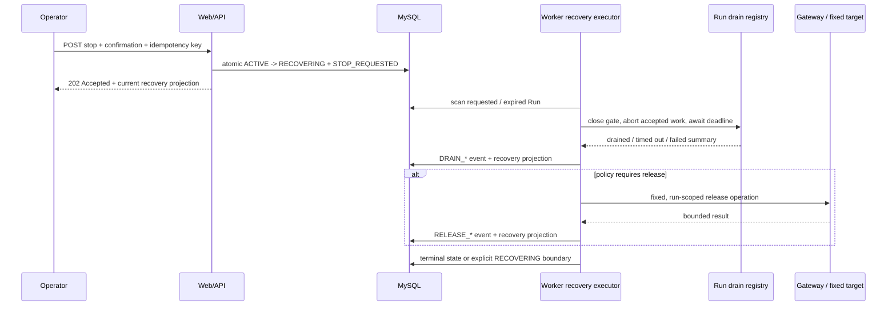
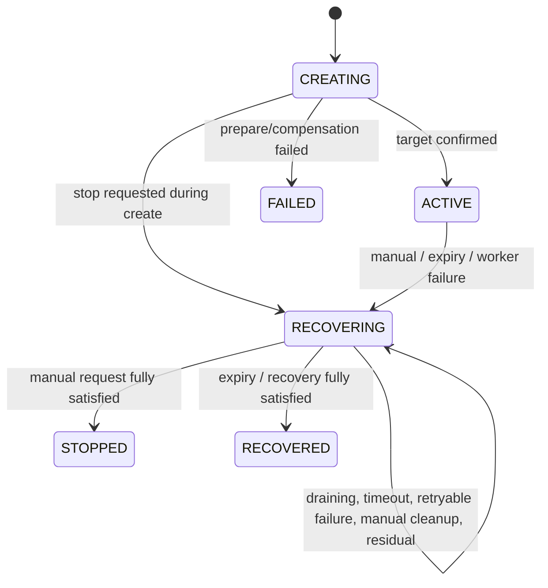

# 批次 1：Fault Run 安全停止技术设计

> 状态：技术设计 v1，待实施评审
> 配套产品规格：[product.md](./product.md)
> 对应路线阶段：[阶段 1：安全停止和失败传播](../../roadmap/phases/phase-1-safe-runtime.md)
> 前置条件：批次 0 已提供可复查的运行基线；本设计不将尚未核验的基线事实视为已完成能力
> 设计原则：Worker 执行长流程、单 Run 闭合、新旧状态兼容、真实请求取消、总时限、失败不伪装为恢复成功

## 1. 设计结论

批次 1 不在 Web/API 进程中继续执行 drain、release 或 cleanup。`POST /internal/fault-runs/{faultRunId}/stop` 只持久化一次停止请求并返回 `202 Accepted`；独立的 `traffic-control-plane` Worker 读取该请求，在同一 Worker 进程内关闭该 Run 的工作闸门、取消或等待 in-flight 请求，并按 Catalog 的 `recoveryStrategy` 执行后续步骤。

实现采用以下结论：

1. 保持 `FaultRunState` 的既有七个值不变。`STOP_REQUESTED`、`DRAINING`、`DRAIN_TIMEOUT`、`MANUAL_CLEANUP_REQUIRED` 等是 `recovery_result` 中的**恢复投影状态**和时间线事件，而不是新的顶层 `fault_runs.state`。这样可以保留现有 `active_run_guard`、历史 API 和状态筛选语义。
2. `RECOVERING` 是唯一的非终态停止边界。只要存在未完成的 drain、release、必要的人工 cleanup、验证或非释放残留，Run 就保持 `RECOVERING`；绝不能仅因停止请求已接受或 Gateway release 返回成功而转为 `RECOVERED`/`STOPPED`。
3. 所有实际停止动作都在 Worker 中执行。Web/API 仅做认证、CSRF、确认、幂等命令持久化和审计；它不依赖进程内 `Map` 来等待另一个 Worker 进程的请求。
4. 新增 Worker 内部的 `FaultRunDrainRegistry`。它在每个 Run 上同时提供“停止接收新工作”的闸门、参与者注册、`AbortSignal` 传播和以绝对 deadline 为界的 drain 汇总。没有注册 drain 不能被写成“已排空”。
5. `ReportScenarioWorker`、`TrafficSurgeExecutor`、`ScenarioWorkers` 和 `RunnerEngine` 的**受控 Run 分支**都接入该 registry。停止一个 Run 不调用 `RunnerEngine.stop()`，也不停止正常客户生命周期、数据预热、补给或 retention 任务。
6. 恢复计划只从 `fault-run-catalog.ts` 的 `recoveryStrategy`、新增的同定义 `recoveryPolicy`、`allowManualCleanup` 和固定 target operation 推导；不新增平行的 `scenario -> recovery` 映射。`WORKER` 描述工作生产者的停止边界，并不自动免除已 prepare target 的 release：两个 report 场景必须显式声明 release，两个 surge 场景则为 `NOT_APPLICABLE`。`NON_RELEASING` 禁止调用 target release，`MANUAL_CLEANUP` 将“停止 append”和“确认删除运行资源”拆为两个可见步骤。
7. 复用已有 `fault_runs.recovery_result` JSON、`recovery_error` 和 `fault_run_events`，本批次不增加 DDL。恢复投影使用版本化、受控的 JSON 结构；时间线保留逐步事实，JSON 只保存当前摘要，二者均不保存原始 Gateway response、请求体、session、token 或错误堆栈。
8. 批次 1 仍明确限制为单 Worker、副本数 `1`。内存中的 drain registry 不是 owner lease，也不是 fencing；多 Worker 竞争、持久 owner、heartbeat 和接管属于批次 2。



## 2. 范围、非目标与不变量

### 2.1 本批次范围

| 范围 | 本设计的处理方式 |
| --- | --- |
| 手工停止 | 已有 stop 路由原地改为持久化命令，恢复由 Worker 异步执行。 |
| 到期停止 | Worker 以数据库 `expires_at` 为事实来源，创建与手工停止等价的 `EXPIRED` 请求。 |
| Run-specific drain | 在四个受控执行路径中关闭新工作、传递 `AbortSignal`、跟踪 in-flight，并写入汇总。 |
| target release | 只对 `TARGET` 和 `MANUAL_CLEANUP` 策略执行已有 Gateway 固定 release operation。 |
| 人工 cleanup 边界 | 保留现有确认/CSRF 路由；对必须人工 cleanup 的 Run 显式停在 `RECOVERING`。 |
| 非释放场景 | 停止新的受控请求，记录残留和下一步，不伪造 target release。 |
| Worker 失败与重启 | 记录失败来源；重启后只恢复未完成的停止，不重新发起受控业务流量。 |
| Operator 可见性 | 复用 Run detail API、事件时间线和双语 UI，展示恢复阶段、deadline、统计、残留和下一步。 |

### 2.2 明确非目标

- 不改变消费者 API、Gateway 对消费者的路由、目标服务的业务协议或 `FaultRunContext` 字段。
- 不新增目标服务的场景语义、通用停止 endpoint、伪造 health check、固定延迟或假成功结果。
- 不承诺已发出的公开客户请求一定能被目标服务撤回；只保证 Worker 不再接受新工作、会传播取消信号，并如实记录未收敛请求。
- 不停止正常客户 Runner、数据预热、优惠券/库存补给、Fault Run retention 或其他独立后台任务。
- 不以 `OperationRunGuard`、目标侧 fencing token 或 Redis 锁代替 Worker owner lease。
- 不实现多副本、自动接管、跨进程 drain、Worker Pool、自动 remediation 或 Agent 能力。
- 不把 target release 成功、告警触发、服务进程可达或 Run 终态互相推导为“业务已经恢复”；阶段 4 才定义系统化证据查询。

### 2.3 必须持续成立的边界

1. 只有 `traffic-control-plane` 可以解释 Catalog、Fault Run、停止原因、恢复策略和恢复投影。
2. 所有 target prepare、release 和 cleanup 仍通过 Gateway 的固定 internal operation；没有控制面业务 HTTP 直连目标服务。
3. 报表和流量突增通过公开业务 API 的请求仍不附加新的内部控制 header。停止依赖 Worker 闸门、`AbortSignal` 和 in-flight drain，不依赖目标侧自动拒绝。
4. 任何未完成、未知或超时步骤必须以受控状态和稳定错误码表示；不得写入空对象、`drained: true` 或 `SUCCEEDED` 作为默认值。
5. 指标、日志和事件只记录低敏、低基数摘要。Run ID 仅可出现在控制面数据库、Operator API 和受保护日志中，不能成为 metric label 或传到消费者/目标服务。

## 3. 当前实现基线与需要修复的缺口

下表记录设计时已核对的代码事实。这些不是临时豁免；每个缺口都应有对应的实现和测试。

| 区域 | 当前事实 | Phase 1 处理 |
| --- | --- | --- |
| 顶层状态 | `FaultRunState` 只有 `CREATING`、`ACTIVE`、`RECOVERING`、`RECOVERED`、`STOPPED`、`FAILED`、`SERVICE_UNAVAILABLE`；`active_run_guard` 将前三者视为活跃。 | 不扩充顶层枚举；将细粒度停止状态放进版本化恢复投影，未完成时保留 `RECOVERING`。 |
| 停止入口 | `fault-run-coordinator.ts` 的 `stop()` 会在调用方进程中同步 drain、调用 adapter stop 并返回终态。stop route 在 Web/API 进程直接调用它。 | 拆成短事务 `requestStop()` 和 Worker-only `FaultRunRecoveryExecutor`；stop route 返回 `202`，不等待网络恢复。 |
| 进程边界 | `FaultRunCoordinator.runDrains` 是进程内 `Map`。Web 和 standalone Worker 是独立进程，因此 Web 的 `stop()` 看不到 Worker 的注册。 | registry 只在 Worker 使用；Web 只写数据库命令，Worker 读命令后调用 registry。 |
| 缺省 drain | 当前找不到注册项时返回 `{ registered: false, drained: true }`。 | 改为 `NOT_STARTED`、`NOT_APPLICABLE` 或 `UNKNOWN` 的显式结果；不再把“未注册”当作已排空。 |
| 总时限 | 当前 coordinator 等待 drain 和 target stop 时没有总 deadline。 | 停止请求生成绝对 drain/recovery deadline；每次等待都受剩余时限约束。 |
| recovery strategy | 当前 `recover()` 无条件调用 `targetAdapter.stop()`。 | 使用集中且可测试的 Catalog policy resolver；`WORKER` 是否 release 由每个 Catalog 定义显式声明，`NON_RELEASING` 严格禁止 release。 |
| active 查询 | `listActiveFaultRuns()` 返回 `CREATING`、`ACTIVE`、`RECOVERING`。Report、Traffic Surge 和 Runner 使用它或 `loadActiveFaultRun()`，可能在恢复中继续发起工作。 | 新增 `listRunnableFaultRuns()` / `loadRunnableFaultRun()`，语义固定为 `state === 'ACTIVE'`；所有实际产生效果的 scanner 使用它。 |
| 受控场景 Worker | `ScenarioWorkers` 已只筛选 `ACTIVE`，并注册一个 `ControlledScenarioWorker.stop()` drain；`ControlledScenarioWorker` 已向 Gateway 传播 `AbortSignal`。 | 将现有能力接到统一 registry，增加绝对 deadline、未合作请求超时和迟到完成事件。 |
| Report Worker | 逐秒循环、无 Run-specific abort controller，`setTimeout` 等待不可取消；结束汇总缺少 `timeouts`、`inFlight` 和明确 stop reason。 | 增加 Run gate、abortable interval、in-flight tracker、超时摘要和 drain 注册。 |
| Traffic Surge | 使用可取消的 `ControlledScenarioWorker`，但扫描 `listActiveFaultRuns()` 且未向 coordinator 注册 drain。 | 仅从 runnable 查询启动，注册 drain，并让 registry 控制启动与停止竞态。 |
| Runner Engine | 对 notification/PSP 受控分支使用 `loadActiveFaultRun()`；一个 lifecycle controller 同时服务整个 customer lifecycle，且没有 Run drain 注册。 | 仅在 `ACTIVE` 时绑定 fault context；为受控 lifecycle 注册单 Run drain，不能因停止一个 Run 调用全局 `engine.stop()`。 |
| 重启处理 | Worker 启动时 `scheduleActiveRuns()` 会对 `RECOVERING` 调用 stop，且 coordinator timer 也可能在 Web/API 进程创建。 | timer 仅作为 Worker 加速器；数据库状态为事实，Web 不再排期或恢复。 |
| 人工 cleanup | per-run cleanup 只允许 `RECOVERED`/`STOPPED`；scenario-wide 路由固定发送 `notification-storage`，不能作为所有允许 cleanup 场景的通用路由。 | `MANUAL_CLEANUP` 必须在显式 recovery phase 中才可执行；scenario-wide cleanup 限定 storage 场景，其他场景只走兼容的 per-run operation。 |

`CART_CATALOG_DEPENDENCY` 当前有 Catalog/target 定义，但没有可确认的受控执行 dispatch。Phase 1 不得为它伪造 drain 或用 `TARGET_ONLY` 描述掩盖该缺口：在目标 release 之外的真实流量 owner 必须在进入批次 3 严格 Contract gate 前补齐，或由产品和 Catalog 的一次正式变更移出可运行范围。

## 4. 总体架构与模块边界

### 4.1 责任划分

| 模块 | Phase 1 后的职责 | 明确不负责 |
| --- | --- | --- |
| `src/lib/fault-run-coordinator.ts` | 创建 Run、处理创建期取消、持久化停止请求、提供 target adapter。 | 不持有 Worker drain map、不定时恢复、不在 Web 请求中 release。 |
| `src/lib/fault-run-recovery.ts`（新增） | 恢复投影类型、严格 parser、步骤合并、policy resolver、稳定错误码和结果优先级。 | 不保存第二份场景映射、不发 HTTP。 |
| `src/lib/fault-run-repository.ts` | runnable/pending 查询、停止命令事务、恢复步骤事务、终态转换及现有事件读写。 | 不解释 Worker 内存状态，不执行业务请求。 |
| `src/worker/fault-run-drain-registry.ts`（新增） | 单进程 Run gate、参与者/permit、取消、deadline 汇总、迟到完成观察。 | 跨进程所有权、fencing、目标 release。 |
| `src/worker/fault-run-recovery-executor.ts`（新增） | Worker 启动恢复、到期扫描、执行恢复计划、串行化同一 Run 的恢复尝试。 | 业务创建、UI、正常客户 Runner 的全局关闭。 |
| `report-scenario-worker.ts` | 对两个 report Run 使用 registry；真实 HTTP 接收取消信号并输出受控汇总。 | 目标 release、全局 Worker 生命周期决策。 |
| `traffic-surge-executor.ts` | 对两个 surge Run 使用 registry 和现有 `ControlledScenarioWorker`。 | 管理其他 Run、伪造 target lifecycle。 |
| `scenario-workers.ts` | 复用现有真实请求和 target summary，只通过 registry 执行/排空。 | 把未注册项当作已排空。 |
| `runner-engine.ts` | 只给 notification/PSP 的受控 lifecycle 分支接入 Run drain。 | 因单个 Fault Run 停掉正常 customer lifecycle engine。 |
| stop / cleanup route | 认证、CSRF、确认、请求格式、审计和受控命令调用。 | 等待 Worker、直接 release 或启动后台 Promise。 |
| `fault-run-view.ts`、types、i18n | 展示基础 Run 状态、恢复子状态、每一步结果和 Operator 下一步。 | 展示原始 target payload、异常 stack 或 internal credential。 |

### 4.2 依赖方向

```text
Catalog definition
      |
      v
FaultRunRecoveryPolicyResolver
      |
      +----------------------------+
      |                            |
      v                            v
FaultRunCoordinator           FaultRunRecoveryExecutor (Worker only)
      |                            |
      v                            +--> FaultRunDrainRegistry
fault-run-repository           |          |
      |                         |          +--> Report / Surge / Scenario / Runner controlled branch
      +--> fault_runs + events  |
                                 +--> GatewayFaultRunTargetAdapter
                                            |
                                            v
                                       Gateway fixed operation
```

`FaultRunRecoveryPolicyResolver` 只接收已加载的 `FaultRunScenarioDefinition`，不接收用户输入、运行时 UI metadata 或目标服务返回。Gateway 和业务服务不导入该 resolver，也不接收恢复阶段、deadline、drain 统计或 `recoveryResult`。

### 4.3 必要的共享查询

现有 `listActiveFaultRuns()` 继续仅供恢复、管理和兼容读模型使用；它不能再作为“允许发起效果”的授权判断。新增两个窄查询：

```ts
export function listRunnableFaultRuns(): Promise<FaultRunRecord[]>;
export function loadRunnableFaultRun(): Promise<FaultRunRecord | null>;
```

两者都严格使用 `WHERE state = 'ACTIVE'`。Report、Surge、Scenario 和 Runner 的所有 scanner 必须切换到此语义。执行器在获得 `ACTIVE` 快照后还必须向 registry 获取 permit；数据库读与本地 gate 两者都通过，才可以开始会产生真实业务/资源效果的工作。

## 5. 状态机、恢复投影与策略

### 5.1 顶层状态与展示子状态分离

顶层状态继续决定 active-run guard、列表筛选和既有客户端兼容性；恢复投影表达在 `RECOVERING` 内部发生的细节。

| 顶层 `state` | 恢复投影 | 含义 |
| --- | --- | --- |
| `CREATING` | 无，或 `STOP_REQUESTED` 创建期取消标记 | target prepare 尚未提交为 ACTIVE；任何 Worker 都不得执行效果请求。 |
| `ACTIVE` | `NONE` | 可被 runnable scanner 接受。 |
| `RECOVERING` | `STOP_REQUESTED`、`DRAINING`、`RELEASING`、`VERIFYING`、`MANUAL_CLEANUP_REQUIRED`、`NON_RELEASING_ACTIVE` 或 `PARTIAL_RECOVERY` | 新工作已被拒绝；Worker 只允许继续同一 Run 的恢复。 |
| `STOPPED` | `SUCCEEDED` | 手工停止所需的自动步骤和验证已完成。 |
| `RECOVERED` | `SUCCEEDED` | 到期或服务恢复后的所需步骤和验证已完成。 |
| `FAILED` | 创建/补偿的不可恢复失败，或经过明确人工决策的最终失败 | 不能作为 drain、release 或 cleanup 单步失败的笼统替代；这些失败首先保留在 `RECOVERING` 投影和事件中。 |
| `SERVICE_UNAVAILABLE` | 旧协议兼容状态 | 现有实现会让该状态离开 `active_run_guard`。safe-runtime.v1 的非释放 Run 必须保留 `RECOVERING + SERVICE_UNAVAILABLE` outcome，直到真实服务恢复确认，不能借该顶层状态提前接受下一个 Run。 |

`STOP_REQUESTED`、`DRAINING` 和 `DRAIN_TIMEOUT` 均须在 Operator 视图中显示为独立状态，即使顶层 badge 仍为 `RECOVERING`。列表筛选保持既有七个顶层状态，详情页增加恢复子状态卡片，避免破坏现有 API 和 UI 筛选。

### 5.2 `recovery_result` 的版本化逻辑结构

`FaultRunRecord.recoveryResult` 从 `unknown` 收敛为受运行时 parser 校验的 `FaultRunRecoveryProjection | null`。数据库继续保存 JSON，TypeScript 不对未知历史 JSON 进行断言；旧 Run 或不合法 JSON 显示为 `UNKNOWN`，不会推导成功。

```ts
export type FaultRunStopReason =
  | 'MANUAL'
  | 'EXPIRED'
  | 'WORKER_FAILED'
  | 'WORKER_SHUTDOWN'
  | 'CONTROL_PLANE_RESTART'
  | 'SERVICE_UNAVAILABLE';

export type FaultRunRecoveryPhase =
  | 'NONE'
  | 'STOP_REQUESTED'
  | 'DRAINING'
  | 'RELEASING'
  | 'VERIFYING'
  | 'MANUAL_CLEANUP_REQUIRED'
  | 'NON_RELEASING_ACTIVE'
  | 'PARTIAL_RECOVERY'
  | 'COMPLETED';

export type FaultRunRecoveryOutcome =
  | 'PENDING'
  | 'SUCCEEDED'
  | 'DRAIN_TIMEOUT'
  | 'WORKER_FAILED'
  | 'RELEASE_FAILED'
  | 'CLEANUP_FAILED'
  | 'MANUAL_CLEANUP_REQUIRED'
  | 'NON_RELEASING_ACTIVE'
  | 'SERVICE_UNAVAILABLE'
  | 'PARTIAL_RECOVERY';

export interface FaultRunRecoveryProjection {
  schemaVersion: 'safe-runtime.v1';
  phase: FaultRunRecoveryPhase;
  outcome: FaultRunRecoveryOutcome;
  stop: {
    reason: FaultRunStopReason;
    requestedAt: string;
    requestKeyHash: string;
    attempt: number;
  };
  deadlines: {
    drainAt: string;
    recoveryAt: string;
  };
  drain: FaultRunRecoveryStep;
  release: FaultRunRecoveryStep;
  cleanup: FaultRunRecoveryStep;
  verification: FaultRunRecoveryStep;
  residuals: readonly FaultRunResidual[];
  lastError?: {
    stage: 'DRAIN' | 'RELEASE' | 'CLEANUP' | 'VERIFY';
    code: string;
    retryable: boolean;
  };
}
```

`FaultRunRecoveryStep` 只含 `NOT_STARTED`、`RUNNING`、`SUCCEEDED`、`TIMED_OUT`、`FAILED`、`SKIPPED`、`NOT_APPLICABLE`、`MANUAL_REQUIRED` 等稳定状态、开始/完成时间、低基数统计和错误码。`FaultRunResidual` 只描述受控资源类别、处理责任和下一步，例如“notification heap retention requires service restart”；不保存 path、文件内容、命令、target response 或 secret。

`requestKeyHash` 为 `X-Idempotency-Key` 的 SHA-256，供同一停止命令重放识别。原始 key 仅在当前 HTTP 请求和现有 Operator audit 参数 hash 处理中短暂使用，不写入恢复投影、事件 payload 或日志。

### 5.3 停止与恢复转换



具体转换规则如下：

1. `ACTIVE -> RECOVERING` 与 `STOP_REQUESTED` 事件在同一个 MySQL 事务内完成。该事务创建 `safe-runtime.v1` 初始投影、绝对 deadline 和请求 key hash；成功后立即返回 `202`。
2. 相同请求重放读取并返回已有投影，不重复写入 `STOP_REQUESTED`、不重复调度 release，也不重复产生成功审计。
3. Run 已 `RECOVERING` 时，只有处于 `PARTIAL_RECOVERY`/可重试失败边界且请求 key 不同的明确确认请求才能启动下一 attempt。新的 attempt 在事件中记录原因和序号，但不会覆盖先前步骤事实。
4. Run 在 `CREATING` 时收到停止，先写入创建期取消标记并拒绝 Worker dispatch。创建路径完成 target prepare 后必须重新读取该标记：若已取消，创建路径负责补偿并写入 `CREATE_CANCELLED_AFTER_PREPARE`；它不得把 Run 推到 `ACTIVE`。若 Web 在这段窗口崩溃，Worker 在有界 handoff 等待后使用幂等的 run-scoped release 接管清理。
5. 任何 `DRAIN_TIMEOUT`、`RELEASE_FAILED`、`CLEANUP_FAILED`、`MANUAL_CLEANUP_REQUIRED`、`NON_RELEASING_ACTIVE` 或 safe-runtime.v1 `SERVICE_UNAVAILABLE` 都保留 `RECOVERING`。`stopped_at` 仅在最终 `STOPPED`、`RECOVERED`、`FAILED` 或旧协议 `SERVICE_UNAVAILABLE` 时按现有 repository 语义写入。
6. `WORKER_FAILED` 是停止来源和执行事实，不应被最终 release 成功抹去。投影保留 `outcome: WORKER_FAILED` 以及各恢复步骤；终态仅表达该 Run 是否已停止/恢复边界达成。
7. `TARGET_EFFECT_NOT_CONFIRMED` 不是 drain 或 release 的替代品。Phase 1 只记录已有 target acknowledgement/固定验证结果；无法真实验证时写 `NOT_CONFIGURED` 或 `UNKNOWN`，不将其转成成功。

### 5.4 从 Catalog 推导恢复计划

恢复计划是不可变的代码语义，而不是第二个场景注册表。`FaultRunScenarioDefinition` 增加同一 Catalog 项内的 `recoveryPolicy`，避免从 `recoveryStrategy` 的宽泛分类猜测已有 prepare 是否需要 release：

```ts
export interface FaultRunRecoveryPolicy {
  workerDrain: 'REQUIRED' | 'NOT_APPLICABLE';
  targetRelease: 'REQUIRED' | 'FORBIDDEN' | 'NOT_APPLICABLE';
  cleanup: 'NONE' | 'OPTIONAL_PER_RUN' | 'OPERATOR_CONFIRMED';
  verification: 'REQUIRED' | 'BEST_EFFORT' | 'NOT_CONFIGURED';
}

export interface FaultRunScenarioDefinition {
  // Existing Catalog fields...
  recoveryStrategy: FaultRunRecoveryStrategy;
  recoveryPolicy: FaultRunRecoveryPolicy;
}
```

每一个 `recoveryPolicy` 与场景、固定 target 和参数一起维护在 `fault-run-catalog.ts`；resolver 不维护平行 `Record<FaultRunScenario, ...>`。它只读取该 policy、`allowManualCleanup`、固定 target operation 和 Run 的已验证参数：

| Catalog 策略 | drain | target release | cleanup | 最低完成条件 |
| --- | --- | --- | --- | --- |
| `WORKER` | 必需；没有工作时明确 `NOT_STARTED`，不是未注册成功 | 由 Catalog 显式决定：`BROWSE_REPORT_SQL`/`ORDER_REPORT_SQL` 为 `REQUIRED`，两个 surge 场景为 `NOT_APPLICABLE` | `NOT_APPLICABLE` | 所有已接受工作结束或已记录超时；必要的 report target release 和 worker 汇总均持久化。 |
| `TARGET` | 有实际受控请求 owner 时必需；没有 owner 时显式 `NOT_APPLICABLE` | 必需，且只调用现有固定 run-scoped operation | 若 policy 为 `OPTIONAL_PER_RUN` 且 `allowManualCleanup` 为真，作为可选 per-run cleanup，不阻塞停止完成 | drain 边界、release acknowledgement 和可用的固定验证均成功。 |
| `MANUAL_CLEANUP` | 必需 | 必需，用于停止持续 append/target 效果 | 必须 Operator 确认，不能在自动恢复中删除资源 | release 成功后进入 `MANUAL_CLEANUP_REQUIRED`；只有确认 cleanup 和验证成功才能终态。 |
| `NON_RELEASING` | 必需；停止新的受控请求 | 严格禁止 | `NOT_APPLICABLE` | 记录残留与服务恢复责任；不能自动转为 `RECOVERED`。 |

对于已超出 drain deadline 的 `TARGET`/`MANUAL_CLEANUP` Run，executor 仍可调用幂等、run-scoped target release，以尽快降低目标影响，但投影必须保留 `DRAIN_TIMEOUT`，最终只能为 `PARTIAL_RECOVERY` 或等待迟到 drain 完成。release 绝不能覆盖未收敛事实。

## 6. Run-specific drain 协议

### 6.1 Registry 契约

新增的 registry 必须支持同一 Run 的多个参与者，而不是只保存最后一次注册的回调。其概念 API 如下：

```ts
export interface RunWorkPermit {
  signal: AbortSignal;
  complete(): void;
}

export interface RunDrainParticipant {
  name: 'REPORT' | 'SURGE' | 'SCENARIO' | 'RUNNER';
  requestStop(reason: FaultRunStopReason): void;
  snapshot(): FaultRunDrainParticipantResult;
  settled(): Promise<FaultRunDrainParticipantResult>;
}

export interface FaultRunDrainRegistry {
  register(faultRunId: string, participant: RunDrainParticipant): () => void;
  tryAcquire(faultRunId: string): RunWorkPermit | null;
  requestDrain(
    faultRunId: string,
    reason: FaultRunStopReason,
    deadline: Date,
  ): Promise<FaultRunDrainResult>;
}
```

实现不需要暴露这组精确 public type，但必须保持以下顺序：

1. scanner 在 `ACTIVE` 查询后先调用 `tryAcquire()`；返回 `null` 时不创建 customer session、不排队请求、不写“started”事件。
2. worker 以 `finally` 调用 `permit.complete()`，保证成功、业务错误、取消和超时都减少 in-flight。
3. `requestDrain()` 先关闭 Run gate，再通知所有已注册参与者 `requestStop()`，最后等待所有 permit/participant 到达结束或绝对 deadline。这样在 scanner 已读取 `ACTIVE`、但尚未启动请求的竞态中，闸门仍能拒绝新工作。
4. 每个真实 HTTP、customer session 生命周期和循环等待都接收同一或派生的 `AbortSignal`。取消请求是实际取消 `fetch` 和可取消等待，不是控制器返回的模拟成功。
5. deadline 到达后，registry 返回 `TIMED_OUT`、`inFlightAtDeadline`、已取消数和仍未完成参与者名；没有完成的 promise 保持注册，待其真实结束后写 `DRAIN_LATE_COMPLETED`，不得提前从 registry 删除。

`registered: false` 只能成为诊断信息，不能成为 `drained: true`。对于没有预期本地执行器的 target-only Run，policy 明确产生 `NOT_APPLICABLE`；对于应当有执行器而没有注册的情况，产生 `UNKNOWN`/`WORKER_FAILED` 并阻止成功终态。

### 6.2 总时限与步骤时限

停止命令接受时生成两个绝对 UTC 时间：

```text
drainDeadlineAt   = requestedAt + FAULT_RUN_DRAIN_TIMEOUT_MS
recoveryDeadlineAt = requestedAt + FAULT_RUN_RECOVERY_TIMEOUT_MS
```

- `drainDeadlineAt` 是所有参与者共享的上限，不能为每个 Worker 重新开始计时。
- target release、固定验证和必要的 event/repository 写入使用 `min(步骤上限, recoveryDeadlineAt - now)`；剩余时间不足时写稳定的 timeout code，不再等待。
- `AbortSignal` 不合作或底层连接不能立即结束时，Worker 必须记录不确定性并返回；不能无限 `await`，也不能谎称请求已终止。
- 每次外部调用之前先持久化 `*_STARTED` 事件和 `RUNNING` step。进程在调用中断后，单 Worker 重启可以根据该事实用同一 run context 安全地重试幂等 release；正常运行中不会每秒无界重试失败调用。

### 6.3 Worker 接入矩阵

| 执行路径 | 覆盖 Run | 接入方式 | 停止时不得影响 |
| --- | --- | --- | --- |
| `ReportScenarioWorker` | `BROWSE_REPORT_SQL`、`ORDER_REPORT_SQL` | 每个 Run 保存 gate、abort controller、in-flight 和终态 promise；向 `gateway.get`、`customerGet`、session 打开/关闭及间隔传递 signal；输出结构化 `REPORT_WORKER_STOPPED`。 | 其他 report Run、正常 customer lifecycle。 |
| `TrafficSurgeExecutor` | `BROWSE_SURGE`、`ORDER_QUERY_SURGE` | 复用 `ControlledScenarioWorker`，但只在获取 permit 后启动；注册 drain，停止调用已有可取消 `worker.stop()`。 | 其他 surge Run、普通浏览/订单流量。 |
| `ScenarioWorkers` | cache、promotion、inventory 三类受控 Run | 把已有 `registerRunDrain` 适配为 registry participant；保留 `ControlledScenarioWorker` 的真实 AbortSignal 请求，补齐 deadline/迟到完成摘要。 | 不相关的 target 或 Worker。 |
| `RunnerEngine` 受控分支 | `NOTIFICATION_HEAP_PRESSURE`、`NOTIFICATION_STORAGE_APPEND`、`PSP_PROVIDER_OUTCOME` | 仅当 `loadRunnableFaultRun()` 返回该 Run 时，注册当前 lifecycle 的 participant；将 Run signal 合并到现有 lifecycle signal。下一次 tick 继续正常运行，但不再绑定被停止 Run。 | `RunnerEngine` 全局 stop、普通客户生命周期、补给、预热。 |
| `CART_CATALOG_DEPENDENCY` | 当前无已确认 dispatch | 不声明虚假的 registry participant；target policy 只能记录 `NOT_APPLICABLE`，并保留 dispatch 缺口。 | 不通过 dummy 请求制造“已排空”证据。 |

Report Worker 的每秒间隔必须改为可取消等待；现有 `new Promise(resolve => setTimeout(resolve, 1000))` 会让停止边界至少滞后一轮且不能记录取消。Traffic Surge 和 Scenario Worker 现有 `ControlledScenarioWorker.stop()` 已有可取消请求基础，但必须从“无 deadline 地等到 promise 完成”改为“在 registry deadline 前等待并保留未结束参与者”。

`GatewayClient.login()`、`refresh()` 与 `logout()` 当前不接收 `AbortSignal`，因此 `CustomerSessionManager` 的创建期和释放期也不能被 Run drain 及时中断。Phase 1 必须为这些正常 Gateway 调用增加可选 signal 参数，并从 Report/Surge/Runner 的 Run permit 传入；这不改变消费者请求、认证字段或 Gateway 路由。无法合作的 session 调用在 deadline 时仍须保留 `DRAIN_TIMEOUT`，不能把已发出 abort 视为已完成。

### 6.4 Worker 启动、进程关闭与重启

Worker 启动顺序必须如下：

1. 初始化 `FaultRunDrainRegistry` 和 `FaultRunRecoveryExecutor`。
2. 读取 `CREATING`、`RECOVERING` 与已到期 `ACTIVE` Run。`CREATING` 只进入创建期补偿/取消处理；`RECOVERING` 的 gate 在任何 scanner 启动前先关闭；到期 `ACTIVE` 转为同样的 `EXPIRED` 停止请求。
3. 启动 recovery executor 的短轮询和各受控 worker scanner。轮询只加速数据库事实的处理，不是唯一状态来源。
4. 启动正常 Runner、补给和数据预热；它们不自动注册为某个 Fault Run participant。

收到 `SIGINT`/`SIGTERM` 时，Worker 先用一次性 latch 停止接收新的受控工作并对已注册 Run 调用有界 drain。若 deadline 内无法结束，写入 `WORKER_SHUTDOWN`、`DRAIN_TIMEOUT` 或 `PARTIAL_RECOVERY` 后退出；不得把进程退出当作 Run 已恢复。重启后的 executor 只恢复 `RECOVERING` 工作，不允许 scanner 把该 Run 重新作为 `ACTIVE` 执行。

进程关闭还必须使用独立的 shutdown budget：先停止 scanner/admission，再完成可持久化的 Run 事件和数据预热 lease 释放，最后关闭 MySQL/Redis client。无法完成关键持久化时进程以非零状态退出，不能继续无条件 `process.exit(0)`。Compose 的 worker `stop_grace_period` 和 Kubernetes `terminationGracePeriodSeconds` 必须大于 `FAULT_RUN_SHUTDOWN_TIMEOUT_MS` 加上 MySQL/Redis 关闭缓冲；它们只约束**进程关闭**，不改变单个 Fault Run 停止时正常 Runner、预热或补给的隔离边界。

Phase 1 使用进程内 `running` map 避免单 Worker 内对同一 Run 并发执行两次恢复。该 map 在崩溃后会丢失，正因如此 Kubernetes/Compose 必须保持 Worker 副本数为 `1`，且本阶段不声称跨 Worker 排他性；批次 2 用持久 owner lease 取代这一限制。

## 7. 命令、事件、API 与 Operator 视图

### 7.1 停止命令

保留现有路径和请求要求：

```text
POST /internal/fault-runs/{faultRunId}/stop
X-Idempotency-Key: <valid key>
{ "confirmed": true }
```

路由保持 Operator session、CSRF、UUID、confirmation 和 idempotency key 校验。行为改为：

| 情况 | HTTP | 行为 |
| --- | --- | --- |
| `ACTIVE` 或可取消的 `CREATING` Run | `202` | 原子写入/复用 `STOP_REQUESTED`，返回当前 Run 与恢复投影。 |
| 已 `RECOVERING` 且为同一请求 | `202` | 返回已有投影，不重复外部调用。 |
| 已 `RECOVERING` 且可重试失败、Operator 用新 key 再次确认 | `202` | 开始下一次有编号的恢复 attempt。 |
| 已终态 | `200` | 返回现有最终记录，不重复 release/cleanup。 |
| Run 不存在 | `404` | 不写事件。 |
| 当前状态不允许停止或不能安全重新尝试 | `409` | 返回稳定错误码和当前恢复摘要。 |

路由成功只表示命令已持久化；它不能记录“恢复成功”的审计结果。`FAULT_RUN_STOP` 审计在命令事务完成后标记为成功，恢复的每个结果由 `fault_run_events` 和恢复投影记录。审计持久化失败必须返回可辨识的错误并在日志中保留相关性，不能吞掉错误后返回成功形状的 stop response。

### 7.2 Worker 恢复流程

对同一 Run 的执行顺序固定为：

1. 加载 Run、恢复投影、Catalog definition 和 policy；状态或投影不一致时写 `RECOVERY_STATE_INVALID` 并保留 `RECOVERING`。
2. 关闭 registry gate，写入 `DRAIN_STARTED`，取消/等待实际 in-flight 工作，写入 `DRAIN_COMPLETED`、`DRAIN_TIMED_OUT` 或 `DRAIN_FAILED`。
3. 依据 policy 写入 `RELEASE_STARTED` 并调用固定 Gateway release；仅当 policy 是 `FORBIDDEN` 或 `NOT_APPLICABLE` 时写 `RELEASE_SKIPPED`，并包含具体 policy reason。`WORKER` 本身不是跳过 release 的理由，report 场景的已 prepare target 仍须 release。
4. 对 `MANUAL_CLEANUP` 写入 `MANUAL_CLEANUP_REQUIRED`，不调用 destructive cleanup；对可选 cleanup 只标识可用性，不自动执行。
5. 执行仅有真实依据的固定验证，写 `VERIFY_COMPLETED`、`VERIFY_UNAVAILABLE` 或 `VERIFY_FAILED`。没有验证能力不是成功。
6. 依据全部步骤和策略生成 outcome，写 `RECOVERY_COMPLETED`、`RECOVERY_PARTIAL` 或 `RECOVERY_BLOCKED`，并在允许时转换为 `STOPPED`/`RECOVERED`。

`FaultRunTargetAdapter.stop()` 必须接收 deadline 派生的 `AbortSignal`。任何 target response 先经每 operation 的摘要 sanitizer 再写入事件/投影；不能继续把 `asRecord(result)` 的完整返回值扩散到 `recovery_result`。

### 7.3 事件合同

现有 `fault_run_events` 是按 `(created_at, id)` 排序的权威时间线。Phase 1 增加或规范以下事件，payload 均采用版本化、低敏字段：

| 事件 | 最小 payload | 说明 |
| --- | --- | --- |
| `STOP_REQUESTED` | `reason`、`attempt`、`drainDeadlineAt`、`recoveryDeadlineAt` | 命令已接受，不代表 worker 已停止。 |
| `DRAIN_STARTED` | `participants`、`inFlightAtStart`、`deadlineAt` | gate 已关闭后写入。 |
| `DRAIN_COMPLETED` | `participants`、`accepted`、`completed`、`aborted`、`inFlightAtFinish` | 只在 finish 为零且所有预期参与者有明确结论时使用。 |
| `DRAIN_TIMED_OUT` | `participants`、`inFlightAtDeadline`、`deadlineAt` | 必须保留未完成者的类别，不含 URL/请求内容。 |
| `DRAIN_LATE_COMPLETED` | `participant`、`completedAt` | 仅补充事实，不能回写此前 timeout 为成功。 |
| `RELEASE_STARTED` / `RELEASE_COMPLETED` / `RELEASE_FAILED` | `operation`、`attempt`、`errorCode?` | operation 是控制面固定值，结果只保存白名单摘要。 |
| `MANUAL_CLEANUP_REQUIRED` | `operation`、`responsibility`、`completionCheckIds` | 明确指出必须由 Operator 确认，而非自动删除。 |
| `NON_RELEASING_RECORDED` | `residualKind`、`responsibility` | 记录保留效果，不调用 release。 |
| `VERIFY_COMPLETED` / `VERIFY_UNAVAILABLE` / `VERIFY_FAILED` | `checkId`、`status`、`errorCode?` | 区分控制动作和可观察的恢复事实。 |
| `RECOVERY_PARTIAL` / `RECOVERY_BLOCKED` / `RECOVERY_COMPLETED` | `outcome`、`attempt`、`nextAction` | 展示下一步，不能覆盖先前事件。 |

旧事件 `RECOVERY_STARTED`、`RECOVERY_COMPLETED`、`RECOVERY_FAILED` 保持可读。UI event summarizer 同时识别新旧格式；老记录缺少投影时显示未知/旧版，而不是推测已完成。

### 7.4 人工 cleanup 与非释放场景

`NOTIFICATION_STORAGE_APPEND` 的自动路径只负责停止 append 和 release。随后 Run 保持 `RECOVERING + MANUAL_CLEANUP_REQUIRED`，per-run cleanup route 才可在明确 confirmation、CSRF、idempotency 和 audit 下执行实际的固定 cleanup operation。cleanup 成功后：

1. 写入 `MANUAL_CLEANUP_STARTED`、`MANUAL_CLEANUP_COMPLETED` 和必要的 `VERIFY_*`；
2. 合并恢复投影中的 cleanup/verification step；
3. 仅在所有必需条件满足时，将原手工停止转换为 `STOPPED`、到期停止转换为 `RECOVERED`。

`CATALOG_REDIS_LARGE_VALUE` 的 per-run cleanup 仍是可选的受控资源清理，不可被 scenario-wide storage cleanup 路由替代。`cleanup-scenario` 要么只允许 `NOTIFICATION_STORAGE_APPEND`，要么按 Catalog 的确切 cleanup capability 分派；绝不能把任意允许 cleanup 的场景硬编码为 `notification-storage`。

`NOTIFICATION_HEAP_PRESSURE` 使用 `NON_RELEASING`：停止只阻止后续受控生命周期，记录 heap retention 的残留和服务恢复责任。它不会调用 generic release，也不会仅因 Worker 停止而进入 `RECOVERED`。safe-runtime.v1 中，实际服务不可用也写为 `RECOVERING + SERVICE_UNAVAILABLE` outcome，避免现有顶层 `SERVICE_UNAVAILABLE` 离开 `active_run_guard` 后允许另一 Run 并发开始；既有服务重启/健康确认路径必须识别该投影并在确认后转为 `RECOVERED`。旧记录继续沿用现有 `SERVICE_UNAVAILABLE -> RECOVERED` 兼容路径。

### 7.5 Operator API 与 UI

不新增消费者接口。现有 `GET /internal/fault-runs/{faultRunId}` 继续返回 `{ run, events, audit }`，其中 `run.recoveryResult` 现在具有可校验的安全投影。详情视图新增：

- 顶层状态下方的恢复子状态和停止原因；
- drain deadline、参与者、已取消数、in-flight 起止/截止统计；
- release、cleanup、verification 的单独状态，而不是一条笼统的“恢复失败”；
- `MANUAL_CLEANUP_REQUIRED`、`NON_RELEASING_ACTIVE`、`PARTIAL_RECOVERY` 的受控下一步说明；
- 对旧事件或解析失败投影的 `UNKNOWN` 提示。

`FaultRun`、`FaultRunDetails`、`FaultRunDrain` 和 `buildFaultRunView()` 必须改用 parser 输出，不能用任意 JSON 的 truthiness 决定“已排空”。新增 event 名称、阶段、错误码和下一步文案同时写入 `en`、`zh-CN` locale，并扩展现有 i18n parity/fault-run-view 测试。

## 8. 持久化、兼容性、迁移与 retention

### 8.1 不新增 DDL 的原因

现有 `fault_runs` 已有以下满足本批次需要的持久字段：

```text
state
stopped_at
stop_reason
recovery_result JSON
recovery_error
```

`fault_run_events` 已按 `(fault_run_id, created_at, id)` 维护追加式时间线。Phase 1 因而将版本化恢复投影存入 `recovery_result`，避免为了展示中间阶段而扩张 `FaultRunState` 或对已部署 MySQL volume 做危险的 `ALTER TABLE`。

这不是以无结构 JSON 代替合同：`fault-run-recovery.ts` 必须提供严格 parser、serializer、大小上限和字段 allowlist；repository 只接受该类型写入。未知历史 JSON 保持可读但显示 `UNKNOWN`，不被回填或静默纠正。

### 8.2 Repository 事务

新增的 repository 操作应保持以下原子边界：

| 操作 | 单个事务中完成 |
| --- | --- |
| `requestFaultRunStop()` | 锁定 Run、验证状态/请求 hash、更新 `state`/`stop_reason`/初始 `recovery_result`、追加 `STOP_REQUESTED`。 |
| `recordRecoveryStep()` | 锁定 Run、校验投影版本和 phase 转换、合并一个步骤摘要、更新 `recovery_result`/稳定 `recovery_error`、追加对应事件。 |
| `completeRecovery()` | 锁定 Run、校验所有策略必需步骤、写最终投影、追加最终事件、在允许时转换为 `STOPPED`/`RECOVERED`。 |
| `completeManualCleanup()` | 锁定 Run、确认 phase 为 `MANUAL_CLEANUP_REQUIRED`、写 cleanup/verification 事件和投影、转换终态。 |

对外 HTTP 不得持有 MySQL 事务或行锁。executor 必须先持久化 `*_STARTED`，提交事务，执行有界 Gateway 调用，再开启新事务写入结果。这样不会把外部网络等待变成数据库锁，也能在进程重启时区分“尚未开始”和“调用中断”。

### 8.3 兼容和 retention

- 老版本代码把 `recovery_result` 作为不透明 JSON 读取；新结构是向后兼容的。恢复到老镜像前必须先处理所有 `safe-runtime.v1` 的 `RECOVERING` Run，不能让旧 coordinator 同步 release 一个尚未排空的 Run。
- 现有 retention 只删除已终态、`recovery_result` 非空且停止超过七天的记录。未解决的 `RECOVERING` Run 不会被自动删除，这正是所需的安全边界。
- `fault_run_events` 仍随 Fault Run 删除；本批次不把恢复摘要变为长期 Evidence archive，也不改变批次 0 的 baseline retention。
- 因为没有 DDL，本批次没有 SQL migration。实现仍需对 fresh schema、已有 JSON 为 `null` 的 Run、旧格式 JSON 和 retention 查询覆盖集成测试。

## 9. 错误、重试与失败传播

### 9.1 稳定错误分类

错误码须表达失败发生位置，而非泄露原始服务错误：

| 类别 | 示例 code | 顶层/投影处理 |
| --- | --- | --- |
| 命令状态 | `STOP_REQUEST_CONFLICT`、`STOP_REQUEST_DUPLICATE`、`CREATE_CANCEL_PENDING` | 路由返回 409 或已有投影，不触发额外 release。 |
| drain | `DRAIN_PARTICIPANT_MISSING`、`DRAIN_TIMEOUT`、`DRAIN_ABORT_FAILED` | 保持 `RECOVERING`，写明参与者和是否仍有 in-flight。 |
| Worker | `REPORT_WORKER_FAILED`、`SURGE_SETUP_FAILED`、`RUNNER_LIFECYCLE_FAILED` | 写 `WORKER_FAILED` 来源，触发一次受控恢复请求。 |
| target release | `TARGET_RELEASE_TIMEOUT`、`TARGET_RELEASE_UNAVAILABLE`、`TARGET_RELEASE_REJECTED` | `RELEASE_FAILED` 或 `SERVICE_UNAVAILABLE`；不压缩为通用 `FAILED`。 |
| cleanup | `MANUAL_CLEANUP_REQUIRED`、`CLEANUP_OPERATION_FAILED` | 自动路径不得删除；保留 Operator 下一步。 |
| verification | `VERIFY_UNAVAILABLE`、`VERIFY_FAILED` | 不将控制动作成功解释为业务恢复。 |
| repository/event | `RECOVERY_STATE_INVALID`、`RECOVERY_EVENT_WRITE_FAILED` | 停止进一步外部操作并保留 `RECOVERING`；不得遗漏关键时间线。 |

`recovery_error` 只写上述稳定 code 或受限的阶段摘要。原始 `Error.message` 可进入受保护的 Pino 错误日志，但不能进入 Operator API、Run event payload、i18n 文案或业务响应。

### 9.2 重试规则

1. 同一进程内由 executor 的 `running` map 合并同 Run 的恢复调用。
2. 进程重启时，`STOP_REQUESTED`、`DRAINING`、`RELEASING`、`VERIFYING` 等未完成步骤可按持久化 phase 恢复；外部 release 只能使用已存在的 run ID、expiry、idempotency 和 fencing context。
3. 单次步骤失败后写入 `PARTIAL_RECOVERY`/`RECOVERY_BLOCKED`，不会由每秒扫描器无限调用 Gateway。Operator 在修复依赖后用新的确认 key 触发下一 attempt。
4. 任何 attempt 都使用固定绝对 deadline；重试不复写旧步骤结果、旧错误或原始响应。
5. Phase 1 不把“重启后能够续做”描述为 owner takeover。若同时运行两个 Worker，该保证不成立，因此部署副本数必须保持为一。

## 10. 配置、可观测性、发布与回退

### 10.1 新配置

| 配置 | 默认值 | 约束与用途 |
| --- | --- | --- |
| `FAULT_RUN_SAFE_RUNTIME_ENABLED` | `false` | 严格解析布尔值；控制新的命令/Worker 恢复协议。Worker 必须先具备兼容能力，Web 才能接受新协议请求；稳定部署时两者保持同值。 |
| `FAULT_RUN_STOP_SCAN_INTERVAL_MS` | `1000` | 严格解析整数，范围 `250..10000`；只加速 Worker 对持久停止命令和到期 Run 的扫描，不能成为唯一事实来源。 |
| `FAULT_RUN_DRAIN_TIMEOUT_MS` | `30000` | 严格解析整数，范围 `1000..120000`；一个 Run 的共享绝对 drain 上限。 |
| `FAULT_RUN_RECOVERY_TIMEOUT_MS` | `60000` | 严格解析整数，范围 `5000..300000`，且不得小于 drain timeout；覆盖 release、验证和关键持久化等待。 |
| `FAULT_RUN_SHUTDOWN_TIMEOUT_MS` | `90000` | 严格解析整数，范围 `5000..600000`，且不得小于 recovery timeout；只用于 `SIGINT`/`SIGTERM` 的 Worker 进程关闭预算。 |

新配置不能复用宽松的“非法值静默取默认值”逻辑。`env.ts` 必须在启动时拒绝非法或相互矛盾的值。相同变量要同时写入 Compose 的 Web/Worker service、Kubernetes Web/worker deployment、部署配置说明和 README；Worker Deployment 继续明确 `replicas: 1`，并将 Compose `stop_grace_period`、Kubernetes `terminationGracePeriodSeconds` 设为大于 shutdown budget 的值。

### 10.2 可观测性

本批次以受保护的 Run 时间线和结构化日志为主要事实源，不增加一个会暴露高基数 Run ID 的新公共 metrics surface。

- Pino 日志记录 `faultRunId`、`scenario`、`phase`、`outcome`、`attempt`、`errorCode` 和耗时；不记录参数、认证 header、target body 或 session。
- `fault_run_events` 是 Operator 详情页的可复查记录；所有关键 phase 转换必须先成功持久化才可继续下一外部操作。
- UI 显示绝对 deadline、已观察的 in-flight 数和未解决残留，而不是“保证停止”。
- 任何新 metric 如后续加入，label 只能使用有限的 `worker`、`phase`、`outcome`、`strategy` 和错误分类，禁止 run ID、trace ID、请求路径、参数值和原始错误。

### 10.3 灰度顺序

```text
typed projection + unit fixtures
  -> repository command/event tests
  -> drain registry + four worker paths
  -> UI/i18n and manual-cleanup integration
  -> deploy code with flag=false
  -> confirm no active legacy Fault Run
  -> deploy Worker with flag=true and verify ready
  -> enable Web/API flag=true in one non-production environment
  -> manual stop, expiry, timeout and restart exercises
  -> single-environment canary
  -> default enable only after exit conditions pass
```

启用前必须确认：

- Web/API 与 Worker 镜像均包含同一 `safe-runtime.v1` parser 和配置值；
- 没有仍依赖旧同步 `stop()` 路径的 active/creating Run；
- Worker 已启动并可读取 MySQL、Gateway、生命周期账户和现有内部密钥；
- Worker Deployment/Compose 中只有一个受控 Worker；
- 人工 cleanup 和 non-releasing 的 runbook 已按真实 target 行为核验。

### 10.4 回退

优先回退到“停止创建新的 safe-runtime Run”，而不是删除数据、重置 MySQL 或强行把 `RECOVERING` 改为终态：

1. 先停止接受新 Fault Run，枚举并处理所有 `safe-runtime.v1` 的 `RECOVERING` Run。
2. 对每个 Run 确认 drain、release、manual cleanup 或非释放残留的真实边界；未完成者保留 `RECOVERING` 和时间线。
3. 在没有未完成新协议 Run 后，将 Web 和 Worker 的开关一起关闭并回退镜像。
4. 保留 `recovery_result` JSON 和事件；旧代码必须安全忽略未知字段。
5. 不通过删除 `fault_runs`、重置 MySQL volume、删除 target 资源或关闭审计来“修复”失败。

## 11. 测试设计

### 11.1 单元与 fixture 测试

1. 恢复投影 parser 拒绝未知版本、非法 phase、负数计数、超长错误码、原始 target payload 和互相矛盾的步骤；历史 `null`/旧 JSON 返回 `UNKNOWN`。
2. policy resolver 覆盖四种 `recoveryStrategy`，验证 report 的 `WORKER` policy 仍执行必要 target release、surge 的 `WORKER` policy 不适用 release、`NON_RELEASING` 永不调用 release，`MANUAL_CLEANUP` 永不自动 cleanup。
3. `requestFaultRunStop()` 的首次、同 key 重放、不同 key retry、终态请求、`CREATING` 取消和并发请求均保持原子事件顺序。
4. registry 验证“先读 ACTIVE、后停止请求”的竞态不会允许新 permit；多个 participant 都需有结论。
5. cooperative request 在 abort 后 drain；故意不响应 abort 的 request 在 deadline 返回 `DRAIN_TIMEOUT`，保留 participant，随后只追加 `DRAIN_LATE_COMPLETED`。
6. `ControlledScenarioWorker` 保持现有并发、统计和真实 AbortSignal 行为，并增加 deadline 期间不无限等待的测试。
7. Report Worker 的 login、refresh、logout、Gateway 请求和一秒间隔均可取消；最终 `REPORT_WORKER_STOPPED` 含 requests、successes、failures、timeouts、inFlight、stop reason 和延迟摘要。

### 11.2 Worker、repository 与路由测试

1. stop route 在持久化命令后返回 `202`，在 Web 进程不调用 target adapter；已终态返回 `200`。
2. Worker executor 从 `STOP_REQUESTED` 按 `DRAIN_* -> RELEASE_* -> VERIFY_*` 顺序处理；关键 event 写入失败时不继续下一外部步骤。
3. 到期路径与手工路径共享同一恢复执行器，只在 reason 和最终 `STOPPED`/`RECOVERED` 上不同。
4. `listRunnableFaultRuns()`/`loadRunnableFaultRun()` 不返回 `CREATING` 或 `RECOVERING`；Report、Surge、Scenario 和 Runner 的 scanner fixture 均不得在这两个状态创建效果请求。
5. `ScenarioWorkers` 的现有 drain 与新的 registry 兼容；Traffic Surge 注册并等待 `ControlledScenarioWorker`；Runner 停止受控 lifecycle 后下一次正常 lifecycle 仍可执行。
6. Worker setup/dispatch 失败写 `WORKER_FAILED` 并启动恢复，而不是每秒重新启动同一错误 worker。
7. Worker 进程重启对 `RECOVERING` Run 只恢复 stop/release，不重新执行 prepare、业务流量或创建 target；同 Run target release 的幂等 context 保持不变。
8. `MANUAL_CLEANUP_REQUIRED` 时 cleanup route 必须要求 CSRF、confirmation 和 idempotency；成功后才允许终态。cache per-run cleanup 与 storage scenario-wide cleanup 的 operation 不能串线。
9. `NON_RELEASING` route/executor 不调用 target release，safe-runtime.v1 的服务不可用结果仍保留 `RECOVERING`/active-run guard，只有现有服务恢复信号才可使其终态。
10. `SIGINT`/`SIGTERM` 同时到达时只执行一次有界 shutdown；无法写入关键恢复事实时进程以非零状态退出，Compose/Kubernetes grace period 足以覆盖默认预算。

### 11.3 UI、集成与环境验证

1. `fault-run-view.test.ts` 覆盖旧事件、`safe-runtime.v1` 全成功、drain timeout、release failure、manual cleanup、non-releasing、未知 JSON 和多个步骤失败。
2. `en`/`zh-CN` locale 均覆盖新增 event、phase、outcome、错误和 Operator next-action key。
3. 使用 fresh MySQL 与含历史 Run 的已有 volume 验证 JSON 兼容、七天 retention 和未解决 `RECOVERING` Run 不被删除。
4. 在 disposable 单 Worker 环境中分别演练 Report、Surge、Scenario 和 Runner 受控分支的手工停止、到期停止、drain timeout、Gateway 不可用、Worker 重启和 `SIGTERM`。
5. 验证停止一个 Run 不会停止正常 lifecycle、数据预热、库存/优惠券补给；检查消费者响应、Gateway 请求和目标服务日志没有新增控制面恢复字段。
6. 将新增测试纳入现有 `pnpm test:runner`，并执行控制面 `typecheck`、`lint`、`build`、`test:i18n`、术语检查及 `git diff --check`。

## 12. 实施顺序与任务拆分

| 顺序 | 交付 | 依赖 | 完成标准 |
| --- | --- | --- | --- |
| 1 | 恢复投影类型、parser、policy resolver、fixture 测试 | 无 | 四种策略和旧 JSON 均有明确、无伪成功的输出。 |
| 2 | repository runnable 查询、停止命令事务、步骤/终态事务 | 1 | `STOP_REQUESTED` 与状态转换原子；没有 DDL。 |
| 3 | coordinator 拆分和 Worker recovery executor | 1、2 | Web 不执行 drain/release；Worker 是唯一恢复执行者。 |
| 4 | drain registry 与 `ControlledScenarioWorker` deadline 支持 | 1、2 | permit 竞态、多个 participant、abort 和 timeout 受测。 |
| 5 | Report、Surge、Scenario Worker 接入 | 3、4 | 三类路径只执行 `ACTIVE` Run，均有可见 drain 结果。 |
| 6 | Runner 受控分支和 worker shutdown/restart 边界 | 3、4 | 单 Run 停止不终止正常 Runner；重启不重新激活 stopped Run。 |
| 7 | manual cleanup、non-releasing policy、UI/i18n | 2、3、5、6 | Operator 能区分自动完成、人工 cleanup、残留和部分恢复。 |
| 8 | 配置、Compose/Kubernetes、README、环境演练 | 1～7 | 单 Worker opt-in canary 和回退步骤已实际核验。 |

`CART_CATALOG_DEPENDENCY` 的真实 dispatch 缺口作为独立阻断项追踪，不能在步骤 5 中以空 registry participant 闭合。批次 2 可以消费本批次已稳定的 `RECOVERING`/drain 投影，但不能直接复用 registry 作为 owner lease。

## 13. 验收与退出条件

批次 1 只有同时满足以下条件才可进入批次 2：

1. 手工停止和到期停止均先持久化 `STOP_REQUESTED`，由单 Worker 执行真实 drain；Web/API 不再直接 release。
2. Report、Surge、Scenario 和 Runner 的受控分支只在 `ACTIVE` 执行，并且都有 Run-specific gate、AbortSignal、in-flight 汇总和绝对 deadline。
3. 未注册、超时、Worker 失败、target 不可用、release 失败、cleanup 失败和验证不可用均可区分；没有 `registered: false` 但 `drained: true` 的成功形状。
4. `WORKER`、`TARGET`、`MANUAL_CLEANUP`、`NON_RELEASING` 分别遵循 Catalog policy；已 prepare 的 report target 不会因 `WORKER` 标签而遗漏 release，非释放场景绝不走 generic release，destructive cleanup 绝不自动运行。
5. `RECOVERED`/`STOPPED` 只在策略所需步骤和真实验证完成后写入。safe-runtime.v1 的超时、人工 cleanup、残留、部分恢复或服务不可用始终保留可解释的 `RECOVERING` 边界，不能通过现有 `SERVICE_UNAVAILABLE` 提前解除 active-run guard。
6. Worker 重启、优雅关闭和取消不会把 `RECOVERING` Run 重新变成 `ACTIVE` 或再次发起效果请求；单 Run 停止不影响独立后台生命周期。
7. 单 Worker canary 已完成手工停止、到期、timeout、target 不可用、Worker 重启和人工 cleanup 演练，且 Operator 时间线、错误 envelope、日志和 UI 没有泄露 raw stack、session、secret 或控制面上下文到消费者路径。
8. `CART_CATALOG_DEPENDENCY` 的真实 dispatch 缺口已被明确处理或列为阻断，不作为“已安全排空”的虚假通过项。

满足这些退出条件后，批次 2 才能在已可靠的单 Run 停止边界上增加 owner lease、heartbeat、fencing 和重协调，而不是把多 Worker 接管建立在不确定的 in-flight 请求之上。
