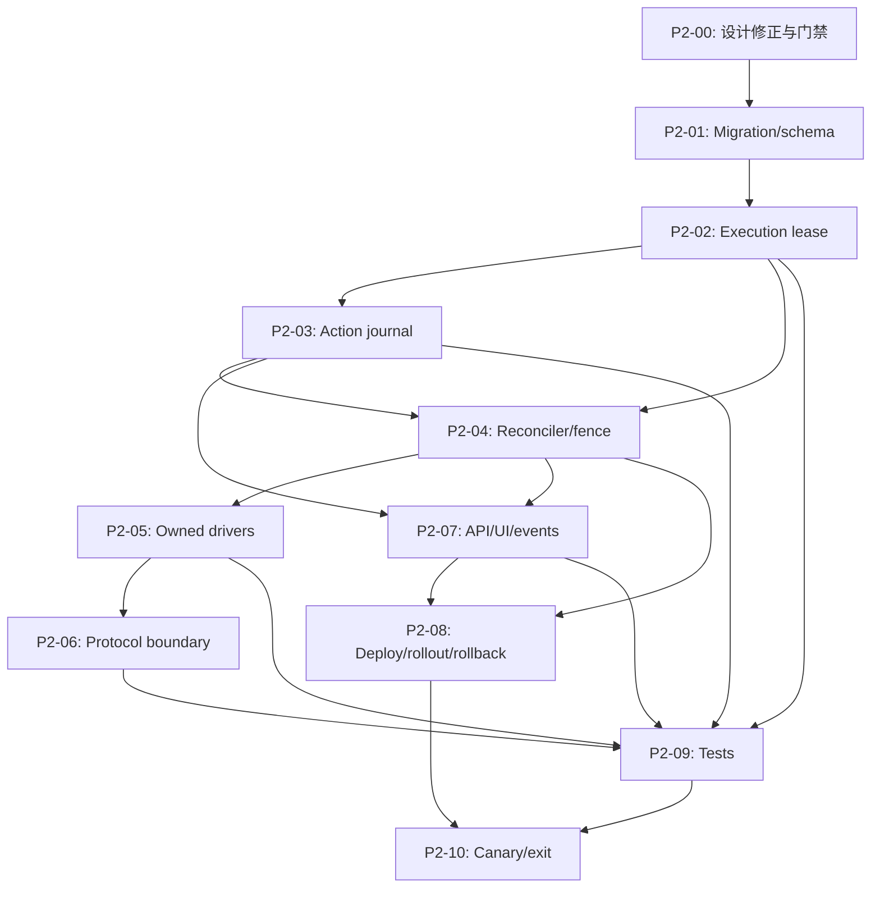

# 批次 2：Worker 所有权与状态重协调实施任务清单

## 文档信息

| 项目 | 内容 |
| --- | --- |
| 状态 | P2-07/P2-08/P2-09 仍有安全门禁；P2-10 canary 暂停 |
| 版本 | 1.0 |
| 更新时间 | 2026-09-23 CST |
| 路线阶段 | [阶段 2：Worker 所有权和状态重协调](../../roadmap/phases/phase-2-reconciliation.md) |
| 产品规格 | [product.md](./product.md) |
| 技术设计 | [tech.md](./tech.md) |
| 前置任务 | [批次 1 任务清单](../batch-1-safe-runtime/task-list.md) |
| 场景事实来源 | `traffic-control-plane/src/lib/fault-run-catalog.ts` |

## 1. 复核结论

### 1.1 设计结论

设计总体合理，推荐继续采用：

- MySQL `fault_run_executions` 作为 Fault Run Worker owner lease 的事实源；
- `ownerEpoch` 与目标侧 `fencingToken` 分离；
- `fault_run_actions` 保存 prepare/release/cleanup 的动作边界；
- Worker-only `FaultRunReconciler` 作为唯一 Fault Run scanner；
- 默认单 Worker，`OBSERVE -> SHADOW -> TAKEOVER` 灰度；
- 公开消费者请求不携带控制面 operation context；
- `OUTCOME_UNKNOWN` 不自动重发，转人工介入。

设计不能原样直接编码，已在 `tech.md` 中完成以下修正：

1. `OBSERVE`、`SHADOW`、`TAKEOVER` 都允许首次 claim；只有 `TAKEOVER` 允许 stale owner 自动接管。
2. `drain_state` 的 owner 持有态统一为 `OWNED`，不把 owner claim 伪装成 drain 已开始。
3. stale takeover 不清空 `lease_lost_at`；只能记录新 Worker 在 MySQL 中检测到过期的时间，不能伪造旧 Worker 的精确失联时间。
4. 复用 Phase 1 已存在的 `FaultRunRecoveryExecutor`、`WorkerRuntime`、`FaultRunDrainRegistry` 和 `resolveFaultRunRecoveryPolicy()`，不新建平行 recovery/policy 状态机。
5. 迁移序号固定为 `005`；批次 3 的 contract revision migration 改为 `006`。当前仓库已实际占用 `002`、`003`、`004`。
6. Phase 2 的“旧 owner fencing”区分为内部控制动作的本地拒绝，以及公开消费者请求只能通过停止接收、取消和 drain 收敛的现实边界。

### 1.2 当前覆盖判断

此前批次 2 没有 `task-list.md`，因此技术设计虽然覆盖了架构、数据模型、部署、测试和回退，但**没有可执行的任务分组、依赖、证据和完成门槛**。本清单补齐后，覆盖关系如下：

| 设计范围 | 对应任务组 | 覆盖状态 |
| --- | --- | --- |
| 设计修正、Phase 1 接入和模式语义 | P2-00 | 已形成门禁，实施待开始 |
| migration、fresh schema、legacy 兼容 | P2-01 | 已拆分 |
| execution lease、claim、heartbeat、owner-scoped update | P2-02 | 已拆分 |
| action journal、unknown outcome、幂等和 crash boundary | P2-03 | 已拆分 |
| Reconciler、owner fence、模式决策、shutdown | P2-04 | 已拆分 |
| Report/Surge/Scenario/Runner-backed driver | P2-05 | 已拆分 |
| Gateway、customer path、Payment/PSP header 隔离 | P2-06 | 已拆分 |
| Coordinator、API、Operator projection、事件和 i18n | P2-07 | 已拆分 |
| Compose/Kubernetes、identity、grace、灰度和回退 | P2-08 | 已拆分 |
| 单元、并发、协议、进程、Docker canary 和阶段退出 | P2-09、P2-10 | 已拆分 |

## 2. 任务规则

1. 开始任务时将 `- [ ]` 改为 `- [-]`；完成实现和对应验证并记录证据后，才改为 `- [x]`。被阻塞任务使用 `- [!]`，并关联“问题跟踪”中的 ID。
2. 每完成、阻塞、恢复或取消一个子任务，立即更新复选框、任务组状态、总体进度、更新时间和“执行更新记录”。
3. 新发现的问题必须登记；如果影响状态语义、权限、数据边界、迁移、部署或回退，先更新 `product.md`/`tech.md` 再继续实现。
4. 场景、target operation、参数、时长、恢复策略、cleanup capability 和 drain owner 只从 Catalog 及其 resolver 读取；本清单不得复制 mutable scenario map。
5. `UNKNOWN`、`OUTCOME_UNKNOWN`、`MANUAL_INTERVENTION_REQUIRED`、`DRAIN_TIMEOUT` 和 verification limitation 必须保留，不能折叠为成功或通用失败。
6. 所有控制面业务 HTTP 继续经 Gateway；Web/API 只持久化命令、审计和 action intent，不能越过 owner/action 直接执行 target。
7. `FAULT_RUN_RECONCILIATION_MODE` 默认 `OFF`。未完成 P2-09/P2-10 前，不得在共享环境启用 `TAKEOVER`，不得默认扩容 Worker。
8. Phase 1 的 `FAULT_RUN_SAFE_RUNTIME_ENABLED`、verification adapter limitation、normal Runner、warmup、补给和 retention 事实必须原样保留；Phase 2 不得用 owner lease 伪造业务恢复。

## 3. 总体进度

- **总体状态：** P2-07/P2-08/P2-09 安全门禁未完成；P2-10 runtime canary 暂停；远端保持 `OFF`。
- **当前任务：** 完成新模式 recovery RELEASE/CLEANUP owner-fenced journal；其 SQL 需要 disposable DB 验证后才评估 canary。
- **下一步：** 不能将新模式 PREPARE slice 视为 recovery 完成；保留现有 RecoveryExecutor，但未接入 owner-fenced RELEASE/CLEANUP 前不得做 runtime canary。

| 任务组 | 目标 | 状态 | 进度 | 前置依赖 |
| --- | --- | --- | --- | --- |
| P2-00 | 设计修正、Phase 1 接入和实施门禁 | 已完成 | 6 / 6 | Phase 1 任务清单 |
| P2-01 | Migration、fresh schema 和 legacy 兼容 | 已完成 | 6 / 6 | P2-00 |
| P2-02 | Execution lease repository 和 owner 条件写入 | 已完成 | 8 / 8 | P2-01 |
| P2-03 | Durable action journal 和动作幂等 | 进行中 | 6 / 7 | P2-01、P2-02 |
| P2-04 | Reconciler、owner fence 和 shutdown | 进行中 | 7 / 8 | P2-02、P2-03 |
| P2-05 | Owned drivers 和 normal-task 隔离 | 已完成 | 8 / 8 | P2-04 |
| P2-06 | Consumer/Gateway/PSP 协议边界 | 已完成 | 5 / 5 | P2-05 |
| P2-07 | Command/API/UI/event projection | 进行中 | 6 / 7 | P2-03、P2-04 |
| P2-08 | 配置、部署、灰度和回退 | 进行中 | 5 / 6 | P2-04、P2-07 |
| P2-09 | 单元、并发、协议和集成验证 | 进行中 | 6 / 8 | P2-02 至 P2-08 |
| P2-10 | Docker canary、双 Worker 验证和阶段退出 | 进行中 | 2 / 6 | P2-08、P2-09 |

## 4. 执行依赖

## 5. 实施任务

### P2-00：设计修正、Phase 1 接入和实施门禁

**目标：** 消除设计与当前实现、后续批次和阶段验收之间的歧义，不在旧 scanner 与新 Reconciler 并行驱动的状态下编码。

- [x] 复核 Phase 1 退出证据：`FaultRunRecoveryExecutor`、`WorkerRuntime`、`FaultRunDrainRegistry`、`resolveFaultRunRecoveryPolicy()`、四类 driver 的 drain 和 normal-task isolation 均可被 Phase 2 复用。
- [x] 固化四种 mode：`OFF` 为 legacy compatibility；`OBSERVE`/`SHADOW`/`TAKEOVER` 均允许首次 claim；仅 `TAKEOVER` 自动处理 stale owner。
- [x] 固化内部控制动作与公开 consumer request 的 fencing 差异，并使 phase/product/tech/task 文档使用一致措辞。
- [x] 固化 `005`/`006` migration reservation；检查所有 roadmap/implementation 文档不再把已占用序号用于 Phase 2 或 Phase 3。
- [x] 定义 legacy Run projection：没有 execution row 时返回 `execution: null` 和 `LEGACY_UNOWNED`，不回填 owner、heartbeat、action 或 target outcome。
- [x] 形成 P2-ISSUE 清单和实施/回退窗口；在 schema gate、旧 scanner 禁用和新 path 可回退前，不进入 `TAKEOVER`。

### P2-01：Migration、fresh schema 和 legacy 兼容

**目标：** 以 expand/contract 方式部署 owner/action 结构，禁止 Worker/Web/API 启动时隐式升级数据库。

- [x] 新增 `traffic_control_plane_schema_migrations`（migration id、checksum、appliedAt、appliedBy）和 MySQL advisory lock；重复执行、checksum 不一致、部分对象和并发 Job 都必须明确失败。
- [x] 新增 `traffic-control-plane/src/lib/migrations/005-fault-run-worker-ownership.sql`，创建 `fault_run_executions`、`fault_run_actions`、索引和约束；不修改既有 Fault Run 状态约束。
- [x] 新增 `infra/mysql/init/09-fault-run-worker-ownership.sql`，与 `005` 的对象、约束、默认值保持 parity；fresh install 不依赖运行时 migration。
- [x] 提供 `verifyFaultRunOwnershipSchema()` 和 `db:verify` 的 schema gate；Worker non-`OFF` wiring 延后到 P2-04，migration 未应用时使用 `FAULT_RUN_OWNERSHIP_MIGRATION_REQUIRED`，`OFF` 保持 legacy compatibility。
- [x] 历史 Run 不回填 owner/action；现有 list/detail/retention 查询不读取新表，legacy Run 保持安全可读。
- [x] 复核 retention、FK cascade、manual cleanup 未完成、`RECOVERING`、`SERVICE_UNAVAILABLE` 和 active guard 的保留边界。

### P2-02：Execution lease repository 和 owner 条件写入

**目标：** 让两个 Worker 在数据库层竞争 owner，并使旧 epoch 无法覆盖新 owner 的 execution/runtime 事实。

- [x] 在 create transaction 中按 mode 写入 execution 初始行；新模式写 `IDLE`，`OFF`/legacy 不写虚构 execution。
- [x] 实现单条条件 claim：首次 claim 的 epoch 为 1；stale claim 只能在 `TAKEOVER` 模式且动作可恢复时发生；claim 后 `drain_state=OWNED`。
- [x] 实现 MySQL server-time heartbeat；正确 owner/epoch 成功，错误 owner、旧 epoch、过期 lease、人工介入和非 runnable Run 失败。
- [x] 实现 owner-scoped drain/action/run transition/event transaction；状态更新 `affectedRows !== 1` 时不得插入对应事件。
- [x] 实现 lease loss、数据库不可用、shutdown 的 local fence signal 和受限 `lease_lost_at` 记录；不能伪造旧进程精确失联时间。
- [x] 实现成功 drain 后的 conditional relinquish；epoch 单调递增，不删除 execution row，不把 timeout/unknown 当作安全 handoff。
- [x] 实现 Operator-safe execution projection，包含 owner、epoch、lease、heartbeat、reconciled、takeover count、drain 和 last error。
- [x] 编写两 Worker 并发 claim、旧 epoch 覆盖、heartbeat rejection、graceful relinquish 和时间边界测试；DB outage/local fence 行为归入 P2-04 Reconciler 测试，不在此阶段停止远端数据库演练。

### P2-03：Durable action journal 和动作幂等

**目标：** 让 prepare/release/cleanup 在 crash、重启和网络不确定性下不被隐式重复。

- [x] 实现 `PREPARE`、`RELEASE`、`CLEANUP` intent；`request_idempotency_key`、`action_type`、`attempt_no` 具备数据库唯一性和 transaction 保护。
- [x] 实现 `REQUESTED -> DISPATCHING` 的 owner+epoch claim；提交 action boundary 后才调用 Gateway。
- [x] 实现受限 target response sanitizer；仅明确成功写 `CONFIRMED`，明确拒绝写 `DEFINITIVE_FAILURE`，timeout/transport/crash/invalid response 写 `OUTCOME_UNKNOWN`。
- [x] stale `DISPATCHING` 恢复为 `OUTCOME_UNKNOWN` 并进入人工介入；不自动生成第二个 attempt 或重发外部动作。
- [x] cleanup 只允许已确认 Operator command、Catalog policy 允许且 Run 状态满足的 per-run action；未知 cleanup 不自动重试；`MANUAL_CLEANUP_REQUESTED` 与 action intent 在同一事务中写入。
- [x] 区分 `NONE`、`OPTIONAL_PER_RUN` 和 `OPERATOR_CONFIRMED`：可选 per-run cleanup 不阻塞停止完成，但不得由 reconciler 自动执行。
- [ ] 覆盖 prepare/release/cleanup crash window、重复 command、不同 key conflict、迟到 response、retention 和 action projection 测试。

### P2-04：Reconciler、owner fence 和 shutdown

**目标：** 由一个 Worker-only Reconciler 统一扫描、claim、heartbeat、driver lifecycle 和 recovery action。

- [x] 生成不可复用 owner ID（release/deployment prefix + pod/hostname + boot UUID），严格解析 lease TTL、heartbeat、scan interval 和 mode。
- [x] 在 Worker non-`OFF` 启动和 Web/API 新模式 create 前调用 `verifyFaultRunOwnershipSchema()`；migration 未应用时 fail closed，`OFF` 保持 legacy compatibility。
- [x] 将 `FaultRunRecoveryExecutor` 的 recovery scan、deadline、verification limitation 和 action policy 纳入 Reconciler mode 的 WorkerRuntime lifecycle；不复制 Phase 1 projection/state transition。
- [x] 实现 `OBSERVE`/`SHADOW` 的 stale 观察记录，`TAKEOVER` 的条件接管；所有模式首次 claim 只启动一个 driver。
- [x] 实现 `WorkerOwnerFence`、AbortSignal 和 owner-scoped persistence failure handling primitive；每 batch/Gateway/action 的具体 driver assertion 在 P2-05 接入。
- [x] 使数据库、`fault_runs`、action journal 和 execution row 成为唯一事实；timer 只能唤醒 scan，不能独立改变状态。
- [ ] 完成到期、stop request、`RECOVERING`、manual cleanup、non-releasing 和 service unavailable 的 owner-fenced 决策表；owned expired Run 现仅持久化 recovery stop command，现有 RecoveryExecutor 的 RELEASE/CLEANUP 未接入 owner-fenced action journal。
- [x] 在 `WorkerRuntime` 中按顺序启动/停止 Reconciler；shutdown 先 quiesce、取消/等待未完成 PREPARE，再运行 recovery scan；保留 owned drain participant 供恢复复用，禁用旧 Fault Run scanner。
- [x] 覆盖 Reconciler core 的 initial claim、SHADOW stale、heartbeat loss、driver drain 和 owned-map cleanup；crash、SIGTERM、network partition、DB transient failure、双 Worker stale owner 和 shutdown timeout integration 留在后续 wiring。

### P2-05：Owned drivers 和 normal-task 隔离

**目标：** 将当前各自扫描的执行器改为由 Reconciler 显式启动的 owned driver，并保持真实业务路径。

- [x] 定义 `OwnedFaultRunDriver`、`OwnedRunHandle`、`WorkerOwnerFence`、drain result 和安全 event writer；不把 ownerEpoch 放进 Gateway DTO。
- [x] 将 `ReportScenarioWorker` 改为 owned report driver：只在 `ACTIVE + owned` 下创建 session、发请求、汇总和 drain。
- [x] 将 `TrafficSurgeExecutor` 改为 owned surge driver：在 session setup、每批请求、关闭 session 前检查 fence。
- [x] 将 `ScenarioWorkers`/`ControlledScenarioWorker` 改为 owned resource driver：复用 Phase 1 drain registry、CART 真实 dispatch 和 target summary，不再自行决定 owner。
- [x] 将 Runner-backed Fault Run 分离出 `RunnerEngine`；notification heap/storage/PSP 继续走真实业务或固定 internal Gateway operation，普通 customer lifecycle 不被 Run owner 统治。
- [x] 复核每个 Catalog 场景的 driver descriptor、`ACTIVE` gate、prepare/release、drain owner 和 `CART_CATALOG_DEPENDENCY` 真实路径；无 no-op effect。
- [x] owner loss 时停止新 batch、取消可取消请求、关闭 session、等待 bounded drain；不承诺撤回已发出的公开请求。
- [x] driver 迁移后在新 mode 禁止旧 `listActiveFaultRuns()` ownership scanner 启动；`OFF` 保留 legacy path，new path 不与其同时驱动同一 Run。

### P2-06：Consumer、Gateway 和 PSP 协议边界

**目标：** 防止 owner/run/lifecycle context 从控制面进入消费者、业务服务或 PSP。

- [x] 从普通 `CustomerRequestContext`、session options、lifecycle options 和 `GatewayClient.customerRequest()` 移除 `faultRunContext`。
- [x] `GatewayClient.postInternal()` 只发送既有 generic `runId`、expiry、target `fencingToken`、idempotency 和 operation；禁止 `ownerEpoch`、scenario、lifecycle state。
- [x] Gateway 对普通 consumer path 丢弃外部伪造的 `X-Operation-Run-*`；internal allowlist/auth 行为保持不变。
- [x] Payment `PspClient` 不再从入站 customer request 复制 operation headers；验证内部 prepare 后 PSP outcome 仍由真实 PSP path 生效。
- [x] 运行 runtime terminology、Gateway/target contract、consumer response/log/trace 和凭据脱敏检查。

### P2-07：Command、API、UI、事件和 projection

**目标：** 让 Operator 看见 owner/reconcile 事实，但不能把控制动作、目标效果、业务恢复和 cleanup 混为一谈。

- [x] 新 mode 的 create 在同一 transaction 写 `CREATING`、execution 初始行、按 Catalog 要求写 prepare intent 和 `CREATED`；返回受限 intent，不在 Web/API 直接 prepare（单元及 disposable MySQL 事务验证）。
- [x] stop/expiry/cleanup API 只写 recovery command/action intent；CREATING Run 停止时在同一事务取消尚未 dispatch 的 PREPARE，保留 Phase 1 session、CSRF、confirmation、audit、idempotency 和 `202`/`200`/`409` 语义。
- [x] list/detail 返回受限 execution/action projection；legacy Run 明确空 execution/action，不返回伪造 owner/action 历史。
- [x] 新增 owner acquired/lost/takeover/reconcile/drain/action unknown 低频事件，禁止每 heartbeat/每请求写事件；PREPARE/RELEASE/CLEANUP unknown 与 execution 人工介入同事务，恢复 action 与 projection/event 在 live owner epoch 下原子结算。
- [x] `fault-run-view.ts`/Operator details 严格消费受限 execution projection；UI 展示 takeover 与业务恢复、公开请求重叠不确定性的差异。
- [x] 同步中英文 Scenario 文案和 i18n parity；不渲染 raw error、HTTP body、token、SQL、stack 或 host details。
- [x] 覆盖 Operator projection、legacy read、i18n parity 和 UI parser 的现有 targeted tests。

### P2-08：配置、部署、灰度和回退

**目标：** 默认单副本、默认关闭、可观察、可停止、可回退。

- [x] 在 `env.ts` 严格接入 mode、TTL、heartbeat、reconcile interval、owner identity 和 schema gate；非法值 fail fast，heartbeat 必须小于 TTL/2。
- [x] Compose 默认 `OFF`、单 Worker、Web/Worker mode 配对；migration service/命令先于 Worker rollout。
- [x] Kubernetes 保持 `replicas: 1`，使用 Recreate、Downward API、足够 termination grace 和 migration Job；不把配置静态渲染当成 runtime 验证。
- [ ] 按 `OFF -> OBSERVE -> SHADOW -> TAKEOVER(test-only) -> single-replica canary` 记录每个晋级条件和 rollback stop window。
- [x] 回退先停止新 claim、保留 execution/action 表和事件，再切回 `OFF`；当前 canary 的 `RECOVERING/VERIFY_UNAVAILABLE` 未被强制改为终态。
- [x] README/runbook 记录 migration-before-rollout、旧 scanner 禁用、active Run 处理和 normal-task isolation。

### P2-09：单元、并发、协议和集成验证

**目标：** 用现有测试工具证明设计行为，而不是只证明类型或静态配置存在。

- [x] repository/SQL：disposable MySQL 已覆盖 claim race、heartbeat、epoch fencing、lease loss、action uniqueness、create/PREPARE activation、CREATING stop cancellation，以及 RELEASE/CLEANUP owner-scoped transition、event 和 terminal optional cleanup。
- [x] Reconciler：四种 mode、首次 claim/stale takeover、driver single-start、unknown action、manual intervention、expiry/stop/recovery core；覆盖 recovery drain 保留同一 owner lease，以及 RELEASE/CLEANUP owner-fenced unit flow。
- [x] driver：Report、Surge、Scenario、Runner-backed 的 ACTIVE gate、AbortSignal、drain timeout、迟到完成和 session cleanup。
- [x] 生命周期隔离：normal Runner、warmup、coupon/inventory replenishment、retention 不因单 Run owner loss/stop 被停止。
- [x] HTTP/security：consumer header、Gateway allowlist、Payment/PSP、no ownerEpoch、no scenario/lifecycle leakage。
- [x] API/UI/i18n：command idempotency、legacy read、owner projection、unknown parser、双语 key parity。
- [x] migration/deployment：fresh schema、existing volume、rerun/checksum/lock、schema fail-fast、Compose/Kustomize、grace budget。
- [x] 使用现有 `pnpm test:runner`、`pnpm test:i18n`、`pnpm typecheck`、`pnpm lint`、`pnpm build`、`docker compose config --quiet`、`kubectl kustomize k8s`、`check-runtime-terminology.sh` 和 `git diff --check`；不新增测试工具。

### P2-10：Docker canary、双 Worker 验证和阶段退出

**目标：** 在 disposable 环境证明 owner/reconcile 行为，并保留所有运行时限制。

- [x] canary 前确认 migration、镜像、Web/Worker mode、active Run 快照、normal-task baseline、owner identity 和回退窗口。
- [-] `OBSERVE` 单 Worker 的隔离 BROWSE_SURGE 已验证 create、owner lease/heartbeat、expiry-driven stop/drain、restart/shutdown；`SHADOW`、Operator manual stop 和 legacy compatibility 仍待验证。
- [ ] 在专用双 Worker 测试环境验证 concurrent claim、stale owner、旧 owner local fence、公开请求重叠限制和 takeover；不得把双 Worker 作为默认部署。
- [ ] 验证 prepare/release/cleanup action unknown 不重发，manual intervention、drain timeout、verification unavailable 和 non-releasing 均保持正确状态。
- [x] 复核 normal Runner、warmup、补给、retention、Shopfront/Gateway health、业务日志和 public contract 未被单 Run 接管影响或污染。
- [-] 已记录本轮 canary 的 limitation、残留和回退证据；SHADOW、双 Worker、unknown outcome runtime gate 尚未完成，不评估 `TAKEOVER` canary，也不宣称业务恢复已自动完成。

## 6. 阶段 2 退出标准

- 双 Worker 竞争同一 Run 时只有一个 execution lease owner 能启动 driver。
- owner lease 丢失后旧 Worker 停止新工作、触发 bounded abort/drain，且旧 epoch 不能覆盖新 owner 的 execution/action/run 事实。
- `OBSERVE`/`SHADOW` 不自动接管；`TAKEOVER` 只对动作状态可恢复的 stale owner 生效。
- prepare/release/cleanup 的未知结果不被自动重发，明确进入人工介入。
- Worker 重启依据 MySQL state/action/execution 恢复、接管或阻塞，不依赖进程内 timer/Map。
- Operator 能区分 owner 接管、drain、target action、业务恢复、verification unavailable 和 cleanup 完成。
- normal Runner、warmup、补给、retention 和消费者契约保持隔离。
- Gateway/target 协议没有 `ownerEpoch`、scenario identity 或 lifecycle state；consumer path 没有内部 operation context。
- 默认保持单 Worker；自动接管只在测试 opt-in，且有可执行回退。

## 7. 问题跟踪

| ID | 发现阶段/任务 | 问题 | 影响 | 处理方案 | 状态 |
| --- | --- | --- | --- | --- | --- |
| P2-ISSUE-001 | 设计复核 | `OBSERVE/SHADOW` 的首次 claim 与 stale takeover 曾混淆。 | 可能导致 observe/shadow 不启动初始 Run，或错误接管 stale owner。 | 首次 claim 三种新模式均允许；stale 自动接管仅 `TAKEOVER`。 | 已解决（文档修正） |
| P2-ISSUE-002 | 设计复核 | `drain_state` claim 后写成 `RUNNING`，与 drain 语义混淆；`lease_lost_at` 会被 takeover 清空。 | UI/审计可能把 owner 获得误报为 drain 已开始，并丢失失联证据。 | 使用 `OWNED`；stale takeover 保留/记录 MySQL 检测时间。 | 已解决（文档修正） |
| P2-ISSUE-003 | 设计复核 | Phase 1 已有 recovery executor/policy/runtime，但原设计未明确增量接入。 | 实现可能产生两套 recovery projection、deadline、cleanup 和 shutdown 语义。 | P2-00 固定复用并由 Reconciler 渐进接管，不复制状态机。 | 已解决（文档修正） |
| P2-ISSUE-004 | P2-00 | `002`、`003`、`004` 已分别被 baseline、warmup config、alert receipts 占用，原设计使用了冲突的 `003`。 | migration 顺序和部署回退不可审计。 | Phase 2 固定 `005`，Phase 3 改用 `006`。 | 已解决（仓库核对后修正） |
| P2-ISSUE-005 | 实施前 | prepare/release 没有通用 readback，`DISPATCHING` crash 无法判断 target 是否生效。 | 自动重试可能造成重复真实副作用。 | PREPARE/RELEASE/CLEANUP 均 journal dispatch；迟到或不确定结果固定为 `OUTCOME_UNKNOWN`/人工介入，禁止自动重发；RELEASE/CLEANUP settlement 另由 P2-ISSUE-009 验证。 | 已解决（未知结果 fail-closed） |
| P2-ISSUE-006 | 实施前 | 公开 consumer request 已发出后不能依赖 target fencing 立即拒绝。 | takeover 期间可能有请求重叠，不能承诺零重叠。 | P2-05/P2-06 使用 local fence、停止接收、AbortSignal 和 bounded drain；UI 明示不确定性，不承诺撤回已发请求。 | 已缓解（仍保留重叠限制） |
| P2-ISSUE-007 | 实施前 | 旧 scanner 与新 Reconciler 并存会产生双驱动。 | 同一 Run 可能被两个本地 driver 同时执行。 | `WorkerRuntime` 在 non-`OFF` mode 禁用旧 Fault Run scanners；`OFF` 保持兼容路径。 | 已解决（P2-04/P2-05 wiring） |
| P2-ISSUE-008 | P2-02 远端回归 | 远端 revision `26e36d5` 的 `runner-engine.test.ts` 中“runner gate closure…”用例以 `cancelledByParent` 失败，单文件重跑仍复现。 | 完整 `pnpm test:runner` 暂不能作为全绿门禁；该失败位于既有 Runner shutdown 测试，不涉及 execution lease repository。 | 由用户/后续批次单独归因 Runner 测试环境或既有实现；P2-03 继续使用 targeted tests，不能把该失败折叠为 lease 通过。 | 待处理 |
| P2-ISSUE-009 | P2-07/P2-04 | 新模式 create/PREPARE 已由 Worker owner 驱动，但 RecoveryExecutor 的 RELEASE/CLEANUP 曾未获得 owner-scoped journal/epoch fence。 | 不可宣称新模式 recovery 安全，也不得执行 runtime canary。 | RELEASE/CLEANUP 的 intent、dispatch、settlement/event 均受 live owner lease/epoch fence；不确定结果转 manual intervention 且不重发；terminal `OPTIONAL_PER_RUN` cleanup 保持终态并由 Worker 处理。恢复 drain 保留同一 owner lease，事务统一按 Run→execution→action 加锁。 | 已解决（unit + disposable MySQL 1+6 tests） |
| P2-ISSUE-010 | P2-09 | 新增 create、PREPARE action/activation、owner lease expiry、stop cancellation 和 recovery action SQL 需要独立数据库证据。 | 缺少新事务路径数据库证据；不得借用保留 RECOVERING/VERIFY_UNAVAILABLE 的共享环境。 | 在临时 MySQL 8.0.46 加载 `00-schema-ddl.sql` 后执行 `db:migrate`/`db:verify`、`test:execution-lease` 和 `test:action-journal`；验证完移除容器。 | 已解决（1 + 6 个 DB integration tests 通过） |
| P2-ISSUE-011 | P2-04/P2-07 | 初始 Reconciler scan 未安装 heartbeat；shutdown 不等待/取消 PREPARE；CREATING stop 留下可 dispatch 的 REQUESTED action；Web/API 新模式 create 未先验证 ownership schema。 | 租约可能在 PREPARE 中过期，shutdown recovery 可与 PREPARE 并发，停用 Run 留下陈旧意图，迁移缺失时 create 暴露底层表错误。 | 初始 scan 前启用 heartbeat、跟踪 PREPARE/driver-start owner、Gateway PREPARE 使用 fence AbortSignal；WorkerRuntime 在 recovery scan 前 quiesce 并对挂起 scan 设置有界超时；stop transaction 取消 REQUESTED PREPARE；新模式 create 先验证 schema。 | 已解决（本地 unit、typecheck、disposable MySQL 验证） |

## 8. 执行更新记录

| 时间 | 任务 | 事实与证据 | 限制/下一步 |
| --- | --- | --- | --- |
| 2026-09-23 CST | P2-10：隔离 OBSERVE BROWSE_SURGE 与 Worker restart/shutdown | 在独立 `castrel_p2_canary` schema 加载 `00-schema-ddl.sql`、`01-seed-dml.sql` 和 migrations `001`–`005`；`db:verify` 通过。通过 Operator API 的 version-CAS 将 canary Runner 设为 disabled，warmup disabled；临时 Web/Worker 使用打包 image，只有 canary Worker 运行 `safe-runtime=true + OBSERVE`，生命周期 placeholder 不会登录。Operator API 创建 15 秒、并发 `1`、间隔 `1000ms`、pageSize `5` 的 `BROWSE_SURGE` Run `2699caec-8f40-4cda-8492-5098387f7c69`。Run 记录 15 requests、15 successes、0 failures、0 timeouts、drain 后 0 in-flight；expiry 后 `RECOVERING/VERIFY_UNAVAILABLE`，符合未配置 verification 的 fail-closed 限制。Worker graceful shutdown/restart 后 `SCENARIO_WORKER_STARTED/STOPPED` 各 1 次、未再次发出场景请求；最后 SIGTERM exit 0，临时容器已移除，canary schema 与 Run 证据保留。主 control-plane 仍 `OFF`，原 `RECOVERING/VERIFY_UNAVAILABLE` Run 未改变，所有主 Compose 服务 running，Gateway health `UP`。 | 仅完成 OBSERVE 的有界 BROWSE_SURGE；尚未运行 SHADOW、双 Worker TAKEOVER、Operator manual stop、unknown action runtime 测试或 legacy compatibility。canary 与主栈共享 Gateway/业务服务；下一轮需另建隔离 schema/环境，不能在含 RECOVERING Run 的同一 control-plane schema 创建第二个 Run。 |
| 2026-09-23 CST | P2-10：远端 Worker 镜像更新与只读 preflight | 远端 checkout 为 `7416617` 且工作树干净；`db:verify` 确认 `001`–`005`，Compose 服务健康。Web/Worker 配置均为 `safe-runtime=false + OFF`；仅重建仍运行旧 image ID 的 Worker，确认其使用已打包 `castrel/traffic-control-plane:latest` 并启动正常，Gateway health `UP`。MySQL 中保留 1 条 `RECOVERING/VERIFY_UNAVAILABLE`；重启后仍为 `RECOVERING/EXPIRED`，execution `OBSERVE/epoch=1/IDLE/DRAINED`，未触碰该 Run、数据库或其他服务。 | 单 Run 生命周期约束下，保留的 RECOVERING Run 阻止在同一 control-plane DB 创建下一条 canary；保持 `OFF`，需选用独立 disposable DB/Compose 环境后继续 P2-10。 |
| 2026-09-23 CST | P2-07/P2-09：owner-fenced RELEASE/CLEANUP recovery 完成 | RecoveryExecutor 将 RELEASE、recovering CLEANUP 和 terminal `OPTIONAL_PER_RUN` CLEANUP 纳入 owner/epoch action journal；intent、执行结果、recovery projection 与事件在事务中结算，unknown/迟到结果进入人工介入且不重发。Recovery drain 保留同一 owner lease；新增 Reconciler 测试，并统一 owner claim/recovery 写事务锁顺序为 Run→execution→action。临时 MySQL 8.0.46（含 `00-schema-ddl.sql`）上 `db:migrate`/`db:verify`、`test:execution-lease` 1/1、`test:action-journal` 6/6 通过；`pnpm test:runner` 235/235、typecheck 通过，lint 0 errors（1 个既有 warning）。 | 临时 DB 容器已移除；未连接或触碰共享/远端环境，未启用 canary。P2-10 的 restart、SHADOW、双 Worker TAKEOVER 与 promotion/rollback 证据仍待专用 runtime gate。 |
| 2026-09-23 CST | P2-04/P2-07/P2-09：PREPARE lease、shutdown、stop intent 与 SQL 证据 | Reconciler 在初始 scan 前安装 heartbeat，并 heartbeat 正在 PREPARE/启动 driver 的 owner；PREPARE 使用 `FaultRunOwnerFence.signal`；新增 quiesce 与有界等待，使 WorkerRuntime 在 recovery scan 前停止新 scan、取消并等待未完成 PREPARE，同时保留 active owned drain participant；CREATING stop 在同一事务取消 REQUESTED PREPARE；新模式 API create 先验证 ownership schema。临时 MySQL 8.0.46 上 `db:migrate`/`db:verify` 通过，`test:execution-lease` 1/1、`test:action-journal` 3/3 通过；`pnpm test:runner` 229/229、Reconciler/WorkerRuntime targeted tests 22/22、typecheck 通过，lint 无错误（有既有 warning）。 | 临时 MySQL 容器已移除，未连接或触碰共享/远端 MySQL；RELEASE/CLEANUP 尚未 owner-fenced，P2-ISSUE-009 仍开放，远端继续 `OFF`，不运行 canary。 |
| 2026-09-23 CST | P2-07：新模式 create/PREPARE focused slice | Catalog 显式声明 prepare capability 并计入 revision；create 同事务写 CREATING/CREATED/execution/按需 PREPARE；Web 不直接调用 target；Worker 先 claim，再 journal DISPATCHING、校验双层响应、owner-fenced activation 或 unknown/manual intervention；修复 WorkerRuntime non-OFF 旧 scanner fallthrough。focused unit、typecheck、lint 已通过。 | 未运行 runtime canary 或共享 DB 测试。RecoveryExecutor 的 RELEASE/CLEANUP 仍未 owner-fenced；disposable MySQL action/activation 集成测试待执行，P2-ISSUE-009/010 保持开放。 |
| 2026-09-20 CST | 设计复核 | 完成 Phase 2 product/phase/tech 与 Phase 1 实现、任务清单、migration 文件、RecoveryExecutor/WorkerRuntime/RecoveryPolicy 对照；确认原设计没有 Phase 2 task list。 | 已补充本清单并修正 tech/phase/Phase 3 migration 引用；实施仍未开始。 |
| 2026-09-21 CST | P2-00：设计与进入门禁完成 | 复核当前 migration 目录和 fresh-install init，确认 `002`/`003`/`004` 已被 baseline/warmup/alert receipts 占用；将 ownership migration 修正为 `005`/`09`，Phase 3 修正为 `006`。确认 Phase 1 recovery/drain/policy 组件可作为 P2 Reconciler 的增量基础。 | P2-00 完成；P2-01 开始实现显式 migration、schema verification 和 legacy projection。保持 mode=`OFF`，不执行 takeover。 |
| 2026-09-21 CST | P2-01：migration foundation 完成 | 新增 `005-fault-run-worker-ownership.sql`、fresh-install `09`、migration history/checksum/advisory-lock runner、`db:migrate`/`db:verify` CLI、ownership table verification helper；ownership SQL 与 fresh-init SQL parity 通过，migration unit tests、typecheck 和 lint 通过。远端 Compose 已执行 migration，`001`–`005` history 全部记录，ownership/execution/action 表存在，active/recovering Run 为 `0`，`db:verify` 通过。 | Worker non-`OFF` startup wiring 延后到 P2-04；保持 mode=`OFF`，不执行 takeover。 |
| 2026-09-21 CST | P2-02：execution lease foundation 开始 | 新增 `fault-run-execution-repository.ts`，实现 conditional claim、server-time heartbeat、lease loss、owner-scoped update、relinquish 和 projection parser；`fault_run_executions` 初始行已加入 create transaction 的可选输入，未接入 mode/旧 scanner。本地和远端 targeted tests/typecheck 通过。 | 并发 MySQL race、create mode wiring 和 Worker startup gate 尚未完成；远端 lint 因既有 `node_modules` 缺少 `eslint` 实体文件失败，未执行依赖安装或重启。 |
| 2026-09-21 CST | P2-02：create wiring 与 claim race 完成 | Coordinator command 已支持可选 `executionMode` 并传入 create transaction；远端 disposable terminal fixture 的双连接竞争结果为 owner A `affectedRows=1`、owner B `affectedRows=0`，最终 epoch=1、`OWNED/OWNED`，fixture 已清理。 | 仍需补齐 heartbeat rejection、旧 epoch 覆盖、relinquish、DB outage 和时间边界测试；Worker startup gate 与 Reconciler 属于后续 P2-04。 |
| 2026-09-21 CST | P2-02：lease integration test harness 完成 | 新增 `test:execution-lease`，默认 skip；在用户授权的 disposable MySQL 环境中会创建临时 active Run，覆盖双 claim race、错误 epoch heartbeat、relinquish、epoch=2 takeover、旧 owner rejection 和 lease-loss projection，并在 finally 删除 fixture。 | 远端执行由用户负责；当前本地未连接 MySQL，不标记最后一个并发/时间边界子任务完成。 |
| 2026-09-21 CST | P2-02：远端 lease matrix 验证完成 | 用户管理的远端 Compose 数据库上使用一次性 Node/MySQL 操作完成 race、heartbeat 成功/旧 epoch 拒绝、drain/relinquish、epoch=2 takeover、旧 owner 拒绝和 lease-loss projection 验证；最终 `TAKEOVER_PENDING/LEASE_LOST/HEARTBEAT_REJECTED`，临时 fixture 已清理。 | DB outage 和显式过期时间边界仍未演练；不重启 Compose，不修改远端代码。 |
| 2026-09-21 CST | P2-02：lease expiry boundary 验证完成 | 远端一次性 fixture 将 owner A 的 lease 设置为已过期，owner B 条件 claim 成功，epoch 从 `1` 递增到 `2`，fixture 已清理。 | 仅剩 DB outage 行为测试；不通过停止 MySQL 或破坏网络模拟，避免影响远端环境。 |
| 2026-09-21 CST | P2-02：阶段关闭 | `test:execution-lease` 在用户更新后的远端 revision 通过；本地完整回归通过。P2-02 的 owner claim/heartbeat/relinquish/epoch/time boundary 证据齐全。 | 远端完整 `test:runner` 的既有 `runner-engine.test.ts` 取消超时用例失败，单文件重跑仍复现；不归因于本次 lease 代码，登记为 P2-ISSUE-008，full regression gate 留给后续处理。 |
| 2026-09-21 CST | P2-03：action journal foundation 开始 | 新增 action intent、owner-scoped dispatch claim、confirm/definitive failure/unknown outcome、stale dispatch unknown 和低基数 summary sanitizer；targeted tests、typecheck 和 lint 通过。 | 仍需接入 create/stop/cleanup command、执行 crash/idempotency/unknown 测试和 Reconciler dispatch；不执行远端代码同步。 |
| 2026-09-21 CST | P2-03：manual cleanup action 接入 | `requestFaultRunManualCleanup()` 在存在 execution row 的新模式 Run 中，将 `CLEANUP` action intent 与 Operator audit、recovery projection 和 `MANUAL_CLEANUP_REQUESTED` 事件放入同一事务；legacy Run 在缺少 ownership 表/row 时保持兼容。 | 仍需处理 `OPTIONAL_PER_RUN` policy、create/stop action 设计和 crash/idempotency integration tests。 |
| 2026-09-21 CST | P2-03：OPTIONAL_PER_RUN cleanup 接入 | 终态 `OPTIONAL_PER_RUN` Run 通过确认入口创建独立 `CLEANUP` action，不进入 `RECOVERING/CLEANING` 必需恢复状态；重复 request key replay，legacy 无 execution row 保持兼容。targeted repository tests、typecheck 和 lint 通过。 | 仍需 create/stop action intent 设计，以及 crash/idempotency/迟到 response integration tests。 |
| 2026-09-21 CST | P2-03：create/stop/action 边界明确 | 明确 `STOP` 保持 recovery command，不创建 action；`PREPARE` 仅由需要 target lifecycle 的 Run 创建；`RELEASE` 由 drain 后 Reconciler 创建；`CLEANUP` 由 Operator confirmation 创建。三类幂等 key 独立。 | P2-03 仅剩 crash/idempotency/迟到 response integration tests。 |
| 2026-09-21 CST | P2-03：action journal integration harness 完成 | 新增 `test:action-journal`，默认 skip；在 disposable MySQL 中覆盖 action idempotency replay、单 owner dispatch claim、第二 owner 拒绝、lease expired 后 `OUTCOME_UNKNOWN` 和 fixture cleanup。 | 远端运行由用户负责；通过后关闭 P2-03，随后进入 P2-04 Reconciler。 |
| 2026-09-21 CST | P2-03：远端 action journal 数据库行为验证 | 远端一次性操作验证 duplicate request 唯一约束、owner A claim、owner B 拒绝、lease expired 后 stale dispatch 转 `OUTCOME_UNKNOWN/OWNER_LEASE_EXPIRED`，fixture 已清理。 | 远端 revision 尚未包含 `test:action-journal` harness；完整 crash/迟到 response 测试仍待用户部署最新代码后执行。 |
| 2026-09-21 CST | P2-03：阶段关闭 | 用户更新后的远端 revision `fa18375` 执行 `test:action-journal` 通过；P2-03 action intent、幂等、owner claim、unknown outcome 和 cleanup policy 设计完成。 | 进入 P2-04；不启用 `TAKEOVER`，先实现 owner fence 和安全启动 gate。 |
| 2026-09-21 CST | P2-04：配置、owner fence 和安全启动 gate 开始 | 新增严格 reconciliation mode/lease 配置、owner ID/fence primitive；`WorkerRuntime` 在非 `OFF` 且 Reconciler 尚未就绪时先校验 ownership schema，再 fail-fast，避免 legacy scanners 误启动；targeted tests、typecheck 和 lint 通过。 | Reconciler scan/heartbeat/driver wiring 尚未实现，P2-04 保持 1/8。 |
| 2026-09-21 CST | P2-04：Reconciler core foundation | 新增 `OwnedFaultRunDriver`/`OwnedRunHandle`、数据库候选 Reconciler、首次 claim、`OBSERVE`/`SHADOW` stale handling、`TAKEOVER` conditional claim、heartbeat loss、bounded drain/relinquish 和 Reconciler unit tests；targeted tests、typecheck 和 lint 通过。 | 尚未接入真实 Report/Surge/Scenario/Runner drivers，也未替换 WorkerRuntime 旧 scanner；P2-04 保持 4/8。 |
| 2026-09-21 CST | P2-04：WorkerRuntime wiring | WorkerRuntime 在非 `OFF` mode 下校验 schema、启动 recovery executor + Reconciler、跳过旧 Report/Surge/Scenario scanner、保留 normal Runner/warmup/replenishment/retention lifecycle，并按 shutdown 顺序停止 Reconciler；WorkerRuntime/Reconciler tests、typecheck 和 lint 通过。 | 仍需完善 Reconciler expiry/stop 到 release action 的完整决策和 integration tests；P2-04 保持 7/8。 |
| 2026-09-21 CST | P2-04：expiry/recovery bridge 完成 | Reconciler 对自己持有的已过期 `ACTIVE` Run 持久化 `EXPIRED` recovery command，不直接 release；现有 RecoveryExecutor/DrainRegistry 继续负责 drain、policy、release 和 verification。Reconciler expiry bridge test、typecheck 和 lint 通过。 | P2-04 完成；P2-05 仍需禁用旧 scanner、补齐 owner-loss assertions 和 normal-task isolation integration。 |
| 2026-09-21 CST | P2-05：Report/Surge/Scenario driver prework | 为 Report、Surge、Scenario Worker 增加 `OwnedFaultRunDriver` adapter 和 `startOwned` bounded drain 接口；复用真实 Gateway/customer/session/target summary 路径，不创建 no-op effect；相关 worker tests、typecheck 和 lint 通过。 | 尚未由 Reconciler registry 启动，旧 scanner 仍保留；Runner-backed driver 和 WorkerRuntime wiring 后续处理。 |
| 2026-09-21 CST | P2-05：Runner-backed driver 与 registry prework | 新增 Runner-backed driver：storage append 继续使用固定 internal operation，heap/PSP lifecycle 不向 customer path 注入 Fault Run context；新增四类真实 driver registry 和 supports 测试。 | 尚未接入 WorkerRuntime/Reconciler；normal Runner 隔离和旧 scanner 退役仍待 wiring 阶段。 |
| 2026-09-22 CST | P2-05：driver 隔离与 WorkerRuntime 接缝完成 | Report/Surge/Scenario/Runner-backed owned driver 均有 owner-loss drain/AbortSignal 边界；WorkerRuntime non-`OFF` 跳过旧 effect scanner，normal Runner 通过 reconciliation mode 不消费 Fault Run context；driver registry、WorkerRuntime、driver targeted tests 和完整本地 regression 通过。 | P2-06 开始处理 Gateway/customer/PSP protocol boundary；远端不做代码修改。 |
| 2026-09-22 CST | P2-06：consumer/Gateway/PSP protocol boundary 完成 | customer path 删除 Fault Run context 和 operation headers；storage append 保留 internal context；Gateway public path stripping operation headers；Payment 不再把入站 operation headers 转发 PSP；Gateway Java tests、Payment compile、terminology check 和本地 regression 通过。 | 进入 P2-07 Operator projection/API/UI；远端部署仍由用户管理。 |
| 2026-09-22 CST | P2-07：execution/action projection prework | Fault Run repository 读取 execution projection，Operator details API 返回受限 execution/action projection，legacy migration 缺失安全降级；Operator UI 增加 owner/epoch/heartbeat/lease/drain 面板和中英文文案；targeted projection/i18n/typecheck/lint 通过。 | create/stop action intent、owner event parser 和完整 action UI 仍需接入；P2-07 保持 3/7。 |
| 2026-09-22 CST | P2-07：action timeline 与 owner event summaries | Operator details 增加低基数 action journal 面板；`fault-run-view` 增加 owner/takeover/drain/action unknown 事件摘要；中英文 i18n parity、`test:i18n`、projection tests、typecheck 和 lint 通过。 | 仍需 create/stop command projection、owner event 写入完整性和 API race integration tests。 |
| 2026-09-22 CST | P2-07：projection security tests | 新增 execution/action bounded projection fixture，验证 owner epoch/takeover 和 action unknown 可展示，同时 request key、raw payload 不会进入 Operator details；targeted tests、i18n、typecheck 和 lint 通过。 | 仍需 create/stop command projection、action event writer 完整覆盖和 API race integration tests。 |
| 2026-09-22 CST | P2-07：create mode projection wiring | API create route 在 mode 非 `OFF` 时传递 `executionMode`，创建事务可返回 execution projection；stop/cleanup route command tests、projection tests、i18n、typecheck 和 lint 通过。 | prepare action intent、stop/cleanup response readback、owner/action event completeness 和 API race integration tests仍待完成。 |
| 2026-09-22 CST | P2-08：默认部署参数 prework | Compose/Web/Worker 和 Kubernetes ConfigMap 统一加入 reconciliation mode/lease/heartbeat/interval/owner prefix，默认 `OFF`；Kubernetes Worker 保持单副本、Recreate 和 105s termination grace；`docker compose config`、`kubectl kustomize` 通过。 | migration Job、灰度/回退 runbook 和 runtime canary 尚未完成；未执行远端部署。 |
| 2026-09-22 CST | P2-08：Kubernetes migration Job prework | 新增 `traffic-control-plane-migrate` Job，显式执行 `db:migrate`，使用独立 backoff/TTL；纳入 kustomization，并通过 `kubectl kustomize` 和 Compose static checks。 | Job 必须由用户在 rollout 前单独 apply/wait；本地/远端均未执行 Job。 |
| 2026-09-22 CST | P2-08：migration rollout runbook 完成 | README 增加 `db:migrate`/`db:verify`、Compose mode pairing、Kubernetes Job wait、single-Worker promotion 和 non-destructive rollback 顺序。 | 仍未执行 runtime rollout；P2-10 负责真实 canary。 |
| 2026-09-23 CST | P2-09：并行静态/协议验证收口 | 本地 `pnpm test:runner`、`test:i18n`、typecheck、lint、terminology check、Compose config、Kustomize、diff check 全部通过；Gateway/Payment Maven targeted tests通过；repository/lease/action/driver/projection/security coverage 已完成静态与 targeted 验证。 | Reconciler full takeover、normal-task runtime isolation、真实 Docker canary 和 rollback 仍属于 P2-10 runtime gate。 |
| 2026-09-23 CST | P2-09：Reconciler mode matrix unit coverage | 新增 TAKEOVER stale epoch unit coverage；结合 OFF gate、OBSERVE/SHADOW stale、initial claim、heartbeat loss、expiry recovery command tests，Reconciler core mode coverage通过。 | normal-task runtime isolation 和真实 takeover/canary 仍未运行。 |
| 2026-09-23 CST | P2-10：远端 canary preflight | 用户更新后的远端 revision `5fdde12` Compose 全部 running；`FAULT_RUN_RECONCILIATION_MODE=OFF`、safe-runtime=false、migration `db:verify` 通过、lease/action integration tests 通过、active/recovering Run 为 `0`。 | 不在当前 mode 下启用 canary/takeover；需由用户后续部署 `OBSERVE` 配对配置并提供独立停止窗口。 |
| 2026-09-23 CST | P2-10：OBSERVE canary 与后台隔离完成 | 用户授权的远端 Compose 切换为 `safe-runtime=true + OBSERVE`，创建 15 秒 `BROWSE_SURGE` Run `cbff1726-c568-4c06-b0f0-b84946cf7d42`；真实事件包含 `OWNER_LEASE_ACQUIRED`、`SCENARIO_WORKER_STARTED`、`OWNER_DRAIN_COMPLETED`、`DRAIN_COMPLETED`、`RELEASE_SKIPPED`、`VERIFY_UNAVAILABLE`、`RECOVERY_BLOCKED`，最终保留 `RECOVERING` limitation。Runner 仍 `RUNNING`，warmup 两表保持 `54,000,000`，近期 lifecycle actions 持续成功，Gateway health `200`。 | 当前只完成 Observe 单 Worker 的 create/claim/expiry/drain；未执行 restart、SHADOW 或 TAKEOVER。 |
| 2026-09-23 CST | P2-10：canary rollback 完成 | 远端 Web/Worker 已切回 `FAULT_RUN_SAFE_RUNTIME_ENABLED=false + FAULT_RUN_RECONCILIATION_MODE=OFF`；Gateway health `200`，Runner、coupon/inventory replenishment 和 warmup 正常启动。Canary Run 保留为 `RECOVERING + stop_reason=EXPIRED + recovery_error=VERIFY_UNAVAILABLE`，execution/action/event 事实未删除，OFF legacy path 未强制接管。 | 仍缺 restart/shutdown、SHADOW、TAKEOVER(test-only) 和完整 promotion/rollback stop-window 证据；不得宣称自动业务恢复完成。 |
| 2026-09-21 CST | P2-04：drain registry bridge | Reconciler owned entry 增加 drain-owner mapping，注册到现有 `FaultRunDrainRegistry`，stop/recovery 可复用 participant settled contract；core tests 与 typecheck/lint 通过。 | WorkerRuntime 仍未启用 Reconciler；expiry/release recovery 和真实 driver wiring 后续完成。 |
