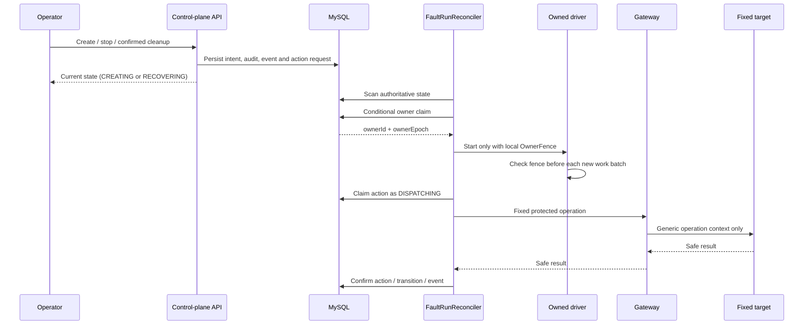
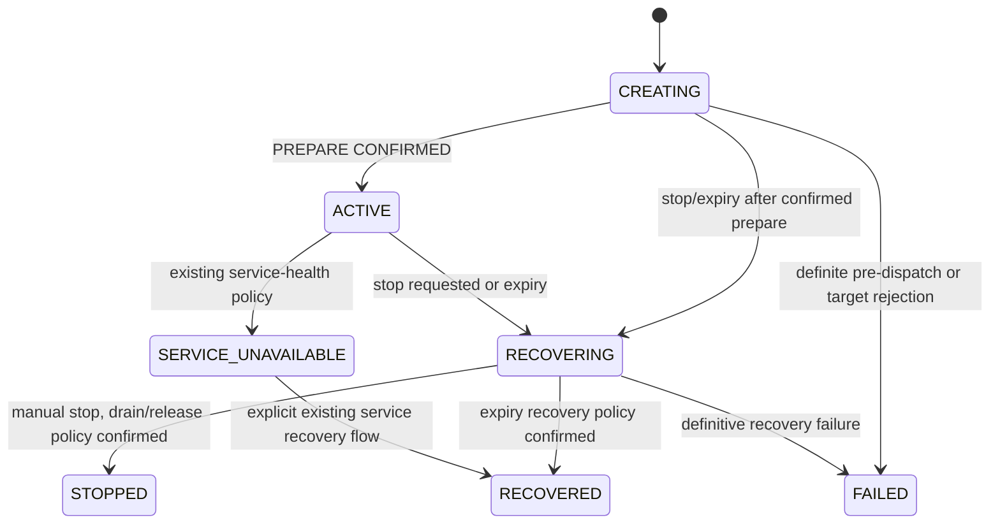
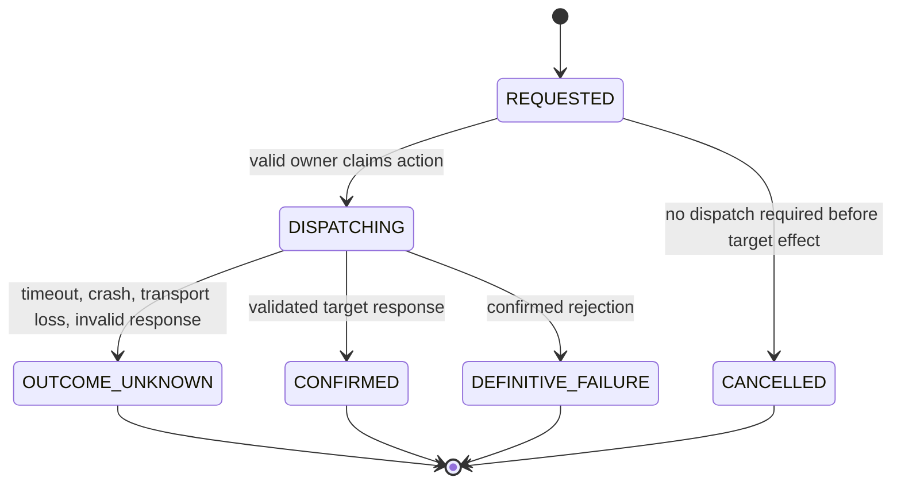

# 批次 2：Worker 所有权与状态重协调技术设计

> 状态：技术设计 v1.1（复核后待实施评审）<br>
> 配套产品规格：[product.md](./product.md)<br>
> 实施任务：[task-list.md](./task-list.md)<br>
> 对应路线阶段：[阶段 2：Worker 所有权和状态重协调](../../roadmap/phases/phase-2-reconciliation.md)<br>
> 前置条件：批次 1 的 run-specific drain、总超时和恢复结果已在报表、流量和专用 Worker 中可验证<br>
> 设计原则：MySQL 状态事实、单运行单 owner、动作结果不臆测、控制面/业务面隔离、单副本默认、增量迁移

## 1. 设计结论

批次 2 采用**以 MySQL 为事实来源的、每个 Fault Run 一条 Worker execution lease，以及由独立 Worker 进程运行的 `FaultRunReconciler`**。它不把 Redis、Web/API 进程内 Map 或定时器作为所有权事实，也不把目标服务的 `OperationRunGuard` 当成 Worker owner lease。

```text
Operator API
  -> 写入 Fault Run 意图、审计和低频运行事件
  -> fault_runs + fault_run_executions + fault_run_actions
                                      |
                                      v
                         Worker FaultRunReconciler
                                      |
                    conditional MySQL owner lease
                                      |
                                      v
                  owned driver / drain / lifecycle action
                                      |
                                      v
                    Gateway fixed internal operation
                                      |
                                      v
                             business services
```

本设计的具体结论如下：

1. `fault_runs` 继续保存 Fault Run 的业务生命周期、固定 target、参数和目标侧 `fencing_token`；新增一对一的 `fault_run_executions` 保存高频 heartbeat、owner epoch、drain 和重协调事实。这样 heartbeat 不会频繁改写业务状态行。
2. 新增 `fault_run_actions`，为 `PREPARE`、`RELEASE` 和 Operator 已确认的 `CLEANUP` 保存持久化的动作意图、dispatch 边界和可确认结果。外部调用在动作进入 `DISPATCHING` 并提交后才发生；崩溃后没有可证实结果的动作一律标记 `OUTCOME_UNKNOWN`，绝不隐式重发。
3. Web/API 在新路径中只做 admission、停止/清理意图、CSRF、Operator audit 和查询；它不再通过本进程的 `FaultRunCoordinator` 直接执行 prepare、release、cleanup 或 Worker drain。拥有有效 lease 的 Worker 才能执行这些动作，且所有业务 HTTP 仍经 Gateway。
4. `ownerEpoch` 仅用于控制面本地 fence 和带 owner 条件的数据库更新。它**绝不**加入 `FaultRunContext`、Gateway body/header、目标服务、消费者请求、日志标签或 trace 属性。目标侧 `fencingToken` 保持既有职责和数值，不随 Worker 接管改变。
5. 不在本批次新增 `FaultRunState`。无法自动确认的运行继续保持 `CREATING` 或 `RECOVERING`，并在 execution projection 中明确写入 `MANUAL_INTERVENTION_REQUIRED`。现有 `active_run_guard` 因而仍会阻止创建新运行，不会把未知目标状态伪装成 `FAILED`、`RECOVERED` 或可忽略的终态。
6. 默认部署仍为一个 Worker。自动接管只在显式 opt-in 的测试环境开启；生产/默认路径先使用 observe 和 shadow 模式积累事实。多个 Worker 同时存在时，数据库 lease 是最终仲裁者，而不是 Kubernetes 副本数或 Compose 的容器名。

### 1.1 复核结论与实施前修正

本设计的总体架构合理，可以满足阶段 2 的 owner、heartbeat、接管、旧 owner fence 和单副本灰度目标；但不能脱离当前批次 1 实现直接照抄落地。实施任务必须先完成以下修正：

- 当前代码已经有 `FaultRunRecoveryExecutor`、`WorkerRuntime`、`FaultRunDrainRegistry`、`resolveFaultRunRecoveryPolicy()` 和安全运行时 projection。Phase 2 的 Reconciler 必须渐进式接管这些组件，保留既有 recovery projection、policy、deadline、verification limitation 和 normal-task shutdown 语义，不能平行实现第二套恢复状态机。
- `OBSERVE`、`SHADOW` 和 `TAKEOVER` 都允许**首次** claim；只有 `TAKEOVER` 允许在 lease stale 且动作状态可恢复时执行自动接管。`OBSERVE`/`SHADOW` 对 stale owner 只记录观察或候选决定，不能重新 claim 或启动第二个 driver。
- execution claim 后的 `drain_state` 表示“已获得 owner”时应为 `OWNED`，不是 `RUNNING`；只有进入停止路径才使用 `DRAINING`、`DRAINED` 或 `DRAIN_TIMEOUT`。stale takeover 不能把 `lease_lost_at` 清空；首次发现失联时应记录数据库检测时间，不能伪造旧 Worker 的精确失联时间。
- 当前实际已使用 `002-fault-run-baseline.sql`、`003-data-warmup-config.sql` 和 `004-alert-receipts.sql`。本批次固定使用下一个全局序号 `005-fault-run-worker-ownership.sql`，fresh-install 对应 `infra/mysql/init/09-fault-run-worker-ownership.sql`；批次 3 的 contract revision migration 必须改用 `006`。
- 当前 `CART_CATALOG_DEPENDENCY` 已有真实 dispatch/drain 的 Phase 1 Docker evidence；Phase 2 仍必须把它接入 owner driver descriptor，不能因为业务请求失败而标记为未 dispatch，也不能用 no-op driver 替代真实路径。

以上修正和设计到任务的追踪关系记录在 [task-list.md](./task-list.md)；在 P2-00 完成前，不进入 owner lease 编码。

### 1.2 备选方案与选择

| 方案 | 优点 | 不采用或限制原因 |
| --- | --- | --- |
| Redis `SET NX` 作为 Fault Run owner | 已有预热 lease 的实现经验 | Fault Run 的状态、事件和动作账本在 MySQL；Redis lease 无法与状态转换/动作声明原子关联，且不能代替数据库恢复事实。 |
| 保留 Web/API 内 `FaultRunCoordinator` 的 timer 和 `runDrains` | 改动较少 | Web 与 Worker 是不同进程；Map 在重启和多副本之间不可见，无法保证谁有权 dispatch 或 drain。 |
| 将 owner/heartbeat 直接加到 `fault_runs` | 表数量最少 | heartbeat 会热写业务生命周期行，且会把 owner 层与 target fencing、Operator 意图混在一起。 |
| 仅依赖目标 `OperationRunGuard` fencing | 目标服务已有 Redis guard | 同一 Fault Run 的 `fencingToken` 在接管后不变；它无法区分旧/新 Worker，公开消费者请求也不应带内部 context。 |
| 只记录事件、不保存动作账本 | schema 最简单 | prepare/release 的网络调用与数据库提交之间存在崩溃窗口；事件不能可靠区分“未发出”和“已生效但未记录”。 |
| **MySQL execution lease + 动作账本 + Worker reconciler** | 所有权、状态和动作可条件更新，重启后可解释且可审计 | 需要重构现有 scanner，并新增显式 migration/灰度流程；这是满足阶段验收所需的最小可靠边界。 |

## 2. 当前实现基线与必须修复的缺口

| 事实来源 | 当前行为 | 批次 2 的处理 |
| --- | --- | --- |
| `fault_runs`、`fault_run_sequence` | 已有全局活动运行唯一约束和每 Run `fencing_token`。 | 保留其业务职责；新增 execution/action 表，不复用 `fencing_token` 作为 `owner_epoch`。 |
| `fault-run-coordinator.ts` | Phase 1 已移除原有 timer/drain Map，safe-runtime 下 Web/API 已持久化 stop intent；legacy/new create path 仍可能由 Coordinator 直接 prepare。 | 保持 Phase 1 command/recovery compatibility；新 mode 下 Coordinator 只做 admission/state policy，prepare/release/cleanup 和 owner drain 移入 Worker Reconciler。 |
| `worker/worker-runtime.ts`（由 `worker/index.ts` 启动） | safe-runtime 开启时启动 `FaultRunRecoveryExecutor`，关闭时启动 legacy recovery，并分别启动各类 effect worker。 | 由 Reconciler 渐进接管 safe-runtime recovery/ownership；`worker-runtime.ts` 仍负责 normal Runner、预热、补给和 retention 的独立生命周期。 |
| `ReportScenarioWorker`、`TrafficSurgeExecutor` | Phase 1 已具备 runnable-only admission、取消和 drain 边界，但仍由各自 timer/scanner 独立发现 Fault Run。 | 保留 Phase 1 drain contract，改为仅由 Reconciler 调用的 owned driver；启动前和每个新 batch 前检查 owner fence。 |
| `ScenarioWorkers`、`ControlledScenarioWorker` | 专用 Worker 已支持 `AbortSignal` 和部分 drain 注册，但仍会自行扫描数据库。 | 保留可取消请求与统计逻辑；移除自行 ownership 判断，把 stop/drain handle 交给 reconciler。 |
| `FaultRunRecoveryExecutor`、`WorkerRuntime` | Phase 1 已负责 safe-runtime recovery projection、deadline、verification limitation 和 shutdown 顺序。 | Reconciler 复用其持久化和 drain contract，逐步取代其 Fault Run ownership/recovery scan；不得同时启动两个恢复执行器。 |
| `RunnerEngine` | 每个 tick 读取活动 Fault Run，并把 `faultRunContext` 带入普通 customer lifecycle。 | 拆出 Fault Run 专用 driver；正常客户 Runner 不再读取/驱动 Fault Run，也不携带内部运行 context。 |
| `GatewayClient.customerRequest()`、支付 PSP 调用链 | customer request 可附加 `X-Operation-Run-*`；支付服务会尝试继续向 PSP 转发这些 header。 | 删除该 public-path context 入口；Gateway 对非 `/internal/**` 请求移除这些 header，支付 PSP client 不再从入站请求复制它们。 |
| `OperationRunGuard` | 目标服务以 target `fencingToken` 和 lease 保护内部资源。 | 保持不变。Worker owner lease 只在控制平面执行层防止旧进程继续开始新动作。 |
| `DataWarmupService` | Redis NX、compare-and-expire renew、lease loss 后停止写入。 | 复用“续约失败立即本地停写/停接收”的控制流；不复用 Redis key、lease、owner 或进度表。 |
| `fault-run-schema.ts` 与 `infra/mysql/init/04-fault-run-schema.sql` | 覆盖初始 Fault Run 表；Phase 1 还通过 `infra/mysql/init/06-fault-run-baseline.sql` 提供 baseline 表。 | ownership 结构使用独立显式 expand migration 和 `infra/mysql/init/09-fault-run-worker-ownership.sql`；新结构不得通过 Web/API 或 Worker 启动时的隐式 DDL/`ALTER` 升级。 |

### 2.1 范围

本批次包含：

- 每个 Fault Run 的 owner identity、epoch、lease、heartbeat、drain 和重协调投影。
- 数据库条件 claim/renew/relinquish，避免两个 Worker 共同获得有效 owner。
- Worker 启动、周期扫描、到期、停止、接管和恢复时的显式重协调决策。
- prepare/release/cleanup 的持久 action boundary，防止重启自动重复不可证实的外部动作。
- 所有真实流量/资源 driver 的 owner fence、`ACTIVE` gate、停止接收和 bounded drain。
- Operator 受保护视图中的 owner、heartbeat、接管、drain、动作与人工介入事实。
- Gateway/支付调用链的内部 header 隔离修复。
- 迁移、配置、测试、灰度、回退和单副本 rollout 设计。

本批次明确不包含：

- 多副本默认部署、Worker pool、跨环境或多 Fault Run 并行。
- 将 `ownerEpoch` 传播给 Gateway、业务服务、PSP、消费者或观测系统。
- 撤回已经发出的公开业务请求，或承诺旧/新 owner 的请求零重叠。
- 以固定等待、假结果或控制接口代替真实业务/资源路径。
- 对 `OUTCOME_UNKNOWN` 的 prepare/release 自动重试。
- 以自动 cleanup 绕过 Catalog 的 `MANUAL_CLEANUP` 和 Operator confirmation。
- 修改目标服务的场景身份、控制面生命周期或 Catalog 解释职责。

### 2.2 进入门槛

在开启 `OBSERVE`、`SHADOW` 或 `TAKEOVER` 前，必须同时满足以下条件：

1. 批次 1 已使 `ReportScenarioWorker`、`TrafficSurgeExecutor` 和 `ScenarioWorkers` 都具备 run-specific 的停止接收、`AbortSignal`、drain deadline 与终态汇总事件。
2. 所有会产生持续请求的执行器都通过共享的 `ACTIVE` predicate；`CREATING`、`RECOVERING` 不得启动任何流量 driver。
3. 已明确每个 Catalog 目标操作是否需要 prepare/release。`FaultRunRecoveryStrategy` 不是目标 lifecycle 的唯一推导来源：`WORKER` 场景也可能已有 Gateway prepare，`NON_RELEASING` 则明确禁止正常 release。
4. 已验证 `CART_CATALOG_DEPENDENCY` 的真实消费者路径 dispatch。Phase 2 应将现有真实 Scenario Worker 路径包装为 owned driver；在此之前不能用 no-op driver 填补“可接管”指标，也不能把业务请求失败解释为未 dispatch。
5. 批次 2 migration 已在目标环境完成，且 Worker 的 schema verification 通过；迁移序号和 checksum 已与现有 `002`/`003`/`004`、批次 3 预留的 `006` 对齐。

## 3. 所有权模型与模块边界

### 3.1 三类独立 ownership

| ownership | 事实来源 | 作用范围 | 不可替代的原因 |
| --- | --- | --- | --- |
| Fault Run Worker owner lease | MySQL `fault_run_executions` | 谁可执行 Fault Run driver、生命周期动作和协调写入 | 需要与 `fault_runs` 状态和 action journal 条件关联。 |
| 目标侧 operation guard | 目标服务 Redis、`OperationRunGuard` | 目标内部操作的 target fencing、expiry 与资源 cleanup | 保护目标资源，不判断哪个控制面 Worker 仍存活。 |
| 数据预热/独立任务 lease | Redis 和各任务专属持久化 | warmup、补给、retention 等独立后台工作 | 不得因一个 Fault Run 的停止或 lease 丢失被误停。 |

`owner_epoch` 从 `0` 开始。首次 claim 变为 `1`；每次有效重新 claim 单调递增。Operator 的 `takeoverCount` 由 `max(ownerEpoch - 1, 0)` 派生，不保存一个可能与 epoch 漂移的重复计数。

### 3.2 Worker identity

每个 Worker 进程启动时生成不可复用的 owner ID：

```text
<release-or-deployment-prefix>/<pod-uid-or-hostname>/<boot-random-uuid>
```

- Kubernetes 通过 Downward API 注入 `POD_UID` 和 `POD_NAME`；进程仍追加一次启动随机 UUID。
- Compose/local 使用 hostname 与启动随机 UUID。
- PID、固定 Deployment 名、replica ordinal 或人工配置的静态字符串都不能单独充当 owner identity。
- owner ID 只出现在控制面受保护的 execution projection 和低敏运行事件，不进入业务 payload、消费者响应、公开日志或指标 label。

### 3.3 `FaultRunReconciler` 的唯一职责

新增 Worker-only `FaultRunReconciler`，负责：

1. 从 MySQL 扫描可重协调的 Run 和 pending action，而不是从内存 timer 推断状态。
2. 对每个候选 Run 尝试条件 claim；只有 `affectedRows === 1` 的 Worker 才能创建本地 driver handle。
3. 为本地 owner 定期 heartbeat；任何续约未确认都立即 local-fence。
4. 根据持久 Run/action/execution 事实选择 resume、takeover、recovery 或 manual-intervention，不把 lease loss 直接写成 Fault Run 业务终态。
5. 驱动 prepare、drain、release 和已确认 cleanup；所有业务 HTTP 经 `GatewayClient.postInternal()`。
6. 在进程退出时停止新 claim、drain 自己拥有的 handles，并只以 owner+epoch 条件 relinquish。

执行器不再自行调用 `listActiveFaultRuns()` 宣称某个 Run 可运行。它们变成被 reconciler 显式启动、显式 drain 的 driver。reconciler 的本地 `Map<faultRunId, handle>` 只保存本进程资源句柄；数据库 execution/action 行才是跨进程事实。

### 3.4 总体数据流



## 4. 持久化模型

### 4.1 `fault_run_executions`

`fault_run_executions` 是 `fault_runs` 的一对一 execution projection。它在同一个 create transaction 中插入一个初始 `IDLE` 行；既有 Run 不回填虚构 owner 或 heartbeat。

```sql
CREATE TABLE fault_run_executions (
  fault_run_id CHAR(36) NOT NULL PRIMARY KEY,
  execution_mode VARCHAR(16) NOT NULL,
  owner_id VARCHAR(192) NULL,
  owner_epoch BIGINT UNSIGNED NOT NULL DEFAULT 0,
  lease_acquired_at DATETIME(3) NULL,
  lease_expires_at DATETIME(3) NULL,
  last_heartbeat_at DATETIME(3) NULL,
  lease_lost_at DATETIME(3) NULL,
  reconciled_at DATETIME(3) NULL,
  reconciliation_state VARCHAR(40) NOT NULL DEFAULT 'IDLE',
  drain_state VARCHAR(32) NOT NULL DEFAULT 'IDLE',
  drain_deadline_at DATETIME(3) NULL,
  last_action VARCHAR(64) NULL,
  last_action_at DATETIME(3) NULL,
  last_error_code VARCHAR(64) NULL,
  created_at DATETIME(3) NOT NULL DEFAULT CURRENT_TIMESTAMP(3),
  updated_at DATETIME(3) NOT NULL DEFAULT CURRENT_TIMESTAMP(3)
    ON UPDATE CURRENT_TIMESTAMP(3),
  CONSTRAINT fk_fault_run_execution_run
    FOREIGN KEY (fault_run_id) REFERENCES fault_runs(fault_run_id) ON DELETE CASCADE,
  INDEX idx_fault_run_execution_lease (lease_expires_at, fault_run_id),
  INDEX idx_fault_run_execution_reconcile (reconciliation_state, lease_expires_at),
  INDEX idx_fault_run_execution_owner (owner_id, owner_epoch),
  CHECK (execution_mode IN ('OBSERVE', 'SHADOW', 'TAKEOVER')),
  CHECK (reconciliation_state IN (
    'IDLE', 'OWNED', 'TAKEOVER_PENDING', 'TAKEN_OVER',
    'RECOVERY_PENDING', 'MANUAL_INTERVENTION_REQUIRED'
  )),
  CHECK (drain_state IN (
    'IDLE', 'OWNED', 'DRAINING', 'DRAINED',
    'DRAIN_TIMEOUT', 'LEASE_LOST', 'NOT_APPLICABLE'
  ))
) ENGINE=InnoDB DEFAULT CHARSET=utf8mb4;
```

字段语义：

| 字段 | 语义 |
| --- | --- |
| `execution_mode` | 创建 Run 时冻结的 `OBSERVE`、`SHADOW` 或 `TAKEOVER`。运行期间环境变量变化不得改变该 Run 的接管行为。 |
| `owner_id` / `owner_epoch` | 当前或最近 owner 的诊断身份与单调 fencing epoch；只作为控制面内部条件。 |
| `lease_*` | 所有时间由 MySQL `CURRENT_TIMESTAMP(3)` 写入。`lease_expires_at` 是所有权判定边界；`last_heartbeat_at` 只证明最后一次被数据库确认的续约。 |
| `reconciled_at` | 最后一次基于持久事实作出显式重协调决定的时间，而非任意 scanner tick 时间。 |
| `reconciliation_state` | ownership/reconcile 的安全投影。`MANUAL_INTERVENTION_REQUIRED` 会禁止自动 action 与新 traffic driver，但不伪造 Fault Run 业务终态。 |
| `drain_*` | 批次 1 stop/drain 的执行事实和 deadline，不以 `fault_runs.state` 代替。 |
| `last_action` / `last_error_code` | 受限枚举，例如 `LEASE_ACQUIRED`、`PREPARE_CONFIRMED`、`RELEASE_UNKNOWN`；不保存原始 HTTP body、异常堆栈、token、SQL 或 secret。 |

### 4.2 `fault_run_actions`

`fault_run_actions` 持久化外部动作边界。它不是第二个 lifecycle 状态机：`fault_runs` 仍是业务状态事实，action 表只记录一个动作是否可以安全 dispatch、是否被确认，或必须人工判断。

```sql
CREATE TABLE fault_run_actions (
  action_id CHAR(36) NOT NULL PRIMARY KEY,
  fault_run_id CHAR(36) NOT NULL,
  action_type VARCHAR(16) NOT NULL,
  attempt_no SMALLINT UNSIGNED NOT NULL DEFAULT 1,
  action_state VARCHAR(24) NOT NULL,
  requested_by VARCHAR(16) NOT NULL,
  request_idempotency_key VARCHAR(128) NOT NULL,
  operator_audit_id BIGINT NULL,
  dispatch_owner_id VARCHAR(192) NULL,
  dispatch_owner_epoch BIGINT UNSIGNED NULL,
  requested_at DATETIME(3) NOT NULL DEFAULT CURRENT_TIMESTAMP(3),
  dispatch_started_at DATETIME(3) NULL,
  completed_at DATETIME(3) NULL,
  result_summary_json JSON NULL,
  error_code VARCHAR(64) NULL,
  created_at DATETIME(3) NOT NULL DEFAULT CURRENT_TIMESTAMP(3),
  updated_at DATETIME(3) NOT NULL DEFAULT CURRENT_TIMESTAMP(3)
    ON UPDATE CURRENT_TIMESTAMP(3),
  CONSTRAINT fk_fault_run_action_run
    FOREIGN KEY (fault_run_id) REFERENCES fault_runs(fault_run_id) ON DELETE CASCADE,
  UNIQUE KEY uq_fault_run_action_attempt (fault_run_id, action_type, attempt_no),
  UNIQUE KEY uq_fault_run_action_request (fault_run_id, action_type, request_idempotency_key),
  INDEX idx_fault_run_action_pending (action_state, requested_at),
  INDEX idx_fault_run_action_run_type (fault_run_id, action_type, attempt_no),
  CHECK (action_type IN ('PREPARE', 'RELEASE', 'CLEANUP')),
  CHECK (action_state IN (
    'REQUESTED', 'DISPATCHING', 'CONFIRMED',
    'DEFINITIVE_FAILURE', 'OUTCOME_UNKNOWN', 'CANCELLED'
  )),
  CHECK (requested_by IN ('OPERATOR', 'RECONCILER'))
) ENGINE=InnoDB DEFAULT CHARSET=utf8mb4;
```

动作规则：

1. 对自动 `PREPARE` 和 `RELEASE`，每个 Run 只能有 `attempt_no = 1`。同一逻辑动作不得由 Worker restart 自动生成第二个 attempt。
2. `CLEANUP` 只由已确认的 Operator 请求创建，且只对 Catalog 允许、已达到对应终态的 Run 生效；`OPTIONAL_PER_RUN` 和 `OPERATOR_CONFIRMED` 都必须经过该入口，但前者不是恢复完成的必需步骤。它不是 reconciler 自动恢复的一部分。
3. `REQUESTED -> DISPATCHING` 使用 owner+epoch 条件更新，并在 Gateway 请求前提交。若 owner 在 dispatch 期间崩溃，新 owner 只能把 stale `DISPATCHING` 标为 `OUTCOME_UNKNOWN`，不能猜测请求是否到达 target。
4. 只有明确收到并校验成功的目标响应才写 `CONFIRMED`。受控 4xx/业务拒绝可写 `DEFINITIVE_FAILURE`；超时、连接断开、进程崩溃、响应损坏和不能确定的异常必须写 `OUTCOME_UNKNOWN`。
5. 对未知的 `PREPARE`、`RELEASE`，reconciler 设置 `MANUAL_INTERVENTION_REQUIRED` 并停止自动 dispatch。用户需要先通过真实目标/资源检查确定状态，不能通过重试掩盖不确定性。
6. Cleanup 的显式重试只能由新的 Operator confirmation 创建新的 attempt，并且只能在上一 attempt 可证明未发出/明确失败时进行；`OUTCOME_UNKNOWN` 不允许自动或一键重试。
7. 新 action 路径只适用于带 `fault_run_executions` 行的新模式 Run。迁移前或 `OFF` 模式创建的 legacy Run 保持原有受保护 cleanup 路径，且绝不同时创建 action 后再由 Route Handler 直连 Gateway。旧路径删除前，UI 必须明确显示 `LEGACY_UNOWNED`，不能伪造 action/owner 历史。

`result_summary_json` 只保存已验证的低基数摘要，例如 `released`、`hashRemoved`、`markerRemoved` 或已存在的受限 target summary。它不保存原始 Gateway/target response。

### 4.3 运行态与动作态的关系

| `fault_runs.state` | execution/action 的允许状态 | reconciler 行为 |
| --- | --- | --- |
| `CREATING` | `PREPARE=REQUESTED`、已有效 owner | claim 后执行 prepare；确认后才转 `ACTIVE`。 |
| `CREATING` | `PREPARE=DISPATCHING` 且前 owner 已失效 | 标记 `OUTCOME_UNKNOWN`，进入人工介入投影；绝不重新 prepare。 |
| `ACTIVE` | owner 有效、driver 正在运行 | heartbeat、持续驱动、到期/停止时停止接收并转 recovery。 |
| `ACTIVE` | lease stale、模式为 `TAKEOVER`、prepare 已确认 | 新 epoch claim 后可恢复 driver；必须记录接管和公开请求可能重叠的限制。 |
| `RECOVERING` | drain 未开始或未完成 | owner 执行 batch 1 drain，并按已确认 lifecycle policy 请求 release。 |
| `RECOVERING` | release `DISPATCHING` stale 或 drain 无法建立边界 | 标记人工介入；不写成功终态。 |
| `RECOVERED` / `STOPPED` | 已确认 cleanup `REQUESTED` | 仅在此时可临时 claim 执行已确认的 run-scoped cleanup。 |
| `FAILED` / `SERVICE_UNAVAILABLE` | 无明确 Operator recovery action | 不自动 claim、启动 driver 或重发 target action。 |

## 5. Lease、heartbeat 与条件写入

### 5.1 时间与参数

新增的 Worker-only 配置如下。所有数值在 `env.ts` 中必须显式解析和校验；提供了非法非空值时应以稳定错误码启动失败，不能静默回退为默认值。

| 环境变量 | 默认值 | 约束 | 用途 |
| --- | ---: | --- | --- |
| `FAULT_RUN_RECONCILIATION_MODE` | `OFF` | `OFF`、`OBSERVE`、`SHADOW`、`TAKEOVER` | 新 Run 的 admission/重协调模式。 |
| `FAULT_RUN_OWNER_LEASE_TTL_MS` | `30000` | `15000`–`120000` | 数据库 owner lease 的有效时长。 |
| `FAULT_RUN_OWNER_HEARTBEAT_MS` | `10000` | `< TTL / 2`，建议 `<= TTL / 3` | 有效 owner 的续约间隔。 |
| `FAULT_RUN_RECONCILE_INTERVAL_MS` | `1000` | `250`–`5000` | DB scan 的及时性加速；不是状态事实。 |
| `FAULT_RUN_OWNER_ID_PREFIX` | deployment/release metadata | 长度、字符集受限 | owner ID 的非敏感诊断前缀。 |

`OFF` 是默认兼容模式：保留旧路径，不创建依赖 execution row 的新行为。只有 `OBSERVE`、`SHADOW`、`TAKEOVER` 创建的 Run 才写 `execution_mode`；模式被写入 execution row 后不可改变。这样发布者不能通过中途修改环境变量，把一个已运行的 observe Run 变成自动接管 Run。

MySQL 服务器时间是 lease 判定唯一时钟。Worker 本地时钟仅用于等待下一次 tick、显示和请求 timeout，不能用于判断别的 owner 是否过期。

### 5.2 Claim 与接管

候选查询只返回以下两类记录：

- `CREATING`、`ACTIVE`、`RECOVERING` 中 execution row 尚无 owner 或 lease 已过期的 Run；
- `RECOVERED`、`STOPPED` 中有已确认 `CLEANUP=REQUESTED` 的 Run。

claim 必须是单条条件 `UPDATE`，而不是先 `SELECT` 再更新。其语义如下：

```sql
UPDATE fault_run_executions execution
JOIN fault_runs run ON run.fault_run_id = execution.fault_run_id
SET execution.owner_id = ?,
    execution.owner_epoch = execution.owner_epoch + 1,
    execution.lease_acquired_at = CURRENT_TIMESTAMP(3),
    execution.lease_expires_at = DATE_ADD(CURRENT_TIMESTAMP(3), INTERVAL ? MICROSECOND),
    execution.last_heartbeat_at = CURRENT_TIMESTAMP(3),
    execution.lease_lost_at = CASE
      WHEN execution.owner_id IS NULL THEN execution.lease_lost_at
      ELSE CURRENT_TIMESTAMP(3)
    END,
    execution.reconciled_at = CURRENT_TIMESTAMP(3),
    execution.reconciliation_state = ?,
    execution.drain_state = 'OWNED',
    execution.last_action = ?,
    execution.last_action_at = CURRENT_TIMESTAMP(3),
    execution.last_error_code = NULL
WHERE execution.fault_run_id = ?
  AND execution.execution_mode = ?
  AND (execution.owner_id IS NULL
       OR execution.lease_expires_at <= CURRENT_TIMESTAMP(3))
  AND run.state IN ('CREATING', 'ACTIVE', 'RECOVERING');
```

`?` 中的 TTL 为微秒值，且必须来自已校验的配置。对于 terminal cleanup，状态 predicate 改为 `RECOVERED`/`STOPPED` 并额外要求对应 cleanup action 仍为 `REQUESTED`。`affectedRows === 1` 是唯一可启动 driver 或 dispatch action 的成功信号；`0` 表示其他 owner 有效、状态已变化、模式不匹配或记录不再可执行。

首次 claim 与接管由 claim 前的 `owner_epoch` 判断。所有三种新模式都允许首次 claim；模式只决定 stale owner 的处理：

- `owner_epoch = 0`：写 `OWNER_LEASE_ACQUIRED`，reason 为 `INITIAL`；
- `owner_epoch > 0`：先写 `RECONCILIATION_DECISION`，再写 `OWNER_TAKEOVER_COMPLETED`；
- `OBSERVE` 或 `SHADOW` 遇到过期 owner 时不执行 claim。它们只写入低频 `TAKEOVER_PENDING`/decision 事实，且不启动新 driver。

`lease_lost_at` 表示最近一次由旧 owner 或新 owner 在 MySQL 中确认的失联/过期检测时间。若旧 owner 在数据库不可用时消失，接管 Worker 只能写入自己的检测时间，不能回填旧进程实际失联时间；正常首次 claim 和优雅 relinquish 不写入该字段。

### 5.3 Heartbeat 与 local fence

已拥有 Run 的 Worker 必须使用 owner ID 和 epoch 条件续约：

```sql
UPDATE fault_run_executions execution
JOIN fault_runs run ON run.fault_run_id = execution.fault_run_id
SET execution.lease_expires_at = DATE_ADD(CURRENT_TIMESTAMP(3), INTERVAL ? MICROSECOND),
    execution.last_heartbeat_at = CURRENT_TIMESTAMP(3),
    execution.last_action = 'HEARTBEAT',
    execution.last_action_at = CURRENT_TIMESTAMP(3)
WHERE execution.fault_run_id = ?
  AND execution.owner_id = ?
  AND execution.owner_epoch = ?
  AND execution.lease_expires_at > CURRENT_TIMESTAMP(3)
  AND execution.reconciliation_state <> 'MANUAL_INTERVENTION_REQUIRED'
  AND run.state IN ('CREATING', 'ACTIVE', 'RECOVERING');
```

下列任一情况都视为该进程的 local ownership 不再可确认：

- 续约返回 `affectedRows !== 1`；
- 续约 SQL 失败、数据库连接丢失或超时；
- owner-scoped action/state 写入被拒绝；
- 收到 `SIGINT` 或 `SIGTERM`，进入 shutdown。

发生后必须立即执行以下顺序：

1. 触发该 Run 的本地 `AbortController`，拒绝任何尚未开始的 batch 和 target action。
2. 停止接收新的业务请求；已发出的请求按批次 1 的 deadline cancel 或 drain。
3. 尝试以相同 `owner_id + owner_epoch` 条件写入 `LEASE_LOST`、drain 事实和低频事件。数据库不可用时只记录本地安全日志；恢复连接后也只能做条件补写，不能假称已写入。
4. 不直接改变 `fault_runs.state`。由下一次 reconciler scan 根据持久 action、状态和 lease 事实写入 take over、recovery 或 `MANUAL_INTERVENTION_REQUIRED` 决策。

heartbeat 不逐次写 `fault_run_events`，以免把高频 liveness 变成事件表写放大。execution row 的最后确认 heartbeat 是在线事实；只有 acquisition、loss、takeover、drain 和重协调决定写低频事件。

### 5.4 Owner-scoped 更新与优雅 relinquish

以下写入必须带 `WHERE fault_run_id = ? AND owner_id = ? AND owner_epoch = ?`：

- `drain_state`、`drain_deadline_at`、`last_action`、`last_error_code`；
- `PREPARE`、`RELEASE`、`CLEANUP` 的 claim/confirmation；
- owner 执行的 `fault_runs` 状态转换和运行事件；
- 优雅 shutdown 的 relinquish。

`fault_runs` 的 owner-scoped 状态更新与对应事件插入必须在同一个 MySQL transaction 中完成，并且只有状态更新 `affectedRows = 1` 时才允许插入事件；不能先写事件再猜测状态转换是否成功。

一个已完成 drain 的优雅 shutdown 可以释放当前 claim：

```sql
UPDATE fault_run_executions
SET owner_id = NULL,
    lease_expires_at = CURRENT_TIMESTAMP(3),
    reconciliation_state = 'IDLE',
    drain_state = 'DRAINED',
    last_action = 'OWNER_RELINQUISHED',
    last_action_at = CURRENT_TIMESTAMP(3)
WHERE fault_run_id = ?
  AND owner_id = ?
  AND owner_epoch = ?;
```

这不会减少 `owner_epoch`，也不会删除 execution row。drain timeout 或 action outcome unknown 时不得提前 relinquish 成“安全接管”；让 lease 自然失效，并由下一轮 reconcile 作出明确的人工作业决定。

## 6. 生命周期、动作和重协调状态机

### 6.1 Fault Run 业务状态保持最小



`OUTCOME_UNKNOWN`、`DRAIN_TIMEOUT`、lease loss 和 `MANUAL_INTERVENTION_REQUIRED` 不触发虚假的 Run terminal transition：

- `CREATING + PREPARE OUTCOME_UNKNOWN` 保持 `CREATING`，并在 execution projection 显示人工介入；全局 active guard 继续阻止新的 Run。
- `ACTIVE + owner lease lost` 保持 `ACTIVE`，直到 reconciler 明确选择 takeover、进入 recovery，或记录人工介入。
- `RECOVERING + release outcome unknown` 保持 `RECOVERING`，而不是写成 `FAILED` 或 `RECOVERED`。
- `SERVICE_UNAVAILABLE` 沿用既有显式重启/健康确认路径；reconciler 不把它自动视为可重放的 Worker job。

### 6.2 动作状态机



`DISPATCHING` 在 Gateway 调用前持久化并提交。此顺序使 crash recovery 安全地偏向“不重复外部副作用”，而不是追求无法证明的 exactly-once。

### 6.3 Reconciler 决策表

| 输入事实 | 模式 | 决策 | 禁止行为 |
| --- | --- | --- | --- |
| `CREATING`，`PREPARE=REQUESTED`，无有效 owner | `OBSERVE`/`SHADOW`/`TAKEOVER` | 条件首次 claim，dispatch prepare。 | Web/API 直接 prepare；未获得 owner 就启动 driver。 |
| `ACTIVE`，有效 owner，未到期 | 任意新模式 | 不抢占，仅读取/等待。 | 第二个 Worker 启动相同 driver。 |
| `ACTIVE`，lease stale，prepare 已确认 | `OBSERVE` | 写可观测的 stale/decision 事实。 | 新 owner claim、发请求或改变状态。 |
| `ACTIVE`，lease stale，prepare 已确认 | `SHADOW` | 写将要 takeover/recover 的计划与原因。 | 实际 claim、driver 或 target 调用。 |
| `ACTIVE`，lease stale，prepare 已确认 | `TAKEOVER` | 条件 claim，记录接管，恢复同一 driver。 | 改变 target `fencingToken`；承诺撤回旧请求。 |
| `CREATING` / `RECOVERING`，stale `DISPATCHING` action | 任意 | 标记 `OUTCOME_UNKNOWN`，execution 进入人工介入。 | 自动重发 prepare/release/cleanup。 |
| `ACTIVE` 已过期或已 stop request | 有有效 owner | 条件转 `RECOVERING`，停止接收、drain、按 policy 请求 release。 | timer 直接写成功终态；绕过 drain。 |
| `RECOVERING`，drain 完成且 action 可确认 | 有有效 owner | 根据策略确认 release 或记录 non-releasing/manual-cleanup boundary，再转正确终态。 | 把 cleanup need 或残留 effect 视为已恢复。 |
| `RECOVERING`，drain deadline 超时 | 有效 owner 或接管 owner | 写 timeout 和人工介入决定。 | 静默继续、提前 release 或标为 recovered。 |

### 6.4 恢复策略与动作选择

现有 `FaultRunRecoveryStrategy` 描述恢复边界，但不能单独推导所有 target action。实现必须复用当前 Catalog 的 `resolveFaultRunRecoveryPolicy()` 和 Phase 1 已验证的 drain/cleanup/verification policy；不能新建第二份可变 `scenario -> policy` 映射。若 Reconciler 需要更窄的运行计划，只能由 resolved policy、driver descriptor 和 Gateway target capability 临时派生：

```ts
type FaultRunLifecyclePlan = {
  requiresPrepare: boolean;
  requiresRelease: boolean;
  requiresOwnedTrafficDriver: boolean;
  cleanup: 'NONE' | 'OPTIONAL_PER_RUN' | 'OPERATOR_CONFIRMED';
  nonReleasing: boolean;
};
```

规则如下：

| Catalog 恢复策略 | 必须执行的 owner 行为 | 不能推断或承诺的事实 |
| --- | --- | --- |
| `WORKER` | drain 真实流量 driver，并写终态 summary。若实际 target 已被 prepare，则按其已验证的 lifecycle plan release。 | 不能仅因名称为 Worker 就假定从未调用 target prepare。 |
| `TARGET` | drain 任何持续 driver；仅在该 target 的 prepare 已确认后请求固定 Gateway release。 | release 成功不自动证明业务已恢复。 |
| `MANUAL_CLEANUP` | 停止 append/traffic、执行允许的 release，写 `MANUAL_CLEANUP_REQUIRED` 边界；只在 Operator confirmation 后创建 cleanup action。 | 不自动删除运行级资源，也不把 release 当 cleanup 完成。 |
| `NON_RELEASING` | 停止新的业务请求并记录残留 effect；不发 normal target release。 | 不承诺堆、服务健康或资源已自动恢复。 |

该临时计划只能复用 Catalog 的既有 scenario/target/operation/strategy，不得在 API route、SQL 或业务服务中复制一份可变场景事实。批次 3 会将 driver/target capability descriptor 纳入 Contract validation。

## 7. 详细流程

### 7.1 创建

1. Operator 调用既有 `POST /internal/fault-runs`，继续经过 session、CSRF、确认、参数验证、幂等键与 audit。
2. 当 `FAULT_RUN_RECONCILIATION_MODE=OFF` 时，保留旧协调路径作为回退兼容行为。
3. 当模式为 `OBSERVE`、`SHADOW` 或 `TAKEOVER` 时，repository 在一个 MySQL transaction 内写入：
   - `fault_runs` 的 `CREATING` 行和既有 `CREATED` 事件；
   - `fault_run_executions` 初始行，冻结 `execution_mode`；
   - 必需的 `PREPARE=REQUESTED` action，或对本地 Worker target 写明无 prepare 的 lifecycle plan。
4. API 返回 `201` 和 `CREATING` projection，不等目标操作完成；相同 idempotency key 的相同请求返回已存在 Run，不新建 action。
5. Worker reconciler 发现 `CREATING`，完成 claim 后才 dispatch prepare。只有 target 响应经受限 summary 校验并记录 `PREPARE=CONFIRMED` 后，才以 owner-scoped transaction 转为 `ACTIVE` 并启动 traffic/resource driver。

`CREATING` 的 API 响应表示“意图已持久化”，不表示目标已开始、实际效果已发生或 Worker 已取得 owner。

### 7.2 正常 active 执行

1. reconciler 保存本地 `OwnedRunHandle`，启动 heartbeat。
2. driver 在开始异步 setup、每个 batch、每次 Gateway dispatch 前和每次结果写入前检查 `OwnerFence`。
3. driver 使用 owner fence 的 `AbortSignal` 取消可取消 fetch、等待和 customer session；已发出请求只计入 drain，不假称它能被撤回。
4. 到期检查从数据库 `expires_at <= CURRENT_TIMESTAMP(3)` 得出。timer 只唤醒 scan，不能独自调用 stop/release。
5. `ACTIVE` driver 结束时写受限 terminal summary。该 summary 是控制面证据，不等同于“效果一定发生”或“目标业务已恢复”。

### 7.3 手工停止和到期

1. `POST /internal/fault-runs/{faultRunId}/stop` 只持久化停止意图。它以当前状态条件更新为 `RECOVERING`，写 `RECOVERY_STARTED`/`STOP_REQUESTED` 和 Operator audit，成功时返回 `202` 与当前 projection。
2. 相同 stop idempotency key 不重复创建 recovery action；对终态 Run 返回已有结果。
3. 有效 owner 观察到 `RECOVERING` 后，先把 execution 写为 `DRAINING` 并记录 deadline，随后 fence/abort 自己的 driver。
4. drain 成功后，reconciler 按 `resolveFaultRunRecoveryPolicy()` 的结果创建并 claim `RELEASE` action，或写 manual-cleanup/non-releasing 的明确边界。
5. release 的安全响应确认后，owner-scoped transition 写入 `STOPPED`（手工）或 `RECOVERED`（到期）及受限 `recovery_result`。
6. drain timeout、未知 release 结果或 owner-scoped 写入拒绝时，不写成功终态，而是保留 `RECOVERING` 并标记 `MANUAL_INTERVENTION_REQUIRED`。

### 7.4 Worker 失联、lease loss 与接管

1. 旧 owner 的 heartbeat 无法确认时立即 local-fence，停止新工作并启动 bounded drain。
2. 若它可写数据库，则记录 `OWNER_LEASE_LOST`；若不能写，下一 owner 只能依靠过期 lease 和最后成功 heartbeat 判断，不能编造 loss time。
3. lease 过期后，`OBSERVE` 只记录；`SHADOW` 计算并记录候选决定；`TAKEOVER` 通过条件 SQL 获得新 epoch。
4. 新 owner 加载 action journal：
   - `PREPARE=CONFIRMED` 且 `ACTIVE`：可以恢复相同 driver；
   - `REQUESTED`：在当前 owner 下安全 dispatch；
   - `DISPATCHING` 且旧 owner 已失效：标 `OUTCOME_UNKNOWN`，停止自动化；
   - `RELEASE=REQUESTED`：继续 recovery；
   - `RELEASE=DISPATCHING` stale：人工介入。
5. 新 owner 绝不创建新的 Fault Run `fencingToken`，也不把 `ownerEpoch` 发送给 target。
6. Operator UI 要展示“控制面已接管”与“旧 owner 已发公开请求可能仍在飞行”是不同事实。

### 7.5 Worker 优雅关闭

Worker 收到 `SIGINT`/`SIGTERM` 时按以下顺序执行：

1. 停止 reconciler 的新 scan/claim。
2. 对当前拥有的 Run 触发 local fence，停止接受新请求。
3. 在批次 1 总 deadline 内 drain owned handles；各 driver 写 owner-scoped summary。
4. 仅在 drain 成功且当前 epoch 仍有效时 conditional relinquish。
5. 再停止普通 Runner、预热、补给和 retention；它们保持各自既有关闭语义，不能被 Fault Run lease loss 误停。

Kubernetes 的 `terminationGracePeriodSeconds` 必须大于：

```text
FAULT_RUN_OWNER_LEASE_TTL_MS
  + 批次 1 的最大 drain deadline
  + 部署/日志 flush buffer
```

若 deadline 内不能 drain，Worker 记录可用的 bounded 事实后退出；新 Worker 不能把该情况解释为安全 handoff。

### 7.6 已确认的手工 cleanup

对于 `MANUAL_CLEANUP`：

1. `RECOVERING` 的 Worker 只完成停止 append 和允许的 release，随后写入 `MANUAL_CLEANUP_REQUIRED`。
2. Operator 仍通过既有 cleanup 路由发起，且必须有 session、CSRF、确认、有效 idempotency key 和 audit。
3. API 不直接调用 target；它在 transaction 中创建 `CLEANUP=REQUESTED` action，并返回 `202`。
4. reconciler 可以为这个终态 Run 临时 claim execution row，dispatch 固定 Gateway cleanup，写 action 结果和既有 cleanup 事件。
5. cleanup outcome unknown 仍需人工验证；不会因重新启动 reconciler 而重发。

这保留了 Catalog 的确认式 cleanup 边界，并保证 Web/API 与 Worker 不会绕过 owner/action 事实。

## 8. Driver 重构设计

### 8.1 统一接口

新增控制面内部接口。其名称和类型只能存在于 `traffic-control-plane`，不暴露到 Gateway 或业务服务。

```ts
export interface WorkerOwnerFence {
  readonly faultRunId: string;
  readonly ownerId: string;
  readonly ownerEpoch: number;
  readonly signal: AbortSignal;
  isLocallyCurrent(): boolean;
  assertLocallyCurrent(): void; // throws OWNER_LEASE_LOST
}

export interface OwnedRunHandle {
  drain(input: {
    reason: 'MANUAL' | 'EXPIRED' | 'OWNER_LOST' | 'PROCESS_SHUTDOWN';
    deadlineAt: Date;
  }): Promise<RunDrainResult>;
}

export interface OwnedFaultRunDriver {
  supports(run: FaultRunRecord): boolean;
  start(input: {
    run: FaultRunRecord;
    fence: WorkerOwnerFence;
    appendEvent: SafeRunEventWriter;
  }): Promise<OwnedRunHandle>;
}
```

`assertLocallyCurrent()` 不把本地布尔值伪装成跨进程 lock：它只表示该进程尚未观察到 ownership loss。每个 network/action 边界还要依赖 owner-scoped 数据库写入和 action claim。旧 owner 在心跳窗口内已经发出的请求可能完成，必须作为不确定性被记录。

### 8.2 现有模块的改造

| 当前模块 | 改造后的角色 | 必须满足的边界 |
| --- | --- | --- |
| `worker/report-scenario-worker.ts` | `ReportFaultRunDriver` | 移除 DB polling；只接受 `ACTIVE` owned Run；为 customer session、请求、1 秒等待加入 fence signal；写 drain/terminal summary。 |
| `worker/traffic-surge-executor.ts` | `TrafficSurgeFaultRunDriver` | 移除 DB polling；在 session setup、每批请求和关闭 session 前检查 fence；仅普通 customer API。 |
| `worker/scenario-workers.ts` | `ResourceObservationFaultRunDriver` | 保留目标摘要校验与 `ControlledScenarioWorker`；删除 `listActiveRuns` 和 Coordinator drain 注册，改由 handle 提供 drain。 |
| `worker/controlled-scenario-worker.ts` | 可复用 bounded worker primitive | 组合 driver stop signal 与 owner-fence signal；不自行决定 Run 是否有权执行。 |
| `worker/runner-engine.ts` | 仅正常客户 Runner | 删除 `loadActiveFaultRun()`、Fault Run context 和受控场景分支；不再以普通 Runner 接管 Fault Run。 |
| `worker/traffic-action-orchestrator.ts` | 复用真实业务步骤 | 提供给单独 `RunnerBackedFaultRunDriver`；针对普通 customer lifecycle 不接受 internal `FaultRunContext`。 |
| 新增 `worker/fault-run-reconciler.ts` | 唯一 Run scanner/owner | registry 选择 driver、维护 local handles、续约、drain、action 和状态策略。 |
| 新增 `worker/fault-run-driver.ts` | driver/fence/result 契约 | 集中类型，避免每个 worker 自定义一套 drain/owner 语义。 |
| 新增 `worker/runner-backed-fault-run-driver.ts` | notification/PSP 的真实路径 | 使用普通客户业务路径但不发送运行 header；存储追加继续走固定 protected Gateway operation。 |
| 新增 `worker/target-lifecycle-driver.ts` | 无持续 traffic 的 lifecycle action | 只在有效 owner 下执行明确的 prepare/release/cleanup action；不制造假流量。 |

driver registry 可以有静态 `supports()` 分支，但不能复制 Catalog 的 mutable target、duration、参数或恢复事实。批次 3 会要求它导出可验证的 dispatch descriptor，确保每个 Catalog Run 恰有一个 owner。

### 8.3 普通消费者路径与内部路径的严格分离

下列改动是 owner 重构的必要安全条件：

1. 从 `CustomerRequestContext`、`SessionRunOptions`、`LifecycleExecutionOptions` 和 `GatewayClient.customerRequest()` 删除 `faultRunContext`。普通 login、浏览、购物车、checkout、支付、订单查询和 session refresh 只携带正常认证与 trace。
2. `GatewayClient.postInternal()` 保持用于固定 `/internal/gateway/**` 操作；它携带现有的 `runId`、`expiresAt`、`fencingToken`、`idempotencyKey`，但不携带 `ownerEpoch`。
3. `InternalDispatchAuthenticationGlobalFilter` 对非 internal consumer path 同样剥离任何客户端提供的 `X-Operation-Run-*` header；这些 header 不能从浏览器、普通 Runner 或外部客户流入业务服务。
4. `payment-service` 的 `PspClient` 删除从入站 request 复制 operation header 的逻辑和不再需要的 `runId` 参数。PSP 的真实行为已由内部 prepare 写入的目标状态决定，`PspOutcomeState.authorize()` 不依赖消费者 header。
5. `NOTIFICATION_STORAGE_APPEND` 继续由 owned driver 调用固定 internal Gateway operation；它是业务文件写入的真实路径，不应改成 customer path header 透传。

这既避免消费者路径泄露控制面上下文，也避免把目标 `OperationRunGuard` 错用为 Worker ownership 判断。

### 8.4 文件级交付清单

| 文件 | 实现责任 |
| --- | --- |
| `traffic-control-plane/src/lib/fault-run-execution-repository.ts` | execution row 的 create/load、claim、heartbeat、owner-scoped transition、relinquish 和 Operator-safe projection。 |
| `traffic-control-plane/src/lib/fault-run-action-repository.ts` | action intent、attempt、`DISPATCHING` claim、确认、unknown 和受限 summary。 |
| `traffic-control-plane/src/lib/fault-run-owner-fence.ts` | 每个本地 owner 的 AbortController、epoch assertion 和关闭原因；不导出 Gateway DTO。 |
| `traffic-control-plane/src/lib/fault-run-recovery-policy.ts` | 复用既有 `resolveFaultRunRecoveryPolicy()`；只在确有必要时扩展类型，不新增平行 policy map。 |
| `traffic-control-plane/src/lib/fault-run-schema.ts` | fresh schema 定义和 schema verification；不在业务请求中应用 ownership migration。 |
| `traffic-control-plane/src/lib/migrations/run.ts` | 显式 migration apply/verify、schema version/checksum 检查和稳定失败码。 |
| `traffic-control-plane/src/lib/migrations/005-fault-run-worker-ownership.sql` | 当前全局 migration 序列中的 ownership expand migration。 |
| `traffic-control-plane/src/lib/fault-run-repository.ts` | 在新模式 create transaction 中写 execution/action 初始记录；以 optional join 返回 execution projection；保留 legacy record 的空投影。 |
| `traffic-control-plane/src/lib/fault-run-coordinator.ts` | 移除 `timers`、`recoveryPromises`、`runDrains` 的跨进程职责，保留 command/state-policy facade。 |
| `traffic-control-plane/src/lib/env.ts` | 严格解析 reconciliation mode、TTL、heartbeat、scan interval 和 owner identity prefix。 |
| `traffic-control-plane/src/worker/fault-run-reconciler.ts` | 唯一 scanner、lease lifecycle、action dispatch、driver registry、takeover decision 和 shutdown orchestration。 |
| `traffic-control-plane/src/worker/fault-run-driver.ts` | `WorkerOwnerFence`、driver、handle、drain result 和安全 event writer 的共享类型。 |
| `traffic-control-plane/src/worker/runner-backed-fault-run-driver.ts` | 从普通 Runner 中分离通知/PSP 的 Fault Run 真实业务执行。 |
| `traffic-control-plane/src/worker/target-lifecycle-driver.ts` | 无持续 traffic 时的 prepare/release/cleanup 执行边界。 |
| `traffic-control-plane/src/worker/{index.ts,worker-runtime.ts}` | 新模式下先启动/停止 reconciler；不再同时启动旧 Fault Run scanners；独立任务仍各自启动。 |
| `traffic-control-plane/src/worker/{report-scenario-worker,traffic-surge-executor,scenario-workers,controlled-scenario-worker,runner-engine,traffic-action-orchestrator,customer-session-manager}.ts` | 迁移为 owner-aware driver 或普通 Runner；删除自行 scan 与 consumer-path context 传播。 |
| `traffic-control-plane/src/app/internal/fault-runs/**` | create/stop/cleanup 从同步 target 调用变为 intent/action；detail/list 返回安全 execution projection。 |
| `traffic-control-plane/src/components/scenarios/{types.ts,fault-run-view.ts}`、`LocalizedScenarioControlSections.tsx` | 严格解析与渲染 owner、lease、drain、action 和人工介入信息。 |
| `traffic-control-plane/src/i18n/messages/{en,zh-CN}/FaultRuns.json` | 所有新状态、事件和不确定性提示的双语文案。 |
| `gateway-service/.../InternalDispatchAuthenticationGlobalFilter.java` | 在非 internal 路由剥离 `X-Operation-Run-*`，并保持 internal allowlist/auth 语义。 |
| `payment-service/.../PspClient.java`、`PaymentService.java` | 删除 customer request context 的提取和向 PSP 的 operation header 复制。 |
| `infra/mysql/init/09-fault-run-worker-ownership.sql`、`docker-compose.yml`、`k8s/services/traffic-control-plane/worker-deployment.yaml`、`k8s/kustomization.yaml` | fresh schema、默认配置、Worker identity、Recreate/grace period 和 migration Job 编排。 |
| `traffic-control-plane/src/lib/*test.ts`、`traffic-control-plane/src/worker/*test.ts`、Gateway/Payment Java 测试 | 覆盖本设计第 11 节的数据库竞争、driver、协议、迁移和部署边界。 |

`OperationRunGuard`、`OperationRunContext`、Gateway fixed operation registry 和业务目标 controller 不接收 `ownerEpoch`，因此不应为 owner lease 改造而修改它们的公共/内部协议。

## 9. API、Operator UI、事件与安全投影

### 9.1 API 语义

不新增消费者 API，也不新增供业务服务调用的控制面接口。保留既有受保护路由，并调整其异步语义：

| 路由 | 调整后语义 |
| --- | --- |
| `POST /internal/fault-runs` | 新模式下只持久化 `CREATING` intent、execution mode 和 prepare request，返回 `201`；不在 Web 请求内执行 target prepare。 |
| `GET /internal/fault-runs` | 在每个 Run 上返回可选 `execution` projection；迁移前/legacy Run 显式为 `null`，不能伪造默认 owner。 |
| `GET /internal/fault-runs/{faultRunId}` | 返回 Run、受限 events、audit 和可选 execution/action summary；action 原始 payload 不返回。 |
| `POST /internal/fault-runs/{faultRunId}/stop` | 只写 stop/recovery intent，通常返回 `202`；终态 idempotent 返回已有 Run。 |
| `POST /internal/fault-runs/{faultRunId}/cleanup` | 对允许且满足状态的 Run 创建已确认 cleanup action，返回 `202`；不由 Route Handler 直连 Gateway。 |

所有写路由继续要求 Operator session、CSRF、确认和 idempotency key。Worker 产生的 owner/action events 是运行审计，不能伪装为 Operator audit；Operator 发起的 create/stop/cleanup 仍使用 `operator_audit_logs`。

### 9.2 Operator projection

`FaultRunRecord` 增加可选的安全 execution projection：

```ts
type FaultRunExecutionProjection = {
  mode: 'OBSERVE' | 'SHADOW' | 'TAKEOVER';
  ownerId: string | null;
  ownerEpoch: number;
  leaseAcquiredAt: string | null;
  leaseExpiresAt: string | null;
  lastHeartbeatAt: string | null;
  leaseLostAt: string | null;
  reconciledAt: string | null;
  takeoverCount: number;
  reconciliationState: string;
  drainState: string;
  drainDeadlineAt: string | null;
  lastAction: string | null;
  lastErrorCode: string | null;
};
```

运行详情页增加一个 owner/reconciliation 面板：

- 当前 owner、epoch、模式、最后确认 heartbeat 和 lease expiry；
- 已接管次数、最后重协调决定、drain 状态/截止时间；
- `MANUAL_INTERVENTION_REQUIRED` 的稳定错误码和下一步说明；
- “已接管控制面执行”与“旧 Worker 已发公开请求是否仍在飞行”分开显示；
- 完成状态、残留资源和 cleanup 仍沿用批次 1 的恢复事实，不能从 owner lease 推导。

UI 只显示受限枚举、时间和摘要，不显示原始异常、HTTP body、host 网络细节、session token、internal service key、SQL 或 action payload。`FaultRuns.json` 的中英文 key 必须同时更新，并在 `fault-run-view.ts` 中以严格 parser 消费 event/action 投影。

### 9.3 低频事件

新增事件只记录稳定枚举、epoch、时间和受限计数：

| 事件 | 必要 payload |
| --- | --- |
| `OWNER_LEASE_ACQUIRED` | `ownerEpoch`、`reason=INITIAL` |
| `OWNER_LEASE_LOST` | `ownerEpoch`、`reason=HEARTBEAT_REJECTED \| DB_UNCONFIRMED \| SHUTDOWN` |
| `OWNER_TAKEOVER_COMPLETED` | `ownerEpoch`、`takeoverCount`、driver category |
| `RECONCILIATION_DECISION` | `decision=RESUME \| TAKEOVER \| RECOVER \| MANUAL_INTERVENTION`、稳定 reason code |
| `OWNER_DRAIN_STARTED` | `ownerEpoch`、reason、deadline |
| `OWNER_DRAIN_COMPLETED` | `ownerEpoch`、`drained`、受限 remaining count（如可得） |
| `OWNER_DRAIN_TIMEOUT` | `ownerEpoch`、deadline、受限 remaining count（如可得） |
| `ACTION_REQUESTED` | action type、action ID、attempt number |
| `ACTION_CONFIRMED` | action type、action ID、safe result classification |
| `ACTION_OUTCOME_UNKNOWN` | action type、action ID、stable reason code |
| `MANUAL_INTERVENTION_REQUIRED` | decision scope、stable reason code |

不为每一次 heartbeat、每一个请求或每一次内部 retry 写 Run Event。高频请求统计继续由 driver 的终态汇总事件表达。

### 9.4 协议与权限边界

| 数据 | 允许位置 | 禁止位置 |
| --- | --- | --- |
| `ownerId`、`ownerEpoch`、lease/drain projection | 控制面 MySQL、受保护 Operator API/UI、低敏 owner event | Gateway payload/header、业务服务、消费者、公开日志/指标/trace。 |
| `fencingToken`、opaque `runId`、expiry、idempotency | 固定 protected Gateway/target internal operation | 普通客户 API、Shopfront、公开错误和 UI 详情。 |
| 场景 ID、恢复策略、Catalog 语义 | `traffic-control-plane` | Gateway/业务服务运行时源码、目标协议、消费者契约。 |
| raw target response、credentials、header、SQL、stack | 不持久化 | event、audit parameter、action summary、UI、日志。 |

## 10. 数据库迁移与部署

### 10.1 Expand/contract migration

本批次新增结构必须通过显式 migration 应用，不能通过启动时 `ALTER TABLE`、lazy backfill 或“重建 MySQL volume”修复。本批次固定使用全局序号 `005`；现有 `002`、`003`、`004` 已分别由 baseline、warmup config、alert receipts 占用，批次 3 的 contract revision migration 必须使用 `006`。

1. 增加受控的 migration runner 与 `traffic_control_plane_schema_migrations` 元数据表，记录 migration ID、checksum、执行时间和执行者。
2. runner 先验证当前 `fault_runs`/`fault_run_events` 基线完整；部分创建或 checksum 不一致时失败，不继续猜测升级。
3. 应用 `traffic-control-plane/src/lib/migrations/005-fault-run-worker-ownership.sql`，创建 `fault_run_executions`、`fault_run_actions`、索引和约束。DDL 由显式 CLI/Job 执行，不能在普通 Route Handler/Worker 流量下发生。
4. 同时更新 `traffic-control-plane/src/lib/fault-run-schema.ts` 与 `infra/mysql/init/09-fault-run-worker-ownership.sql`，确保新 MySQL volume 的完整 schema 与迁移后 schema 一致。
5. 对仍在 retention 内的历史 Run 不回填 owner、heartbeat、动作历史或 target 结果。新代码在读取时返回 `execution: null` / `LEGACY_UNOWNED` 投影。
6. 在 `OFF` 模式可保持旧代码兼容。任何非 `OFF` Worker 在 owner migration 未应用时必须 fail fast，使用稳定错误 `FAULT_RUN_OWNERSHIP_MIGRATION_REQUIRED`。
7. 只有确认所有旧 Worker 已停止、无新路径 active Run 且不再需要旧 scanner 后，后续批次才可 contract/remove 旧进程内协调逻辑；本批次不删除列、表、事件或旧状态。

MySQL DDL 会隐式提交，因此 migration runner 不能声称整个多条 DDL 文件具有单事务原子性。它必须以可重跑、对象前置检查和 checksum 记录实现可审计性。

### 10.2 应用与部署文件

| 文件/区域 | 设计变更 |
| --- | --- |
| `traffic-control-plane/src/lib/fault-run-schema.ts` | fresh schema 对齐 execution/action 表；普通运行路径改为 schema verification，不应用 ownership migration。 |
| `traffic-control-plane/src/lib/migrations/005-fault-run-worker-ownership.sql` | 控制面显式 expand migration。 |
| `infra/mysql/init/09-fault-run-worker-ownership.sql` | 新卷 ownership schema，与 `07` warmup config、`08` alert receipts 顺序一致。 |
| `traffic-control-plane/src/lib/migrations/run.ts` | 显式 apply/verify、checksum 和稳定错误语义。 |
| `traffic-control-plane/package.json` | 新增受控 `db:migrate` 与 `db:verify` 脚本；不把 migration 放入 `dev`、`worker` 或 Route Handler。 |
| `docker-compose.yml` | Worker 注入 owner/reconcile 配置，默认 `OFF` 且仍只有一个 Worker 服务。 |
| `k8s/services/traffic-control-plane/worker-deployment.yaml` | 保持 `replicas: 1`，设置 `strategy.type: Recreate`、足够的 `terminationGracePeriodSeconds`，并通过 Downward API 注入 pod identity。 |
| `k8s/jobs/traffic-control-plane-migrate.yaml` | 新增受限 migration Job；新 Worker rollout 前完成。 |
| `k8s/kustomization.yaml` | 纳入 migration Job 与必要配置。 |
| `README.md` | 实施时补充 migration-before-rollout、active Run 处理、模式提升和回退步骤。 |

`Recreate` 只降低 Deployment rollout 中旧/新 Pod 重叠的常态概率，不是正确性的基础。人为扩容、网络分区、崩溃重启仍必须由数据库 owner lease 安全处理。

### 10.3 灰度和回退

| 阶段 | Worker 模式 | 行为 | 推进条件 |
| --- | --- | --- | --- |
| 0 | `OFF` | schema 已部署但不启用新路径；保留旧协调方式。 | migration 与 schema verification 完成。 |
| 1 | `OBSERVE`，单 Worker 测试环境 | 新路径做首次 claim、heartbeat、drain 与动作账本；过期 owner 不自动接管。 | 正常 create/stop/expiry/restart 无 owner 事实缺失。 |
| 2 | `SHADOW`，单/双 Worker 测试环境 | 对 stale lease 写候选 takeover/recovery 决策，不启动第二 driver。 | 进程杀死、网络抖动和数据库暂不可达的决策均可解释。 |
| 3 | `TAKEOVER`，专用测试环境 | stale owner 后条件接管；允许临时两个 Worker 竞争验证。 | 双 Worker、旧 owner fence、drain 和动作 unknown 矩阵全部通过。 |
| 4 | `TAKEOVER`，单副本 canary | 仍保持 `replicas: 1`，只验证 rollout/restart 恢复。 | 连续完成手工停止、到期、优雅关闭和故障接管演练。 |

回退顺序：

1. 停止为新 Run 选择 `TAKEOVER`，等待或人工处理所有新路径的 `CREATING`/`RECOVERING`/人工介入 Run。
2. 已拥有 Run 先 fence、drain 和释放；不得把仍在运行的新路径 Run 直接交给旧 scanner。
3. 部署旧应用时保留 execution/action 表和事件；它们是 additive schema，不删除、不重置。
4. 只有没有 active owned Run 时才切回 `OFF`。若 action outcome unknown，先完成真实的人工目标/资源核验。

## 11. 测试设计

### 11.1 Repository 与 MySQL 条件语义

- 两个独立 MySQL connection 同时 claim 同一个 Run：恰一个 `affectedRows=1`，且 epoch 只增加一次。
- 首次 claim 的 epoch 为 `1`，第二次合法接管为 `2`，`takeoverCount` 分别为 `0`、`1`。
- 正确 owner/epoch 的 heartbeat 成功；错误 owner、旧 epoch、过期 lease、手工介入状态、错误 Run state 都失败。
- 旧 owner 的 drain/action/transition 条件写入不能覆盖新 epoch 的数据。
- 仅在成功 drain 后可 conditional relinquish；relinquish 后 epoch 不倒退。
- `createFaultRun`、execution 初始行和初始 `PREPARE` action 在同一 transaction 中成功或失败。
- FK cascade 删除 execution/action；retention 仍不得删除 active、recovering、service-unavailable、人工介入或 cleanup 未完成的 Run。
- stale `DISPATCHING` action 被标记 unknown，不能创建第二个自动 prepare/release attempt。

### 11.2 Reconciler 与 driver

- 两个 reconciler 同时扫描，只允许一个启动 driver。
- `CREATING`、`RECOVERING` 不会启动 report/surge/resource traffic；只有 prepare confirmed 后的 `ACTIVE` 可启动。
- heartbeat rejection、数据库连接失败和 `SIGTERM` 都触发 local fence，driver 不再开始新的 batch。
- report、surge、resource 和 runner-backed drivers 都能 abort/drain，并写受限终态 summary。
- owner lease loss 不直接改变 `fault_runs.state`。
- `OBSERVE`/`SHADOW` 不实际接管；`TAKEOVER` 仅在 stale lease 且 action 可恢复时接管一次。
- prepare/release dispatch crash 分别变成 `OUTCOME_UNKNOWN` 和人工介入，不会重发。
- `WORKER`、`TARGET`、`MANUAL_CLEANUP`、`NON_RELEASING` 的 policy 路径各有正反测试；尤其验证 non-releasing 不调用 normal release。
- 正常 Runner、数据预热、优惠券补给、库存补给和 retention 不因单个 Fault Run stop、owner loss 或 takeover 被停止。

### 11.3 API、协议与 UI

- create 返回 `CREATING` intent；stop/cleanup 返回可轮询的 `202`，重复 idempotency 请求不创建额外 action。
- 未认证、缺 CSRF、缺确认、无效 idempotency key、越权 cleanup 和不允许的状态都保持现有业务 envelope。
- GET list/detail 对 legacy Run 返回显式空 execution；新 Run 只返回受限 projection。
- 事件 parser 拒绝异常类型、原始 error、token/header 和未知 payload 字段。
- public customer request 不含 `X-Operation-Run-*`；Gateway 同样会剥离外部伪造的此类 header。
- Gateway/target internal payload 精确保持既有通用字段，不含 `ownerEpoch`、场景 ID、display name 或 lifecycle 状态。
- Payment/PSP 集成测试证明移除 public operation header 后，内部 prepare 的真实 PSP outcome 路径仍生效。
- 中英文 UI 都能显示 owner、unknown、drain 和人工介入文案，且 i18n key parity 通过。

### 11.4 迁移、部署与故障演练

- fresh MySQL init 后有完整表结构；已有 volume 只能经显式 migration 升级。
- migration 重跑不损坏数据；checksum 改变、基线缺失和部分 DDL 都明确失败。
- 未应用 migration 时，非 `OFF` Worker fail fast；`OFF` 的旧路径仍可运行。
- Kubernetes 保持一个 replica；专用测试可临时双副本竞争，正常清单不默认扩容。
- Compose/Kubernetes 的 owner identity、环境变量和 termination grace 均可验证。
- 进程崩溃、优雅关闭、MySQL 短暂不可用、网络抖动、Gateway timeout、target rejection、lease loss 都产生明确的状态/事件边界。
- 执行 `./scripts/check-runtime-terminology.sh`，确认本批次没有将 Fault Run/catalog 语义扩散到 Gateway、业务服务或消费者契约。

## 12. 实施顺序与完成门槛

### 12.1 推荐提交顺序

1. **补齐批次 1 前置**：统一所有持续 driver 的 `ACTIVE` gate、abort、drain deadline、终态 summary 与测试。
2. **先做 schema/migration 基础**：显式 migration runner、fresh init 对齐、schema verification、execution/action repositories 和 MySQL 并发测试。
3. **引入 reconciler/fence**：Worker identity、配置校验、条件 claim/heartbeat/relinquish、低频事件和 observe-mode 测试。
4. **改造执行器**：逐个迁移 report、surge、resource、runner-backed driver；删除它们对 `listActiveFaultRuns()` 的 ownership scan。
5. **改造 command/API**：Coordinator 无状态化，create/stop/cleanup 只写 intent/action；补齐 UI projection 和 i18n。
6. **修复 public-path context**：移除 customer request 的 Fault Run header 传播，Gateway 去除外部 header，Payment PSP client 去除入站复制。
7. **上线与验证**：migration -> `OFF` -> observe -> shadow -> test-only takeover -> single-replica canary，并按本设计的测试矩阵验证。

每一步都应独立可回退；不能把 migration、删除旧 scanner、启用多副本或自动接管压进同一个发布。

### 12.2 阶段退出门槛

批次 2 完成需同时满足：

- 两个 Worker 竞争时，任意时刻只有一个获得可用 execution lease 并启动 driver。
- lease 失效后旧 Worker 停止新工作、尝试 abort/drain，且不能用旧 epoch 覆盖新 owner 的数据库事实。
- 旧/新 Worker 的 target actions 不因 restart 被隐式重复；不可确认 action 明确进入人工介入。
- 启动/重启能够根据数据库而非 timer 恢复、接管或停止，不留下无法解释的 active 状态。
- Operator 能区分 owner 接管、driver drain、target action 确认、业务恢复和 cleanup 完成。
- 默认单副本行为与正常 Runner、预热、补给、retention 保持隔离。
- 所有 customer path 均不携带内部 operation context，Gateway/target 协议中也没有 `ownerEpoch`。
- 自动接管仍只在测试 opt-in，正常 Deployment 保持 `replicas: 1`。

## 13. 已知阻断项与风险

| 项目 | 风险 | 必须采取的处理 |
| --- | --- | --- |
| 批次 1 尚未完全落地 | 没有完整 drain 的 Worker 接管会放大旧/新请求重叠。 | 先完成并验证 report、surge、scenario 的 drain；不能用 lease 代替 drain。 |
| prepare/release 无通用 readback | crash 后无法从网络异常判断 target 是否已经收到动作。 | `DISPATCHING` stale 一律 unknown/人工介入；除非新增并验证通用、幂等的 target status 协议，否则不自动重发。 |
| `CART_CATALOG_DEPENDENCY` 缺少可验证 dispatch | catalog 存在不等于真实流量 driver 存在。 | 只保留真实 target lifecycle；补真实业务入口前不计为可自动接管 driver。 |
| 当前 recovery strategy 与实际 adapter 行为不完全一致 | “全部 drain 后 release”会错误处理 non-releasing/manual cleanup。 | 复用并测试既有 `resolveFaultRunRecoveryPolicy()`；批次 3 再将 driver/target capability 纳入 Contract validation。 |
| 当前 public header 传播 | `X-Operation-Run-*` 可能进入消费者链路并被支付服务向 PSP 复制。 | 在本批次的 runner split 中删除传播，并以 Gateway strip 和 Payment 改造形成防御纵深。 |
| migration 编号冲突 | `002`、`003`、`004` 已分别被 baseline、warmup config、alert receipts 占用，批次 3 技术设计曾预留 `002`。 | 本批次固定 `005-fault-run-worker-ownership.sql`；批次 3 在实施前改为 `006`，禁止两个批次共享序号。 |
| rollout 期间旧/新代码并存 | 旧 scanner 不认识 execution/action 事实，可能与新 reconciler 共同驱动。 | active Run 清零或人工收敛后再切换；Kubernetes 使用 Recreate，回退前停用新 path。 |

这些阻断项不是临时豁免。任何一个未解决时，都不得将 `TAKEOVER` 作为默认行为，也不得把重协调结果标记为安全成功。
