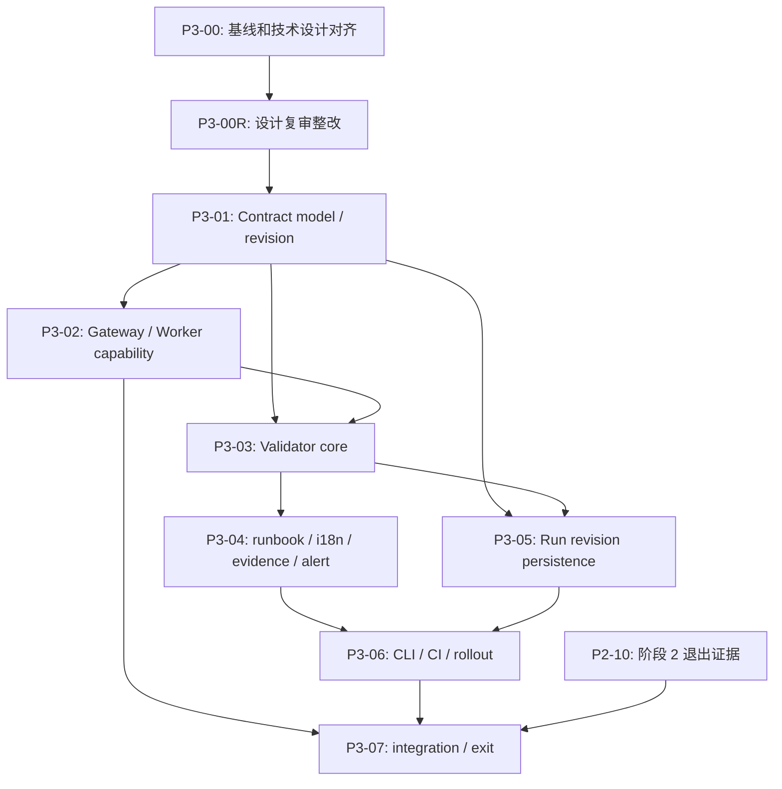

# 批次 3：Scenario Contract 实施任务清单

## 文档信息

| 项目 | 内容 |
| --- | --- |
| 状态 | 审查问题已拆入任务；P3-00R 设计决策未完成，Phase 3 Contract 实施尚未开始 |
| 版本 | 1.2 |
| 更新时间 | 2026-09-24 CST |
| 路线阶段 | [阶段 3：Scenario Contract](../../roadmap/phases/phase-3-scenario-contract.md) |
| 产品规格 | [product.md](./product.md) |
| 技术设计 | [tech.md](./tech.md) |
| 前置任务 | [批次 2：Worker 所有权与状态重协调](../batch-2-reconciliation/task-list.md) |
| 场景事实来源 | `traffic-control-plane/src/lib/fault-run-catalog.ts` |

## 1. 复核结论

### 1.1 已有基础与实施原则

实施不从空白开始，但也不能把已有底座误报为 Phase 3 Contract 已完成：

- Catalog 已包含 `targetPrepare`、`recoveryPolicy`、恢复策略和完整参数约束；`fault-run-catalog-revision.ts` 已生成被 batch-0 baseline 与现有测试使用的 64 字符 SHA-256 `catalogRevision`。
- Phase 2 已引入 owner-fenced `OwnedFaultRunDriver`、四类 driver registry、runnable Run 查询、recovery policy resolver、action journal、migration runner 和 deployment migration Job。
- `CART_CATALOG_DEPENDENCY` 已有 `ScenarioWorkers` 真实 customer-session / Gateway 路径；仍需由 Contract coverage 验证实际 dispatch、drain 和运行终态证据。
- runbook 已有 12 场景双语文章、静态 Tempo 展示 recipe 和覆盖测试；这些内容还不是结构化、run-relative Evidence Query Contract。
- 告警 intake 已有内部 webhook route、service credential 文件配置和受限 receipt；Compose/Kubernetes 仍是 generic receiver，尚不能宣称阶段 5 专用 Agent delivery 已就绪。
- 当前已有批次 2 的 implementation，不代表产品/技术文档中的所有旧基线陈述仍准确。实施前应先校正设计与代码边界，再新增 Contract 层。

### 1.2 设计复审结论（2026-09-24）

总体方向合理：Catalog 单一事实源、跨层只读校验、运行时 warning 优先、revision 原子写入和业务协议隔离均应保留。以下差异已在本清单落实为设计决策门禁、实施任务及完成证据；**任务覆盖不代表设计已定稿或能力已实现**：

| 设计范围 | 已有任务 | 复审结果 |
| --- | --- | --- |
| Catalog / Contract model、revision | P3-01 | 有任务；supplement 重复 Catalog 已有策略，参数排序与既有 revision 测试冲突，见 P3-ISSUE-007。 |
| Evidence Query 合同与历史解释 | P3-01、P3-04、P3-05 | 仅有 recipe/哈希任务；阶段 4 的受限模板、窗口/predicate 和历史 snapshot 边界未对齐，见 P3-ISSUE-008/009。 |
| Gateway、Worker 与恢复策略 | P3-02、P3-07 | driver coverage 有任务；真实目标服务 endpoint 校验及 WORKER release 例外不完整，见 P3-ISSUE-010/011。 |
| Validator、CLI 和 CI 门禁 | P3-03、P3-06 | 有任务；跨语言检查结果无法按当前顺序汇入同一份最终报告，见 P3-ISSUE-010。 |
| Run revision、迁移、Operator 读面 | P3-05 | migration/原子写入已有任务；旧运行在 Catalog 修改后的策略读取和 enforce 下的幂等 replay 未闭环，见 P3-ISSUE-008/012。 |
| 告警、资源预算和灰度退出 | P3-01、P3-04、P3-06、P3-07 | 有领域任务；阶段 5 关联字段、预算上界及批次 2 退出条件需明确，见 P3-ISSUE-011/013/014。 |

### 1.3 不可绕过的决策

1. Catalog 是唯一可变场景事实来源；不新建平行的手工 `scenario -> contract` registry。
2. Gateway target mapping 和 Worker drivers 保留各自所有权；用显式 descriptor / registry test 交叉校验，不解析源码 AST 或 prose。
3. Contract 校验错误必须带稳定 category、code、scenario 和 field path；严格 CI gate 不得以 warning 或缺省值代替。
4. 运行时 Contract validation mode 与 `FAULT_RUN_RECONCILIATION_MODE`、`FAULT_RUN_SAFE_RUNTIME_ENABLED` 分离；不能改变当前 owner、recovery 或 normal-task 隔离语义。
5. Contract revision 由服务端计算，在创建 Run 的事务中写入 Fault Run 行和 `CREATED` 事件；旧 Run 不回填当前 revision。
6. 场景启动、target prepare、真实效果、告警 receipt、观测证据、业务恢复和 cleanup 是不同事实，禁止相互推导。
7. Evidence/alert 声明只定义可信查询和关联边界；不保存现场观测结果，不承诺一定 firing，也不启用尚未部署的专用 Agent receiver。
8. P3-00R 只完成了问题识别；旧 Run 策略冻结、Evidence snapshot 归属、资源预算和发布门禁的方案未获产品/技术设计确认，不得按建议方案直接编码。先修订对应 `product.md`、`tech.md` 及阶段 4/5 的受影响边界。
9. 每次任务完成、阻塞、恢复或取消后立即更新本文件的复选框、任务组进度、总体状态、问题表和执行更新记录。

## 2. 任务状态规则

- `- [ ]`：未开始。
- `- [-]`：进行中；开始前先更新文件。
- `- [x]`：实现完成，且该任务声明的验证证据已记录。
- `- [!]`：阻塞；必须关联 `P3-ISSUE-nnn`，写清影响和下一步方案。
- `- [~]`：取消或由其他任务取代；必须解释原因和替代项。
- 只完成代码但没有完成该任务要求的验证，不得标记 `[x]`；标记 `[!]` 并说明缺少的证据。
- 一个任务完成后，立即同步修改本文件，不能等到整个任务组或批次结束再补记；记录变更范围、验证命令/结果、适用运行模式、限制与对应 issue。静态声明通过不等于实时效果、告警 firing 或业务恢复已验证。
- 新发现若改变数据所有权、状态语义、权限、外部协议、迁移或回退，先修订 `product.md`/`tech.md`，再继续实现。
- 禁止用重置 MySQL volume、删除历史 Run、跳过 migration verification 或关闭 CI gate 来制造通过结果。

## 3. 总体进度

- **总体状态：** P3-00 原定对齐工作已完成；P3-00R 设计复审整改进行中，Phase 3 Contract implementation pending。
- **当前任务：** P3-00R：处理 P3-ISSUE-007～014 的设计/验收歧义；尚未开始 P3-01 代码实现。
- **下一步：** 完成 P3-00R 中的产品/技术决策、跨阶段接口和 CI 门禁定稿，再启动 P3-01 实施。静态调研可并行；P3-07 canary/退出不能越过批次 2 的未完成门禁。
- **进度口径：** 仅按 `[x]` 子任务统计；代码存在但当前任务未验证的能力不能提前计入完成。

| 任务组 | 目标 | 状态 | 进度 | 前置依赖 |
| --- | --- | --- | --- | --- |
| P3-00 | 现状基线与技术设计对齐 | 已完成 | 7 / 7 | 当前仓库 |
| P3-00R | 设计复审整改与跨阶段接口定稿 | 进行中 | 1 / 10 | P3-00 |
| P3-01 | Catalog Contract supplement 与 revision | 待设计修订 | 0 / 7 | P3-00R |
| P3-02 | Gateway/Worker capability 对照与 recovery coverage | 待实施（基础复核已完成） | 1 / 8 | P3-00R、P3-01 |
| P3-03 | 纯函数 Contract validator 与稳定诊断 | 未开始 | 0 / 7 | P3-01、P3-02 |
| P3-04 | Runbook、i18n、evidence、alert、术语工件 | 未开始 | 0 / 8 | P3-01、P3-03 |
| P3-05 | Run revision migration、事务持久化与 Operator 读面 | 待设计修订 | 0 / 9 | P3-00R、P3-01、P3-03 |
| P3-06 | CLI、根级 gate、CI、配置与回退 | 待设计修订 | 0 / 9 | P3-00R、P3-02 至 P3-05 |
| P3-07 | 集成验证、canary 准入与阶段退出 | 前置门禁未满足 | 0 / 9 | P3-02 至 P3-06；批次 2 退出证据 |

## 4. 执行依赖

### 4.1 审查问题闭环映射

`P3-ISSUE-007`～`014` 均须先在 P3-00R 定稿决策，再按下表实施并登记验证；问题不能因“已有任务”而标为解决。

| 问题 | 设计定稿 | 实施任务 | 最低关闭证据 |
| --- | --- | --- | --- |
| P3-ISSUE-007 | Catalog 唯一策略源、revision 参数顺序 | P3-01、P3-03 | 无重复可变策略；参数重排不改变旧 hash，语义变更改变 per-run revision。 |
| P3-ISSUE-008 | 旧 Run 的执行 policy 与 Evidence snapshot 归属 | P3-05、P3-07 | Catalog 变更后旧 Run 不改用新策略/配方；历史来源不可用时明确受限；事务及 retention 测试通过。 |
| P3-ISSUE-009 | 阶段 4 可消费的受限 Evidence DSL | P3-01、P3-04、P3-07 | 窗口 policy、受控模板、scope/predicate/projection、effectRule 与 CURRENT read-check 可直接消费；非法输入失败。 |
| P3-ISSUE-010 | TS/Java/目标服务分阶段门禁 | P3-02、P3-06、P3-07 | Gateway 或目标服务测试缺失/失败时最终 report 非 valid；仓库 CI 必需检查有真实启用证据。 |
| P3-ISSUE-011 | 本地 Worker release 例外、P2 退出门槛 | P3-02、P3-07 | 两个 surge 的 target release 为 N/A 仍满足 drain/停止合同；P2-10 退出或批准的限制结论被引用。 |
| P3-ISSUE-012 | 幂等 replay 先于当前 Contract enforce | P3-05、P3-06、P3-07 | 旧 key/相同输入返回旧 revision 且不重发；冲突 key 仍拒绝，新建无效 Contract 在写入前拒绝。 |
| P3-ISSUE-013 | 阶段 5.0 的关联和 receipt 合同 | P3-01、P3-04、P3-07 | 关联窗口/状态、去重/重复/resolved、内外 receiver 分离、NOT_EXPECTED 边界可由阶段 5.0 消费。 |
| P3-ISSUE-014 | 每场景资源预算及例外 | P3-01、P3-03、P3-07 | 并发/字节上界或获批例外与运行保护可验证；未经决策不改变 Catalog 请求行为。 |

## 5. 实施任务

### P3-00：现状基线与技术设计对齐

**目标：** 以当前 Phase 2 和告警 intake 实现修正 Phase 3 技术设计中的过期假设，明确实现前置项和迁移序号。

- [x] 复核 Phase 3 product/tech/phase 与当前 Catalog、Catalog revision、recovery policy、Owned driver registry、migration runner、runbook、Alertmanager 配置和 alert-intake route；源文件在本清单第 1.1 节列明。
- [x] 修订 `tech.md` 的当前基线：`CART_CATALOG_DEPENDENCY` 已有真实 driver path；Phase 2 的 non-`OFF` runtime 由 Reconciler/owned drivers 执行；legacy `OFF` 与新模式分开说明。
- [x] 修订技术设计中的实现建议，使其复用 `getFaultRunDrivers()`、`listRunnableFaultRuns()`、`resolveFaultRunRecoveryPolicy()`、`FaultRunRecoveryExecutor`、`FaultRunDrainRegistry` 和现有 migration runner，不再要求已由 Phase 2 实现的平行机制。
- [x] 明确 revision migration 为 `006-fault-run-contract-revision.sql`，fresh-install init 顺序为 `10`；复用现有 migration runner，并规定 fresh-init 已加列时 migration runner 只在列定义精确匹配后记 history，定义不符则 fail closed。
- [x] 校准 cleanup 与告警现状：scenario-wide cleanup route 当前拒绝 runless cleanup；Alertmanager intake 已有内部接收，但没有专用外部 Agent child route/receiver。
- [x] 将 `NOT_CONFIGURED` recovery verification 和无阶段 4 查询执行器作为显式限制；Contract 结构校验不等于实际恢复验证或 Evidence Query 已运行。
- [x] 保留现有 `getCatalogRevision()` 的 64 字符 SHA-256 格式和消费者；只对新 per-run `contractRevision` 使用 `sc.v1:sha256:` 前缀，并让 Catalog revision canonical input 纳入新 Contract supplement。

### P3-00R：设计复审整改与跨阶段接口定稿

**目标：** 解决本轮复审发现的可实现性和验收矛盾；不在选择历史合同、查询 DSL 或预算策略前开始相关代码开发。

- [x] 核对 Phase 3 设计/任务与当前 Phase 2 代码、批次 4 Evidence 和批次 5.0 Alert 技术设计，记录 P3-ISSUE-007～014 的证据、影响和建议方案。
- [ ] 在 `product.md` 和阶段 3 路线文档明确 local Worker 的 stop/drain/验证如何满足 `WORKER` release；没有 Gateway target 的 surge 允许 `targetRelease=NOT_APPLICABLE`。标出 P2-10 的完成证据或需明确批准的限制结论作为 P3-07 canary/退出前提（P3-ISSUE-011）。
- [ ] 确定每场景资源预算或受控无固定上界例外：特别核对 surge `concurrency` 和 storage `totalBytes` 的实际保护、限时、影响范围与批准流程；先更新产品/技术验收，不直接改 Catalog 请求上限（P3-ISSUE-014）。
- [ ] 修订 `tech.md` 的 Catalog/Contract 单一事实源与 canonicalization：从已有 `targetPrepare`、`recoveryPolicy` 派生执行能力，仅补充缺失语义；保留原 64 位 Catalog hash 和参数顺序无关行为，单独定义表单展示顺序（P3-ISSUE-007）。
- [ ] 与批次 4 技术设计统一 Evidence Contract：窗口参数与硬上限、受限模板/作用域/判断/投影、`WINDOWED` 与 `CURRENT`、`effectRule` 以及 runbook Tempo 展示派生责任；不得留下自由查询文本作为第二数据源（P3-ISSUE-009）。
- [ ] 与批次 5.0 技术设计统一告警声明：内部接收与外部 receiver、关联窗口和 `faultRunCorrelation`、fingerprint/重复通知/resolved、保留与关闭条件；确定 `NOT_EXPECTED` 的 receipt policy 是否适用，不能以 `NOT_ENABLED_YET` 冒充投递成功（P3-ISSUE-013）。
- [ ] 在 `tech.md` 和受影响的阶段 4/5 文档确定历史边界：执行 policy / Evidence snapshot 的冻结或明确延期方案、旧 Run 的防漂移处理、数据保留与回退；不能仅凭 revision hash 还原过去的配置（P3-ISSUE-008）。
- [ ] 在 `tech.md` 决定新建与幂等 replay 的准入顺序和冲突规则：只对真正新 Run 执行当前 Contract enforce，同 key/同输入 replay 返回原 revision、不重新派发，异输入仍冲突（P3-ISSUE-012）。
- [ ] 定义 TS 静态预检、Gateway 与目标服务 Java endpoint 检查、最终 report 汇总的输入/输出和 fail-closed 规则；CI 门禁需区分 workflow 运行与仓库 required check 已设置（P3-ISSUE-010）。
- [ ] 依据已定稿的产品/技术文档逐项复核 P3-01～07、问题闭环表和失败验收样例；尚未定稿的选择保留未完成/阻塞状态，不允许计为 12/12 通过。

### P3-01：Catalog Contract supplement 与确定性 revision

**目标：** 在现有 Catalog 与 Catalog revision 机制上补充 Phase 3 语义，不复制场景基本事实。

- [ ] 按 P3-00R 定稿定义版本化 `ScenarioContractSupplement` / `ResolvedScenarioContract`，仅在 Catalog 的 `FaultRunScenarioDefinition` 挂载新增语义；从已有 `targetPrepare`、`recoveryPolicy.workerDrain` / `targetRelease` / `cleanup` 派生 dispatch 和 target lifecycle，不再另写可变 owner、prepare、release、cleanup 声明（P3-ISSUE-007）。
- [ ] 为全部 Catalog 场景补全参数消费者、可验证的 prepare/stop/recovery/side-effect/cleanup 检查 ID，校验消费者集合与 `parameters[]` 一致；driver owner 从现有 policy 与运行注册表求得，不以 `TARGET_ONLY` 或未实施 hook 占位（P3-ISSUE-007）。
- [ ] 按已确认的产品预算策略为全部场景声明并校验 duration、并发、字节/内存/存储等适用预算或有理由的例外及运行保护；单列 surge `concurrency`、storage `totalBytes` 的边界，未经 P3-00R 决策不改变 Catalog 准入行为（P3-ISSUE-014）。
- [ ] 为每个场景补齐阶段 4 可直接消费的 Evidence Contract：稳定 recipe ID、窗口 policy 与硬上限、受限 template ID/scope/predicate/projection、required、`effectRule`、`WINDOWED`/`CURRENT` 区分、固定只读 Gateway check 和 unavailable 语义；拒绝任意 PromQL/LogQL/TraceQL/URL/SQL 或 Operator 输入。业务 CURRENT check 不得证明历史效果（P3-ISSUE-009）。
- [ ] 为每个场景补齐阶段 5.0 可直接消费的 Alert Contract：`NOT_EXPECTED` / `CONDITIONAL` / `REQUIRED_FOR_PILOT`、允许的 name/service/severity/低敏标签、关联窗口和 `faultRunCorrelation`、缺失/重复/fingerprint/resolved/retention/显式关闭处理；内网 receipt 与专用外部 receiver 的 `send_resolved`、认证来源和 readiness 分别声明，不承诺 firing（P3-ISSUE-013）。
- [ ] 复用既有 canonicalization 规则解析 Contract：object key、无序 recipe/alert 集合稳定；原 Catalog revision 仍按参数名排序并保留 64 位 hex，表单展示顺序不进入旧 hash；新 per-run revision 用 schema 前缀，排除请求实际值、时间戳、翻译文案、URL、secret 与遥测结果（P3-ISSUE-007）。
- [ ] 用 12 场景 fixture 和变更 fixture 验证旧 `getCatalogRevision()` 调用者/参数重排兼容、Contract 语义变更引起相应 hash 变化、两种 revision 格式各自稳定，并证明 Stage 4/5 消费同一份 Catalog 派生数据而非第二份手写场景 map（P3-ISSUE-007/009/013）。

### P3-02：Gateway/Worker capability 对照与 recovery coverage

**目标：** 验证 Catalog 声明与真实执行者、固定目标、生命周期动作的覆盖关系；不建立新的运行时调度器。

- [x] 复核 Phase 2 已有四类 `OwnedFaultRunDriver`、`getFaultRunDrivers()`、owner fence 和 Catalog `recoveryPolicy`；其现状由批次 2 P2-05/P2-09 和 `fault-run-driver-registry.test.ts` 覆盖。
- [ ] 从现有 `getFaultRunDrivers()` / `OwnedFaultRunDriver` 及实际事件 writer 投影 owner/name、ACTIVE-only、drain owner 和终态 summary capability；使用真实 `supports(run)` 对 Catalog fixture 求覆盖，不建立第二份 `scenario -> owner` 数组。
- [ ] 用 12 场景矩阵证明恰好一个真实 driver 匹配；缺失、重复、孤儿 owner 均报 `missingDispatch`；Cart 的 `ScenarioWorkers` customer-session / Gateway 路径必须覆盖，不得标为 Runner/no-op。
- [ ] 对 legacy `OFF` 与 Reconciler 非 `OFF` 两种执行路径分别证明 effect driver 仅对 `ACTIVE` 发请求：`CREATING` 可执行已声明 PREPARE，`RECOVERING`/终态禁止新请求；owner 丢失后停止接收、取消并 bounded drain，不把公开请求当作可被 target fence 撤回。
- [ ] 逐场景对照 `recoveryPolicy.workerDrain.owner`、driver `drainOwner`、`FaultRunDrainRegistry` participant 和终态事件；缺席、超时或 `OUTCOME_UNKNOWN` 不得标成已 drained 或已恢复。
- [ ] 复用 `resolveFaultRunRecoveryPolicy()` 验证 PREPARE、RELEASE、`OPTIONAL_PER_RUN` / `OPERATOR_CONFIRMED` cleanup 与 `NON_RELEASING`；两个 local surge 的 target release 应为 `NOT_APPLICABLE`，但须有可验证 stop/drain 边界；不新增平行 resolver（P3-ISSUE-011）。
- [ ] 从 Gateway 真实 operation registry 建立只读测试 seam：十个 target-backed operation 的 service/prepare/release/cleanup 固定路径与 Catalog 对齐，两个 local surge 仅校验自己的 Worker target map；不能只比较两份手写字符串。
- [ ] 对十个 target-backed operation 的各目标服务添加/复用独立 controller mapping 与 wire-contract 测试，至少覆盖适用 prepare/release/cleanup 的请求字段、上下文校验及 `accepted`/业务 envelope；普通消费接口不得接收场景身份，Gateway 模块测试不能冒充跨服务验证（P3-ISSUE-010）。

### P3-03：纯函数 Contract validator 与稳定诊断

**目标：** 产出可单测、确定性、可解释的校验报告；CI 可以阻断缺项，运行代码不依赖仓库根目录。

- [ ] 实现 dependency-injected pure validator；输入为 resolved Catalog、capability descriptors 与预解析的 runbook/i18n/alert/config inputs，不直接访问 DB、网络、Gateway 或文件系统。
- [ ] 实现八类固定 issue category：`missingTarget`、`missingDispatch`、`invalidParameters`、`invalidRecoveryHook`、`missingEvidenceQuery`、`missingRunbook`、`missingI18n`、`invalidAlertContract`。
- [ ] issue schema 固定为 category/code/scenario/artifact/fieldPath/expected/actual/remediation；按稳定字段排序，避免任意原文、absolute path、secret 或 HTTP payload。
- [ ] 校验 Catalog 参数定义：唯一 name、kind/unit/default/options/min/max/maxLength、duration、缓存预算与消费者集合；资源上界或获批例外必须有对应保护/测试，不能因为现有 schema 未设 `max` 就自动通过 `invalidParameters`（P3-ISSUE-014）。
- [ ] 校验 Contract 声明与判断规则必须区分控制动作、effect observed、alert receipt、`EVIDENCE_UNAVAILABLE`、业务恢复和 cleanup；仅验证声明/适用性，不把静态通过当作现场效果。
- [ ] 为八类 issue 各提供至少一项负向 fixture，并包含重复/孤儿 driver、参数/预算缺失、无效窗口或任意查询、release 例外错配、告警关联字段缺失及 `ENABLED` 但 receiver 未就绪（P3-ISSUE-007/009/011/013/014）。
- [ ] 固定报告 schema、排序、错误码与 readiness 分离语义：TS 静态预检只表示本地部分通过；外部 Java/目标服务检查缺失、失败或版本不匹配时最终结果不得为 `valid`，不得以 `NOT_ENABLED_YET` 伪报已交付（P3-ISSUE-010）。

### P3-04：Runbook、i18n、evidence、alert 与术语工件

**目标：** 复用已有双语资料与告警 intake 输入，确保新增/变更场景不会在维护者和部署资料中漂移。

- [ ] 扩展 `runbook.test.ts` 为 Catalog-driven required headings / operation assertion；确保 12 个双语 allowlisted 文件逐个覆盖，生成 checklist 供人工核对，禁止靠解析 prose 推断机器语义。
- [ ] 扩展 i18n tests：Catalog 场景 label/description、参数 label/description、recovery label 均存在；`SCENARIO_META` 精确覆盖，每场景在且仅在一个 group。
- [ ] 用共享类型/fixture 对照阶段 4 技术设计的窗口 policy 与受控模板输入，校验固定只读检查、`WINDOWED` 与 `CURRENT` 的适用性、effect predicate 与 unavailable 规则；阶段 4 的窗口 resolver/查询执行器尚未实施，Phase 3 不执行遥测查询、不把 UI Tempo 提示当作历史证据（P3-ISSUE-009）。
- [ ] 将 `runbook.ts` 中重叠的 Tempo service/route/query 展示数据按定稿边界从 Catalog Evidence Contract 派生，保留 Markdown 解释与文件 allowlist；中英文文章仍可维护解释，但不能作为第二份机器查询定义（P3-ISSUE-009）。
- [ ] 从同一 Alert Contract 校验 Prometheus alert name/severity/静态 labels 与阶段 5.0 所需 correlation/receipt 声明；用 fixture 验证 fingerprint 去重、重复/`resolved` 及 `NOT_EXPECTED` 的**合同字段和适用性**，不把阶段 5.0 尚未交付的完整接收/关联行为计作 Phase 3 已实现（P3-ISSUE-013）。
- [ ] 读取并规范化 Compose 与 Kubernetes Prometheus/Alertmanager YAML；只比较部署语义与内部 receipt/专用外部 receiver 的各自规则，不读取运行时 DB 中的可编辑 secret；`NOT_ENABLED_YET` 只表明未启用。
- [ ] 扩展术语检查输入，使 scenario ID 从 Catalog 生成；保留控制面外 `src/**` 扫描范围，新增 Catalog ID 不再要求人工改写硬编码正则。
- [ ] 从 resolved Contract 生成确定性 manifest、预检报告、表单元数据、runbook checklist、smoke matrix、术语输入和**合同测试骨架**；在临时/CI artifact 中保存并校验 schema、无 secret 与重复生成一致，不覆盖生产代码或 Markdown。最终报告须等待 P3-06 的 Java 验证。

### P3-05：Run revision migration、事务持久化与 Operator 读面

**目标：** 让新 Fault Run 绑定创建时可解释的合同事实，保证历史行为、幂等 replay 和协议隔离；历史 snapshot 的落地阶段以 P3-00R 批准的设计为准。

- [ ] 新增顺序 migration `006-fault-run-contract-revision.sql` 和 fresh-install `infra/mysql/init/10-fault-run-contract-revision.sql`，对 `fault_runs` 增加 nullable `contract_revision VARCHAR(128)`；若 P3-00R 批准本批次冻结执行/Evidence 协议，同时增量定义其受控 schema 和 retention；历史行不得按当前 Catalog 回填（P3-ISSUE-008）。
- [ ] 将 `006` 加入现有 migration runner，扩展 `db:verify` 检查 revision 列；fresh install 由 `04` 创建基础表、`10` 增列，upgrade 由 `006` 增列；fresh-init 后再次 `db:migrate` 时只在 column definition 精确匹配后跳过 DDL 并记录 checksum，否则 fail closed。
- [ ] 在 `FaultRunRecord`、`CreateFaultRunInput` 和 row mapper 中加入 `contractRevision: string | null`；未迁移/legacy record 的 null 语义固定为 `LEGACY_UNVERSIONED`。
- [ ] `FaultRunCoordinator.create()` 在参数标准化后计算 server-side revision；create transaction 同时写 `fault_runs.contract_revision`、`CREATED.contractRevision` 及按批准方案需要冻结的受控协议，失败时全部回滚且未 dispatch PREPARE；legacy 与 Reconciler 两条创建路径一致。
- [ ] 按 P3-00R 批准的版本绑定或兼容门禁处理旧 Run：若冻结执行策略，recovery/cleanup 读取该 Run 创建时版本；若延期冻结，跨不兼容 Catalog 版本的控制动作必须被明确阻断/升级处置，不能悄悄使用新版 `getScenarioDefinition(run.scenario)`；Evidence snapshot 延至批次 4 时须同步其进入条件，`CONTRACT_SNAPSHOT_UNAVAILABLE` 不得以当前 Catalog 补齐；覆盖 retention/rollback（P3-ISSUE-008）。
- [ ] 在创建事务中区分同 key replay 与新 Run 的 Contract admission：同 key 同输入直接返回原 revision/事实且绝不重派发；不同输入仍冲突；仅新 Run 按当前 Contract `enforce`。覆盖并发同 key、当前 Contract 变更或无效及旧 Run null revision（P3-ISSUE-012）。
- [ ] 确保 state transition、audit attachment、stop/release/cleanup 与历史回放均不改最初 revision / frozen policy；历史 schema 不可解释或缺失时明确 limitation/fail-closed，不伪造成功。
- [ ] Operator list/detail 只在控制面读面显示 revision/hash 与旧数据状态；不展示 contract 全文、密钥、任意 alert labels 或客户数据。
- [ ] 添加 boundary tests：`toGatewayPayload()`、owned driver context、`FaultRunContext`、Gateway headers/body、cleanup action payload 和 consumer response 均不出现 contract/catalog/run lifecycle identity。

### P3-06：CLI、根级 gate、CI、配置与回退

**目标：** 把 contract validation 变成必需静态发布门禁；运行时从 warn 安全灰度到 enforce。

- [ ] 增加 `test:contract`、`validate:contract` 和 JSON/text **静态预检** CLI，确定性生成受控 Catalog/Gateway 期望与 issue；CLI 不建立 DB 连接、不请求环境、不触发 smoke，也不能在跨语言结果未到时输出“12/12 valid”。
- [ ] 增加根级 `scripts/test-scenario-contract.sh` 的分阶段编排：先生成预检/临时期望，再运行 Contract fixtures、runbook/i18n、术语、typecheck/lint，最后等待 Java 检查完成；临时文件带 schema/revision 并清理，不当作新的运行时映射。
- [ ] 用既有 Maven 工具执行 Gateway registry、目标服务 controller/wire contract 的针对性测试；产出可验证的结构化结果，覆盖十个 target-backed operation，结果必须与同一次 Catalog revision 匹配，缺失/失败不可被默认成功（P3-ISSUE-010）。
- [ ] 最终汇总 TS 预检与 Java/目标服务结果后再生成 `valid` 和八类 issue 报告；缺测试结果、revision 不匹配、执行中断或任一必需 endpoint 不通过均返回非零并标明限制，不允许以仅 TS 或仅 Gateway 测试冒充 12/12（P3-ISSUE-010）。
- [ ] CI 中接入完整静态门禁，成功/失败均上传去敏的 manifest/预检/最终报告；单独确认仓库对应 branch protection/ruleset 中该 job 已设为 required，无法设置时登记阻塞，不把“新增 workflow”标为发布阻断已生效；full Compose smoke 独立隔离运行。
- [ ] 在 `env.ts` 严格解析独立的 `SCENARIO_CONTRACT_VALIDATION_MODE=warn|enforce`，Web/Worker 同值、非法值 fail-fast；mode 不影响 Phase 2 owner/reconciliation 开关。
- [ ] `warn` 只写控制面低基数诊断；`enforce` 仅拒绝真正的新 Run、在写入和 target action 前失败；existing Run 和已存 key replay 沿原合同处理，不中断 stop/recovery、normal runner、warmup、补给或 retention（P3-ISSUE-008/012）。
- [ ] 更新 Compose、Kubernetes Web/Worker、现有 migration Job 和发布说明，证明先 `db:migrate` / `db:verify` 再发布读写新列的应用，并检查混合版本过渡、模式配对和 active Run 处置。
- [ ] 记录并验证降级路径：先从 enforce 回 warn、停止新 claim/控制动作（若方案需要）、保持 revision/frozen data 和历史事件、核对 active Run 与旧版本可读性；不删列、不重置 volume、不关闭 CI gate 掩盖 drift。

### P3-07：集成验证、canary 准入与阶段退出

**目标：** 以目标行为证据验证 Contract，而不是只凭类型、manifest 或测试 fixture 宣称跨层闭环。

- [ ] 首先核对批次 2 P2-10 的双 Worker/unknown outcome 等未完门禁；只允许 Phase 3 静态准备先行。P3-07 canary/退出须记录批次 2 已通过的证据或正式批准、可追踪的限制结论，不以 P3 合同测试代替 P2 owner/fence 验收（P3-ISSUE-011）。
- [ ] 跑受影响的 targeted 单元测试：12 场景 derived policy/revision、八类负向 fixture、资源预算/例外、Evidence/Alert 合同、ACTIVE/drain/recovery、旧 Run 漂移/幂等 replay 和缺少 Java 结果；每项给出实际通过/失败摘要（P3-ISSUE-007～014）。
- [ ] 跑已有 `pnpm test:runner`、`pnpm test:runbook`、`pnpm test:i18n`、typecheck、lint、build 与 `check-runtime-terminology.sh`，失败逐项登记；静态通过不得宣称告警已 firing 或业务已恢复。
- [ ] 运行 Gateway registry 及所有适用 target controller/wire Maven tests，检查真实 endpoint、Generic DTO、可见错误和消费者信息隔离；仅比较手写字符串或只跑 Gateway 不满足门禁（P3-ISSUE-010）。
- [ ] 在 disposable MySQL 分别核对 fresh init、`005 -> 006` upgrade、重复 `db:migrate`、history/列定义不符、legacy null、原子创建/回滚、同 key 幂等和按批准方案的旧 Run policy/snapshot/retention；不触碰共享数据库。
- [ ] 在隔离环境创建并终止至少一个适用的真实 Fault Run，对照 Operator revision、`CREATED` event、Owner/Worker/recovery 时间线与 Gateway/consumer header/response；新旧模式各自的证据不得互相替代。
- [ ] 按 generated smoke matrix 为 12 场景逐个审查实际目标业务路径、准备/停止/清理边界和运行前提；只能在适用的可丢弃环境演练高风险场景，未运行的必须写明限制，不把一场景 smoke 或 TS 12/12 当作全场景现场验收。
- [ ] 用 TS + Java/target 全部验证结果生成最终逐场景 `valid` / `blocked` / `limited` 报告；缺少任何必需结果不得计入 12/12。告警 delivery `NOT_ENABLED_YET`、观测不可用、验证未配置与不匹配只能表述为能力限制，不等于合同静态校验通过后现场效果已发生。
- [ ] canary 前记录 migration/verifier、Web/Worker mode、active/recovering Run、Runner/warmup/补给基线、清理责任人和停止窗口；演练 enforce -> warn 与 active Run 处置、核查残留和回退后正常业务/协议隔离，再以批次 2 前置证据及本批次门禁判断是否退出。

## 6. 阶段 3 退出标准

- 12 个 Catalog 场景都解析成唯一、版本化的 resolved Contract；每个场景恰有一个真实 dispatch owner。
- `targetPrepare`、release/drain/cleanup 以 Catalog 既有字段为事实源；Catalog 旧 revision 格式与参数重排语义保持兼容，Contract per-run revision 独立版本化；全部场景的预算或获批例外有校验及运行保护证据。
- 八类固定校验均有负向测试；缺 target/dispatch、预算/参数消费者、recovery hook、受限 Evidence Query、runbook、i18n 或阶段 5 可消费的 alert contract 时 strict gate 失败。
- 目标路径、Worker driver、owner/recovery policy、runbook/i18n、Evidence recipe 与 alert 声明无未解释漂移；Gateway 和对应目标服务 Controller 均由真实代码测试，而非第二份手工映射。
- 新 Fault Run 的 revision 在数据库行和 `CREATED` event 一致；历史执行 policy / Evidence 查询协议按 P3-00R 定稿归属冻结或明确限制，旧 Run 保持 null/unknown，不用新 Catalog 冒充历史合同；幂等 replay 返回原 revision 且不重发动作。
- contract metadata 不进入 consumer、Gateway、target service 或外部 Agent payload；外部系统只接收其业务允许的通用协议。
- 告警未 firing、receipt 未到达、观测数据不可用、无法唯一关联和业务恢复未验证均可显式表达；`NOT_ENABLED_YET` 不等于阶段 5 receiver 已上线，静态配方不等于现场已查询。
- TS 预检和 Gateway/目标服务测试汇总后才能产生最终 12/12 报告；CI job 确认为仓库 required check，缺少/失败的跨语言结果必须阻断；运行时默认 warn，enforce 仅在已证实的新 Run admission 边界启用。
- 批次 2 P2-10 退出或批准的限制结论、迁移 fresh/upgrade/重复运行、active Run 处置、可丢弃环境 canary 和回退均有可复核证据；缺一项不能声明 Phase 3 退出。

## 7. 问题跟踪

| ID | 发现阶段/任务 | 问题 | 影响 | 处理方案 | 状态 |
| --- | --- | --- | --- | --- | --- |
| P3-ISSUE-001 | P3-00 | 现有 tech 描述与 Phase 2 交付存在漂移，尤其是 driver/recovery owner、`CART_CATALOG_DEPENDENCY` coverage 和旧 scanner 描述。 | 若照旧设计直接执行，可能重复建设执行器或错误宣称场景 dispatch 缺失。 | P3-00 已依据 `WorkerRuntime`、Reconciler、Owned drivers、Catalog recovery policy 和 task evidence 校准；Contract validator 复用这些 seams。 | 已解决（设计修订） |
| P3-ISSUE-002 | P3-00/P3-05 | 当前 migration runner 固定执行 `001`–`005`；fresh MySQL init 与之后 `db:migrate` 都可能尝试应用 revision column DDL。 | 若只依赖 `CREATE TABLE IF NOT EXISTS`，旧 volume 不会加列；若简单忽略 duplicate-column，错误定义也可能被当作迁移成功。 | migration 计划已校准为 `006` + fresh-install init `10`；runner 仅在列定义精确匹配时跳过 DDL并记 history，不存在则 ALTER、不匹配则 fail；实际实现和 verifier 测试由 P3-05 完成。 | 方案确认（实施待 P3-05） |
| P3-ISSUE-003 | P3-03/P3-04 | 当前有 UI Tempo recipe 和 alert receipt intake，但没有全场景 run-relative Evidence Query Manifest，也没有专用外部 Agent alert delivery。 | 无法将现有文档或 intake 路由误称为证据查询和 Agent 投递已完成。 | Contract 单独声明 recipes/readiness；报告 `EVIDENCE_UNAVAILABLE` 和 `NOT_ENABLED_YET`；后续批次负责实际 query/专用 receiver。 | 待处理 |
| P3-ISSUE-004 | P3-02/P3-07 | Catalog verification 当前为 `NOT_CONFIGURED`，Contract 可定义 recovery checks，但仍没有所有场景可执行的统一 verification adapter。 | 不可因 worker drain/release 成功就把业务恢复判为已验证。 | Contract validation 校验检查声明与 availability；运行/报告继续使用 `UNKNOWN`/`VERIFY_UNAVAILABLE`，由后续 Evidence/verification 工作补齐。 | 待处理 |
| P3-ISSUE-006 | P3-00/P3-05 | MySQL `infra/mysql/init/10` 与 control-plane `db:migrate` 可能先后应用同一 `contract_revision` ALTER。 | 重复 DDL 可能阻断 fresh deployment，或以吞错方式掩盖列定义漂移。 | P3-05 增加受控目标态检查：精确匹配才 skip+记录 history；不存在执行 ALTER；存在但定义不符则失败；`db:verify` 校验 history 与列定义一致。 | 方案确认（实施待 P3-05） |
| P3-ISSUE-005 | P3-00/P3-01 | 已有 `getCatalogRevision()` 返回 64 字符小写 SHA-256，且 baseline/tests 依赖此格式；若按早期设计统一改为 `sc.v1:sha256:` 会破坏兼容性。 | baseline、revision 格式校验和既有调用方可能同时漂移。 | 保留 `catalogRevision` 原格式；Contract 单 Run revision 新增带 schema prefix 的 `contractRevision`，补充 canonicalization compatibility tests。 | 已解决（设计修订；实现待 P3-01） |
| P3-ISSUE-007 | 设计复审 / P3-01 | supplement 的 `dispatch.owner`、`requiresDrain`、`targetLifecycle.prepareRequired/release/cleanup` 重复 Catalog 的 `targetPrepare` 和 `recoveryPolicy`；新 canonicalization 要求参数顺序影响 hash，既有 revision 测试要求顺序无关。 | 产生第二份可变策略；UI 排序变化会让已有 Catalog revision 无端漂移。 | supplement 只保留新的检查、证据、告警和消费者信息；现有执行策略从 Catalog 派生。Catalog hash 保持按参数名排序，表单顺序另行表示；测试两种 revision。 | 待设计修订（P3-01 前） |
| P3-ISSUE-008 | 设计复审 / P3-05 | 批次 3 只持久化 per-run hash，当前 recovery/cleanup 多处按 scenario 读取最新 Catalog；批次 4 却要求创建事务内有 frozen Evidence Contract snapshot。 | Catalog 改动可能改变旧 Run 的 release/cleanup；hash 无法还原历史查询协议，阶段 4 进入条件不成立。 | 优先在创建事务冻结执行关键 policy 和 Evidence 查询协议，让恢复消费对应版本。若 snapshot 留给批次 4，需调整其进入条件并禁止存续 Run 跨不兼容 Catalog 版本执行。 | 待设计决策（P3-05 前） |
| P3-ISSUE-009 | 设计复审 / P3-01/P3-04 | 批次 3 的 evidence 只有 `window` 枚举、自由形式 `queryTemplateOrOperation` 和规则 ID；批次 4 需要窗口参数、受限模板/Scope/Predicate/Projection、`CURRENT` read-check 与 `effectRule`，且 runbook Tempo 来源需要收敛。 | 阶段 4 无法直接安全消费批次 3 配方，会重新建立可变查询事实。 | 在 P3-01 先统一受限 Evidence Contract 类型和窗口/判断 DSL；P3-04 负责 runbook Tempo 派生与校验，批次 4 只实现查询执行。 | 待设计修订（P3-01 前） |
| P3-ISSUE-010 | 设计复审 / P3-02/P3-06 | 设计让 `validate:contract` 在 Gateway Maven test 之前报告 `valid`，但 `missingTarget` 又依赖 Java 结果；只跑 `gateway-service -am` 无法检查其他目标服务的 Controller mapping。 | 报告可能假报 12/12 通过，真实 target path 未验证；CI job 存在也不等于 required status check。 | 分开生成 expectation、运行 Gateway/目标服务各自 endpoint test、汇总最终 report；仅在全部必需结果齐全时输出 `valid`。CI 覆盖相关 runtime 回归并确认 required check。 | 待设计修订（P3-06 前） |
| P3-ISSUE-011 | 设计复审 / P3-07 | Product/roadmap 写 `TARGET` / `WORKER` 都须 release，两个 surge 场景实际 `targetRelease=NOT_APPLICABLE`；批次 2 P2-10 的退出证据仍未完成，而阶段 3 依赖批次 2。 | 按字面会错误拒绝合法场景；阶段 3 可能在 owner/takeover 运行门禁未过时误报退出。 | 明确本地 Worker 的 stop/drain/验证是 release 能力，target release 可为 N/A；允许静态准备先行，但 P3-07 canary/退出须引用批次 2 的完成或经审计的限制结论。 | 待产品/阶段文档对齐 |
| P3-ISSUE-012 | 设计复审 / P3-05/P3-06 | `enforce` 拟在 `store.create()` 前拒绝当前非法 Contract；现有同 key 的幂等记录只能在 `createFaultRun()` 内读取，设计又承诺 Catalog 改动后返回原 revision。 | 当前 Contract 漂移时，同 key replay 会被误拒而非返回旧 Run。 | 在受控事务中先识别严格 replay，返回已存 revision 且不再派发；只有真正新建 Run 执行当前 Contract enforce。增加 invalid-current-contract 的 replay/冲突测试。 | 待设计修订（P3-05 前） |
| P3-ISSUE-013 | 设计复审 / P3-01/P3-04 | 批次 3 alert 类型缺少批次 5.0 要求的 `correlationWindowSec`、`faultRunCorrelation`、独立的 control-plane `sendResolved` 和重复通知策略；`NOT_EXPECTED` 分支未明确 receipt policy 是否不适用。 | 批次 5.0 无法直接消费 Phase 3 合同，会在 webhook 层补第二份关联规则。 | 对齐阶段 5.0 的关联/receipt 字段，分别声明内部接收与外部 receiver 规则、重复通知处理及 `NOT_EXPECTED` 的适用边界。 | 待设计修订（P3-01 前） |
| P3-ISSUE-014 | 设计复审 / P3-01/P3-03 | 产品/阶段文档要求 resource budget；当前 surge `concurrency` 与 notification storage `totalBytes` 无最大值，任务只验证已有的 min/max。 | 12/12 静态校验可通过，但合同仍不能表达部分场景的资源上界/保护机制。 | 定义明确预算或受控的不设上界例外与运行保护；先确认行为边界，再决定是否改 Catalog 上限。 | 待预算策略决策 |

## 8. 执行更新记录

| 时间 | 任务 | 事实与证据 | 限制/下一步 |
| --- | --- | --- | --- |
| 2026-09-24 CST | P3-00：现状复核与任务拆分 | 对照 Catalog/revision/recovery policy、四类 owned drivers、Scenario/Reconciler、migration runner、cleanup route、runbook/i18n 和 Alertmanager intake；确定 `CART_CATALOG_DEPENDENCY` 的 ScenarioWorkers owner、`FAULT_RUN_RECONCILIATION_MODE` 接线、cleanup 只能 per-run confirmed、已有 `001`–`005` migration foundation。 | 任务清单建立；Contract supplement、validator、per-run `contractRevision`、静态 gate 均仍待实施。 |
| 2026-09-24 CST | P3-00：技术设计与 Phase 2 实现对齐 | 修订 `tech.md`：分别描述 legacy、safe-runtime 和 non-`OFF` Reconciler；改正 Cart owner；复用现有 driver registry/ACTIVE admission/drain registry/recovery policy executor；将 notification storage cleanup 定为 Operator-confirmed per-run，runless route 为拒绝；确认 migration `006` 与 fresh init `10` 复用现有 CLI/Job，并处理 init 与 `db:migrate` 重复 ALTER；保留 `NOT_CONFIGURED` verification 与 generic alert receiver 限制；区分兼容的 catalog hash 与新增 contract hash。 | P3-00 关闭。P3-ISSUE-001 已解决；P3-ISSUE-002/006 方案已确认、代码待 P3-05；P3-ISSUE-005 格式决策已解决、兼容测试待 P3-01。下一步 P3-01。 |
| 2026-09-24 CST | P3-00R：Phase 3 技术设计/任务覆盖复审 | 对照 Phase 3 产品、路线、技术设计、P3-00～07 任务，核实 Phase 2 Catalog/recovery/driver/migration 代码与 P2-10 状态，并检查批次 4 Evidence、批次 5.0 Alert 的交接合同。任务分组覆盖主要设计范围，但 P3-ISSUE-007～014 尚未闭环。 | 本次只记录审查发现与解决建议，未实施或批准运行时/数据模型变更；P3-00R 为 1/6。先修订相应设计与任务，再启动受影响的 P3-01/P3-05/P3-06。P3-07 保留批次 2 退出门禁。 |
| 2026-09-24 CST | P3-00R：审查方案落实到任务清单 | 将 P3-ISSUE-007～014 逐项映射至设计定稿、P3-01～07 实施和最低完成证据；细化参数预算、Stage 4 Evidence DSL/历史策略、Stage 5 告警关联、Java target endpoint、TS+Java 最终门禁、幂等 replay 与 P2-10 退出前提，并更新任务组计数与退出标准。 | 仅编辑本清单，Product/tech 和历史合同归属等设计仍待 P3-00R 定稿；P3-00R 保持 1/10，P3-01～07 未新增已完成项，Phase 3 未实施。 |

## 9. 每次任务更新模板

每完成、阻塞、恢复或取消一个子任务，紧接着追加一行到“执行更新记录”，并同步更新“总体进度”、任务组计数和“问题跟踪”：

| 时间 | 任务 | 事实与证据 | 限制/下一步 |
| --- | --- | --- | --- |
| YYYY-MM-DD CST | P3-nn / 子任务 | 变更文件、命令及通过/失败摘要；若是设计任务，写明校准的事实。 | 尚存问题、明确阻塞/方案或下一个可执行任务。 |
