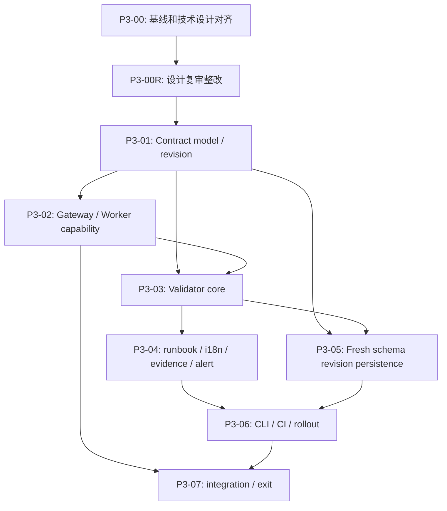

# 批次 3：Scenario Contract 实施任务清单

## 文档信息

| 项目 | 内容 |
| --- | --- |
| 状态 | P3-00R 决策及复审缺口已同步；Phase 3 Contract 实施已启动，当前进行 P3-01 |
| 版本 | 2.2 |
| 更新时间 | 2026-09-29 CST |
| 路线阶段 | [阶段 3：Scenario Contract](../../roadmap/phases/phase-3-scenario-contract.md) |
| 产品规格 | [product.md](./product.md) |
| 技术设计 | [tech.md](./tech.md) |
| 前置任务 | [批次 2：Worker 所有权与状态重协调](../batch-2-reconciliation/task-list.md) |
| 场景事实来源 | `traffic-control-plane/src/lib/fault-run-catalog.ts` |

## 1. 复核结论

### 1.1 已有基础与实施原则

实施不从空白开始，但也不能把已有底座误报为 Phase 3 Contract 已完成：

- Catalog 已包含 `targetPrepare`、`recoveryPolicy`、恢复策略和完整参数约束；`fault-run-catalog-revision.ts` 已生成被 batch-0 baseline 与现有测试使用的 64 字符 SHA-256 `catalogRevision`。
- Phase 2 已引入 owner-fenced `OwnedFaultRunDriver`、四类 driver registry、runnable Run 查询、recovery policy resolver、action journal、migration runner 和 deployment migration Job。
- `CART_CATALOG_DEPENDENCY` 已有 `ScenarioWorkers` 真实 customer-session / Gateway 路径；仍需由 Contract coverage 验证实际 dispatch、drain 和运行终态证据。
- runbook 已有 12 场景双语文章、静态 Tempo 展示 recipe 和覆盖测试；这些内容还不是结构化、run-relative Evidence Query Contract。
- 告警 intake 已有内部 webhook route、service credential 文件配置和受限 receipt；Compose/Kubernetes 仍是 generic receiver，尚不能宣称阶段 5 专用 Agent delivery 已就绪。
- 当前已有批次 2 的 implementation，不代表产品/技术文档中的所有旧基线陈述仍准确。实施前应先校正设计与代码边界，再新增 Contract 层。

### 1.2 用户已确认的设计选择（2026-09-26）

1. **数据库 schema：** 部署清空数据库并重建；不增加旧库 upgrade migration。`contract_revision` 在三份 fresh schema 中 `NOT NULL`，不设计旧行 null/legacy compatibility；`db:verify` 检查该列，非 clean schema fail fast。
2. **合同快照与 revision：** Phase 3 只保存全局 `catalogRevision` 与 per-run 完整 `ResolvedScenarioContract` 的 `contractRevision`，不保存完整 Contract JSON；Batch 4 仅在自己的 capture flag 启用时冻结 Evidence plan，并用独立 `contractHash` 校验 snapshot，不重算 `contractRevision`。
3. **事实来源：** `targetPrepare`、`recoveryPolicy`、dispatch/drain owner 继续从 Catalog 和现有 driver registry 派生；supplement 只存新增的参数消费者、预算/guard、检查 ID、Evidence 与 Alert 语义。
4. **Evidence/Alert 接口：** Evidence 复用 Batch 4 受限 DSL，runbook Tempo 配方从同一 Contract 派生。Alert 字段对齐 Batch 5.0；receipt 使用其全局 `alert-receipt.v1` policy。`NOT_EXPECTED` 不做 Fault Run correlation，但保留通用 receipt；外部 Agent receiver readiness 独立表达。
5. **资源预算：** surge `concurrency` 上限为 `128`；storage `totalBytes` 不设静态绝对上限，使用目标服务 filesystem usable-space guard；`minFreeBytes` 范围为 `1 MiB`–`1 GiB`，Catalog 与目标服务同步限制。
6. **运行时/CI：** `SCENARIO_CONTRACT_VALIDATION_MODE=warn|enforce` 仅由 Web/API 的专用配置读取并应用于新 Run admission；Worker 不解析。跨服务检查由外部 CI 调用根级脚本并设为阻断，本仓库不新增 GitHub Actions workflow。保留全局 64-hex `catalogRevision` 与 per-run `sc.v1:sha256:` `contractRevision`；hash 按参数名排序，展示顺序不参与。
7. **部署/canary：** canary 只在数据库与业务资源均可丢弃的单 Worker 环境，`FAULT_RUN_RECONCILIATION_MODE=OFF`；不要求 pre-reset Run 级 cleanup gate，也不声称 Phase 2 多 Worker/TAKEOVER 已验证或以 P2-10 作为本 canary 前置条件。完整 reset 由部署平台/运维流程执行并记录；不新增仓库 wipe 工具。
8. **恢复策略：** local Worker 的 stop/drain/verification 满足 `WORKER` 适用的 recovery action；不存在 Gateway target 时 `targetRelease=NOT_APPLICABLE` 合法。
9. **幂等：** 仅保证同一部署内按当前 Catalog 校验/标准化参数的 replay；精确 replay 绕过新 Run Contract admission；环境重建清除旧 key/Run，不支持跨部署 replay。
10. **revision scope：** `contractRevision` 覆盖完整 `ResolvedScenarioContract`；Batch 4 原样引用并用 Evidence-only `contractHash` 校验 snapshot。
11. **CI/report：** 所有 required checks 都记录后才 finalize；最终报告有 `VALID`/`BLOCKED`/`LIMITED`、blocking issues 和 readiness notes。任何 required failure 先出 BLOCKED report 再非零退出。
12. **跨阶段职责：** Phase 3 owns Evidence DSL 类型；RCA submission window/refusal 归 Batch 5.1，Evaluator case close/expiry 归 Batch 5.2。
13. **Heap budget：** `NOTIFICATION_HEAP_PRESSURE` 无 aggregate cap，显式标为 disposable-only、non-releasing exception；OOM/服务重启可能。
14. **Validation mode：** 仅 Web-only bootstrap/config 严格解析 `SCENARIO_CONTRACT_VALIDATION_MODE`；Worker/shared `env.ts` 不读取或解析。
15. **Reset evidence：** clean-slate 是部署平台/运维流程责任；reset MySQL、Redis、scenario-owned resources 并留下记录，现有 `mysql-reset.sh` 单独不满足。
16. **Heap scenario eligibility：** Web/API-only `SCENARIO_CONTRACT_DEPLOYMENT_SCOPE` 缺省为 `retained`；只有显式标为 `disposable` 才允许创建 `NOTIFICATION_HEAP_PRESSURE`，该 hard gate 不受 `warn` mode 绕过。
17. **Alert correlation timing：** 所有 Catalog allowed-alert correlation 使用 `correlationWindowSec=900`、`activeGraceBeforeSec=900`、`recentGraceAfterSec=900`；Batch 5.0 直接消费这些值，不维护另一套默认值。
18. **Evidence template coverage：** 为 PSP provider failure/timeout 与 node filesystem growth 增加固定模板 `PAYMENT_FAILURE_RATIO`、`PAYMENT_TIMEOUT_RATE`、`NODE_FILESYSTEM_GROWTH_RATE`，只映射现有 Prometheus metrics，不提供 free-form queries 或新增业务端点（P3-ISSUE-034）。

### 1.3 设计复审结论（2026-09-24，按 2026-09-26/28 决策收敛）

总体方向合理：Catalog 单一事实源、跨层只读校验、运行时 warning 优先、revision 原子写入和业务协议隔离均应保留。以下差异已在本清单落实为设计决策门禁、实施任务及完成证据；**任务覆盖不代表设计已定稿或能力已实现**：

| 设计范围 | 已有任务 | 复审结果 |
| --- | --- | --- |
| Catalog / Contract model、revision | P3-01 | 方案已定：supplement 不重复既有策略；参数名排序保留；owner 从实际 driver 派生；`catalogRevision` 保持 64-hex，见 P3-ISSUE-007。 |
| Evidence Query 合同与历史解释 | P3-01、P3-04、P3-05 | 方案已定：Phase 3 是 Evidence DSL 的唯一类型来源并保存 full `contractRevision`；Batch 4 capture 使用同一 plan，以独立 `contractHash` 校验快照，见 P3-ISSUE-008/009/017/021。 |
| Evidence template coverage | P3-01、P3-04、Batch 4 | 用户已批准在 finite DSL 中增加 payment failure/timeout 与 node filesystem growth 的固定模板，严格对应已有 Prometheus metrics；不增自由查询或业务端点，见 P3-ISSUE-034。 |
| Gateway、Worker 与恢复策略 | P3-02、P3-07 | 方案已定：本地 Worker stop/drain 合法替代不存在的 target release；目标服务 Controller 需独立测试，见 P3-ISSUE-010/011。 |
| Validator、CLI 和 CI 门禁 | P3-03、P3-06 | 方案已定：全部 required TS/文档/Java results 汇总后才 finalize；报告区分 `VALID/BLOCKED/LIMITED` 与 readiness；运行时只验证 Web 进程事实；外部 CI 调根脚本，不新建 GHA，见 P3-ISSUE-010/015/019/020/024。 |
| Run revision、fresh schema、Operator 读面 | P3-05 | 方案已定：三份 fresh DDL 使用 `NOT NULL`，无旧库 migration/legacy null/cross-deploy replay；full-contract `contractRevision` 与 Evidence `contractHash` 分离，见 P3-ISSUE-002/006/008/012/016/017/018。 |
| Validator/CI/report 状态 | P3-03、P3-06、P3-07 | 方案已定：所有 required check 完成/失败后才 finalize；三态报告分离 blocking 与 readiness；外部 CI blocking，见 P3-ISSUE-019/020。 |
| Evidence/Alert/阶段归属 | P3-01、P3-04 | Phase 3 是 Evidence DSL 唯一类型来源；RCA submission 归 5.1，Evaluator close 归 5.2，Phase 3 只保留 receipt/correlation，见 P3-ISSUE-021/022。 |
| Lifecycle control facts 与 Evidence check refs | P3-01～04 | Prepare/stop/cleanup 引用受控 event/action types；recovery/side-effect check 引用 Evidence recipe；cleanup verification 使用 `window=cleanup` recipe，不维护第二份 check map，见 P3-ISSUE-028。 |
| 资源预算与部署边界 | P3-01、P3-02、P3-05～07 | Heap aggregate 无 cap 作为 disposable non-releasing exception，Web 新 Run 有 hard scope gate；surge API/Worker 均强制 concurrency ≤128；admission config 为 Web-only；full clean-slate reset 由外部流程执行并记录，见 P3-ISSUE-023～026/029。 |
| Admission response 与发布制品 | P3-05～07 | Named admission failures 使用固定 Operator envelope/status；Kubernetes migration/verify 必须先于应用启动；release attestation 绑定 source commit、不可变服务 image digests 与 final report hash，见 P3-ISSUE-027/031/032。 |
| Alert correlation timing | P3-01、Batch 5.0 | 用户已定所有允许告警统一采用 900 秒 correlation window、active 前 grace 与结束后 grace；Batch 5.0 消费 Catalog 值，不复制默认值，见 P3-ISSUE-033。 |

### 1.4 不可绕过的决策

1. Catalog 是唯一可变场景事实来源；不新建平行的手工 `scenario -> contract` registry。
2. Gateway target mapping 和 Worker drivers 保留各自所有权；用显式 descriptor / registry test 交叉校验，不解析源码 AST 或 prose。
3. Contract 校验错误必须带稳定 category、code、scenario 和 field path；严格 CI gate 不得以 warning 或缺省值代替。
4. 运行时 Contract validation mode 与 `FAULT_RUN_RECONCILIATION_MODE`、`FAULT_RUN_SAFE_RUNTIME_ENABLED` 分离；不能改变当前 owner、recovery 或 normal-task 隔离语义。
5. Contract revision 由服务端计算，在创建 Run 的事务中写入 Fault Run 行和 `CREATED` 事件；旧 Run 不回填当前 revision。
6. 场景启动、target prepare、真实效果、告警 receipt、观测证据、业务恢复和 cleanup 是不同事实，禁止相互推导。
7. Evidence/alert 声明只定义可信查询和关联边界；不保存现场观测结果，不承诺一定 firing，也不启用尚未部署的专用 Agent receiver。
8. P3-00R 已收到本清单 1.2 的选择；正式 design/task 文档对齐前，不开始 P3-01/P3-05/P3-06 代码实现。
9. 当前 clean-slate 部署无旧数据兼容要求；`contract_revision` 必须由 fresh schema 保证非空，不添加为了 legacy rows 的 null fallback、upgrade migration 或跨部署 idempotency replay。
10. 每次任务完成、阻塞、恢复或取消后立即更新本文件的复选框、任务组进度、总体状态、问题表和执行更新记录。
11. `contractRevision` 是完整 resolved Contract revision；Batch 4 Evidence snapshot 只用独立 `contractHash`，不得重算或覆盖它。
12. RCA report submission 与 Evaluator case close 不属于 Phase 3：分别由 Batch 5.1/5.2 所有。
13. `NOTIFICATION_HEAP_PRESSURE` 的无 aggregate cap 是明确接受的 disposable-only non-releasing 例外，不得在预算报告中伪装成有界资源。
14. Clean-slate 部署必须由外部运维流程执行并留痕；不可将 MySQL-only reset 或运行时 per-Run cleanup 冒充全套 reset。
15. `SCENARIO_CONTRACT_DEPLOYMENT_SCOPE` 缺省为 `retained`；`NOTIFICATION_HEAP_PRESSURE` 新 Run 只有 Web/API 明确标为 `disposable` 才允许，且此 hard gate 不受 `warn` 模式绕过。

## 2. 任务状态规则

- `- [ ]`：未开始。
- `- [-]`：进行中；开始前先更新文件。
- `- [x]`：实现完成，且该任务声明的验证证据已记录。
- `- [!]`：阻塞；必须关联 `P3-ISSUE-nnn`，写清影响和下一步方案。
- `- [~]`：取消或由其他任务取代；必须解释原因和替代项。
- 只完成代码但没有完成该任务要求的验证，不得标记 `[x]`；标记 `[!]` 并说明缺少的证据。
- 一个任务完成后，立即同步修改本文件，不能等到整个任务组或批次结束再补记；记录变更范围、验证命令/结果、适用运行模式、限制与对应 issue。静态声明通过不等于实时效果、告警 firing 或业务恢复已验证。
- 新发现若改变数据所有权、状态语义、权限、外部协议、schema 或回退，先修订 `product.md`/`tech.md`，再继续实现。
- 仅可在明确 disposable canary/deployment 中按部署方案整体 reset 数据库与业务资源；不得对共享/保留数据环境这么做，也不能把 reset 说成 Run recovery、migration 通过或 per-Run cleanup。

## 3. 总体进度

- **总体状态：** P3-00R 决策与复审缺口已同步；P3-01 Catalog Contract 与 revision 实施已完成，12 个场景均有可解析合同。
- **当前任务：** P3-01 已完成（7/7）；下一项为 P3-02 Gateway/Worker capability 与 recovery coverage。
- **下一步：** 开始 P3-02，以实际 driver registry、ACTIVE gate、drain/summary writers 验证声明；Web-only heap hard gate 仍由 P3-05/07 完成，Batch 4 renderer/query fixtures 由 Batch 4/P3-04 完成。
- **进度口径：** 仅按 `[x]` 子任务统计；代码存在但当前任务未验证的能力不能提前计入完成。

| 任务组 | 目标 | 状态 | 进度 | 前置依赖 |
| --- | --- | --- | --- | --- |
| P3-00 | 现状基线与技术设计对齐 | 已完成（1 项被用户决策替代） | 6 / 7 | 当前仓库 |
| P3-00R | 设计复审整改与跨阶段接口定稿 | 已完成 | 28 / 28 | P3-00 |
| P3-01 | Catalog Contract supplement 与 revision | 已完成 | 7 / 7 | P3-00R |
| P3-02 | Gateway/Worker capability 对照与 recovery coverage | 未开始 | 1 / 9 | P3-00R、P3-01 |
| P3-03 | 纯函数 Contract validator 与稳定诊断 | 未开始 | 0 / 7 | P3-01、P3-02 |
| P3-04 | Runbook、i18n、evidence、alert、术语工件 | 未开始 | 0 / 9 | P3-01、P3-03 |
| P3-05 | Fresh schema、revision 事务持久化与 Operator 读面 | 未开始 | 0 / 9 | P3-00R、P3-01、P3-03 |
| P3-06 | CLI、外部 CI 接入、配置与回退 | 未开始 | 0 / 11 | P3-00R、P3-02 至 P3-05 |
| P3-07 | 集成验证、single-worker canary 与阶段退出 | 未开始 | 0 / 9 | P3-02 至 P3-06；外部 reset 记录/可丢弃环境 |

## 4. 执行依赖

Phase 3 的 Contract 单 Worker canary 不启用 Reconciler，故不声称 P2-10 已完成；P2-10 仍是 Phase 2 自身退出/TAKEOVER 的独立门禁，但不是 P3 canary 的前置条件。

### 4.1 审查问题闭环映射

P3-00R 已定稿 `P3-ISSUE-007`～`032` 的处理方案。实现仍须按下表完成并登记验证；“设计已解决”不等于“运行时代码已完成”。

| 问题 | 设计定稿 | 实施任务 | 最低关闭证据 |
| --- | --- | --- | --- |
| P3-ISSUE-007 | Catalog 唯一策略源、revision 参数顺序/owner 名称 | P3-01、P3-03 | 无重复可变策略；driver owner 使用实际 `name`；参数重排不改变旧 hash，语义变更改变 per-run revision。 |
| P3-ISSUE-008 | Phase 3 revision 与 Batch 4 capture snapshot 的边界 | P3-05、P3-07 | Phase 3 不存完整 Contract；Batch 4 capture flag 决定是否冻结 Evidence snapshot；clean reset 销毁旧运行与业务资源，不测试旧 Run compatibility。 |
| P3-ISSUE-009 | 阶段 4 可消费的受限 Evidence DSL | P3-01、P3-04、P3-07 | 窗口 policy、受控模板、scope/predicate/projection、effectRule 与 CURRENT read-check 可直接消费；非法输入失败。 |
| P3-ISSUE-010 | TS/Java/目标服务分阶段门禁 | P3-02、P3-06、P3-07 | 任一 Gateway/target endpoint Java test 缺失/失败时 final report 非 valid；runtime 只验证本进程事实；外部 CI 真正调用根脚本并设 blocking。 |
| P3-ISSUE-011 | 本地 Worker release 与独立 canary | P3-02、P3-07 | surge target release=N/A 仍满足 stop/drain/verification；单 Worker disposable canary 保持 Reconciliation OFF，不依赖也不证明 P2-10。 |
| P3-ISSUE-012 | 同部署幂等 replay 范围 | P3-05、P3-06、P3-07 | 当前 Catalog normalize 后同 key/same signature replay 返回原 revision、不重派发；异输入冲突；无跨部署 key compatibility。 |
| P3-ISSUE-013 | 阶段 5.0 的关联和 receipt 合同 | P3-01、P3-04、P3-07 | 关联窗口/状态、去重/重复/resolved、内外 receiver 分离、NOT_EXPECTED 边界可由阶段 5.0 消费。 |
| P3-ISSUE-014 | 每场景资源预算及例外 | P3-01、P3-03、P3-07 | surge max=128 与拒绝 129 可测；storage totalBytes 无静态 max、目标 free-space guard 有效，minFreeBytes=1 MiB–1 GiB。 |
| P3-ISSUE-015 | 不实施 persisted revision drift scan | P3-00R、P3-06 | clean-slate 部署不保留旧 Run；实现中无 global/per-run revision 混比、legacy null drift 或 drift metric。 |
| P3-ISSUE-016 | Operator `CREATED` 事件投影 | P3-05、P3-07 | 创建事件 revision 经 allowlist 出现在 Operator timeline；非法 revision 被省略/拒绝，未透传其他 payload；不测试 legacy null。 |
| P3-ISSUE-017 | `contractRevision` 与 Evidence snapshot hash 的范围 | P3-01、P3-05 | per-run `contractRevision` 覆盖完整 resolved contract；Batch 4 原样引用；Evidence-only `contractHash` 单独计算并通过改字段测试。 |
| P3-ISSUE-018 | `enforce` 与幂等 replay 原子边界 | P3-05、P3-07 | exact replay 在 enforce 下返回原 Run；lookup miss 才 admission；并发同 key race 不重复 create/prepare，异 signature 冲突。 |
| P3-ISSUE-019 | 全 CI 结果汇总与失败报告 | P3-06、P3-07 | 每步失败仍继续并落 check result；finalize 看到所有结果、生成 BLOCKED 后非零；always-run upload 保留产物。 |
| P3-ISSUE-020 | Validation status/readiness 区分 | P3-03、P3-06、P3-07 | 报告含 scope、逐场景与 overall `VALID/BLOCKED/LIMITED`；required 缺失/失败不可成为 LIMITED/VALID；静态 scope 的 readiness note 不伪报 live coverage。 |
| P3-ISSUE-021 | Evidence DSL 重复类型定义 | P3-01、P3-04 | Phase 3 类型/schema 唯一；Batch 4 直接 import，snapshot 无 alias/rename，contractHash 对同一 EvidencePlan 稳定。 |
| P3-ISSUE-022 | RCA/Evaluator 规则跨阶段归属 | Phase 3 roadmap、Batch 5.1/5.2 | Phase 3 不再定义提交窗口/拒绝/评估关闭规则；RCA submission 归 5.1，Evaluator close/expiry 归 5.2。 |
| P3-ISSUE-023 | Heap pressure aggregate budget | P3-01、P3-03、P3-07 | 明确 no aggregate cap 的 approved exception 只用于 `NOTIFICATION_HEAP_PRESSURE`、disposable-only；OOM/重启风险在 budget/report/验收中可见。 |
| P3-ISSUE-024 | Admission mode Web/Worker 导入边界 | P3-05、P3-06 | mode 从 Web-only bootstrap 解析并传入 admission；Worker/shared env import 不解析、不需配置；非法值仅导致 Web/API fail-fast。 |
| P3-ISSUE-025 | Clean-slate reset 的执行责任与证据 | P3-06、P3-07、README | 外部部署流程停止 writers 并重置 DB/Redis/scenario-owned resources；发布记录证明完成；不能以 `mysql-reset.sh` 单独替代。 |
| P3-ISSUE-026 | Heap exception 的部署 scope enforcement | P3-01、P3-05～07 | Web-only scope 缺省 `retained`；无论 validation mode，为 heap-pressure 创建新 Run 只有显式 `disposable` 才允许；精确 replay 不重做新的 effect。 |
| P3-ISSUE-027 | Contract admission errors / Operator response mapping | P3-05、P3-07 | `SCENARIO_CONTRACT_INVALID` → HTTP/envelope 503；`SCENARIO_CONTRACT_DEPLOYMENT_SCOPE_RESTRICTED` → 409；固定安全消息、具名内部错误码；Run persistence/prepare 前拒绝且有 route tests。 |
| P3-ISSUE-028 | Lifecycle control facts / evidence check mapping | P3-01～04 | Prepare/stop/cleanup references 使用受控 event/action types；stop/drain/release 由 recovery references 覆盖；recovery/side-effect IDs 指向 Evidence recipes；cleanup verification 使用 `window=cleanup` recipes，不重复 check map。 |
| P3-ISSUE-029 | Surge concurrency execution hard limit | P3-01～03、P3-07 | Catalog/API 与 Worker 都限制到 128；Worker 在 worker/session/request 构造前对异常 persisted value fail closed、不 clamp、不发 Gateway request。 |
| P3-ISSUE-030 | Batch 4 schema migration / clean-slate compatibility | Batch 4 Tech、P3-06 | Evidence migration/init scripts 只用于 clean database bootstrap；删除已有 volume upgrade/幂等升级验收承诺，文档与测试均不声称升级受支持。 |
| P3-ISSUE-031 | Kubernetes migration verify ordering | P3-06、README | Pipeline 先 provision/reset infra、运行 migration 与独立 verify 并阻断，再创建/启动 Web/Worker Deployments；文档不得先 `apply -k k8s` 启动应用。 |
| P3-ISSUE-032 | CI report 与 deployed artifacts provenance | P3-06、P3-07 | Gate report 关联 source commit；外部 attestation 绑定同 commit、被测服务不可变 image digests 与 final-report SHA-256；部署只提升已验 digest。 |
| P3-ISSUE-033 | Alert correlation window defaults | P3-01、Batch 5.0 | `correlationWindowSec=900`、`activeGraceBeforeSec=900`、`recentGraceAfterSec=900`；Phase 3 Catalog 是这些值的唯一来源，Batch 5.0 逐告警消费合同字段，不硬编码替代值。 |
| P3-ISSUE-034 | Evidence template coverage for PSP/storage signals | P3-01、P3-04、Batch 4 | User approved fixed `PAYMENT_FAILURE_RATIO`, `PAYMENT_TIMEOUT_RATE`, and `NODE_FILESYSTEM_GROWTH_RATE` templates backed by existing Prometheus metrics; Batch 4 renderer and metric fixtures must keep queries fixed and bounded. |

## 5. 实施任务

### P3-00：现状基线与技术设计对齐

**目标：** 以当前 Phase 2 和告警 intake 实现修正 Phase 3 技术设计中的过期假设，明确实现前置项和 clean-schema 方案。

- [x] 复核 Phase 3 product/tech/phase 与当前 Catalog、Catalog revision、recovery policy、Owned driver registry、migration runner、runbook、Alertmanager 配置和 alert-intake route；源文件在本清单第 1.1 节列明。
- [x] 修订 `tech.md` 的当前基线：`CART_CATALOG_DEPENDENCY` 已有真实 driver path；Phase 2 的 non-`OFF` runtime 由 Reconciler/owned drivers 执行；legacy `OFF` 与新模式分开说明。
- [x] 修订技术设计中的实现建议，使其复用 `getFaultRunDrivers()`、`listRunnableFaultRuns()`、`resolveFaultRunRecoveryPolicy()`、`FaultRunRecoveryExecutor`、`FaultRunDrainRegistry` 和现有 migration runner，不再要求已由 Phase 2 实现的平行机制。
- [~] 原 revision migration `006` / fresh init `10` 的 expand 方案已由用户确认的 clean-slate 策略取代；改为维护 `fault-run-schema.ts`、`001` 与 init `04` 三处 fresh DDL，不扩展旧库迁移。
- [x] 校准 cleanup 与告警现状：scenario-wide cleanup route 当前拒绝 runless cleanup；Alertmanager intake 已有内部接收，但没有专用外部 Agent child route/receiver。
- [x] 将 `NOT_CONFIGURED` recovery verification 和无阶段 4 查询执行器作为显式限制；Contract 结构校验不等于实际恢复验证或 Evidence Query 已运行。
- [x] 保留现有 `getCatalogRevision()` 的 64 字符 SHA-256 格式和消费者；只对新 per-run `contractRevision` 使用 `sc.v1:sha256:` 前缀，并让 Catalog revision canonical input 纳入新 Contract supplement。

### P3-00R：设计复审整改与跨阶段接口定稿

**目标：** 根据用户选择统一产品、技术、任务与 Batch 4/5 交接并关闭设计歧义；不代表 Phase 3 runtime implementation 已开始。

- [x] 核对 Phase 3 设计/任务与当前 Phase 2 代码、批次 4 Evidence 和批次 5.0 Alert 技术设计，记录 P3-ISSUE-007～014；二次复审补记 P3-ISSUE-015/016，2026-09-28 复审补记 P3-ISSUE-017～026，后续补记 P3-ISSUE-027～032。
- [x] 将 schema 决策定为 clean-slate only：`contract_revision VARCHAR(128) NOT NULL` 写入 runtime schema、migration `001` 与 init `04`；不新增 `006`/init `10`、旧 volume upgrade、legacy null 或历史 revision 回填（P3-ISSUE-002/006）。
- [x] 将历史合同边界定为 Phase 3 只保存 `catalogRevision` 与 per-run `contractRevision`；不保存完整 Contract JSON，Batch 4 capture flag 启用时才冻结 Evidence snapshot（P3-ISSUE-008/009）。
- [x] 确认 Catalog 为唯一可变事实源：supplement 不重复 target/prepare/release/cleanup/worker owner；真实 driver owner 派生；保留 global 64-hex 与 per-run `sc.v1:sha256:` revision，参数按名称排序且 UI 顺序不影响 hash；不做 Worker drift scan（P3-ISSUE-007/015）。
- [x] 定稿 lifecycle 与 canary 边界：local Worker stop/drain/verification 满足 `WORKER` recovery；无 Gateway target 时 release 可为 `NOT_APPLICABLE`；允许单 Worker disposable canary、`FAULT_RUN_RECONCILIATION_MODE=OFF`，不等待 P2-10，也不声称验证 TAKEOVER（P3-ISSUE-011）。
- [x] 定稿资源预算：surge `concurrency.max=128`；storage `totalBytes` 无静态 absolute max，依赖真实 filesystem free-space guard；`minFreeBytes` 为 `1 MiB`–`1 GiB` 并需同步 Catalog/目标服务（P3-ISSUE-014）。
- [x] 将 Batch 4 受限 window/template/scope/predicate/projection/`effectRule` DSL 定为唯一 Evidence schema；runbook Tempo 数据由 Contract 派生；snapshot 只由 Batch 4 capture flag 控制（P3-ISSUE-009）。
- [x] 将 Alert 与 Batch 5.0 `AlertCorrelationContract` 对齐，场景引用全局 `alert-receipt.v1`；`NOT_EXPECTED` 使用 `faultRunCorrelation=not_required` 但保留 generic receipt；internal receipt 与外部 Agent delivery/readiness 分离（P3-ISSUE-013）。
- [x] 定稿 runtime/CI 边界：`warn|enforce` 只处理本进程新 Run admission；TS preflight 与 Gateway/target Java results 汇总后才可 valid；外部 CI 调根脚本并设 blocking，本仓库不新增 GitHub Actions workflow（P3-ISSUE-010）。
- [x] 定稿同部署幂等：先按当前 Catalog 校验/标准化，匹配同 key/same signature 时返回已有 revision、不重派发；不同输入冲突；部署 reset 清理 keys，不支持跨部署 replay（P3-ISSUE-012）。
- [x] 定稿 Operator 事件读面：revision 与新 Run 行及 `CREATED` event 同事务写入；Operator timeline 通过严格 allowlist 展示格式合法的 revision；clean schema 无 null/legacy branch（P3-ISSUE-016）。
- [x] 定稿 revision 哈希范围：Phase 3 `contractRevision` 覆盖完整 `ResolvedScenarioContract`；Batch 4 原样引用并用独立 Evidence `contractHash` 校验快照（P3-ISSUE-017）。
- [x] 定稿幂等准入次序：按当前 Catalog normalize 后 lookup；精确 replay 绕过新 Run Contract admission，miss 后才校验并创建；DB transaction/unique-race path 二次核对 signature（P3-ISSUE-018）。
- [x] 定稿 CI 汇总：全部 required TS/文档/术语/type/lint/Java checks 均需运行并记录结果后 finalize；失败仍产报告，finalize 后统一返回非零（P3-ISSUE-019）。
- [x] 定稿报告形态：`VALID | BLOCKED | LIMITED`，含 scope、逐场景状态、required check status、blocking issues 和 readiness notes；静态 scope 的 `NOT_ENABLED_YET` 只作 note（P3-ISSUE-020）。
- [x] 定稿 Evidence DSL 单一来源：Phase 3 Catalog supplement 定义唯一类型/schema；Batch 4 import 并序列化同一结构，不另定义 recipe/window/scope/predicate 镜像（P3-ISSUE-021）。
- [x] 定稿阶段职责：Phase 3 只定义 Alert receipt/correlation；RCA submission window/rejection 由 Batch 5.1 负责，Evaluator case close/expiry 由 Batch 5.2 负责（P3-ISSUE-022）。
- [x] 接受 `NOTIFICATION_HEAP_PRESSURE` 无累计 heap cap：标为 disposable-only 的 approved non-releasing exception，明确 OOM/服务重启可能（P3-ISSUE-023）。
- [x] 定稿 validation mode scope：Web-only bootstrap 严格解析并将 mode 显式传给 create admission；不得从共享 `env.ts`/Coordinator/Worker 导入或读取（P3-ISSUE-024）。
- [x] 定稿 clean-slate 执行责任：部署平台/运维流程停止 writers，重置 MySQL/Redis/scenario-owned persistent resources 并留存记录；仓库不新增全量 wipe 工具，`mysql-reset.sh` 单独不满足前置条件（P3-ISSUE-025）。
- [x] 定稿 heap 风险 hard gate：Web-only `SCENARIO_CONTRACT_DEPLOYMENT_SCOPE=disposable|retained` 缺省为 `retained`；创建 `NOTIFICATION_HEAP_PRESSURE` 时无论 validation mode 为何，只有显式 disposable 才允许；Worker 不读取该范围（P3-ISSUE-026）。
- [x] 将上述决议同步到 Product、Tech、Phase 3 roadmap、Batch 4/5 handoff、README 部署说明与本清单；复核问题/任务/验收一致，P3-01～07 尚未标为已实施。
- [x] 定稿新准入错误边界：`SCENARIO_CONTRACT_INVALID` 以标准 envelope 返回 HTTP 503；`SCENARIO_CONTRACT_DEPLOYMENT_SCOPE_RESTRICTED` 返回 409；响应使用固定安全消息，不回显 validator detail（P3-ISSUE-027）。
- [x] 收敛 lifecycle check refs：prepare/stop/cleanup refs 使用受控 event/action types；stop/drain/release 由 recovery refs 覆盖；recovery/side-effect refs 绑定 Evidence recipe；cleanup 验证使用 cleanup-window recipe，不复制 check map（P3-ISSUE-028）。
- [x] 定稿 surge concurrency 双层硬限制：API Catalog max=128；owned `startOwned` 与 legacy `startRun` 对 persisted 值二次 fail closed，不 clamp、不发请求（P3-ISSUE-029）。
- [x] 将 Batch 4 migration/init 定为 clean-database bootstrap；不支持现有 volume upgrade，也不以幂等 SQL 表述历史 schema 兼容（P3-ISSUE-030）。
- [x] 定稿 Kubernetes 发布顺序：先基础设施/重置，再 migration Job 和独立 verify；两者成功后才 apply Web/Worker apps（P3-ISSUE-031）。
- [x] 定稿 CI/deployment provenance：Gate report 绑定 source commit；release attestation 绑定同 commit、被测服务 image digests、final report SHA-256；部署只提升已验证 digests（P3-ISSUE-032）。

### P3-01：Catalog Contract supplement 与确定性 revision

**目标：** 在现有 Catalog 与 Catalog revision 机制上补充 Phase 3 语义，不复制场景基本事实。

- [x] 定义版本化 `ScenarioContractSupplement` / `ResolvedScenarioContract` 并在 `FaultRunScenarioDefinition` 上要求 `contract`；resolver 从已有 `targetPrepare` 和 `recoveryPolicy` 派生 dispatch owner 与 target lifecycle，不再另写可变 owner、prepare、release、cleanup 声明。完成 12 个 Catalog Contract 挂载与 resolver fixture（P3-ISSUE-007）。
- [x] 核验全部 Catalog 场景的参数消费者与 lifecycle refs，消费者集合与 `parameters[]` 完全一致；prepare/stop/cleanup refs 使用受控 event/action types，recovery/side-effect refs 引用适用 Evidence recipes，cleanup policy 使用 `window=cleanup` recipe；dispatch owner 从 recovery policy 派生。`pnpm test:runner` 覆盖实际 repository/recovery/action writers（P3-ISSUE-007/028）。
- [x] 按产品预算策略在 Catalog 为所有 resource-bound parameters 声明边界或 guard；两个 surge `concurrency.max=128` 并拒绝 129；storage `totalBytes` 无绝对上限、`minFreeBytes=1 MiB..1 GiB` 且声明 filesystem usable-space guard；heap pressure 标成 `allowedEnvironment=DISPOSABLE_ONLY` 的 non-releasing、无 aggregate cap approved exception，保留单次分配/间隔/duration 边界并明确 OOM/重启风险。Java target 对齐由 P3-02 验证；Web/API 新建 Run 的 disposable scope hard gate 由 P3-05/07 实施（P3-ISSUE-014/023/026/029）。
- [x] 为每个场景补齐阶段 4 可直接消费的 Evidence Contract：稳定 recipe ID、窗口 policy 与硬上限、受限 template ID/scope/predicate/projection、required、`effectRule`、`WINDOWED`/`CURRENT` 区分、固定只读 Gateway check 和 unavailable 语义；拒绝任意 PromQL/LogQL/TraceQL/URL/SQL 或 Operator 输入。业务 CURRENT check 不得证明历史效果；使用 `PAYMENT_FAILURE_RATIO` / `PAYMENT_TIMEOUT_RATE` / `NODE_FILESYSTEM_GROWTH_RATE` 表达现有支付结果与文件系统增长信号，不承诺一定触发（P3-ISSUE-009/034）。
- [x] 为每个场景补齐阶段 5.0 可直接消费的 Alert Contract：`NOT_EXPECTED` / `CONDITIONAL` / `REQUIRED_FOR_PILOT`、允许的 name/service/severity/低敏标签、统一 `correlationWindowSec=900` / `activeGraceBeforeSec=900` / `recentGraceAfterSec=900` 和 `faultRunCorrelation`；引用全局 `alert-receipt.v1`，不在各场景重复 fingerprint/upsert/retention policy。`NOT_EXPECTED` 仍保留通用 receipt 并设为 `NOT_REQUIRED`；内部 `sendResolvedToControlPlane` 与外部 Agent readiness/`send_resolved` 分开声明，不承诺 firing（P3-ISSUE-013/033）。
- [x] 更新 `fault-run-catalog-revision.ts` 的 canonical definition，将 Catalog `contract` supplement 纳入既有 64-hex `catalogRevision` 输入；global hash 首次内容变化允许，但不得改格式。`contractRevision` 对完整 `ResolvedScenarioContract` 计算 `sc.v1:sha256:`，不含请求值、运行时 ID、时间戳、secret 或遥测结果；不实现旧 Run drift scan（P3-ISSUE-007/015/017）。
- [x] 用 12 场景 fixture 和变更 fixture 验证：参数重排不改变既有 canonical behavior；supplement 改变 global 与对应 scenario revision；其他场景变化只影响 global revision；Agent delivery readiness 不进入 hash；Batch 4 的 `contractHash` 单独对 Evidence plan 变化响应（P3-ISSUE-007/009/013/017）。

### P3-02：Gateway/Worker capability 对照与 recovery coverage

**目标：** 验证 Catalog 声明与真实执行者、固定目标、生命周期动作的覆盖关系；不建立新的运行时调度器。

- [x] 复核 Phase 2 已有四类 `OwnedFaultRunDriver`、`getFaultRunDrivers()`、owner fence 和 Catalog `recoveryPolicy`；其现状由批次 2 P2-05/P2-09 和 `fault-run-driver-registry.test.ts` 覆盖。
- [ ] 从现有 `getFaultRunDrivers()` / `OwnedFaultRunDriver` 及实际事件 writer 投影 owner/name、ACTIVE-only、drain owner 和终态 summary capability；使用真实 `supports(run)` 对 Catalog fixture 求覆盖，不建立第二份 `scenario -> owner` 数组。
- [ ] 用 12 场景矩阵证明恰好一个真实 driver 匹配；缺失、重复、孤儿 owner 均报 `missingDispatch`；Cart 的 `ScenarioWorkers` customer-session / Gateway 路径必须覆盖，不得标为 Runner/no-op。
- [ ] 对 legacy `OFF` 与 Reconciler 非 `OFF` 两种执行路径分别证明 effect driver 仅对 `ACTIVE` 发请求：`CREATING` 可执行已声明 PREPARE，`RECOVERING`/终态禁止新请求；owner 丢失后停止接收、取消并 bounded drain，不把公开请求当作可被 target fence 撤回。
- [ ] 逐场景对照 `recoveryPolicy.workerDrain.owner`、driver `drainOwner`、`FaultRunDrainRegistry` participant 和终态事件；缺席、超时或 `OUTCOME_UNKNOWN` 不得标成已 drained 或已恢复。
- [ ] 复用 `resolveFaultRunRecoveryPolicy()` 验证 PREPARE、RELEASE、`OPTIONAL_PER_RUN` / `OPERATOR_CONFIRMED` cleanup 与 `NON_RELEASING`；两个 local surge 的 target release 应为 `NOT_APPLICABLE`，但须有可验证 stop/drain 边界；不新增平行 resolver（P3-ISSUE-011）。
- [ ] 从 Gateway 真实 operation registry 建立只读测试 seam：十个 target-backed operation 的 service/prepare/release/cleanup 固定路径与 Catalog 对齐，两个 local surge 仅校验自己的 Worker target map；不能只比较两份手写字符串。
- [ ] 对十个 target-backed operation 的各目标服务添加/复用独立 controller mapping 与 wire-contract 测试，覆盖适用 prepare/release/cleanup 请求字段、上下文校验、`accepted`/业务 envelope 和 Storage `minFreeBytes` 的 1 MiB–1 GiB 两端/越界；普通消费接口不得接收场景身份，Gateway 测试不能冒充跨服务验证（P3-ISSUE-010/014）。
- [ ] 对 owned 与 legacy surge Worker 入口均实施 persisted `concurrency` 的第二道 `1..128` 硬校验；128 正常执行，129/非整数/非法值 fail closed，不 clamp，并在创建 `ControlledScenarioWorker`、customer session 或 Gateway request 前拒绝。仅记录稳定 failure code，不记录原始值；测试确认超限时没有 session 或 Gateway 请求（P3-ISSUE-029）。

### P3-03：纯函数 Contract validator 与稳定诊断

**目标：** 产出可单测、确定性、可解释的校验报告；CI 可以阻断缺项，运行代码不依赖仓库根目录。

- [ ] 实现 dependency-injected pure validator；输入为 resolved Catalog、capability descriptors 与预解析的 runbook/i18n/alert/config inputs，不直接访问 DB、网络、Gateway 或文件系统。
- [ ] 实现八类固定 issue category：`missingTarget`、`missingDispatch`、`invalidParameters`、`invalidRecoveryHook`、`missingEvidenceQuery`、`missingRunbook`、`missingI18n`、`invalidAlertContract`。
- [ ] issue schema 固定为 category/code/scenario/artifact/fieldPath/expected/actual/remediation；report 使用 `VALID`/`BLOCKED`/`LIMITED`、scope、逐场景状态、requiredChecks、blockingIssues 和 readinessNotes；按稳定字段排序，避免任意原文、absolute path、secret 或 HTTP payload（P3-ISSUE-019/020）。
- [ ] 校验 Catalog 参数定义：唯一 name、kind/unit/default/options/min/max/maxLength、duration、缓存预算与消费者集合；资源上界或获批例外必须有对应保护/测试，不能因为现有 schema 未设 `max` 就自动通过 `invalidParameters`（P3-ISSUE-014）。
- [ ] 校验 Contract 声明与判断规则必须区分控制动作、effect observed、alert receipt、`EVIDENCE_UNAVAILABLE`、业务恢复和 cleanup；仅验证声明/适用性，不把静态通过当作现场效果。
- [ ] 为八类 issue 各提供至少一项负向 fixture，并包含重复/孤儿 driver、预算/heap exception 误用、retained-scope 拒绝 heap Run、无效窗口或任意查询、release 例外错配、告警字段缺失及 `ENABLED` 但 receiver 未就绪（P3-ISSUE-007/009/011/013/014/023/026）。
- [ ] 固定报告 status 规则：required TS/Java check 缺失/失败或 revision 不匹配为 `BLOCKED`；完整但 scope 未覆盖 live/canary 的报告为 `LIMITED`；`NOT_ENABLED_YET` 在静态 scope 只作 readiness note；最终 `VALID` 只能声称明确的 report scope（P3-ISSUE-010/020）。

### P3-04：Runbook、i18n、evidence、alert 与术语工件

**目标：** 复用已有双语资料与告警 intake 输入，确保新增/变更场景不会在维护者和部署资料中漂移。

- [ ] 扩展 `runbook.test.ts` 为 Catalog-driven required headings / operation assertion；确保 12 个双语 allowlisted 文件逐个覆盖，生成 checklist 供人工核对，禁止靠解析 prose 推断机器语义。
- [ ] 扩展 i18n tests：Catalog 场景 label/description、参数 label/description、recovery label 均存在；`SCENARIO_META` 精确覆盖，每场景在且仅在一个 group。
- [ ] Batch 4 直接 import Phase 3 `EvidenceContractPlan`/`EvidenceRecipeDefinition`/window/template/scope/predicate/projection 类型，验证 snapshot 序列化保持同 schema；不在 Batch 4 redeclare mirror types，不重命名 Evidence recipe；覆盖 `WINDOWED`/`CURRENT`、effect predicate 与 unavailable rules（P3-ISSUE-009/021）。
- [ ] 交接 Batch 4 为 `PAYMENT_FAILURE_RATIO`、`PAYMENT_TIMEOUT_RATE` 和 `NODE_FILESYSTEM_GROWTH_RATE` 实现固定 renderer 与 metric fixture；renderer 只能使用既有 Prometheus metrics、固定 labels 和窗口参数，不能引入任意查询槽或业务写/读端点（P3-ISSUE-034）。
- [ ] 将 `runbook.ts` 中重叠的 Tempo service/route/query 展示数据按定稿边界从 Catalog Evidence Contract 派生，保留 Markdown 解释与文件 allowlist；中英文文章仍可维护解释，但不能作为第二份机器查询定义（P3-ISSUE-009）。
- [ ] 从同一 Alert Contract 校验 Prometheus alert name/severity/静态 labels 与 Batch 5.0 correlation contract；校验所有场景引用全局 `alert-receipt.v1`，并用 fixture 覆盖 fingerprint upsert、重复/resolved 及 `NOT_EXPECTED` 通用 receipt 适用性；不把后续 Agent delivery 当作本批次已交付（P3-ISSUE-013）。
- [ ] 读取并规范化 Compose 与 Kubernetes Prometheus/Alertmanager YAML；只比较部署语义与内部 receipt/专用外部 receiver 的各自规则，不读取运行时 DB 中的可编辑 secret；`NOT_ENABLED_YET` 只表明未启用。
- [ ] 扩展术语检查输入，使 scenario ID 从 Catalog 生成；保留控制面外 `src/**` 扫描范围，新增 Catalog ID 不再要求人工改写硬编码正则。
- [ ] 从 resolved Contract 生成确定性 manifest、预检报告、表单元数据、runbook checklist、smoke matrix、术语输入和**合同测试骨架**；在临时/CI artifact 中保存并校验 schema、无 secret 与重复生成一致，不覆盖生产代码或 Markdown。最终报告须等待 P3-06 的 Java 验证。

### P3-05：Fresh schema revision 持久化与 Operator 读面

**目标：** 让新 Fault Run 绑定创建时的合同 revision，保证同一部署内幂等 replay、Operator 可见性和协议隔离；Phase 3 不保存历史 snapshot。

- [ ] 在 `fault-run-schema.ts`、`migrations/001-fault-runs.sql`、`infra/mysql/init/04-fault-run-schema.sql` 同步添加 `contract_revision VARCHAR(128) NOT NULL`；不新增 `006`、init `10` 或已有 volume upgrade path，并对三份 fresh DDL 做 parity test。
- [ ] 扩展 `db:verify` 检查 `contract_revision` 列存在、类型为 `VARCHAR(128)` 且 `NOT NULL`；部署要求 clean rebuild，不兼容旧 schema 必须 fail fast，不能隐式 `ALTER` 或吞错。
- [ ] 在 `FaultRunRecord`、`CreateFaultRunInput` 和 row mapper 中加入 required `contractRevision: string`；不设计 nullable/legacy row fallback。
- [ ] `FaultRunCoordinator.create()` 在当前 Catalog 校验/标准化后先 lookup idempotency key；精确 replay 返回原 Run，不运行新 Run Contract admission；lookup miss 才计算完整 server-side `contractRevision` 并执行 `warn|enforce`，然后在 create transaction 同时写行与 `CREATED` event 的 revision；失败整体回滚且不 dispatch prepare；legacy 与 Reconciler 创建路径一致（P3-ISSUE-017/018）。
- [ ] 同部署幂等使用 `(idempotencyKey, scenario, normalized parameters)`；异 signature 冲突。lookup 与 create 间的并发 race 必须由 repository transaction/unique-key 分支二次比较 signature，不能重复创建或 dispatch；部署 reset 清除旧 key，不支持跨部署 replay（P3-ISSUE-012/018）。
- [ ] 明确完整 `contractRevision` 只是完整 Resolved Contract 的识别符，不冻结/内嵌 snapshot；状态迁移、audit attachment、stop/release/cleanup 均不得改写它。Batch 4 capture flag 开启时存 Evidence plan canonical JSON 与独立 `contractHash`，原样引用同一个 `contractRevision`（P3-ISSUE-008/017）。
- [ ] Operator list/detail 与 `CREATED` timeline 通过 allowlist 展示格式合法的 revision；扩展 `buildFaultRunOperatorEvent()` / `sanitizeFaultRunEventPayload()`，拒绝非法 payload，不展示合同全文、密钥、任意 alert labels 或客户数据（P3-ISSUE-016）。
- [ ] 添加 boundary tests：`toGatewayPayload()`、owned driver context、`FaultRunContext`、Gateway headers/body、cleanup action payload 和 consumer response 均不出现 contract/catalog/run lifecycle identity。
- [ ] 为 Fault Run POST 增加具名 admission error route contract tests：`SCENARIO_CONTRACT_INVALID` → 固定安全消息及 HTTP/envelope 503；`SCENARIO_CONTRACT_DEPLOYMENT_SCOPE_RESTRICTED` → 固定安全消息及 409；无 validator detail/stack 回显，且 Run/action/prepare 尚未持久化或调用；failure audit 只含稳定 code/correlation（P3-ISSUE-027）。

### P3-06：CLI、根级 gate、CI、配置与回退

**目标：** 把 contract validation 变成必需静态发布门禁；运行时从 warn 安全灰度到 enforce。

- [ ] 增加 `test:contract`、`validate:contract:preflight`、`validate:contract:finalize` 与 JSON/text 报告 CLI，确定性生成受控 Catalog/Gateway 期望与 issue；CLI 不建立 DB 连接、不请求环境、不触发 smoke，也不能在跨语言结果未到时输出“12/12 valid”。
- [ ] 增加根级 `scripts/test-scenario-contract.sh` 的分阶段编排：先生成预检/临时期望，执行所有 Contract fixtures、runbook/i18n、terminology、typecheck/lint 与 Java tests；每个步骤记录退出状态且失败后继续，所有结果落盘后再 finalize；临时文件带 schema/revision 并清理，不当作新的运行时映射（P3-ISSUE-019）。
- [ ] 用既有 Maven 工具执行 Gateway registry、目标服务 controller/wire contract 的针对性测试；产出可验证的结构化结果，覆盖十个 target-backed operation，结果必须与同一次 Catalog revision 匹配，缺失/失败不可被默认成功（P3-ISSUE-010）。
- [ ] Finalize 汇总全部 required check，生成总体及逐场景 `VALID`/`BLOCKED`/`LIMITED` 和 readiness notes；缺测试结果、revision 不匹配、执行中断或任一必需 endpoint 不通过必须写出 `BLOCKED` report 后返回非零，不允许仅 TS/Gateway 结果冒充 12/12（P3-ISSUE-010/019/020）。
- [ ] CI 中接入完整静态门禁，成功/失败均上传去敏的 manifest/preflight/final report；确认外部 CI 将根脚本配置为 blocking/required。本仓库不新增 GitHub Actions workflow；如 pipeline 尚未接入，不能报告发布 gate 已启用。
- [ ] 在 Web-only bootstrap/config module 严格解析 `SCENARIO_CONTRACT_VALIDATION_MODE=warn|enforce` 和 `SCENARIO_CONTRACT_DEPLOYMENT_SCOPE=disposable|retained`；mode 缺省 `warn`、scope 缺省 `retained`，非法值使 Web/API fail-fast；由 Web route 显式传入 Coordinator admission。`NOTIFICATION_HEAP_PRESSURE` 在任一 mode 下只有 scope=`disposable` 才可新建。不得将变量放入共享 `env.ts`；Worker 不 import/parse/需要设置；Compose 只配置 Web，Kubernetes 使用 Web-only env/ConfigMap（P3-ISSUE-024/026）。
- [ ] `warn` 记录当前 Web/API 进程的 Contract 诊断；不实现 Worker persisted revision drift scan。`enforce` 只对新 Run admission 生效，跨层 Gateway/target mapping 由 CI 证明；同部署匹配的 idempotent replay 返回既有 Run、不重派发；heap disposable-scope hard gate 在两种 mode 下都生效（P3-ISSUE-010/012/015/018/026）。
- [ ] 更新 Compose traffic-control-plane Web/API、Kubernetes Web/API 和部署文档；Worker Deployment 与 migration Job 不增加此 mode。clean-slate 发布由外部部署流程执行并记录：停旧 Web/Worker 与所有 writers，重置 MySQL/Redis/scenario-owned resources，fresh init，`db:migrate` + `db:verify` 后再启动单版本应用；仅 `mysql-reset.sh` 不构成完整 reset，不做 active Run 逐条 reset gate（P3-ISSUE-025）。
- [ ] 记录并验证 disposable canary rollback：新 Run admission 从 `enforce` 切回 `warn`，随后按批准策略停止服务并整体重建 DB/业务资源；不得将该破坏性步骤用于共享/保留数据环境，也不得声称旧应用可读取新 schema。
- [ ] 将 Kubernetes 发布资源拆为可独立执行的 infrastructure/bootstrap、migration、verify 与 application 阶段；确认现有 flat `k8s/kustomization.yaml` 不会在 migration/verify 前创建 Web/Worker 或业务 Deployment；migration Job 与独立 `db:verify` Job/process 使用同一 immutable control-plane image digest（P3-ISSUE-031）。
- [ ] 让外部 CI final report 携带非空 source commit provenance，并要求每项 required check artifact 的 commit 与之相同；缺失/不匹配必须 BLOCKED。Release attestation 再绑定该 commit、被测服务 image digest map、final report SHA-256；部署 gate 只允许提升 attested digests，不以 mutable tag 作为制品身份，digest 改变时重新验证/关联（P3-ISSUE-032）。

### P3-07：集成验证、canary 准入与阶段退出

**目标：** 以目标行为证据验证 Contract，而不是只凭类型、manifest 或测试 fixture 宣称跨层闭环。

- [ ] 跑受影响的 targeted 单元测试：12 场景 derived policy/revision（含 global/per-run/evidence hash scope）、八类负向 fixture、预算/exception、retained scope 的 heap拒绝/disposable scope 允许、Evidence/Alert 合同、ACTIVE/drain/recovery、persisted surge concurrency 128/129 fail-closed 与无请求、enforce 下 replay bypass 与并发同 key、报告 status/readiness 区分、Operator `CREATED` event、admission HTTP/envelope mapping 和缺失 Java result；不测试跨部署 drift、legacy null 或升级迁移（P3-ISSUE-007～032）。
- [ ] 跑已有 `pnpm test:runner`、`pnpm test:runbook`、`pnpm test:i18n`、typecheck、lint、build 与 `check-runtime-terminology.sh`，失败逐项登记；静态通过不得宣称告警已 firing 或业务已恢复。
- [ ] 运行 Gateway registry 及所有适用 target controller/wire Maven tests，检查真实 endpoint、Generic DTO、可见错误和消费者信息隔离；仅比较手写字符串或只跑 Gateway 不满足门禁（P3-ISSUE-010）。
- [ ] 在 disposable MySQL 验证 MySQL init 和 `db:migrate` 从空库均创建三份一致的 `contract_revision NOT NULL` schema，`db:verify` 正确检查列定义；验证 create transaction 回滚和同部署幂等，不做 `005 -> 006`、旧 volume 或 nullable fallback 测试。
- [ ] 在单 Worker、`FAULT_RUN_RECONCILIATION_MODE=OFF`、Web-only `SCENARIO_CONTRACT_DEPLOYMENT_SCOPE=disposable` 的 disposable 环境创建/重放/停止至少一个有效 Run；检查行与 `CREATED`/Operator timeline revision 一致、`warn/enforce` 新 Run admission、heap scope hard gate、Gateway/consumer header/body 无控制面信息。启动前留存外部 reset 记录（DB、Redis、scenario-owned resources）；结束后按同一外部流程整体 reset。
- [ ] 按 generated smoke matrix 为 12 场景逐个审查实际目标业务路径、准备/停止/清理边界和运行前提；只能在适用的可丢弃环境演练高风险场景，未运行的必须写明限制，不把一场景 smoke 或 TS 12/12 当作全场景现场验收。
- [ ] 确认外部 CI 在同一 source commit/Catalog revision 上运行根脚本并设为 blocking/required；缺少 Gateway 或任一目标服务 Java result、报告 revision/commit 不匹配或 pipeline 未实际接线时不得标记最终报告 valid。发布 attestation 将该 commit、tested image digest map 和 final report SHA-256 绑定；部署只能提升相同不可变 digests（P3-ISSUE-032）。
- [ ] 用 TS + Gateway/target 全部验证结果生成最终逐场景 `valid` / `blocked` / `limited` 报告；缺少任何必需结果不得计入 12/12。告警 delivery `NOT_ENABLED_YET`、观测不可用、验证未配置与不匹配只能表述为能力限制，不等于合同静态校验通过后现场效果已发生。
- [ ] canary 前确认 DB 和业务资源均可丢弃、单 Worker、`FAULT_RUN_RECONCILIATION_MODE=OFF`、Web `deploymentScope=disposable`、旧 Web/Worker 已停止；Kubernetes 必须先完成 migration 与独立 `db:verify`，之后才部署应用；无需 pre-reset Run 级 cleanup gate。记录被 reset 的数据/资源，演练 enforce -> warn 与整套重建；将 P2-10 作为 Phase 2 独立状态，不作为 P3 canary 前置或通过证据（P3-ISSUE-011/025/026/031）。

## 6. 阶段 3 退出标准

- 12 个 Catalog 场景都解析成唯一、版本化的 resolved Contract；每个场景恰有一个真实 dispatch owner。
- `targetPrepare`、release/drain/cleanup 以 Catalog 既有字段为事实源；Catalog 旧 revision 格式与参数重排语义保持兼容，完整 `ResolvedScenarioContract` per-run revision 独立版本化，Batch 4 Evidence snapshot 以 `contractHash` 单独校验；全部场景的预算或获批例外有校验及运行保护证据。
- 八类固定校验均有负向测试；缺 target/dispatch、预算/参数消费者、recovery hook、受限 Evidence Query、runbook、i18n 或阶段 5 可消费的 alert contract 时 strict gate 失败。
- 目标路径、Worker driver、owner/recovery policy、runbook/i18n、Evidence recipe 与 alert 声明无未解释漂移；Gateway 和对应目标服务 Controller 均由真实代码测试，而非第二份手工映射。
- 新 Fault Run 的 full-contract `contractRevision` 在数据库行、`CREATED` event 和受控 Operator 事件投影一致；clean schema 中 `contract_revision` 为 `NOT NULL`。Phase 3 不保存完整 snapshot、不提供旧 Run/旧 schema 或跨部署 key 兼容；Batch 4 capture flag 启用时冻结 Evidence plan，以独立 `contractHash` 校验。
- contract metadata 不进入 consumer、Gateway、target service 或外部 Agent payload；外部系统只接收其业务允许的通用协议。
- 告警未 firing、receipt 未到达、观测数据不可用、无法唯一关联和业务恢复未验证均可显式表达；`NOT_ENABLED_YET` 不等于阶段 5 receiver 已上线，静态配方不等于现场已查询。
- TS、docs/lint 和 Gateway/target Java checks 全部结束并落盘后才能生成 final `VALID`/`BLOCKED`/`LIMITED` 报告；任何 required check 缺失/失败必须 BLOCKED；外部 CI 根脚本设为 blocking/required，失败仍上传结果。运行时默认 `warn`，Web-only `enforce` 只作用于新 Run admission，不冒充跨服务实时验证；发布 provenance 绑定 source commit、被测 image digests 和 final report hash。
- clean schema 的两条 fresh-install 路径与三处 DDL parity 有可复核证据；外部完整 reset 有 MySQL/Redis/scenario-owned resources 记录；单 Worker disposable canary 的 Reconciliation 为 `OFF`。Kubernetes migration 与独立 verify 必须先于应用部署。P2-10 仍独立验收，但不是 P3 canary/退出的依赖。
- Admission 拒绝使用具名错误和固定安全 HTTP/envelope 映射；persisted surge concurrency 在 API 与 Worker 两层都强制不超过 128，Worker 不 clamp 且超限不发请求。

## 7. 问题跟踪

| ID | 发现阶段/任务 | 问题 | 影响 | 处理方案 | 状态 |
| --- | --- | --- | --- | --- | --- |
| P3-ISSUE-001 | P3-00 | 现有 tech 描述与 Phase 2 交付存在漂移，尤其是 driver/recovery owner、`CART_CATALOG_DEPENDENCY` coverage 和旧 scanner 描述。 | 若照旧设计直接执行，可能重复建设执行器或错误宣称场景 dispatch 缺失。 | P3-00 已依据 `WorkerRuntime`、Reconciler、Owned drivers、Catalog recovery policy 和 task evidence 校准；Contract validator 复用这些 seams。 | 已解决（设计修订） |
| P3-ISSUE-002 | P3-00/P3-05 | 早期方案曾要求通过 `006` 升级现有数据库。 | 与用户确认的“部署清库重建、不兼容旧数据”策略冲突，并增加不需要的 migration/nullable 分支。 | 关闭 `006`/init `10` 方案；更新 runtime create schema、`001` 与 init `04` 的 fresh DDL 并做 parity/verification。旧 volume 不受支持，`db:verify` fail fast。 | 已关闭（clean-slate 决策替代） |
| P3-ISSUE-003 | P3-03/P3-04 | 当前有 UI Tempo recipe 和 alert receipt intake，但没有全场景 run-relative Evidence Query Manifest，也没有专用外部 Agent delivery。 | 不能将文档提示或 intake route 误称为查询执行和 Agent 投递已完成。 | Phase 3 定义/校验受限 Evidence/Alert Contract；Batch 4 capture flag 控制 snapshot 和查询执行；外部 Agent route/readiness 独立报告。 | 设计边界已定；实现待 P3-01/04 与后续批次 |
| P3-ISSUE-004 | P3-02/P3-07 | Catalog verification 当前为 `NOT_CONFIGURED`，没有所有场景共用的 live recovery verification adapter。 | 不能因 worker drain/release 成功就把业务恢复判为已验证。 | Contract 只校验声明和适用性；报告继续表示 `UNKNOWN`/`VERIFY_UNAVAILABLE`，不将此限制隐藏为 success。 | 已接受限制（后续 verification/evidence 批次处理） |
| P3-ISSUE-006 | P3-00/P3-05 | 早期方案中 MySQL init `10` 与 migration `006` 会重复增加 revision 列。 | 可能导致重复 DDL；但此升级路径不再受支持。 | 不创建 `10`/`006`；把 required column 直接写入三份 fresh DDL，验证 DDL parity 与 clean `db:verify`。 | 已关闭（clean-slate 决策替代） |
| P3-ISSUE-005 | P3-00/P3-01 | 已有 `getCatalogRevision()` 返回 64 字符小写 SHA-256，且 baseline/tests 依赖此格式；若按早期设计统一改为 `sc.v1:sha256:` 会破坏兼容性。 | baseline、revision 格式校验和既有调用方可能同时漂移。 | 保留 `catalogRevision` 原格式；Contract 单 Run revision 新增带 schema prefix 的 `contractRevision`，并测试参数排序及新旧 revision 格式。 | 已解决（设计修订；实现待 P3-01） |
| P3-ISSUE-007 | 设计复审 / P3-01 | supplement 的 `dispatch.owner`、`requiresDrain`、`targetLifecycle.prepareRequired/release/cleanup` 重复 Catalog 的 `targetPrepare` 和 `recoveryPolicy`；示例 `REPORT_WORKER` 与实际 driver `REPORT_SCENARIO_WORKER` 不同；canonicalization 不可受参数显示顺序影响。 | 产生第二份可变策略；两个报表场景可能误报缺失 owner，UI 排序变化使 Catalog revision 漂移。 | supplement 只保留新增检查、证据、告警和消费者信息；owner 从 Catalog/driver name 派生；global Catalog hash 保持既有按参数名排序语义，UI 顺序不参与任何 revision。 | 已解决（设计修订；实现待 P3-01/03） |
| P3-ISSUE-008 | 设计复审 / P3-05 | Phase 3 revision hash 不能还原旧 Contract；早期技术设计曾要求在创建时冻结完整 Evidence snapshot。 | 容易误把 hash 当 archive，或在 Phase 3/4 重复保存 snapshot；但当前部署整体 reset、不保留 Run。 | Phase 3 只写两种 revision；Batch 4 仅在 capture flag 启用时冻结 Evidence snapshot。部署前停止旧进程并整体 reset DB/业务资源，不做旧 Run per-run gate 或跨部署恢复。未来保留数据另行设计。 | 已解决（用户决策与 Batch 4 对齐） |
| P3-ISSUE-009 | 设计复审 / P3-01/P3-04 | 旧 Evidence 字段未能满足 Batch 4 对窗口、受限模板/scope/predicate/projection、`CURRENT` read-check 和 `effectRule` 的要求。 | Batch 4 若另建 schema 会形成第二份查询事实源。 | Phase 3 Catalog supplement 采用 Batch 4 DSL；`runbook.ts` Tempo 服务/路由/查询数据从同一 Contract 派生，不允许任意 query string。 | 已解决（接口定稿；实现待 P3-01/04） |
| P3-ISSUE-010 | 设计复审 / P3-02/P3-06 | 最终 report 依赖 Gateway 和 10 个 target-backed operation 的 Java endpoint tests；control-plane runtime 不含 Gateway Java map。 | 只跑 TS 或 Gateway 测试会假报 12/12；runtime enforce 无法校验跨服务映射。 | TS preflight 与 Gateway/target-service test 分阶段产出同 revision 结果，finalize 缺任一 required result 即 fail；外部 CI 调脚本并设 blocking，runtime 仅校验本进程 admission。 | 设计已解决；pipeline 接入待 P3-06 |
| P3-ISSUE-011 | 设计复审 / P3-07 | 本地 surge 没有 Gateway target release；P2-10 多 Worker/TAKEOVER 尚有独立验收。 | 强制 target release 会拒绝合法 Worker-only 运行；把 P2-10 作为本 canary 条件会造成无关阻塞。 | `WORKER` 用 stop/drain/verification 满足适用 recovery；target release 可 `NOT_APPLICABLE`。P3 canary 允许在 disposable 单 Worker、Reconciliation OFF 下独立执行，不替代 P2-10。 | 已解决（用户决策与设计已同步） |
| P3-ISSUE-012 | 设计复审 / P3-05/P3-06 | 当前 API/Coordinator 先按当前 Catalog 校验、标准化，再用幂等 key 查重。 | 跨部署 schema 变化会改变请求等价性；用户明确不要求兼容跨部署 replay。 | 只支持同部署：先按当前 Catalog normalize，匹配同 key/same signature 返回原 revision，不重派发；不同输入冲突；clean reset 清除 key。Contract enforce 只用于新 admission。 | 已解决（范围限定；测试待 P3-05） |
| P3-ISSUE-013 | 设计复审 / P3-01/P3-04 | Phase 3 旧 alert type 缺少 Batch 5.0 correlation fields，且将场景 receipt policy 与平台 webhook 状态机混在一起。 | 两阶段会重复或不兼容维护 receipt semantics；`NOT_EXPECTED` 容易被误解为不接收通用 receipt。 | 复用 `AlertCorrelationContract`，用全局 `alert-receipt.v1` 引用 Batch 5.0 retention/upsert/resolved 语义；`NOT_EXPECTED`=`NOT_REQUIRED` correlation 但保留 generic receipt，外部 Agent readiness 独立。 | 已解决（接口定稿；实现待 P3-01/04） |
| P3-ISSUE-014 | 设计复审 / P3-01/P3-03 | surge `concurrency` 与 storage `totalBytes` 需要预算上界或运行时 guard。 | 静态 gate 可能漏掉没有明确保护的资源使用。 | 固定 surge `concurrency.max=128`；storage `totalBytes` 不设绝对 max，目标 free-space guard 强制写后保留 `minFreeBytes`；该范围为 `1 MiB`–`1 GiB` 并同步 Catalog/Java。 | 已解决（边界定稿；实现与测试待 P3-01/07） |
| P3-ISSUE-015 | 二次复审 / P3-00R/P3-06 | per-run Contract revision 与 global Catalog revision 格式/作用域不同，不能互作 drift 对照。 | 同一场景未变或仅别的场景变化会被错误报告 drift。 | 根据 clean-slate reset 不保留跨部署 Run，不实施 Worker revision drift scan/metric；保留两种 revision 各自用途与格式。 | 已解决（用户决策与设计已同步） |
| P3-ISSUE-016 | 二次复审 / P3-05 | 现有 `sanitizeFaultRunEventPayload()` 未处理 `CREATED`，Operator timeline 看不到新 revision。 | 仅落库不能满足 Operator 追踪，直接透传 payload 会扩大数据暴露。 | P3-05 扩展 `CREATED` 的严格 schema/allowlist projection，仅输出格式合法的 `contractRevision`/`catalogRevision`；fresh schema 无 null/legacy branch，非法 payload 不伪造字段。 | 设计已解决；实现与读面测试待 P3-05 |
| P3-ISSUE-017 | 复审 / P3-01、P3-05、Batch 4 | Phase 3 将 `contractRevision` 定义为完整 Resolved Contract hash，Batch 4 曾按 Evidence 子集重算同名 revision。 | 除 Evidence 外的字段变更会令 Phase 3 row/event revision 与 Evidence snapshot revision 语义不同，无法可靠相等校验。 | Phase 3 owns full `contractRevision`；Batch 4 原样引用；Evidence plan 使用独立 `contractHash`，Manifest 再用 `manifestHash`。 | 设计已解决；实现/测试待 P3-01、P3-05、Batch 4 |
| P3-ISSUE-018 | 复审 / P3-05 | 现有 create route/Coordinator 在 repository 查重前做 Catalog normalization；若直接把 `enforce` 加在 `store.create()` 前，精确 replay 也可能受新 admission 影响。 | 与“只对新 Run admission 执行 warn/enforce，replay 返回原 Run”的决定冲突；并发 create 需防重复 prepare。 | normalize 后用只读 lookup 识别已有 key+signature；replay 绕过新 admission。lookup miss 才 admission；transaction/unique-race 路径再核验 key/signature，只有 `created=true` 才 dispatch。 | 设计已解决；实现与竞态测试待 P3-05 |
| P3-ISSUE-019 | 复审 / P3-06 | 早期 command 顺序在 Java tests 前 finalize，并在 runbook/i18n/typecheck/lint 前生成结果。 | Final report 可提前显示 `valid`，后续必需 gate 却失败；`set -e` 也可能让失败时无报告。 | 根脚本收集所有步骤结果、失败后继续；全部 required checks 落盘后 finalize，BLOCKED report 写出后非零退出，always-run upload 保存产物。 | 设计已解决；编排实现待 P3-06 |
| P3-ISSUE-020 | 复审 / P3-03、P3-06、P3-07 | 单 `valid:boolean` 无法区分 required check 失败与 Agent delivery/现场证据未启用等能力限制。 | 容易将 readiness 未启用伪装成 validation failure，或把部分通过宣称为完整 live validation。 | Report 增加 scope、逐场景/整体 `VALID|BLOCKED|LIMITED`、requiredChecks、blockingIssues、readinessNotes；状态按声明的报告 scope 判定。 | 设计已解决；report/CLI tests 待 P3-03、P3-06 |
| P3-ISSUE-021 | 复审 / P3-01、P3-04、Batch 4 | Phase 3 和 Batch 4 同时定义 Evidence plan/recipe/window 等类型及名字映射。 | Schema 演进可能分叉；hash、snapshot 和 renderer 可能对同一合同产生不同解释。 | Phase 3 Catalog DSL 是唯一类型/schema 来源；Batch 4 直接 import 同类型并序列化，不 redeclare/rename；仅保存独立 Evidence `contractHash`。 | 设计已解决；类型消费/contract tests 待 P3-01、P3-04、Batch 4 |
| P3-ISSUE-022 | 复审 / Phase 3 roadmap、Batch 5.1/5.2 | Phase 3 roadmap 描述 RCA submission refusal 与 Evaluator close rules，超出 Phase 3 ownership。 | Stage 3 混入之后阶段产品行为，且与 Batch 5.1 submission / Batch 5.2 evaluator ownership 重复。 | 从 Phase 3 移除；submission window/refusal 由 Batch 5.1 维护，Evaluator close/expiry 由 Batch 5.2 维护；Phase 3 只定义 alert receipt/correlation inputs。 | 已解决（文档归属已同步） |
| P3-ISSUE-023 | 复审 / P3-01、P3-03、P3-07 | `NOTIFICATION_HEAP_PRESSURE` 无每 Run aggregate heap budget，且 Catalog 为 NON_RELEASING。 | 单次参数上界不能限制累计 retained heap；OOM/服务重启是可能结果，停止 worker 后对象不释放。 | 不加 aggregate cap；显式标为仅 disposable 环境适用的 approved non-releasing budget exception，并记录 OOM/服务重启可能和 stop/residual 验收。 | 已解决（用户决策；预算声明/限制测试待 P3-01、P3-03、P3-07） |
| P3-ISSUE-024 | 复审 / P3-05、P3-06 | `env.ts` 同时由 Web 和 Worker import；在共享 env 中严格 parse 会让 Worker 启动也受 admission mode 影响。 | 与“只有 Web/API 新 Run admission 使用该模式”冲突，Worker 缺值/非法值可能被意外影响。 | 在 Web-only bootstrap/config 解析，Web route 显式传入 admission；shared `env.ts`、Coordinator module initialization 和 Worker 不读取此变量。 | 设计已解决；bootstrap/wiring tests 待 P3-05、P3-06 |
| P3-ISSUE-025 | 复审 / P3-06、P3-07、README | 仓库持久化 bind mounts/PVC；`mysql-reset.sh` 只重置 MySQL、不重置 Redis/业务挂载资源。 | 仅运行现有脚本不能满足 clean-slate/reset premise，fresh schema 和无旧 target state 的验收会失去证据。 | 外部部署/运维流程负责停 writers、重置 DB、Redis、scenario-owned persistent resources 并保留复核记录；本仓库不新增全量 wipe 工具；README 明确脚本边界。 | 设计已解决；部署说明/外部流程证据待 P3-06、P3-07 |
| P3-ISSUE-026 | 复审 / P3-01、P3-05～07 | Heap pressure 选择不设 aggregate cap，但此前只写 disposable exception，未定义创建时如何执行该范围限制。 | `warn` 仍可能允许在 retained/shared 部署创建该 non-releasing OOM 风险场景。 | 增加 Web-only `SCENARIO_CONTRACT_DEPLOYMENT_SCOPE`，缺省 `retained`；无论 validation mode 为何，heap scenario 仅在显式 `disposable` scope 接受新建；replay 不会重新触发新效果。 | 决策已定；runtime gate/config/test 待 P3-01、P3-05～07 |
| P3-ISSUE-027 | 复审 / P3-05、P3-07 | Fault Run POST route 对未识别的 admission rejection 会走通用 500，Contract validator 诊断也缺少 Operator-safe mapping。 | scope 冲突与 Contract 缺陷无法被稳定区分；原始诊断若直接回显还会扩大信息暴露。 | 使用具名内部错误码及固定 envelope：`SCENARIO_CONTRACT_INVALID` → 503，`SCENARIO_CONTRACT_DEPLOYMENT_SCOPE_RESTRICTED` → 409；拒绝在 Run/action/prepare 前发生，response 不含 validator detail/stack，并为 route 加契约测试。 | 设计已定并同步；route/error types/tests 待 P3-05/07 |
| P3-ISSUE-028 | 复审 / P3-01～04 | lifecycle 字段中 event/action IDs 与 Evidence recipe IDs 的来源和职责边界此前未足够明确，可能复制相同的 check map。 | 无效或不可写入的 ID 会被静态合同误认为已覆盖；cleanup/recovery 证据容易与控制动作混为一谈。 | Prepare/stop/cleanup refs 限于受控 event/action types 并验证写入路径；stop/drain/release/verification 由 recovery refs 覆盖；recovery/side-effect refs 指向 Evidence recipes；cleanup result 用 `window=cleanup` recipe 表达，不另建 check map。 | 设计已定并同步；resolver/validator/fixture 待 P3-01～04 |
| P3-ISSUE-029 | 复审 / P3-01～03、P3-07 | Catalog/API 的 surge 上限若未由 Worker 对 persisted 参数再次执行，非法行仍可能通过无上限的 `boundedInteger` 进入执行路径。 | `concurrency > 128` 会绕过资源预算；当前 fallback 还可能将异常值静默改成低并发继续运行。 | API Catalog max=128；owned 与 legacy Worker entrypoints 在创建 worker/session/request 前校验 persisted concurrency，非法值 fail closed、不 clamp、不发 Gateway request；failure 只记录稳定 code，不记录原值。 | 设计已定并同步；Worker guard/tests 待 P3-02/07 |
| P3-ISSUE-030 | 复审 / Batch 4 Tech、P3-06 | Batch 4 Tech 仍把 Evidence SQL 描述为已有 volume expand-only migration，并要求已有 volume migration 验收。 | 与 clean-slate、无旧数据兼容决策冲突，可能导致部署方错误依赖旧 schema upgrade。 | Evidence migration/init 都作为空库 fresh-bootstrap 路径；删除旧 volume upgrade/expand-only 承诺与对应验收，只验证 MySQL init 与空库 `db:migrate` 结果等价。 | Batch 4 Tech 已同步；实现/空库验证待 Batch 4 |
| P3-ISSUE-031 | 复审 / P3-06、README | 当前 flat `k8s/kustomization.yaml` 同时包含应用 Deployments 与只执行 migration apply 的 Job，没有独立 verify stage。 | 应用可能在 migration 或 schema verification 前启动，且 migration 镜像 tag 未绑定已验制品。 | 分阶段 provision/bootstrap → pinned migration Job → 独立 `db:verify` Job/process → application Deployments；verify 成功前不得启动应用，并固定迁移/验证所用 image digest。 | Tech/README 已同步；staged resource sets 与 pipeline gate 待 P3-06 |
| P3-ISSUE-032 | 复审 / P3-06、P3-07 | 报告只关联 `catalogRevision` 不能证明 Gate 检查的 source commit 与最终部署的 Gateway/业务镜像一致。 | Java-only 改动不一定改变 Catalog revision；用 tag 部署还可能覆盖已验证制品。 | Report 携带 `sourceCommitSha`；外部 release attestation 绑定 required-check commit、被测服务 image digest map 与 final report SHA-256；部署只提升 attested immutable digests，digest 变化重新验证/关联。 | 设计已定并同步；CI provenance/deployment enforcement 待 P3-06/07 |
| P3-ISSUE-033 | P3-01 / Batch 5.0 handoff | Alert correlation type 已规定 `correlationWindowSec`、`activeGraceBeforeSec`、`recentGraceAfterSec`，但没有批准的默认数值或 per-alert derivation rule。 | 数值过小会漏关联；过大可能把告警错配到相邻/已结束运行，影响 Incident 与 Fault Run correlation。 | 用户定稿统一采用 900 秒 correlation window、active 前 grace 与结束后 grace；由 Phase 3 Catalog 保存，Batch 5.0 直接消费，不维护平行默认值。 | 已解决（用户决策）；Catalog 合同与 Batch 5.0 consumption tests 待 P3-01/Batch 5.0 |
| P3-ISSUE-034 | P3-01 / Batch 4 evidence handoff | 12-scenario matrix includes payment failure/timeout and run-scoped storage growth signals, but the prior finite `EvidenceTemplateId` list exposed only generic HTTP/heap/Redis/filesystem-ratio metrics. | Generic request/latency or filesystem-usage signals cannot directly assess provider outcome or filesystem growth; a route request must not be presented as proof of its business/resource effect. | User approved three fixed typed templates over existing Prometheus metrics: `PAYMENT_FAILURE_RATIO`, `PAYMENT_TIMEOUT_RATE`, and `NODE_FILESYSTEM_GROWTH_RATE`. No arbitrary PromQL or new write/read endpoint. | Decision resolved; Phase 3 types/Catalog are wired; Batch 4 renderer/query fixtures pending |

## 8. 执行更新记录

| 时间 | 任务 | 事实与证据 | 限制/下一步 |
| --- | --- | --- | --- |
| 2026-09-24 CST | P3-00：现状复核与任务拆分 | 对照 Catalog/revision/recovery policy、四类 owned drivers、Scenario/Reconciler、migration runner、cleanup route、runbook/i18n 和 Alertmanager intake；确定 `CART_CATALOG_DEPENDENCY` 的 ScenarioWorkers owner、`FAULT_RUN_RECONCILIATION_MODE` 接线、cleanup 只能 per-run confirmed、已有 `001`–`005` migration foundation。 | 任务清单建立；Contract supplement、validator、per-run `contractRevision`、静态 gate 均仍待实施。 |
| 2026-09-24 CST | P3-00：技术设计与 Phase 2 实现对齐 | 修订 `tech.md`：分别描述 legacy、safe-runtime 和 non-`OFF` Reconciler；改正 Cart owner；复用现有 driver registry/ACTIVE admission/drain registry/recovery policy executor；将 notification storage cleanup 定为 Operator-confirmed per-run，runless route 为拒绝；确认 migration `006` 与 fresh init `10` 复用现有 CLI/Job，并处理 init 与 `db:migrate` 重复 ALTER；保留 `NOT_CONFIGURED` verification 与 generic alert receiver 限制；区分兼容的 catalog hash 与新增 contract hash。 | P3-00 关闭。P3-ISSUE-001 已解决；P3-ISSUE-002/006 方案已确认、代码待 P3-05；P3-ISSUE-005 格式决策已解决、兼容测试待 P3-01。下一步 P3-01。 |
| 2026-09-24 CST | P3-00R：Phase 3 技术设计/任务覆盖复审 | 对照 Phase 3 产品、路线、技术设计、P3-00～07 任务，核实 Phase 2 Catalog/recovery/driver/migration 代码与 P2-10 状态，并检查批次 4 Evidence、批次 5.0 Alert 的交接合同。任务分组覆盖主要设计范围，但 P3-ISSUE-007～014 尚未闭环。 | 本次只记录审查发现与解决建议，未实施或批准运行时/数据模型变更；P3-00R 为 1/6。先修订相应设计与任务，再启动受影响的 P3-01/P3-05/P3-06。P3-07 保留批次 2 退出门禁。 |
| 2026-09-24 CST | P3-00R：审查方案落实到任务清单 | 将 P3-ISSUE-007～014 逐项映射至设计定稿、P3-01～07 实施和最低完成证据；细化参数预算、Stage 4 Evidence DSL/历史策略、Stage 5 告警关联、Java target endpoint、TS+Java 最终门禁、幂等 replay 与 P2-10 退出前提，并更新任务组计数与退出标准。 | 仅编辑本清单，Product/tech 和历史合同归属等设计仍待 P3-00R 定稿；P3-00R 保持 1/10，P3-01～07 未新增已完成项，Phase 3 未实施。 |
| 2026-09-24 CST | P3-00R：二次设计/任务覆盖复审 | 再核对当前 `product.md`、`tech.md`、P3-00R/P3-01～07 与 API、Coordinator、Repository 和 Operator 事件投影，登记 P3-ISSUE-015/016；补充 P3-ISSUE-007/008/010/012 的 owner 名称、旧 Run 安全停止、跨服务 runtime 能力和当前 schema 校验前幂等回放边界，并分别映射到 P3-00R、P3-05～07 的完成证据。 | 仅更新任务记录，未修改未定稿设计或业务代码；P3-00R 仍为 1/10。P3-ISSUE-008/012/014 等需方案决定，设计未达到直接实施条件。 |
| 2026-09-26 CST | P3-00R：用户决策同步与跨文档对齐 | 将 clean-slate/NOT NULL、Phase 3 revision vs Batch 4 capture snapshot、Catalog 派生策略、Batch 4 Evidence DSL、Batch 5.0 Alert/receipt reference、预算边界、同部署幂等、API-only warn/enforce、外部 CI 和 disposable Reconciliation-OFF canary 同步到 Product、Tech、Phase 3 roadmap、Batch 4/5 Tech 与任务清单；将 P3-00R 更新为 12/12，并收敛 P3-ISSUE-002/006/007～016。 | 文档范围完成；无运行时代码、旧库 migration 或 GitHub Actions workflow 变更。`git diff --check` 通过。P3-01～07 仍未实施；下一步按任务清单开始 P3-01。 |
| 2026-09-28 CST | P3-00R：设计复审选项决议同步 | 按用户选项定稿完整 `contractRevision` 与 Evidence `contractHash` 分离、精确 replay bypass 新 admission、全 required checks 后 finalize、三态报告、Phase 3 唯一 Evidence DSL、5.1/5.2 RCA/Evaluator 职责、heap unbounded exception 及 disposable hard gate、Web-only mode/scope parser 和外部完整 clean-slate reset。更新 Product/Tech/task/Phase 3 roadmap、Batch 4/5.1/5.2 handoff 与 README reset说明；新增 P3-ISSUE-017～026。 | 仅文档变更，无运行时代码、DB migration 或 wipe 脚本；reset 具体执行步骤由外部部署/运维流程负责并留痕。P3-00R 22/22；P3-01～07 仍未实施。 |
| 2026-09-28 CST | P3-00R：复审缺口补齐与跨文档对齐 | 将具名 admission 错误及固定 HTTP/envelope 映射、lifecycle event/action 与 Evidence recipe 职责、Worker persisted concurrency=128 hard limit、Batch 4 fresh-only schema、Kubernetes migration/verify 顺序和 commit/image/report provenance 写入 Tech/Product/任务/Phase 3 roadmap/Batch 4 Tech/README；新增 P3-ISSUE-027～032，并更新任务映射、测试和退出条件。 | 仅文档变更；`git diff --check` 通过。P3-00R 更新为 28/28；P3-01～07 的运行时代码仍未实施，Kubernetes staged resource sets 与外部 provenance enforcement 待 P3-06/07。 |
| 2026-09-29 CST | P3-01：Catalog Contract supplement 与 revision（启动） | 已检查 Catalog 与 Catalog revision 的现有实现和测试；将 Contract 类型/resolver 子任务标记进行中，并建立实现追踪项。 | runtime implementation 尚在探索与设计；后续按子任务完成情况即时更新状态、验证证据和相关 issue。 |
| 2026-09-29 CST | P3-01：类型/resolver与revision基础实现进展 | 新增 `scenario-contract.ts` 的版本化 DSL 类型、Catalog-derived resolver、canonicalization、完整 `contractRevision` 与 Evidence-only `contractHash`；将 `contract` 接入 Catalog 类型及 global revision canonical input（未挂载 12 个场景数据）；Catalog/API concurrency 上限改为 128，`minFreeBytes.min` 改为 1 MiB。`pnpm exec tsx --test src/lib/fault-run-catalog.test.ts src/lib/fault-run-catalog-revision.test.ts src/lib/scenario-contract.test.ts` 17/17 通过；`pnpm typecheck` 通过。 | 第一子任务仍进行中，Catalog `contract` 暂为 optional，12 场景数据与预算/Evidence/Alert contracts 未完成。 |
| 2026-09-29 CST | P3-01：告警关联窗口决议 | 用户选择所有允许告警统一使用 `correlationWindowSec=900`、`activeGraceBeforeSec=900`、`recentGraceAfterSec=900`；已记录于 Product/Tech 与 Batch 5.0 handoff，供 Catalog contract 与后续 correlation 实现使用。 | P3-ISSUE-033 已解决；仍须完成 12 场景合同数据及测试，当前第一子任务继续进行中。 |
| 2026-09-29 CST | P3-01：类型模型及 12 场景 Catalog supplement | 第一子任务完成：新增 `scenario-contract.ts` 的 DSL 类型、resolver、canonicalization 与两类 hash；12 个 Catalog 项现带参数消费者、预算、Evidence recipes、Alert contracts 和派生 lifecycle refs；surge concurrency/max 与 storage minFree 边界同步落实。`pnpm test:runner` 241/241 通过，`pnpm typecheck` 通过。 | P3-01 为 1/7；第二子任务继续核对 event/action writers 与实际参数消费。接着补足 revision/change-scope 与 scenario evidence contract 断言，特别是 non-releasing residual 和 cleanup-window 限制。 |
| 2026-09-29 CST | P3-01：Evidence signal coverage 决议 | 用户批准为既有 payment failure/timeout 和 node filesystem growth metrics 增加 `PAYMENT_FAILURE_RATIO`、`PAYMENT_TIMEOUT_RATE`、`NODE_FILESYSTEM_GROWTH_RATE` 三个固定模板；不扩展为 free-form queries，也不新增业务端点。 | P3-ISSUE-034 决议已关闭；Catalog recipes、Batch 4 renderer 与 metric fixtures 待完成。 |
| 2026-09-29 CST | P3-01：预算与 Evidence Contract 实现进展 | Catalog budgets 覆盖 surge concurrency、Redis logical bytes、storage filesystem reserve 和 heap disposable/non-releasing exception；12 场景 Evidence plans 已含 Run Event/Prometheus/Loki/Tempo recipes、固定 current read-check 与 cleanup window，并为 PSP/storage 使用新批准的有限 templates。`pnpm test:runner` 243/243、targeted Catalog/Contract/revision tests 19/19、`pnpm typecheck` 全部通过。 | P3-01 为 3/7，Evidence 合同继续复核 predicate/window/read-check 边界；Batch 4 renderer/query fixtures 待 Batch 4 实施，P3-05/07 的 heap API hard gate 未涉及本阶段。 |

| 2026-09-29 CST | P3-01：Catalog Contract 阶段完成 | 12 个 required Catalog supplements、resolver/lifecycle refs、parameter consumers、预算/guard、Evidence/Alert plans、alert timing 与完整/per-Evidence revisions 已落实；批次 4 模板 handoff 明确新增三种固定 metric templates。`pnpm test:runner` 243/243、`pnpm typecheck` 通过；`pnpm lint` 通过且仅剩一条既有 `runner-backed-fault-run-driver.ts` unused-import warning。 | P3-01 更新为 7/7；下一任务 P3-02 driver/ACTIVE/drain capability 与剩余 Worker/Java wire coverage。Batch 4 renderer/query fixtures、P3-05 heap admission hard gate 尚未实施。 |

## 9. 每次任务更新模板

每完成、阻塞、恢复或取消一个子任务，紧接着追加一行到“执行更新记录”，并同步更新“总体进度”、任务组计数和“问题跟踪”：

| 时间 | 任务 | 事实与证据 | 限制/下一步 |
| --- | --- | --- | --- |
| YYYY-MM-DD CST | P3-nn / 子任务 | 变更文件、命令及通过/失败摘要；若是设计任务，写明校准的事实。 | 尚存问题、明确阻塞/方案或下一个可执行任务。 |
