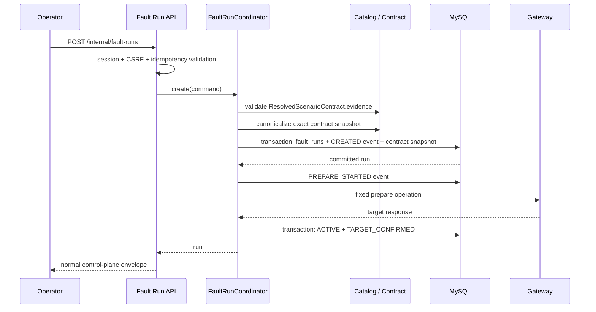
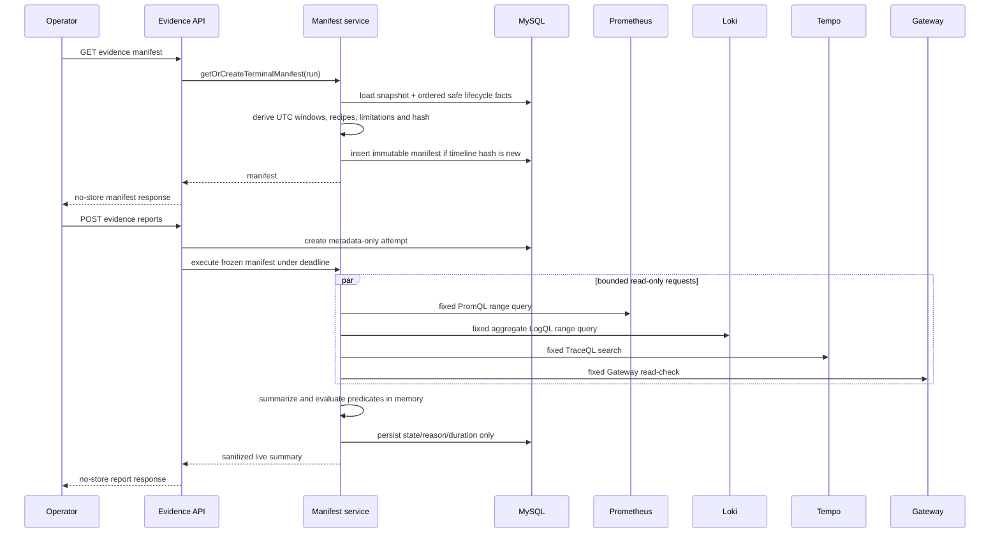

# 批次 4：实时 Evidence Query 技术设计

> 状态：技术设计 v1（待实施）<br>
> 配套产品规格：[product.md](./product.md)<br>
> 对应路线阶段：阶段 4<br>
> 前置条件：阶段 0～3 的退出门槛已满足，尤其是批次 3 已提供并阻断式校验完整的 Scenario Evidence Contract<br>
> 设计原则：合同单一事实来源、运行级不可变查询协议、实时只读查询、结果不落库、控制/效果/恢复/清理事实严格分离

## 1. 设计结论

批次 4 在 `traffic-control-plane` 内实现一个仅供 Operator 使用的 Evidence Query 子系统。它由三个彼此独立的层组成：

1. **运行创建时冻结合同**：创建 Fault Run 的同一 MySQL 事务中，保存由 Catalog 派生的 Evidence Contract snapshot、revision 和 canonical hash。该 snapshot 是历史运行唯一可信的查询协议，后续 Catalog 修改不会改写它。
2. **终态按需物化 Manifest**：Operator 首次查看终态运行的证据时，服务端使用 frozen contract 与按 `(created_at, id)` 排序的 Run Event 生成不可变 `EvidenceQueryManifest`。若清理等后续生命周期事实发生，则创建新 revision，绝不原地改写旧 Manifest。
3. **Operator 显式实时查询**：Operator 主动发起一次有严格时间、并发和响应体上限的同步查询。控制面只向 Prometheus、Loki、Tempo 和既有 Gateway 固定只读检查发请求，结果只在当前 HTTP 响应中以受限摘要返回；数据库、审计、日志和指标只记录状态、判断、时长和安全错误码。

```text
Catalog / Scenario Evidence Contract
        |
        | frozen atomically at Fault Run creation
        v
EvidenceContractSnapshot ─────────────────────────┐
                                                   |
Fault Run + ordered Run Events --------------------+--> EvidenceManifestService
                                                        |
                                                        v
                                                immutable Manifest revision
                                                        |
Operator explicitly requests a report                |
        |                                             v
        +---------------------------------> bounded live executor
                                             |      |       |       |
                                             v      v       v       v
                                           Prom.  Loki    Tempo  Gateway
                                             \      |       |       /
                                              \-----+-------+------/
                                                    |
                                                    v
                                    sanitized, no-store Operator response
```

本设计不新增业务服务的场景语义、通用观测代理、离线证据包、自动恢复或 Agent 入口。`traffic-control-plane` 仍然是 Catalog、Fault Run、审计、恢复和证据语义的唯一所有者。

### 1.1 备选方案与选择

| 方案 | 描述 | 优点 | 不采用的原因 |
| --- | --- | --- | --- |
| 浏览器直接查询 Grafana/观测后端 | 前端携带查询并调用 datasource 或 Grafana deep link | 实现表面上最少 | 泄露连接边界，无法限制查询，不能统一窗口、审计、脱敏和错误语义 |
| Worker 队列化执行并持久化完整报告 | Web 创建作业，独立 Worker 查询后写回报告 | 适合以后长时间 Evaluator | 阶段 4 不需要后台评估；会增加 lease/retry/队列语义，并容易把实时结果变成现场快照 |
| **冻结合同 + 同步受限执行** | 服务端对终态 Manifest 执行一次实时只读查询 | 保持实时性、最小化状态、无 Web 后台任务、可复用给阶段 5 | 单次响应受总时限约束，Operator 需用新请求主动重查 |

因此，本批次选择第三种方案。同步只指一次有硬性 deadline 的 HTTP 操作；它不是在 Web/API 中启动后台任务。后续阶段 5.2 如需队列化 Evaluator，应复用本批次的 Manifest resolver 和 query executor，而不是复制查询实现。

## 2. 当前实现基线与进入门槛

### 2.1 已有可复用事实

| 事实 | 当前来源 | 批次 4 的使用方式 |
| --- | --- | --- |
| 场景、目标 service/operation、参数、时长和恢复策略 | `traffic-control-plane/src/lib/fault-run-catalog.ts` | 唯一的场景事实来源；Evidence Contract 附着于此处 |
| 运行状态、创建/启动/停止时间 | `fault_runs`、`fault-run-repository.ts` | 读取受控生命周期事实，不从 UI 或浏览器时间推断 |
| 生命周期和 Worker 观察 | `fault_run_events` | 以 `(created_at, id)` 规则折叠为安全的时间线投影 |
| 固定 Tempo service/route 元数据 | `traffic-control-plane/src/lib/runbook.ts` | 迁移为 Catalog Evidence Contract 的派生展示数据，不能形成第二份配方 |
| Operator session、CSRF 和统一响应 envelope | `middleware.ts`、`csrf.ts`、`api-response.ts` | 保护所有 `/internal/**` 路由；POST 必须 CSRF |
| Operator 审计 | `operator-audit.ts`、`operator_audit_logs` | 查询执行和分析笔记各自保留 audit reference，不复用 `fault_runs.operator_audit_id` |
| Gateway 固定观测入口 | `OperationDispatchController` | 仅复用已经存在、可验证为只读的固定入口；不新增通用代理 |
| Prometheus、Loki、Tempo | Compose/Kubernetes 观测配置 | 通过服务端内部 endpoint 做实时只读请求，不经浏览器或宿主机暴露端口 |

当前 Catalog 尚未包含完整 `contract.evidence` supplement、Contract revision 或历史 contract snapshot；控制面也没有 PromQL、LogQL、TraceQL 查询客户端。这些是批次 3 和批次 4 必须显式补齐的能力，不能通过路由、组件、Markdown 或 SQL 里的手工映射绕过。

### 2.2 开始编码前的阻断门禁

以下门禁全部满足后才能打开批次 4 的 capture 或 query flag：

1. 批次 0 已能把未知运行事实表示为 `UNKNOWN`、`null` 或 limitation，未把 `prepare` 成功解释为效果已发生。
2. 批次 1 已记录停止、drain、release 和 cleanup 的边界；手工清理和 `NON_RELEASING` 行为不能由终态状态伪造。
3. 批次 2 的 owner、heartbeat、fencing 和重协调结果已经稳定，重启不会让事件时间线失去可解释性。
4. 批次 3 已为 12 个 Catalog 场景校验：
   - `contractRevision`；
   - 固定 evidence recipe、窗口 policy、required 标记和 predicate；
   - 可选的固定 Gateway read-check；
   - 合法的 runbook、i18n 和 alert contract；
   - 所有 recipe、window、read-check 映射都没有用户输入插槽。
5. 新建 Fault Run 能在目标 prepare 之前原子地保存对应的 Evidence Contract snapshot。
6. 每个候选观测后端均有已验证的内部服务 endpoint；不会用 Grafana 公共 URL、浏览器 cookie 或开发环境 Basic Auth 作为查询凭据。

批次 4 不负责修复当前 `deleteExpiredFaultRuns()` 对手工清理边界的既有缺口；该运行安全门禁属于前置阶段。批次 4 只能消费已经可靠记录的事实。

## 3. 范围、非目标与不变量

### 3.1 本批次范围

- 终态 Fault Run 的固定 Contract snapshot、Manifest、窗口和限制说明。
- Prometheus range query、Loki aggregate query、Tempo TraceQL search、控制面时间线和已批准 Gateway read-check 的实时复查。
- Operator 侧 Manifest 浏览、显式刷新、受控摘要、状态解释与可选分析笔记。
- 查询请求、查询结果可用性、判断和错误码的低敏审计/运行元数据。
- Compose 优先的单环境 pilot，以及 Kubernetes 启用前的观测能力核验。

### 3.2 明确非目标

- 不保存 Prometheus sample/matrix/exemplar、Loki log line/label dump、Tempo trace/span/attribute、HTTP response body、MySQL/Redis/JVM/文件系统现场快照。
- 不提供自由输入 PromQL、LogQL、TraceQL、URL、service、route、时间范围、业务 operation 或业务请求体。
- 不创建 AgentRcaReport、alert receipt、incident、Evaluator queue、Ground Truth、评分、remediation outcome 或自动 remediation。
- 不调用 `FaultRunCoordinator.stop()`、release、cleanup、restart、业务写 API 或真实业务恢复动作。
- 不把 `faultRunId`、`X-Trace-Id` 或数据库业务 ID 当作 OTel trace ID。
- 不把配置中的 retention 时长误表述为现场数据必然仍然存在。
- 不要求所有场景都有独立业务检查；缺少安全固定 read-check 时应明确为未配置，而不是新增任意业务代理。

### 3.3 必须持续成立的事实分离

| 事实 | 唯一依据 | 不得由其推导 |
| --- | --- | --- |
| 控制动作已接受 | `TARGET_CONFIRMED` 和 Fault Run 状态转换 | 目标效果已观察到 |
| 目标效果已观察到 | 已冻结 predicate 在完整可用查询中的判断结果，或将来的显式独立观察事实 | `prepare`、Worker 已启动、trace correlation ID |
| 业务已经恢复 | 已声明的恢复/read-check predicate | release/stop/recovery API 返回成功 |
| 清理已完成 | 显式 `MANUAL_CLEANUP_COMPLETED` 及其适用检查 | 运行进入终态 |
| 证据可用 | 真实查询结果、窗口可解析性和 retention 覆盖 | 没有查询结果、告警已 resolved |
| Operator 分析 | 有界 analysis note | 生命周期状态或遥测结果 |

## 4. 总体架构和数据流

### 4.1 运行创建与 Contract snapshot



Contract snapshot 只记录当次运行应使用的查询协议，不查询任何观测后端。若 capture flag 已开启，snapshot 写入失败必须在任何目标 `prepare` 调用之前使创建失败；否则会产生无法按已批准合同解释的“reportable run”。当 capture flag 关闭时，现有 Fault Run 创建路径保持不变，新运行明确标记为没有 Evidence Contract snapshot。

### 4.2 终态 Manifest 物化与实时报告



Manifest 浏览绝不触发外部查询。页面轮询、详情打开、列表筛选和历史读取也绝不触发外部查询。只有明确的 `POST` 可执行一次 live report。

### 4.3 为什么 Manifest 在终态物化

阶段 4 的产品重点是运行后可重复复查；只有终态后 `baseline`、`active` 和恢复窗口才具有稳定边界。将 active Fault Run 的“当前时间”写入历史 Manifest 会破坏确定性，也会让 UI 轮询意外制造观测负载。

因此：

- `CREATING`、`ACTIVE`、`RECOVERING` 的 Manifest/report 请求返回 `409 RUN_NOT_TERMINAL`。
- `RECOVERED`、`STOPPED`、`FAILED` 和 `SERVICE_UNAVAILABLE` 可以生成 Manifest。
- 对 `FAILED` 或 `SERVICE_UNAVAILABLE` 缺少 recovery anchor 的窗口返回 `NOT_READY`/`EVIDENCE_UNAVAILABLE`，但已稳定的 baseline/active 窗口仍可复查。
- 手工 cleanup 在首次 Manifest 之后完成时，下一次物化生成一个新 revision；旧 revision 继续可读，以保留当时的查询协议。

## 5. Catalog 与 Contract 设计

### 5.1 单一事实来源

`traffic-control-plane/src/lib/fault-run-catalog.ts` 继续是所有可变场景事实的唯一来源。批次 3 在 `FaultRunScenarioDefinition` 上增加必填 `evidence` 字段；`scenario-contract.ts` 如有必要只能校验、canonicalize 和导出该字段，不能维护第二个按场景列出的 recipe map。

```ts
type EvidenceWindowName = 'baseline' | 'active' | 'recovery' | 'cleanup';
type EvidenceSource =
  | 'RUN_EVENT'
  | 'PROMETHEUS'
  | 'LOKI'
  | 'TEMPO'
  | 'BUSINESS_CHECK'
  | 'RESOURCE_CHECK';
type EvidenceProjection = 'NUMERIC' | 'COUNT' | 'BOOLEAN' | 'TIMELINE';
type EvidencePredicateOutcome = 'MET' | 'NOT_MET' | 'INCONCLUSIVE';

type EvidenceWindowPolicy = {
  baselineBeforeActiveSec: number;
  activeLeadSec: number;
  activeTailSec: number;
  recoveryLeadSec: number;
  recoveryTailSec: number;
  cleanupLeadSec: number;
};

type EvidenceRecipe = {
  id: string;
  source: EvidenceSource;
  window: EvidenceWindowName;
  observationMode: 'WINDOWED' | 'CURRENT';
  required: boolean;
  template: EvidenceTemplateId;
  scope: EvidenceScope;
  predicate: EvidencePredicate;
  projection: EvidenceProjection;
};

type EvidenceContractPlan = {
  schemaVersion: 'evidence-contract.v1';
  windows: EvidenceWindowPolicy;
  recipes: readonly EvidenceRecipe[];
  effectRule: {
    mode: 'ALL' | 'ANY';
    recipeIds: readonly string[];
  };
};
```

`EvidenceContractPlan` 由批次 3 的 `resolveScenarioContract(definition).evidence` 转换而来，不是第二份 Catalog。`EvidenceTemplateId`、`EvidenceScope` 和 `EvidencePredicate` 都是有限枚举或经过严格验证的结构；它们不是可由 Operator 或环境变量任意替换的查询字符串。Prometheus、Loki、Tempo 和 Run Event 时间线使用 `WINDOWED`；业务 read-check 只能使用 `CURRENT`，表示报告发起时的当前恢复探测，不能冒充历史窗口内的效果证据，也不能被 `effectRule` 引用。

### 5.2 revision、canonicalization 与历史冻结

1. 对每个场景的 target、operation、validated evidence contract、schema version 和固定 read-check ID 做稳定 JSON 序列化。
2. 对 object key、recipe ID 和数组中的稳定标识符排序。
3. 使用批次 3 的 canonicalization 对 resolved Contract 计算 `sc.v1:sha256:<lowercase-hex>` 形式的 `contractRevision`。
4. 在同一个 Fault Run 创建事务中保存 canonical JSON、`contractRevision` 和 `contractHash`，并验证它与 `fault_runs.contract_revision`、`CREATED.contractRevision` 相同。
5. Manifest 用 `contractHash + safe timeline projection + resolved windows + rendered recipe plan` 生成独立 `manifestHash`。

这与批次 0 的 Catalog revision 规则保持一致：revision 从 authoritative Catalog 内容导出，不依赖 Git branch、部署时间或手工填写的版本号。`schemaVersion` 用于解释结构变更，但不能替代内容 revision。

Catalog 后续变更只影响新运行。旧运行始终使用自己的 frozen snapshot；无法读取 snapshot 的旧运行必须得到 `CONTRACT_SNAPSHOT_UNAVAILABLE`，不得用当前 Catalog 伪造历史配方。

### 5.3 Recipe DSL 与查询渲染

每个外部 recipe 由受限模板渲染，而不是将 free-form query 直接写入 HTTP route：

| Source | 允许模板示例 | 受限 scope | 返回摘要 |
| --- | --- | --- | --- |
| Prometheus | `HTTP_P99`、`HTTP_ERROR_RATIO`、`HTTP_RATE`、`HIKARI_UTILIZATION`、`JVM_HEAP_RATIO`、`MYSQL_SLOW_QUERY_RATE`、`REDIS_MEMORY_RATIO`、`NODE_FILESYSTEM_RATIO` | 已验证 service、固定 route、固定 metric label | sample 数、min/max/latest、predicate outcome |
| Loki | `SERVICE_EVENT_COUNT`、`SERVICE_ERROR_COUNT` | 已验证 `service`、允许的 `log_level` | bucket/series 数与 count summary |
| Tempo | `SERVICE_REQUESTS`、`SERVICE_ERRORS`、`SERVICE_SLOW_REQUESTS`、`SERVICE_ROUTE_REQUESTS` | 已验证 `resource.service.name`、固定 route、阈值 | trace/error count 与 duration bucket |
| Business check | `CATALOG_PRODUCT_LIST`、`CATALOG_BROWSE_REPORT` | 固定的正常业务 GET 和静态 query 参数 | `PASS`、`FAIL`、`NO_DATA` 或受限 scalar |
| Run event | `RUN_TIMELINE` | Manifest 内安全时间线 | anchor 是否存在和限制码 |

渲染器只能替换已验证的服务名、静态 route 和常量阈值，绝不能替换 Fault Run 参数、Operator 输入、URL、label matcher、业务 ID 或 trace ID。每个模板输出在写入 snapshot 前都必须通过静态验证：

- recipe ID 在同一 contract 内唯一；
- source、window 和 projection 的组合受支持；
- 所有时间窗口均在全局硬上限内；
- rendered query 不包含未解析占位符、URL、credential、用户输入或不允许的 label；
- Gateway read-check ID 有唯一固定实现；
- effect rule 引用的 recipe ID 均存在且可产生 predicate outcome。

`runbook.ts` 的 Tempo 展示信息应改为从 Catalog Evidence Contract 派生。runbook 可以继续拥有文章文件名、影响范围、解释文本和 Mermaid 内容，但不能同时维护 service/route/query 事实。

### 5.4 12 个场景的最小 Evidence 覆盖

每个场景至少有 `RUN_TIMELINE`、一个 Prometheus、一个 aggregate LogQL 和一个 TraceQL recipe。业务 read-check 是可选项，只能使用既有的、固定的正常读取路径，并在 UI 中与历史窗口 evidence 分开呈现。

| 场景 | Prometheus 重点 | Loki/Tempo scope | 初始 Gateway read-check |
| --- | --- | --- | --- |
| `BROWSE_REPORT_SQL` | Catalog report HTTP latency、Hikari utilization、MySQL slow-query rate | `catalog-service`、`/api/reports/product-browse` | `CATALOG_BROWSE_REPORT`（当前恢复检查） |
| `ORDER_REPORT_SQL` | Order report HTTP latency、Hikari utilization、MySQL slow-query rate | `order-service`、`/api/reports/order-query` | 无 |
| `BROWSE_SURGE` | Gateway/Catalog request rate、HTTP latency/error ratio | `gateway-service` 与 `catalog-service`、`/api/products` | `CATALOG_PRODUCT_LIST`（当前恢复检查） |
| `ORDER_QUERY_SURGE` | Gateway/Order request rate、HTTP latency/error ratio | `gateway-service` 与 `order-service`、`/api/orders` | 无 |
| `CATALOG_REDIS_LARGE_VALUE` | Catalog HTTP latency/error ratio、Redis memory ratio | `catalog-service`、产品详情 route | `CATALOG_PRODUCT_LIST`（当前恢复检查；不使用 run-scoped key/SKU） |
| `CART_CATALOG_DEPENDENCY` | Cart/Catalog HTTP error/latency | `cart-service`、`catalog-service`、固定业务路径 | 无；加购是写路径，不可作为 Batch 4 read-check |
| `NOTIFICATION_HEAP_PRESSURE` | JVM heap ratio、major GC rate、notification error ratio | `notification-service` | 无；通知投递是写路径 |
| `NOTIFICATION_STORAGE_APPEND` | filesystem available/growth metric、notification error rate | `notification-service` | 无；现有 storage append 入口会写文件，明确排除 |
| `PROMOTION_LOCK_CONTENTION` | Hikari pending/utilization、HTTP error/latency | `promotion-service` | 无；现有 consistency endpoint 依赖 active run，不适用于终态报告 |
| `INVENTORY_TABLE_EXCLUSIVE` | Hikari pending/utilization、availability report latency | `inventory-service`、availability report route | 无；现有 report endpoint 依赖 active table lock context |
| `INVENTORY_ROW_LOCK` | Hikari pending/utilization、reservation summary latency | `inventory-service`、reservation summary route | 无；现有 summary endpoint 依赖 active row-lock context |
| `PSP_PROVIDER_OUTCOME` | payment failure/timeout rate、payment HTTP latency | `payment-service`、`psp-simulator`、authorization route | 无；授权属于写路径 |

表中 metric 和 route 是 contract authoring 的目标范围，不是生产数据必然存在的承诺。每个 recipe 在 pilot 环境中都要用真实已部署 label/metric 验证。没有实际数据时使用 `NO_DATA` 或 `EVIDENCE_UNAVAILABLE`，不补零。

### 5.5 Gateway business read-check 边界

当前 Gateway 的下列固定内部观测路径不能纳入批次 4 的终态报告：

| 既有路径 | 原因 | 批次 4 处理 |
| --- | --- | --- |
| `/internal/gateway/inventory/availability` | 下游 `report()` 要求当前 active run、fencing token 和接受中的 run guard；release 后必然失效 | 仅保留原有运行期间诊断语义，不作为终态 evidence check |
| `/internal/gateway/inventory/reservations/summary` | 下游 `summary()` 要求当前 active row-lock context；release 后必然失效 | 同上 |
| `/internal/gateway/promotion/consistency` | 下游 consistency 检查要求 active prepared reservation；release 后必然失效 | 同上 |
| `/internal/gateway/notification/storage/append` | 真实写路径，会追加文件 | 永久排除 |

首版只使用两个不要求 Fault Run context 的既有正常业务路径：

| Read-check ID | 固定 Gateway 请求 | 允许场景 | 当前检查语义 |
| --- | --- | --- | --- |
| `CATALOG_PRODUCT_LIST` | `GET /api/products?sort=latest&page=0&size=1` | `BROWSE_SURGE`、`CATALOG_REDIS_LARGE_VALUE` | 证明报告发起时普通产品读取路径可达；不能证明历史 cache 影响 |
| `CATALOG_BROWSE_REPORT` | `GET /api/reports/product-browse` | `BROWSE_REPORT_SQL` | 证明报告发起时真实报表读取路径的当前结果；不能替代历史 latency evidence |

这些 GET 已通过 Gateway 路由到真实 Catalog 业务路径，且不需要转发 Operator 身份、Fault Run context、场景 ID、Catalog revision、Manifest 或查询窗口。响应在控制面内立即投影为 `PASS`、`FAIL`、`NO_DATA` 或受限 scalar，绝不回传业务行、SKU、订单、支付或原始 body。新增检查时必须先单独证明它是业务语义明确、固定、只读的操作；不能引入“按 ID/URL 转发”的通用检查接口。

## 6. Manifest、时间线与窗口

### 6.1 安全时间线投影

Manifest 只能包含窗口所需的受限事实：

```ts
type EvidenceTimeline = {
  createdAt: string;
  prepareStartedAt: string | null;
  activeAt: string | null;
  stopRequestedAt: string | null;
  recoveryStartedAt: string | null;
  recoveredAt: string | null;
  cleanupFinishedAt: string | null;
  terminalAt: string | null;
  terminalState: 'RECOVERED' | 'STOPPED' | 'FAILED' | 'SERVICE_UNAVAILABLE' | null;
};
```

时间点选择规则如下：

| 时间点 | 权威来源 | 说明 |
| --- | --- | --- |
| `createdAt` | `fault_runs.created_at` | 数据库服务器写入时间 |
| `prepareStartedAt` | 新增 `PREPARE_STARTED` event | 在 target adapter 调用之前写入 |
| `activeAt` | `TARGET_CONFIRMED` 与 `ACTIVE` 状态转换 | 事务中的状态转换时间；不使用第一笔流量时间 |
| `stopRequestedAt` | 新增 `STOP_REQUESTED` event | 在手工/过期恢复请求开始时写入 |
| `recoveryStartedAt` | `RECOVERY_STARTED` | 不能由 `stopRequestedAt` 推导 |
| `recoveredAt` | `RECOVERY_COMPLETED` 或 `SERVICE_RECOVERED` | 第一条适用的成功恢复事实 |
| `cleanupFinishedAt` | `MANUAL_CLEANUP_COMPLETED` | 不能由终态或 release 推导 |
| `terminalAt` | `fault_runs.stopped_at` 与对应终态 event | 用于解释 failed/unavailable 的 active 终点 |

所有事件按 `(created_at, id)` 读取；同一毫秒内按递增 `id` 决定先后。所有外部 DTO 以 UTC ISO-8601 输出。窗口计算从数据库持久化时钟读取，不能用浏览器时钟、Node `Date.now()` 或解析失败的本地日期补齐历史 anchor。

`TARGET_CONFIRMED`、`PREPARE_STARTED`、`SCENARIO_WORKER_STARTED`、成功 API 返回或 `traceId` 都不能填充 `effectObservedAt`。阶段 4 将效果表达为报告中的一次 predicate assessment，而不是改写 Fault Run 生命周期。

### 6.2 确定性窗口算法

默认 policy 保持产品规格的语义，并为 Catalog override 设置硬上限：

| 窗口 | 默认 start | 默认 end | 硬上限 | 缺失时的行为 |
| --- | --- | --- | --- | --- |
| `baseline` | `activeAt - 5m` | `activeAt` | 15m | `NOT_READY: ACTIVE_BOUNDARY_MISSING` |
| `active` | `activeAt - 30s` | `recoveryStartedAt + 30s` | 场景 max duration + 60s | 若无 recovery start，使用 `terminalAt + 30s` 并附限制；若无 terminal，`NOT_READY` |
| `recovery` | `recoveryStartedAt - 30s` | `recoveredAt + 5m` | 35m | `NOT_READY: RECOVERY_BOUNDARY_MISSING` |
| `cleanup` | `cleanupFinishedAt - 5m` | `cleanupFinishedAt` | 10m | 无适用 cleanup 为 `NOT_APPLICABLE`；适用但缺失为 `NOT_READY` |

窗口 resolver 必须：

1. 使用 frozen contract 的 policy，不能使用当前 Catalog policy。
2. 对 start/end 进行全局硬上限校验；违反时不查询后端，返回 `INVALID_QUERY`。
3. 保留 canonical start/end，不能为“方便重试”把历史窗口滑动到现在。
4. 对每个窗口单独标识 `READY`、`NOT_READY` 或 `NOT_APPLICABLE`；一个缺失 anchor 不能使其余窗口失效。
5. 在 Manifest 中记录 `clockSkewToleranceSec=60` 作为解释性信息，但不静默移动控制面窗口以适配 scrape/ingestion 时间。

### 6.3 Manifest revision

`EvidenceQueryManifest` 是不可变的。物化前先构建 canonical `timelineProjection`，再计算 `timelineHash`：

- `(sourceFaultRunId, timelineHash)` 已存在时返回原 Manifest。
- 任何可安全投影的生命周期事实新增或变化时生成递增 `manifestRevision`。
- 新 revision 只影响以后的 live report；旧 attempt 永远指向创建时的 `manifestId`。
- Manual cleanup 后产生的 revision 只增加 cleanup 相关窗口，不会篡改前一个 revision 对未清理事实的描述。
- 运行进入现有控制面 retention 前，Worker 在删除前调用同一 materializer 确保至少有最新 Manifest；该维护操作不查询外部观测后端。

旧 Fault Run 没有 frozen contract snapshot 时，接口返回：

```json
{
  "evidenceStatus": "EVIDENCE_UNAVAILABLE",
  "reasonCode": "CONTRACT_SNAPSHOT_UNAVAILABLE",
  "snapshotState": "LEGACY_UNVERSIONED"
}
```

禁止把当前 Catalog snapshot 绑定到旧运行后称为“历史 Manifest”。

## 7. 数据模型与迁移

### 7.1 持久化边界

Evidence 数据库只保存查询协议、受控生命周期投影、执行元数据和 Operator note；不保存遥测结果。`fault_runs` 仍由现有 7 天 retention 管理，但 Manifest 不能对它设置 `ON DELETE CASCADE`，以便在运行行被清理后仍可解释曾使用的安全查询协议与窗口。

新增表必须同时写入：

- `traffic-control-plane/src/lib/fault-run-schema.ts` 的幂等 schema statements；
- `traffic-control-plane/src/lib/migrations/00N-evidence-query.sql`，其中 `00N` 是批次 3 migration 之后的下一个未使用顺序号，用于已有 volume；
- `infra/mysql/init/0N-evidence-query-schema.sql`，其中 `0N` 是批次 3 fresh-install script 之后的下一个未使用顺序号，用于 fresh install。

本批次是 expand-only migration：不修改现有 `fault_runs` state enum、不删除列、不改变 active-run uniqueness，也不引入跨服务 schema 依赖。

### 7.2 `evidence_contract_snapshots`

每个带 capture 的新运行一条 frozen 合同。它是 Catalog 的历史 materialization，不是第二份可编辑 Catalog。

```sql
CREATE TABLE evidence_contract_snapshots (
  snapshot_id CHAR(36) NOT NULL PRIMARY KEY,
  source_fault_run_id CHAR(36) NOT NULL,
  scenario VARCHAR(64) NOT NULL,
  contract_schema_version VARCHAR(64) NOT NULL,
  contract_revision VARCHAR(128) NOT NULL,
  contract_hash CHAR(64) NOT NULL,
  contract_json JSON NOT NULL,
  created_at DATETIME(3) NOT NULL DEFAULT CURRENT_TIMESTAMP(3),
  UNIQUE KEY uq_evidence_contract_source_run (source_fault_run_id),
  INDEX idx_evidence_contract_scenario_revision (scenario, contract_revision)
) ENGINE=InnoDB DEFAULT CHARSET=utf8mb4;
```

`contract_json` 只含 validated template、scope、predicate、窗口 policy、required 标记和固定 Gateway check ID。它不得包含 endpoint URL、credential、Operator 输入、业务请求 payload 或遥测数据。

### 7.3 `evidence_query_manifests`

每个终态时间线 revision 一条不可变 Manifest：

```sql
CREATE TABLE evidence_query_manifests (
  manifest_id CHAR(36) NOT NULL PRIMARY KEY,
  snapshot_id CHAR(36) NOT NULL,
  source_fault_run_id CHAR(36) NOT NULL,
  scenario VARCHAR(64) NOT NULL,
  manifest_schema_version VARCHAR(64) NOT NULL,
  contract_revision VARCHAR(128) NOT NULL,
  manifest_revision INT UNSIGNED NOT NULL,
  timeline_hash CHAR(64) NOT NULL,
  manifest_hash CHAR(64) NOT NULL,
  timeline_json JSON NOT NULL,
  windows_json JSON NOT NULL,
  recipes_json JSON NOT NULL,
  limitations_json JSON NOT NULL,
  source_run_retained TINYINT NOT NULL DEFAULT 1,
  materialized_at DATETIME(3) NOT NULL DEFAULT CURRENT_TIMESTAMP(3),
  UNIQUE KEY uq_evidence_manifest_source_timeline (source_fault_run_id, timeline_hash),
  UNIQUE KEY uq_evidence_manifest_source_revision (source_fault_run_id, manifest_revision),
  INDEX idx_evidence_manifest_source (source_fault_run_id, manifest_revision),
  INDEX idx_evidence_manifest_contract (contract_revision, materialized_at)
) ENGINE=InnoDB DEFAULT CHARSET=utf8mb4;
```

`timeline_json` 是第 6.1 节的严格 schema，不复制原始 `fault_run_events.payload`。`windows_json` 和 `recipes_json` 是 copyable query protocol；它们不包含 provider response。`source_run_retained` 在现有 Fault Run retention 删除源行之前切换为 `0`，使 UI 能解释数据来源仍是冻结 Manifest 而非仍存在的 Fault Run。

当前版本刻意不对 `snapshot_id` 或 `source_fault_run_id` 添加会随着 Fault Run 删除而级联删除的 foreign key。未来阶段 5 关联 incident/case 时，必须通过独立 expand migration 添加 nullable 关联，不能就地改写已经被 report 引用的 Manifest。

### 7.4 Attempt、单项状态和 Note

```sql
CREATE TABLE evidence_query_attempts (
  attempt_id CHAR(36) NOT NULL PRIMARY KEY,
  manifest_id CHAR(36) NOT NULL,
  idempotency_key VARCHAR(128) NOT NULL,
  state VARCHAR(32) NOT NULL,
  evidence_status VARCHAR(32) NULL,
  operator_audit_id BIGINT NULL,
  requested_at DATETIME(3) NOT NULL DEFAULT CURRENT_TIMESTAMP(3),
  completed_at DATETIME(3) NULL,
  total_duration_ms INT UNSIGNED NULL,
  failure_code VARCHAR(64) NULL,
  UNIQUE KEY uq_evidence_attempt_idempotency (manifest_id, idempotency_key),
  INDEX idx_evidence_attempt_manifest_time (manifest_id, requested_at),
  CHECK (state IN ('RUNNING', 'COMPLETED', 'EVIDENCE_UNAVAILABLE', 'FAILED')),
  CHECK (evidence_status IS NULL OR evidence_status IN
    ('AVAILABLE', 'PARTIAL', 'EVIDENCE_UNAVAILABLE', 'INVALID_QUERY'))
) ENGINE=InnoDB DEFAULT CHARSET=utf8mb4;

CREATE TABLE evidence_query_attempt_items (
  id BIGINT NOT NULL AUTO_INCREMENT PRIMARY KEY,
  attempt_id CHAR(36) NOT NULL,
  recipe_id VARCHAR(96) NOT NULL,
  source VARCHAR(24) NOT NULL,
  window_name VARCHAR(24) NOT NULL,
  availability VARCHAR(32) NOT NULL,
  coverage VARCHAR(16) NOT NULL,
  predicate_outcome VARCHAR(16) NOT NULL,
  reason_code VARCHAR(64) NULL,
  duration_ms INT UNSIGNED NULL,
  queried_at DATETIME(3) NULL,
  UNIQUE KEY uq_evidence_attempt_recipe_window (attempt_id, recipe_id, window_name),
  INDEX idx_evidence_attempt_item_attempt (attempt_id),
  CHECK (source IN ('RUN_EVENT', 'PROMETHEUS', 'LOKI', 'TEMPO',
                    'BUSINESS_CHECK', 'RESOURCE_CHECK')),
  CHECK (availability IN ('AVAILABLE', 'NO_DATA', 'EVIDENCE_UNAVAILABLE',
                           'INVALID_QUERY', 'NOT_APPLICABLE')),
  CHECK (coverage IN ('FULL', 'PARTIAL', 'NONE', 'NOT_APPLICABLE')),
  CHECK (predicate_outcome IN ('MET', 'NOT_MET', 'INCONCLUSIVE'))
) ENGINE=InnoDB DEFAULT CHARSET=utf8mb4;

CREATE TABLE evidence_operator_notes (
  note_id CHAR(36) NOT NULL PRIMARY KEY,
  manifest_id CHAR(36) NOT NULL,
  operator_audit_id BIGINT NOT NULL,
  note_text VARCHAR(2048) NOT NULL,
  created_at DATETIME(3) NOT NULL DEFAULT CURRENT_TIMESTAMP(3),
  UNIQUE KEY uq_evidence_note_audit (operator_audit_id),
  INDEX idx_evidence_note_manifest_time (manifest_id, created_at, note_id)
) ENGINE=InnoDB DEFAULT CHARSET=utf8mb4;
```

这些表刻意没有 `result_json`、`summary_json`、`raw_error`、endpoint 或 credential 字段。查询过程中的数值摘要只存在于内存和当前 `Cache-Control: no-store` HTTP 响应中。`predicate_outcome` 是允许保存的判断记录，不是遥测快照。

### 7.5 retention 与历史行为

| 数据 | 本批次策略 |
| --- | --- |
| `fault_runs` / `fault_run_events` | 保持现有 7 天控制面 retention |
| Contract snapshot / Manifest / metadata-only attempt / note | 独立于 Fault Run 保留；Phase 4 不新增自动删除策略 |
| Prometheus / Loki / Tempo 数据 | 由各观测后端自身 retention 管理；不复制 |
| future Phase 5 case/report | 后续阶段定义显式审计 retention 前不得删除被引用 Manifest |

`deleteExpiredFaultRuns()` 在删除 eligible 运行之前必须：

1. 加载其已冻结 Contract snapshot；
2. 调用 idempotent materializer 写入最新终态 Manifest；
3. 将该运行现有 Manifest 的 `source_run_retained` 更新为 `0`；
4. 在同一事务中执行现有 event/run 删除；
5. 当没有 snapshot 的 legacy run 时维持当前删除行为。

源行被删除后，Manifest 仍可显示安全时间线和查询配方。Prometheus/Loki/Tempo recipe 仍可在各自 retention 覆盖时查询；首版 `CURRENT` Gateway read-check 不依赖 Fault Run context，因此仍可执行，但其输出必须保持为“报告当前时刻的恢复检查”，绝不回填为历史效果或清理事实。所有历史 window source 都不再可用时，live report 返回 `EVIDENCE_UNAVAILABLE` 而不是“无故障”。

## 8. API 设计

所有接口都是 Operator-only `/internal/**` API。GET 要求既有 Operator session；每个 POST 同时要求 session、CSRF、严格 JSON body 和 idempotency key。接口使用现有 `{ code, message, data }` envelope，并在响应上设置：

```text
Cache-Control: no-store
Pragma: no-cache
Referrer-Policy: no-referrer
```

### 8.1 Manifest 查询

```text
GET /internal/fault-runs/{faultRunId}/evidence
```

行为：

- UUID 格式非法返回 `400 INVALID_FAULT_RUN_ID`。
- 活跃运行返回 `409 RUN_NOT_TERMINAL`。
- 有 snapshot 的终态运行返回现有或新物化的最新 Manifest。
- legacy 运行返回 `200` 的结构化 `EVIDENCE_UNAVAILABLE / CONTRACT_SNAPSHOT_UNAVAILABLE`，使 UI 能明确区分“此运行不具备历史合同”与“未知 ID”。
- 源 Fault Run 已由 retention 删除但 Manifest 仍在时，返回冻结 Manifest 与 `sourceRunRetained: false`。
- 完全未知 ID 返回 `404 FAULT_RUN_NOT_FOUND`。
- 不调用 Prometheus、Loki、Tempo、Gateway、Coordinator 或任何业务服务。

简化返回形状如下：

```json
{
  "code": 0,
  "message": "ok",
  "data": {
    "manifestId": "uuid",
    "manifestRevision": 2,
    "contractRevision": "sha256",
    "manifestHash": "sha256",
    "sourceRunRetained": true,
    "timeline": {},
    "windows": [],
    "recipes": [],
    "limitations": []
  }
}
```

### 8.2 实时报告

```text
POST /internal/fault-runs/{faultRunId}/evidence/reports
X-Idempotency-Key: evidence-{client-id}
X-CSRF-Token: {csrf-token}
Content-Type: application/json

{ "manifestHash": "sha256", "confirmed": true }
```

`manifestHash` 防止页面在读取旧 Manifest 后无意执行新 revision。请求体明确不允许 `promql`、`logql`、`traceql`、`source`、`url`、`window`、`route`、`operation`、`parameters` 或任何业务 ID。

| 情况 | HTTP | 结构化结果 |
| --- | ---: | --- |
| 所有 required recipe 完整可用 | `200` | `AVAILABLE` |
| 至少一项不可用，但仍有 required 证据可解释 | `200` | `PARTIAL` |
| required 证据都不能使用 | `200` | `EVIDENCE_UNAVAILABLE` |
| frozen Manifest/recipe 不满足内部约束 | `422` | `INVALID_QUERY` |
| Manifest hash 已过期 | `409` | `MANIFEST_REVISION_MISMATCH` |
| 运行未终态 | `409` | `RUN_NOT_TERMINAL` |
| 当前并发额度已满 | `429` | `EVIDENCE_QUERY_BUSY` |
| 无 session/CSRF/格式非法 | 现有 `401`/`403`/`400` | 正常错误 envelope |

每次新 idempotency key 代表一次明确的实时重查。相同 `(manifestId, idempotencyKey)` 绝不再次访问外部 source：若原请求仍在执行则返回已有 attempt metadata；若已结束则返回 metadata-only replay，UI 必须以新 key 发起新的实时查询。由于不保存即时遥测摘要，API 不承诺重放完整 live report；这是一项有意的“不保存现场数据”取舍。

### 8.3 历史与分析笔记

```text
GET  /internal/fault-runs/{faultRunId}/evidence/reports
GET  /internal/fault-runs/{faultRunId}/evidence/notes
POST /internal/fault-runs/{faultRunId}/evidence/notes
```

reports history 只返回 attempt ID、Manifest revision/hash、请求/结束时间、总状态、单项 availability/coverage/predicate outcome、reason code、时长和 audit ID；不返回数值摘要或 provider response。

notes 是 Operator 的辅助分析，不能替代任何控制、效果、恢复、清理或遥测事实。POST 的约束如下：

- plain text，最大 2,048 UTF-8 characters；
- 禁止 HTML、credential、token、cookie、Authorization、完整日志/trace 导出和业务 payload；
- 创建后 append-only；首版不支持编辑或删除，避免无法审计的改写；
- note 正文只保存在 note 表中，审计记录只 hash request metadata，不存正文。

### 8.4 Audit 行为

| 动作 | `operator_audit_logs.action` | `target` | parameters 中允许的字段 |
| --- | --- | --- | --- |
| 实时报告开始/结束 | `EVIDENCE_REPORT_EXECUTE` | `manifestId` | `faultRunId`、manifest revision/hash、idempotency key |
| 分析笔记创建 | `EVIDENCE_NOTE_CREATE` | `manifestId` | note ID、长度、manifest revision |

不能调用 `attachOperatorAudit()` 把这些动作覆盖进 `fault_runs.operator_audit_id`；该列目前只容纳一条关联审计。attempt/note 通过自己的 `operator_audit_id` 关联。

## 9. Query executor 设计

### 9.1 模块职责

| 模块 | 职责 |
| --- | --- |
| `evidence-types.ts` | 严格的 Contract、Manifest、窗口、状态、DTO 和 JSON guard |
| `evidence-contract.ts` | 从 Catalog evidence 字段 canonicalize、validate、hash 和创建 snapshot |
| `evidence-manifest.ts` | 安全事件投影、时间线折叠、窗口解析、Manifest hash/revision |
| `evidence-repository.ts` | snapshot、Manifest、attempt、item、note 的参数化 SQL 与事务 |
| `evidence-query-clients.ts` | Prometheus、Loki、Tempo 的 typed bounded client |
| `evidence-business-checks.ts` | 固定 Gateway read-check ID 到既有 path 的唯一映射 |
| `evidence-report-service.ts` | retention preflight、并发、deadline、判定、response shaping |
| `evidence-view.ts` | UI 使用的防御性投影，绝不渲染原始 provider payload |

`FaultRunCoordinator` 只负责在创建前获得 frozen snapshot，并新增 `PREPARE_STARTED`/`STOP_REQUESTED` 生命周期事件；它不执行 evidence query。Web route 只编排认证、请求校验、审计和 service 调用；它不持有 query template 或业务路径。

### 9.2 调用限制

| 限制 | 默认 | 上限/规则 |
| --- | ---: | --- |
| 每个 source timeout | 5 秒 | 小于总 deadline，配置范围 100ms～8s |
| 单个 live report 总 deadline | 15 秒 | 配置范围 1s～20s |
| 单报告内并行 recipe | 4 | 最大 4；每 source 最多 2 |
| 单 Web 进程并行 report | 1 | 最大 2；满时 `429`，不排队 |
| 单响应体 | 1 MiB | 超限丢弃并标记 `QUERY_RESULT_TOO_LARGE` |
| Prometheus/Loki step | 最小 15 秒 | 结果点数每 series 最大 1,500 |
| Tempo search result | 最大 100 条 | 仅内存聚合后立刻释放 |
| 重试 | 最多 1 次 | 仅网络错误、timeout、429、502、503、504；保持在总 deadline 内 |

不重试 `400`/`401`/`403`、静态 recipe 校验失败、retention 过期或 manifest mismatch。所有 `fetch` 必须设置 `AbortSignal`、`redirect: 'error'`、response byte cap 和严格 content-type/JSON shape 校验。

### 9.3 Source-specific 查询与内存摘要

| Source | 调用方式 | 可返回给当前 Operator 的摘要 | 永不保存/显示 |
| --- | --- | --- | --- |
| Prometheus | `/api/v1/query_range`，服务端给定 start/end/step | finite sample count、min/max/latest、predicate outcome | labels、完整 sample array、exemplar、原始 body |
| Loki | `/loki/api/v1/query_range`，仅 aggregate metric LogQL | series/bucket count、count summary、predicate outcome | log line、stream label dump、stack trace |
| Tempo | 固定 TraceQL search endpoint，bounded limit | trace count、error count、duration bucket、predicate outcome | trace ID、span、attribute、raw result |
| Business check | 固定的正常业务 GET 和静态参数 | `PASS`/`FAIL`/`NO_DATA` 或已批准 scalar，附 `checkedAt` | 原始 envelope、业务行、SKU、order/payment/customer data |
| Run event | repository 读取 Manifest/time line | anchor/窗口状态 | 任意 event payload、恢复错误文本 |

Provider 失败统一映射为安全 reason code：`SOURCE_UNCONFIGURED`、`SOURCE_UNREACHABLE`、`SOURCE_TIMEOUT`、`SOURCE_RATE_LIMITED`、`SOURCE_UNAUTHORIZED`、`SOURCE_RESPONSE_INVALID`、`QUERY_RESULT_TOO_LARGE`、`RETENTION_EXPIRED`、`BUSINESS_CHECK_UNAVAILABLE`、`BUSINESS_CHECK_TIMEOUT`。不向 UI、审计或日志传递原始 exception message。

### 9.4 retention preflight 和 coverage

每个 source 有独立的已声明 retention duration。执行前以 MySQL `CURRENT_TIMESTAMP(3)` 取得一次控制面当前时间：

1. `window.end < now - retention`：窗口完全在已声明 retention 之外；不发出 provider 请求，结果为 `EVIDENCE_UNAVAILABLE / RETENTION_EXPIRED / NONE`。
2. `window.start < now - retention <= window.end`：保留 canonical 窗口，不向“当前”滑动。可以查询，但结果至少标记 `coverage=PARTIAL`，predicate 只能得到 `INCONCLUSIVE`。
3. 完全在已声明 retention 内：`coverage=FULL`；后端仍可能无数据或不可用，不能因配置保证其一定可查。

`NO_DATA` 表示后端成功返回但没有匹配材料；它与 `EVIDENCE_UNAVAILABLE` 不同。只有 Manifest 明确给出可判断的 predicate 时，`NO_DATA` 才可能产生 `NOT_MET`；否则必须为 `INCONCLUSIVE`。

### 9.5 总体状态与效果判断

```text
per item availability:
  AVAILABLE | NO_DATA | EVIDENCE_UNAVAILABLE | INVALID_QUERY | NOT_APPLICABLE

overall evidence status:
  AVAILABLE | PARTIAL | EVIDENCE_UNAVAILABLE | INVALID_QUERY

attempt state:
  RUNNING | COMPLETED | EVIDENCE_UNAVAILABLE | FAILED
```

- 所有 applicable required recipe 有 `FULL` coverage 且后端可解析时，整体为 `AVAILABLE`，即使某个 predicate 为 `NOT_MET`。
- 一部分 source 无法用、但至少一条 required 证据可解释时，整体为 `PARTIAL`。
- 所有 required evidence 均不可用，或所有 required window 未就绪时，整体为 `EVIDENCE_UNAVAILABLE`。
- 违反 frozen Manifest 内部不变量时才是 `INVALID_QUERY`；不把 provider `400` 或 outage 错误伪装成 contract defect。
- `FAILED` 只代表本控制面自身无法创建/完成 attempt 元数据等编排或存储故障；provider timeout、不可达和 retention 过期都是结构化 evidence outcome。

报告另行给出：

```ts
type EffectAssessment = 'OBSERVED' | 'NOT_OBSERVED' | 'INCONCLUSIVE';
```

只有所有 effect rule 所需的 recipe 满足其 predicate 且 coverage 完整时才能得到 `OBSERVED`。`NOT_OBSERVED` 也要求完整覆盖且 predicate 明确不满足。其他任何情况均为 `INCONCLUSIVE`。该结果不改变 Fault Run 状态，不写入 `EFFECT_OBSERVED` event，也不替代真实恢复或清理事实。

## 10. 安全、隐私和网络边界

### 10.1 输入与查询安全

1. Operator HTTP 请求永远不能携带 query、endpoint、scope 或业务操作。
2. Catalog contract 在 CI 和启动时做所有静态安全校验；不安全 contract 阻断对应运行的 snapshot capture。
3. query client 只连接显式配置的精确 origin，拒绝非 HTTP(S)、userinfo、redirect 和意外 content type。
4. 不暴露 Prometheus/Loki/Tempo proxy，也不把 source URL 返回到浏览器。
5. `GRAFANA_BASE_URL` 和当前 `TEMPO_BASE_URL` 保持 deep-link/展示用途，不能被复用为查询权限配置。
6. 业务检查始终通过 `GatewayClient` 和既有固定 Gateway route；首版只允许无 Fault Run context 的正常业务 GET，控制面不直接访问业务服务。
7. Evidence 模块不得导入或调用 Coordinator 的 stop/recover、target adapter、cleanup route 或 Worker 执行器。

### 10.2 脱敏与输出规则

- API response 只允许严格 DTO；不对 provider JSON、event payload 或 business envelope 做透传。
- query/error string 中可能出现的 bearer token、password、secret、API key、session ID、email、URL query value 和 URL credential 必须删除或映射为 reason code。
- Pino 日志最多记录 attempt/manifest ID、source enum、recipe ID、状态、时长和 reason code；不记录 query、source response、note、parameter、endpoint 或 raw exception。
- 新增 feature metrics 只使用低基数 `source`、`outcome`、`operation` 标签；严禁使用 Fault Run ID、Manifest ID、query、route、Operator ID、trace ID 或业务 ID。
- 浏览器把实时报告只放在 React memory，不使用 localStorage、sessionStorage、URL search params、download 或复制 raw provider response。

### 10.3 网络和凭据

Compose pilot 中 Web/API 使用内部 DNS：

```text
http://prometheus:9090
http://loki:3100
http://tempo:3200
http://gateway-service:8080
```

这些 endpoint 仅传入 `traffic-control-plane` Web/API 容器。Worker 不执行 live report，因此不需要 Prometheus/Loki/Tempo credential。Kubernetes/shared deployment 中：

- endpoint 通过 ConfigMap 提供，credential 仅通过专用 Secret 或 mTLS sidecar/gateway 提供；
- 不复用 `CONTROL_PLANE_SESSION_SECRET`、`CASTREL_INTERNAL_SERVICE_KEY`、数据库密码、Alertmanager receiver 凭据或开发 Basic Auth；
- 为 Web/API Pod 添加最小 egress NetworkPolicy，仅允许 MySQL、Redis、Gateway 和配置的观测服务端口；
- 不给 Shopfront、业务服务或 Agent 接入部署这些 query credential。

## 11. 配置、部署与可观测性

### 11.1 环境变量

新增配置放在 `traffic-control-plane/src/lib/env.ts`，使用既有 `boundedInteger()` 风格解析。所有 feature 默认关闭，空 source URL 绝不回退到公网、宿主机端口或 Grafana URL。

| 变量 | 默认 | 用途 |
| --- | ---: | --- |
| `EVIDENCE_MANIFEST_CAPTURE_ENABLED` | `false` | 新运行是否原子冻结 Contract snapshot |
| `EVIDENCE_QUERY_ENABLED` | `false` | 是否公开 Operator Manifest/历史 UI 与 API |
| `EVIDENCE_QUERY_EXECUTION_ENABLED` | `false` | 是否允许向外部观测 source 发 live query |
| `EVIDENCE_PROMETHEUS_BASE_URL` | 空 | 精确的内部 Prometheus origin |
| `EVIDENCE_LOKI_BASE_URL` | 空 | 精确的内部 Loki origin |
| `EVIDENCE_TEMPO_BASE_URL` | 空 | 精确的内部 Tempo origin |
| `EVIDENCE_OBS_USERNAME` / `EVIDENCE_OBS_PASSWORD` | 空 | 可选专用 source credential；仅 Secret 注入 |
| `EVIDENCE_SOURCE_TIMEOUT_MS` | `5000` | 单 source deadline |
| `EVIDENCE_REPORT_TOTAL_TIMEOUT_MS` | `15000` | 单 live report 总 deadline |
| `EVIDENCE_MAX_PARALLEL_RECIPES` | `4` | 单报告 recipe 并发 |
| `EVIDENCE_MAX_CONCURRENT_REPORTS` | `1` | 单 Web 进程 report 并发 |
| `EVIDENCE_MAX_RESPONSE_BYTES` | `1048576` | source response byte cap |
| `EVIDENCE_PROMETHEUS_RETENTION_SEC` | `604800` | Prometheus 已声明 retention |
| `EVIDENCE_LOKI_RETENTION_SEC` | `604800` | Loki 已声明 retention |
| `EVIDENCE_TEMPO_RETENTION_SEC` | `604800` | Tempo 已声明 retention |

`EVIDENCE_MANIFEST_CAPTURE_ENABLED=true` 且 Contract snapshot 写入失败时必须拒绝启动目标操作。`EVIDENCE_QUERY_EXECUTION_ENABLED=false` 是首要 kill switch：它立即阻止新的 source query，但不影响已有 Manifest、Fault Run、Worker、stop、release 或 cleanup。

### 11.2 Compose 与 Kubernetes 差异

| 环境 | 当前事实 | 批次 4 启用要求 |
| --- | --- | --- |
| Compose | Prometheus 明确为 7d，Loki config 为 168h，Tempo config 为 168h；Promtail 已为容器日志配置 service label | 首个 pilot 环境；确认实际 metric/label/TraceQL 语法后才开启 execution |
| Kubernetes Prometheus/Tempo | 配置声明 7d/168h，但当前使用 `emptyDir`；Pod 重启会提前丢失数据 | 可配置 endpoint，但 retention preflight 只能按声明解释；不承诺重启后的历史数据 |
| Kubernetes Loki | 当前 Loki 使用默认 local config，未挂载 Compose 的 168h retention 配置 | 不开启 Loki recipe execution，直到补齐明确 retention、持久存储/风险说明和 log shipping |
| Kubernetes log shipping | 当前 `kustomization.yaml` 未包含 Promtail 资源 | 在 Kubernetes pilot 前新增并验证受控 log shipping；否则 Loki source 必须显式 `SOURCE_UNCONFIGURED` |

部署配置变化必须同时覆盖 Compose、Web/API Deployment、Kubernetes ConfigMap/Secret、NetworkPolicy 和 README 的 Operator 指引。仅修改 Docker Compose 不能表示 Kubernetes 支持证据查询。

### 11.3 Evidence 功能自身的诊断

若接受新增控制面 metrics，使用低基数指标：

```text
castrel_evidence_manifest_materializations_total{outcome}
castrel_evidence_report_requests_total{outcome}
castrel_evidence_source_requests_total{source,outcome}
castrel_evidence_source_duration_seconds{source}
castrel_evidence_reports_in_flight
```

不接受新增依赖时，首版以结构化 Pino 事件、Operator audit 和 metadata-only attempt history 为诊断面。无论采用哪种方式，都不能把 report 内容暴露到 Prometheus metric、日志或告警 annotation。

## 12. Operator UX 设计

Evidence UI 直接嵌入现有 Fault Run detail dialog，不新增面向消费者的页面或通用查询控制台。

### 12.1 交互

1. 终态运行详情显示 **Evidence** 区块和 Manifest revision；活跃运行显示“运行尚未结束，无法固定查询窗口”。
2. Operator 打开 Evidence 区块时只获取 Manifest、attempt metadata 和 notes，不自动执行查询。
3. UI 显示 control action、effect assessment、business recovery、cleanup 与 evidence availability 五个独立字段。
4. Operator 点击“刷新实时证据”后看到提示：此操作会读取受控观测后端和固定 Gateway read-check，不会停止、恢复、清理或写业务数据。
5. 成功结果展示当前查询时刻、窗口、recipe、coverage、摘要、predicate outcome 和 limitation；`CURRENT` business check 单独显示 `checkedAt`，绝不显示为历史窗口证据；再次刷新生成新 idempotency key。
6. Operator 可以复制 frozen PromQL/LogQL/TraceQL recipe，但复制内容不包含 endpoint、credential 或任何 source result。
7. Operator 可以追加有界分析笔记；UI 显示其与遥测/生命周期事实的边界。

### 12.2 UI 状态

| 状态 | UI 表达 | 不得表达为 |
| --- | --- | --- |
| `AVAILABLE` | 可完整复查，显示当前查询时间 | 效果一定已发生 |
| `PARTIAL` | 部分 recipe 无法复查，列出安全 reason code | “没有问题” |
| `EVIDENCE_UNAVAILABLE` | 时间窗口、retention 或 source 阻止复查 | RCA/Operator 错误 |
| `INVALID_QUERY` | Contract/release defect，建议禁用 execution | provider 运行时故障 |
| `NO_DATA` | source 成功响应但未匹配材料 | source 不可用或系统正常 |
| `NOT_READY` | 缺少可靠生命周期 anchor | 使用现在时间补齐 |

新增 `buildEvidenceView()` 必须采用与现有 `buildFaultRunView()` 相同的防御性 type guard 和 allowlist 模式。所有中英文文案在 `test:i18n` 中保持完整性和语义一致；`Unknown`、`Not observed`、`Unavailable`、`No data` 不能翻译成同一个成功或失败状态。

## 13. 实施拆分与文件职责

### 13.1 前置批次 3 变更

| 文件 | 变更 |
| --- | --- |
| `src/lib/fault-run-catalog.ts` | 为每个场景添加必填 `evidence` contract；不建第二份场景 map |
| `src/lib/scenario-contract.ts`（新） | Contract schema、canonicalization、coverage/安全 validation；只从 Catalog 派生 |
| `src/lib/fault-run-catalog.test.ts` / `scenario-contract.test.ts` | 12/12 coverage、模板/窗口/read-check/revision 阻断测试 |
| `src/lib/runbook.ts` | 从 Catalog evidence contract 派生 Tempo 查询展示；保留 runbook prose |

### 13.2 批次 4 新增文件

| 文件 | 责任 |
| --- | --- |
| `src/lib/evidence-types.ts` | 内部和 API 类型、有限状态、JSON guard |
| `src/lib/evidence-contract.ts` | frozen Contract snapshot 创建和 hash |
| `src/lib/evidence-manifest.ts` | 时间线投影、窗口解析、Manifest revision/hash |
| `src/lib/evidence-repository.ts` | schema 数据访问、原子 snapshot、Manifest/attempt/note 持久化 |
| `src/lib/evidence-query-clients.ts` | Prometheus/Loki/Tempo bounded read client |
| `src/lib/evidence-business-checks.ts` | 固定的正常 Gateway GET read-check adapter |
| `src/lib/evidence-report-service.ts` | preflight、并发、deadline、摘要、状态聚合 |
| `src/lib/evidence-view.ts` | 安全 UI DTO 投影 |
| `src/lib/migrations/00N-evidence-query.sql` | 批次 3 之后的下一个已有 volume expand migration |
| `infra/mysql/init/0N-evidence-query-schema.sql` | 批次 3 之后的下一个 fresh-install DDL |
| `src/app/internal/fault-runs/[faultRunId]/evidence/route.ts` | Manifest GET |
| `src/app/internal/fault-runs/[faultRunId]/evidence/reports/route.ts` | attempt history GET 与 live report POST |
| `src/app/internal/fault-runs/[faultRunId]/evidence/notes/route.ts` | note GET/POST |
| `src/components/scenarios/evidence-view.ts` | 前端安全视图模型和格式化 |
| `src/components/scenarios/EvidencePanel.tsx` | 详情 dialog 内的 Evidence 区块 |

### 13.3 修改现有文件

| 文件 | 变更 |
| --- | --- |
| `src/lib/fault-run-schema.ts` | 加入与 migration/init 等价的幂等 DDL |
| `src/lib/fault-run-repository.ts` | 在 run create transaction 写 snapshot；retention 前 materialize latest Manifest；安全读取 evidence data |
| `src/lib/fault-run-coordinator.ts` | 写入 `PREPARE_STARTED`、`STOP_REQUESTED`；不推断 effect observed |
| `src/app/internal/fault-runs/route.ts` | capture failure 使用正常错误 envelope；不泄露 contract 内容 |
| `src/app/page.tsx` | 把 Evidence data/action 传入现有 `RunDetails`，不在轮询中执行 report |
| `src/components/LocalizedScenarioControlSections.tsx` | 终态详情集成 `EvidencePanel` |
| `src/components/scenarios/types.ts` | 严格 Manifest/attempt/note UI types |
| `src/lib/env.ts` | 本设计第 11.1 节的 bounded server-only config |
| `src/worker/index.ts` | 在现有 retention lock 中执行 Manifest materialization；不启动 query worker |
| `traffic-control-plane/package.json` | 将新增 evidence 测试归入现有 `test:runner` 或新增受控 `test:evidence` |
| `docker-compose.yml` | 仅 Web/API 注入 disabled-by-default flags 和内部 source endpoints |
| `k8s/services/traffic-control-plane/deployment.yaml` | Web/API flags、ConfigMap/Secret source config、资源预算 |
| `k8s/kustomization.yaml` 与新增 NetworkPolicy | 接入最小网络策略；Kubernetes Loki/Promtail parity 完成后才打开 execution |
| `README.md` | Operator 配置、状态解释、flag/rollback 与“无快照”限制 |

初始 `CATALOG_PRODUCT_LIST` 和 `CATALOG_BROWSE_REPORT` 复用已有正常 Gateway 路由，因此不需要新增 Java endpoint。现有三个 run-context-bound 内部观察 endpoint 不可复用。任何新增业务检查必须单独修改 Gateway/目标服务和对应 Java 测试，不能将路径或 operation 作为控制面请求输入。

### 13.4 建议实现顺序

1. 完成批次 3 Contract、revision 与 12 场景 blocking validation。
2. 添加 schema、repository 和 Contract snapshot 原子写入；保持所有 query/UI flag 关闭。
3. 实现安全时间线、窗口和 Manifest materializer；使用 fixture 验证 terminal、failed、manual cleanup、non-releasing 和 legacy run。
4. 实现 source clients、Gateway adapter、in-memory summary 和状态聚合；使用本地 mock HTTP server 测试，不先接真实环境。
5. 添加 protected routes、audit、UI/i18n 和 no-store response。
6. 将 retention materialization 接入既有 Worker lease；确认不会修改 Fault Run 生命周期。
7. Compose 单场景 pilot 开启 capture，再开启 execution；Kubernetes 在观测 parity 前保持 execution 关闭。

## 14. 测试设计

### 14.1 单元测试

| 层 | 必测情形 |
| --- | --- |
| Catalog/Contract | 12 场景完整覆盖；recipe ID 唯一；未知 template/window/read-check；未解析占位符；超范围 window；Catalog 改动导致 revision 变化 |
| Snapshot/Manifest | key 排序不影响 hash；新运行原子 snapshot；旧 Catalog 变更不改旧 Manifest；相同时间线幂等；cleanup 产生新 revision |
| Timeline/window | `(created_at,id)` tie-break；每种 terminal state；缺 active/recovery/cleanup；`TARGET_CONFIRMED` 不产生 observed effect；UTC 边界；不使用 `Date.now()` 补历史时间 |
| Retention | 全部过期不调用 source；部分过期得到 `coverage=PARTIAL`；源 run 删除后仍读 Manifest；legacy run 安全失败 |
| Client | fixed request encoding；origin/redirect/content-type 拒绝；timeout/429/5xx 仅重试一次；401/403/400 不重试；response cap；malformed JSON |
| Report service | AVAILABLE/PARTIAL/EVIDENCE_UNAVAILABLE/INVALID_QUERY；effect rule all/any；report 不调用 coordinator/cleanup；attempt 只保存允许列 |
| Redaction | provider error、token、password、email、URL credential、raw log/trace/body 都不会进入 DTO、DB、audit/log fixture |
| UI | 不自动执行；清晰区分 unavailable/no-data/unknown；复制 recipe 不含 endpoint；中英文文案完整；未信任字段不渲染 |

### 14.2 Repository 和路由集成测试

- fresh MySQL init 和已有 volume migration 都可幂等执行。
- `fault_runs + CREATED event + evidence_contract_snapshot` 成功或同时回滚。
- 相同 timeline 只产生一条 Manifest；不同 cleanup timeline 产生递增 revision。
- attempt 的重复 idempotency key 不再次调用 mock source。
- 未登录、CSRF 缺失、非法 UUID、过大 body、旧 manifest hash、非终态运行与未知 route 参数全部返回既有安全 envelope。
- `GET` Manifest/history 和 `POST` report/note 都带 `Cache-Control: no-store`。
- retention materialization 发生在删除前；不会对没有 snapshot 的旧运行阻断当前删除流程。

### 14.3 Compose acceptance

在一次可丢弃的本地 Compose 环境中：

1. 开启 capture，创建并完成一个 pilot Fault Run。
2. 获取 Manifest，确认 revision、窗口、recipe hash 和复制文本稳定。
3. 开启 execution，分别验证 Prometheus、Loki、Tempo、Gateway read-check 的真实受控请求。
4. 再次执行同一 Manifest，确认窗口/recipe 不变、`queriedAt` 改变且数据库中没有 telemetry payload。
5. 单独让一个 source 超时、不可达或返回非法 JSON，确认整体为 `PARTIAL` 或 `EVIDENCE_UNAVAILABLE`，绝不变成 `NO_DATA` 或成功。
6. 使用超过声明 retention 的 fixture window，确认不请求对应 source 且返回 `RETENTION_EXPIRED`。
7. 停用 `EVIDENCE_QUERY_EXECUTION_ENABLED`，确认 Fault Run 的 create/stop/recovery/cleanup 仍可正常运行。

### 14.4 验证命令

实现阶段按最小范围执行：

```bash
(cd traffic-control-plane && pnpm test:runner && pnpm test:runbook && pnpm test:i18n && pnpm typecheck && pnpm lint)
mvn test -pl gateway-service -Dtest=OperationDispatchControllerTest
docker compose config --quiet
kubectl kustomize k8s >/dev/null
./scripts/check-runtime-terminology.sh
git diff --check
```

完整 Stack pilot 只在可丢弃环境进行；它会产生真实业务/资源影响，不能当作无副作用的健康检查。

## 15. 发布、灰度与回退

### 15.1 发布顺序

1. **Expand schema**：部署 runtime schema、migration 和 fresh-install SQL，不打开任何 flag。
2. **Capture canary**：在隔离 Compose 环境开启 `EVIDENCE_MANIFEST_CAPTURE_ENABLED`；确认新运行有 frozen snapshot，现有运行不受影响。
3. **Manifest-only**：开启 `EVIDENCE_QUERY_ENABLED`、保持 execution 关闭；核验窗口、revision、UI 和 audit，不产生外部 source 查询。
4. **Execution pilot**：配置内部 source endpoint，单环境、单场景、单 Operator 开启 `EVIDENCE_QUERY_EXECUTION_ENABLED`。
5. **Failure drill**：依次验证 partial、timeout、retention、invalid contract 和 kill switch。
6. **Kubernetes readiness**：先完成 Loki/log-shipping/retention parity、Secret 和 NetworkPolicy，再在单环境 canary。
7. **扩大范围**：每个场景的实际 metric/label/TraceQL/read-check 都验证后才加入 enabled contract 集合。

### 15.2 回退

1. 先设定 `EVIDENCE_QUERY_EXECUTION_ENABLED=false`，使新 source query 立即停止；在途请求在总 deadline 内结束或取消。
2. 必要时设定 `EVIDENCE_QUERY_ENABLED=false`，隐藏 Operator Evidence UI/API。
3. 保留 schema、snapshot、Manifest 和 metadata-only attempt，禁止为回退删除表或改写状态。
4. Evidence 回退绝不停止 Worker、绝不改变 active Fault Run、绝不调用 release/cleanup，也不删除目标资源。
5. 确认旧代码可忽略新增独立表后再回滚应用版本。

### 15.3 运行故障处置

| 症状 | 处理 |
| --- | --- |
| source 查询导致观测后端压力 | 关闭 execution flag；不要循环重试；检查低基数统计与后端健康 |
| 所有报告不可用 | 检查内部 DNS、NetworkPolicy、Secret、endpoint 和声明 retention；不能据此判断场景无影响 |
| `INVALID_QUERY` | 关闭 execution；按 Contract/release defect 修复新 revision；不改写历史 Manifest |
| Manifest capture 失败 | 保持 capture/query flag 关闭；修复 schema/Contract 后再创建新的可报告运行 |
| source run 已被 retention 删除 | 使用 retained Manifest 解释协议；只根据每个 source 的实际 retention 判断可用性 |
| note 含敏感信息 | 限制 Operator 访问并遵循部署侧数据处理流程；不得复制到日志、告警或报告 |

## 16. 批次退出条件

批次 4 只有同时满足下列条件才能进入 5.0：

- 12/12 场景都具有通过批次 3 validation 的固定 Evidence Contract，且不含自由输入查询。
- 新运行对准确 contract revision 的 snapshot 写入与 Fault Run 创建原子完成。
- Operator 能对终态运行获得确定性 Manifest，清楚看到 baseline/active/recovery/cleanup 的窗口或限制原因。
- 同一 Manifest 可在 retention 内多次实时执行，窗口和 recipe 不漂移，响应带新的查询时间。
- 成功、部分失败、source timeout、retention 不足、legacy snapshot 缺失和 invalid contract 都有明确、非成功形状的状态。
- MySQL、审计、日志、metrics 和 UI 不保存或泄露 raw metrics、log、trace、credential、业务 payload 或 provider error。
- 所有业务检查经过 Gateway 固定 allowlist，且不会改变业务状态。
- execution kill switch 不影响 Fault Run 的启动、停止、恢复、清理、Worker 或现有消费者路径。
- Compose pilot 覆盖至少一个真实场景和所有 source failure class；Kubernetes 未满足 parity 时保持默认关闭。

阶段 5 只能复用 `EvidenceQueryManifest`、frozen contract 和只读 executor；不得在 alert intake、Agent RCA report 或 Evaluator 中重新发明一套 query contract、时间窗口或 source client。
