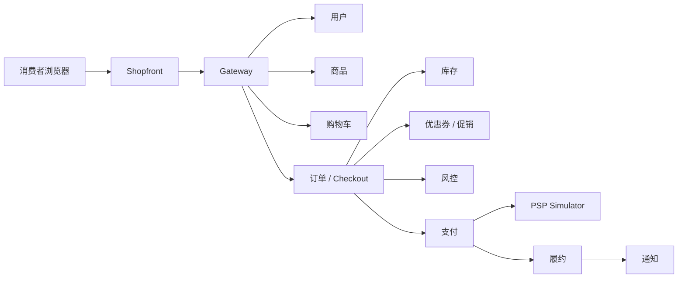
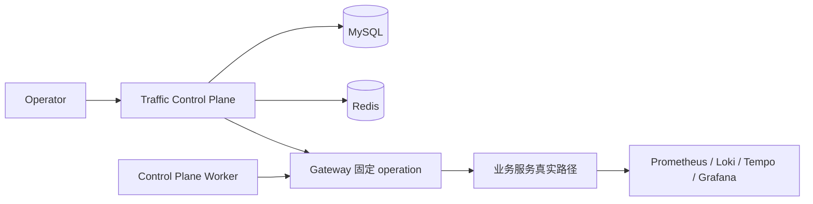
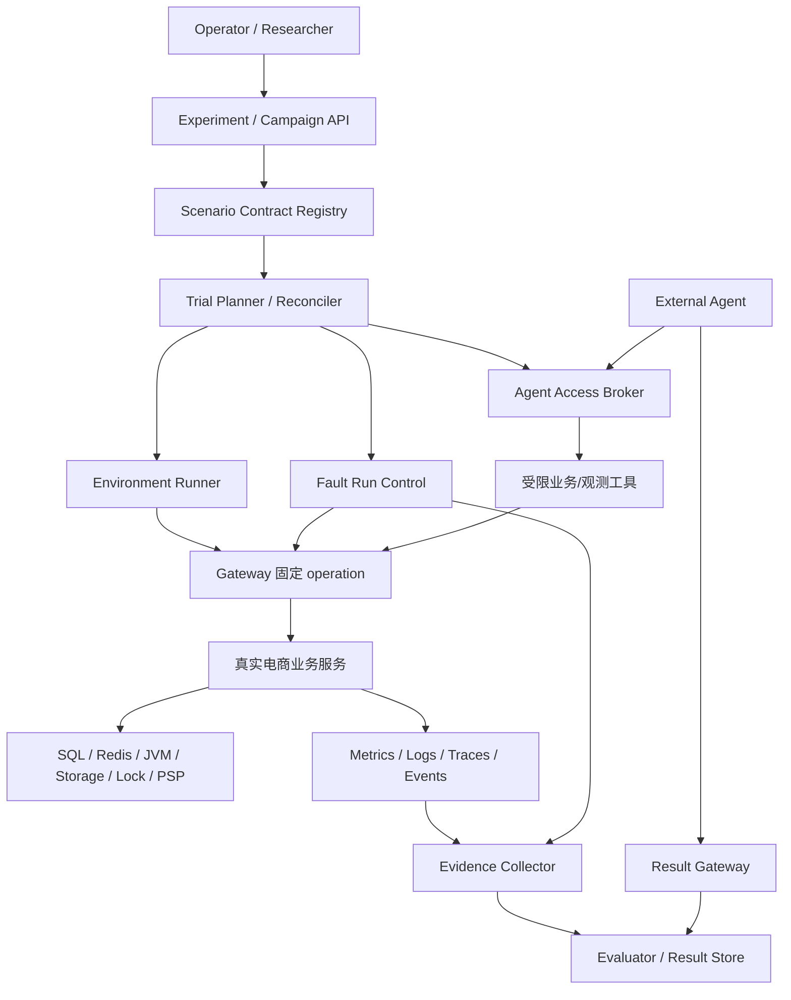

# ITBench 与 Castrel Chaos 架构对比宣讲材料

> 面向不了解两个项目的产品、研发、测试、SRE 和 AI Agent 相关人员。  
> 建议宣讲时长：20～30 分钟。  
> 本文重点不是罗列全部代码细节，而是回答三个问题：两个项目分别解决什么问题？它们的架构为什么不同？Castrel Chaos 下一步应如何演化？

## 1. 先用一句话理解两个项目

可以把两个项目想象成两种不同的“训练场”：

| 项目 | 一句话解释 | 更像什么 |
| --- | --- | --- |
| **ITBench** | 为 AI Agent 准备标准化 IT 问题、运行环境、观测数据和评估流程 | 一套面向 AI Agent 的运维考试与实验平台 |
| **Castrel Chaos** | 在真实电商业务链路中制造可观察、可停止、可恢复的资源和依赖异常 | 一座带真实业务系统的故障演练实验室 |

两者并不是简单的替代关系：

```text
ITBench     更关注：Agent 能不能发现、分析并解决问题？
Castrel     更关注：真实业务系统会如何受到影响？故障能不能被控制和恢复？
```

如果把两者结合起来，理想形态是：

```text
Castrel Chaos 提供真实的业务故障运行时
ITBench      提供可复现的任务规格、证据归档和 Agent 评估方法
```

## 2. 为什么需要这两类项目

### 2.1 传统故障演示的问题

很多“故障演示”只是让一个接口直接返回 `500`，或者在代码中固定等待几秒。这种方式可以快速展示错误，但不能很好地回答：

- 故障是否真的经过了业务链路？
- 数据库、缓存、连接池、JVM 或外部依赖是否真的受到影响？
- 运维人员看到的指标、日志和 Trace 是否符合真实系统？
- 故障停止后，系统是否能够恢复？
- 不同 AI Agent 的表现能否公平比较？

### 2.2 ITBench 和 Castrel 的切入点

ITBench 主要解决“**如何公平地测试 AI Agent**”：

1. 为 Agent 准备一个可重复的环境；
2. 注入一个描述清楚的问题；
3. 提供 Agent 可以使用的工具和权限；
4. 记录故障前、故障中和故障后的信息；
5. 根据 Ground Truth、状态和评估流程判断结果；
6. 支持多次执行和结果汇总。

Castrel Chaos 主要解决“**如何让故障像真实业务故障**”：

1. 提供一套完整电商业务；
2. 让异常落在真实 HTTP、SQL、Redis、JVM、文件、锁或支付依赖路径上；
3. 通过独立控制面启动和停止受控行为；
4. 记录审计、运行事件、业务指标、日志和 Trace；
5. 让 Worker、目标服务和控制面能够恢复或清理。

## 3. ITBench 是什么

### 3.1 ITBench 的核心组成

ITBench 的场景通常由以下几类对象组合而成：

```text
Application  被观测和操作的应用
Tool         Prometheus、Trace、日志、成本等运维工具
Fault        要注入的问题或错误状态
Waiter       注入前后等待环境达到某个状态的步骤
Scenario     将上述对象组合起来的任务
Ground Truth 预期症状、受影响实体和解决方向
Recorder     记录故障过程中的观测数据
```

这些对象通过模板、索引、JSON Schema 和 Ansible Role 组织起来。场景规格不是一段孤立脚本，而是可以被生成、校验、部署和清理的资源。

### 3.2 ITBench 的运行流程


可以把它理解为：

```text
准备考场
  -> 出一道题
  -> 给考生工具
  -> 记录考生如何观察和操作
  -> 判定题目是否解决
  -> 清理考场
```

### 3.3 ITBench 的规模化能力

ITBench 支持：

- Kind、Minikube 等本地 Kubernetes 环境；
- kOps/AWS 等云端环境；
- AWX Head/Runner 组织多个执行环境；
- 多次重复执行同一场景；
- Prometheus、Trace、日志、Kubernetes 事件、对象快照和拓扑等 Recorder；
- SRE/FinOps 的 Ground Truth、状态/Bundle 和外部或托管评估接入；
- CISO 场景的专用评估脚本。

需要注意几个边界：

- ITBench 主仓库不是完整的 LLM Agent 推理服务，参考 Agent 位于外部仓库；
- CISO 有比较明确的场景评估脚本，但不能把所有 SRE、FinOps、CISO 能力都理解成同一套本地评分器；
- AWX 的执行单元、托管环境、外部 Agent 和 Leaderboard 服务，不等于一个统一的本地 `Trial` 数据库模型；
- 对象或拓扑 Snapshot 不等于完整数据库、Redis、文件和外部依赖环境的可恢复快照。

## 4. Castrel Chaos 是什么

### 4.1 Castrel 的核心组成

Castrel Chaos 首先是一套电商系统：

```text
Shopfront
  -> Gateway
  -> User
  -> Catalog
  -> Cart
  -> Order
  -> Inventory
  -> Promotion
  -> Risk
  -> Payment
  -> Fulfillment
  -> Notification
  -> PSP Simulator
```

在这套业务系统之外，还有一个独立的 `traffic-control-plane`：

- 管理唯一的场景 Catalog；
- 创建和查询 Fault Run；
- 校验参数、时长和目标；
- 记录审计和运行事件；
- 通过 Gateway 调用固定业务 operation；
- 负责停止、恢复、清理和留存；
- 由独立 Worker 执行持续流量、报表、资源竞争、补给和数据预热。

### 4.2 Castrel 的两条主要链路

#### 消费者业务链路



#### 运营控制链路



控制面不是一个“随便让业务服务返回错误”的接口。它只能通过 Gateway 调用代码中固定的 operation；目标服务只接收通用的运行上下文，不理解控制面展示名和生命周期语义。

### 4.3 Castrel 当前场景举例

| 场景类型 | 真实路径 | 能观察到的影响 |
| --- | --- | --- |
| 报表慢查询 | Catalog/Order 真实报表 SQL | 查询延迟、数据库资源、连接池和业务请求变化 |
| 流量突增 | Worker 经 Gateway 持续调用业务 API | QPS、P95/P99、错误率、连接池和下游压力 |
| Redis 大值 | 商品详情 API 读取运行级 Redis Hash | 缓存命中、Redis 内存、回源和请求延迟 |
| JVM 堆压力 | Notification 真实通知路径保留对象 | Heap、GC、延迟和健康状态 |
| 存储增长 | Notification 真实文件追加 | 写入速率、文件大小、可用空间和清理状态 |
| 促销死锁 | 两个事务以相反顺序获取真实锁 | 锁等待、事务失败和数据库错误 |
| 库存表锁/行锁 | 真实 JDBC 表锁或 `SELECT ... FOR UPDATE` | 库存请求阻塞、等待和超时 |
| PSP 外部依赖 | Payment 经真实 HTTP 请求 PSP | 授权、拒付、超时、订单和通知后续状态 |

这里的 `Runner` 是正常客户生命周期或受控流量执行器，不是 AI Agent。

## 5. 两个项目的架构对比

### 5.1 用一个比喻理解

| 比喻 | ITBench | Castrel Chaos |
| --- | --- | --- |
| 场地 | 标准化、可重复搭建的 IT 考场 | 带完整电商业务的生产模拟城市 |
| 题目 | Kubernetes、SRE、FinOps、CISO 任务 | 业务依赖、资源竞争和运行时异常 |
| 考生/操作者 | 外部 AI Agent 或研究者 | Operator、后台 Worker，未来可接入 Agent |
| 判卷 | Ground Truth、状态、专用/托管评估流程 | 当前主要是运行状态、业务检查、事件、告警和恢复结果 |
| 批量能力 | AWX Head/Runner、多执行环境 | 当前单环境、单控制面、单 Worker 假设 |
| 主要价值 | 可比性、可组合性、评估和规模化 | 真实业务因果链、控制、恢复和可观察性 |

### 5.2 核心维度对比

| 维度 | ITBench | Castrel Chaos |
| --- | --- | --- |
| 首要目标 | 比较 AI Agent 解决 IT 任务的能力 | 演练真实电商系统中的异常和恢复 |
| 核心对象 | Application、Tool、Fault、Waiter、Scenario、Ground Truth | 业务服务、Fault Run、Run Event、Runner、Lease、Fencing Token |
| 故障方式 | Ansible、Chaos Mesh、配置/资源变更、合规策略 | 真实 SQL、Redis、JVM、文件、锁、HTTP 和业务依赖 |
| 运行方式 | 声明式规格转为 Ansible/AWX 工作流 | 控制面持久化状态，Worker 持续执行 |
| Agent 边界 | 临时 kubeconfig、Prometheus 和观测工具 | 当前面向 Operator；未来 Agent 需独立授权 |
| 观测 | 指标、告警、日志、Trace、Kubernetes 事件、对象/拓扑快照、成本 | Prometheus、Alertmanager、Loki、Tempo、业务指标、运行事件 |
| 评估 | SRE/FinOps Ground Truth、状态/Bundle、CISO evaluator 和托管/外部流程 | 尚无统一 Agent scorecard，侧重运行、恢复和审计 |
| 并发执行 | 多集群、多 Runner、异步 workflow | 当前共享 MySQL/Redis/端口/资源，活动运行全局受限 |
| 生命周期 | 部署 → 注入 → Agent → 记录 → 评估/提交 → 清理 | 创建 → Prepare → Active → Stop/Expire → Drain → Release/Recover |
| 扩展方式 | 新增模板、Schema、Role、场景和生成产物 | 新增 Catalog、Gateway operation、目标服务、Worker、恢复和测试 |
| 默认复杂度 | 组件多、环境准备成本高 | 业务服务多、数据和观测成本高，但本地入口更直接 |

### 5.3 谁更适合什么目标

| 目标 | 更适合的项目 | 原因 |
| --- | --- | --- |
| 比较多个 AI Agent 谁更会排障 | ITBench | 场景、环境、观测和结果边界更适合标准化。 |
| 培训业务系统故障传播 | Castrel Chaos | 故障会经过真实 Checkout、支付、库存、通知等链路。 |
| 练习 Kubernetes 平台运维 | ITBench | 故障和工具直接围绕 Kubernetes、网络、调度、成本和合规。 |
| 练习数据库、缓存、JVM、支付依赖异常 | Castrel Chaos | 场景直接作用于这些真实资源和依赖。 |
| 单次本地交互式演练 | Castrel Chaos | Compose、控制台和固定业务路径更容易启动。 |
| 多次执行、跨 Agent 比较 | ITBench | AWX/Runner 和结果 Bundle 更适合批量运行。 |
| 构建业务真实性更强的 Agent 基准 | 两者结合 | Castrel 提供运行时，ITBench 思路提供实验和评估层。 |

## 6. 各自的优势与局限

### 6.1 ITBench 的优势

1. **规格和复用能力强**：Application、Tool、Fault、Waiter 和 Scenario 分层，机制可以跨场景复用。
2. **实验边界清楚**：环境、Agent 权限、观测、Ground Truth、状态和结果归档有明确位置。
3. **批量执行能力好**：本地环境和 AWX 多 Runner 可以覆盖开发与规模化实验。
4. **领域覆盖较宽**：同时面向 SRE、FinOps 和 CISO。
5. **适合研究和横向比较**：场景定义、Recorder、Bundle 和 Leaderboard 接入可以支持不同 Agent 的比较。

### 6.2 ITBench 的局限

1. 组件和外部依赖较多，本地完整运行门槛高。
2. SRE/FinOps 与 CISO 的运行和评估协议仍不完全统一。
3. Agent 权限在隔离 Sandbox 中可以较宽，不适合直接迁移到生产集群。
4. 生成产物、文档、异步工作流和清理节点存在持续维护成本。
5. 很多任务侧重 Kubernetes、平台、成本或合规问题，不一定经过完整消费者业务状态机。

### 6.3 Castrel Chaos 的优势

1. **业务真实性强**：异常嵌入商品、购物车、Checkout、支付、履约和通知。
2. **资源级效果丰富**：SQL、Redis、JVM、文件系统、表锁、行锁和 PSP 都是真实路径。
3. **在线生命周期完整**：Fault Run 具备持久状态、幂等、fencing、lease、补偿、恢复和审计。
4. **业务面与控制面隔离清楚**：消费者不能访问内部 operation，业务服务不暴露控制面语义。
5. **适合互动式演练**：Operator 可以观察一次运行、停止它，并查看恢复结果。

### 6.4 Castrel Chaos 当前需要补强的地方

1. **还没有统一的 Agent 接入和评分协议**：当前 Runner 是正常客户流量，不是 AI Agent。
2. **并行实验隔离不足**：MySQL、Redis、连接池和 I/O 共享，不能直接把单环境扩展成多 Trial。
3. **Worker 所有权和重协调需要加强**：直接扩容可能带来重复执行和重复恢复。
4. **部分 Worker 的 Coordinator drain 不完整**：`ScenarioWorkers` 已注册 run-specific drain，报表和流量 Worker 仍主要依赖自身扫描或进程停止。
5. **评估证据未形成统一档案**：有实时指标、日志、Trace 和运行事件，但缺少稳定的 Evidence Manifest。
6. **确定性不够统一**：正常业务中存在随机失败率，PSP timeout 仍使用固定等待，不适合严格复现实验。
7. **Schema 演进能力有限**：已有特定手工 migration，但总体仍偏向 clean install 合同。
8. **数据预热和完整观测成本较高**：默认规模可能明显竞争 MySQL、磁盘、连接和网络资源。

## 7. Castrel Chaos 的演化方向

### 7.1 第一阶段：先让“运行平台”可靠

目标：即使 Worker 重启、重复启动、网络抖动或手工停止，Fault Run 也不会失控。

#### 关键能力

```text
持久化 Fault Run
        |
        v
Reconciler
  - owner lease
  - heartbeat
  - fencing
  - retry/resume
  - expiry recovery
  - orphan detection
        |
        v
统一 Worker 生命周期
  start -> drain -> release -> cleanup -> verify
```

#### 首要改进

- 为执行 Worker 增加 owner lease、heartbeat、owner ID 和执行 fencing；
- 将内存 timer 视为加速机制，不能作为唯一事实来源；
- 让报表、流量和专用场景 Worker 都注册 run-specific drain；
- 统一处理成功、失败、超时、取消、部分清理和目标不可用；
- 给所有等待增加总超时和最后状态；
- 引入版本化数据库 migration，支持升级、回滚和 schema 兼容性检查；
- 修复 PSP 固定 `Thread.sleep` 与真实外部超时模型之间的矛盾。

#### 完成标准

- Worker 重启后能够从数据库重建运行；
- 两个 Worker 同时启动时只有一个持有执行权；
- 旧 Worker 的请求被 fencing 拒绝；
- 停止操作能证明“停止接收新请求”和“等待中的请求已收敛”；
- 故障注入失败不会被记录成成功；
- 清理失败会明确显示为清理失败，而不是笼统的恢复成功。

### 7.2 第二阶段：把场景变成“可验证契约”

当前新增一个场景通常要修改 Catalog、Gateway、目标服务、Worker、runbook、国际化和测试。建议将这些隐式约定集中为版本化 Scenario Contract：

```text
Scenario Contract
  - target service / operation
  - parameter schema
  - duration and resource budget
  - prepare / active / stop / release / cleanup
  - expected evidence
  - recovery checks
  - side-effect checks
  - isolation requirements
```

该契约可以自动生成或校验：

- 控制面表单和 API 参数；
- Gateway 固定 operation；
- Worker dispatch；
- prepare/release 合同测试；
- runbook 必需章节；
- smoke test 所需证据；
- 中英文文案；
- 术语隔离检查。

注意：契约属于控制面和测试生成层，不能原样暴露给业务服务。业务服务仍只接收通用 operation、opaque run context 和业务参数。

### 7.3 第三阶段：增加 Trial、Evidence 和 Evaluator

#### 推荐的对象层级

```text
Environment
  -> Experiment
      -> Campaign
          -> Trial
              -> Fault Run (0..n)
```

含义如下：

| 对象 | 作用 |
| --- | --- |
| Environment | 一套隔离的 Compose/Kubernetes、数据库、Redis 和配置 |
| Experiment | 一组研究目标、Agent 版本和默认环境配置 |
| Campaign | 一个场景、参数矩阵、并发限制和停止策略 |
| Trial | 某个 Agent 在某个环境和配置下的一次可比较执行 |
| Fault Run | Trial 内具体的在线故障运行 |

#### Evidence Manifest

每个 Trial 结束后生成一份只读证据清单：

```json
{
  "trialId": "trial-001",
  "scenarioId": "BROWSE_REPORT_SQL",
  "catalogRevision": "catalog-2026-09-01",
  "environmentProfile": "benchmark",
  "seed": 12345,
  "timeline": {
    "createdAt": "…",
    "preparedAt": "…",
    "agentStartedAt": "…",
    "agentFinishedAt": "…",
    "recoveredAt": "…"
  },
  "artifacts": [
    { "kind": "metrics", "uri": "…", "sha256": "…" },
    { "kind": "logs", "uri": "…", "sha256": "…" },
    { "kind": "traces", "uri": "…", "sha256": "…" }
  ],
  "checks": {
    "targetEffectObserved": true,
    "consumerPathRecovered": true,
    "cleanupCompleted": true
  }
}
```

证据档案应区分：

```text
控制动作完成
目标效果实际发生
Agent 修复成功
业务恢复
资源清理完成
```

不能用“prepare 成功”代替“故障确实影响了业务”，也不能用“HTTP 返回成功”代替完整恢复验证。

#### 建议的评分维度

| 维度 | 示例问题 |
| --- | --- |
| Detection | Agent 是否在限定时间内发现异常？ |
| Diagnosis | 是否定位到正确服务、资源或依赖？ |
| Remediation | 是否采取允许且有效的修复动作？ |
| Recovery | 业务 SLO、健康检查和资源状态是否恢复？ |
| Safety | 是否越权、破坏无关数据或泄露内部信息？ |
| Efficiency | 用时、请求数、错误操作数和资源成本是多少？ |
| Reproducibility | 相同环境、配置和 seed 下是否可解释？ |

第一版可以是规则式 Evaluator，不必一开始就建设复杂的 Leaderboard。

### 7.4 第四阶段：为 Agent 建立独立安全边界

如果 Castrel 要支持外部 AI Agent，不建议让 Agent 登录 Operator 控制台，也不建议直接使用业务服务内部密钥。推荐增加：

```text
Task Descriptor
  -> 任务描述、截止时间、预算、可见入口

Agent Access Broker
  -> 短时凭据、工具 allowlist、资源范围、审计和撤销

Agent
  -> 观察、诊断和修复

Result Gateway
  -> 接收诊断、动作、结论和 Agent trace
```

需要严格区分：

| 身份 | 作用 |
| --- | --- |
| Operator | 创建、停止、恢复和清理 Fault Run |
| Customer Runner | 产生正常客户生命周期流量 |
| Agent | 在 Trial 范围内观察、诊断和修复 |

Ground Truth、评分规则、内部密钥和完整 Fault Run 控制权限不应暴露给 Agent。

### 7.5 第五阶段：支持多环境和多 Trial

建议通过显式环境 Profile 控制复杂度：

| Profile | 目标 |
| --- | --- |
| `lite` | 前端、接口和控制面开发，关闭大规模数据预热 |
| `full` | 完整电商故障演练和观测 |
| `benchmark` | 固定版本、seed、数据规模、证据和安全策略 |
| `isolated-trial` | 每个 Trial 使用独立 stack、namespace、数据库或 Redis 前缀 |
| `observability-heavy` | 深度 Trace、额外 Recorder 和高级诊断 |

重要原则：

- 共享数据库上的多个 Fault Run 不等于多个公平 Trial；
- 只有环境真正隔离后，才能把多个 Trial 并行执行；
- 本地开发不应默认承担大规模历史数据预热；
- 不应为了规模化而默认引入 AWX、ClickHouse 或 OpenSearch 等重型组件；
- AWX、Argo Workflows 或其他编排系统可以作为外部调度层，但不能替代 Castrel 的 Fault Run 状态机。

## 8. 推荐的目标架构



目标架构中各层职责应保持清楚：

| 层 | 责任 |
| --- | --- |
| Scenario Contract | 描述场景、参数、生命周期、证据和恢复条件 |
| Trial Planner/Reconciler | 分配环境和 Worker，处理 owner、重试、恢复和取消 |
| Fault Run Control | 管理一次具体受控运行的状态、fencing、审计和 release |
| Gateway/业务服务 | 执行真实业务 operation，不理解 Agent 评分语义 |
| Agent Access | 提供短时、最小权限、可审计的 Agent 工具 |
| Evidence Collector | 关联指标、日志、Trace、事件、业务检查和时间线 |
| Evaluator | 根据版本化规则计算结果，保留原始证据 |

## 9. 建议的落地优先级

### P0：可靠性和边界

- Worker owner lease、heartbeat、fencing 和重协调；
- 所有持续 Worker 接入统一 drain；
- 失败、超时、取消、部分成功和清理失败的明确状态；
- Scenario Contract 的基础校验；
- 数据库 migration 和 schema 兼容检查；
- PSP 外部超时模型改进；
- 不新增大批量场景，先把现有 12 个场景跑稳。

### P1：可评估性和确定性

- Environment/Trial 数据模型；
- seed、配置 revision、镜像 digest 和数据 profile；
- Evidence Manifest；
- 规则式 Evaluator；
- Agent Access Broker；
- `lite/full/benchmark` Profile；
- 至少一个场景的端到端 Agent 评估试点。

### P2：规模化和生态

- `isolated-trial` 多环境执行；
- 多 Worker/Worker Pool；
- 可选 Outbox 和消息驱动模式；
- FinOps 和 CISO adapter；
- 结果聚合、Leaderboard 和跨版本分析；
- 场景插件 SDK 和贡献规范。

## 10. 一个建议的首个试点

不建议一开始同时建设全部 12 个场景。可以选择一个依赖边界清晰、证据容易采集的场景完成闭环：

```text
创建 Environment
  -> 创建 Trial
  -> 创建 Fault Run
  -> 通过 Agent Access 给 Agent 任务和工具
  -> Agent 观察指标、日志、Trace 和业务结果
  -> Agent 执行允许的修复
  -> 验证目标效果、业务恢复和清理
  -> 生成 Evidence Manifest
  -> Evaluator 输出 scorecard
```

首个试点至少应证明：

1. 同一个场景能在两个相同 Profile 的环境中运行；
2. Agent 不能读取 Ground Truth 和 Operator 密钥；
3. 目标效果、业务影响、恢复和清理可以分别验证；
4. Worker 重启不会重复执行或跳过恢复；
5. 结果包含配置版本、镜像版本、seed、时间线和证据 hash；
6. 评分可以解释，而不是只有一个无法追溯的总分。

## 11. 宣讲时的建议主线

如果用于现场介绍，可以按以下顺序讲：

1. **先讲问题**：传统故障演示不一定真实，传统 Agent 评测不一定经过真实业务。
2. **再讲 ITBench**：它把场景、环境、工具、Ground Truth 和多次执行标准化。
3. **再讲 Castrel**：它把故障放进真实电商业务、数据库、缓存、JVM、锁和支付链路。
4. **用一张图对比**：ITBench 是“标准化考场”，Castrel 是“真实业务演练场”。
5. **说明互补关系**：Castrel 可以成为更真实的业务故障运行时，ITBench 的思想可以补齐评估和实验归档。
6. **最后讲路线图**：先修 Worker 和状态机，再做 Contract/Evidence/Evaluator，最后做多 Trial 和生态。

结束时可以用这句话总结：

> ITBench 解决“如何系统地比较 Agent”，Castrel Chaos 解决“如何让 Agent 面对真实的业务故障”。Castrel 的下一步，不是变成 ITBench，而是把真实演练能力演化成可复现、可评估、可批量运行的业务故障基准。

## 12. 主要依据

### ITBench

- `/Users/raven/code/ITBench/README.md`
- `/Users/raven/code/ITBench/documentation/architecture.md`
- `/Users/raven/code/ITBench/documentation/getting-started/awx.md`
- `/Users/raven/code/ITBench/scenarios/sre/templates/`
- `/Users/raven/code/ITBench/scenarios/sre/project/`
- `/Users/raven/code/ITBench/scenarios/sre/tools/`
- `/Users/raven/code/ITBench/scenarios/ciso/`
- `/Users/raven/code/ITBench/.github/workflows/`

### Castrel Chaos

- `README.md`
- `CLAUDE.md`
- `docs/architecture-overview.md`
- `docs/microservice-topology.md`
- `traffic-control-plane/src/lib/fault-run-catalog.ts`
- `traffic-control-plane/src/lib/fault-run-coordinator.ts`
- `traffic-control-plane/src/worker/`
- `gateway-service/src/main/java/com/castrel/chaos/gateway/controller/OperationDispatchController.java`
- `infra/mysql/init/`
- `infra/mysql/migrations/`
- `infra/prometheus/`
- `docker-compose.yml`
- `k8s/`
