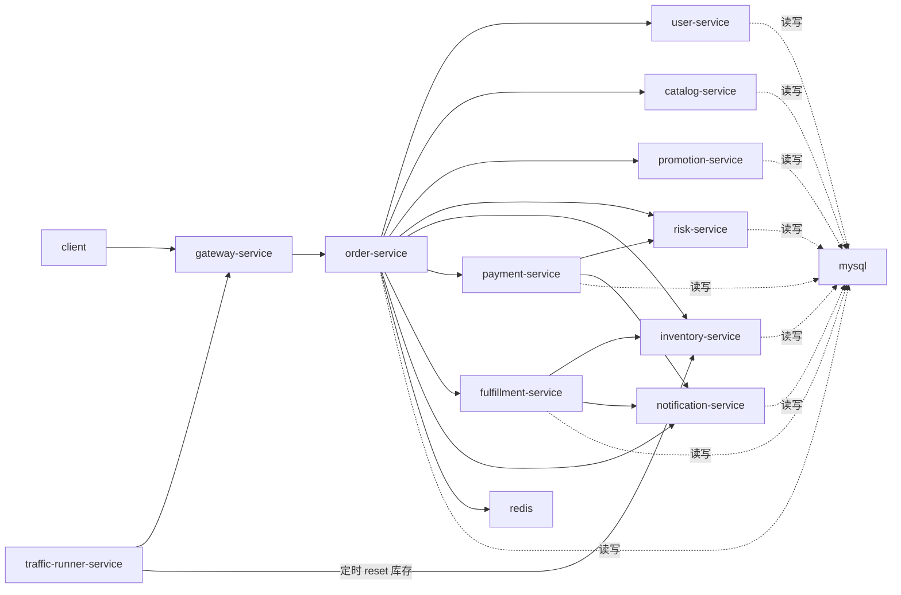

# Castrel Chaos 完整方案（基础7服务 + 扩展4服务，MySQL，自动业务流量，Chaos）

## Summary
- 基础服务为 `7`：`gateway`、`user`、`catalog`、`inventory`、`order`、`payment`、`traffic-runner`。
- 进阶链路扩展 `4` 个服务：`promotion`、`risk`、`fulfillment`、`notification`，总计 `11` 个服务，更适合深链路演练。
- 目标：系统启动后持续产生“正常业务流量”，并可注入 `网络故障 + JVM 内存泄漏 + 慢 SQL + 数据库死锁` 进行演练。
- 技术基线：`Spring Boot 3 + JDK 21 + Maven`，`MySQL 8 + Redis`，`Prometheus + Grafana + Loki + Tempo`，双轨部署 `Docker Compose + Kubernetes`。
- 关键约束：`runner` 通过“配置更新接口”实现 `DB 更新 + 内存规则同步生效`。

## 服务与接口
### gateway-service
职责：统一入口、路由转发、鉴权透传、trace 注入。

| 接口 | 分组 | 说明 |
|---|---|---|
| `POST /api/orders` | 对外 | 下单入口，接收客户端请求并转发到 `order-service`。 |
| `GET /api/orders/{id}` | 对外 | 订单查询入口，统一聚合订单状态返回。 |
| `GET /api/products` | 对外 | 商品列表查询入口，转发到 `catalog-service`。 |
| `GET /internal/gateway/routes` | 内部 | 返回网关路由快照，便于排查路由与灰度配置。 |

### user-service
职责：用户资料与收货地址查询。

| 接口 | 分组 | 说明 |
|---|---|---|
| `GET /api/users/{id}` | 对外 | 获取用户基础信息（昵称、等级、状态等）。 |
| `GET /internal/users/{id}` | 内部 | 供 `order-service` 获取下单用户信息。 |
| `GET /internal/users/{id}/address` | 内部 | 返回默认收货地址供风控/履约使用。 |

### catalog-service
职责：商品信息、SKU 与价格查询。

| 接口 | 分组 | 说明 |
|---|---|---|
| `GET /api/products` | 对外 | 商品列表与基础筛选查询。 |
| `GET /api/products/{sku}` | 对外 | SKU 详情查询（价格、上下架状态）。 |
| `POST /internal/catalog/batch` | 内部 | 批量查询商品信息，供下单时一次性校验多个商品。 |
| `POST /internal/chaos/slow-sql/enable` | Chaos | 开启慢 SQL 场景（`real`/`sleep`），用于延迟演练。 |
| `POST /internal/chaos/slow-sql/disable` | Chaos | 关闭慢 SQL 场景并恢复正常查询路径。 |

### promotion-service
职责：优惠券与促销规则计算。

| 接口 | 分组 | 说明 |
|---|---|---|
| `POST /api/promotions/preview` | 对外 | 预览优惠结果，返回优惠金额与可用券信息。 |
| `POST /internal/promotions/calculate` | 内部 | 下单时计算最终优惠明细（活动、满减、券叠加）。 |
| `POST /internal/chaos/slow-sql/enable` | Chaos | 开启促销规则慢查询场景。 |
| `POST /internal/chaos/slow-sql/disable` | Chaos | 关闭促销规则慢查询场景。 |

### risk-service
职责：前置风控与支付后复核。

| 接口 | 分组 | 说明 |
|---|---|---|
| `POST /internal/risk/pre-check` | 内部 | 下单前风控校验（账号风险、地址风险、频率风险）。 |
| `POST /internal/risk/post-pay-check` | 内部 | 支付后复核，决定是否冻结订单进入人工审核。 |
| `POST /internal/chaos/slow-sql/enable` | Chaos | 开启风控规则慢查询。 |
| `POST /internal/chaos/slow-sql/disable` | Chaos | 关闭风控规则慢查询。 |

### inventory-service
职责：库存预占、释放、库存查询。

| 接口 | 分组 | 说明 |
|---|---|---|
| `POST /internal/inventory/reserve` | 内部 | 预占库存，成功后返回库存锁定标识。 |
| `POST /internal/inventory/release` | 内部 | 支付失败或超时时释放已预占库存。 |
| `GET /internal/inventory/{sku}` | 内部 | 查询 SKU 当前可用库存。 |
| `POST /internal/inventory/reset` | 内部 | 重置库存到基线值（按全量或指定 SKU），用于日常演练前回盘。 |
| `POST /internal/chaos/slow-sql/enable` | Chaos | 开启库存慢 SQL 场景。 |
| `POST /internal/chaos/slow-sql/disable` | Chaos | 关闭库存慢 SQL 场景。 |

### order-service
职责：订单编排、状态机流转、幂等控制。

| 接口 | 分组 | 说明 |
|---|---|---|
| `POST /api/orders` | 对外 | 创建订单主入口，执行用户/商品/风控/库存/支付编排。 |
| `GET /api/orders/{id}` | 对外 | 查询订单当前状态与关键时间线。 |
| `POST /internal/orders/create` | 内部 | 内部创建订单接口，供 runner 或其他内部流程调用。 |
| `POST /internal/orders/{id}/cancel` | 内部 | 主动取消订单并触发库存回滚。 |
| `POST /internal/chaos/memory-leak/start` | Chaos | 启动 JVM 内存泄漏场景（持续持有对象引用）。 |
| `POST /internal/chaos/memory-leak/stop` | Chaos | 停止继续分配泄漏对象。 |
| `POST /internal/chaos/memory-leak/clear` | Chaos | 清理持有引用，触发内存回收观察。 |
| `GET /internal/chaos/memory-leak/status` | Chaos | 查看泄漏状态与当前持有对象规模。 |
| `POST /internal/chaos/slow-sql/enable` | Chaos | 开启订单慢 SQL 场景。 |
| `POST /internal/chaos/slow-sql/disable` | Chaos | 关闭订单慢 SQL 场景。 |
| `POST /internal/chaos/deadlock/enable` | Chaos | 开启订单死锁场景（构造相反锁顺序事务竞争）。 |
| `POST /internal/chaos/deadlock/disable` | Chaos | 关闭订单死锁场景，不再注入死锁竞争流。 |
| `POST /internal/chaos/deadlock/clear` | Chaos | 清理死锁注入任务并主动回滚阻塞事务。 |
| `GET /internal/chaos/deadlock/status` | Chaos | 查看死锁注入状态、死锁次数与最近错误。 |

### payment-service
职责：支付扣款模拟、支付状态查询与回执。

| 接口 | 分组 | 说明 |
|---|---|---|
| `POST /internal/payments/charge` | 内部 | 执行扣款，支持成功/失败/超时等可控结果。 |
| `GET /internal/payments/{id}` | 内部 | 查询支付单状态与失败原因。 |
| `POST /internal/chaos/memory-leak/start` | Chaos | 启动支付服务 JVM 内存泄漏场景。 |
| `POST /internal/chaos/memory-leak/stop` | Chaos | 停止支付服务内存泄漏分配。 |
| `POST /internal/chaos/memory-leak/clear` | Chaos | 清理支付服务泄漏对象引用。 |
| `GET /internal/chaos/memory-leak/status` | Chaos | 查询支付服务泄漏场景状态。 |
| `POST /internal/chaos/slow-sql/enable` | Chaos | 开启支付慢 SQL 场景。 |
| `POST /internal/chaos/slow-sql/disable` | Chaos | 关闭支付慢 SQL 场景。 |
| `POST /internal/chaos/deadlock/enable` | Chaos | 开启支付死锁场景（支付与订单更新并发互锁）。 |
| `POST /internal/chaos/deadlock/disable` | Chaos | 关闭支付死锁场景。 |
| `POST /internal/chaos/deadlock/clear` | Chaos | 清理支付死锁注入并释放阻塞事务。 |
| `GET /internal/chaos/deadlock/status` | Chaos | 查询支付死锁场景状态与死锁统计。 |

### fulfillment-service
职责：履约单创建、取消与物流状态跟踪。

| 接口 | 分组 | 说明 |
|---|---|---|
| `GET /api/fulfillments/{orderId}` | 对外 | 查询订单履约与发货状态。 |
| `POST /internal/fulfillments/create` | 内部 | 支付成功后创建履约单与发货任务。 |
| `POST /internal/fulfillments/cancel` | 内部 | 订单关闭时取消履约任务。 |
| `POST /internal/chaos/slow-sql/enable` | Chaos | 开启履约慢 SQL 场景。 |
| `POST /internal/chaos/slow-sql/disable` | Chaos | 关闭履约慢 SQL 场景。 |

### notification-service
职责：订单、支付、发货通知分发。

| 接口 | 分组 | 说明 |
|---|---|---|
| `POST /internal/notifications/order-created` | 内部 | 订单创建成功后发送下单通知。 |
| `POST /internal/notifications/payment-result` | 内部 | 发送支付成功/失败通知。 |
| `POST /internal/notifications/shipping-created` | 内部 | 发货后发送物流通知。 |

### traffic-runner-service
职责：启动后自动持续执行正常业务流量，并按定时策略触发库存 reset。

| 接口 | 分组 | 说明 |
|---|---|---|
| `GET /internal/runner/status` | 控制 | 返回运行状态、当前 QPS、成功率、失败率。 |
| `POST /internal/runner/pause` | 控制 | 暂停自动流量生成，保留当前规则配置。 |
| `POST /internal/runner/resume` | 控制 | 恢复自动流量生成。 |
| `POST /internal/runner/rate` | 控制 | 动态调整流量倍率（无需重启）。 |
| `POST /internal/runner/inventory-reset/trigger` | 控制 | 立即触发一次库存重置任务（调用 `inventory-service` reset 接口）。 |
| `PUT /internal/runner/inventory-reset/schedule` | 控制 | 更新库存重置定时策略并立即刷新内存调度器。 |
| `GET /internal/runner/inventory-reset/schedule` | 控制 | 查询当前库存重置定时策略与下次执行时间。 |
| `PUT /internal/runner/config` | 控制 | 更新规则配置并同步更新内存规则（无轮询热更新）。 |
| `GET /internal/runner/config` | 控制 | 查看当前 DB 配置版本与内存生效版本。 |

## 链路设计
- 正常下单链路：`traffic-runner -> gateway -> order -> user/catalog/inventory -> payment -> order 状态完成`。
- 支付失败链路：`payment 失败/超时 -> order 标记 FAILED -> inventory release -> runner 记录失败样本`。
- 慢 SQL 链路：`order|payment 开启 slow-sql(real/sleep) -> 请求延迟上升 -> 超时/重试/熔断触发 -> 指标与 trace 可见`。
- 死锁链路：`order|payment 开启 deadlock -> 并发事务互锁 -> MySQL 抛 Deadlock 错误 -> 触发重试/失败补偿`。
- 内存泄漏链路：`调用 memory-leak/start -> 堆持续增长与 GC 抖动 -> 延迟上升 -> clear 后回落`。
- 配置更新链路：`运维调用 PUT /internal/runner/config(version) -> MySQL 事务更新成功 -> 内存规则原子替换 -> 下一调度周期生效`。
- 库存重置链路：`runner 定时任务触发 -> 调用 inventory/reset -> 库存恢复基线 -> 继续自动流量回放`。
- 进阶下单链路：`order -> promotion(算优惠) -> risk(前置风控) -> inventory(预占) -> payment(扣款) -> risk(支付后复核) -> fulfillment(发货) -> notification(通知)`。
- 进阶失败补偿：`risk 拒绝` 直接关单；`payment 失败` 触发 `inventory/release`；`fulfillment 失败` 标记待人工处理并发送告警通知。

## 链路关系 Mermaid

## 数据与配置模型
- MySQL 核心表：
  - `runner_profile`：`enabled`, `base_qps`, `peak_multiplier`, `cycle_minutes`, `jitter_pct`, `version`。
  - `runner_inventory_reset_policy`：`enabled`, `cron_expr`, `reset_scope`, `baseline_version`, `version`。
  - `runner_mix_rule`：`action_type`, `ratio`, `version`。
  - `runner_time_window`：`start_time`, `end_time`, `multiplier`, `version`。
- 规则更新机制：
  - `PUT /internal/runner/config` 必须带 `version`（乐观锁）。
  - 成功返回 `newVersion`、`appliedAt`、`activeRuleDigest`。
  - 更新失败不影响当前内存规则运行。

## Chaos 实施与验收
- 注入工具：
  - Compose：`ToxiProxy + Pumba`（延迟、丢包、容器重启）。
  - K8s：`Chaos Mesh`（`NetworkChaos`、`PodChaos`、`StressChaos`）。
- 必测场景：
  1. 基线连续流量 30 分钟，成功率与延迟稳定。
  2. `order -> payment` 网络延迟 2-5 秒，验证重试/熔断。
  3. `order` 内存泄漏 10-15 分钟，验证堆与 GC 告警，`clear` 后恢复。
  4. `payment` 慢 SQL（real + sleep），验证慢日志、P95、错误率上升。
  5. `order/payment` 死锁注入，验证死锁错误可观测、重试上限与回滚补偿生效。
  6. 组合故障（网络 + 慢 SQL + 死锁），验证系统恢复时间与业务可用性。
- 验收标准：
  - 故障期间系统可观测，恢复后 5 分钟内回到可下单状态。
  - Runner 可不停机动态调速、暂停恢复、配置更新即生效。
  - 演练全过程有统一 `traceId` 与结构化 `chaos_event` 日志。

## Assumptions
- 默认采用扩展方案（11 服务）用于更深链路演练；如需降复杂度，可先落地基础 7 服务再逐步拆分扩展服务。
- 首版不引入 Kafka，异步仅使用 Redis。
- 所有 Chaos 控制接口仅在 `chaos` profile 暴露并受内部鉴权保护。
