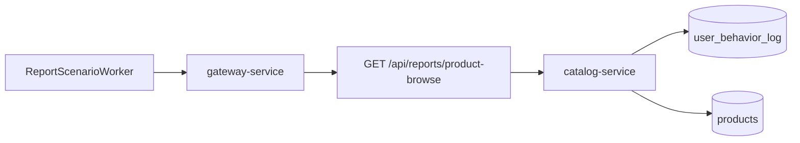

# Product Browse Report SQL

`Scenario: BROWSE_REPORT_SQL`

## Purpose and fixed target

This scenario exercises the product browse report through `catalog-service`. The fixed target operation is `products-browse-report`; the report worker repeatedly calls `GET /api/reports/product-browse` through `gateway-service`.

The target-side preparation endpoint is `/internal/catalog/reports/product-browse/prepare`, dispatched by `POST /internal/gateway/operations/prepare`. Release uses the matching `/release` endpoint. These endpoints validate the operation context and acknowledge it; they do not install an artificial delay.

## Actual implementation

`CatalogService.browseReport()` selects the baseline or optimized report implementation according to `REPORTS_OPTIMIZED`. The baseline joins `products` with matching historical `user_behavior_log` rows, groups and orders the result, and does not add the current-day date range. The optimized implementation adds the current-day range and is intended to be the repair path.

The observable effect is repeated real report work against Catalog and MySQL. There is no `SLEEP()` call, fabricated timer, or controller-generated report failure. The report worker sends a request, records the result and latency, waits about one second, and repeats until expiry or stop.



The diagram summarizes the request path: `ReportScenarioWorker` calls the Gateway, the Gateway reaches the public Catalog report route, and the report reads both `user_behavior_log` and `products`. The exact SQL and its current-day predicate must be verified in the deployed code version.

## Parameters and lifecycle

The catalog requires `durationSec` and limits it to the scenario maximum. The worker owns the repeated request loop. A run follows the normal control-plane lifecycle, then the worker stops at `expiresAt` or when an operator stops the run. The coordinator invokes the fixed target release path during recovery.

This scenario does not write or delete report data. Its recovery action stops future report requests; it does not apply the SQL optimization automatically.

## Impact and exclusions

Potentially affected resources are:

- Catalog report request latency and throughput.
- Catalog JDBC connections and MySQL reads from `user_behavior_log` and `products`.
- The selected report worker and its in-flight request.

The scenario does not intentionally modify business data, orders, payments, or unrelated service state. Actual blast radius depends on the amount of historical behavior data, indexes, database capacity and the value of `REPORTS_OPTIMIZED`.

## Evidence

Use these evidence sources separately:

- `fault_run_events`: `REPORT_WORKER_STARTED`, `REPORT_REQUEST`, `REPORT_REQUEST_FAILED`, and `REPORT_WORKER_STOPPED` show worker activity, request counts, failures and latency.
- Tempo: inspect the Catalog HTTP server span and child JDBC spans for the report request.
- Database: compare the baseline query plan and scanned rows with the optimized version using `EXPLAIN` in the target environment.
- Application behavior: a successful response proves the report completed, not that it used the optimized plan.

## Tempo investigation

Set the time range to cover the run, starting with `now-1h to now`. In Tempo, search the target service first:

```traceql
{ resource.service.name = "catalog-service" }
```

Then narrow to errors if the request was recorded as an error:

```traceql
{ resource.service.name = "catalog-service" && status = error }
```

For slow report requests, use the scenario threshold as a starting point:

```traceql
{ resource.service.name = "catalog-service" && duration > 2s }
```

If the deployed agent exposes the route attribute, refine it with:

```traceql
{ resource.service.name = "catalog-service" && span.http.route = "/api/reports/product-browse" }
```

Inspect the HTTP span duration, the JDBC child spans, the database statement shape and exception events. The report worker event payload is control-plane evidence and is not a Tempo span event.

## Recovery and verification

After stop or expiry, confirm `REPORT_WORKER_STOPPED`, the recovery events and the absence of new report-worker requests. Verify that the Catalog report endpoint responds normally. If validating an optimization, deploy the application/index change separately, compare result correctness at the day boundary, and compare `EXPLAIN` or `EXPLAIN ANALYZE`; stopping this run is not an optimization verification.

## Alert mapping

| Alert | Trigger condition | Meaning and boundary for this scenario |
| --- | --- | --- |
| `HighLatencyP99` | Report-request P99 exceeds 5 seconds for 2 minutes | Indicates slower product-report requests; it does not confirm that the scenario started. |
| `CriticalLatencyP99` | Report-request P99 exceeds 10 seconds for 1 minute | Indicates that report latency has reached the critical level. |
| `MySQLSlowQueries` | Slow-query rate exceeds 0.5 per second for 1 minute | Scanning historical behavior data may produce this signal; the result depends on data volume and database settings. |
| `HikariPoolExhaustion`, `HikariPoolFull`, `HikariPoolPending` | Pool utilization or pending connections reaches the relevant rule threshold | May occur when the larger report scan consumes connections. |
| `MySQLHighThreads`, `NodeHighCPU` | MySQL connection count or node CPU reaches the relevant rule threshold | Appears only when pressure spreads to shared resources. |
| No product-report-specific alert | Not applicable | Running the scenario or using baseline SQL does not guarantee crossing a threshold; correlate `fault_run_events`, Tempo JDBC spans and MySQL diagnostics. |

## Limits and safe interpretation

The scenario name describes the report workload, not a guaranteed slow-query injection. Latency, scan volume and the benefit of an index depend on the populated data window and the deployment. `fault_runs.trace_id` and `X-Trace-Id` are business correlation values, not verified OTel trace IDs. Use the business value in Loki together with the time range when an exact run must be correlated.