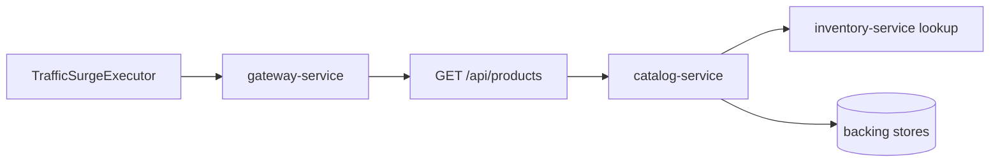

# Product Browse Traffic Surge

`Scenario: BROWSE_SURGE`

## Purpose and fixed target

This scenario generates controlled normal traffic for `GET /api/products`. The request producer is the `traffic-control-plane` `TrafficSurgeExecutor`; it sends each request through `gateway-service` and does not call a target-side prepare or release endpoint.

Each request uses `page=0`, `size=<pageSize>` and `sort=latest`. `pageSize` is bounded by the catalog limit, currently at most `100`.

## Actual implementation

`ControlledScenarioWorker` starts batches at the configured `concurrency` and waits `requestIntervalMs` between batches. `TrafficSurgeExecutor` calls `GatewayClient.get`, so the request traverses the normal Gateway and Catalog business path. `CatalogService.listProducts()` executes the ordinary product query and product-to-DTO conversion, including any normal downstream inventory lookup used by that conversion.



The producer is a control-plane worker, but it is not itself an OTel Java service target. Start Tempo investigation at `gateway-service` and the Java services that handle the request.

## Parameters and lifecycle

The catalog accepts `durationSec`, `concurrency`, `requestIntervalMs` and `pageSize`. The worker stops on expiry, operator stop or control-plane shutdown by aborting new work and recording its final snapshot. No service-side resource is installed, so there is no target release operation for this scenario.

## Impact and exclusions

Potentially affected resources are:

- Gateway request throughput and connection capacity.
- Catalog HTTP handling, product queries, DTO conversion and downstream reads.
- Backing database/Redis resources used by the normal product-list path.

The scenario does not change Catalog data, does not use a customer session and does not intentionally target customer ID `19`. It does not modify the regular Runner configuration or lifecycle. The browse request itself is not customer-authenticated.

## Evidence

- `fault_run_events`: `SCENARIO_WORKER_STARTED`, `SCENARIO_REQUEST_FAILED`, and `SCENARIO_WORKER_STOPPED` contain request, failure, timeout, in-flight and latency-percentile statistics.
- Tempo: inspect Gateway and Catalog HTTP spans, then the JDBC/Redis/downstream spans underneath them.
- Metrics/logs: Catalog’s normal list query counter and service latency/health signals provide supporting evidence; they are not a scenario-specific fault metric.
- The worker’s final snapshot proves generated traffic, not that every request reached the business service.

## Tempo investigation

Use `now-1h to now` or a window covering the run. Search the Gateway first:

```traceql
{ resource.service.name = "gateway-service" }
```

Then search Catalog:

```traceql
{ resource.service.name = "catalog-service" }
```

For errors in either service, run the corresponding service query with `&& status = error`. For slow requests, start with:

```traceql
{ resource.service.name = "catalog-service" && duration > 1s }
```

If route attributes are present, refine the Catalog query with:

```traceql
{ resource.service.name = "catalog-service" && span.http.route = "/api/products" }
```

Inspect request rate, HTTP server duration, product-query spans, downstream inventory calls and exception events. `traffic-control-plane` worker events are not Tempo spans.

## Recovery and verification

Confirm `SCENARIO_WORKER_STOPPED` and that the in-flight count converges. After recovery, normal `GET /api/products` traffic should work with the existing Runner configuration unchanged. Check Gateway and Catalog health and compare request latency after the worker has stopped.

## Alert mapping

| Alert | Trigger condition | Meaning and boundary for this scenario |
| --- | --- | --- |
| `HighLatencyP99` | Gateway/Catalog request P99 exceeds 5 seconds for 2 minutes | Indicates that controlled browse traffic has affected request latency. |
| `CriticalLatencyP99` | Gateway/Catalog request P99 exceeds 10 seconds for 1 minute | Indicates that request latency has reached the critical level. |
| `HighErrorRate` | The service/URI 5xx ratio exceeds 5% for 1 minute | Fires only when browse requests actually return 5xx; traffic generation alone does not trigger it. |
| `HikariPoolExhaustion`, `HikariPoolFull`, `HikariPoolPending`, `MySQLHighThreads`, `MySQLSlowQueries` | Pool, MySQL connection count or slow-query rate reaches the relevant rule threshold | May occur when traffic pressure expands into database connections. |
| `NodeHighCPU`, `NodeHighMemory`, `RedisHighMemory` | Node CPU/memory or Redis utilization reaches the relevant rule threshold | Fires only when shared infrastructure crosses a threshold. |
| No traffic-specific alert | Not applicable | Correlate worker events with Gateway/Catalog HTTP and JDBC/Redis spans. |

## Limits and safe interpretation

This is controlled traffic generation, not a Catalog fault toggle and not a guaranteed error source. Observed saturation depends on concurrency, interval, page size, baseline traffic and resource capacity. The control-plane worker is not a queryable OTel `service.name`; use Gateway and downstream Java services in Tempo. `X-Trace-Id` is business correlation only.