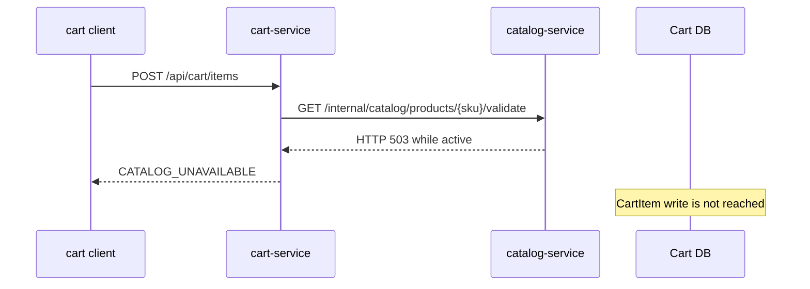

# Cart to Catalog Dependency Failure

`Scenario: CART_CATALOG_DEPENDENCY`

## Purpose and fixed target

This scenario exercises the product validation dependency used before adding an item to a cart. The fixed target operation is `cart-product-validation`; preparation uses `/internal/catalog/dependencies/cart-product-validation/prepare`, and the business path is `POST /api/cart/items` in `cart-service`.

## Actual implementation

`CartService.addItem()` calls `CatalogProductClient.requireListed()`, which requests `GET /internal/catalog/products/{sku}/validate` from `catalog-service` before creating or saving the `CartItem`. While the run is active, `CatalogDependencyState` makes `CatalogService.validateListedProduct()` return a real HTTP 503 after the product/listing validation boundary.



The failure is a real dependency response. It is not a fabricated Cart response and does not imply that every Catalog endpoint is unavailable.

## Parameters and lifecycle

The catalog requires `durationSec`. The coordinator sends fixed prepare and release contexts through Gateway. Release or cleanup clears the service-local active run state. No business data cleanup is required because the validation should fail before Cart/CartItem persistence.

## Impact and exclusions

Potentially affected resources are:

- Cart add-item validation requests while the state is active.
- The Cart-to-Catalog HTTP dependency and its error handling.
- Client-visible add-item failures using the normal business error boundary.

The scenario does not intentionally write Cart or CartItem records, and it does not block Catalog APIs other than product validation. Existing data is not deleted. A counter increment before validation is not proof that a `CartItem` row was written.

## Evidence

- `fault_run_events`: lifecycle and target confirmation events show when the fixed target was active and recovered.
- Tempo: inspect the Cart server span, its Catalog client span and the Catalog validation span.
- HTTP/application: look for a 503 at the dependency boundary and the `CATALOG_UNAVAILABLE` business error at the Cart client boundary.
- Database: verify no new CartItem mutation was committed for the failed request; do not infer this from a request counter alone.

## Tempo investigation

Use a time range covering the run and start with both service scopes:

```traceql
{ resource.service.name = "cart-service" }
```

```traceql
{ resource.service.name = "catalog-service" }
```

For OTel errors, add `&& status = error` to the relevant service query. For slow dependency requests:

```traceql
{ resource.service.name = "cart-service" && duration > 500ms }
```

If route attributes are available, the Cart request can be narrowed with:

```traceql
{ resource.service.name = "cart-service" && span.http.route = "/api/cart/items" }
```

Inspect the Cart HTTP span, Catalog client/server span, response status, exception events and transaction boundary. A handled `BizException` may still appear as HTTP 200 at the outer envelope, so use the dependency response and application logs too.

## Recovery and verification

Confirm the target release/cleanup event and that the Catalog dependency state is no longer active. Retry a valid add-item request after recovery and verify a normal CartItem mutation. Check that other Catalog operations continue to work and no failed request created a CartItem.

## Alert mapping

| Alert | Trigger condition | Meaning and boundary for this scenario |
| --- | --- | --- |
| `HighErrorRate` | The Catalog validation URI 5xx ratio exceeds 5% for 1 minute | The active dependency may return 503 and trigger it; the outer Cart request may wrap the failure in a business envelope and remain HTTP 200. |
| `HighLatencyP99` | Request P99 exceeds 5 seconds for 2 minutes | Fires when the dependency call becomes slow enough to cross the threshold. |
| `CriticalLatencyP99` | Request P99 exceeds 10 seconds for 1 minute | Fires when dependency latency reaches the critical level. |
| No Cart-to-Catalog-specific alert | Not applicable | Correlate Prometheus results with the Catalog 503, Cart logs, Tempo client/server spans and `fault_run_events`. |

## Limits and safe interpretation

This is a service-local dependency response control, not a full Catalog outage and not an arbitrary downstream failure injector. It is single-run state and does not accept a user-selected service, URL or path. `fault_runs.trace_id` and `X-Trace-Id` are business correlation values, not Tempo trace IDs.