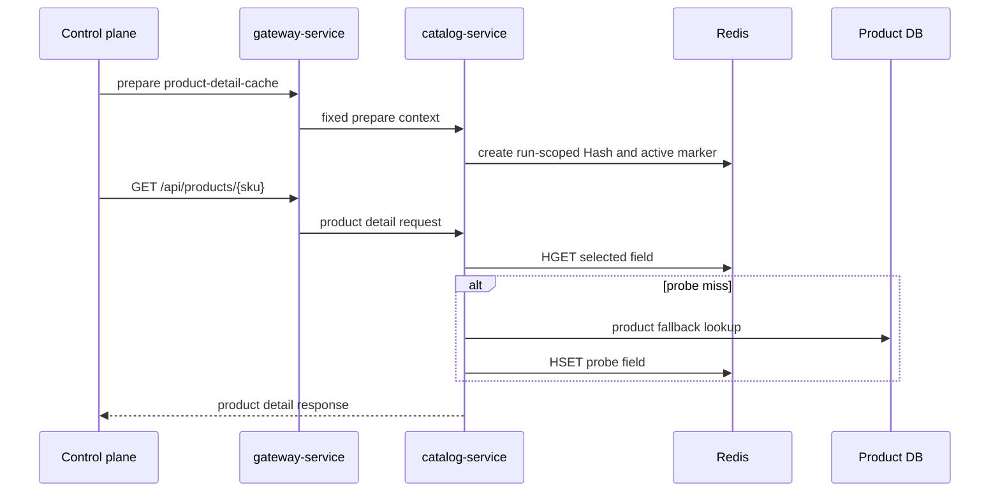

# Catalog Redis Large Value

`Scenario: CATALOG_REDIS_LARGE_VALUE`

## Purpose and fixed target

This scenario exercises selected catalog product-detail reads through a run-scoped Redis Hash. The fixed target operation is `product-detail-cache`; preparation uses `/internal/catalog/product-details/cache/prepare`, and normal traffic is `GET /api/products/{sku}` through `gateway-service`.

The catalog parameters are `durationSec`, `concurrency`, `requestIntervalMs`, `memberCount`, `memberSizeBytes` and `keyTtlSec`. `memberCount` is the number of Hash fields. It is not the number of top-level keys and it is not the read concurrency.

## Actual implementation

`ProductDetailCacheProvisioningService.start()` selects sellable products, serializes valid product-detail envelopes, pads each selected field to the requested logical size, creates one run-scoped Redis Hash and publishes an active marker containing the run identity, fencing token, Hash key and probe SKU. The worker then cycles through the prepared SKUs by calling the normal product-detail API.

The Catalog resolver uses the active marker to select the run Hash for selected fields. A probe field can miss and fall back to the product database before being cached in the same run Hash. This path uses real Redis reads, serialization/deserialization and HTTP responses.



The diagram shows the run Hash and probe fallback. It does not authorize arbitrary Redis keys or values; all names and values are generated by the fixed Catalog implementation.

## Parameters and lifecycle

The server validates logical member sizes, aggregate budget and a TTL that covers the run plus cleanup grace. Preparation completes before the active marker is published. On stop or expiry, the worker stops new reads, the target release removes the marker and run Hash, and the operation guard is released. Cleanup by `faultRunId` remains available when the catalog permits manual cleanup.

## Impact and exclusions

Potentially affected resources are:

- Selected product-detail requests and their response latency.
- Catalog heap/network use while serializing and reading large envelopes.
- Shared Redis memory, lookup and network capacity.

The run uses one run-scoped Hash plus marker keys. It does not target arbitrary Redis keys, the default product cache or business data. A probe miss may read the product database normally; this is part of the controlled fallback path.

## Evidence

- `fault_run_events`: target confirmation and `SCENARIO_WORKER_TARGET` identify the run target; worker events contain cache result counters and latency.
- Cache result values: `CACHE_HIT`, `CACHE_MISS_DB_FALLBACK`, `CACHE_INVALID_FALLBACK` and `CACHE_BACKEND_ERROR` distinguish the product-detail path.
- HTTP: `X-Castrel-Cache-Result` is a response-level observation for the detail request.
- Catalog metrics: `catalog.product.detail.cache.count` and `catalog.product.detail.cache.duration` support request-level analysis.
- Redis: memory usage and Redis spans show backend cost; they do not prove a particular physical memory threshold was crossed.

## Tempo investigation

Use `now-1h to now` or a window covering the run. Search Catalog first:

```traceql
{ resource.service.name = "catalog-service" }
```

For OTel errors:

```traceql
{ resource.service.name = "catalog-service" && status = error }
```

For slow detail reads:

```traceql
{ resource.service.name = "catalog-service" && duration > 1s }
```

If the deployed agent exposes the route:

```traceql
{ resource.service.name = "catalog-service" && span.http.route = "/api/products/{sku}" }
```

Inspect the HTTP span, Redis child spans, serialization/deserialization work and exception events. Use the response header and control-plane cache counters as separate application evidence.

## Recovery and verification

Confirm the worker has stopped, the active marker is absent, the run Hash has been deleted and the coordinator records cleanup/recovery. Verify normal product-detail reads use the default path after recovery and that unrelated product data/cache keys remain available.

## Limits and safe interpretation

The logical byte size is a controlled envelope budget, not a promise about Redis allocator usage or physical memory. The scenario does not make a general Catalog outage. TTL and cleanup provide boundaries, but operators should still verify the run-specific key and marker after recovery. The displayed `traceId` is business correlation, not a verified OTel trace ID.