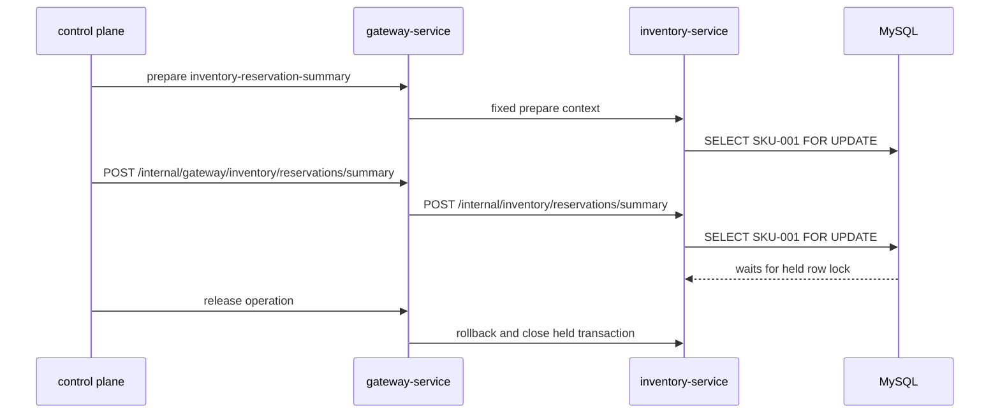

# Inventory Row Lock

`Scenario: INVENTORY_ROW_LOCK`

## Purpose and fixed target

This scenario holds one inventory row lock and observes a separate reservation summary read in `inventory-service`. The fixed target operation is `inventory-reservation-summary`; preparation uses `/internal/inventory/reservations/prepare` and targets the row for `SKU-001`.

The observation request is Gateway `POST /internal/gateway/inventory/reservations/summary`, forwarded to `POST /internal/inventory/reservations/summary`.

## Actual implementation

Preparation opens a dedicated transaction and holds the result of:

```sql
SELECT ... FROM inventories WHERE sku = 'SKU-001' FOR UPDATE
```

Each observation opens another transaction and executes the same row-locking read. It can wait for the preparation transaction until the target releases or rolls back the held transaction.



The two transactions use the same fixed SKU. This is a row-level lock path, not a whole-table lock.

## Parameters and lifecycle

The catalog accepts `durationSec`, `concurrency` and `requestIntervalMs`. The dedicated preparation transaction remains open until release, expiry cleanup or an error path. The worker stops new summary requests during recovery. Release rolls back the held transaction, closes its connection, clears run identity/fencing state and releases the guard.

## Impact and exclusions

Potentially affected resources are:

- The `inventories` row for `SKU-001`.
- Transactions that require that row lock and the reservation summary requests.
- Inventory JDBC connections and waiting request latency.

The scenario does not intentionally hold a whole-table lock or lock other SKU rows. Broader effects are still possible if blocked work consumes shared connection or thread capacity. It does not accept an arbitrary SKU or SQL statement.

## Evidence

- `fault_run_events`: worker start, request failure, stop and recovery events identify the controlled observation loop.
- Tempo: inspect Inventory HTTP/JDBC spans and duration for the reservation summary.
- Database: inspect row lock waits and confirm the held transaction rolls back at release.
- Recovery: a successful summary containing SKU quantities/version after release shows the read path progressed.

## Tempo investigation

Use a time range covering the run:

```traceql
{ resource.service.name = "inventory-service" }
```

For OTel errors:

```traceql
{ resource.service.name = "inventory-service" && status = error }
```

For lock-waiting summary calls:

```traceql
{ resource.service.name = "inventory-service" && duration > 1s }
```

If confirmed in Tempo, narrow with:

```traceql
{ resource.service.name = "inventory-service" && span.http.route = "/internal/inventory/reservations/summary" }
```

Inspect the summary HTTP span, both JDBC lock reads, duration and exception events. Use database lock-wait diagnostics because waiting is not necessarily an OTel error.

## Recovery and verification

Confirm new summary calls stop, the held transaction rolls back, its connection closes and no run-owned row lock remains. Issue a normal reservation summary and verify it returns. Check that the table-lock scenario was not activated and other SKU rows were not intentionally held.

## Alert mapping

| Alert | Trigger condition | Meaning and boundary for this scenario |
| --- | --- | --- |
| `HighLatencyP99` | Inventory-summary P99 exceeds 5 seconds for 2 minutes | A row-lock wait normally appears as slow requests before timeout. |
| `CriticalLatencyP99` | Inventory-summary P99 exceeds 10 seconds for 1 minute | Indicates that the row-lock wait has caused critical request latency. |
| `HighErrorRate` | A row-lock wait timeout or database failure is exposed as HTTP 5xx by the Gateway observation URI, and the ratio reaches 5% for 1 minute | This is the primary conditional result alert; the target business envelope may be HTTP 200 and is converted to 502 by Gateway when rejected. |
| `HikariPoolExhaustion`, `HikariPoolFull`, `HikariPoolPending`, `MySQLSlowQueries`, `MySQLHighThreads` | The pool or MySQL reaches the relevant rule threshold | May appear when concurrent waits consume connections or increase database pressure. |
| No row-lock-wait-specific alert | Not applicable | Correlate alerts with `SCENARIO_REQUEST_FAILED`, Tempo exception/JDBC spans and MySQL row-lock-wait diagnostics. |

## Limits and safe interpretation

This scenario holds a fixed row lock, not a guaranteed timeout. Wait duration depends on MySQL, the JDBC driver and concurrent work. It is narrower than `INVENTORY_TABLE_EXCLUSIVE`, but shared resource exhaustion can broaden the operational impact. `X-Trace-Id` is business correlation, not a verified Tempo trace ID.