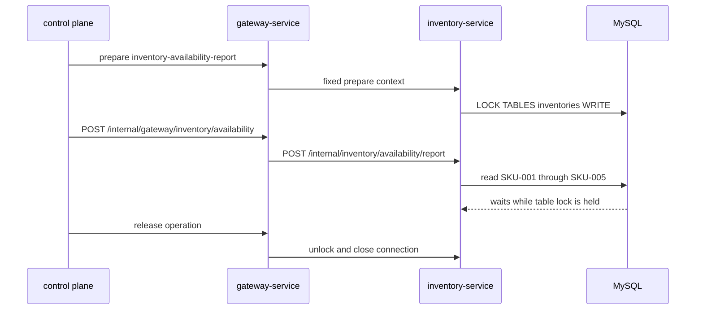

# Inventory Table Exclusive Lock

`Scenario: INVENTORY_TABLE_EXCLUSIVE`

## Purpose and fixed target

This scenario holds a write table lock in `inventory-service` and observes normal inventory reads. The fixed target operation is `inventory-availability-report`; preparation uses `/internal/inventory/availability/prepare` and holds a dedicated JDBC connection with `LOCK TABLES inventories WRITE`.

The observation request is Gateway `POST /internal/gateway/inventory/availability`, forwarded to `POST /internal/inventory/availability/report`. The report reads a fixed set of five SKUs: `SKU-001` through `SKU-005`.

## Actual implementation

`InventoryAvailabilityService.prepare()` obtains a dedicated connection and executes:

```sql
LOCK TABLES inventories WRITE
```

The connection remains held until release or cleanup. During the hold, the observation report performs a normal read on another path, so reads and writes requiring `inventories` can wait behind the table lock.



The table lock is held by the dedicated preparation connection, not by the observation request. Release must unlock and close that connection before normal reads are expected to progress.

## Parameters and lifecycle

The catalog requires `durationSec`. The coordinator prepares the fixed target, and the target retains the lock until release, expiry cleanup or an error path closes the resource. The worker stops new observation requests before recovery. Recovery executes `UNLOCK TABLES`, closes the dedicated connection, clears the run identity and releases the operation guard.

## Impact and exclusions

Potentially affected resources are:

- The entire `inventories` table, including unrelated reads and writes that need it.
- Inventory JDBC connections and availability report requests.
- Requests waiting for the table lock, with latency or timeout depending on configuration.

The scenario does not intentionally lock tables other than `inventories` and does not accept arbitrary SQL, table names or SKU lists. It is broader than the row-lock scenario because the lock granularity is the table.

## Evidence

- `fault_run_events`: target confirmation, observation request failures, stop and recovery events.
- Tempo: inspect Inventory HTTP spans, JDBC spans and long request duration.
- Database: use lock-wait or process-list diagnostics to observe the held table lock and blocked sessions.
- Recovery: a successful report after release, with its rows and `skuCount`, supports that the read path recovered.

## Tempo investigation

Use a window covering the run:

```traceql
{ resource.service.name = "inventory-service" }
```

For exported errors:

```traceql
{ resource.service.name = "inventory-service" && status = error }
```

For blocked availability reports:

```traceql
{ resource.service.name = "inventory-service" && duration > 1s }
```

If the deployed agent exposes the observation route, refine with:

```traceql
{ resource.service.name = "inventory-service" && span.http.route = "/internal/inventory/availability/report" }
```

Inspect the report HTTP span, the JDBC read, lock-wait duration and exception events. Database lock diagnostics complement Tempo because a blocked request may not be marked as an OTel error.

## Recovery and verification

Confirm new observation calls stop, the dedicated connection executes `UNLOCK TABLES`, and the connection closes. Then issue a normal availability report and verify that it completes. Check that no table lock or waiting session owned by the run remains.

## Limits and safe interpretation

The implementation proves a write lock on `inventories`, not a fixed timeout or a guaranteed response duration. MySQL and driver settings determine how long blocked requests wait. A successful trace after release is stronger recovery evidence than assuming a fixed elapsed time.