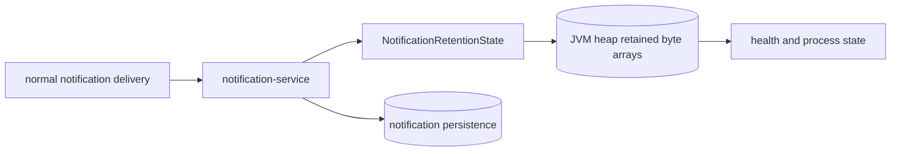

# Notification Heap Pressure

`Scenario: NOTIFICATION_HEAP_PRESSURE`

## Purpose and fixed target

This scenario exercises the normal notification delivery path in `notification-service`. The fixed target operation is `notification-retention`; preparation uses `/internal/notification/retention/prepare`, and normal notification delivery reaches endpoints such as `POST /internal/notifications/payment-result` or `POST /internal/notifications/shipping-created`.

The scenario accepts `durationSec`, `requestIntervalMs` and `retainedBytesPerNotification`. It is intentionally a non-releasing resource scenario.

## Actual implementation

When the retention state is active and the interval permits an allocation, `NotificationRetentionState.shouldRetain()` appends a new `byte[]` to an unbounded `CopyOnWriteArrayList`. `NotificationService.send()` invokes this retention path before saving the notification. Repeated normal notification work can therefore grow live objects in the Notification JVM.



The diagram shows retained memory and the normal persistence path. It does not mean every notification causes an allocation or that an OOM is guaranteed.

## Parameters and lifecycle

The server bounds the retained size and validates `durationSec`. Release clears the active run control state, but it does not clear `retainedObjects`. At expiry or operator stop, the control-plane worker stops new work; retained objects remain until the JVM releases them or the service is restarted.

If the process becomes unhealthy, the run may become `SERVICE_UNAVAILABLE`. The protected restart workflow is separate from this target; the service-local `/internal/notification/restart` endpoint only acknowledges a restart request, while the deployment adapter performs the actual restart.

## Impact and exclusions

Potentially affected resources are:

- The entire `notification-service` JVM heap and garbage collection behavior.
- Notification processing throughput and service health.
- Normal notification requests and persistence while the service remains alive.

The scenario does not automatically release retained objects, delete notification rows or guarantee an OOM. It does not intentionally change unrelated business data. A process exit may affect all notification operations because the resource is service-wide.

## Evidence

- `fault_run_events`: target lifecycle, worker summaries when a real trigger worker is involved, and service-unavailable/restart events.
- JVM: heap usage, GC pressure, health state and container restart evidence are stronger for resource exhaustion than a single request trace.
- Tempo: inspect normal notification HTTP spans and any exception events before the process becomes unavailable.
- Notification metrics: `notification.sent.count` and `notification.fail.count` support workload and failure interpretation.

## Tempo investigation

Use a window covering the run, starting with `now-1h to now`:

```traceql
{ resource.service.name = "notification-service" }
```

For exported OTel errors:

```traceql
{ resource.service.name = "notification-service" && status = error }
```

For slow notification work:

```traceql
{ resource.service.name = "notification-service" && duration > 1s }
```

Inspect notification HTTP spans, exception events, request duration and the timing of health loss. A final trace may be missing when the process exits before export; combine Tempo with JVM metrics, container state, logs and `fault_run_events`.

## Recovery and verification

Confirm new retention work has stopped. If the service remains healthy, verify normal notification delivery. If it is unavailable, use the fixed protected notification restart workflow and wait for health recovery. After restart, verify the retained-object count is reset with the new process and check normal notification processing.

## Alert mapping

| Alert | Trigger condition | Meaning and boundary for this scenario |
| --- | --- | --- |
| `HighHeapUsage` | Heap usage exceeds 85% for 3 minutes | Indicates that retained objects have created significant JVM pressure. |
| `CriticalHeapUsage` | Heap usage exceeds 95% for 1 minute | Indicates near-exhaustion and possible OOM. |
| `FrequentGCPause` | Major GC rate exceeds 0.1 per second for 3 minutes | Indicates that heap pressure is affecting GC behavior. |
| `HighLatencyP99`, `CriticalLatencyP99`, `HighErrorRate`, `NodeHighMemory` | Request latency, 5xx ratio or node memory reaches the relevant rule threshold | May appear when JVM pressure spreads to request or node resources. |
| `ServiceDown` | Business-service `up == 0` for 1 minute | May fire after the process loses its health signal; retention, OOM, alert timing and the final trace are not guaranteed. |

## Limits and safe interpretation

The code proves unbounded retention while active, not that a particular heap size, OOM, alert or recovery time will occur. Release is non-releasing by design. The control-plane `traceId` and `X-Trace-Id` are business correlation values and cannot be used as verified Tempo trace IDs.