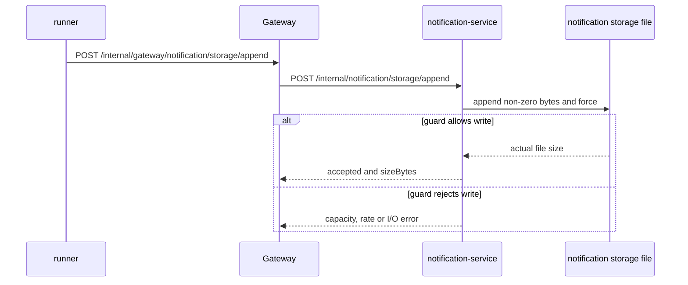

# Notification Storage Append

`Scenario: NOTIFICATION_STORAGE_APPEND`

## Purpose and fixed target

This scenario grows real storage in `notification-service` through a dedicated target API. The fixed target operation is `notification-storage`; preparation uses `/internal/notification/storage/prepare`, and the runner calls `POST /internal/gateway/notification/storage/append`, which forwards to `POST /internal/notification/storage/append`. It does not create payment, order or shipping traffic.

The parameters are `durationSec`, `requestIntervalMs`, `totalBytes`, `appendBytes` and `minFreeBytes`. The file is named with the run ID so cleanup can be scoped to a `faultRunId`.

## Actual implementation

The dedicated append endpoint validates the operation context and calls `NotificationStorageGrowthWriter`. The runner repeats the endpoint at `requestIntervalMs` until the file reaches `totalBytes`, the run expires, or a guard fails. Each request appends non-zero bytes to `<storage-growth-path>/<faultRunId>.bin` through a `FileChannel` and calls `force(true)`. Each append uses `appendBytes`, checks the file system's usable space against `minFreeBytes`, and can raise `STORAGE_APPEND_RATE_LIMIT`, `STORAGE_CAPACITY_GUARD` or `STORAGE_APPEND_FAILED`. No normal notification, order, payment or shipping row is created by this target.



The appended bytes are real file-system writes. The configured path must be backed by the storage volume whose growth is being observed.

## Parameters and lifecycle

The target validates byte values, total file size, minimum free-space guard and duration. Release stops new appends but does not delete the file. The catalog strategy is `MANUAL_CLEANUP`; a later protected cleanup deletes only `<faultRunId>.bin`. Expiry stops additional writes, but the file remains until cleanup. A final append may be smaller than `appendBytes` so the file reaches `totalBytes` exactly.

## Impact and exclusions

Potentially affected resources are:

- The notification-service storage volume and its available space.
- The run-scoped file at the configured storage-growth path.
- The dedicated storage append endpoint and its file-system I/O.

The implementation writes only inside the configured storage-growth directory and does not intentionally write arbitrary tables or paths. It does not call the normal notification delivery APIs or guarantee that the node, volume quota or alert thresholds will permit the full target size. Unrelated files, orders, payments, shipments and notification rows are outside this target.

## Evidence

- `fault_run_events`: lifecycle and manual-cleanup events identify the run and cleanup result.
- Application errors: `STORAGE_APPEND_RATE_LIMIT`, `STORAGE_CAPACITY_GUARD` and `STORAGE_APPEND_FAILED` identify rate, capacity and file-write outcomes.
- Metrics: notification service request/error metrics show the dedicated append endpoint outcome; normal notification counters are not the growth signal.
- File system: inspect the run file size, `df`/node storage metrics and the cleanup response's `deletedBytes`.
- Database: no database row is required for an accepted append.
- Tempo: inspect the dedicated append HTTP span and exception events around accepted and rejected writes.

## Tempo investigation

Search `notification-service` over a time range covering the run:

```traceql
{ resource.service.name = "notification-service" }
```

For errors:

```traceql
{ resource.service.name = "notification-service" && status = error }
```

For slow append requests:

```traceql
{ resource.service.name = "notification-service" && duration > 1s }
```

Inspect the Gateway and notification append HTTP spans, file-write exception events and response envelope. A guard may be returned through an application envelope, so HTTP status alone is insufficient.

## Recovery and verification

Confirm release stopped new append requests, then use the fixed run-ID cleanup operation when authorized. Verify the returned `deletedBytes` and that the run file is gone. Confirm unrelated files and normal notification delivery remain unaffected.

## Alert mapping

| Alert | Trigger condition | Meaning and boundary for this scenario |
| --- | --- | --- |
| `NodeDataFilesystemGrowthRateHigh` | `/data` available space decreases faster than 2 MiB per second for 1 minute | The direct file append can trigger this when the mounted path maps to `/data` and the rate is high enough. |
| `NodeDataFilesystemUsageHigh` | `/data` available space falls below 30% (utilization exceeds 70%) for 3 minutes | Requires physical filesystem utilization to reach the threshold. |
| `HighErrorRate` | Append endpoint 5xx ratio reaches the relevant rule threshold | Requires actual Gateway/notification HTTP 5xx responses and the URI ratio threshold. |
| No guaranteed dedicated alert | Not applicable | `totalBytes` and `appendBytes` are physical file target/chunk parameters, but alerts still depend on the mounted volume, growth rate and thresholds; correlate run events, file size, node metrics and Tempo. |

## Limits and safe interpretation

`appendBytes` is the minimum physical file append size, not a database payload size. `totalBytes` is the target size of the run file, subject to usable space, volume quotas and I/O errors. Cleanup is intentionally manual and scoped by run identity. In Compose the default path is bind-mounted from `./data/notification-service`; in Kubernetes it is an `emptyDir` volume and is lost when the pod is removed. `fault_runs.trace_id` and `X-Trace-Id` are business correlation values, not Tempo trace IDs.