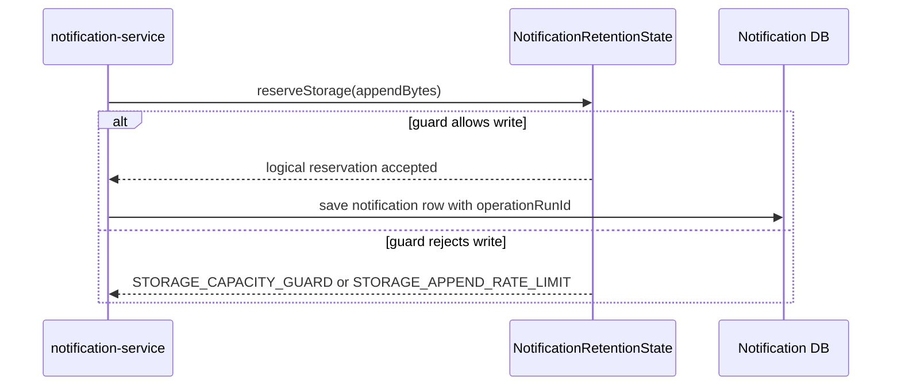

# Notification Storage Append

`Scenario: NOTIFICATION_STORAGE_APPEND`

## Purpose and fixed target

This scenario exercises normal notification persistence in `notification-service`. The fixed target operation is `notification-storage`; preparation uses `/internal/notification/storage/prepare`, and normal notification delivery supplies the write path.

The parameters are `durationSec`, `requestIntervalMs`, `totalBytes`, `appendBytes` and `minFreeBytes`. Storage records are associated with the run so that cleanup can be scoped to a `faultRunId`.

## Actual implementation

`NotificationRetentionState.reserveStorage()` increments an in-memory logical byte reservation for an accepted notification. Rate and capacity guards can raise `STORAGE_APPEND_RATE_LIMIT` or `STORAGE_CAPACITY_GUARD`. `NotificationService.send()` saves an ordinary notification row and tags it with `operationRunId` while the storage operation is active.



This is a logical reservation plus an ordinary database insert. It is not a promise that physical disk space is filled.

## Parameters and lifecycle

The target validates byte values, total budget, minimum free-space guard and duration. Release stops the active logical operation but does not delete rows. The catalog strategy is `MANUAL_CLEANUP`; a later protected cleanup uses the run ID to delete only rows owned by that run. Expiry stops additional writes according to the target lifecycle, but retained rows remain until cleanup.

## Impact and exclusions

Potentially affected resources are:

- Normal notification persistence transactions and their latency/failure rate.
- In-memory logical byte accounting and notification rows tagged by `operationRunId`.
- Notification-service database capacity used by those rows.

The implementation does not prove physical disk exhaustion and does not intentionally write arbitrary tables or paths. It does not automatically delete generated rows at expiry. Unrelated notification rows should not be included in run-scoped cleanup.

## Evidence

- `fault_run_events`: lifecycle and manual-cleanup events identify the run and cleanup result.
- Application errors: `STORAGE_APPEND_RATE_LIMIT` and `STORAGE_CAPACITY_GUARD` identify logical guards.
- Metrics: `notification.sent.count` and `notification.fail.count` show normal persistence outcomes.
- Database: inspect notification rows carrying `operationRunId` and the deletion count from `deleteByOperationRunId`.
- Tempo: inspect notification HTTP and JDBC spans around accepted and rejected writes.

## Tempo investigation

Search `notification-service` over a time range covering the run:

```traceql
{ resource.service.name = "notification-service" }
```

For errors:

```traceql
{ resource.service.name = "notification-service" && status = error }
```

For slow persistence requests:

```traceql
{ resource.service.name = "notification-service" && duration > 1s }
```

Inspect the notification HTTP span, JDBC insert span, exception events and response envelope. A logical guard may be returned through an application envelope, so HTTP status alone is insufficient.

## Recovery and verification

Confirm release stopped new reservations, then use the fixed run-ID cleanup operation when authorized. Verify the cleanup count and query for remaining rows associated with that run. Confirm unrelated notification rows remain and normal notification delivery succeeds.

## Alert mapping

| Alert | Trigger condition | Meaning and boundary for this scenario |
| --- | --- | --- |
| `MySQLInnoDBDataWriteRateHigh` | InnoDB write rate exceeds 1 MiB per second for 2 minutes | Fires only when actual database write rate reaches the threshold. |
| `NodeDataFilesystemGrowthRateHigh` | `/data` available space decreases faster than 10 MiB per second for 5 minutes | Requires real filesystem growth; logical reservation is not this metric. |
| `NodeDataFilesystemUsageHigh` | `/data` utilization exceeds 85% for 5 minutes | Requires physical filesystem utilization to reach the threshold. |
| `MySQLSlowQueries`, `HighErrorRate`, Hikari pool alerts | Slow-query rate, 5xx ratio or pool state reaches the relevant rule threshold | `HighErrorRate` requires actual HTTP 5xx responses and the URI ratio threshold; logical capacity protection is usually a business envelope and does not automatically produce `NotificationFailRateHigh`. |
| No guaranteed dedicated alert | Not applicable | `totalBytes` and `appendBytes` are logical reservation parameters, not proof of a full physical disk; correlate run events, notification rows, MySQL/node metrics and Tempo. |

## Limits and safe interpretation

`appendBytes` contributes to a logical reservation; it is not physical file append size and does not prove a disk-full condition. Cleanup is intentionally manual and scoped by run identity. `fault_runs.trace_id` and `X-Trace-Id` are business correlation values, not Tempo trace IDs.