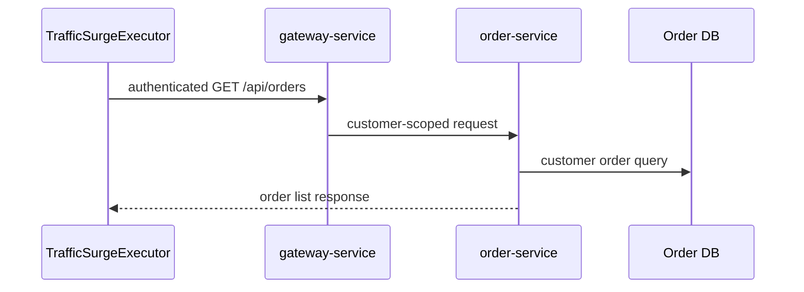

# Customer Order Query Traffic Surge

`Scenario: ORDER_QUERY_SURGE`

## Purpose and fixed target

This scenario generates controlled authenticated traffic for `GET /api/orders`. It targets the normal customer order-list path, not the historical report path. The worker opens a session for an enabled lifecycle account whose expected customer ID is not `19` and sends requests through `gateway-service`.

This is a worker scenario. It does not call Gateway operation prepare or release.

## Actual implementation

`TrafficSurgeExecutor` sends `page=0` and the configured `size=<pageSize>` with the configured `concurrency` and `requestIntervalMs`. `OrderController.listOrders()` delegates to `OrderService.listCustomerOrders()`, which scopes the read to the authenticated customer.



The request producer and session manager live in the control plane. The business trace begins at Gateway and continues into `order-service`.

## Parameters and lifecycle

The catalog accepts `durationSec`, `concurrency`, `requestIntervalMs` and `pageSize`. Stop and expiry abort new requests, wait for or cancel in-flight requests according to the worker contract, and close the customer session through `CustomerSessionManager.closeSession()`.

No business record is created, updated or deleted by this scenario.

## Impact and exclusions

Potentially affected resources are:

- Gateway and order-service request capacity.
- Order DB reads for the selected demonstration customer.
- Latency and connection usage on the customer order-list path.

The query is scoped to one selected non-`19` lifecycle account. It does not target the report endpoint, change the Runner configuration, write orders or intentionally affect other customers. Shared infrastructure can still experience broader resource pressure if capacity is exhausted.

## Evidence

- `fault_run_events`: `SCENARIO_WORKER_STARTED`, `SCENARIO_REQUEST_FAILED`, and `SCENARIO_WORKER_STOPPED` provide request/failure counts, latency percentiles and in-flight state.
- Tempo: inspect the Gateway HTTP span and the authenticated `order-service` HTTP/JDBC spans.
- Application logs: use the normal customer session and business correlation fields to distinguish this traffic from unrelated orders.
- A worker success count proves the client received a response, not that database capacity was unaffected.

## Tempo investigation

Start with a time range covering the run and these service queries:

```traceql
{ resource.service.name = "gateway-service" }
```

```traceql
{ resource.service.name = "order-service" }
```

For errors, add `&& status = error` to the service-specific query. For slow order-list requests:

```traceql
{ resource.service.name = "order-service" && duration > 1s }
```

If confirmed by the deployed agent, refine with:

```traceql
{ resource.service.name = "order-service" && span.http.route = "/api/orders" }
```

Inspect the customer authentication/client span, order-list HTTP span, JDBC query and exception events. Do not search for `traffic-control-plane` as an OTel service.

## Recovery and verification

Confirm `SCENARIO_WORKER_STOPPED`, zero or converging in-flight requests, and a closed customer session. Run a normal customer order-list request after recovery and confirm the regular Runner configuration and order data are unchanged.

## Alert mapping

| Alert | Trigger condition | Meaning and boundary for this scenario |
| --- | --- | --- |
| `HighLatencyP99` | Gateway/order-service request P99 exceeds 5 seconds for 3 minutes | Indicates that controlled order-query traffic has affected request latency. |
| `CriticalLatencyP99` | Gateway/order-service request P99 exceeds 10 seconds for 1 minute | Indicates that request latency has reached the critical level. |
| `HighErrorRate` | The service/URI 5xx ratio exceeds 5% for 2 minutes | Fires only when order-query requests actually return 5xx. |
| `HikariPoolExhaustion`, `HikariPoolFull`, `HikariPoolPending`, `MySQLHighThreads`, `MySQLSlowQueries` | Pool, MySQL connection count or slow-query rate reaches the relevant rule threshold | May occur when query traffic expands into database resources. |
| `NodeHighCPU`, `NodeHighMemory` | Node CPU or memory reaches the relevant rule threshold | Fires only when shared infrastructure crosses a threshold. |
| `OrderFailureRateHigh` | Order-creation failure ratio exceeds 10% for 2 minutes | This scenario does not directly trigger it; shared-resource impact must reach the order-creation path. |

## Limits and safe interpretation

This scenario is controlled normal traffic, not a guaranteed order-service failure. The selected account’s order count, database statistics, concurrent business traffic and resource limits determine the result. It targets `GET /api/orders`; `ORDER_REPORT_SQL` is a separate `GET /api/reports/order-query` path. The displayed `traceId` values are not verified OTel trace IDs.