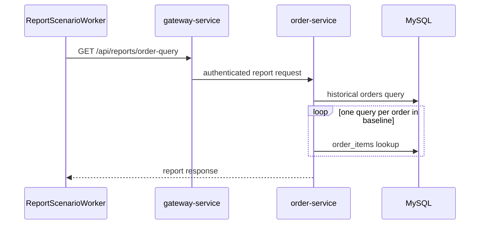

# Customer Order Report SQL

`Scenario: ORDER_REPORT_SQL`

## Purpose and fixed target

This scenario exercises the customer order report in `order-service`. The fixed target operation is `orders-query-report`; the report worker repeatedly calls authenticated `GET /api/reports/order-query` through `gateway-service`.

Gateway preparation and release use `/internal/orders/reports/order-query/prepare` and `/release`. The operation controller acknowledges the fixed context. It does not inject a delay or alter the SQL at request time.

## Actual implementation

When `REPORTS_OPTIMIZED=false`, `OrderService.queryReportBaseline()` loads all historical orders for the selected customer and then calls `OrderItemRepository.findByOrderIdOrderByIdAsc()` once per order. This produces an application-level N+1 read pattern. The optimized implementation uses a current-day filter and a single aggregate/projection query.

The worker selects an enabled lifecycle account whose expected customer ID is not `19`, opens a customer session, sends a report request, records the result and latency, and repeats until the run expires or is stopped.



The sequence shows why the baseline can create more database work as the customer order history grows. It does not imply that every deployment will cross a fixed latency threshold.

## Parameters and lifecycle

The catalog requires `durationSec`. The report worker owns the repeated calls and stops at `expiresAt` or operator stop. The coordinator releases the fixed target, and the worker closes the temporary customer session during its finalization path.

The scenario only reads orders and order items. It does not update orders, order items, payments or customer records.

## Impact and exclusions

Potentially affected resources are:

- The selected demonstration customer order-report requests.
- `order-service` JDBC connections and MySQL reads from `orders` and `order_items`.
- Report latency and database query count for the selected customer.

The scenario does not intentionally read another customer’s data, write business records, authorize payments or change the regular Runner configuration. The actual load depends on the selected account’s order history, indexes and the `REPORTS_OPTIMIZED` setting.

## Evidence

- `fault_run_events`: `REPORT_WORKER_STARTED`, `REPORT_REQUEST`, `REPORT_REQUEST_FAILED`, and `REPORT_WORKER_STOPPED` provide request counts, failures and latency snapshots.
- Tempo: inspect the authenticated report HTTP span and its JDBC children in `order-service`.
- Database: the baseline query and repeated `order_items` lookups are the strongest evidence of the N+1 path; use `EXPLAIN` and query counts in the deployed environment.
- Session evidence: the worker’s customer session is a control-plane mechanism, not a business impact metric.

## Tempo investigation

Use a time range that covers the run, beginning with `now-1h to now`:

```traceql
{ resource.service.name = "order-service" }
```

For recorded OTel errors:

```traceql
{ resource.service.name = "order-service" && status = error }
```

For slow report traces:

```traceql
{ resource.service.name = "order-service" && duration > 2s }
```

If `http.route` is present in the deployed agent output, refine with:

```traceql
{ resource.service.name = "order-service" && span.http.route = "/api/reports/order-query" }
```

Inspect the report HTTP span, the order query, repeated `order_items` JDBC spans and exception events. A handled business error can remain HTTP 200, so combine Tempo with worker events and application logs.

## Recovery and verification

Confirm `REPORT_WORKER_STOPPED`, the coordinator recovery events and closure of the worker customer session. New report requests should stop after the run is recovered. To verify a repair, deploy the date predicate, matching index and aggregate query separately; check that results contain only the intended day and that the JDBC query count and execution plan improve.

## Alert mapping

| Alert | Trigger condition | Meaning and boundary for this scenario |
| --- | --- | --- |
| `HighLatencyP99` | Report-request P99 exceeds 5 seconds for 2 minutes | Indicates slower order-report requests; it does not confirm that the scenario started. |
| `CriticalLatencyP99` | Report-request P99 exceeds 10 seconds for 1 minute | Indicates that report latency has reached the critical level. |
| `MySQLSlowQueries` | Slow-query rate exceeds 0.5 per second for 1 minute | The N+1 reads and historical order scan may produce this signal; the result depends on order volume and database settings. |
| `HikariPoolExhaustion`, `HikariPoolFull`, `HikariPoolPending` | Pool utilization or pending connections reaches the relevant rule threshold | May occur when the larger N+1 read pattern consumes connections. |
| `MySQLHighThreads`, `NodeHighCPU` | MySQL connection count or node CPU reaches the relevant rule threshold | Appears only when pressure spreads to shared resources. |
| No order-report-specific alert | Not applicable | Running the scenario does not guarantee crossing a threshold; correlate `fault_run_events`, Tempo JDBC spans, query counts and MySQL diagnostics. |

## Limits and safe interpretation

This is sustained baseline report traffic, not a guaranteed delay injection. The number of historical orders, database statistics, indexes and the selected lifecycle account determine the observed result. Do not use `fault_runs.trace_id` or `X-Trace-Id` as a Tempo trace ID; use Loki business correlation plus the run time window when necessary.