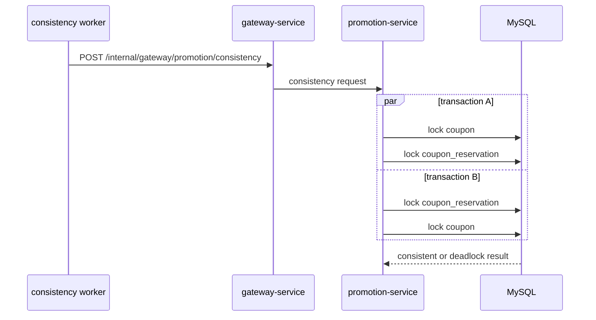

# Promotion Lock Contention

`Scenario: PROMOTION_LOCK_CONTENTION`

## Purpose and fixed target

This scenario exercises the coupon reservation consistency path in `promotion-service`. The fixed target operation is `coupon-reservation-consistency`; preparation uses `/internal/promotion/coupons/reservations/prepare`, and observation is requested through Gateway `POST /internal/gateway/promotion/consistency`.

The catalog accepts `durationSec`, `concurrency` and `requestIntervalMs`. Preparation creates an identifiable expired reservation for the scenario so that unrelated customer coupons are not selected.

## Actual implementation

`CouponReservationConsistencyService.checkReservationConsistency()` starts two real transactions at the same time. One acquires locks in the order `coupon -> coupon_reservation`; the other uses the reverse order `coupon_reservation -> coupon`. The conflicting order can produce MySQL lock contention or a deadlock and an `SQLException`.



The two transactions are limited to prepared scenario data and roll back. The diagram shows the lock order; it does not guarantee that every request will deadlock.

## Parameters and lifecycle

The target validates the run context and keeps the prepared reservation associated with the run. The worker repeatedly calls the fixed consistency operation until expiry or stop. Release stops the run guard and removes the prepared reservation. Remove is the cleanup variant for the same run context.

## Impact and exclusions

Potentially affected resources are:

- The prepared coupon and reservation rows.
- Promotion transactions and the shared MySQL lock manager.
- Consistency requests that wait, fail or complete with increased latency.

The scenario does not intentionally select arbitrary customer coupons, commit business changes or call unrelated service endpoints. Lock wait and deadlock timing are environment-dependent.

## Evidence

- `fault_run_events`: `SCENARIO_WORKER_STARTED`, `SCENARIO_REQUEST_FAILED`, `SCENARIO_WORKER_STOPPED` and recovery events show request outcomes and lifecycle.
- Tempo: inspect Promotion HTTP spans, JDBC spans, duration and exception events.
- Database: inspect deadlock/lock-wait diagnostics and confirm both transactions roll back.
- A successful consistency response such as `{ status: "CONSISTENT" }` proves that one invocation completed; it does not prove that no contention occurred during the run.

## Tempo investigation

Use a time range covering the run, starting with `now-1h to now`:

```traceql
{ resource.service.name = "promotion-service" }
```

For exported errors:

```traceql
{ resource.service.name = "promotion-service" && status = error }
```

For slow consistency requests:

```traceql
{ resource.service.name = "promotion-service" && duration > 1s }
```

Because the observation route is an internal consistency capability, confirm the actual `http.route` in Tempo before narrowing. Inspect both JDBC lock attempts, transaction duration and exception events.

## Recovery and verification

Confirm that new consistency requests stop, the run guard is released and the prepared reservation is removed. Verify normal promotion behavior and inspect the database for no committed business mutation from the consistency check. If necessary, use database lock diagnostics to confirm no transaction remains waiting on the prepared rows.

## Alert mapping

| Alert | Trigger condition | Meaning and boundary for this scenario |
| --- | --- | --- |
| `HighLatencyP99` | Consistency-request P99 exceeds 5 seconds for 3 minutes | Lock waits normally appear as latency before a request timeout. |
| `CriticalLatencyP99` | Consistency-request P99 exceeds 10 seconds for 1 minute | Indicates that lock waits have caused critical request latency. |
| `HighErrorRate` | A deadlock or lock-wait timeout is exposed as HTTP 5xx by the target service or Gateway observation URI, and the corresponding service/URI ratio exceeds 5% for 2 minutes | This is the primary conditional result alert; contention alone does not guarantee it. |
| `HikariPoolExhaustion`, `HikariPoolFull`, `HikariPoolPending`, `MySQLSlowQueries`, `MySQLHighThreads` | The pool or MySQL reaches the relevant rule threshold | May appear when contention spreads to the pool or database. |
| No deadlock/lock-wait-specific alert | Not applicable | Correlate request-failure events, Tempo JDBC spans and MySQL diagnostics. |

## Limits and safe interpretation

The opposing lock order creates a real opportunity for contention, but deadlock, wait duration and victim selection depend on MySQL, the JDBC driver and concurrent load. The scenario is not a general promotion outage. `fault_runs.trace_id` and `X-Trace-Id` remain business correlation values, not verified OTel trace IDs.