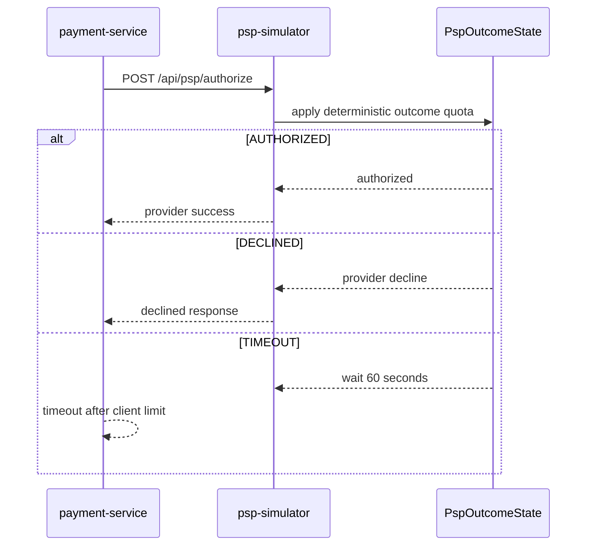

# PSP Provider Outcome

`Scenario: PSP_PROVIDER_OUTCOME`

## Purpose and fixed target

This scenario controls the outcome of the external payment provider simulation used by `payment-service`. The fixed target operation is `provider-outcome`; preparation uses `/internal/psp/provider-outcome/prepare`, and the payment path calls `POST /api/psp/authorize` on `psp-simulator`.

The parameters are `durationSec`, `providerOutcome` (`AUTHORIZED`, `DECLINED` or `TIMEOUT`) and `effectPercentage` from `0` to `100`.

## Actual implementation

`PspOutcomeState.authorize()` applies a deterministic quota based on the authorization count and `effectPercentage`. `AUTHORIZED` continues normally. `DECLINED` returns a provider decline. `TIMEOUT` makes the simulator wait 60 seconds before returning, while the Payment PSP client normally has a 30-second connect/read timeout.



Payment normally observes its own timeout before the simulator’s 60-second response. The actual outcome and client behavior should be checked in the deployed version.

## Parameters and lifecycle

The server validates the provider outcome and percentage. Release clears the active outcome, restores `AUTHORIZED`, resets `effectPercentage` to `100` and resets the authorization counter. Expiry uses the same fixed target release path. The scenario reuses normal payment requests; it does not add a dedicated payment worker.

## Impact and exclusions

Potentially affected resources are:

- PSP authorization calls selected by the deterministic effect quota.
- Payment’s PSP client, payment success/failure handling and timeout behavior.
- Downstream payment/order workflows that depend on authorization.

When `effectPercentage` is below `100`, not every authorization is affected. The scenario does not make `payment-service` a generic target and does not guarantee a decline or timeout for an individual request.

## Evidence

- `fault_run_events`: target confirmation, worker/Runner results and recovery events.
- Tempo: inspect `payment-service` client spans, `psp-simulator` HTTP spans and the authorization response.
- Metrics: `payment.charge.timeout.count` and payment success/failure counters distinguish timeout from decline outcomes.
- Logs/business data: inspect payment status and dependent order/notification events without treating a client timeout as a provider success.

## Tempo investigation

Search both Java services over the run window:

```traceql
{ resource.service.name = "payment-service" }
```

```traceql
{ resource.service.name = "psp-simulator" }
```

For error traces, add `&& status = error` to the service-specific query. For slow authorization calls:

```traceql
{ resource.service.name = "payment-service" && duration > 3s }
```

If route attributes are present in Tempo, narrow the PSP service with:

```traceql
{ resource.service.name = "psp-simulator" && span.http.route = "/api/psp/authorize" }
```

Inspect the Payment client span, PSP server span, response/exception event and timing difference between the 30-second client timeout and the 60-second simulator wait.

## Recovery and verification

Confirm the target release reset the provider outcome and counter. Run a normal authorization and verify `AUTHORIZED` behavior, then check payment and dependent workflow status. For a declined run, verify the expected failed payment state; for timeout, verify the client timeout and timeout metric.

## Alert mapping

| Alert | Trigger condition | Meaning and boundary for this scenario |
| --- | --- | --- |
| `PaymentFailureRateHigh` | Payment-failure ratio exceeds 10% for 1 minute | A `DECLINED` outcome triggers it only with sufficient request volume and ratio. |
| `PaymentTimeoutSpike` | Payment-timeout rate exceeds 0.5 per second for 1 minute | A `TIMEOUT` outcome triggers it when the rate crosses the threshold. |
| `HighLatencyP99`, `CriticalLatencyP99` | Payment/PSP request P99 exceeds 5 seconds for 2 minutes or 10 seconds for 1 minute | PSP timeouts usually increase latency, but crossing the threshold is not guaranteed. |
| `HighErrorRate` | The corresponding URI 5xx ratio exceeds 5% for 1 minute | Fires only when payment or PSP requests actually return 5xx. |
| `CorrelatedServiceDegradation` | Payment-timeout rate is greater than zero for 1 minute | Produces the info-level correlated-degradation alert; `AUTHORIZED` is not expected to produce these result alerts. |
| `OrderFailureRateHigh` | Order-creation failure ratio exceeds 10% for 1 minute | May appear only when the payment result affects the order-creation path. |

## Limits and safe interpretation

Outcome selection is deterministic quota behavior, not random per-request choice. Exact response timing depends on client, network and deployment limits. A stored `traceId` or `X-Trace-Id` is business correlation only and must not be treated as a Tempo trace ID.