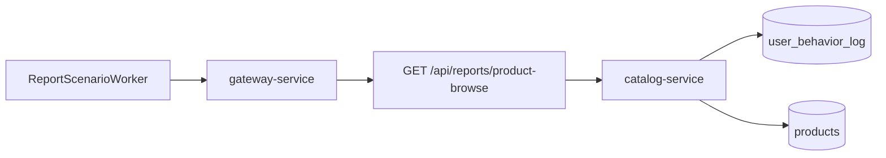

# 商品浏览报表 SQL

`场景：BROWSE_REPORT_SQL`

## 目的与固定目标

本场景通过 `catalog-service` 运行商品浏览报表。固定目标操作为 `products-browse-report`；报表 worker 经 `gateway-service` 持续调用 `GET /api/reports/product-browse`。

目标侧准备入口为 `/internal/catalog/reports/product-browse/prepare`，由 `POST /internal/gateway/operations/prepare` 分发；释放使用对应的 `/release` 入口。这些接口只校验运行上下文并确认接收，不安装人工延迟。

## 实际实现逻辑

`CatalogService.browseReport()` 根据 `REPORTS_OPTIMIZED` 选择 baseline 或 optimized 报表实现。baseline 将 `products` 与匹配的历史 `user_behavior_log` 记录关联、分组并排序，但没有增加当天日期范围；optimized 实现增加当天范围，是后续修复路径。

实际影响来自反复执行真实报表请求，以及 Catalog 和 MySQL 的真实读取。代码没有 `SLEEP()`、伪造计时或 Controller 直接返回报表失败。worker 发起请求、记录结果和延迟，等待约一秒后继续，直到到期或停止。



图表示意请求路径：`ReportScenarioWorker` 调用 Gateway，Gateway 到达 Catalog 报表路由，报表读取 `user_behavior_log` 和 `products`。实际 SQL 和当天条件仍应以部署版本代码为准。

## 参数与生命周期

catalog 要求提供 `durationSec`，并按场景最大值限制。worker 负责循环请求，在 `expiresAt` 到达或运营人员停止后结束。协调器恢复时调用固定目标的 release 入口。

本场景不写入或删除报表数据。恢复动作只是停止后续报表请求，不会自动应用 SQL 优化。

## 影响范围与排除项

可能受到影响的资源包括：

- Catalog 报表请求的延迟和吞吐。
- Catalog JDBC 连接，以及 MySQL 对 `user_behavior_log` 和 `products` 的读取。
- 报表 worker 和其在途请求。

本场景不会主动修改业务数据、订单、支付或其他服务状态。实际影响取决于历史行为数据量、索引、数据库容量和 `REPORTS_OPTIMIZED` 的值。

## 证据与判断

- `fault_run_events`：`REPORT_WORKER_STARTED`、`REPORT_REQUEST`、`REPORT_REQUEST_FAILED` 和 `REPORT_WORKER_STOPPED` 展示 worker 活动、请求计数、失败和延迟。
- Tempo：查看 Catalog 的 HTTP server span 及其 JDBC 子 span。
- 数据库：在目标环境使用 `EXPLAIN` 对比 baseline 和 optimized 的执行计划及扫描行数。
- 成功响应只能证明报表完成，不能证明使用了 optimized 计划。

## Tempo 排障

将时间范围设置为覆盖运行窗口，默认从 `now-1h to now` 开始。先查询目标服务：

```traceql
{ resource.service.name = "catalog-service" }
```

如果请求被记录为 OTel error，再使用：

```traceql
{ resource.service.name = "catalog-service" && status = error }
```

慢报表请求可以从以下阈值开始：

```traceql
{ resource.service.name = "catalog-service" && duration > 2s }
```

如果部署的 agent 暴露了 route 属性，可进一步收窄：

```traceql
{ resource.service.name = "catalog-service" && span.http.route = "/api/reports/product-browse" }
```

检查 HTTP span 延迟、JDBC 子 span、数据库语句形态和 exception event。worker 事件是控制面证据，不是 Tempo span event。

## 恢复与验证

停止或到期后确认 `REPORT_WORKER_STOPPED`、恢复事件以及不再产生新的报表 worker 请求。确认 Catalog 报表接口恢复正常。若要验证优化，应另行部署应用/索引修复，检查日期边界结果正确性以及 `EXPLAIN` 或 `EXPLAIN ANALYZE`；停止本场景不等于完成优化验证。

## 限制与安全解释

场景名称描述的是报表工作负载，不保证一定产生慢查询。实际延迟、扫描量和索引收益取决于预热数据、索引和部署环境。`fault_runs.trace_id` 与 `X-Trace-Id` 是业务关联值，未验证为 OTel trace ID；需要关联单次运行时，应在 Loki 使用该业务值并结合时间窗口。