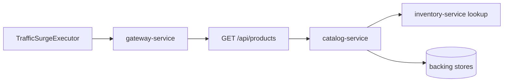

# 商品浏览流量突增

`场景：BROWSE_SURGE`

## 目的与固定目标

本场景为 `GET /api/products` 生成受控的正常流量。请求生产者是控制面的 `TrafficSurgeExecutor`，每个请求经 `gateway-service` 发送，不调用目标侧 prepare 或 release。

每个请求使用 `page=0`、`size=<pageSize>` 和 `sort=latest`；`pageSize` 受 catalog 限制，目前最大为 `100`。

## 实际实现逻辑

`ControlledScenarioWorker` 按配置的 `concurrency` 分批启动请求，并在批次之间等待 `requestIntervalMs`。`TrafficSurgeExecutor` 调用 `GatewayClient.get`，所以请求经过正常 Gateway 和 Catalog 业务链路。`CatalogService.listProducts()` 执行普通商品查询和 DTO 转换，包括转换过程中正常使用的库存查询。



请求生产者属于控制面 worker，但它不是 OTel Java service target。Tempo 应从 `gateway-service` 和实际处理请求的 Java 服务开始查询。

## 参数与生命周期

catalog 接受 `durationSec`、`concurrency`、`requestIntervalMs` 和 `pageSize`。运行到期、人工停止或控制面关闭时，worker 终止新的工作并记录最终快照。该场景没有安装服务侧资源，因此不执行目标 release。

## 影响范围与排除项

可能受到影响的资源包括：

- Gateway 请求吞吐和连接容量。
- Catalog HTTP 处理、商品查询、DTO 转换和下游读取。
- 正常商品列表路径使用的后端数据库/Redis 资源。

本场景不修改 Catalog 数据、不使用客户会话，也不主动针对客户 ID `19`。它不修改正常 Runner 配置；浏览请求本身没有客户认证。

## 证据与判断

- `fault_run_events`：`SCENARIO_WORKER_STARTED`、`SCENARIO_REQUEST_FAILED` 和 `SCENARIO_WORKER_STOPPED` 包含请求、失败、超时、在途数和延迟分位数。
- Tempo：检查 Gateway 和 Catalog 的 HTTP span，再查看其下方 JDBC/Redis/下游 span。
- 指标/日志：Catalog 普通 list 查询计数和服务延迟/健康信号可作辅助证据，但不是场景专属故障指标。
- worker 最终快照证明生成了流量，不保证每个请求都到达业务服务。

## Tempo 排障

使用 `now-1h to now` 或覆盖运行窗口的时间范围。先查询 Gateway：

```traceql
{ resource.service.name = "gateway-service" }
```

再查询 Catalog：

```traceql
{ resource.service.name = "catalog-service" }
```

对于任一服务的 error，在对应 service 查询中增加 `&& status = error`。慢请求可从以下查询开始：

```traceql
{ resource.service.name = "catalog-service" && duration > 1s }
```

若确认 route 属性存在，可进一步使用：

```traceql
{ resource.service.name = "catalog-service" && span.http.route = "/api/products" }
```

检查请求率、HTTP server duration、商品查询 span、下游库存调用和 exception event。控制面 worker 事件不是 Tempo span。

## 恢复与验证

确认 `SCENARIO_WORKER_STOPPED` 且在途数收敛。worker 停止后，正常 `GET /api/products` 应恢复，现有 Runner 配置保持不变。检查 Gateway 和 Catalog 健康状态，并与 worker 停止后的正常延迟比较。

## 告警关联

| 告警 | 触发条件 | 本场景中的含义与边界 |
| --- | --- | --- |
| `HighLatencyP99` | Gateway/Catalog 请求 P99 超过 5 秒，持续 2 分钟 | 说明受控浏览流量已影响请求延迟。 |
| `CriticalLatencyP99` | Gateway/Catalog 请求 P99 超过 10 秒，持续 1 分钟 | 说明请求延迟已达到严重级别。 |
| `HighErrorRate` | 对应服务、URI 的 5xx 比例超过 5%，持续 1 分钟 | 只有浏览请求实际返回 5xx 才触发，生成流量本身不会触发。 |
| `TrafficSurge` | 单个服务/URI 的 5 分钟请求速率超过每秒 10 个请求，且超过其 1 小时平均值的 2 倍，持续 1 分钟 | 直接表示观测到的流量持续增长；应结合 worker 事件判断，因为该告警不能证明每个生成的请求都到达了业务服务。 |
| `HikariPoolExhaustion`、`HikariPoolFull`、`HikariPoolPending`、`MySQLHighThreads`、`MySQLSlowQueries` | 连接池、MySQL 连接数或慢查询达到对应规则阈值 | 流量压力扩大到数据库连接资源时可能出现。 |
| `NodeHighCPU`、`NodeHighMemory`、`RedisHighMemory` | 节点 CPU/内存或 Redis 使用率达到对应规则阈值 | 只有共享基础设施资源越过阈值时才会触发。 |

## 限制与安全解释

本场景是受控流量生成，不是 Catalog fault toggle，也不保证一定产生错误。结果取决于并发、间隔、page size、基线流量和资源容量。控制面 worker 不是可查询的 OTel `service.name`；Tempo 应查询 Gateway 和下游 Java 服务。`X-Trace-Id` 仅用于业务关联。