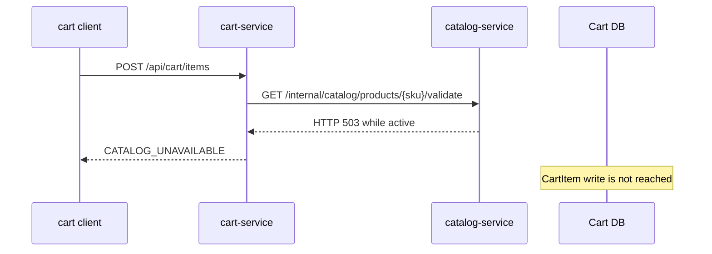

# Cart 到 Catalog 依赖失败

`场景：CART_CATALOG_DEPENDENCY`

## 目的与固定目标

本场景演练加购前的商品校验依赖。固定目标操作为 `cart-product-validation`；准备使用 `/internal/catalog/dependencies/cart-product-validation/prepare`，业务路径是 `cart-service` 的 `POST /api/cart/items`。

## 实际实现逻辑

`CartService.addItem()` 在创建或保存 `CartItem` 前调用 `CatalogProductClient.requireListed()`，请求 `catalog-service` 的 `GET /internal/catalog/products/{sku}/validate`。运行激活期间，`CatalogDependencyState` 使 `CatalogService.validateListedProduct()` 在商品/上架校验边界返回真实 HTTP 503。



这是实际的依赖响应，不是伪造 Cart 返回，也不表示 Catalog 所有接口都不可用。

## 参数与生命周期

catalog 要求 `durationSec`。协调器经 Gateway 发送固定 prepare/release 上下文。release 或 cleanup 清除服务本地 active run 状态。由于失败发生在 Cart/CartItem 持久化前，不需要清理业务数据。

## 影响范围与排除项

可能受到影响的资源包括：

- 状态激活期间的 Cart 加购校验请求。
- Cart 到 Catalog 的 HTTP 依赖及其错误处理。
- 通过正常业务错误边界展示的加购失败。

本场景不会主动写入 Cart 或 CartItem，也不会阻断除商品校验之外的 Catalog API。已有数据不会被删除。校验前的计数器增加不能证明已经写入 `CartItem`。

## 证据与判断

- `fault_run_events`：生命周期和目标确认事件说明固定目标何时激活和恢复。
- Tempo：检查 Cart server span、Catalog client span 和 Catalog 校验 span。
- HTTP/应用：查看依赖边界的 503 以及 Cart 客户端边界的 `CATALOG_UNAVAILABLE`。
- 数据库：验证失败请求没有提交新的 CartItem mutation，不要只依据请求计数器判断。

## Tempo 排障

使用覆盖运行窗口的时间范围，先分别查询两个服务：

```traceql
{ resource.service.name = "cart-service" }
```

```traceql
{ resource.service.name = "catalog-service" }
```

查询 OTel error 时在对应 service 查询中增加 `&& status = error`。依赖慢请求可以使用：

```traceql
{ resource.service.name = "cart-service" && duration > 500ms }
```

如果存在 route 属性，可将 Cart 请求收窄为：

```traceql
{ resource.service.name = "cart-service" && span.http.route = "/api/cart/items" }
```

检查 Cart HTTP span、Catalog client/server span、响应状态、exception event 和事务边界。外层 envelope 的业务 `BizException` 可能仍表现为 HTTP 200，因此还要结合依赖响应和应用日志。

## 恢复与验证

确认 target release/cleanup 事件，且 Catalog dependency state 不再激活。恢复后重试合法加购并确认正常 CartItem mutation；检查其他 Catalog 操作仍可用，失败请求没有创建 CartItem。

## 告警关联

| 告警 | 触发条件 | 本场景中的含义与边界 |
| --- | --- | --- |
| `HighErrorRate` | Catalog 校验 URI 的 5xx 比例超过 5%，持续 2 分钟 | 激活期间 Catalog 校验返回 503 可能触发；外层 Cart 可能包装成业务 envelope 并保持 HTTP 200。 |
| `HighLatencyP99` | 对应请求 P99 超过 5 秒，持续 3 分钟 | 依赖调用变慢并达到阈值时触发。 |
| `CriticalLatencyP99` | 对应请求 P99 超过 10 秒，持续 1 分钟 | 依赖调用延迟达到严重级别时触发。 |
| 无 Cart-to-Catalog 专用告警 | 不适用 | 应将 Prometheus 结果与 Catalog 503、Cart 日志、Tempo client/server span 及 `fault_run_events` 一起判断。 |

## 限制与安全解释

这是服务本地的依赖响应控制，不是完整 Catalog 宕机，也不接受任意下游失败参数。它是单运行状态，不接受用户指定服务、URL 或路径。`fault_runs.trace_id` 和 `X-Trace-Id` 是业务关联值，不是 Tempo trace ID。