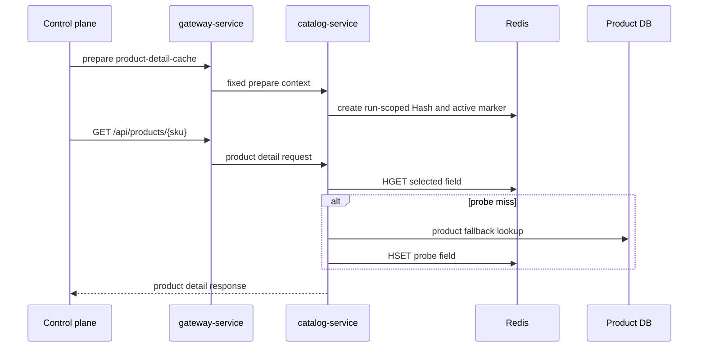

# Catalog Redis 大值

`场景：CATALOG_REDIS_LARGE_VALUE`

## 目的与固定目标

本场景通过运行级 Redis Hash 压测选定的 Catalog 商品详情读取。固定目标操作为 `product-detail-cache`；准备使用 `/internal/catalog/product-details/cache/prepare`，正常业务流量是经 `gateway-service` 的 `GET /api/products/{sku}`。

Catalog 参数包括 `durationSec`、`concurrency`、`requestIntervalMs`、`memberCount`、`memberSizeBytes` 和 `keyTtlSec`。`memberCount` 表示 Hash field 数，不是顶层 key 数，也不是读取并发数。

## 实际实现逻辑

`ProductDetailCacheProvisioningService.start()` 选择可售商品，将合法商品详情 envelope 序列化，并按请求的逻辑大小填充选定 field；随后创建一个运行级 Redis Hash，并发布包含运行身份、fencing token、Hash key 和 probe SKU 的 active marker。worker 通过正常商品详情 API 循环访问准备好的 SKU。

Catalog resolver 根据 active marker 为选定 field 选择运行 Hash。probe field 可以首次 miss，回源商品数据库后写入同一个运行 Hash。整个过程使用真实 Redis 读取、序列化/反序列化和 HTTP 响应。



图表示意运行 Hash 和 probe 回源，不允许任意 Redis key 或 value；所有名称和值均由固定 Catalog 实现生成。

## 参数与生命周期

服务端校验 field 逻辑大小、总预算以及覆盖运行和清理宽限期的 TTL。准备完成后才发布 active marker。停止或到期时，worker 停止新读取，target release 删除 marker 和运行 Hash，并释放操作 guard。Catalog 允许时还可按 `faultRunId` 执行人工 cleanup。

## 影响范围与排除项

可能受到影响的资源包括：

- 选定商品详情请求及其响应延迟。
- Catalog 序列化和读取期间的堆/网络使用。
- 共享 Redis 的内存、查找和网络容量。

本运行使用一个运行级 Hash 和 marker key，不操作任意 Redis key、默认商品缓存或业务数据。probe miss 的商品可能正常回源数据库，这是受控 fallback 路径的一部分。

## 证据与判断

- `fault_run_events`：目标确认和 `SCENARIO_WORKER_TARGET` 标识运行目标；worker 事件包含 cache result 计数和延迟。
- Cache result：`CACHE_HIT`、`CACHE_MISS_DB_FALLBACK`、`CACHE_INVALID_FALLBACK` 和 `CACHE_BACKEND_ERROR` 区分商品详情路径。
- HTTP：详情请求的 `X-Castrel-Cache-Result` 是响应级观察值。
- Catalog 指标：`catalog.product.detail.cache.count` 和 `catalog.product.detail.cache.duration` 支持请求分析。
- Redis：memory usage 和 Redis span 展示后端成本，但不能证明达到了某个物理内存阈值。

## Tempo 排障

使用 `now-1h to now` 或覆盖运行窗口的时间范围，先查询 Catalog：

```traceql
{ resource.service.name = "catalog-service" }
```

查询 OTel error：

```traceql
{ resource.service.name = "catalog-service" && status = error }
```

查询慢详情读取：

```traceql
{ resource.service.name = "catalog-service" && duration > 1s }
```

如果部署 agent 暴露 route，可进一步使用：

```traceql
{ resource.service.name = "catalog-service" && span.http.route = "/api/products/{sku}" }
```

检查 HTTP span、Redis 子 span、序列化/反序列化和 exception event。响应头和控制面 cache counter 应作为独立业务证据使用。

## 恢复与验证

确认 worker 已停止、active marker 不存在、运行 Hash 已删除，并且协调器记录清理/恢复结果。恢复后验证正常商品详情读取使用默认路径，且无关商品数据和缓存 key 仍可用。

## 限制与安全解释

逻辑字节大小是 envelope 预算，不等于 Redis allocator 使用量或物理内存承诺。本场景不是通用 Catalog 故障。TTL 和清理提供边界，但恢复后仍应检查运行专属 key 和 marker。页面显示的 `traceId` 仅为业务关联值，未验证为 OTel trace ID。