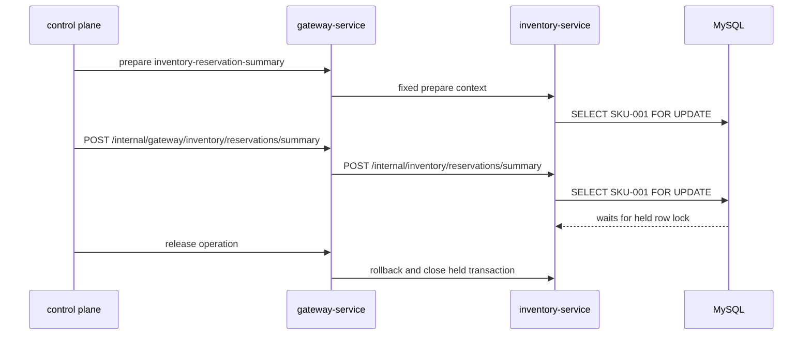

# Inventory 行锁

`场景：INVENTORY_ROW_LOCK`

## 目的与固定目标

本场景在 `inventory-service` 持有一条库存行锁，并观测独立的预留摘要读取。固定目标操作为 `inventory-reservation-summary`；准备使用 `/internal/inventory/reservations/prepare`，固定作用于 `SKU-001` 行。

观测请求为 Gateway 的 `POST /internal/gateway/inventory/reservations/summary`，转发到 `POST /internal/inventory/reservations/summary`。

## 实际实现逻辑

准备阶段打开专用事务并持有以下查询结果：

```sql
SELECT ... FROM inventories WHERE sku = 'SKU-001' FOR UPDATE
```

每次观测在另一条事务中执行相同的行锁查询，直到目标释放或回滚持有的事务之前，都可能等待准备事务。



两条事务使用同一个固定 SKU。这是行级锁路径，不是整张表的锁。

## 参数与生命周期

catalog 接受 `durationSec`、`concurrency` 和 `requestIntervalMs`。专用准备事务在 release、到期 cleanup 或异常路径前保持打开。恢复时 worker 停止新的摘要请求；release 回滚持有事务、关闭连接、清除运行身份/fencing 状态并释放 guard。

## 影响范围与排除项

可能受到影响的资源包括：

- `inventories` 中的 `SKU-001` 行。
- 需要该行锁的事务和库存预留摘要请求。
- Inventory JDBC 连接以及等待请求的延迟。

本场景不会主动持有整张表锁，也不主动锁定其他 SKU。若阻塞工作消耗共享连接或线程容量，影响可能扩大；场景不接受任意 SKU 或 SQL。

## 证据与判断

- `fault_run_events`：worker 启动、请求失败、停止和恢复事件标识受控观测循环。
- Tempo：检查 Inventory HTTP/JDBC span 和预留摘要 duration。
- 数据库：检查行锁等待，并确认释放时持有事务回滚。
- 恢复后成功的摘要响应及 SKU 数量/版本说明读取路径继续推进。

## Tempo 排障

使用覆盖运行窗口的时间范围：

```traceql
{ resource.service.name = "inventory-service" }
```

查询 OTel error：

```traceql
{ resource.service.name = "inventory-service" && status = error }
```

查询等待行锁的摘要调用：

```traceql
{ resource.service.name = "inventory-service" && duration > 1s }
```

在 Tempo 确认 route 后，可进一步收窄：

```traceql
{ resource.service.name = "inventory-service" && span.http.route = "/internal/inventory/reservations/summary" }
```

检查摘要 HTTP span、两次 JDBC 锁查询、duration 和 exception event。由于等待不一定是 OTel error，还需查看数据库锁等待诊断。

## 恢复与验证

确认新的摘要调用停止、持有事务回滚、连接关闭且没有运行遗留的行锁。发起一次正常预留摘要并确认返回；检查没有激活表锁场景，其他 SKU 行也没有被主动持有。

## 告警关联

| 告警 | 触发条件 | 本场景中的含义与边界 |
| --- | --- | --- |
| `HighLatencyP99` | 库存摘要请求 P99 超过 5 秒，持续 3 分钟 | 行锁等待未超时时通常先表现为慢请求。 |
| `CriticalLatencyP99` | 库存摘要请求 P99 超过 10 秒，持续 1 分钟 | 说明行锁等待已造成严重请求延迟。 |
| `HighErrorRate` | 行锁等待超时或数据库异常经 Gateway 观测 URI 以 HTTP 5xx 返回，且 5xx 比例超过 5%，持续 2 分钟 | 这是锁场景的主要条件性结果告警；目标服务业务 envelope 即使 HTTP 200，也可能被 Gateway 转为 502。 |
| `HikariPoolExhaustion`、`HikariPoolFull`、`HikariPoolPending`、`MySQLSlowQueries`、`MySQLHighThreads` | 连接池或 MySQL 达到对应规则阈值 | 并发等待消耗连接或扩大到数据库层时可能出现。 |
| 无行锁等待专用告警 | 不适用 | 应将告警与 `SCENARIO_REQUEST_FAILED`、Tempo exception/JDBC span 和 MySQL 行锁等待诊断关联。 |

## 限制与安全解释

本场景持有固定行锁，不保证固定超时。等待时长取决于 MySQL、JDBC driver 和并发工作。它比 `INVENTORY_TABLE_EXCLUSIVE` 更窄，但共享资源耗尽仍可能扩大运维影响。`X-Trace-Id` 是业务关联值，不是已验证的 Tempo trace ID。