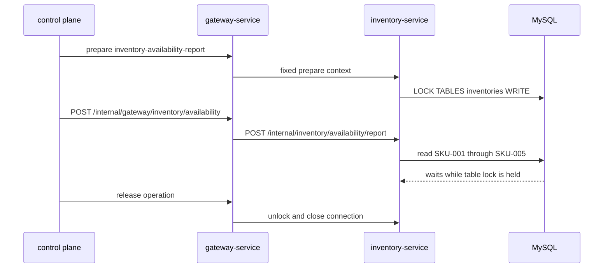

# Inventory 表级排他锁

`场景：INVENTORY_TABLE_EXCLUSIVE`

## 目的与固定目标

本场景在 `inventory-service` 持有写表锁，并观测正常库存读取。固定目标操作为 `inventory-availability-report`；准备使用 `/internal/inventory/availability/prepare`，通过专用 JDBC 连接执行 `LOCK TABLES inventories WRITE`。

观测请求为 Gateway 的 `POST /internal/gateway/inventory/availability`，转发到 `POST /internal/inventory/availability/report`。报表读取固定的五个 SKU：`SKU-001` 到 `SKU-005`。

## 实际实现逻辑

`InventoryAvailabilityService.prepare()` 获取专用连接并执行：

```sql
LOCK TABLES inventories WRITE
```

直到 release 或 cleanup 前，该连接一直持有锁。锁持有期间，观测报表通过另一条路径执行正常读取，因此需要访问 `inventories` 的读写可能等待表锁。



表锁由准备阶段的专用连接持有，而不是由观测请求持有。释放该连接前，不能期待普通读取继续推进。

## 参数与生命周期

catalog 要求 `durationSec`。协调器准备固定目标，目标在 release、到期 cleanup 或异常关闭资源前保持表锁。恢复时 worker 先停止新的观测请求；随后执行 `UNLOCK TABLES`、关闭专用连接、清除运行身份并释放 operation guard。

## 影响范围与排除项

可能受到影响的资源包括：

- 整个 `inventories` 表，包括需要它的无关读写。
- Inventory JDBC 连接和库存可用性报表请求。
- 等待表锁的请求，其延迟或超时取决于配置。

本场景不会主动锁定 `inventories` 以外的表，也不接受任意 SQL、表名或 SKU 列表。它的锁粒度是表，比行锁场景更宽。

## 证据与判断

- `fault_run_events`：目标确认、观测失败、停止和恢复事件。
- Tempo：检查 Inventory HTTP span、JDBC span 和长请求 duration。
- 数据库：使用 lock-wait 或 process-list 诊断观察持有的表锁和阻塞会话。
- 恢复后成功的报表响应及其 rows、`skuCount` 可支持读取路径已恢复的判断。

## Tempo 排障

使用覆盖运行窗口的时间范围：

```traceql
{ resource.service.name = "inventory-service" }
```

查询导出的 error：

```traceql
{ resource.service.name = "inventory-service" && status = error }
```

查询被阻塞的库存报表：

```traceql
{ resource.service.name = "inventory-service" && duration > 1s }
```

如果部署 agent 暴露观测 route，可进一步收窄：

```traceql
{ resource.service.name = "inventory-service" && span.http.route = "/internal/inventory/availability/report" }
```

检查报表 HTTP span、JDBC read、锁等待时长和 exception event。数据库锁诊断是 Tempo 的补充，因为阻塞请求不一定被标记为 OTel error。

## 恢复与验证

确认新的观测调用停止、专用连接执行 `UNLOCK TABLES` 并关闭。然后发起一次正常可用性报表并确认完成，检查没有运行遗留的表锁或等待会话。

## 限制与安全解释

代码证明的是对 `inventories` 的写表锁，不保证固定超时或响应时长。MySQL 和 driver 配置决定阻塞请求等待多久。释放后的成功 trace 比等待固定时间更可靠地说明恢复。