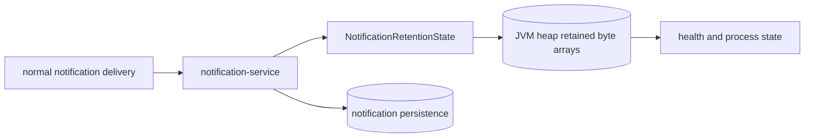

# Notification 堆压力

`场景：NOTIFICATION_HEAP_PRESSURE`

## 目的与固定目标

本场景演练 `notification-service` 的正常通知投递路径。固定目标操作为 `notification-retention`；准备使用 `/internal/notification/retention/prepare`，正常通知请求可经过 `POST /internal/notifications/payment-result` 或 `POST /internal/notifications/shipping-created`。

参数包括 `durationSec`、`requestIntervalMs` 和 `retainedBytesPerNotification`。这是明确的非释放型资源场景。

## 实际实现逻辑

保留状态激活且满足间隔时，`NotificationRetentionState.shouldRetain()` 将新的 `byte[]` 放入无界 `CopyOnWriteArrayList`。`NotificationService.send()` 在保存通知前调用该保留逻辑，因此重复的正常通知工作会让 Notification JVM 中的存活对象增长。



图表示意保留内存和正常持久化路径，不表示每条通知一定分配内存，也不保证必然 OOM。

## 参数与生命周期

服务端限制保留大小并校验 `durationSec`。release 只清除 active run 控制状态，不清空 `retainedObjects`。到期或人工停止时，控制面 worker 停止新工作；已有对象会一直保留，直到 JVM 自行释放或服务重启。

如果进程变为不健康，运行可能进入 `SERVICE_UNAVAILABLE`。受保护的通知重启流程独立于该目标；服务本地 `/internal/notification/restart` 只确认重启请求，实际重启由部署适配器完成。

## 影响范围与排除项

可能受到影响的资源包括：

- 整个 `notification-service` JVM 堆和 GC 行为。
- 通知处理吞吐和服务健康状态。
- 服务仍存活期间的正常通知请求和持久化。

本场景不会自动释放保留对象、删除通知记录，也不保证一定 OOM。它不主动修改无关业务数据；由于资源是服务级的，进程退出可能影响所有通知操作。

## 证据与判断

- `fault_run_events`：目标生命周期、实际触发 worker 的汇总，以及服务不可用/重启事件。
- JVM：堆使用、GC 压力、健康状态和容器重启比单条请求 trace 更能说明资源耗尽。
- Tempo：进程不可用前查看正常通知 HTTP span 和 exception event。
- 通知指标：`notification.sent.count` 和 `notification.fail.count` 辅助解释工作量与失败。

## Tempo 排障

使用覆盖运行窗口的时间范围，默认从 `now-1h to now` 开始：

```traceql
{ resource.service.name = "notification-service" }
```

查询导出的 OTel error：

```traceql
{ resource.service.name = "notification-service" && status = error }
```

查询慢通知处理：

```traceql
{ resource.service.name = "notification-service" && duration > 1s }
```

检查通知 HTTP span、exception event、请求时长和健康状态丢失的时间。进程退出前可能没有导出最后一个 trace，应结合 JVM 指标、容器状态、日志和 `fault_run_events`。

## 恢复与验证

确认新的保留工作已停止。服务仍健康时验证正常通知投递；服务不可用时使用固定的受保护通知重启流程并等待健康恢复。重启后确认新进程的保留对象计数已重置，并验证正常通知处理。

## 告警关联

| 告警 | 触发条件 | 本场景中的含义与边界 |
| --- | --- | --- |
| `HighHeapUsage` | 堆使用率超过 85%，持续 3 分钟 | 表示保留对象已造成明显 JVM 堆压力。 |
| `CriticalHeapUsage` | 堆使用率超过 95%，持续 1 分钟 | 表示接近堆耗尽，可能进一步导致 OOM。 |
| `FrequentGCPause` | Major GC 速率超过 0.1 次/秒，持续 3 分钟 | 表示堆压力已影响 GC 行为。 |
| `HighLatencyP99`、`CriticalLatencyP99`、`HighErrorRate`、`NodeHighMemory` | 请求延迟、5xx 比例或节点内存达到对应规则阈值 | JVM 压力扩大到请求或节点层时可能伴随出现。 |
| `ServiceDown` | 业务服务 `up == 0`，持续 1 分钟 | 进程失去健康信号时可能触发；OOM、告警时间和最后一条 trace 都不保证发生。 |

## 限制与安全解释

代码证明的是激活期间的无界保留，不保证特定堆大小、OOM、告警或恢复时间。release 的非释放行为是设计要求。控制面的 `traceId` 与 `X-Trace-Id` 是业务关联值，不能作为已验证的 Tempo trace ID。