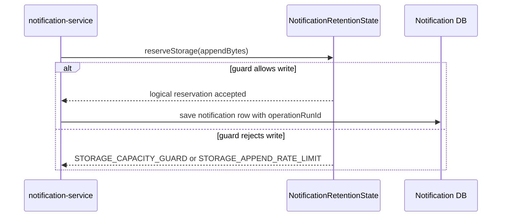

# Notification 存储追加

`场景：NOTIFICATION_STORAGE_APPEND`

## 目的与固定目标

本场景演练 `notification-service` 的正常通知持久化。固定目标操作为 `notification-storage`；准备使用 `/internal/notification/storage/prepare`，写入路径来自正常通知投递。

参数包括 `durationSec`、`requestIntervalMs`、`totalBytes`、`appendBytes` 和 `minFreeBytes`。存储记录带有运行标识，因此可以限定到 `faultRunId` 清理。

## 实际实现逻辑

`NotificationRetentionState.reserveStorage()` 为接收的通知增加内存中的逻辑字节预留。速率和容量保护可能抛出 `STORAGE_APPEND_RATE_LIMIT` 或 `STORAGE_CAPACITY_GUARD`。存储操作激活时，`NotificationService.send()` 保存普通通知行，并写入 `operationRunId`。



这是逻辑预留加普通数据库插入，不等于已经填满物理磁盘。

## 参数与生命周期

目标校验字节值、总预算、最小剩余空间保护和持续时间。release 停止逻辑操作，但不删除已有记录。catalog 策略为 `MANUAL_CLEANUP`；授权的后续清理按运行 ID 只删除该运行拥有的记录。到期会停止后续写入，但已有记录仍需 cleanup。

## 影响范围与排除项

可能受到影响的资源包括：

- 正常通知持久化事务及其延迟/失败率。
- 运行级逻辑字节计数和带 `operationRunId` 的通知行。
- 这些记录占用的 notification-service 数据库容量。

当前实现不能证明物理磁盘耗尽，也不会主动写任意表或路径。到期不会自动删除生成的记录；运行级清理不应包含无关通知记录。

## 证据与判断

- `fault_run_events`：生命周期和人工清理事件标识运行及清理结果。
- 应用错误：`STORAGE_APPEND_RATE_LIMIT` 和 `STORAGE_CAPACITY_GUARD` 标识逻辑保护。
- 指标：`notification.sent.count` 和 `notification.fail.count` 展示正常持久化结果。
- 数据库：检查带 `operationRunId` 的通知行和 `deleteByOperationRunId` 删除数量。
- Tempo：查看接收成功/拒绝写入附近的通知 HTTP/JDBC span。

## Tempo 排障

使用覆盖运行窗口的时间范围查询 `notification-service`：

```traceql
{ resource.service.name = "notification-service" }
```

查询 error：

```traceql
{ resource.service.name = "notification-service" && status = error }
```

查询慢持久化请求：

```traceql
{ resource.service.name = "notification-service" && duration > 1s }
```

检查通知 HTTP span、JDBC insert span、exception event 和响应 envelope。逻辑保护可能通过应用 envelope 返回，因此不能只看 HTTP status。

## 恢复与验证

确认 release 已停止新的逻辑预留；获得授权后使用固定的运行 ID cleanup。核对清理数量，并查询该运行是否仍有记录。确认无关通知记录保留，正常通知投递成功。

## 告警关联

| 告警 | 触发条件 | 本场景中的含义与边界 |
| --- | --- | --- |
| `MySQLInnoDBDataWriteRateHigh` | InnoDB 写入速率超过 1 MiB/秒，持续 1 分钟 | 只有真实数据库写入速率达到阈值时才触发。 |
| `NodeDataFilesystemGrowthRateHigh` | `/data` 可用空间下降速率超过 10 MiB/秒，持续 3 分钟 | 需要真实文件系统持续增长；逻辑预留不等于该指标。 |
| `NodeDataFilesystemUsageHigh` | `/data` 使用率超过 85%，持续 3 分钟 | 需要物理文件系统使用率达到阈值。 |
| `MySQLSlowQueries`、`HighErrorRate`、Hikari 连接池告警 | 慢查询、5xx 比例或连接池达到对应规则阈值 | 只有实际请求以 5xx 返回并满足 URI 错误率阈值时才触发 `HighErrorRate`；逻辑容量保护通常是业务 envelope，不会自动触发 `NotificationFailRateHigh`。 |
| 无必然专用告警 | 不适用 | `totalBytes` 和 `appendBytes` 是逻辑预留参数，不证明物理磁盘已写满；应结合运行事件、通知记录、MySQL/节点指标和 Tempo 判断。 |

## 限制与安全解释

`appendBytes` 只参与逻辑预留，不是物理文件追加大小，也不证明磁盘已满。清理是有意设计为人工且按运行标识限定。`fault_runs.trace_id` 和 `X-Trace-Id` 是业务关联值，不是 Tempo trace ID。