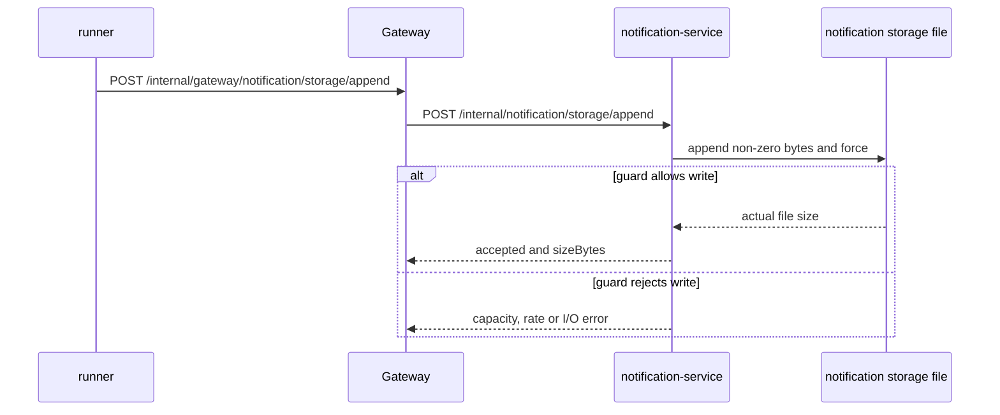

# Notification 存储追加

`场景：NOTIFICATION_STORAGE_APPEND`

## 目的与固定目标

本场景通过专用目标 API 让 `notification-service` 真实增长磁盘存储。固定目标操作为 `notification-storage`；准备使用 `/internal/notification/storage/prepare`，runner 调用 `POST /internal/gateway/notification/storage/append`，再转发到 `POST /internal/notification/storage/append`。它不会创建支付、订单或发货流量。

参数包括 `durationSec`、`requestIntervalMs`、`totalBytes`、`appendBytes` 和 `minFreeBytes`。文件名使用运行 ID，因此可以限定到 `faultRunId` 清理。

## 实际实现逻辑

专用追加接口会先校验运行上下文，再调用 `NotificationStorageGrowthWriter`。runner 按 `requestIntervalMs` 重复调用该接口，直到文件达到 `totalBytes`、运行到期或保护条件拒绝。每次请求使用 `FileChannel` 向 `<storage-growth-path>/<faultRunId>.bin` 追加非零字节，并调用 `force(true)`。每次追加使用 `appendBytes`，同时检查文件系统可用空间是否满足 `minFreeBytes`；可能抛出 `STORAGE_APPEND_RATE_LIMIT`、`STORAGE_CAPACITY_GUARD` 或 `STORAGE_APPEND_FAILED`。该目标不会创建正常通知、订单、支付或发货记录。



追加的是文件系统真实字节。配置的目录必须位于需要观察增长的存储卷上。

## 参数与生命周期

目标校验字节值、文件总大小、最小剩余空间保护和持续时间。release 停止新的文件追加，但不删除文件。catalog 策略为 `MANUAL_CLEANUP`；授权的后续清理只删除 `<faultRunId>.bin`。到期会停止后续写入，但文件仍需 cleanup 才会删除。最后一次追加可能小于 `appendBytes`，以便文件精确达到 `totalBytes`。

## 影响范围与排除项

可能受到影响的资源包括：

- notification-service 存储卷及其可用空间。
- 配置的 storage-growth 目录下的运行专属文件。
- 专用存储追加接口及其文件系统 I/O。

当前实现只写入配置的 storage-growth 目录，不会主动写任意表或路径，也不会调用正常通知投递接口。它不能保证节点、卷配额或告警阈值一定允许达到目标大小。订单、支付、发货、无关文件和通知记录不属于该目标。

## 证据与判断

- `fault_run_events`：生命周期和人工清理事件标识运行及清理结果。
- 应用错误：`STORAGE_APPEND_RATE_LIMIT`、`STORAGE_CAPACITY_GUARD` 和 `STORAGE_APPEND_FAILED` 分别标识速率、容量和文件写入结果。
- 指标：通知服务的追加接口请求/错误指标展示专用目标结果；正常通知计数不是增长信号。
- 文件系统：检查运行文件大小、`df`/节点存储指标和 cleanup 返回的 `deletedBytes`。
- 数据库：成功追加不要求创建数据库行。
- Tempo：查看专用追加 HTTP span 和写入成功/拒绝附近的异常事件。

## Tempo 排障

使用覆盖运行窗口的时间范围查询 `notification-service`：

```traceql
{ resource.service.name = "notification-service" }
```

查询 error：

```traceql
{ resource.service.name = "notification-service" && status = error }
```

查询慢追加请求：

```traceql
{ resource.service.name = "notification-service" && duration > 1s }
```

检查 Gateway 和通知追加 HTTP span、文件写入 exception event 和响应 envelope。保护错误可能通过应用 envelope 返回，因此不能只看 HTTP status。

## 恢复与验证

确认 release 已停止新的追加请求；获得授权后使用固定的运行 ID cleanup。核对返回的 `deletedBytes`，并确认运行文件已删除。确认无关文件保留，正常通知投递不受影响。

## 告警关联

| 告警 | 触发条件 | 本场景中的含义与边界 |
| --- | --- | --- |
| `NodeDataFilesystemGrowthRateHigh` | `/data` 可用空间下降速率超过 2 MiB/秒，持续 1 分钟 | 直接文件追加路径映射到 `/data` 且增长速率足够高时可能触发。 |
| `NodeDataFilesystemUsageHigh` | `/data` 可用空间低于 30%（使用率超过 70%），持续 3 分钟 | 需要物理文件系统使用率达到阈值。 |
| `HighErrorRate` | 追加接口 5xx 比例达到对应规则阈值 | 要求 Gateway/通知追加接口实际返回 HTTP 5xx，并达到 URI 错误率阈值。 |
| 无必然专用告警 | 不适用 | `totalBytes` 和 `appendBytes` 是真实文件目标/块大小，但告警仍取决于挂载卷、增长速率和阈值；应结合运行事件、文件大小、节点指标和 Tempo 判断。 |

## 限制与安全解释

`appendBytes` 是物理文件的最小追加大小，不是数据库 payload 大小。`totalBytes` 是运行文件的目标大小，但仍受可用空间、卷配额和 I/O 错误影响。清理是有意设计为人工且按运行标识限定。Compose 默认目录来自 `./data/notification-service` 的 bind mount；Kubernetes 使用 `emptyDir`，删除 Pod 后文件也会消失。`fault_runs.trace_id` 和 `X-Trace-Id` 是业务关联值，不是 Tempo trace ID。