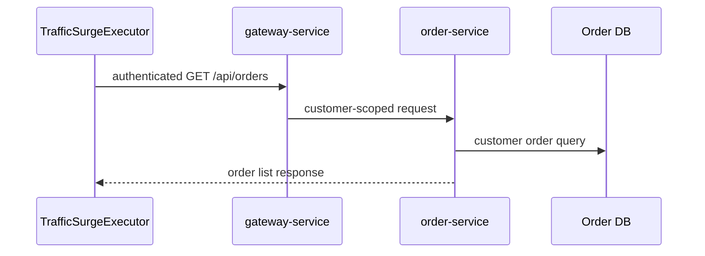

# 客户订单查询流量突增

`场景：ORDER_QUERY_SURGE`

## 目的与固定目标

本场景为 `GET /api/orders` 生成受控的认证流量。它针对正常客户订单列表路径，不是历史报表路径。worker 为一个 `expectedCustomerId` 不为 `19` 的启用 lifecycle account 建立会话，再经 `gateway-service` 发送请求。

这是 worker 场景，不调用 Gateway operation prepare 或 release。

## 实际实现逻辑

`TrafficSurgeExecutor` 使用 `page=0` 和配置的 `size=<pageSize>`，按 `concurrency` 和 `requestIntervalMs` 生成批次。`OrderController.listOrders()` 委托给 `OrderService.listCustomerOrders()`，查询只限定认证客户。



请求生产者和会话管理器位于控制面；业务 trace 从 Gateway 开始，并继续进入 `order-service`。

## 参数与生命周期

catalog 接受 `durationSec`、`concurrency`、`requestIntervalMs` 和 `pageSize`。停止或到期时，worker 按契约终止新的请求、等待或取消在途请求，并通过 `CustomerSessionManager.closeSession()` 关闭客户会话。

本场景不创建、更新或删除业务记录。

## 影响范围与排除项

可能受到影响的资源包括：

- Gateway 和 order-service 的请求容量。
- 选定演示客户对应的 Order DB 读取。
- 客户订单列表路径的延迟和连接使用。

查询限定在一个选定的非 `19` lifecycle account。它不调用报表接口、不修改 Runner 配置、不写订单，也不主动影响其他客户；资源耗尽时共享基础设施可能出现更广泛压力。

## 证据与判断

- `fault_run_events`：`SCENARIO_WORKER_STARTED`、`SCENARIO_REQUEST_FAILED` 和 `SCENARIO_WORKER_STOPPED` 提供请求/失败计数、延迟分位数和在途状态。
- Tempo：检查 Gateway HTTP span 和 `order-service` 的认证 HTTP/JDBC span。
- 应用日志：使用正常客户会话和业务关联字段区分本场景流量与普通订单请求。
- worker 成功计数只证明客户端收到响应，不能证明数据库容量没有受到影响。

## Tempo 排障

先使用覆盖运行窗口的时间范围，并分别查询两个服务：

```traceql
{ resource.service.name = "gateway-service" }
```

```traceql
{ resource.service.name = "order-service" }
```

查询 error 时在对应 service 条件增加 `&& status = error`。慢订单列表请求可以使用：

```traceql
{ resource.service.name = "order-service" && duration > 1s }
```

如果已确认部署 agent 暴露该 route，可进一步收窄：

```traceql
{ resource.service.name = "order-service" && span.http.route = "/api/orders" }
```

检查客户认证/客户端 span、订单列表 HTTP span、JDBC 查询和 exception event。不要把 `traffic-control-plane` 作为 OTel service 查询目标。

## 恢复与验证

确认 `SCENARIO_WORKER_STOPPED`、在途请求为零或持续收敛，以及客户会话已关闭。恢复后执行一次正常客户订单列表请求，确认 Runner 配置和订单数据未改变。

## 告警关联

| 告警 | 触发条件 | 本场景中的含义与边界 |
| --- | --- | --- |
| `HighLatencyP99` | Gateway/order-service 请求 P99 超过 5 秒，持续 3 分钟 | 说明受控订单查询流量已影响请求延迟。 |
| `CriticalLatencyP99` | Gateway/order-service 请求 P99 超过 10 秒，持续 1 分钟 | 说明请求延迟已达到严重级别。 |
| `HighErrorRate` | 对应服务、URI 的 5xx 比例超过 5%，持续 2 分钟 | 只有订单查询请求实际返回 5xx 才触发。 |
| `HikariPoolExhaustion`、`HikariPoolFull`、`HikariPoolPending`、`MySQLHighThreads`、`MySQLSlowQueries` | 连接池、MySQL 连接数或慢查询达到对应规则阈值 | 查询流量扩大并占用数据库资源时可能出现。 |
| `NodeHighCPU`、`NodeHighMemory` | 节点 CPU 或内存达到对应规则阈值 | 只有共享基础设施资源越过阈值时才会触发。 |
| `OrderFailureRateHigh` | 订单创建失败比例超过 10%，持续 2 分钟 | 本场景不直接触发；只有共享资源连带影响订单创建路径时才可能出现。 |

## 限制与安全解释

本场景是受控的正常流量，不保证 order-service 一定失败。选定账号的订单数、数据库统计信息、并发业务流量和资源限制决定结果。它针对 `GET /api/orders`；`ORDER_REPORT_SQL` 是独立的 `GET /api/reports/order-query` 路径。页面显示的 `traceId` 不是已验证的 OTel trace ID。