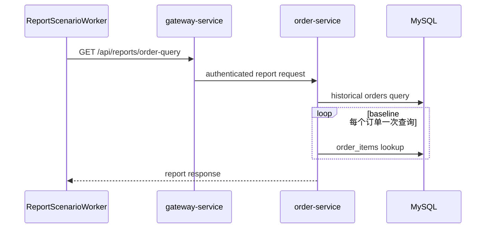

# 客户订单报表 SQL

`场景：ORDER_REPORT_SQL`

## 目的与固定目标

本场景通过 `order-service` 运行客户订单报表。固定目标操作为 `orders-query-report`；报表 worker 经 `gateway-service` 持续调用经过认证的 `GET /api/reports/order-query`。

Gateway 准备和释放使用 `/internal/orders/reports/order-query/prepare` 与 `/release`。操作 Controller 只确认固定上下文，不注入延迟，也不在请求时改写 SQL。

## 实际实现逻辑

当 `REPORTS_OPTIMIZED=false` 时，`OrderService.queryReportBaseline()` 读取选定客户的全部历史订单，然后对每个订单调用一次 `OrderItemRepository.findByOrderIdOrderByIdAsc()`，形成应用层 N+1 读取。optimized 实现增加当天过滤，并使用一次聚合/投影查询。

worker 选择一个 `expectedCustomerId` 不为 `19` 的启用 lifecycle account，建立客户会话，发送报表请求，记录结果和延迟，并持续到运行到期或被停止。



该时序图说明客户历史订单增长时 baseline 可能产生更多数据库工作，不表示所有部署都会超过固定延迟阈值。

## 参数与生命周期

catalog 要求 `durationSec`。报表 worker 负责重复调用，在到期或人工停止时结束。协调器释放固定目标，worker 在 finally 路径关闭临时客户会话。

本场景只读取订单和订单明细，不创建、更新或删除订单、明细、支付或客户记录。

## 影响范围与排除项

可能受到影响的资源包括：

- 选定演示客户的订单报表请求。
- `order-service` JDBC 连接，以及 MySQL 对 `orders` 和 `order_items` 的读取。
- 选定客户报表的延迟和数据库查询次数。

本场景不会主动读取其他客户数据、写业务记录、授权支付或修改正常 Runner 配置。结果取决于选定账号的订单历史、索引和 `REPORTS_OPTIMIZED` 配置。

## 证据与判断

- `fault_run_events`：`REPORT_WORKER_STARTED`、`REPORT_REQUEST`、`REPORT_REQUEST_FAILED` 和 `REPORT_WORKER_STOPPED` 提供请求数、失败数和延迟快照。
- Tempo：检查 `order-service` 的认证报表 HTTP span 及 JDBC 子 span。
- 数据库：baseline 查询和重复的 `order_items` 查询是 N+1 路径的强证据；应在部署环境使用 `EXPLAIN` 和查询统计。
- 客户会话是控制面实现细节，不是业务影响指标。

## Tempo 排障

使用覆盖运行窗口的时间范围，默认从 `now-1h to now` 开始：

```traceql
{ resource.service.name = "order-service" }
```

查询已记录的 OTel error：

```traceql
{ resource.service.name = "order-service" && status = error }
```

查询慢报表 trace：

```traceql
{ resource.service.name = "order-service" && duration > 2s }
```

如果部署 agent 确认存在 `http.route`，可使用：

```traceql
{ resource.service.name = "order-service" && span.http.route = "/api/reports/order-query" }
```

检查报表 HTTP span、订单查询、重复的 `order_items` JDBC span 和 exception event。业务错误可能被包装为 HTTP 200，应结合 worker 事件和应用日志判断。

## 恢复与验证

确认 `REPORT_WORKER_STOPPED`、协调器恢复事件和 worker 客户会话已关闭。运行恢复后不应再有新的报表请求。若要验证修复，应单独部署日期条件、匹配索引和聚合查询，确认结果只包含目标日期，并检查 JDBC 查询次数和执行计划是否改善。

## 告警关联

| 告警 | 触发条件 | 本场景中的含义与边界 |
| --- | --- | --- |
| `HighLatencyP99` | 报表请求 P99 超过 5 秒，持续 2 分钟 | 说明订单报表请求变慢，不是场景启动确认。 |
| `CriticalLatencyP99` | 报表请求 P99 超过 10 秒，持续 1 分钟 | 说明请求延迟已达到严重级别。 |
| `MySQLSlowQueries` | 慢查询速率超过 0.5 次/秒，持续 1 分钟 | N+1 读取和历史订单扫描可能产生该信号，实际取决于订单量和数据库配置。 |
| `HikariPoolExhaustion`、`HikariPoolFull`、`HikariPoolPending` | 连接池使用率或等待连接数达到对应规则阈值 | N+1 读取扩大并占用连接时可能触发。 |
| `MySQLHighThreads`、`NodeHighCPU` | MySQL 连接数或节点 CPU 达到对应规则阈值 | 只有共享资源压力扩散时才会出现。 |
| 无订单报表专用告警 | 不适用 | 场景运行不保证跨过告警阈值；应结合 `fault_run_events`、Tempo JDBC span、查询次数和 MySQL 诊断判断。 |

## 限制与安全解释

本场景是持续 baseline 报表流量，不是保证延迟的注入。历史订单数、数据库统计信息、索引和选定 lifecycle account 决定实际结果。不要将 `fault_runs.trace_id` 或 `X-Trace-Id` 当作 Tempo trace ID；需要关联时使用 Loki 业务关联和运行时间窗口。