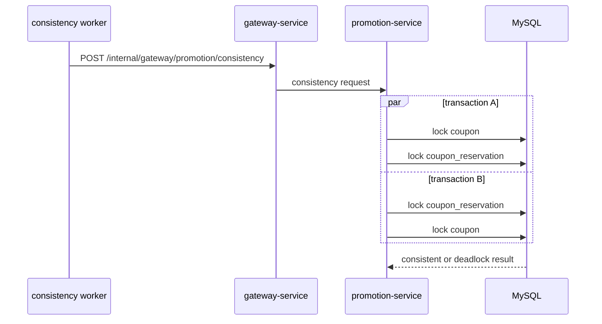

# Promotion 锁竞争

`场景：PROMOTION_LOCK_CONTENTION`

## 目的与固定目标

本场景演练 `promotion-service` 的优惠券预留一致性路径。固定目标操作为 `coupon-reservation-consistency`；准备使用 `/internal/promotion/coupons/reservations/prepare`，观测通过 Gateway 的 `POST /internal/gateway/promotion/consistency` 发起。

catalog 接受 `durationSec`、`concurrency` 和 `requestIntervalMs`。准备阶段会创建可识别的过期预留，避免选中无关客户的优惠券。

## 实际实现逻辑

`CouponReservationConsistencyService.checkReservationConsistency()` 同时启动两条真实事务。一条按 `coupon -> coupon_reservation` 获取锁，另一条按相反的 `coupon_reservation -> coupon` 顺序获取锁。反向顺序可能产生 MySQL 锁竞争、死锁和 `SQLException`。



两条事务只作用于准备好的场景数据并回滚。图表示意加锁顺序，不保证每次请求都会死锁。

## 参数与生命周期

目标校验运行上下文，并将准备预留与运行关联。worker 在到期或停止前持续调用固定一致性能力。release 停止 run guard 并删除准备预留；remove 是同一运行上下文的清理变体。

## 影响范围与排除项

可能受到影响的资源包括：

- 准备好的优惠券和预留行。
- Promotion 事务及共享 MySQL 锁管理器。
- 可能等待、失败或延迟上升的一致性请求。

本场景不会主动选取任意客户优惠券、提交业务变更或调用无关服务接口。锁等待和死锁时机取决于运行环境。

## 证据与判断

- `fault_run_events`：`SCENARIO_WORKER_STARTED`、`SCENARIO_REQUEST_FAILED`、`SCENARIO_WORKER_STOPPED` 和恢复事件展示请求结果与生命周期。
- Tempo：检查 Promotion HTTP span、JDBC span、duration 和 exception event。
- 数据库：查看 deadlock/lock-wait 诊断，并确认两条事务回滚。
- `{ status: "CONSISTENT" }` 之类的成功响应只能证明一次调用完成，不能证明运行期间没有发生竞争。

## Tempo 排障

使用覆盖运行窗口的时间范围，默认从 `now-1h to now` 开始：

```traceql
{ resource.service.name = "promotion-service" }
```

查询导出的 error：

```traceql
{ resource.service.name = "promotion-service" && status = error }
```

查询慢一致性请求：

```traceql
{ resource.service.name = "promotion-service" && duration > 1s }
```

观测接口属于内部一致性能力；在 Tempo 中确认实际 `http.route` 后再收窄。检查两次 JDBC 加锁、事务时长和 exception event。

## 恢复与验证

确认新的一致性请求停止、run guard 已释放、准备预留已删除。验证正常 Promotion 行为，并检查一致性核对没有提交业务变更。必要时使用数据库锁诊断确认没有运行遗留的等待事务。

## 限制与安全解释

反向锁顺序创造了真实竞争机会，但死锁、等待时长和受害事务由 MySQL、JDBC driver 与并发负载决定。本场景不是通用 Promotion 宕机。`fault_runs.trace_id` 和 `X-Trace-Id` 是业务关联值，不是已验证的 OTel trace ID。