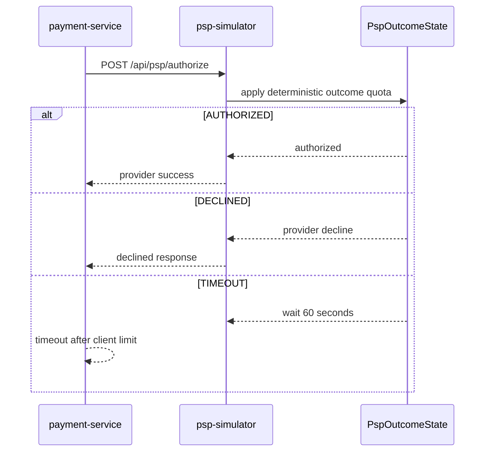

# PSP Provider 结果

`场景：PSP_PROVIDER_OUTCOME`

## 目的与固定目标

本场景控制 `payment-service` 使用的外部支付服务模拟器结果。固定目标操作为 `provider-outcome`；准备使用 `/internal/psp/provider-outcome/prepare`，支付路径调用 `psp-simulator` 的 `POST /api/psp/authorize`。

参数包括 `durationSec`、`providerOutcome`（`AUTHORIZED`、`DECLINED` 或 `TIMEOUT`）和 `0` 到 `100` 的 `effectPercentage`。

## 实际实现逻辑

`PspOutcomeState.authorize()` 根据授权计数和 `effectPercentage` 计算确定性配额。`AUTHORIZED` 正常继续；`DECLINED` 返回 provider decline；`TIMEOUT` 让模拟器等待 60 秒再返回，而 Payment PSP client 通常只有 30 秒连接/读取超时。



Payment 通常会先于模拟器的 60 秒响应在客户端超时。实际结果和客户端行为应以部署版本为准。

## 参数与生命周期

服务端校验 provider outcome 和百分比。release 清除 active outcome，恢复 `AUTHORIZED`，将 `effectPercentage` 恢复为 `100` 并重置授权计数。到期使用相同的固定 target release。场景复用正常支付请求，不新增专用支付 worker。

## 影响范围与排除项

可能受到影响的资源包括：

- 按确定性配额选中的 PSP 授权请求。
- Payment PSP client、支付成功/失败处理和超时行为。
- 依赖授权结果的后续支付/订单流程。

当 `effectPercentage` 小于 `100` 时，不是每次授权都会受到影响。本场景不把 `payment-service` 作为通用目标，也不保证单个请求一定拒付或超时。

## 证据与判断

- `fault_run_events`：目标确认、Runner 结果和恢复事件。
- Tempo：查看 `payment-service` client span、`psp-simulator` HTTP span 和授权响应。
- 指标：`payment.charge.timeout.count` 以及支付成功/失败计数区分超时和拒付。
- 日志/业务数据：查看支付状态和后续订单/通知事件，不要把客户端超时当作 provider 成功。

## Tempo 排障

使用覆盖运行窗口的时间范围，分别查询两个 Java 服务：

```traceql
{ resource.service.name = "payment-service" }
```

```traceql
{ resource.service.name = "psp-simulator" }
```

查询 error 时在对应 service 条件中增加 `&& status = error`。慢授权请求可以使用：

```traceql
{ resource.service.name = "payment-service" && duration > 3s }
```

如果 Tempo 存在 route 属性，可将 PSP 查询收窄为：

```traceql
{ resource.service.name = "psp-simulator" && span.http.route = "/api/psp/authorize" }
```

检查 Payment client span、PSP server span、响应/exception event，以及 30 秒客户端超时和 60 秒模拟等待之间的时间差。

## 恢复与验证

确认 target release 已重置 provider outcome 和计数器。运行一次正常授权并确认 `AUTHORIZED` 行为，再检查支付和后续流程状态。拒付运行应验证预期的失败支付状态；超时运行应验证客户端超时和 timeout 指标。

## 告警关联

| 告警 | 触发条件 | 本场景中的含义与边界 |
| --- | --- | --- |
| `PaymentFailureRateHigh` | 支付失败比例超过 10%，持续 2 分钟 | `DECLINED` 结果达到足够请求量和比例时触发。 |
| `PaymentTimeoutSpike` | 支付超时速率超过 0.5 次/秒，持续 2 分钟 | `TIMEOUT` 结果达到速率阈值时触发。 |
| `HighLatencyP99`、`CriticalLatencyP99` | 支付/PSP 请求 P99 分别超过 5 秒持续 3 分钟、超过 10 秒持续 1 分钟 | PSP 超时通常会增加请求延迟，但不保证越过阈值。 |
| `HighErrorRate` | 对应 URI 的 5xx 比例超过 5%，持续 2 分钟 | 只有支付或 PSP 请求实际以 5xx 返回才触发。 |
| `CorrelatedServiceDegradation` | 支付超时速率大于零，持续 1 分钟 | 触发信息级关联退化告警；`AUTHORIZED` 预期不触发上述结果告警。 |
| `OrderFailureRateHigh` | 订单创建失败比例超过 10%，持续 2 分钟 | 只有支付结果连带影响订单创建路径时才可能出现。 |

## 限制与安全解释

结果选择是确定性配额，不是每个请求随机选择。具体响应时间取决于客户端、网络和部署限制。保存的 `traceId` 或 `X-Trace-Id` 仅用于业务关联，不能当作 Tempo trace ID。